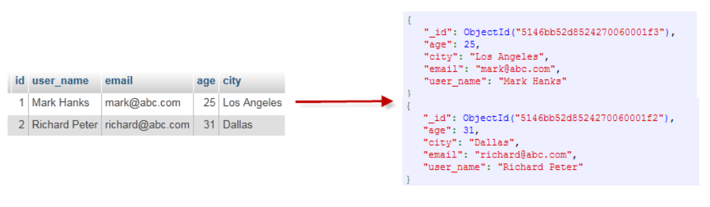
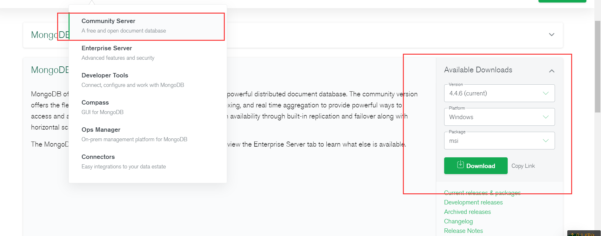
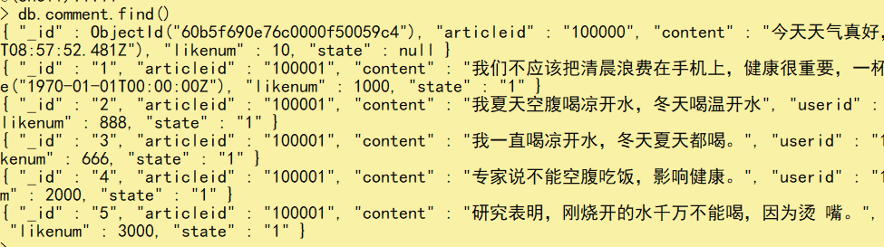
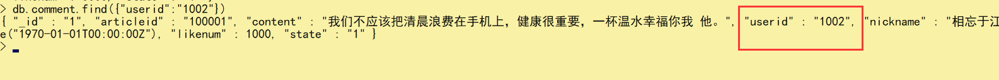
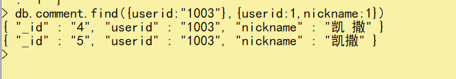
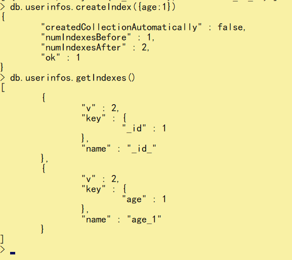
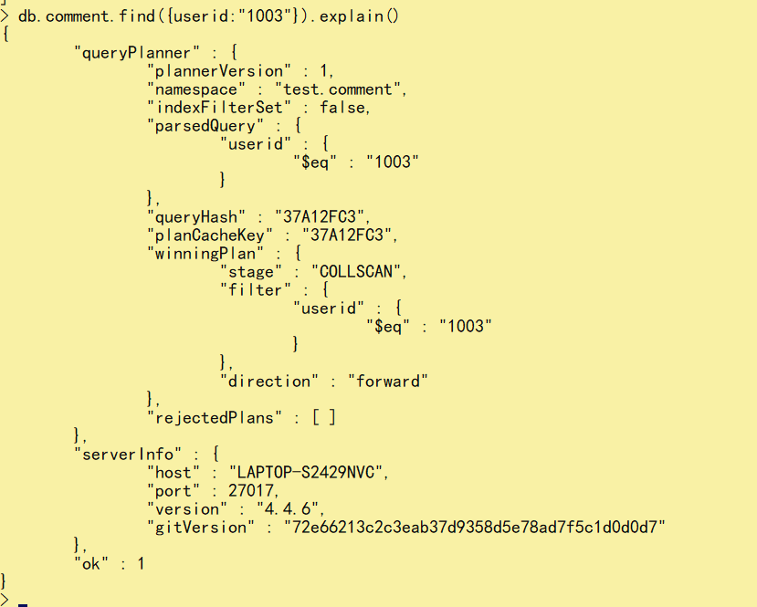
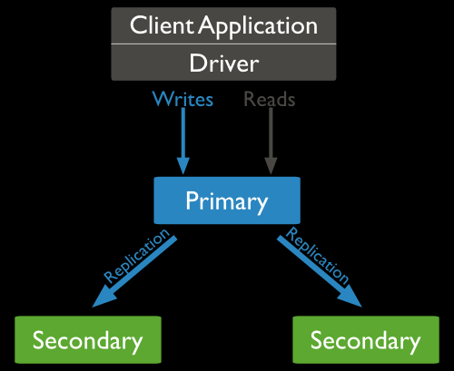
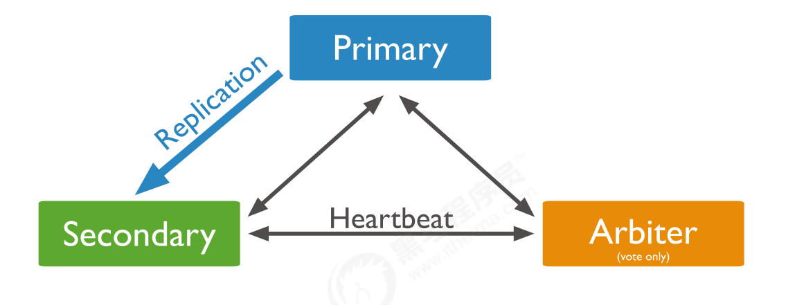

<h1>MongoDB</h1>


# 目录

[TOC]


---------------


# 一、简介

## 1.1：什么是MongoDB


MongoDB是一个开源、高性能、无模式的文档型数据库，当初的设计就是用于简化开发和方便扩展，是NoSQL数据库产品中的一种。是最像关系型数据库（MySQL）的非关系型数据库。

它支持的数据结构非常松散，是一种类似于 JSON 的 格式叫BSON，所以它既可以存储比较复杂的数据类型，又相当的灵活MongoDB中的记录是一个文档，它是一个由字段和值对（fifield:value）组成的数据结构。MongoDB文档类似于JSON对象，即一个文档认为就是一个对象。字段的数据类型是字符型，它的值除了使用基本的一些类型外，还可以包括其他文档、普通数组和文档数组。


## 1.2：数据类型


MongoDB的最小存储单位就是文档(document)对象。文档(document)对象对应于关系型数据库的行。数据在MongoDB中以BSON（Binary-JSON）文档的格式存储在磁盘上。

BSON（Binary Serialized Document Format）是一种类json的一种二进制形式的存储格式，简称Binary JSON。BSON和JSON一样，支持内嵌的文档对象和数组对象，但是BSON有JSON没有的一些数据类型，如Date和BinData类型。

BSON采用了类似于 C 语言结构体的名称、对表示方法，支持内嵌的文档对象和数组对象，具有轻量性、可遍历性、高效性的三个特点，可以有效描述非结构化数据和结构化数据。这种格式的优点是灵活性高，但它的缺点是空间利用率不是很理想。

Bson中，除了基本的JSON类型：string,integer,boolean,double,null,array和object，mongo还使用了特殊的数据类型。这些类型包括date,object id,binary data,regular expression 和code。每一个驱动都以特定语言的方式实现了这些类型，查看你的驱动的文档来获取详细信息。

BSON数据类型参考列表：


| SQL术语/概念 | MongoDB术语/概念 | 解释/说明                           |
| :----------- | :--------------- | :---------------------------------- |
| database     | database         | 数据库                              |
| table        | collection       | 数据库表/集合                       |
| row          | document         | 数据记录行/文档                     |
| column       | field            | 数据字段/域                         |
| index        | index            | 索引                                |
| table joins  |                  | 表连接,MongoDB不支持                |
| primary key  | primary key      | 主键,MongoDB自动将_id字段设置为主键 |


> + 通过下图实例，我们也可以更直观的了解Mongo中的一些概念：





## 1.3：windows安装单机


### 1.下载


第一步：下载安装包

MongoDB 提供了可用于 32 位和 64 位系统的预编译二进制包，你可以从MongoDB官网下载安装，MongoDB 预编译二进制包下载地址：

https://www.mongodb.com/download-center#community

+ MongoDB的版本命名规范如：x.y.z； 
	+ y为奇数时表示当前版本为开发版，如：1.5.2、4.1.13； 
	+ y为偶数时表示当前版本为稳定版，如：1.6.3、4.0.10； 
	+ z是修正版本号，数字越大越好。

详情：http://docs.mongodb.org/manual/release-notes/#release-version-numbers





### 2.安装


傻瓜式安装注意选择路径

注意配置环境变量


### 3.cmd链接


cmd命令行输入：


```bash
mongo
#或者
mongo --host=127.0.0.1 --port=27017
```


查看已经有的数据库:


```bash
show databases
```


退出mogodb:


```ba
exit
```


提示：

MongoDB javascript shell是一个基于javascript的解释器，故是支持js程序的。


## 1.4：Liunx安装单机


https://www.cnblogs.com/lemon-flm/p/11052449.html


# 二、数据库，集合，数据介绍


## 2.1：简介


我们知道，在关系型数据库里面有数据库、数据表、表里面是一行一行的数据。而mongodb是非关系型数据库，它有的是数据库、集合、文档，分别对应关系型里面的数据库、数据表、和表里面一行一行的数据。在mongodb里，文档构成集合，集合构成数据库

1. 文档是mongodb中的基本单元，相当于rdb中的一条记录，通常以json格式显示，以bson格式进行存储；

2. 集合相当于rdb中的表，这里的表没有模式定义；

3. mongodb的每个实例可以包含多个数据库，每个数据库有自己的集合和权限；


## 2.2：文档


+ 多个键值对的有序存放在一起就是文档。

+ 文档中的值可以是字符串，数值类型，还可以是其它的文档；

+ 键是字符串，键可以是任意`UTF-8字符`；

+ 键不能含有`\0`空字符，空字符表示结束；

+ `.`和`$`作为保留字，不能作为键名称中的字符；

+ `_`下划线也不建议作为键名称中的字符；

+ 默认区分大小写；

+ 文档中不允许重复的键；

## 2.3：集合


+ 集合就是一组文档

+ 集合名不能是空字符串“”

+ 集合名不能含有\0空字符

+ 集合名不能以system开头

+ 集合名不能含有$

+ 集合通常以.分开，划分子集合；

## 2.4：数据库


+ 多个集合组成一个数据库，或者一个数据库包含多个实例。

+ 一个实例可以包含多个数据库

+ 一台机器可以启动多个实例，通过指定不同的数据位置，端口号进行区分；

+ 命名必须是utf-8字符，最长64个字符

+ 命名不能包含.,$,/,\和\0等字符，不能作为文件名的字符都不允许作为数据库名。

+ 命名应全部小写。

+ 系统保留数据库：

+ admin,是root数据库，添加用户到该数据库中。

+ local,该库中的数据不会被复制。

+ config，分片时，在内部使用，保存分片信息。

+ 把数据库名和集合名放在一起，用.符号隔开，形成命名空间。命令空间长度不超过121个字符。


# 三、基础命令


## 3.1：数据库操作


### 1.选择/创建数据库


```java
use databaseName
```


如果数据库不存在则自动创建,有则使用


### 2.查看所有的数据库


```java
show databases
    或者
show dbs    
```


### 3.查看当前使用的数据库


```java
db
```


### 4.删除数据库


```java
db.dropDatabase()
```


提示：主要用来删除已经持久化的数据库


### 3.数据库命名规范


数据库名可以是满足以下条件的任意UTF-8字符串。

+ 不能是空字符串（"")。

+ 不得含有' '（空格)、.、$、/、\和\0 (空字符)。

+ 应全部小写。

+ 最多64字节。

有一些数据库名是保留的，可以直接访问这些有特殊作用的数据库。

+ **admin**： 从权限的角度来看，这是"root"数据库。要是将一个用户添加到这个数据库，这个用户自动继承所有数据库的权限。一些特定的服务器端命令也只能从这个数据库运行，比如列出所有的数据库或者关闭服务器。

+ **local:** 这个数据永远不会被复制，可以用来存储限于本地单台服务器的任意集合

+ **confifig**: 当Mongo用于分片设置时，confifig数据库在内部使用，用于保存分片的相关信息


## 3.2：集合操作


> 集合，类似关系型数据库中的表。
>
> 可以显式的创建，也可以隐式的创建。


### 1.显式创建


基本语法格式：


```java
db.createCollection(name)
```


参数说明：

+ name: 要创建的集合名称


例如：创建一个名为 mycollection 的普通集合。


```java
db.createCollection("mycollection")
```


### 2.查看集合


```java
show collections 
或
show tables 
```


### 3.隐式创建


当向一个集合中插入一个文档的时候，如果集合不存在，则会自动创建集合。

详见 文档的插入 章节。

提示：通常我们使用隐式创建文档即可。


### 4.集合删除


```java
db.collection.drop()
```


例如：要删除mycollection集合


```java
db.mycollection.drop()
```


## 3.3：文档操作


> 文档（document）的数据结构和 JSON 基本一样。
>
> 所有存储在集合中的数据都是 BSON 格式。


### 1.单个插入


使用`insert()` 或 `save()` 方法向集合中插入文档，语法如下：

<font color='red'>save方法是更新和插入，和jpa里面的save（）一样</font>

```java
db.文档名字.insert()
db.文档名字.save()
```

例如：

```javascript
db.comment.insert({"articleid":"100000","content":"今天天气真好，阳光明 媚","userid":"1001","nickname":"Rose","createdatetime":new Date(),"likenum":NumberInt(10),"state":null})
```


### 2.插入提示


1）comment集合如果不存在，则会隐式创建

2）mongo中的数字，默认情况下是double类型，如果要存整型，必须使用函数NumberInt(整型数字)，否则取出来就有问题了。

3）插入当前日期使用 new Date() 

4）插入的数据没有指定 _id ，会自动生成主键值

5）如果某字段没值，可以赋值为null，或不写该字段。

执行后，如下，说明插入一个数据成功了。


WriteResult({ "nInserted" : 1 }) 


### 3.插入注意


注意：

1. 文档中的键/值对是有序的。

2. 文档中的值不仅可以是在双引号里面的字符串，还可以是其他几种数据类型（甚至可以是整个嵌入的文档)。 

3. MongoDB区分类型和大小写。

4. MongoDB的文档不能有重复的键。

5. 文档的键是字符串。除了少数例外情况，键可以使用任意UTF-8字符。

文档键命名规范：

+ 键不能含有\0 (空字符)。这个字符用来表示键的结尾。

+ .和$有特别的意义，只有在特定环境下才能使用。

+ 以下划线"_"开头的键是保留的(不是严格要求的)。 


### 4.批量插入


```javascript
db.文档名字.insertMany()
```


例如：

```js
db.comment.insertMany([ {"_id":"1","articleid":"100001","content":"我们不应该把清晨浪费在手机上，健康很重要，一杯温水幸福你我 他。","userid":"1002","nickname":"相忘于江湖","createdatetime":new Date("2019-08- 05T22:08:15.522Z"),"likenum":NumberInt(1000),"state":"1"}, {"_id":"2","articleid":"100001","content":"我夏天空腹喝凉开水，冬天喝温开水","userid":"1005","nickname":"伊人憔 悴","createdatetime":new Date("2019-08-05T23:58:51.485Z"),"likenum":NumberInt(888),"state":"1"}, {"_id":"3","articleid":"100001","content":"我一直喝凉开水，冬天夏天都喝。","userid":"1004","nickname":"杰克船 长","createdatetime":new Date("2019-08-06T01:05:06.321Z"),"likenum":NumberInt(666),"state":"1"}, {"_id":"4","articleid":"100001","content":"专家说不能空腹吃饭，影响健康。","userid":"1003","nickname":"凯 撒","createdatetime":new Date("2019-08-06T08:18:35.288Z"),"likenum":NumberInt(2000),"state":"1"}, {"_id":"5","articleid":"100001","content":"研究表明，刚烧开的水千万不能喝，因为烫 嘴。","userid":"1003","nickname":"凯撒","createdatetime":new Date("2019-08- 06T11:01:02.521Z"),"likenum":NumberInt(3000),"state":"1"} ]);
```


### 5.批量插入提示


+ 插入时指定了 _id ，则主键就是该值。

+ 如果某条数据插入失败，将会终止插入，但已经插入成功的数据不会回滚掉。

+ 因为批量插入由于数据较多容易出现失败，因此，可以使用try catch进行异常捕捉处理，测试的时候可以不处理。如（了解）：


```js
db.comment.insertMany([ {"_id":"1","articleid":"100001","content":"我们不应该把清晨浪费在手机上，健康很重要，一杯温水幸福你我 他。","userid":"1002","nickname":"相忘于江湖","createdatetime":new Date("2019-08- 05T22:08:15.522Z"),"likenum":NumberInt(1000),"state":"1"}, {"_id":"2","articleid":"100001","content":"我夏天空腹喝凉开水，冬天喝温开水","userid":"1005","nickname":"伊人憔 悴","createdatetime":new Date("2019-08-05T23:58:51.485Z"),"likenum":NumberInt(888),"state":"1"}, {"_id":"3","articleid":"100001","content":"我一直喝凉开水，冬天夏天都喝。","userid":"1004","nickname":"杰克船 长","createdatetime":new Date("2019-08-06T01:05:06.321Z"),"likenum":NumberInt(666),"state":"1"}, {"_id":"4","articleid":"100001","content":"专家说不能空腹吃饭，影响健康。","userid":"1003","nickname":"凯 撒","createdatetime":new Date("2019-08-06T08:18:35.288Z"),"likenum":NumberInt(2000),"state":"1"}, {"_id":"5","articleid":"100001","content":"研究表明，刚烧开的水千万不能喝，因为烫 嘴。","userid":"1003","nickname":"凯撒","createdatetime":new Date("2019-08- 06T11:01:02.521Z"),"likenum":NumberInt(3000),"state":"1"} ]); } catch (e) { print (e); }
```


### 6.查询语法格式


```js
db.collection.find(<query>, [projection])
```


| **Parameter** | **Type** | **Description**                                              |
| ------------- | -------- | ------------------------------------------------------------ |
| query         | document | 可选。使用查询运算符指定选择筛选器。若要返回集合中的所有文档，请省略此参数或传递空文档 |
| projection    | document | 可选。指定要在与查询筛选器匹配的文档中返回的字段（投影）。若要返回匹配文档中的所有字段， |


### 7.查询所有


```js
db.文档名.find() 
//或
db.文档名.find({})
```


例如：




### 8.条件查询

 

```js
db.文档名.find({条件})
```


例如：

```js
db.comment.find({"userid":"1002"})
```





| 操作       | 格式                     | 范例                                        | RDBMS中的类似语句   |
| :--------- | :----------------------- | :------------------------------------------ | :------------------ |
| 等于       | `{<key>:<value>}`        | `db.col.find({"by":"123"}).pretty()`        | `where by = '123'`  |
| 小于       | `{<key>:{$lt:<value>}}`  | `db.col.find({"likes":{$lt:50}}).pretty()`  | `where likes < 50`  |
| 小于或等于 | `{<key>:{$lte:<value>}}` | `db.col.find({"likes":{$lte:50}}).pretty()` | `where likes <= 50` |
| 大于       | `{<key>:{$gt:<value>}}`  | `db.col.find({"likes":{$gt:50}}).pretty()`  | `where likes > 50`  |
| 大于或等于 | `{<key>:{$gte:<value>}}` | `db.col.find({"likes":{$gte:50}}).pretty()` | `where likes >= 50` |
| 不等于     | `{<key>:{$ne:<value>}}`  | `db.col.find({"likes":{$ne:50}}).pretty()`  | `where likes != 50` |


### 9.投影查询


如果要查询结果返回部分字段，则需要使用投影查询（不显示所有字段，只显示指定的字段）。

如：查询结果只显示 _id、userid、nickname :

```js
db.comment.find({userid:"1003"},{userid:1,nickname:1})
```




默认 _id 会显示。

如：查询结果只显示 、userid、nickname ，不显示 _id ：


```js
db.comment.find({userid:"1003"},{userid:1,nickname:1,_id:0})
{ "userid" : "1003", "nickname" : "凯撒" } 
{ "userid" : "1003", "nickname" : "凯撒" }
```


再例如：查询所有数据，但只显示 _id、userid、nickname :

```js
db.comment.find({},{userid:1,nickname:1}) 
```


### 10.覆盖修改


如果我们想修改_id为1的记录，点赞量为1001，输入以下语句：

```js
db.comment.update({_id:"1"},{likenum:NumberInt(1001)})
```

执行后，我们会发现，这条文档除了likenum字段其它字段都不见了


### 11.局部修改


为了解决这个问题，我们需要使用修改器$set来实现，命令如下：

我们想修改_id为2的记录，浏览量为889，输入以下语句：

```js
db.comment.update({_id:"2"},{$set:{likenum:NumberInt(889)}})
```

这样就OK啦。

### 12.批量的修改


更新所有用户为 1003 的用户的昵称为 凯撒大帝 。

```js
//默认只修改第一条数据 
db.comment.update({userid:"1003"},{$set:{nickname:"凯撒2"}}) 
//修改所有符合条件的数据 
db.comment.update({userid:"1003"},{$set:{nickname:"凯撒大帝"}},{multi:true})
```


提示：如果不加后面的参数，则只更新符合条件的第一条记录


### 13.修改更多实例


```js
更多实例
//只更新第一条记录：
db.col.update( { "count" : { $gt : 1 } } , { $set : { "test2" : "OK"} } );
//全部更新：
db.col.update( { "count" : { $gt : 3 } } , { $set : { "test2" : "OK"} },false,true );
//只添加第一条：
db.col.update( { "count" : { $gt : 4 } } , { $set : { "test5" : "OK"} },true,false );
//全部添加进去:
db.col.update( { "count" : { $gt : 5 } } , { $set : { "test5" : "OK"} },true,true );
//全部更新：
db.col.update( { "count" : { $gt : 15 } } , { $inc : { "count" : 1} },false,true );
//只更新第一条记录：
db.col.update( { "count" : { $gt : 10 } } , { $inc : { "count" : 1} },false,false );
```


### 14.删除文档


删除文档的语法结构：

```js
db.集合名称.remove(条件)
```

以下语句可以将数据全部删除，请慎用

```js
db.comment.remove({})
```

如果删除_id=1的记录，输入以下语句

```js
db.comment.remove({_id:"1"})
```


### 15.统计查询


（1）统计所有记录数：

统计comment集合的所有的记录数：

```js
db.comment.count()
```

（2）按条件统计记录数：

例如：统计userid为1003的记录条数

```js
db.comment.count({userid:"1003"})
```


提示：

默认情况下 count() 方法返回符合条件的全部记录条数。


### 16.排序查询


在 MongoDB 中使用 sort() 方法对数据进行排序，sort() 方法可以通过参数指定排序的字段，并使用 1 和 -1 来指定排序的方式，其中 1 为升序排列，而 -1 是用于降序排列。

```js
db.COLLECTION_NAME.find().sort({KEY:1}) 
//或
db.集合名称.find().sort(排序方式)
```

例如：

对userid降序排列，并对访问量进行升序排列

```js
db.comment.find().sort({userid:-1,likenum:1})
```


### 17.分页查询


可以使用limit()方法来读取指定数量的数据，使用skip()方法来跳过指定数量的数据。


```js
db.COLLECTION_NAME.find().limit(NUMBER).skip(NUMBER)
```


如果你想返回指定条数的记录，可以在fifind方法后调用limit来返回结果(TopN)，默认值20，例如：


```js
db.comment.find().limit(3) 
```


skip方法同样接受一个数字参数作为跳过的记录条数。（前N个不要）,默认值是0


```js
db.comment.find().skip(3)
```


分页查询：需求：每页2个，第二页开始：跳过前两条数据，接着值显示3和4条数据


```js
//第一页 
db.comment.find().skip(0).limit(2)
//第二页 
db.comment.find().skip(2).limit(2) 
//第三页 
db.comment.find().skip(4).limit(2)
```


# 四、索引


## 4.1：简介


索引支持在MongoDB中高效地执行查询。如果没有索引，MongoDB必须执行全集合扫描，即扫描集合中的每个文档，以选择与查询语句匹配的文档。这种扫描全集合的查询效率是非常低的，特别在处理大量的数据时，查询可以要花费几十秒甚至几分钟，这对网站的性能是非常致命的。

如果查询存在适当的索引，MongoDB可以使用该索引限制必须检查的文档数。

索引是特殊的数据结构，它以易于遍历的形式存储集合数据集的一小部分。索引存储特定字段或一组字段的值，按字段值排序。索引项的排支持有效的相等匹配和基于范围的查询操作。此外，MongoDB还可以使用索引中的排序返回排序结果。


官网文档：https://docs.mongodb.com/manual/indexes/


了解：

MongoDB索引使用B树数据结构（确切的说是B-Tree，MySQL是B+Tree）


## 4.2：测试数据


```js
db.userinfos.insertMany([
   {_id:1, name: "张三", age: 23,level:10, ename: { firstname: "san", lastname: "zhang"}, roles: ["vip","gen" ]},
   {_id:2, name: "李四", age: 24,level:20, ename: { firstname: "si", lastname: "li"}, roles:[ "vip" ]},
   {_id:3, name: "王五", age: 25,level:30, ename: { firstname: "wu", lastname: "wang"}, roles: ["gen","vip" ]},
   {_id:4, name: "赵六", age: 26,level:40, ename: { firstname: "liu", lastname: "zhao"}, roles: ["gen"] },
   {_id:5, name: "田七", age: 27, ename: { firstname: "qi", lastname: "tian"}, address:'北京' },
   {_id:6, name: "周八", age: 28,roles:["gen"], address:'上海' }
]);  
```


## 4.3：索引语法


```js
//创建索引,值1表示正序排序，-1表示倒序排序
　　db.userinfos.createIndex({age:-1})

//查看userinfos中的所有索引
　　db.userinfos.getIndexes()

//删除特定一个索引
　　db.userinfos.dropIndex({name:1,age:-1})
//删除所有的索引(主键索引_id不会被删除)
　　db.userinfos.dropIndexes()

//如果我们要修改一个索引的话，可以先删除索引然后在重新添加。
```


## 4.4：索引类型


### 1.单键索引


单键索引(Single Field Indexes)顾名思义就是单个字段作为索引列，mongoDB的所有collection默认都有一个单键索引_id，我们也可以对一些经常作为过滤条件的字段设置索引，如给age字段添加一个索引，语法十分简单：


```js
//给age字段添加升序索引
　　db.userinfos.createIndex({age:1})
```




其中{age:1}中的1表示升序，如果想设置倒序索引的话使用 db.userinfos.createIndex({age:-1}) 即可。


　因为document的存储是bson格式的，我们也可以给内置对象的字段添加索引，或者将整个内置对象作为一个索引，语法如下：

```js
//1.内嵌对象的某一字段作为索引
//在ename.firstname字段上添加索引
　　db.userinfos.createIndex({"ename.firstname":1})
//使用ename.firstname字段的索引查询
　　db.userinfos.find({"ename.firstname":"san"})
//2.整个内嵌对象作为索引
//给整个ename字段添加索引
　　db.userinfos.dropIndexes()
//使用ename字段的索引查询
　　db.userinfos.createIndex({"ename":1})
```


### 2.复合索引


复合索引(Compound Indexes)指一个索引包含多个字段，用法和单键索引基本一致。使用复合索引时要注意字段的顺序，如下添加一个name和age的复合索引，name正序，age倒序，document首先按照name正序排序，然后name相同的document按age进行倒序排序。mongoDB中一个复合索引最多可以包含32个字段。


```js
//添加复合索引，name正序，age倒序
  　　db.userinfos.createIndex({"name":1,"age":-1}) 
//过滤条件为name，或包含name的查询会使用索引(索引的第一个字段)
  　　db.userinfos.find({name:'张三'}).explain()
　　  db.userinfos.find({name:"张三",level:10}).explain()
　　  db.userinfos.find({name:"张三",age:23}).explain()

//查询条件为age时，不会使用上边创建的索引,而是使用的全表扫描
db.userinfos.find({age:23}).explain()
```


### 3.多建索引


　多键索引(mutiKey Indexes)是建在数组上的索引，在mongoDB的document中，有些字段的值为数组，多键索引就是为了提高查询这些数组的效率。看一个栗子：准备测试数据，classes集合中添加两个班级，每个班级都有一个students数组，如下：


```js
db.classes.insertMany([
     {
         "classname":"class1",
         "students":[{name:'jack',age:20},
                    {name:'tom',age:22},
                    {name:'lilei',age:25}]
      },
      {
         "classname":"class2",
         "students":[{name:'lucy',age:20},
                    {name:'jim',age:23},
                    {name:'jarry',age:26}]
      }]
  )
```


　为了提高查询students的效率，我们使用 `db.classes.createIndex({'students.age':1}) `给students的age字段添加索引，然后使用索引


### 4.其他索引


地理空间索引（Geospatial Index）、文本索引（Text Indexes）、哈希索引（Hashed Indexes）。

地理空间索引（Geospatial Index）

为了支持对地理空间坐标数据的有效查询，MongoDB提供了两种特殊的索引：返回结果时使用平面几何的二维索引和返回结果时使用球面几何的二维球面索引。

文本索引（Text Indexes）MongoDB提供了一种文本索引类型，支持在集合中搜索字符串内容。这些文本索引不存储特定于语言的停止词（例如“the”、“a”、“or”），而将集合中的词作为词干，只存储根词。

哈希索引（Hashed Indexes）

为了支持基于散列的分片，MongoDB提供了散列索引类型，它对字段值的散列进行索引。这些索引在其范围内的值分布更加随机，但只支持相等匹配，不支持基于范围的查询。


### 5.执行计划


分析查询性能（Analyze Query Performance）通常使用执行计划（解释计划、Explain Plan）来查看查询的情况，如查询耗费的时间、是否基于索引查询等。那么，通常，我们想知道，建立的索引是否有效，效果如何，都需要通过执行计划查看。

语法：

```js
db.collection.find(query,options).explain(options)
```

查看根据userid查询数据的情况：





# 五、副本集


## 5.1：简介


MongoDB中的副本集（Replica Set）是一组维护相同数据集的mongod服务。 副本集可提供冗余和高可用性，是所有生产部署的基础。

也可以说，副本集类似于有自动故障恢复功能的主从集群。通俗的讲就是用多台机器进行同一数据的异步同步，从而使多台机器拥有同一数据的多个副本，并且当主库当掉时在不需要用户干预的情况下自动切换其他备份服务器做主库。而且还可以利用副本服务器做只读服务器，实现读写分离，提高负载。

（1）冗余和数据可用性

复制提供冗余并提高数据可用性。 通过在不同数据库服务器上提供多个数据副本，复制可提供一定级别的容错功能，以防止丢失单个数据库服务器。在某些情况下，复制可以提供增加的读取性能，因为客户端可以将读取操作发送到不同的服务上， 在不同数据中心维护数据副本可以增加分布式应用程序的数据位置和可用性。 您还可以为专用目的维护其他副本，例如灾难恢复，报告或备份。

（2）MongoDB中的复制

副本集是一组维护相同数据集的mongod实例。 副本集包含多个数据承载节点和可选的一个仲裁节点。在承载数据的节点中，一个且仅一个成员被视为主节点，而其他节点被视为次要（从）节点。主节点接收所有写操作。 副本集只能有一个主要能够确认具有{w：“most”}写入关注的写入; 虽然在某些情况下，另一个mongod实例可能暂时认为自己也是主要的。主要记录其操作日志中的数据集的所有更改，即oplog。





辅助(副本)节点复制主节点的oplog并将操作应用于其数据集，以使辅助节点的数据集反映主节点的数据集。 如果主要人员不在，则符合条件的中学将举行选举以选出新的主要人员。

（3）主从复制和副本集区别

主从集群和副本集最大的区别就是副本集没有固定的“主节点”；整个集群会选出一个“主节点”，当其挂掉后，又在剩下的从节点中选中其他节点为“主节点”，副本集总有一个活跃点(主、primary)和一个或多个备份节点(从、secondary)。


## 5.3：两种类型三种角色


副本集有两种类型三种角色

两种类型：

+ 主节点（Primary）类型：数据操作的主要连接点，可读写。

+ 次要（辅助、从）节点（Secondaries）类型：数据冗余备份节点，可以读或选举。

三种角色：

+ 主要成员（Primary）：主要接收所有写操作。就是主节点。

+ 副本成员（Replicate）：从主节点通过复制操作以维护相同的数据集，即备份数据，不可写操作，但可

+ 以读操作（但需要配置）。是默认的一种从节点类型。仲裁者（Arbiter）：不保留任何数据的副本，只具有投票选举作用。当然也可以将仲裁服务器维护为副本集的一部分，即副本成员同时也可以是仲裁者。也是一种从节点类型。



## 5.4：关于仲裁者的额外说明：

您可以将额外的mongod实例添加到副本集作为仲裁者。 仲裁者不维护数据集。 仲裁者的目的是通过响应其他副本集成员的心跳和选举请求来维护副本集中的仲裁。 因为它们不存储数据集，所以仲裁器可以是提供副本集仲裁功能的好方法，其资源成本比具有数据集的全功能副本集成员更便宜。

如果您的副本集具有偶数个成员，请添加仲裁者以获得主要选举中的“大多数”投票。 仲裁者不需要专用硬件。

仲裁者将永远是仲裁者，而主要人员可能会退出并成为次要人员，而次要人员可能成为选举期间的主要人员。

如果你的副本+主节点的个数是偶数，建议加一个仲裁者，形成奇数，容易满足大多数的投票。

如果你的副本+主节点的个数是奇数，可以不加仲裁者。


# 附录-SpringBoot整合案例评论


> **注意这里没有ui界面**

## 1.表结构分析


| 专栏文章评论   | comment        |                  |                           |
| -------------- | -------------- | ---------------- | ------------------------- |
| 字段名称       | 字段含义       | 字段类型         | 备注                      |
| _id            | ID             | ObjectId或String | Mongo的主键的字段         |
| articleid      | 文章ID         | String           |                           |
| content        | 评论内容       | String           |                           |
| userid         | 评论人ID       | String           |                           |
| nickname       | 评论人昵称     | String           |                           |
| createdatetime | 评论的日期时间 | Date             |                           |
| likenum        | 点赞数         | Int32            |                           |
| replynum       | 回复数         | Int32            |                           |
| state          | 状态           | String           | 0：不可见；1：可见；      |
| parentid       | 上级ID         | String           | 如果为0表示文章的顶级评论 |


## 2.pom


```xml
<?xml version="1.0" encoding="UTF-8"?>
<project xmlns="http://maven.apache.org/POM/4.0.0" xmlns:xsi="http://www.w3.org/2001/XMLSchema-instance"
         xsi:schemaLocation="http://maven.apache.org/POM/4.0.0 https://maven.apache.org/xsd/maven-4.0.0.xsd">
    <modelVersion>4.0.0</modelVersion>
    <parent>
        <groupId>org.springframework.boot</groupId>
        <artifactId>spring-boot-starter-parent</artifactId>
        <version>2.4.6</version>
        <relativePath/> <!-- lookup parent from repository -->
    </parent>
    <groupId>com.it.xm</groupId>
    <artifactId>mongodb</artifactId>
    <version>0.0.1-SNAPSHOT</version>
    <name>mongodb</name>
    <description>Demo project for Spring Boot</description>
    <properties>
        <java.version>1.8</java.version>
    </properties>
    <dependencies>

        <dependency>
            <groupId>org.projectlombok</groupId>
            <artifactId>lombok</artifactId>
            <version>1.18.20</version>
        </dependency>
        <dependency>
            <groupId>org.springframework.boot</groupId>
            <artifactId>spring-boot-starter-data-mongodb</artifactId>
        </dependency>
        <dependency>
            <groupId>org.springframework.boot</groupId>
            <artifactId>spring-boot-starter-web</artifactId>
        </dependency>

        <dependency>
            <groupId>org.springframework.boot</groupId>
            <artifactId>spring-boot-starter-test</artifactId>
            <scope>test</scope>
        </dependency>
    </dependencies>

    <build>
        <plugins>
            <plugin>
                <groupId>org.springframework.boot</groupId>
                <artifactId>spring-boot-maven-plugin</artifactId>
            </plugin>
        </plugins>
    </build>

</project>
```

## 3.实体


```java
package com.it.xm.mongodb.pojo;

import lombok.Data;
import org.springframework.data.annotation.Id;
import org.springframework.data.mongodb.core.index.Indexed;
import org.springframework.data.mongodb.core.mapping.Document;
import org.springframework.data.mongodb.core.mapping.Field;

import java.time.LocalDateTime;
import java.util.Date;
import java.util.UUID;

/*** 文章评论实体类 */
//把一个java类声明为mongodb的文档，可以通过collection参数指定这个类对应的文档。
// @Document(collection="mongodb 对应 collection 名")
// 若未加 @Document ，该 bean save 到 mongo 的 comment collection
// 若添加 @Document ，则 save 到 comment collection @Document(collection="comment")
// 可以省略，如果省略，则默认使用类名小写映射集合
// 复合索引
// @CompoundIndex( def = "{'userid': 1, 'nickname': -1}")
@Data
@Document(collection = "articledb")
public class Articledb {

    //主键标识，该属性的值会自动对应mongodb的主键字段"_id"，如果该属性名就叫“id”,则该注解可以省略，否则必须写
    @Id
    private String id = UUID.randomUUID().toString();//主键

    // 该属性对应mongodb的字段的名字，如果一致，则无需该注解
    @Field("content")
    private String content;//吐槽内容

    private Date publishtime;//发布日期


    // 添加了一个单字段的索引
    @Indexed
    private String userid; //发布人ID

    private String nickname;//昵称

    private LocalDateTime createdatetime;//评论的日期时间

    private Integer likenum; //点赞数

    private Integer replynum; //回复数

    private String state;//状态

    private String parentid;//上级ID

    private String articleid;

}
```


## 4.dao


```java
import com.it.xm.mongodb.pojo.Articledb;
import org.springframework.data.domain.Page;
import org.springframework.data.domain.Pageable;
import org.springframework.data.mongodb.repository.MongoRepository;

//评论的持久层接口
public interface ArticledbDao extends MongoRepository<Articledb, String> {
    //根据父id，查询子评论的分页列表
    Page<Articledb> findByParentid(String parentid, Pageable pageable);
}
```


## 5.service


```java
@Service
public class ArticledbService {

    @Autowired
    private ArticledbDao articledbDao;


    /**
     * 保存一个评论 * @param comment
     */
    public void saveComment(Articledb comment) {
        articledbDao.save(comment);
    }

    /**
     * 更新评论 * @param comment
     */
    public void updateComment(Articledb comment) { //调用dao
        articledbDao.save(comment);
    }

    /**
     * 根据id删除评论 * @param id
     */
    public void deleteCommentById(String id) {
        //调用dao
        articledbDao.deleteById(id);
    }

    /**
     * 查询所有评论 * @return
     */
    public List<Articledb> findCommentList() {
        //调用dao
        return articledbDao.findAll();
    }

    /**
     * 根据id查询评论 * @param id * @return
     */
    public Articledb findCommentById(String id) {
        //调用dao
        return articledbDao.findById(id).get();
    }

    /*** 根据父id查询分页列表 * @param parentid * @param page * @param size * @return */
    public Page<Articledb> findCommentListPageByParentid(String parentid, int page, int size) {
        return articledbDao.findByParentid(parentid, PageRequest.of(page - 1, size));
    }
}
```


## 6.测试


```java
@SpringBootTest
class MongodbApplicationTests {
    @Autowired
    ArticledbService articledbService;

    @Test
    void contextLoads() {
    }

    /*** 保存一个评论 */
    @Test
    public void testSaveComment() {
        for (int i = 0; i < 10000; i++) {
            Articledb comment = new Articledb();
            comment.setArticleid("100000");
            comment.setContent("测试添加的数据" + i);
            comment.setCreatedatetime(LocalDateTime.now());
            comment.setUserid("1003" + i);
            comment.setNickname("凯撒大帝" + i);
            comment.setState("1");
            comment.setLikenum(0);
            comment.setReplynum(0);
            comment.setParentid("1");
            articledbService.saveComment(comment);
        }
    }

    /*** 查询所有数据 */
    @Test
    public void testFindAll() {
        List<Articledb> list = articledbService.findCommentList();
        System.out.println(list);
    }

    /**
     * 测试根据id查询
     */
    @Test
    public void testFindCommentById() {
        Articledb comment = articledbService.findCommentById("369f03bc-b21f-43bb-8665-341763e966a2");
        System.out.println(comment);
    }

    /**
     * 测试根据父id查询子评论的分页列表
     */
    @Test
    public void testFindCommentListPageByParentid() {
        Page<Articledb> pageResponse = articledbService.findCommentListPageByParentid("1", 1, 2);
        System.out.println("----总记录数：" + pageResponse.getTotalElements());
        System.out.println("----当前页数据：" + pageResponse.getContent());
    }

    /**
     * 点赞-效率低 *
     *
     * @param id
     */
    public void updateCommentThumbupToIncrementingOld(String id) {
        Articledb comment = articledbService.findCommentById(id);
        comment.setLikenum(comment.getLikenum() + 1);
        articledbService.saveComment(comment);
    }
}
```


## 7.MongoTemplate


```java
@Autowired
private MongoTemplate mongoTemplate;
/**
 * 点赞数+1 * @param id
 */
public void updateCommentLikenum(String id) {
    //查询对象
    Query query = Query.query(Criteria.where("_id").is(id));
    //更新对象
    Update update = new Update();
    //局部更新，相当于$set
    // update.set(key,value) 递增$inc
    //  update.inc("likenum",1);
    update.inc("likenum");
    //参数1：查询对象 //参数2：更新对象
    // 参数3：集合的名字或实体类的类型 Articledb.class
    mongoTemplate.updateFirst(query, update, Articledb.class);
}
```


