<h1>MyBatisPlus</h1>


----------

# 目录

[TOC]

# 一、简介


## 1.1：官方简介


MyBatis-Plus (opens new window)（简称 MP）是一个 MyBatis (opens new window)的增强工具，在 MyBatis 的基础上只做增强不做改变，为简化开发、提高效率而生。

我们的愿景是成为 MyBatis 最好的搭档，就像 魂斗罗 中的 1P、2P，基友搭配，效率翻倍。


官网： https://mp.baomidou.com/


## 1.2：特性


| name                               | message                                                      |
| ---------------------------------- | ------------------------------------------------------------ |
| **无侵入**                         | 只做增强不做改变，引入它不会对现有工程产生影响，如丝般顺滑   |
| **损耗小**                         | 启动即会自动注入基本 CURD，性能基本无损耗，直接面向对象操作  |
| **强大的** **CRUD** **操作**       | 内置通用 Mapper、通用 Service，仅仅通过少量配置即可实现单表大部分 CRUD 操作，更有强大的条件构造器，满足各类使用需求 |
| **支持** **Lambda** **形式调用**   | 通过 Lambda 表达式，方便的编写各类查询条件，无需再担心字段写错 |
| **支持多种数据库**                 | 支持 MySQL、MariaDB、Oracle、DB2、H2、HSQL、SQLite、Postgre、 |
| **支持主键自动生成**               | 支持多达 4 种主键策略（内含分布式唯一 ID 生成器 - Sequence），可自由配置，完美解 |
| **支持** **XML** **热加载**        | Mapper 对应的 XML 支持热加载，对于简单的 CRUD 操作，甚至可以无 XML 启动 |
| **支持** **ActiveRecord** **模式** | 支持 ActiveRecord 形式调用，实体类只需继承 Model 类即可进行强大的 CRUD 操 作 |
| **支持自定义全局通用操作**         | 支持全局通用方法注入（ Write once, use anywhere ）           |
| **支持关键词自动转义**             | 支持数据库关键词（order、key......）自动转义，还可自定义关键词 |
| **内置代码生成器**                 | 采用代码或者 Maven 插件可快速生成 Mapper 、 Model 、 Service 、 Controller 层代码，支持模板引擎，更有超多自定义配置等您来使用 |
| **内置分页插件**                   | 基于 MyBatis 物理分页，开发者无需关心具体操作，配置好插件之后，写分页等同于普通 List查询 |
| **内置性能分析插件**               | 可输出 Sql 语句以及其执行时间，建议开发测试时启用该功能，能快速揪出慢查询 |
| **内置全局拦截插件**               | 提供全表 delete 、 update 操作智能分析阻断，也可自定义拦截规则，预防误操作 |
| **内置** **Sql** **注入剥离器**    | 支持 Sql 注入剥离，有效预防 Sql 注入攻击                     |


## 1.3：架构设计


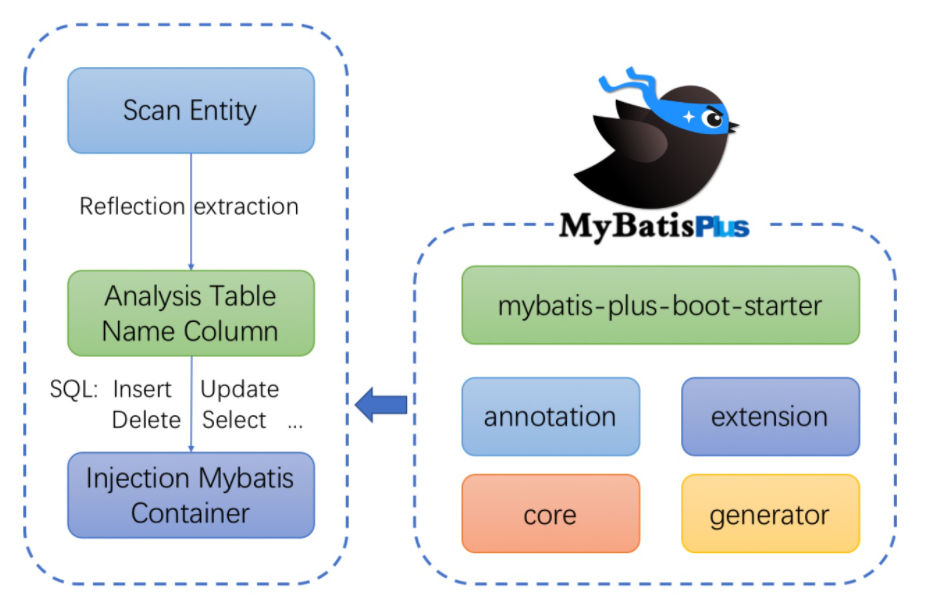


# 二、Helloworld


## 2.1：表


```sql
DROP TABLE
IF
	EXISTS USER;
CREATE TABLE USERS (
	id BIGINT ( 20 ) NOT NULL COMMENT '主键ID',
	NAME VARCHAR ( 30 ) NULL DEFAULT NULL COMMENT '姓名',
	age INT ( 11 ) NULL DEFAULT NULL COMMENT '年龄',
	email VARCHAR ( 50 ) NULL DEFAULT NULL COMMENT '邮箱',
	PRIMARY KEY ( id ) 
);
INSERT INTO USERS ( id, NAME, age, email )
VALUES
	( 1, 'Jone', 18, 'test1@baomidou.com' ),
	( 2, 'Jack', 20, 'test2@baomidou.com' ),
	( 3, 'Tom', 28, 'test3@baomidou.com' ),
	( 4, 'Sandy', 21, 'test4@baomidou.com' ),
	( 5, 'Billie', 24, 'test5@baomidou.com' );-- 真实开发中，version（乐观锁）、deleted（逻辑删除）、gmt_create、gmt_modified
```


## 2.2：pom文件


建立springboot工程引入一下文件


```xml
<?xml version="1.0" encoding="UTF-8"?>
<project xmlns="http://maven.apache.org/POM/4.0.0"
         xmlns:xsi="http://www.w3.org/2001/XMLSchema-instance"
         xsi:schemaLocation="http://maven.apache.org/POM/4.0.0 http://maven.apache.org/xsd/maven-4.0.0.xsd">
    <parent>
        <groupId>org.springframework.boot</groupId>
        <artifactId>spring-boot-starter-parent</artifactId>
        <version>2.4.10</version>
        <relativePath/>
    </parent>

    <modelVersion>4.0.0</modelVersion>
    <groupId>org.example</groupId>
    <artifactId>mybatis-plus</artifactId>
    <version>1.0-SNAPSHOT</version>
    <modules>
        <module>mybatis-plus-01</module>
    </modules>
    <packaging>pom</packaging>
    <properties>
        <project.reporting.outputEncoding>UTF-8</project.reporting.outputEncoding>
        <java.version>1.8</java.version>
        <druid.version>1.2.8</druid.version>
        <mybatisplus.version>3.4.3.4</mybatisplus.version>
        <mysql-connector.version>8.0.20</mysql-connector.version>
    </properties>
    <dependencies>

        <dependency>
            <groupId>org.projectlombok</groupId>
            <artifactId>lombok</artifactId>
            <version>1.18.22</version>
        </dependency>
        <dependency>
            <groupId>org.springframework.boot</groupId>
            <artifactId>spring-boot-starter-web</artifactId>
        </dependency>
        <dependency>
            <groupId>org.springframework.boot</groupId>
            <artifactId>spring-boot-starter-test</artifactId>
        </dependency>
        <dependency>
            <groupId>mysql</groupId>
            <artifactId>mysql-connector-java</artifactId>
            <version>${mysql-connector.version}</version>
        </dependency>
        <dependency>
            <groupId>com.alibaba</groupId>
            <artifactId>druid</artifactId>
            <version>${druid.version}</version>
        </dependency>
        <dependency>
            <groupId>com.baomidou</groupId>
            <artifactId>mybatis-plus-boot-starter</artifactId>
            <version>${mybatisplus.version}</version>
            <exclusions>
                <exclusion>
                    <groupId>com.baomidou</groupId>
                    <artifactId>mybatis-plus-generator</artifactId>
                </exclusion>
            </exclusions>
        </dependency>
    </dependencies>
</project>
```


## 2.3：启动器


```java
@MapperScans(value = {
        @MapperScan(value = "com.it.mapper"),
})
@SpringBootApplication
public class APP8080 {

    public static void main(String[] args) {
        SpringApplication.run(APP8080.class);
    }
}
```


## 2.4：pojo


```java
@Data
@AllArgsConstructor
@NoArgsConstructor
public class Users {
    private Long id; private String name; private Integer age; private String email;
}

```


## 2.5：mapper


```java
@Repository
public interface UserMapper  extends BaseMapper<Users> {
}

```


## 2.6：test用例


```java
@SpringBootTest
public class UserTest {

    @Autowired
   private  UserMapper userMapper;

    @Test
     void test1() {
        List<Users> userMappers = userMapper.selectList(null);
        userMappers.forEach(System.out::println);=
    }
}
```


## 2.7：运行结果


## 2.8：日志配置


application.yml文件配置

```yml
mybatis-plus:
  configuration:
    log-impl: org.apache.ibatis.logging.stdout.StdOutImpl
```


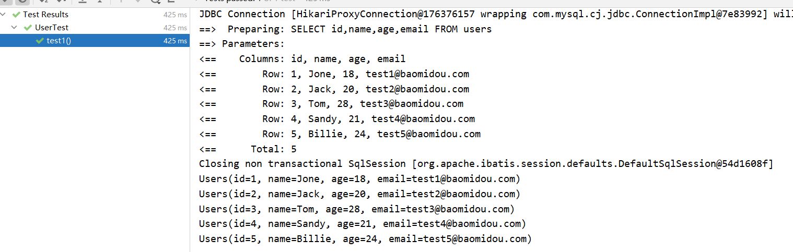


# 三、Mapper 接口


## 3.1：简介


> 说明:
>
> 通用 CRUD 封装BaseMapper (opens new window)接口，为 Mybatis-Plus 启动时自动解析实体表关系映射转换为 Mybatis 内部对象注入容器
> 泛型 T 为任意实体对象
> 参数 Serializable 为任意类型主键 Mybatis-Plus 不推荐使用复合主键约定每一张表都有自己的唯一 id 主键
> 对象 Wrapper 为 条件构造器


## 3.2：环境搭建


和helloworld一样这里不过多写了


## 3.2：示例代码


```java
@SpringBootTest
public class UserTest {

    @Autowired
     UserMapper userMapper;


    public String getUUID(){
        return UUID.randomUUID().toString().replace("-","");
    }

    @Test
    public void insert(){
        Users users = new Users();
        users.setId(null);
        users.setName(getUUID());
        users.setAge(19);
        users.setEmail("1111111@qq.com");
        userMapper.insert(users);
    }
    @Test
    public void update(){
        Users users = new Users();
        users.setId(5L);
        users.setName(getUUID());
        users.setAge(19);
        users.setEmail("222222@qq.com");
        userMapper.updateById(users);
    }

    @Test
    public void delete(){
        Users users = new Users();
        users.setId(5L);
        users.setName(getUUID());
        users.setAge(19);
        users.setEmail("1111111@qq.com");
        userMapper.deleteById(users);
    }

    @Test
    public void selectById(){
        Users users1 = userMapper.selectById(5L);
        System.out.println(users1);
    }

    @Test
    public void selectList(){

        List<Users> userMappers = userMapper.selectList(null);
        userMappers.forEach(System.out::println);
    }
}
```


## Insert

```java
// 插入一条记录
int insert(T entity);
```


### 参数说明


| 类型 | 参数名 |   描述   |
| :--: | :----: | :------: |
|  T   | entity | 实体对象 |

## Delete


```java
// 根据 entity 条件，删除记录
int delete(@Param(Constants.WRAPPER) Wrapper<T> wrapper);
// 删除（根据ID 批量删除）
int deleteBatchIds(@Param(Constants.COLLECTION) Collection<? extends Serializable> idList);
// 根据 ID 删除
int deleteById(Serializable id);
// 根据 columnMap 条件，删除记录
int deleteByMap(@Param(Constants.COLUMN_MAP) Map<String, Object> columnMap);
```


### 参数说明


|                类型                |  参数名   |                描述                |
| :--------------------------------: | :-------: | :--------------------------------: |
|             Wrapper<T>             |  wrapper  | 实体对象封装操作类（可以为 null）  |
| Collection<? extends Serializable> |  idList   | 主键ID列表(不能为 null 以及 empty) |
|            Serializable            |    id     |               主键ID               |
|        Map<String, Object>         | columnMap |          表字段 map 对象           |

## Update


```java
// 根据 whereWrapper 条件，更新记录
int update(@Param(Constants.ENTITY) T updateEntity, @Param(Constants.WRAPPER) Wrapper<T> whereWrapper);
// 根据 ID 修改
int updateById(@Param(Constants.ENTITY) T entity);
```


### 参数说明


|    类型    |    参数名     |                             描述                             |
| :--------: | :-----------: | :----------------------------------------------------------: |
|     T      |    entity     |               实体对象 (set 条件值,可为 null)                |
| Wrapper<T> | updateWrapper | 实体对象封装操作类（可以为 null,里面的 entity 用于生成 where 语句） |


## Select


```java
// 根据 ID 查询
T selectById(Serializable id);
// 根据 entity 条件，查询一条记录
T selectOne(@Param(Constants.WRAPPER) Wrapper<T> queryWrapper);

// 查询（根据ID 批量查询）
List<T> selectBatchIds(@Param(Constants.COLLECTION) Collection<? extends Serializable> idList);
// 根据 entity 条件，查询全部记录
List<T> selectList(@Param(Constants.WRAPPER) Wrapper<T> queryWrapper);
// 查询（根据 columnMap 条件）
List<T> selectByMap(@Param(Constants.COLUMN_MAP) Map<String, Object> columnMap);
// 根据 Wrapper 条件，查询全部记录
List<Map<String, Object>> selectMaps(@Param(Constants.WRAPPER) Wrapper<T> queryWrapper);
// 根据 Wrapper 条件，查询全部记录。注意： 只返回第一个字段的值
List<Object> selectObjs(@Param(Constants.WRAPPER) Wrapper<T> queryWrapper);

// 根据 entity 条件，查询全部记录（并翻页）
IPage<T> selectPage(IPage<T> page, @Param(Constants.WRAPPER) Wrapper<T> queryWrapper);
// 根据 Wrapper 条件，查询全部记录（并翻页）
IPage<Map<String, Object>> selectMapsPage(IPage<T> page, @Param(Constants.WRAPPER) Wrapper<T> queryWrapper);
// 根据 Wrapper 条件，查询总记录数
Integer selectCount(@Param(Constants.WRAPPER) Wrapper<T> queryWrapper);
```


### 参数说明


|                类型                |    参数名    |                   描述                   |
| :--------------------------------: | :----------: | :--------------------------------------: |
|            Serializable            |      id      |                  主键ID                  |
|             Wrapper<T>             | queryWrapper |    实体对象封装操作类（可以为 null）     |
| Collection<? extends Serializable> |    idList    |    主键ID列表(不能为 null 以及 empty)    |
|        Map<String, Object>         |  columnMap   |             表字段 map 对象              |
|              IPage<T>              |     page     | 分页查询条件（可以为 RowBounds.DEFAULT） |


# 四、Service接口


## 4.1：简介


> 通用 Service CRUD 封装IService (opens new window)接口，进一步封装 CRUD 采用 get 查询单行 remove 删除 list 查询集合 page 分页 前缀命名方式区分 Mapper 层避免混淆，
> 泛型 T 为任意实体对象
> 建议如果存在自定义通用 Service 方法的可能，请创建自己的 IBaseService 继承 Mybatis-Plus 提供的基类
> 对象 Wrapper 为 条件构造器


## 4.2：环境搭建


和helloworld一样这里不过多写了


## 4.3：示例代码


```java
@SpringBootTest
public class UserServiceTest {
@Autowired
    private UserService userService;

    public String getUUID(){
        return UUID.randomUUID().toString().replace("-","");
    }

    @Test
    public void insert(){
        Users users = new Users();
        users.setId(null);
        users.setName(getUUID());
        users.setAge(19);
        users.setEmail("1111111@qq.com");
        userService.save(users);
    }
    @Test
    public void update(){
        Users users = new Users();
        users.setId(5L);
        users.setName(getUUID());
        users.setAge(19);
        users.setEmail("222222@qq.com");
        userService.saveOrUpdate(users);
    }

    @Test
    public void delete(){
        Users users = new Users();
        users.setId(5L);
        users.setName(getUUID());
        users.setAge(19);
        users.setEmail("1111111@qq.com");
        userService.removeById(users);
    }

    @Test
    public void list(){
        List<Users> list = userService.list();
        for (Users users : list) {
            System.out.println(users);
        }
    }

    @Test
    public void getById(){
        System.out.println(userService.getById(5L));

    }
}
```


## Save


```java
// 插入一条记录（选择字段，策略插入）
boolean save(T entity);
// 插入（批量）
boolean saveBatch(Collection<T> entityList);
// 插入（批量）
boolean saveBatch(Collection<T> entityList, int batchSize);
```


### 参数说明


|     类型      |   参数名   |     描述     |
| :-----------: | :--------: | :----------: |
|       T       |   entity   |   实体对象   |
| Collection<T> | entityList | 实体对象集合 |
|      int      | batchSize  | 插入批次数量 |

## SaveOrUpdate


```java
// TableId 注解存在更新记录，否插入一条记录
boolean saveOrUpdate(T entity);
// 根据updateWrapper尝试更新，否继续执行saveOrUpdate(T)方法
boolean saveOrUpdate(T entity, Wrapper<T> updateWrapper);
// 批量修改插入
boolean saveOrUpdateBatch(Collection<T> entityList);
// 批量修改插入
boolean saveOrUpdateBatch(Collection<T> entityList, int batchSize);
```


### 参数说明


|     类型      |    参数名     |               描述               |
| :-----------: | :-----------: | :------------------------------: |
|       T       |    entity     |             实体对象             |
|  Wrapper<T>   | updateWrapper | 实体对象封装操作类 UpdateWrapper |
| Collection<T> |  entityList   |           实体对象集合           |
|      int      |   batchSize   |           插入批次数量           |

## Remove


```java
// 根据 entity 条件，删除记录
boolean remove(Wrapper<T> queryWrapper);
// 根据 ID 删除
boolean removeById(Serializable id);
// 根据 columnMap 条件，删除记录
boolean removeByMap(Map<String, Object> columnMap);
// 删除（根据ID 批量删除）
boolean removeByIds(Collection<? extends Serializable> idList);
```


### 参数说明


|                类型                |    参数名    |          描述           |
| :--------------------------------: | :----------: | :---------------------: |
|             Wrapper<T>             | queryWrapper | 实体包装类 QueryWrapper |
|            Serializable            |      id      |         主键ID          |
|        Map<String, Object>         |  columnMap   |     表字段 map 对象     |
| Collection<? extends Serializable> |    idList    |       主键ID列表        |

## Update


```java
// 根据 UpdateWrapper 条件，更新记录 需要设置sqlset
boolean update(Wrapper<T> updateWrapper);
// 根据 whereWrapper 条件，更新记录
boolean update(T updateEntity, Wrapper<T> whereWrapper);
// 根据 ID 选择修改
boolean updateById(T entity);
// 根据ID 批量更新
boolean updateBatchById(Collection<T> entityList);
// 根据ID 批量更新
boolean updateBatchById(Collection<T> entityList, int batchSize);
```


### 参数说明


|     类型      |    参数名     |               描述               |
| :-----------: | :-----------: | :------------------------------: |
|  Wrapper<T>   | updateWrapper | 实体对象封装操作类 UpdateWrapper |
|       T       |    entity     |             实体对象             |
| Collection<T> |  entityList   |           实体对象集合           |
|      int      |   batchSize   |           更新批次数量           |

## Get


```java
// 根据 ID 查询
T getById(Serializable id);
// 根据 Wrapper，查询一条记录。结果集，如果是多个会抛出异常，随机取一条加上限制条件 wrapper.last("LIMIT 1")
T getOne(Wrapper<T> queryWrapper);
// 根据 Wrapper，查询一条记录
T getOne(Wrapper<T> queryWrapper, boolean throwEx);
// 根据 Wrapper，查询一条记录
Map<String, Object> getMap(Wrapper<T> queryWrapper);
// 根据 Wrapper，查询一条记录
<V> V getObj(Wrapper<T> queryWrapper, Function<? super Object, V> mapper);
```


### 参数说明


|            类型             |    参数名    |              描述               |
| :-------------------------: | :----------: | :-----------------------------: |
|        Serializable         |      id      |             主键ID              |
|         Wrapper<T>          | queryWrapper | 实体对象封装操作类 QueryWrapper |
|           boolean           |   throwEx    |   有多个 result 是否抛出异常    |
|              T              |    entity    |            实体对象             |
| Function<? super Object, V> |    mapper    |            转换函数             |


## List


```java
// 查询所有
List<T> list();
// 查询列表
List<T> list(Wrapper<T> queryWrapper);
// 查询（根据ID 批量查询）
Collection<T> listByIds(Collection<? extends Serializable> idList);
// 查询（根据 columnMap 条件）
Collection<T> listByMap(Map<String, Object> columnMap);
// 查询所有列表
List<Map<String, Object>> listMaps();
// 查询列表
List<Map<String, Object>> listMaps(Wrapper<T> queryWrapper);
// 查询全部记录
List<Object> listObjs();
// 查询全部记录
<V> List<V> listObjs(Function<? super Object, V> mapper);
// 根据 Wrapper 条件，查询全部记录
List<Object> listObjs(Wrapper<T> queryWrapper);
// 根据 Wrapper 条件，查询全部记录
<V> List<V> listObjs(Wrapper<T> queryWrapper, Function<? super Object, V> mapper);
```


### 参数说明


|                类型                |    参数名    |              描述               |
| :--------------------------------: | :----------: | :-----------------------------: |
|             Wrapper<T>             | queryWrapper | 实体对象封装操作类 QueryWrapper |
| Collection<? extends Serializable> |    idList    |           主键ID列表            |
|        Map<?String, Object>        |  columnMap   |         表字段 map 对象         |
|    Function<? super Object, V>     |    mapper    |            转换函数             |

## Page


```java
// 无条件分页查询
IPage<T> page(IPage<T> page);
// 条件分页查询
IPage<T> page(IPage<T> page, Wrapper<T> queryWrapper);
// 无条件分页查询
IPage<Map<String, Object>> pageMaps(IPage<T> page);
// 条件分页查询
IPage<Map<String, Object>> pageMaps(IPage<T> page, Wrapper<T> queryWrapper);
```


### 参数说明


|    类型    |    参数名    |              描述               |
| :--------: | :----------: | :-----------------------------: |
|  IPage<T>  |     page     |            翻页对象             |
| Wrapper<T> | queryWrapper | 实体对象封装操作类 QueryWrapper |


## Count


```java
// 查询总记录数
int count();
// 根据 Wrapper 条件，查询总记录数
int count(Wrapper<T> queryWrapper);
```


### 参数说明


|    类型    |    参数名    |              描述               |
| :--------: | :----------: | :-----------------------------: |
| Wrapper<T> | queryWrapper | 实体对象封装操作类 QueryWrapper |


## Chain


### query

```java
// 链式查询 普通
QueryChainWrapper<T> query();
// 链式查询 lambda 式。注意：不支持 Kotlin
LambdaQueryChainWrapper<T> lambdaQuery(); 

// 示例：
query().eq("column", value).one();
lambdaQuery().eq(Entity::getId, value).list();
```


### update


```java
// 链式更改 普通
UpdateChainWrapper<T> update();
// 链式更改 lambda 式。注意：不支持 Kotlin 
LambdaUpdateChainWrapper<T> lambdaUpdate();

// 示例：
update().eq("column", value).remove();
lambdaUpdate().eq(Entity::getId, value).update(entity);
```

##

说明:

- 通用 CRUD 封装BaseMapper 接口，为 `Mybatis-Plus` 启动时自动解析实体表关系映射转换为 `Mybatis` 内部对象注入容器
- 泛型 `T` 为任意实体对象
- 参数 `Serializable` 为任意类型主键 `Mybatis-Plus` 不推荐使用复合主键约定每一张表都有自己的唯一 `id` 主键
- 对象 `Wrapper` 为 [条件构造器

### Insert


```java
// 插入一条记录
int insert(T entity);
```

##### 参数说明

| 类型 | 参数名 |   描述   |
| :--: | :----: | :------: |
|  T   | entity | 实体对象 |

### Delete

```java
// 根据 entity 条件，删除记录
int delete(@Param(Constants.WRAPPER) Wrapper<T> wrapper);
// 删除（根据ID 批量删除）
int deleteBatchIds(@Param(Constants.COLLECTION) Collection<? extends Serializable> idList);
// 根据 ID 删除
int deleteById(Serializable id);
// 根据 columnMap 条件，删除记录
int deleteByMap(@Param(Constants.COLUMN_MAP) Map<String, Object> columnMap);
```

#####参数说明

|                类型                |  参数名   |                描述                |
| :--------------------------------: | :-------: | :--------------------------------: |
|             Wrapper<T>             |  wrapper  | 实体对象封装操作类（可以为 null）  |
| Collection<? extends Serializable> |  idList   | 主键ID列表(不能为 null 以及 empty) |
|            Serializable            |    id     |               主键ID               |
|        Map<String, Object>         | columnMap |          表字段 map 对象           |


## Update


```java
// 根据 whereWrapper 条件，更新记录
int update(@Param(Constants.ENTITY) T updateEntity, @Param(Constants.WRAPPER) Wrapper<T> whereWrapper);
// 根据 ID 修改
int updateById(@Param(Constants.ENTITY) T entity);
```


### 参数说明


|    类型    |    参数名     |                             描述                             |
| :--------: | :-----------: | :----------------------------------------------------------: |
|     T      |    entity     |               实体对象 (set 条件值,可为 null)                |
| Wrapper<T> | updateWrapper | 实体对象封装操作类（可以为 null,里面的 entity 用于生成 where 语句） |

##  Select


```java
// 根据 ID 查询
T selectById(Serializable id);
// 根据 entity 条件，查询一条记录
T selectOne(@Param(Constants.WRAPPER) Wrapper<T> queryWrapper);

// 查询（根据ID 批量查询）
List<T> selectBatchIds(@Param(Constants.COLLECTION) Collection<? extends Serializable> idList);
// 根据 entity 条件，查询全部记录
List<T> selectList(@Param(Constants.WRAPPER) Wrapper<T> queryWrapper);
// 查询（根据 columnMap 条件）
List<T> selectByMap(@Param(Constants.COLUMN_MAP) Map<String, Object> columnMap);
// 根据 Wrapper 条件，查询全部记录
List<Map<String, Object>> selectMaps(@Param(Constants.WRAPPER) Wrapper<T> queryWrapper);
// 根据 Wrapper 条件，查询全部记录。注意： 只返回第一个字段的值
List<Object> selectObjs(@Param(Constants.WRAPPER) Wrapper<T> queryWrapper);

// 根据 entity 条件，查询全部记录（并翻页）
IPage<T> selectPage(IPage<T> page, @Param(Constants.WRAPPER) Wrapper<T> queryWrapper);
// 根据 Wrapper 条件，查询全部记录（并翻页）
IPage<Map<String, Object>> selectMapsPage(IPage<T> page, @Param(Constants.WRAPPER) Wrapper<T> queryWrapper);
// 根据 Wrapper 条件，查询总记录数
Integer selectCount(@Param(Constants.WRAPPER) Wrapper<T> queryWrapper);
```


### 参数说明


|                类型                |    参数名    |                   描述                   |
| :--------------------------------: | :----------: | :--------------------------------------: |
|            Serializable            |      id      |                  主键ID                  |
|             Wrapper<T>             | queryWrapper |    实体对象封装操作类（可以为 null）     |
| Collection<? extends Serializable> |    idList    |    主键ID列表(不能为 null 以及 empty)    |
|        Map<String, Object>         |  columnMap   |             表字段 map 对象              |
|              IPage<T>              |     page     | 分页查询条件（可以为 RowBounds.DEFAULT） |


# 五、常用注解


## 5.1：简介


> 介绍 `MybatisPlus` 注解包相关类详解(更多详细描述可点击查看源码注释)

注解类包：

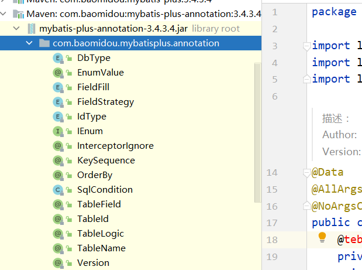


## @TableName


### 描述：表名注解


|       属性       |   类型   | 必须指定 | 默认值 | 描述                                                         |
| :--------------: | :------: | :------: | :----: | ------------------------------------------------------------ |
|      value       |  String  |    否    |   ""   | 表名                                                         |
|      schema      |  String  |    否    |   ""   | schema                                                       |
| keepGlobalPrefix | boolean  |    否    | false  | 是否保持使用全局的 tablePrefix 的值(如果设置了全局 tablePrefix 且自行设置了 value 的值) |
|    resultMap     |  String  |    否    |   ""   | xml 中 resultMap 的 id                                       |
|  autoResultMap   | boolean  |    否    | false  | 是否自动构建 resultMap 并使用(如果设置 resultMap 则不会进行 resultMap 的自动构建并注入) |
| excludeProperty  | String[] |    否    |   {}   | 需要排除的属性名(@since 3.3.1)                               |


> 关于`autoResultMap`的说明:
>
> mp会自动构建一个`ResultMap`并注入到mybatis里(一般用不上).下面讲两句: 因为mp底层是mybatis,所以一些mybatis的常识你要知道,mp只是帮你注入了常用crud到mybatis里 注入之前可以说是动态的(根据你entity的字段以及注解变化而变化),但是注入之后是静态的(等于你写在xml的东西) 而对于直接指定`typeHandler`,mybatis只支持你写在2个地方:
>
> 1. 定义在resultMap里,只作用于select查询的返回结果封装
> 2. 定义在`insert`和`update`sql的`#{property}`里的`property`后面(例:`#{property,typehandler=xxx.xxx.xxx}`),只作用于`设置值` 而除了这两种直接指定`typeHandler`,mybatis有一个全局的扫描你自己的`typeHandler`包的配置,这是根据你的`property`的类型去找`typeHandler`并使用.


## @TableId


### 描述：主键注解


| 属性  |  类型  | 必须指定 |   默认值    |    描述    |
| :---: | :----: | :------: | :---------: | :--------: |
| value | String |    否    |     ""      | 主键字段名 |
| type  |  Enum  |    否    | IdType.NONE |  主键类型  |


### @IdType


|     值      |                             描述                             |
| :---------: | :----------------------------------------------------------: |
|    AUTO     |                         数据库ID自增                         |
|    NONE     | 无状态,该类型为未设置主键类型(注解里等于跟随全局,全局里约等于 INPUT) |
|    INPUT    |                    insert前自行set主键值                     |
|  ASSIGN_ID  | 分配ID(主键类型为Number(Long和Integer)或String)(since 3.3.0),使用接口`IdentifierGenerator`的方法`nextId`(默认实现类为`DefaultIdentifierGenerator`雪花算法) |
| ASSIGN_UUID | 分配UUID,主键类型为String(since 3.3.0),使用接口`IdentifierGenerator`的方法`nextUUID`(默认default方法) |


## @TableField


### 描述：字段注解(非主键)


|       属性       |             类型             | 必须指定 |          默认值          |                             描述                             |
| :--------------: | :--------------------------: | :------: | :----------------------: | :----------------------------------------------------------: |
|      value       |            String            |    否    |            ""            |                         数据库字段名                         |
|        el        |            String            |    否    |            ""            | 映射为原生 `#{ ... }` 逻辑,相当><br>于写在 xml 里的 `#{ ... }` 部分 |
|      exist       |           boolean            |    否    |           true           |                      是否为数据库表字段                      |
|    condition     |            String            |    否    |            ""            | 字段 `where` 实体查询比较条件,有值<br/>设置则按设置的值为准,没有则为默认全局的 `%s=#{%s}`,[参考(opens new window)](https://github.com/baomidou/mybatis-plus/blob/3.0/mybatis-plus-annotation/src/main/java/com/baomidou/mybatisplus/annotation/SqlCondition.java) |
|      update      |            String            |    否    |            ""            | 字段 `update set` 部分注入, 例如：update="%s+1"：表示更新时会set version=version+1(该属性优先级高于 `el` 属性) |
|  insertStrategy  |             Enum             |    N     |         DEFAULT          | 举例：NOT_NULL: `insert into table_a(<if test="columnProperty != null">`<br/>`column</if>) values (<if test="columnProperty != null">#{columnProperty}</if>)` |
|  updateStrategy  |             Enum             |    N     |         DEFAULT          | 举例：IGNORED: `update table_a set column=#{columnProperty}` |
|  whereStrategy   |             Enum             |    N     |         DEFAULT          | 举例：NOT_EMPTY: `where <if test="columnProperty != null and columnProperty!=''">column=#{columnProperty}</if>` |
|       fill       |             Enum             |    否    |    FieldFill.DEFAULT     |                       字段自动填充策略                       |
|      select      |           boolean            |    否    |           true           |                     是否进行 select 查询                     |
| keepGlobalFormat |           boolean            |    否    |          false           |              是否保持使用全局的 format 进行处理              |
|     jdbcType     |           JdbcType           |    否    |    JdbcTypeUNDEFINED     |           JDBC类型 (该默认值不代表会按照该值生效)            |
|   typeHandler    | Class<? extends TypeHandler> |    否    | UnknownTypeHandler.class |          类型处理器 (该默认值不代表会按照该值生效)           |
|   numericScale   |            String            |    否    |            ""            |                    指定小数点后保留的位数                    |


### 注意


关于`jdbcType`和`typeHandler`以及`numericScale`的说明:

`numericScale`只生效于 update 的sql. `jdbcType`和`typeHandler`如果不配合`@TableName#autoResultMap = true`一起使用,也只生效于 update 的sql. 对于`typeHandler`如果你的字段类型和set进去的类型为`equals`关系,则只需要让你的`typeHandler`让Mybatis加载到即可,不需要使用注解


### FieldStrategy


|    值     |                           描述                            |
| :-------: | :-------------------------------------------------------: |
|  IGNORED  |                         忽略判断                          |
| NOT_NULL  |                        非NULL判断                         |
| NOT_EMPTY | 非空判断(只对字符串类型字段,其他类型字段依然为非NULL判断) |
|  DEFAULT  |                       追随全局配置                        |


### FieldFill


|      值       |         描述         |
| :-----------: | :------------------: |
|    DEFAULT    |      默认不处理      |
|    INSERT     |    插入时填充字段    |
|    UPDATE     |    更新时填充字段    |
| INSERT_UPDATE | 插入和更新时填充字段 |


## @Version

- 描述：乐观锁注解、标记 `@Verison` 在字段上

## @EnumValue


- 描述：通枚举类注解(注解在枚举字段上)


## @TableLogic


- 描述：表字段逻辑处理注解（逻辑删除）


|  属性  |  类型  | 必须指定 | 默认值 |     描述     |
| :----: | :----: | :------: | :----: | :----------: |
| value  | String |    否    |   ""   | 逻辑未删除值 |
| delval | String |    否    |   ""   |  逻辑删除值  |

## @SqlParser


> see @InterceptorIgnore

## @KeySequence


- 描述：序列主键策略 `oracle`
- 属性：value、resultMap

| 属性  |  类型  | 必须指定 |   默认值   |                             描述                             |
| :---: | :----: | :------: | :--------: | :----------------------------------------------------------: |
| value | String |    否    |     ""     |                            序列名                            |
| clazz | Class  |    否    | Long.class | id的类型, 可以指定String.class，这样返回的Sequence值是字符串"1" |


## @InterceptorIgnore


> see [插件主体](https://mp.baomidou.com/guide/interceptor.html)


## @OrderBy


- 描述：内置 SQL 默认指定排序，**优先级低于 wrapper 条件查询**

|  属性  |  类型   | 必须指定 |     默认值      |      描述      |
| :----: | :-----: | :------: | :-------------: | :------------: |
| isDesc | boolean |    否    |       是        |  是否倒序查询  |
|  sort  |  short  |    否    | Short.MAX_VALUE | 数字越小越靠前 |


# 六、Wrapper条件构造器


> - 以下出现的第一个入参`boolean condition`表示该条件**是否**加入最后生成的sql中，例如：query.like(StringUtils.isNotBlank(name), Entity::getName, name) .eq(age!=null && age >= 0, Entity::getAge, age)
> - 以下代码块内的多个方法均为从上往下补全个别`boolean`类型的入参,默认为`true`
> - 以下出现的泛型`Param`均为`Wrapper`的子类实例(均具有`AbstractWrapper`的所有方法)
> - 以下方法在入参中出现的`R`为泛型,在普通wrapper中是`String`,在LambdaWrapper中是**函数**(例:`Entity::getId`,`Entity`为实体类,`getId`为字段`id`的**getMethod**)
> - 以下方法入参中的`R column`均表示数据库字段,当`R`具体类型为`String`时则为数据库字段名(**字段名是数据库关键字的自己用转义符包裹!**)!而不是实体类数据字段名!!!,另当`R`具体类型为`SFunction`时项目runtime不支持eclipse自家的编译器!!!
> - 以下举例均为使用普通wrapper,入参为`Map`和`List`的均以`json`形式表现!
> - 使用中如果入参的`Map`或者`List`为**空**,则不会加入最后生成的sql中!!!


## 6.1：uml图


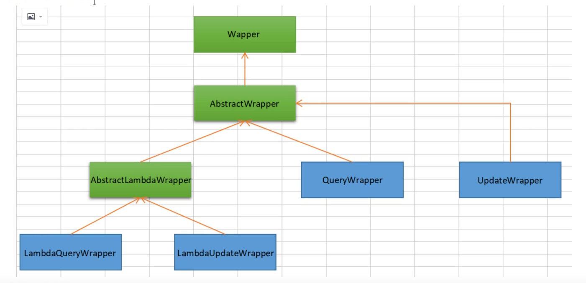

## 6.2：代码


```java
 @Autowired
    private UserMapper userMapper;

    //    1、测试一，记住查看输出的SQL进行分析
    @Test
    void contextLoads() {
// 查询name不为空的用户，并且邮箱不为空的用户，年龄大于等于12
        QueryWrapper<Users> wrapper = new QueryWrapper<>();
        wrapper
                .isNotNull("name")

                .isNotNull("email")
                .ge("age", 12);
        userMapper.selectList(wrapper).forEach(System.out::println); // 和我们刚才学习


    }

    @Test
    void test2() {
        QueryWrapper<Users> wrapper = new QueryWrapper<>();
        wrapper.eq("name", "admin");
        Users user = userMapper.selectOne(wrapper); // 查询一个数据，出现多个结果使用List
        System.out.println(user);

    }


    @Test
    void test3() {
// 查询年龄在 20 ~ 30 岁之间的用户
        QueryWrapper<Users> wrapper = new QueryWrapper<>();
        wrapper.between("age", 20, 30); // 区间
        Long aLong = userMapper.selectCount(wrapper);// 查询结果数
        System.out.println(aLong);

    }


    // 模糊查询
    @Test
    void test4() {
// 查询年龄在 20 ~ 30 岁之间的用户
        QueryWrapper<Users> wrapper = new QueryWrapper<>();

        wrapper
                .notLike("name", "e")
                .likeRight("email", "t")
                .likeLeft("email", "t")
        ;
        wrapper.like("email", "abc");
        List<Map<String, Object>> maps = userMapper.selectMaps(wrapper);

        maps.forEach(System.out::println);

    }

    // 模糊查询
    @Test
    void test5() {
        QueryWrapper<Users> wrapper = new QueryWrapper<>();
        // id 在子查询中查出来
        wrapper.inSql("id", "select id from users where id<3");
        List<Object> objects = userMapper.selectObjs(wrapper);
        objects.forEach(System.out::println);
    }

    //测试六
    @Test
    void test6() {
        QueryWrapper<Users> wrapper = new QueryWrapper<>();
        // 通过id进行排序
        wrapper.orderByAsc("id");
        List<Users> users = userMapper.selectList(wrapper);
        users.forEach(System.out::println);
    }
```


# 七、扩展


## 1.主键生成策略


### 1.1：全局设置


```yaml
mybatis-plus:
  global-config:
    db-config:
      id-type: auto
```


这里的idtype属性：


|     值      |                             描述                             |
| :---------: | :----------------------------------------------------------: |
|    auto     |                         数据库ID自增                         |
|    none     | 无状态,该类型为未设置主键类型(注解里等于跟随全局,全局里约等于 INPUT) |
|    input    |                    insert前自行set主键值                     |
|  assign_id  | 分配ID(主键类型为Number(Long和Integer)或String)(since 3.3.0),使用接口`IdentifierGenerator`的方法`nextId`(默认实现类为`DefaultIdentifierGenerator`雪花算法) |
| assign_uuid | 分配UUID,主键类型为String(since 3.3.0),使用接口`IdentifierGenerator`的方法`nextUUID`(默认default方法) |


### 2.2：单一设置


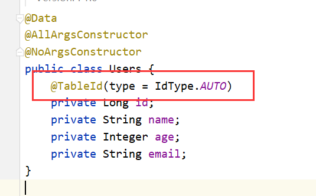


@IdType注释看注解遍


### 2.3：orcale使用序列处理主键


#### 修改全局主键配置


```yaml
mybatis-plus:
  global-config:
    db-config:
      id-type: input
```


#### 配置主键使用序列


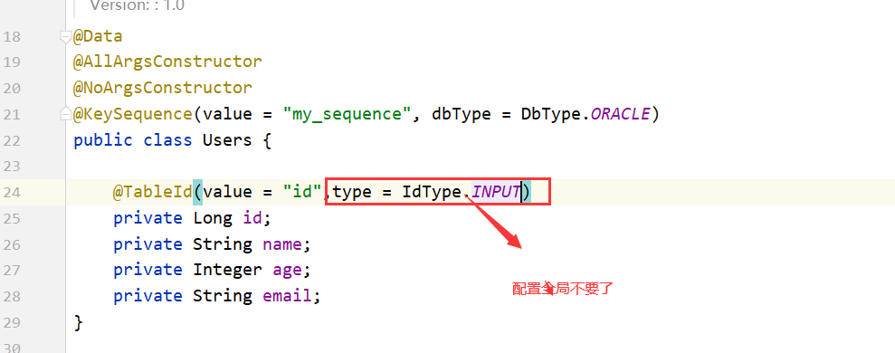


## 2.逻辑删除


### 描述


> 物理删除 ：从数据库中直接移除 
>
> 逻辑删除 ：再数据库中没有被移除，而是通过一个变量来让他失效！ deleted = 0 => deleted = 1


### 数据库增加字段


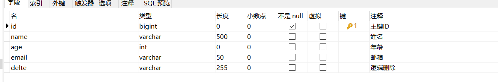


### 全局配置


```yaml
mybatis-plus:
  global-config:
    db-config:
      id-type: input
      logic-delete-field: delete  # 全局逻辑删除的实体字段名(since 3.3.0,配置后可以忽略不配置步骤2)
      logic-delete-value: 1 # 逻辑已删除值(默认为 1)
      logic-not-delete-value: 0 # 逻辑未删除值(默认为 0)
```

还有其他配置项查看源码


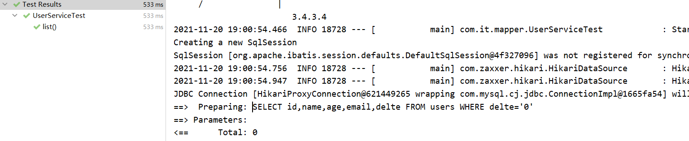


### 注解配置


注解配置优先级高于全局配置

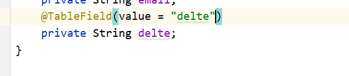


## 3.使用配置文件


我们知道mybatis-plus的底层是mybatis，所以我们使用映射文件


### 配置


```yaml
mybatis-plus:
  mapper-locations: classpath*:/mapper/**/*.xml
```


### UserMapper.java


```java
@Repository
public interface UserMapper  extends BaseMapper<Users> {

    List<Users> selectName( String name);
}
```


### UserMapper.xml


```java
<?xml version="1.0" encoding="utf-8" ?>
<!DOCTYPE mapper
        PUBLIC "-//mybatis.org//DTD Mapper 3.0//EN"
        "http://mybatis.org/dtd/mybatis-3-mapper.dtd">
<mapper namespace="com.it.mapper.UserMapper">
    <select id="selectName" resultType="com.it.pojo.Users">
        SELECT id, name
        FROM users
        WHERE name = #{name}
    </select>
</mapper>
```


### 测试


```java
   @Test
    public void testsss() {
        userMapper.selectName("admin");
    }
```


## 4.分页查询-配置类


### 配置类


```java
@Configuration
public class MybatisPlusConfig {
    // 旧版
    @Bean
    public PaginationInterceptor paginationInterceptor() {
        PaginationInterceptor paginationInterceptor = new PaginationInterceptor();
        // 设置请求的页面大于最大页后操作， true调回到首页，false 继续请求  默认false
        // paginationInterceptor.setOverflow(false);
        // 设置最大单页限制数量，默认 500 条，-1 不受限制
        // paginationInterceptor.setLimit(500);
        // 开启 count 的 join 优化,只针对部分 left join
        paginationInterceptor.setCountSqlParser(new JsqlParserCountOptimize(true));
        return paginationInterceptor;
    }

    // 最新版
    @Bean
    public MybatisPlusInterceptor mybatisPlusInterceptor() {
        MybatisPlusInterceptor interceptor = new MybatisPlusInterceptor();
        interceptor.addInnerInterceptor(new PaginationInnerInterceptor(DbType.MySql));
        return interceptor;
    }
}
```


### 代码


```java
    @Test
    public void pages() {
        Page page = new Page(1, 1);
        //mapper
        userMapper.selectPage(page, null);
        //service
        Page page1 = userService.page(page, null);
        //两种获取对象的方法
        List orders = page1.getOrders();
        List records = page1.getRecords();
    }
```


## 5.分页查询-xml格式


### UserMapper.java


```java
@Repository
public interface UserMapper  extends BaseMapper<Users> {

       /**
     * <p>
     * 查询 : 根据state状态查询用户列表，分页显示
     * </p>
     *
     * @param page 分页对象,xml中可以从里面进行取值,传递参数 Page 即自动分页,必须放在第一位(你可以继承Page实现自己的分页对象)
     * @paras state 状态
     * @return 分页对象
     */
    IPage<Users> selectPageVo(Page<?> page, String name);
}
```


### UserMapper.xml


```java
<?xml version="1.0" encoding="utf-8" ?>
<!DOCTYPE mapper
        PUBLIC "-//mybatis.org//DTD Mapper 3.0//EN"
        "http://mybatis.org/dtd/mybatis-3-mapper.dtd">
<mapper namespace="com.it.mapper.UserMapper">
    <select id="selectPageVo" resultType="com.it.pojo.Users">
        SELECT id, name
        FROM users
        WHERE name = #{name}
    </select>
</mapper>
```


### 测试


```java
   @Test
    public void testsss() {
        Page page = new Page(1, 1);
        userMapper.selectPageVo(page,"admin");
    }
```


## 6.自动填充


> 创建时间、修改时间！这些个操作一遍都是自动化完成的，我们不希望手动更新！
>
> 阿里巴巴开发手册：所有的数据库表：gmt_create、gmt_modifified几乎所有的表都要配置上！而且需
>
> 要自动化


### 数据库添加字段


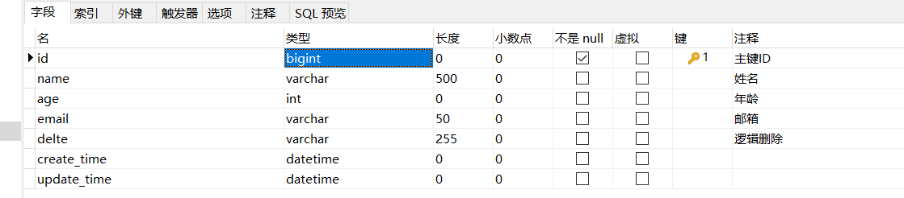


### 完善实体类


```java
   @TableField(fill = FieldFill.INSERT)
    private Date createTime;
    @TableField(fill = FieldFill.INSERT_UPDATE)
    private LocalDateTime updateTime;
```


### 配置类


```java

    /**
     * 设置自动填充
     *
     * @return
     */
    @Bean
    public MetaObjectHandler myMetaObjectHandler() {

        return new MetaObjectHandler() {
            @Override
            public void insertFill(MetaObject metaObject) {
                log.info("start insert fill ....");
                this.strictInsertFill(metaObject, "createTime", Date.class, new Date()); // 起始版本 3.3.0(推荐使用)
                // 或者
                this.strictInsertFill(metaObject, "createTime", () -> new Date(), Date.class); // 起始版本 3.3.3(推荐)
                // 或者
                this.fillStrategy(metaObject, "createTime", new Date()); // 也可以使用(3.3.0 该方法有bug)
            }

            @Override
            public void updateFill(MetaObject metaObject) {
                log.info("start update fill ....");
                this.strictUpdateFill(metaObject, "updateTime", LocalDateTime.class, LocalDateTime.now()); // 起始版本 3.3.0(推荐)
                // 或者
                this.strictUpdateFill(metaObject, "updateTime", () -> LocalDateTime.now(), LocalDateTime.class); // 起始版本 3.3.3(推荐)
                // 或者
                this.fillStrategy(metaObject, "updateTime", LocalDateTime.now()); // 也可以使用(3.3.0 该方法有bug)
            }
        };
    }
}
```


### 测试


执行添加修改删除操作查看数据库时间字段数据变化


## 7.sql分析打印


> 该功能依赖 `p6spy` 组件，完美的输出打印 SQL 及执行时长 `3.1.0` 以上版本


### pom


```java
        <dependency>
            <groupId>p6spy</groupId>
            <artifactId>p6spy</artifactId>
            <version>3.9.1</version>
        </dependency>
```


### 配置文件


```java
spring:
  datasource:
    driver-class-name: com.p6spy.engine.spy.P6SpyDriver
    username: root
    password: 123456
    url:  jdbc:p6spy:mysql://localhost:3306/test?useSSL=false&useUnicode=true&characterEncoding=utf-8&serverTimezone=GMT%2B8
```


### spy.properties


```properties
#3.2.1以上使用
modulelist=com.baomidou.mybatisplus.extension.p6spy.MybatisPlusLogFactory,com.p6spy.engine.outage.P6OutageFactory
#3.2.1以下使用或者不配置
#modulelist=com.p6spy.engine.logging.P6LogFactory,com.p6spy.engine.outage.P6OutageFactory
# 自定义日志打印
logMessageFormat=com.baomidou.mybatisplus.extension.p6spy.P6SpyLogger
#日志输出到控制台
appender=com.baomidou.mybatisplus.extension.p6spy.StdoutLogger
# 使用日志系统记录 sql
#appender=com.p6spy.engine.spy.appender.Slf4JLogger
# 设置 p6spy driver 代理
deregisterdrivers=true
# 取消JDBC URL前缀
useprefix=true
# 配置记录 Log 例外,可去掉的结果集有error,info,batch,debug,statement,commit,rollback,result,resultset.
excludecategories=info,debug,result,commit,resultset
# 日期格式
dateformat=yyyy-MM-dd HH:mm:ss
# 实际驱动可多个
#driverlist=org.h2.Driver
# 是否开启慢SQL记录
outagedetection=true
# 慢SQL记录标准 2 秒
outagedetectioninterval=2
```


### 测试


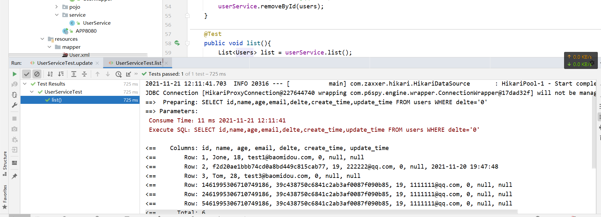


## 8.数据安全保护


> 该功能为了保护数据库配置及数据安全，在一定的程度上控制开发人员流动导致敏感信息泄露。


https://mp.baomidou.com/guide/safety.html


## 9.乐观锁


### 简介


> 乐观锁 : 故名思意十分乐观，它总是认为不会出现问题，无论干什么不去上锁！如果出现了问题，再次更新值测试
>
> 悲观锁：故名思意十分悲观，它总是认为总是出现问题，无论干什么都会上锁！再去操作！


> ##### OptimisticLockerInnerInterceptor
>
> > 当要更新一条记录的时候，希望这条记录没有被别人更新
> > 乐观锁实现方式：
> >
> > > - 取出记录时，获取当前version
> > > - 更新时，带上这个version
> > > - 执行更新时， set version = newVersion where version = oldVersion
> > > - 如果version不对，就更新失败

- **支持的数据类型只有:int,Integer,long,Long,Date,Timestamp,LocalDateTime**

### 配置类


```java
// Spring Boot 方式
@Configuration
@MapperScan("按需修改")
public class MybatisPlusConfig {
    /**
     * 旧版
     */
    @Bean
    public OptimisticLockerInterceptor optimisticLockerInterceptor() {
        return new OptimisticLockerInterceptor();
    }
    
    /**
     * 新版
     */
    @Bean
    public MybatisPlusInterceptor mybatisPlusInterceptor() {
        MybatisPlusInterceptor mybatisPlusInterceptor = new MybatisPlusInterceptor();
        mybatisPlusInterceptor.addInnerInterceptor(new OptimisticLockerInnerInterceptor());
        return mybatisPlusInterceptor;
    }
}
```


### pojo


```java
    @Version
    private Integer version;
```


### 代码


```java
// 测试乐观锁失败！多线程下 
@Test
public void testOptimisticLocker2(){ 
    // 线程 1
    User user = userMapper.selectById(1L); user.setName("kuangshen111"); 
    user.setEmail("24736743@qq.com"); 
    // 模拟另外一个线程执行了插队操作 
    User user2 = userMapper.selectById(1L); user2.setName("kuangshen222"); user2.setEmail("24736743@qq.com"); userMapper.updateById(user2); 
    // 自旋锁来多次尝试提交！
    userMapper.updateById(user); 
    // 如果没有乐观锁就会覆盖插队线程的值！
}
```


## 10.代码生成器


### pom


```java
       <dependency>
            <groupId>com.baomidou</groupId>
            <artifactId>mybatis-plus-generator</artifactId>
            <version>3.5.1</version>
        </dependency>
        <dependency>
            <groupId>org.apache.velocity</groupId>
            <artifactId>velocity-engine-core</artifactId>
            <version>2.2</version>
        </dependency>
```


### java


```java
package com.it.mapper;

import com.baomidou.mybatisplus.generator.FastAutoGenerator;
import com.baomidou.mybatisplus.generator.config.DataSourceConfig;
import com.baomidou.mybatisplus.generator.config.OutputFile;
import com.baomidou.mybatisplus.generator.engine.FreemarkerTemplateEngine;
import org.apache.ibatis.jdbc.ScriptRunner;

import java.io.InputStream;
import java.io.InputStreamReader;
import java.sql.Connection;
import java.sql.SQLException;
import java.util.Collections;

/**
 * 描述 ：
 *
 * @author : 小糊涂
 * @version : 1.0
 * @createTime :  2021/11/21 12:55
 **/
public class Test {

    /**
     * 执行初始化数据库脚本
     */
    public static void before() throws SQLException {
        Connection conn = DATA_SOURCE_CONFIG.build().getConn();
        InputStream inputStream = Test.class.getResourceAsStream("/sql/init.sql");
        ScriptRunner scriptRunner = new ScriptRunner(conn);
        scriptRunner.setAutoCommit(true);
        scriptRunner.runScript(new InputStreamReader(inputStream));
        conn.close();
    }

    /**
     * 数据源配置
     */
    private static final DataSourceConfig.Builder DATA_SOURCE_CONFIG = new DataSourceConfig
            .Builder("jdbc:mysql://localhost:3306/test?useSSL=false&useUnicode=true&characterEncoding=utf-8&serverTimezone=GMT%2B8", "root", "123456");

    /**
     * 执行 run
     */
    public static void main(String[] args) throws SQLException {
     //   before();
        FastAutoGenerator.create("url", "username", "password")
                .globalConfig(builder -> {
                    builder.author("baomidou") // 设置作者
                            .enableSwagger() // 开启 swagger 模式
                            .fileOverride() // 覆盖已生成文件
                            .outputDir("D://"); // 指定输出目录
                })
                .packageConfig(builder -> {
                    builder.parent("com.baomidou.mybatisplus.samples.generator") // 设置父包名
                            .moduleName("system") // 设置父包模块名
                            .pathInfo(Collections.singletonMap(OutputFile.mapperXml, "D://")); // 设置mapperXml生成路径
                })
                .strategyConfig(builder -> {
                    builder
                            .addInclude("t_simple") // 设置需要生成的表名
                            .addTablePrefix("t_", "c_"); // 设置过滤表前缀

                })
                .templateEngine(new FreemarkerTemplateEngine()) // 使用Freemarker引擎模板，默认的是Velocity引擎模板
                .execute();
    }
}
```


