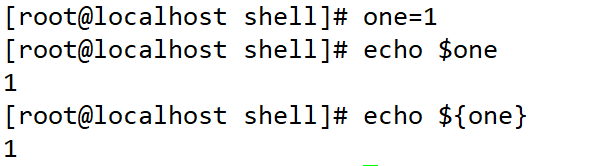
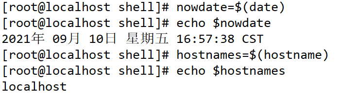
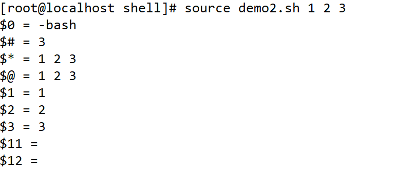

<h1>Shell脚本编程</h1>

[TOC]


---------


# 一、HelloWorld


## 1.1：什么是shell


Shell 是一个用 C 语言编写的程序，它是用户使用 Linux 的桥梁。Shell 既是一种命令语言，又是一种程序设计语言。

Shell 是指一种应用程序，这个应用程序提供了一个界面，用户通过这个界面访问操作系统内核的服务。

Ken Thompson 的 sh 是第一种 Unix Shell，Windows Explorer 是一个典型的图形界面 Shell。


## 1.2：Shell 脚本


Shell 脚本（shell script），是一种为 shell 编写的脚本程序。

业界所说的 shell 通常都是指 shell 脚本，但读者朋友要知道，shell 和 shell script 是两个不同的概念。

由于习惯的原因，简洁起见，本文出现的 "shell编程" 都是指 shell 脚本编程，不是指开发 shell 自身。


## 1.3：Shell 环境


Shell 编程跟 JavaScript、php 编程一样，只要有一个能编写代码的文本编辑器和一个能解释执行的脚本解释器就可以了。

Linux 的 Shell 种类众多，常见的有：

- Bourne Shell（/usr/bin/sh或/bin/sh）
- Bourne Again Shell（/bin/bash）
- C Shell（/usr/bin/csh）
- K Shell（/usr/bin/ksh）
- Shell for Root（/sbin/sh）
- ……

本教程关注的是 Bash，也就是 Bourne Again Shell，由于易用和免费，Bash 在日常工作中被广泛使用。同时，Bash 也是大多数Linux 系统默认的 Shell。

在一般情况下，人们并不区分 Bourne Shell 和 Bourne Again Shell，所以，像 **#!/bin/sh**，它同样也可以改为 **#!/bin/bash**。

**#!** 告诉系统其后路径所指定的程序即是解释此脚本文件的 Shell 程序。


## 1.4：base特性


###1.命令和文件自动补全


Tab只能补全==命令和文件== 


###2.常见的快捷键


| 快捷键         | 描述                       |
| -------------- | -------------------------- |
| CTRL+c         | 终止前台运行的程序         |
| CTRL+z         | 将前台运行的程序挂起到后台 |
| CTRL+d         | 退出 等价exit              |
| CTRL+l         | 清屏                       |
| CTRL+a \| home | 光标移到命令行的最前端     |
| CTRL+e \| end  | 光标移到命令行的后端       |
| CTRL+u         | 删除光标前所有字符         |
| CTRL+k         | 删除光标后所有字符         |
| CTRL+r         | 搜索历史命令               |

​		

###3 .常用的通配符（重点）


| 通配符                | 描述                                                |
| --------------------- | --------------------------------------------------- |
| *                     | 匹配0或多个任意字符                                 |
| ?                     | 匹配任意单个字符                                    |
| [list]                | 匹配[list]中的任意单个字符,或者一组单个字符   [a-z] |
| [!list]               | 匹配除list中的任意单个字符                          |
| {string1,string2,...} | 匹配string1,string2或更多字符串                     |


~~~java
# rm -f file*
# cp *.conf  /dir1
# touch file{1..5}
~~~


###4.bash中的引号（重点）


| 类型   | 名字 | 描述                                                         |
| ------ | ---- | ------------------------------------------------------------ |
| 双引号 | ""   | 会把引号的内容当成整体来看待，允许通过$符号引用其他变量值    |
| 单引号 | ''   | 会把引号的内容当成整体来看待，禁止引用其他变量值，shell中特殊符号都被视为普通字符 |
| 反撇号 | ``   | 反撇号和$()一样，引号或括号里的命令会优先执行，如果存在嵌套，反撇号不能用 |


~~~java
[root@localhost /]# date
2021年 09月 10日 星期五 15:26:35 CST
[root@localhost /]# echo "date"
date
[root@localhost /]# echo 'date'
date
[root@localhost /]# echo `date`
2021年 09月 10日 星期五 15:26:54 CST
[root@localhost /]# echo '$(date)'
$(date)
[root@localhost /]# echo "$(date)"
2021年 09月 10日 星期五 15:27:37 CST
~~~


## 1.5：shell基本写法


+ **脚本第一行**，魔法字符==**#!**==指定解释器【==必写==】


`#!/bin/bash`  表示以下内容使用bash解释器解析

**==注意：==**
如果直接将解释器路径写死在脚本里，可能在某些系统就会存在找不到解释器的兼容性问题，所以可以使用:`#!/bin/env 解释器`


+ **脚本第二部分**，注释(#号)说明，对脚本的基本信息进行描述【可选】


~~~shell
#!/bin/env bash

# 以下内容是对脚本的基本信息的描述
# Name: 名字
# Desc:描述describe
# Path:存放路径
# Usage:用法
# Update:更新时间

#下面就是脚本的具体内容
commands
...
~~~


+ **脚本第三部分**，脚本要实现的具体代码内容


## 1.6：helloworld


```shell
#!/bin/env bash
echo 'hello shell'
echo 'hello shell'
echo 'hello shell'
```


## 1.7： shell执行


+ 第一步


```shell
chmod +x ./test.sh  #使脚本具有执行权限
```


+ 查看下面执行方式，推荐最后一种


```shell
[root@localhost shell]# chmod +x helloworld.sh 
[root@localhost shell]# ./helloworld.sh 
hello shell
hello shell
hello shell
[root@localhost shell]# sh helloworld.sh 
hello shell
hello shell
hello shell
[root@localhost shell]# bash helloworld.sh 
hello shell
hello shell
hello shell
[root@localhost shell]# bash -x helloworld.sh 
+ echo 'hello shell'
hello shell
+ echo 'hello shell'
hello shell
+ echo 'hello shell'
hello shell
[root@localhost shell]# source helloworld.sh 
hello shell
hello shell
hello shell
```


## 1.8：练习


练习案例1


# 二、变量


## 2.1：变量定义赋值取值


**变量名=====变量值**

+ 变量名：用来临时保存数据的

+ 变量值：就是临时的可变化的数

```java
[root@localhost shell]# a=hello
[root@localhost shell]# echo $a
hello
[root@localhost shell]# echo ${a}
hello
[root@localhost shell]# a=world
[root@localhost shell]# echo $a
world
[root@localhost shell]# unset a
[root@localhost shell]# echo $a
    
```


## 2.2：简单定义


> **直接赋值给一个变量**





## 2.3：命令执行结果赋值给变量





## 2.4：交互式定义变量-read


### 1.简介


+ **作用**
	+ 让==用户自己==给变量赋值，比较灵活。类似于java中的Scanner类命令行输入内容监听

+ **语法：**
	+ `read [选项] 变量名`

+ **常见选项：**


| 选项 | 释义                                                       |
| ---- | ---------------------------------------------------------- |
| -p   | 定义提示用户的信息                                         |
| -n   | 定义字符数（限制变量值的长度）                             |
| -s   | 不显示（不显示用户输入的内容）                             |
| -t   | 定义超时时间，默认单位为秒（限制用户输入变量值的超时时间） |


### 2.使用案例


```java
用法1：用户自己定义变量值
[root@localhost ~]# read name
harry
[root@localhost ~]# echo $name
harry
[root@localhost ~]# read -p "Input your name:" name
Input your name:tom
[root@localhost ~]# echo $name
tom

用法2：变量值来自文件
[root@localhost ~]# cat 1.txt 
10.1.1.1 255.255.255.0

[root@localhost ~]# read ip mask < 1.txt 
[root@localhost ~]# echo $ip
10.1.1.1
[root@localhost ~]# echo $mask
255.255.255.0
```


## 2.5：定义有类型的变量-declar


### 1.简介


**目的：**给变量做一些限制，固定变量的类型，比如：整型、只读

**用法：**`declare 选项 变量名=变量值`

**常用选项：**

| 选项   | 释义                       | 举例                                             |
| ------ | -------------------------- | ------------------------------------------------ |
| ==-i== | 将变量看成整数             | `declare -i A=123`                               |
| ==-r== | 定义只读变量               | `declare -r B=hello`                             |
| -a     | 定义普通数组；查看普通数组 |                                                  |
| -A     | 定义关联数组；查看关联数组 |                                                  |
| -x     | 将变量通过环境导出         | `declare -x AAA=123456 `等于` export AAA=123456` |


### 2.举例说明


```java
[root@localhost ~]# declare -i A=123
[root@localhost ~]# echo $A
123
[root@localhost ~]# A=hello
[root@localhost ~]# echo $A
0

[root@localhost ~]# declare -r B=hello
[root@localhost ~]# echo $B
hello
[root@localhost ~]# B=world
-bash: B: readonly variable
[root@localhost ~]# unset B
-bash: unset: B: cannot unset: readonly variable
```


## 2.6：变量分类


### 1.本地变量


当前用户自定义的变量。当前进程中有效，其他进程及当前进程的子进程无效。


### 2.环境变量


- **环境变量**：当前进程有效，并且能够被**子进程**调用。
	- `env`查看当前用户的环境变量
	- `set`查询当前用户的所有变量(临时变量与环境变量) 
	- `export 变量名=变量值`    或者  `变量名=变量值；export 变量名`

~~~shell
[root@localhost ~]# export A=hello		临时将一个本地变量（临时变量）变成环境变量
[root@localhost ~]# env|grep ^A
A=hello

永久生效：
vim /etc/profile 或者 ~/.bashrc
export A=hello
或者
A=hello
export A

说明：系统中有一个变量PATH，环境变量
export PATH=/usr/local/mysql/bin:$PATH
~~~


### 3.全局变量


- **全局变量**：全局所有的用户和程序都能调用，且继承，新建的用户也默认能调用.

- **解读相关配置文件**

| 文件名               | 说明                                   | 备注                                                       |
| -------------------- | -------------------------------------- | ---------------------------------------------------------- |
| $HOME/.bashrc        | 当前用户的bash信息,**用户登录时读取**  | 定义别名、umask、函数等                                    |
| $HOME/.bash_profile  | 当前用户的环境变量，**用户登录时读取** |                                                            |
| $HOME/.bash_logout   | **当前用户退出**最后读取               | 定义用户退出时执行的程序等                                 |
| /etc/bashrc          | 全局的bash信息，**所有用户都生效**     |                                                            |
| /etc/profile         | 全局环境变量信息                       | 系统和所有用户都生效                                       |
| \$HOME/.bash_history | 用户的历史命令                         | history -w   保存历史记录         history -c  清空历史记录 |

**说明：**以上文件修改后，都需要重新==source==让其生效或者退出重新登录。

- **用户登录**系统**读取**相关==文件的顺序==

	1. `/etc/profile`
	2. `$HOME/.bash_profile`
	3. `$HOME/.bashrc`
	4. `/etc/bashrc`
	5. `$HOME/.bash_logout`

	

## 2.7：变量分类-系统变量（传参）

- **系统变量(内置bash中变量)** ： shell本身已经固定好了它的名字和作用.


| 内置变量                                                     | 含义                                                         |
| ------------------------------------------------------------ | ------------------------------------------------------------ |
| $?                                                           | 上一条命令执行后返回的状态；状态值为0表示执行正常，==非0==表示执行异常或错误 |
| $0                                                           | 当前执行的程序或脚本名                                       |
| $#                                                           | 脚本后面接的参数的个数                                       |
| $*                                                           | 脚本后面所有参数，参数当成一个整体输出，每一个变量参数之间以空格隔开 |
| $@                                                           | 脚本后面所有参数，参数是独立的，也是全部输出                 |
| `\$1\~$9 `| 脚本后面的位置参数，`$1`表示第1个位置参数，依次类推 |                                                              |
| \${10}\~${n}                                                 | 扩展位置参数,第10个位置变量必须用{}大括号括起来(2位数字以上扩起来)，就是我们的传参 |
| $$                                                           | 当前所在进程的进程号，如`echo $$`                            |
| $！                                                          | 后台运行的最后一个进程号 (当前终端）                         |
| !$                                                           | 调用最后一条命令历史中的参数                                 |

- 进一步了解位置参数`$1~${n}`

```java
# !/bin/bash
# hell内置变量中的位置参数含义
echo "\$0 = $0"
echo "\$# = $#"
echo "\$* = $*"
echo "\$@ = $@"
echo "\$1 = $1" 
echo "\$2 = $2" 
echo "\$3 = $3" 
echo "\$11 = ${11}" 
echo "\$12 = ${12}" 
```




- 进一步了解\$*和​\$@的区别

	- `$*`：表示将变量看成一个整体
	- `$@`：表示变量是独立的

```java
#!/bin/bash
for i in "$@"
do
echo $i
done

echo "======我是分割线======="

for i in "$*"
do
echo $i
done

[root@MissHou ~]# bash 3.sh a b c
a
b
c
======我是分割线=======
a b c

```


## 2.7：运算


### 1.简介


Shell 和其他编程语言一样，支持多种运算符，包括：

- 算数运算符
- 关系运算符
- 布尔运算符
- 字符串运算符
- 文件测试运算符

原生bash不支持简单的数学运算，但是可以通过其他命令来实现，例如 awk 和 expr，expr 最常用。

expr 是一款表达式计算工具，使用它能完成表达式的求值操作。


## 1. 基本运算符


原生bash不支持简单的数学运算，但是可以通过其他命令来实现，例如 awk 和 expr，expr 最常用。

expr 是一款表达式计算工具，使用它能完成表达式的求值操作。


| 表达式                    | 举例                            |
| ------------------------- | ------------------------------- |
| `$((  )) | echo $((1+1))` | 加减                            |
| `$[ ]    | echo $[10-5]`  | 乘除                            |
| `expr`                    | expr 10 / 5                     |
| `let`                     | n=1;let n+=1  等价于  let n=n+1 |


> 两点注意：
>
> - 表达式和运算符之间要有空格，例如 2+2 是不对的，必须写成 2 + 2，这与我们熟悉的大多数编程语言不一样。
> - 完整的表达式要被 **<font color='red'> ``</font>**  包含，注意这个字符不是常用的单引号，在 Esc 键下边。


## 2.了解i++和++i

- 对变量的值的影响

```java
[root@localhost ~]# i=1
[root@localhost ~]# let i++
[root@localhost ~]# echo $i
2
[root@localhost ~]# j=1
[root@localhost ~]# let ++j
[root@localhost ~]# echo $j
2
```

- 对==表达式==的值的影响

```java
[root@localhost ~]# unset i j
[root@localhost ~]# i=1;j=1
[root@localhost ~]# let x=i++         先赋值，再运算
[root@localhost ~]# let y=++j         先运算，再赋值
[root@localhost ~]# echo $i
2
[root@localhost ~]# echo $j
2
[root@localhost ~]# echo $x
1
[root@localhost ~]# echo $y
2
```


## 3.四则运算


下表列出了常用的算术运算符，假定变量 a 为 10，变量 b 为 20：

| 运算符 | 说明                                          | 举例                          |
| :----- | :-------------------------------------------- | :---------------------------- |
| +      | 加法                                          | `expr $a + $b` 结果为 30。    |
| -      | 减法                                          | `expr $a - $b` 结果为 -10。   |
| *      | 乘法                                          | `expr $a \* $b` 结果为  200。 |
| /      | 除法                                          | `expr $b / $a` 结果为 2。     |
| %      | 取余                                          | `expr $b % $a` 结果为 0。     |
| =      | 赋值                                          | a=$b 将把变量 b 的值赋给 a。  |
| ==     | 相等。用于比较两个数字，相同则返回 true。     | [ $a == $b ] 返回 false。     |
| !=     | 不相等。用于比较两个数字，不相同则返回 true。 | [ $a != $b ] 返回 true。      |

> **注意：**条件表达式要放在方括号之间，并且要有空格，例如: **`[$a==$b]`** 是错误的，必须写成 **`[ $a == $b ]`**。
>
> 实例
>
> 算术运算符实例如下：

```java
a=10
b=20

val=`expr $a + $b`
echo "a + b : $val"

val=`expr $a - $b`
echo "a - b : $val"

val=`expr $a \* $b`
echo "a * b : $val"

val=`expr $b / $a`
echo "b / a : $val"

val=`expr $b % $a`
echo "b % a : $val"

if [ $a == $b ]
then
   echo "a 等于 b"
fi
if [ $a != $b ]
then
   echo "a 不等于 b"
fi
```

输出结果

```java
a + b : 30
a - b : -10
a * b : 200
b / a : 2
b % a : 0
a 不等于 b
```

> **注意：**
>
> - 乘号(*)前边必须加反斜杠(\)才能实现乘法运算；
> - if...then...fi 是条件语句，后续将会讲解。
> - 在 MAC 中 shell 的 expr 语法是：**$((表达式))**，此处表达式中的 "*" 不需要转义符号 "\" 。


# 案例


## 案例1


### 1.需求


1. 删除/tmp/目录下的所有文件

2. 然后在/tmp目录里创建3个目录，分别是dir1~dir3

3. 拷贝/etc/hosts文件到刚创建的dir1目录里

4. 最后打印"报告首长，任务已于2019-05-05 10:10:10时间完成"内容


### 2.代码


```shell
# !/bin/env bash
echo '开始删除/tmp/目录下的所有文件'
rm -rf /tmp/*
echo '删除/tmp/目录下的所有文件,开始创建文件目录'
mkdir /tmp/dir1 /tmp/dir2 /tmp/dir3
cp /etc/hosts /tmp/dir1/hostsbak
echo '拷贝文件成功，文件名是  hostsbak'
echo  "报告首长，任务已于$(date +'%F %T')完成内容"
echo "$(tree /tmp/)"
```


