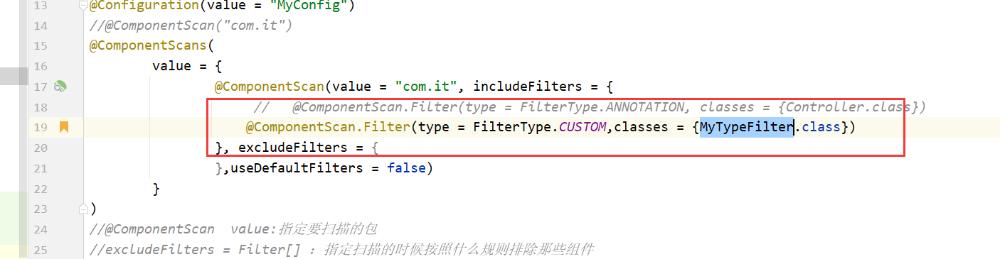
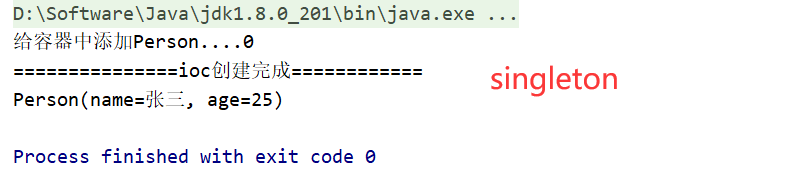
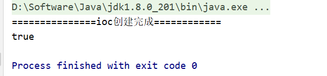
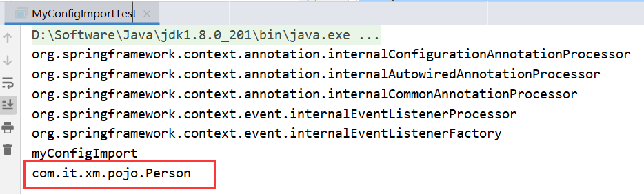
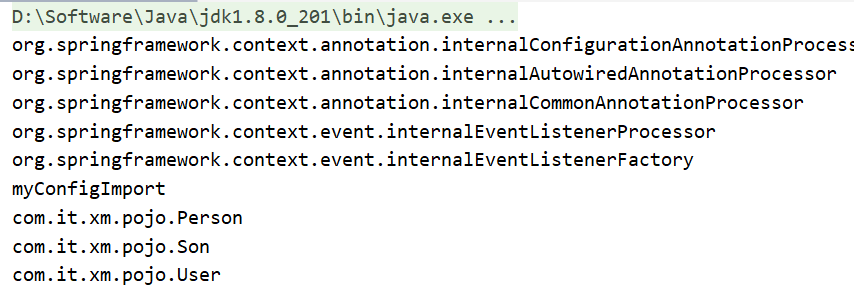
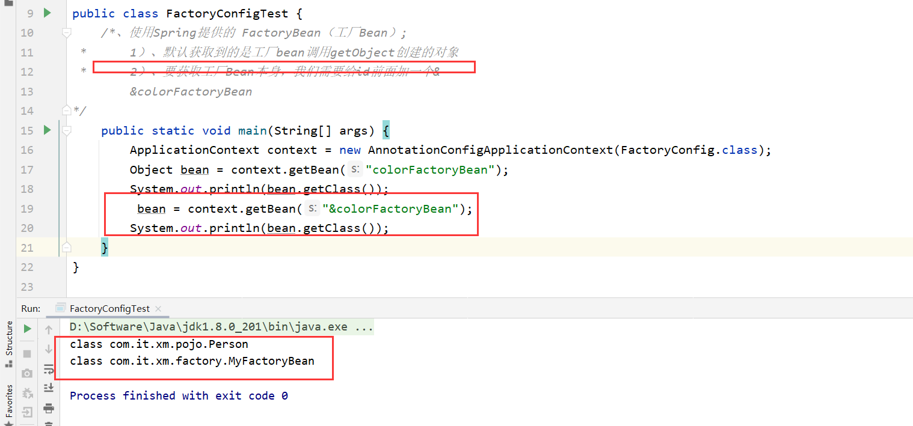

<h1>Spring注解</h1>


为了极大的减少配置文件

# 目录

-----------


[TOC]

# 创建项目


## pom


```xml
<?xml version="1.0" encoding="UTF-8"?>
<project xmlns="http://maven.apache.org/POM/4.0.0"
         xmlns:xsi="http://www.w3.org/2001/XMLSchema-instance"
         xsi:schemaLocation="http://maven.apache.org/POM/4.0.0 http://maven.apache.org/xsd/maven-4.0.0.xsd">
    <modelVersion>4.0.0</modelVersion>

    <groupId>com.it.xm</groupId>
    <artifactId>spring</artifactId>
    <version>1.0-SNAPSHOT</version>

    <properties>
        <maven.compiler.source>8</maven.compiler.source>
        <maven.compiler.target>8</maven.compiler.target>
    </properties>
    <dependencies>
        <dependency>
            <groupId>org.projectlombok</groupId>
            <artifactId>lombok</artifactId>
            <version>1.18.20</version>
            <scope>provided</scope>
        </dependency>
        <dependency>
            <groupId>org.springframework</groupId>
            <artifactId>spring-context</artifactId>
            <version>5.3.6</version>
        </dependency>
        <dependency>
            <groupId>junit</groupId>
            <artifactId>junit</artifactId>
            <version>4.13.2</version>
            <scope>test</scope>
        </dependency>
    </dependencies>
</project>
```


## pojo-Person


```java
@Data
public class Person {

    private String name;

    private String age;
}
```


# @Configuration和@Bean注册组件


## 1.配置类


```
/**
 * 声明当前这个类是配置组件类，
 * value属性代表当前spring组件的名字，可以省略
 *相当于<beans></beans>
 */
@Configuration(value = "MyConfig")
public class MyConfig {

    /**
     * 配置一个bean
     * 相当于
     * <bean id='person1' class="....."></bean>
     * name属性可以省略
     * @return
     */
    @Bean(name = "person1")
    public Person getPerson(){
        return  new Person("admin","12");
    }
}
```


## 2.测试


```java
public class MainTest {
    public static void main(String[] args) throws IOException {
        ApplicationContext applicationContext = new AnnotationConfigApplicationContext(MyConfig.class);
        Person bean = applicationContext.getBean(Person.class);
        System.out.println(bean);
        System.out.println("========================");
        //查看bean的名称
        String[] beanNamesForType = applicationContext.getBeanNamesForType(Person.class);
        for (String s : beanNamesForType) {
            System.out.println(s);
        }
    }
}
```


# @ComponentScan和@ComponentScans扫描包


## 1.简介


类似我们之前的spring的

```java
<context:component-scan base-package="com.it" use-default-filters="false"></context:component-scan>
```


## 2.案例


```java
@Configuration(value = "MyConfig")
//@ComponentScan("com.it")
@ComponentScans(
        value = {
                @ComponentScan(value = "com.it", includeFilters = {
                        @ComponentScan.Filter(type = FilterType.ANNOTATION, classes = {Controller.class})

                }, excludeFilters = {},useDefaultFilters = false)
        }
)

public class MyConfig {
```


> + useDefaultFilters:  禁用掉spring自动扫描规则
>
> + @ComponentScan  value:指定要扫描的包
>
> + excludeFilters = Filter[] ：指定扫描的时候按照什么规则排除那些组件
>
> + includeFilters = Filter[] ：指定扫描的时候只需要包含哪些组件
>
> + FilterType.ANNOTATION：按照注解
>
> + FilterType.ASSIGNABLE_TYPE：按照给定的类型；
>
> + FilterType.ASPECTJ：使用ASPECTJ表达式
>
> + FilterType.REGEX：使用正则指定
>
> +  FilterType.CUSTOM：使用自定义规则

## 3.自定义FilterType


### 3.1MyFilterType


```java
public class MyTypeFilter implements TypeFilter {
    /**
     * metadataReader：读取到的当前正在扫描的类的信息
     * metadataReaderFactory:可以获取到其他任何类信息的
     */
    @Override
    public boolean match(MetadataReader metadataReader, MetadataReaderFactory metadataReaderFactory)
            throws IOException {
        // TODO Auto-generated method stub
        //获取当前类注解的信息
        AnnotationMetadata annotationMetadata = metadataReader.getAnnotationMetadata();
        //获取当前正在扫描的类的类信息
        ClassMetadata classMetadata = metadataReader.getClassMetadata();
        //获取当前类资源（类的路径）
        Resource resource = metadataReader.getResource();
        String className = classMetadata.getClassName();
        System.out.println("--->"+className);
        if(className.contains("er")){//只扫描类名中有er的
            System.out.println(className);
            return true;
        }
        return false;
    }
}
```


### 3.2：配置类





# @Scope给组件设置

## 1.@Scope的value参数


| name      | message                                                      |
| --------- | ------------------------------------------------------------ |
| prototype | 多实例的：ioc容器启动并不会去调用方法创建对象放在容器中。每次获取的时候才会调用方法创建对象； |
| singleton | 单实例的（默认值）：ioc容器启动会调用方法创建对象放到ioc容器中。以后每次获取就是直接从容器（map.get()）中拿， |
| request   | 同一次请求创建一个实例                                       |
| session   | 同一个session创建一个实例                                    |


## 2.配置类


```java
@Configuration
public class MyConfigScope {
     int count = 0;
    //默认是单实例的
    /**
     * prototype：多实例的：ioc容器启动并不会去调用方法创建对象放在容器中。
     *                 每次获取的时候才会调用方法创建对象；
     * singleton：单实例的（默认值）：ioc容器启动会调用方法创建对象放到ioc容器中。
     *           以后每次获取就是直接从容器（map.get()）中拿，
     * request：同一次请求创建一个实例
     * session：同一个session创建一个实例
     */
    @Scope("prototype")
    @Bean("person")
    public Person person(){
        System.out.println("给容器中添加Person...."+(count++));
        return new Person("张三", "25");
    }
   
}
```


## 3.测试


### 代码

我们发现配置类中有`count`这个变量，我们改变不同的value属性来看控制台打印

```java
public class MyConfig2Test {
    public static void main(String[] args) {
        ApplicationContext context = new AnnotationConfigApplicationContext(MyConfigScope.class);
        System.out.println("===============ioc创建完成============");
        Person bean = (Person) context.getBean("person");
        System.out.println(bean);
        context.getBean("person");
        context.getBean("person");
        context.getBean("person");
        context.getBean("person");
    }
}
```


### 区别





# @Lazy懒加载Bean

## 1.简介


+ 懒加载：
	+ 单实例bean：默认在容器启动的时候创建对象；
	+ 懒加载：容器启动不创建对象。第一次使用(获取)Bean创建对象，并初始化；

## 2.配置类


```java
@Configuration
public class MyConfigLazy {
    /**
     * 懒加载：
     *  单实例bean：默认在容器启动的时候创建对象；
     *     懒加载：容器启动不创建对象。第一次使用(获取)Bean创建对象，并初始化；
     *
     * @return
     */
    @Lazy
    @Bean(name = "person1")
    public Person getPerson() {
        return new Person("admin", "12");
    }
}
```


## 3.测试类


```java
public class MyConfigLazyTest {
    public static void main(String[] args) {
        ApplicationContext context = new AnnotationConfigApplicationContext(MyConfigLazy.class);
        System.out.println("===============ioc创建完成============");
        Person bean1 = (Person) context.getBean("person1");
        Person bean2 = (Person) context.getBean("person1");
        System.out.println(bean1==bean2);

    }
}
```




# @Conditional按条件注册Bean


## 2.MyConfigConditional


```java
//类中组件统一设置。满足当前条件，这个类中配置的所有bean注册才能生效；
///@Conditional({MyConditional.class})
@Configuration
public class MyConfigConditional {

    /**
     * @Conditional({Condition}) ： 按照一定的条件进行判断，满足条件给容器中注册bean
     *
     *   如果容易有zhangsan，才给容器中注册("lisi")
     */
    @Bean("zhangsan")
    public Person person01() {
        return new Person("zhangsan", "12");
    }
    @Conditional({MyConditional.class})//满足当前条件，这个类中配置的所有bean注册才能生效；
    @Bean("lisi")
    public Person person02() {
        return new Person("lisi", "23");
    }
}
```


## 3.MyConditional


```java
public class MyConditional implements Condition {
    /**
     * ConditionContext：判断条件能使用的上下文（环境）
     * AnnotatedTypeMetadata：注释信息
     */
    @Override
    public boolean matches(ConditionContext context, AnnotatedTypeMetadata metadata) {
        //1、能获取到ioc使用的beanfactory
        ConfigurableListableBeanFactory beanFactory = context.getBeanFactory();
        //2、获取类加载器
        ClassLoader classLoader = context.getClassLoader();
        //3、获取当前环境信息
        Environment environment = context.getEnvironment();
        //4、获取到bean定义的注册类
        BeanDefinitionRegistry registry = context.getRegistry();
        //可以判断容器中的bean注册情况，也可以给容器中注册bean
        boolean definition = registry.containsBeanDefinition("zhangsan");
        if (definition==true){
            return  true;
        }
        return false;
    }
}
```


## 4.测试


```java
public class MyConfigConditionalTest {
    public static void main(String[] args) {
        ApplicationContext context = new AnnotationConfigApplicationContext(MyConfigConditional.class);
        Map<String, Person> beansOfType = context.getBeansOfType(Person.class);
        beansOfType.forEach((k,v)->{
            System.out.println(k+"==="+v);
        });

    }
}
```


## 5.注意


这个注解也可以作用在这个容器类上，然后对类中组件统一设置。满足当前条件，这个类中配置的所有bean注册才能生效；


# @Import注册Bean


## 1.简介


@Import[快速给容器中导入一个组件]
	  		1）、@Import(要导入到容器中的组件)；容器中就会自动注册这个组件，id默认是全类名
			  2）、ImportSelector:返回需要导入的组件的全类名数组；
	 		 3）、ImportBeanDefinitionRegistrar:手动注册bean到容器中


## 2.@Import快速导入


> @Import(要导入到容器中的组件)；容器中就会自动注册这个组件，id默认是全类名


### 2.1：配置类


```java
@Configuration
@Import(value = {Person.class})
public class MyConfigImport {
}
```


### 2.2：测试


```java
public class MyConfigImportTest {
    public static void main(String[] args) {
        ApplicationContext context = new AnnotationConfigApplicationContext(MyConfigImport.class);
        for (String beanDefinitionName : context.getBeanDefinitionNames()) {
            System.out.println(beanDefinitionName);
        }
    }
}
```





## 3.ImportSelector导入


> ImportSelector:返回需要导入的组件的全类名数组


### 3.1：配置类


```java
@Configuration
@Import(value = {Person.class, MyImportSelector.class})
public class MyConfigImport {
}
```


### 3.2：测试


```java
public class MyConfigImportTest {
    public static void main(String[] args) {
        ApplicationContext context = new AnnotationConfigApplicationContext(MyConfigImport.class);
        for (String beanDefinitionName : context.getBeanDefinitionNames()) {
            System.out.println(beanDefinitionName);
        }
    }
}
```





## 4.ImportBeanDefinitionRegistrar注册Bean


### 4.1：MyImportBeanDefinitionRegistrar


```java
public class MyImportBeanDefinitionRegistrar implements ImportBeanDefinitionRegistrar {

    /**
     *@param  importingClassMetadata：当前类的注解信息
     * @param registry:BeanDefinition注册类；
     *        把所有需要添加到容器中的bean；调用
     *        BeanDefinitionRegistry.registerBeanDefinition手工注册进来
     */
    @Override
    public void registerBeanDefinitions(AnnotationMetadata importingClassMetadata, BeanDefinitionRegistry registry) {
        boolean definition = registry.containsBeanDefinition("com.it.xm.pojo.Son");//判断容器是否有这个类
        boolean definition2 = registry.containsBeanDefinition("com.it.xm.pojo.Person");
        if(definition && definition2){
            //指定Bean定义信息；（Bean的类型，Bean。。。）
            RootBeanDefinition beanDefinition = new RootBeanDefinition(RainBow.class);
            //注册一个Bean，指定bean名
            registry.registerBeanDefinition("rainBow", beanDefinition);
        }
    }
}
```


### 4.2：MyConfigImport


```java
@Configuration
@Import(value = {Person.class, MyImportSelector.class, MyImportBeanDefinitionRegistrar.class})
public class MyConfigImport {
}
```


### 4.3：测试


```java
public class MyConfigImportTest {
    public static void main(String[] args) {
        ApplicationContext context = new AnnotationConfigApplicationContext(MyConfigImport.class);
        for (String beanDefinitionName : context.getBeanDefinitionNames()) {
            System.out.println(beanDefinitionName);
        }
    }
}
```


# FactoryBean注册Bean


## 1.MyFactoryBean


```java
public class MyFactoryBean implements FactoryBean<Person> {
    @Override
    public Person getObject() throws Exception {
        return new Person("factory","12");
    }


    @Override
    public Class<?> getObjectType() {
        // TODO Auto-generated method stub
        return Person.class;
    }

    //是单例？
    //true：这个bean是单实例，在容器中保存一份
    //false：多实例，每次获取都会创建一个新的bean；
    @Override
    public boolean isSingleton() {
        // TODO Auto-generated method stub
        return false;
    }

}
```


## 2.配置类


```java
@Configuration
public class FactoryConfig {

    @Bean
    public MyFactoryBean colorFactoryBean() {
        return new MyFactoryBean();
    }

}
```


## 3.测试


```java
public class FactoryConfigTest {
    /*、使用Spring提供的 FactoryBean（工厂Bean）;
 *        1）、默认获取到的是工厂bean调用getObject创建的对象
 *        2）、要获取工厂Bean本身，我们需要给id前面加一个&
        &colorFactoryBean
*/
    public static void main(String[] args) {
        ApplicationContext context = new AnnotationConfigApplicationContext(FactoryConfig.class);
        Object bean = context.getBean("colorFactoryBean");
        System.out.println(bean.getClass());
         bean = context.getBean("&colorFactoryBean");
        System.out.println(bean.getClass());
    }
}
```





