<h1>Spring Boot</h1>

# 目录

[TOC]


# 一、简介

## 1.1：Spring能做什么


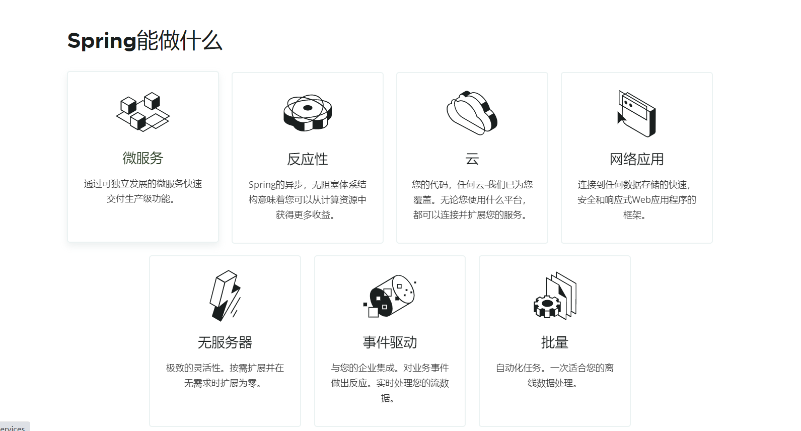


## 1.2：Spring生态圈


官网：https://spring.io/projects/spring-boot

覆盖了：

+ web开发

+ 数据访问

+ 安全控制

+ 分布式

+ 消息服务

+ 移动开发

+ 批处理

+ ......

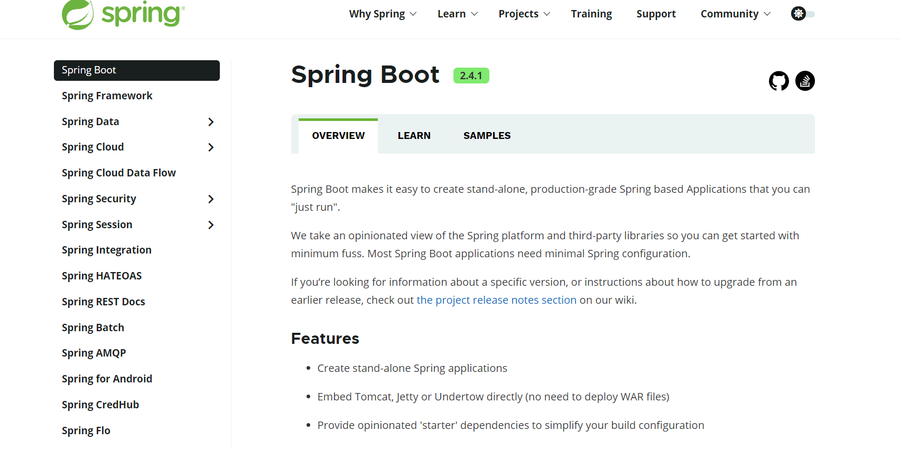


## 1.3：微服务


怎么说，先看一下[James Lewis and Martin Fowler (2014)])  提出微服务完整概念。https://martinfowler.com/microservices/


> In short, the **microservice architectural style** is an approach to developing a single application as a **suite of small services**, each **running in its own process** and communicating with **lightweight** mechanisms, often an **HTTP** resource API. These services are **built around business capabilities** and **independently deployable** by fully **automated deployment** machinery. There is a **bare minimum of centralized management** of these services, which may be **written in different programming languages** and use different data storage technologies.-- [James Lewis and Martin Fowler (2014)]()


上面一段话大概的意思就是


> 简而言之，**微服务架构风格**是一种将单个应用程序开发为一套小型服务的方法，每个服务运行在自己的进程中，并与**轻量级**机制(通常是**HTTP**资源API)通信。这些服务**围绕业务能力**构建，**通过完全**自动化部署**机器**独立部署。这些服务可能使用不同的编程语言**编写，使用不同的数据存储技术**，但对这些服务的集中管理**是最低限度的。——[詹姆斯·刘易斯和马丁·福勒(2014)]()


+ 微服务是一种架构风格

+ 一个应用拆分为一组小型服务

+ 每个服务运行在自己的进程内，也就是可独立部署和升级

+ 服务之间使用轻量级HTTP交互

+ 服务围绕业务功能拆分

+ 可以由全自动部署机制独立部署

+ 去中心化，服务自治。服务可以使用不同的语言、不同的存储技术


> + 个人理解
    >
    > 	微服务，可以简单的来说，我们把一个大型的项目，拆分成一个一个小的项目，部署在一个一个服务器上，虽然这样我们可以通过监控软件来看到每一个服务的运行状态，来对服务的管理；但是呢？正因为我们的服务是一个一个分开的部署，我们的服务与服务之间又有了很多问题，比如服务之间的链路断裂，服务之间的数据同步等等都牵涉到了很多问题！而这个时候分布式的概念就与之而来了？

## 1.4：分布式


### 1.是什么


“分布式计算是近年提出的一种新的计算方式，所谓分布式计算就是在两个或多个软件互相共享信息，这些软件既可以在同一台计算机上运行，也可以在通过网络连接起来的多台计算机上运行。”


### 2.分布式困难之处


+ 远程调用
+ 服务发现
+ 负载均衡
+ 服务容错
+ 配置管理
+ 服务监控
+ 链路追踪
+ 日志管理
+ 任务调度
+ 部署困难等等


### 3.解决方案


spring boot +spring cloud


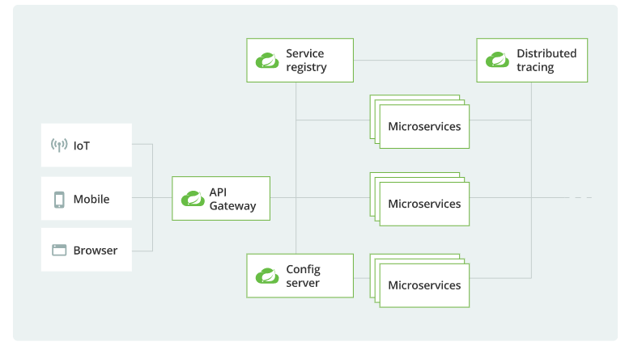


## 1.5：云原生


### 1.是什么


原生应用如何上云。 Cloud Native

云原生从字面意思上来看可以分成**云**和**原生**两个部分。

云是和本地相对的，传统的应用必须跑在本地服务器上，现在流行的应用都跑在云端，云包含了IaaS,、PaaS和SaaS。

原生就是土生土长的意思，我们在开始设计应用的时候就考虑到应用将来是运行云环境里面的，要充分利用云资源的优点，比如️云服务的**弹性**和**分布式**优势。


### 2.上云的困难


- 服务自愈
- 弹性伸缩
- 服务隔离
- 自动化部署
- 灰度发布
- 流量治理
- ......


### 3.解决方案


现在主流的应该是，docker容器化部署，和k8s这一套，目前没学过，后续更新笔记。


## 1.6：官方文档


https://spring.io/projects/spring-boot#learn

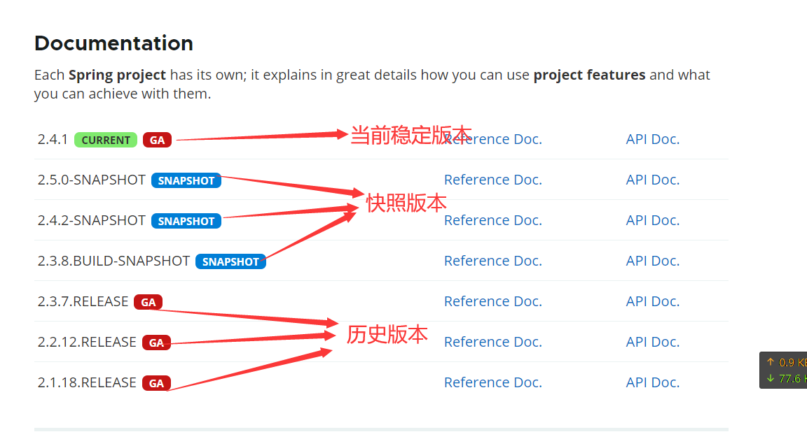


我们看最新的稳定版本就可以，点击`Reference Doc.`链接进入以下页面：

==（上面的翻译是修改html页面加的，并不是官网的）==

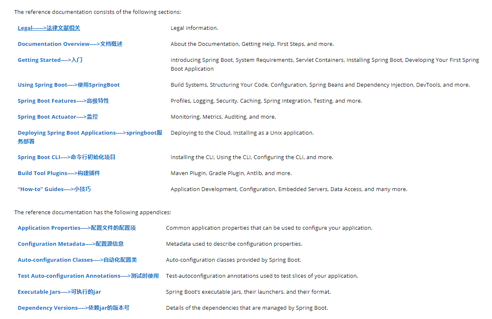


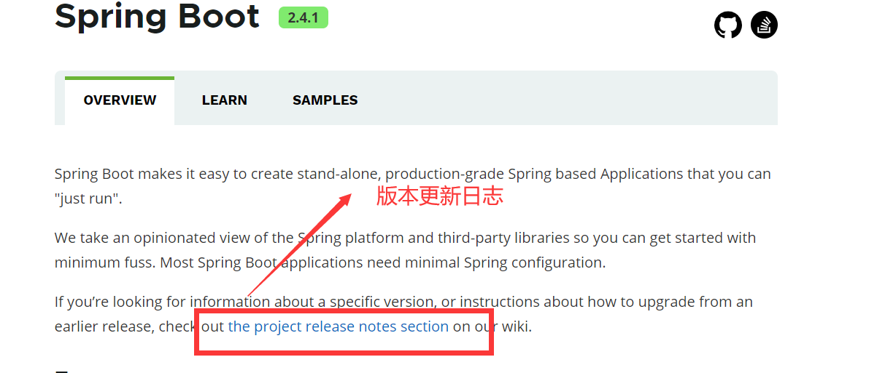


## 1.7：2.4更新内容


https://github.com/spring-projects/spring-boot/wiki/Spring-Boot-2.4-Release-Notes


# 二、HelloWorld


## 2.1：环境要求


> Spring Boot 2.4.1 requires [Java 8]() and is compatible up to Java 15 (included). [Spring Framework 5.3.2](https://docs.spring.io/spring/docs/5.3.2/reference/html/) or above is also required.
>
> Explicit build support is provided for the following build tools:
>
> | Build Tool | Version                                                      |
> | :--------- | :----------------------------------------------------------- |
> | Maven      | 3.3+                                                         |
> | Gradle     | 6 (6.3 or later). 5.6.x is also supported but in a deprecated form |
>
> jdk版本必须是8以上
>
> Spring Boot supports the following embedded servlet containers:
>
> | Name         | Servlet Version |
> | :----------- | :-------------- |
> | Tomcat 9.0   | 4.0             |
> | Jetty 9.4    | 3.1             |
> | Undertow 2.0 | 4.0             |


## 2.2：创建maven工程引入pom


==第一次下载可能比较慢==


```xml
<!--springboot父工程-->
<parent>
    <groupId>org.springframework.boot</groupId>
    <artifactId>spring-boot-starter-parent</artifactId>
    <version>2.4.1</version>
</parent>
<dependencies>
    <!--springboot web启动器-->
    <dependency>
        <groupId>org.springframework.boot</groupId>
        <artifactId>spring-boot-starter-web</artifactId>
    </dependency>
</dependencies>
```


## 2.3：创建启动类


```java
@SpringBootApplication
public class HelloWorldMain {

    public static void main(String[] args) {
        SpringApplication.run(HelloWorldMain.class);
    }
}
```


## 2.4：创建controller


```java
@RestController
public class HelloWorldController {

    @GetMapping
    public String hello(){
        System.out.println("Hello World! SpringBoot2.4.1 ");
        return "Hello World! SpringBoot2.4.1 ";
    }
}
```


## 2.5：测试


启动项目，访问：http://127.0.0.1:8080/


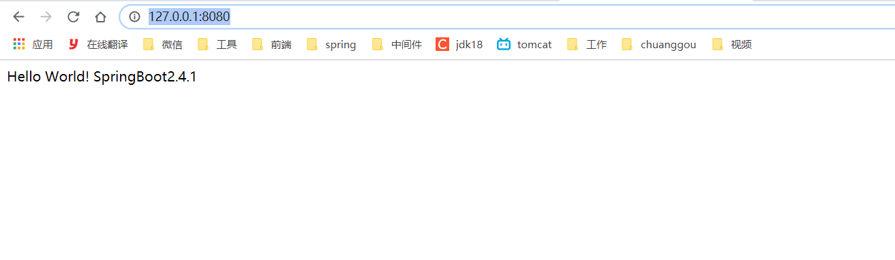

## 2.6：更改端口号


在`resource`目录下新建立`application.properties`文件写入以下内容


```properties
server.port=8888
```


重新运行项目访问：http://127.0.0.1:8888/


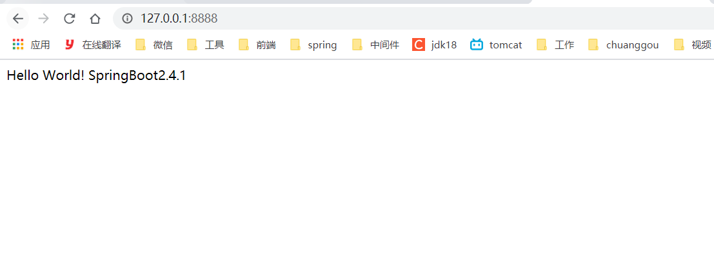

## 2.7：简化部署


pom文件加入以下插件：

```xml
<build>
    <plugins>
        <plugin>
            <groupId>org.springframework.boot</groupId>
            <artifactId>spring-boot-maven-plugin</artifactId>
        </plugin>
    </plugins>
</build>
```


运行

```powershell
 mvn clean package
```


打成jar包，执行以下命令启动项目


```powershell
java -jar jar包名字
```


注意点：

- 取消掉cmd的快速编辑模式


# 三、基础

## 3.1：依赖管理


```xml
<!--springboot父工程-->
<parent>
    <groupId>org.springframework.boot</groupId>
    <artifactId>spring-boot-starter-parent</artifactId>
    <version>2.4.1</version>
</parent>
<!--spring-boot-starter-parent的父项目-->
  <parent>
    <groupId>org.springframework.boot</groupId>
    <artifactId>spring-boot-dependencies</artifactId>
    <version>2.4.1</version>
  </parent>
```


上面的是springboot的父项目—–`spring-boot-dependencies`我们打开后发现他**几乎声明了所有开发中常用的依赖的版本号,自动版本仲裁机制**


- 无需关注版本号，自动版本仲裁


```
1、引入依赖默认都可以不写版本
2、引入非版本仲裁的jar，要写版本号。
```


## 3.2：修改默认依赖版本


```xml
1、查看spring-boot-dependencies里面规定当前依赖的版本 用的 key。
2、在当前项目里面重写配置
    <properties>
        <mysql.version>5.1.43</mysql.version>
    </properties>
```


## 3.3：start场景启动器


启动器是一组方便的依赖描述符，可以包含在应用程序中。您可以一站式购买所需的所有Spring和相关技术，而不必遍历示例代码并复制粘贴依赖描述符。例如，如果您想开始使用Spring和JPA来访问数据库，那么在您的项目中包含Spring -boot-starter-data- JPA依赖项。

启动器包含大量的依赖项，您需要这些依赖项才能使项目启动并快速运行，并具有一致的、受支持的托管传递依赖项集。


> 有正式启动者都遵循类似的命名模式;`spring-boot-starter-`，其中`*`是一种特殊类型的应用程序。这种命名结构是为了帮助您找到一个初学者。许多`idea`中的`Maven`集成允许您按名称搜索依赖项。例如，安装了适当的`Eclipse`或`STS`插件后，您可以在`POM`编辑器中按`ctrl-space`并键入`“spring-boot-starter”`来获得完整的列表。
>
>
>
> 正如“创建自己的启动器”一节中所解释的，第三方启动器不应该使用Spring - Boot，因为它是为正式的Spring Boot工件保留的。相反，第三方启动者通常从项目的名称开始。例如，**一个名为thirdpartyproject的第三方启动项目通常被命名为thirdpartyproject-spring-boot-starter。**


更多关于start启动器请查看下面网址：


https://docs.spring.io/spring-boot/docs/current/reference/html/using-spring-boot.html#using-boot-starter


## 3.4：自定义bannber


### 1.操作

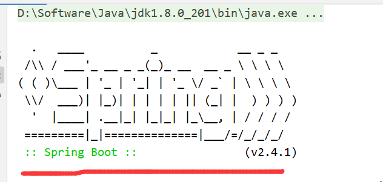


springboot启动时，这个图标就是bananer，我们可以修改一下：

`resource`下面建立`bananer.txt`文件写入以下内容：

```c
${AnsiColor.BRIGHT_YELLOW}
////////////////////////////////////////////////////////////////////
//                          _ooOoo_                               //
//                         o8888888o                              //
//                         88" . "88                              //
//                         (| ^_^ |)                              //
//                         O\  =  /O                              //
//                      ____/`---'\____                           //
//                    .'  \\|     |//  `.                         //
//                   /  \\|||  :  |||//  \                        //
//                  /  _||||| -:- |||||-  \                       //
//                  |   | \\\  -  /// |   |                       //
//                  | \_|  ''\---/''  |   |                       //
//                  \  .-\__  `-`  ___/-. /                       //
//                ___`. .'  /--.--\  `. . ___                     //
//              ."" '<  `.___\_<|>_/___.'  >'"".                  //
//            | | :  `- \`.;`\ _ /`;.`/ - ` : | |                 //
//            \  \ `-.   \_ __\ /__ _/   .-` /  /                 //
//      ========`-.____`-.___\_____/___.-`____.-'========         //
//                           `=---='                              //
//      ^^^^^^^^^^^^^^^^^^^^^^^^^^^^^^^^^^^^^^^^^^^^^^^^^^        //
//            佛祖保佑       永不宕机     永无BUG                  //
////////////////////////////////////////////////////////////////////
${AnsiColor.BRIGHT_RED}
Application Version: ${application.version}${application.formatted-version}
Spring Boot Version: ${spring-boot.version}${spring-boot.formatted-version}
```


### 2.配置文件


```properties
spring.banner.charset=utf-8
spring.banner.image.location=classpath:banner.txt
```


### 3.在线生成banner地址

https://www.bootschool.net/ascii;bsid=EAE08493039D20222BA17B48A919C903

当然可以直接放一个图片


## 3.5：lomback


### 1.引入依赖


```xml
<!--lombok-->
<dependency>
    <groupId>org.projectlombok</groupId>
    <artifactId>lombok</artifactId>
</dependency>
```


### 2.测试


```java
===============================简化JavaBean开发===================================
@NoArgsConstructor
//@AllArgsConstructor
@Data
@ToString
@EqualsAndHashCode
public class User {

    private String name;
    private Integer age;

    private Pet pet;

    public User(String name,Integer age){
        this.name = name;
        this.age = age;
    }


}

================================简化日志开发===================================
@Slf4j
@RestController
public class HelloController {
    @RequestMapping("/hello")
    public String handle01(@RequestParam("name") String name){
        
        log.info("请求进来了....");
        
        return "Hello, Spring Boot 2!"+"你好："+name;
    }
}
```


## 3.6：dev-tools


### 1.官方地址


https://docs.spring.io/spring-boot/docs/current/reference/html/using-spring-boot.html#using-boot-devtools


### 2.pom


```xml
<!--热部署devtools-->
<dependency>
    <groupId>org.springframework.boot</groupId>
    <artifactId>spring-boot-devtools</artifactId>
    <optional>true</optional>
</dependency>
```


### 3.使用


项目或者页面修改以后：Ctrl+F9；

或者点击：

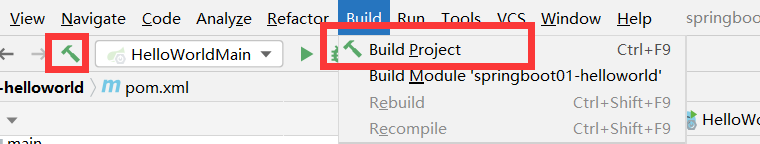


## 3.7：Spring Initailizr


+ 自动依赖引入
+ 自动创建项目结构
+ 自动编写好主配置类


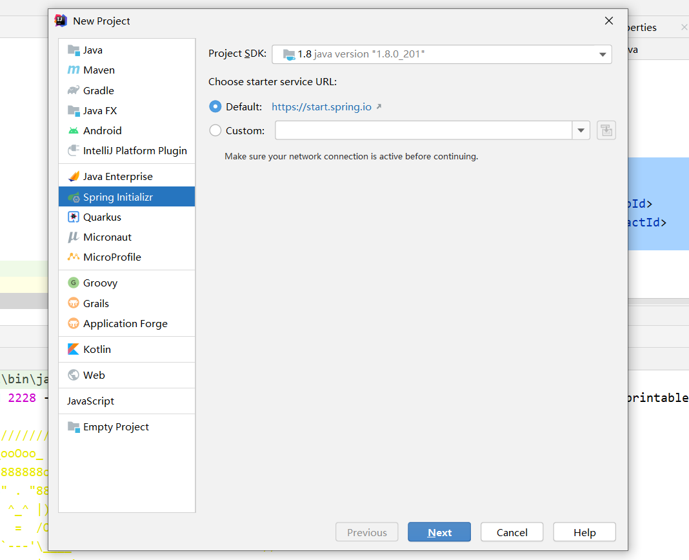


# 四、自动装配


## 4.1：简介


在前面使用[SSM集成]()时，我们可以使用注解实现无配置化注入，但是这种依赖被进行“人工干预了的”，换句话就是说我们手动进行装配，那么此时还没有达到SpringBoot这种自动装配的效果，那么究竟SpringBoot如何进行自动装配的呢?下面我们就一探究竟


> 举个可能不是很恰当的例子，SpringBoot的自动配置原理，跟餐厅的机制很类似。如果将SpringBoot比喻成餐厅，把吃饭比做我们的餐厅点菜小程序应用，我们来到探鱼吃饭的时候（**相当于在应用中加入了@SpringBootApplication**），服务员会引导我们开始在菜单点餐纸上点餐（**菜单点餐纸是预先定义好的，就相当于spring.factories文件，预先定义了我们可以使用的自动配置信息**），餐厅既可以自行搭配烤鱼口味，也可以直接点店家为我们搭配好的口味（**springboot也是如此，比如消息中间件，就有好多种口味可以选，比如rabbitmq，kafka，根据业务场景而定**），我们在喜欢的菜上进行勾选（**相当于在pom文件中引入所需框架的starter**），然后确定下单（**启动springboot应用**）。我很喜欢吃花菜，可惜餐厅没有这道辅菜，但是我们可以自己准备然后带过去啊，烤鱼上了就加进去煮，真是骚操作（**这就是加入自定义的自动配置了，这一步比较麻烦，需要自行封装starter**）。


## 4.2：@SpringBootApplication


源码如下：

```java
@Target({ElementType.TYPE})
@Retention(RetentionPolicy.RUNTIME)
@Documented
@Inherited
@SpringBootConfiguration
@EnableAutoConfiguration
@ComponentScan(
    excludeFilters = {@Filter(
    type = FilterType.CUSTOM,
    classes = {TypeExcludeFilter.class}
), @Filter(
    type = FilterType.CUSTOM,
    classes = {AutoConfigurationExcludeFilter.class}
)}
)
public @interface SpringBootApplication {
		//代码请参考源码，我们关注这个注解使用了那些复合注解
}
```


我们发现去掉一些`jdk`本身的注解，我们发现重要的注解是这三个：


```java
@SpringBootConfiguration
@EnableAutoConfiguration
@ComponentScan
```


并且在这个类中的注释和官网文档中都有一句相似但是又很重要的话：<font color='red'>@SpringBootApplication same as @Configuration @EnableAutoConfiguration @ComponentScan，</font>就是说我们这个`@SpringBootApplication`注解**等价**与`@Configuration `、`@EnableAutoConfiguration` 、`@ComponentScan`


## 4.3：@Configuration


### 1.准备实体类


```java
/**
 * 用户
 */
public class Users {
    private String name;
    private int age;
    private Address address;
	//get、set
}
/**
*地址
*/
public class Address {
    private String address;
}
```


### 2.spring配置


我们使用spring的时候我们是使用spring.xml的方式来配置这一些类

```xml
<bean id="user" class="com.it.bena.Users">
    <property name="address" ref="address"></property>
    <property name="name" value="tom"></property>
    <property name="age" value="12"></property>
</bean>
<bean id="address" class="com.it.bena.Address">
    <property name="address" value="火星"></property>
</bean>
```


### 3.SpringBoot方式


* `@Configuration` 这个注解等同与我们`spring`中的配置文件
* `@Bean`和被`@Bean`标注的方法 相当与我们`spring`配置文件中`bean标签`


```java
@Configuration
public class BeansConfig {

    @Bean
    public Users getUsers(){
        Users users = new Users();
        users.setName("admin");
        users.setAge(10);
        users.setAddress(getAddress());
        return  users;
    }
    @Bean
    public Address getAddress(){
        Address address = new Address();
        address.setAddress(UUID.randomUUID().toString());
        return address;
    }
}
```


### 4.测试


```java
@SpringBootApplication
public class HelloWorldMain {

    public static void main(String[] args) {
        ConfigurableApplicationContext run = SpringApplication.run(HelloWorldMain.class);
        String[] beanDefinitionNames = run.getBeanDefinitionNames();
        System.out.println("======================SpringBoot加载了那些组件======================");
        Arrays.stream(beanDefinitionNames).forEach(System.out::println);
        System.out.println("======================SpringBoot======================");
        Users user1 = run.getBean("user1", Users.class);
        System.out.println(user1);
        Users user2 = run.getBean("user2", Users.class);
        System.out.println(user2);
    }
}
/**
======================SpringBoot======================
Users{name='admin', age=10, address=Address{address='83f7d34c-bb26-4c90-8e31-58a55a71910b'}}
Users{name='admin', age=10, address=Address{address='83f7d34c-bb26-4c90-8e31-58a55a71910b'}}
**/
```


### 5.proxyBeanMethods属性


springboot2.0后`@Configuration`出现了一个新的属性，	`proxyBeanMthodes`

它的默认值默认是`true`

比较下列两张图片查看区别


我们观察图片发现为true的时候加载了一次，而为false的时候加载了两次


| 模式 | 属性值                   | 简介                                                |
| ---- | ------------------------ | --------------------------------------------------- |
| Full | proxyBeanMethods = true  | 保证每个@Bean方法被调用多少次返回的组件都是单实例的 |
| Lite | proxyBeanMethods = false | 每个@Bean方法被调用多少次返回的组件都是新创建的     |

<font color='red'>表格中说的方法被调用的时候不是我们获取bean去调用，而是spring的application容器被加载的时候调用的</font>


### 6.最佳实战


- - - 配置 类组件之间无依赖关系用Lite模式加速容器启动过程，减少判断
- 配置类组件之间有依赖关系，方法会被调用得到之前单实例组件，用Full模式


## 4.4：常用组件注解


| name           | message      |
| -------------- | ------------ |
| @Bean          | 组件         |
| @Component     | 实体类组件   |
| @Controller    | 控制器组件   |
| @Repository    | 数据库组件   |
| @ComponentScan | 包扫描       |
| @Service       | 业务逻辑组件 |


## 4.5：@Import


### 1.重点


+ spring3.0之后出现的新注解

+ springboot使用的时候必须配合组件类注解使用，否则不生效

+ 给容器中自动创建出这两个类型的组件、默认组件的名字就是全类名

使用方法：

+ 1、直接填class数组方式
+ 2、ImportSelector方式【重点】
+ 3、ImportBeanDefinitionRegistrar方式


### 2.直接填class数组方式


```java
//==================颜色类=================
public class Colors {
    public void getColor() {
        System.out.println("获取颜色");
    }
}
//==================配置类=================
@Import(value = {Colors.class})
@Configuration
public class ColorsConfig {

}
```


> 测试


```java
@SpringBootApplication
public class HelloWorldMain {
    public static void main(String[] args) {
        ConfigurableApplicationContext run = SpringApplication.run(HelloWorldMain.class);
        Colors bean = run.getBean(Colors.class.getName(),Colors.class);
        bean.getColor();
     }
 }
/**
获取颜色
**/
```


### 3.ImportSelector方式


这种方式的前提就是一个类要实现`ImportSelector`接口，假如我要用这种方法，目标对象是`Myclass`这个类，分析具体如下：创建`Myclass`类并实现`ImportSelector`接口


分析实现接口的selectImports方法中的：

- 1、返回值： 就是我们实际上要导入到容器中的组件全类名【**重点** 】
- 2、参数： AnnotationMetadata表示当前被@Import注解给标注的所有注解信息【不是重点】


<font color='red'>需要注意的是selectImports方法可以返回空数组但是不能返回null，否则会报空指针异常！></font>


> 第一步：创建Myclass类并实现ImportSelector接口，这里用于演示就添加一个全类名给其返回值


```java
public class MyClass implements ImportSelector {
    @Override
    public String[] selectImports(AnnotationMetadata importingClassMetadata) {
        System.out.println("===============");
        //这里写入我们注入的全类名
        return new String[]{Users.class.getName()};
    }
}
```


> 第二步：编写TestDemo 类，并标注上使用ImportSelector方式的Myclass类


```java
@Import(MyClass.class)
@Configuration
public class MyClassConfig {
}
```


> 第三步：编写打印容器中的组件测试类


```java
@SpringBootApplication
public class HelloWorldMain {
    public static void main(String[] args) {
       	 ConfigurableApplicationContext run = SpringApplication.run(HelloWorldMain.class);
      	 String[] beanDefinitionNames = run.getBeanDefinitionNames();
     	 System.out.println("======================SpringBoot加载了那些组件======================");
         Arrays.stream(beanDefinitionNames).forEach(System.out::println);
         System.out.println("======================SpringBoot======================");
    }
}
```


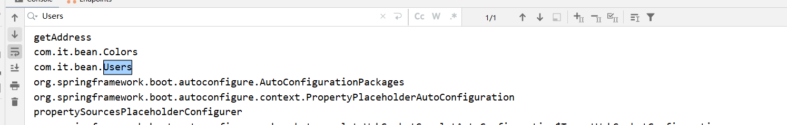


### 4.ImportBeanDefinitionRegistrar方式


同样是一个接口，类似于第二种ImportSelector用法，相似度80%，只不过这种用法比较自定义化注册，具体如下：

> 第一步：创建Myclass2类并实现ImportBeanDefinitionRegistrar接口


```java
public class Myclass2 implements ImportBeanDefinitionRegistrar {

    /**
     * 第一个参数：annotationMetadata 和之前的ImportSelector参数一样都是表示当前被@Import注解给标注的所有注解信息
     * 第二个参数表示用于注册定义一个bean
     */
    @Override
    public void registerBeanDefinitions(AnnotationMetadata importingClassMetadata, BeanDefinitionRegistry registry) {
//指定bean定义信息（包括bean的类型、作用域...）
        RootBeanDefinition rootBeanDefinition = new RootBeanDefinition(Address.class);
        //注册一个bean指定bean名字（id）
        registry.registerBeanDefinition("TestDemo4444", rootBeanDefinition);
    }
}
```


> 第二步：编写代码，自定义注册bean


```java
@Import(Myclass2.class)
@Configuration
public class Myclass2Config {
}
```


> 第三步：测试


```java
@SpringBootApplication
public class HelloWorldMain {
    public static void main(String[] args) {
       	 ConfigurableApplicationContext run = SpringApplication.run(HelloWorldMain.class);
      	 String[] beanDefinitionNames = run.getBeanDefinitionNames();
     	 System.out.println("======================SpringBoot加载了那些组件======================");
         Arrays.stream(beanDefinitionNames).forEach(System.out::println);
         System.out.println("======================SpringBoot======================");
    }
}
```


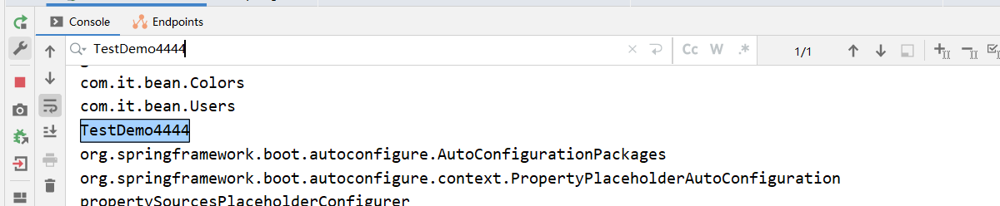


### 5.总结


> 第一种用法：`@Import`（{ 要导入的容器中的组件 } ）：容器会自动注册这个组件，**id默认是全类名**
>
> 第二种用法：`ImportSelector`：返回需要导入的组件的全类名数组，springboot底层用的特别多【**重点** 】
>
> 第三种用法：`ImportBeanDefinitionRegistrar`：手动注册bean到容器

**以上三种用法方式皆可混合在一个@Import中使用，特别注意第一种和第二种都是以全类名的方式注册，而第三中可自定义方式。**

<font color='red'>@Import注解本身在springboot中用的很多，特别是其中的第二种用法ImportSelector方式在springboot中使用的特别多，尤其要掌握！</font>


## 4.6：@Conditional


### 1.简介


+ 条件装配：满足Conditional指定的条件，则进行组件注入

+ @Conditional是Spring4新提供的注解，它的作用是按照一定的条件进行判断，满足条件给容器注册bean。


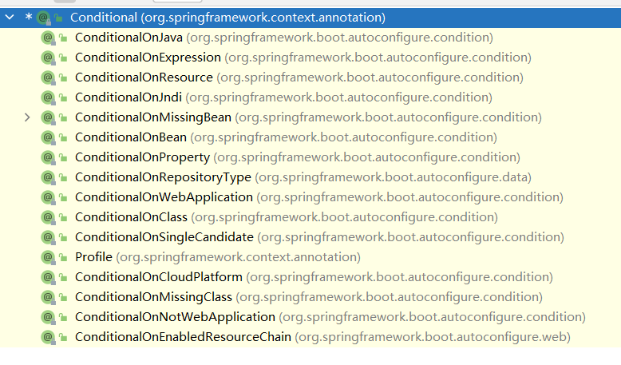


### 2.案例


```java
=====================测试条件装配==========================
@Configuration(proxyBeanMethods = false) 
//@ConditionalOnBean(name = "tom")//当存在tom这个实例对象才可以使用此配置类
@ConditionalOnMissingBean(name = "tom")//当tom被实例化才可以初始化此配置类
public class MyConfig {

    @Bean 
    public User user01(){
        User zhangsan = new User("zhangsan", 18);
        //user组件依赖了Pet组件
        zhangsan.setPet(tomcatPet());
        return zhangsan;
    }

    @Bean("tom22")
    public Pet tomcatPet(){
        return new Pet("tomcat");
    }
}

public static void main(String[] args) {
        //1、返回我们IOC容器
        ConfigurableApplicationContext run = SpringApplication.run(MainApplication.class, args);

        //2、查看容器里面的组件
        String[] names = run.getBeanDefinitionNames();
        for (String name : names) {
            System.out.println(name);
        }

        boolean tom = run.containsBean("tom");
        System.out.println("容器中Tom组件："+tom);

        boolean user01 = run.containsBean("user01");
        System.out.println("容器中user01组件："+user01);

        boolean tom22 = run.containsBean("tom22");
        System.out.println("容器中tom22组件："+tom22);
    }
```


## 4.7：@ImportResource


主要是引入我们的spring配置文件


### 1.创建spring配置文件


```xml
<?xml version="1.0" encoding="UTF-8"?>
<beans xmlns="http://www.springframework.org/schema/beans"
       xmlns:xsi="http://www.w3.org/2001/XMLSchema-instance"
       xmlns:context="http://www.springframework.org/schema/context"
       xsi:schemaLocation="http://www.springframework.org/schema/beans http://www.springframework.org/schema/beans/spring-beans.xsd http://www.springframework.org/schema/context https://www.springframework.org/schema/context/spring-context.xsd">

    <bean id="haha" class="com.it.bean.Users">
        <property name="name" value="zhangsan"></property>
        <property name="age" value="18"></property>
    </bean>

    <bean id="hehe" class="com.it.bean.Address">
        <property name="address" value="tomcat"></property>
    </bean>
</beans>
```


### 2.在启动类或者配置类上面加上注解：


```java
  @ImportResource("classpath:bean.xml")//引入spring配置文件
```


### 3.测试


```java
@SpringBootApplication
@ImportResource("classpath:bean.xml")
public class HelloWorldMain {
    public static void main(String[] args) {
        ConfigurableApplicationContext run = SpringApplication.run(HelloWorldMain.class);
        boolean haha = run.containsBean("haha");
        boolean hehe = run.containsBean("hehe");
        System.out.println("haha：" + haha);//true
        System.out.println("hehe：" + hehe);//true
    }
}
/**
打印结果：
haha：true
hehe：true
**/
```


## 4.8：@ConfigurationProperties


### 1.简介


主要用于数据绑定，我们在需要的绑定数据的类上加上`组件型`注解，然后使用`@ConfigurationProperties`注解标明我们数据绑定的前缀。当然我们还可以使用：`@EnableConfigurationProperties`

注意：

+ 如果使用yaml文件来进行数据绑定我们需要一个新的start启动器

+ 注解中prefix中不能出现**大写字母**


```xml
<dependency>
   <groupId>org.springframework.boot</groupId>
   <artifactId>spring-boot-configuration-processor</artifactId>
   <optional>true</optional>
</dependency>
```


### 2.实体类


> Person


```java
@Component("person")
@ConfigurationProperties(prefix = "person")
public class Person {
    private int id;
    private String name;
    private int age;
    private boolean sex;
    private Date regDate;
    private Map<String, Object> map = new HashMap<>();
    private List<Object> list;
    private Son address;
    //get、set自己写
 }
```


> Son


```java
@Component
@ConfigurationProperties(prefix = "son")
public class Son {
    private  int id;
    private  String name;
     //get、set自己写
 }
```


### 3.proterties类型配置


```properties
person.id=1000
person.name=斌哥哥
person.sex=true
person.reg-date=2020/03/20
person.age=200
person.map.key1=value1
person.map.key2=value2
person.list=list1,list2
person.son.id=1
person.son.name=河南洛阳
```


### 4.ymal类型配置


```yaml
user:
  id: 1000
  name: bingege
  age: 21
  sex: true
  reg-date: 2020/03/20
  map: {key1: value1,key2: value2,key3: value3}
  list:
    - a
    - b
    - c
    - d
    - e
  address:
    id: 1
    name: 河南省洛阳市
```


### 5.测试


```java
    @Autowired
    private Person person;

    @GetMapping("/person")
    public Person person() {
        return person;
    }
```


游览器访问：http://127.0.0.1:8888/person

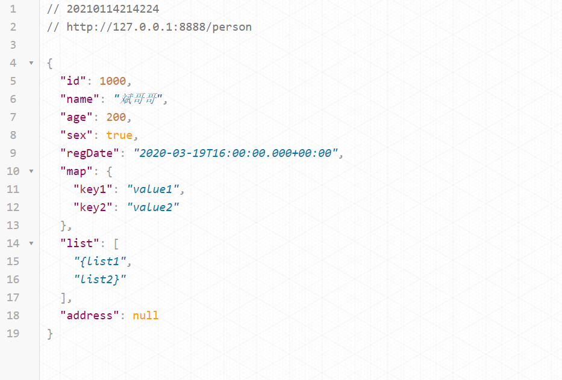


### 6.@EnableConfigurationProperties


我们可以使用：`@EnableConfigurationProperties`注解，但是注意这个注解我们要么在**启动类**上使用，要么在**配置类上**使用。

并且**实体类**上必须有`@ConfigurationProperties`注解

看案例：


> 实体类


```java
@ConfigurationProperties(prefix = "threacar")
public class ThreadCars {
    private String name;
    private Double price;
 }
```


> 配置类


```java
@Configuration
@EnableConfigurationProperties(value = {ThreadCars.class})
//1、开启ThreadCars配置绑定功能
//2、把这个ThreadCars这个组件自动注册到容器中
public class ThreadCarsConfig {

}
```


> 配置文件


```properties
threaCar.name=劳斯莱斯
threaCar.price=6666
```


> 测试


```Java
@Autowired
private ThreadCars threadCars;

@GetMapping("/threadCars")
public ThreadCars threadCars() {
    return threadCars;
}
```


访问：http://127.0.0.1:8888/threadCars


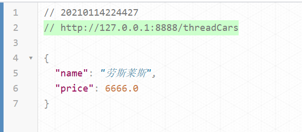

## 4.9：源码解析


### 1.先看@SpringBootApplicatio


#### 1.1：源码


```java
@SpringBootConfiguration
@EnableAutoConfiguration
@ComponentScan(excludeFilters = { @Filter(type = FilterType.CUSTOM, classes = TypeExcludeFilter.class),
      @Filter(type = FilterType.CUSTOM, classes = AutoConfigurationExcludeFilter.class) })
public @interface SpringBootApplication {
```


我们前面说：


接下来我们开始一个一个注解开始查看


#### 1.2：@SpringBootConfiguration


```java
@Target(ElementType.TYPE)
@Retention(RetentionPolicy.RUNTIME)
@Documented
@Configuration
public @interface SpringBootConfiguration {
```


我们发现只有一个`@Configuration`这个注解,这个注解是一个**标明springboot配置类的注解**，被他标明的类标明当前的类是一个配置类，而我们的**启动类**是一个特别重要的配置类。


#### 1.3：@ComponentScan


这个注解就不多说了，学习spring的时候学过这个注解，他指定扫描哪些，Spring注解；

```java
@ComponentScan(excludeFilters = { @Filter(type = FilterType.CUSTOM, classes = TypeExcludeFilter.class),
      @Filter(type = FilterType.CUSTOM, classes = AutoConfigurationExcludeFilter.class) })
```


它这里使用spring官方定义的规范。


#### 1.4：@EnableAutoConfiguration


请查看下一章节 [四、自动装配—>4.9:源码分析—–>2.@EnableAutoConfiguration][]

------


### 2.@EnableAutoConfiguration


#### 2.1：源码


```java
@AutoConfigurationPackage
@Import(AutoConfigurationImportSelector.class)
public @interface EnableAutoConfiguration {
```


#### 2.2：@AutoConfigurationPackage


`AutoConfigurationPackage`翻译过来就是`自动配置包`


```java
@Target(ElementType.TYPE)
@Retention(RetentionPolicy.RUNTIME)
@Documented
@Inherited
@Import(AutoConfigurationPackages.Registrar.class)
public @interface AutoConfigurationPackage {
```


在这个注解上面也有一个`@Import`注解，我们查看一下源码这个注解帮我们导入了那些配置类，**（源码位置在AutoConfigurationPackages的107行）**


```java
static class Registrar implements ImportBeanDefinitionRegistrar, DeterminableImports {

   @Override
   public void registerBeanDefinitions(AnnotationMetadata metadata, BeanDefinitionRegistry registry) {
      register(registry, new PackageImports(metadata).getPackageNames().toArray(new String[0]));
   }

   @Override
   public Set<Object> determineImports(AnnotationMetadata metadata) {
      return Collections.singleton(new PackageImports(metadata));
   }

}
```


#### 2.3：debug调试


先看`new PackageImports(metadata).getPackageNames()`这个方法得到了什么，`com.it`这个包名是我们主启动类所在包下以及子包的目录，这也证明了，我们在写springboot程序时，不可以在**主程序所在包，以及子包外去写我们的组件类**

+ 总结一下

> ```java
> @Import(AutoConfigurationPackages.Registrar.class)  //给容器中导入一个组件
> public @interface AutoConfigurationPackage {}
> ```
>
> + **利用Registrar给容器中导入一系列组件**
> + **将指定的一个包下的所有组件导入进来？主程序 所在包下**


#### 2.4：@Import(AutoConfigurationImportSelector.class)


查看`AutoConfigurationImportSelector`的源码：


```java
public class AutoConfigurationImportSelector implements DeferredImportSelector, BeanClassLoaderAware,
      ResourceLoaderAware, BeanFactoryAware, EnvironmentAware, Ordered {
          /**
          省略一些代码
          **/
      /**
      将我们springboot的配置类，注册到我们的apllication容器中
      **/
          	@Override
	public String[] selectImports(AnnotationMetadata annotationMetadata) {
		if (!isEnabled(annotationMetadata)) {
			return NO_IMPORTS;
		}
		AutoConfigurationEntry autoConfigurationEntry = getAutoConfigurationEntry(annotationMetadata);
		return StringUtils.toStringArray(autoConfigurationEntry.getConfigurations());
	}
          //源码118行  我们getCandidateConfigurations(annotationMetadata, attributes);获取到的全部的配置类，但是有一些配置类不需要，通过这个这个方法筛选出来我们需要的配置类
    protected AutoConfigurationEntry getAutoConfigurationEntry(AnnotationMetadata annotationMetadata) {
		if (!isEnabled(annotationMetadata)) {
			return EMPTY_ENTRY;
		}
		AnnotationAttributes attributes = getAttributes(annotationMetadata);
		List<String> configurations = getCandidateConfigurations(annotationMetadata, attributes);
		configurations = removeDuplicates(configurations);
		Set<String> exclusions = getExclusions(annotationMetadata, attributes);
		checkExcludedClasses(configurations, exclusions);
		configurations.removeAll(exclusions);
		configurations = getConfigurationClassFilter().filter(configurations);
		fireAutoConfigurationImportEvents(configurations, exclusions);
		return new AutoConfigurationEntry(configurations, exclusions);
	}
          //源码152行  获取AnnotationAttributes对象的，这里面
  protected AnnotationAttributes getAttributes(AnnotationMetadata metadata) {
		String name = getAnnotationClass().getName();
		AnnotationAttributes attributes = AnnotationAttributes.fromMap(metadata.getAnnotationAttributes(name, true));
		Assert.notNull(attributes, () -> "No auto-configuration attributes found. Is " + metadata.getClassName()
				+ " annotated with " + ClassUtils.getShortName(name) + "?");
		return attributes;
	}
          //源码117行  从META-INF/spring.factories获取到加载的配置类	
       protected List<String> getCandidateConfigurations(AnnotationMetadata metadata, AnnotationAttributes attributes) {
		List<String> configurations = SpringFactoriesLoader.loadFactoryNames(getSpringFactoriesLoaderFactoryClass(),
				getBeanClassLoader());
		Assert.notEmpty(configurations, "No auto configuration classes found in META-INF/spring.factories. If you "
				+ "are using a custom packaging, make sure that file is correct.");
		return configurations;
	}
 }          
```


#### 2.5：debug


我们发现它实现了 `DeferredImportSelector`这个接口，他是`ImportSelector`的子类**（可以查看前面的@import注解的使用）**，我们来在<font color='red'>源码95行打上断点，debug来进行</font>


+ 总结一下

> 1、利用getAutoConfigurationEntry(annotationMetadata);给容器中批量导入一些组件
>
> 2、调用List<String> configurations = getCandidateConfigurations(annotationMetadata, attributes)获取到所有需要导入到容器中的配置类
>
> 3、利用工厂加载 Map<String, List<String>> loadSpringFactories(@Nullable ClassLoader classLoader)；得到所有的组件
>
> 4、从META-INF/spring.factories位置来加载一个文件。
>
> 默认扫描我们当前系统里面所有META-INF/spring.factories位置的文件 spring-boot-autoconfigure-2.3.4.RELEASE.jar包里面也有META-INF/spring.factories


### 3.META-INF/spring.factories所在位置


springboot启动时会通过`@Import`这个注解，扫描所有的包下面的`META-INF/spring.factories`这个文件

文件里面写死了spring-boot一启动就要给容器中加载的所有配置类，他把所有的启动类写死了


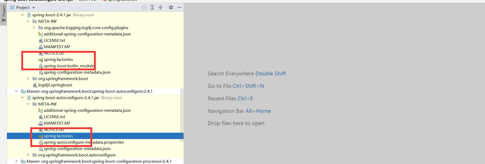


### 4.按需装配


我们查看一下有多少个场景配置类

```java
     ConfigurableApplicationContext run = SpringApplication.run(HelloWorldMain.class);
        System.out.println("一共有几个组件加载："+run.getBeanDefinitionCount());

/**
打印结果：
		一共有几个组件加载：147
*/
```


+ 虽然我们127个场景的所有自动配置启动的时候默认全部加载。xxxxAutoConfiguration
+ 按照条件装配规则（`@Conditiona`），最终会按需配置。


### 5.修改默认配置


#### 1.简介


springboot几乎帮我们配置了所有的配置，但是我们实际开发中可能需要修改这一些配置，这个时候我们就需要自己来配置这些配置类。

+ 例如

```java
        @Bean
        @ConditionalOnBean(MultipartResolver.class)  //容器中有这个类型组件
        @ConditionalOnMissingBean(name = DispatcherServlet.MULTIPART_RESOLVER_BEAN_NAME) //容器中没有这个名字 multipartResolver 的组件
        public MultipartResolver multipartResolver(MultipartResolver resolver) {
            //给@Bean标注的方法传入了对象参数，这个参数的值就会从容器中找。
            //SpringMVC multipartResolver。防止有些用户配置的文件上传解析器不符合规范
            // Detect if the user has created a MultipartResolver but named it incorrectly
            return resolver;
        }
给容器中加入了文件上传解析器；
```


#### 2.总结


SpringBoot默认会在底层配好所有的组件。但是如果用户自己配置了以用户的优先

- SpringBoot先加载所有的自动配置类  xxxxxAutoConfiguration
- 每个自动配置类按照条件进行生效，默认都会绑定配置文件指定的值。xxxxProperties里面拿。xxxProperties和配置文件进行了绑定
- 生效的配置类就会给容器中装配很多组件
- 只要容器中有这些组件，相当于这些功能就有了
- 定制化配置

- - 用户直接自己@Bean替换底层的组件
- 用户去看这个组件是获取的配置文件什么值就去修改。

**xxxxxAutoConfiguration ---> 组件  --->** **xxxxProperties里面拿值  ----> application.properties**


## 4.10：实战案例


- 引入场景依赖

- - https://docs.spring.io/spring-boot/docs/current/reference/html/using-spring-boot.html#using-boot-starter

- 查看自动配置了哪些（选做）

- - 自己分析，引入场景对应的自动配置一般都生效了
- 配置文件中`debug=true`开启自动配置报告。Negative（不生效）\Positive（生效）

- 是否需要修改

- - 参照文档修改配置项

- - - https://docs.spring.io/spring-boot/docs/current/reference/html/appendix-application-properties.html#common-application-properties
- 自己分析。xxxxProperties绑定了配置文件的哪些。

- - 自定义加入或者替换组件

- - - @Bean、@Component。。。

- - 自定义器  **XXXXXCustomizer**；
- ......


# 五、yaml配置文件


## 5.1：前言


SpringBoot的有两种格式的全局配置文件，使用任何一个功能都是一样的，注意：

SpringBoot的全局配置文件名都是固定的application.xxx

① application.properties， 这个是默认Spring initializr默认自动生成的配置文件，也是我们属性的文件格式

② application.yml，除了properties文件可以做为SpringBoot的配置文件以外，SpringBoot还支持一种我们以前没接触过的配置文件，这就是YAML配置文件

我们任意一种配置文件即可


## 5.2：什么是yaml


YAML 是 "YAML Ain't Markup Language"（YAML 不是一种标记语言）的递归缩写。在开发的这种语言时，YAML 的意思其实是："Yet Another Markup Language"（仍是一种标记语言）。

非常适合用来做以数据为中心的配置文件


## 5.3：基本语法


+ key: value；kv之间有空格
+ 大小写敏感
+ 使用缩进表示层级关系
+ 缩进不允许使用tab，只允许空格
+ 缩进的空格数不重要，只要相同层级的元素左对齐即可
+ '#'表示注释
+ 字符串无需加引号，如果要加，''与""表示字符串内容 会被 转义/不转义


## 5.4：注释


```yml
#yml文件不支持多行注解
#需要多行注解这样写
```


## 5.5：数据类型


### 1.字面量


单个的、不可再分的值。date、boolean、string、number、null

```yaml
k: v
```


###  2.对象


键值对的集合。map、hash、set、object


```yaml
#行内写法：  
k: {k1:v1,k2:v2,k3:v3}
#或
k: 
  k1: v1
  k2: v2
  k3: v3
```


### 3.数组


一组按次序排列的值。array、list、queue


```yaml
#行内写法： 
k: [v1,v2,v3]
#或者
k:
 - v1
 - v2
 - v3
```


### 4.示例


```java
@Data
public class Person {
   private String userName;
    private Boolean boss;
    private Date birth;
    private Integer age;
    private Pet pet;
    private String[] interests;
    private List<String> animal;
    private Map<String, Object> score;
    private Set<Double> salarys;
    private Map<String, List<Pet>> allPets;
   }
   @Data
   public class Pet {
    private String name;
    private Double weight;
   }
```


```yaml
# yaml表示以上对象
person:
  userName: zhangsan
  boss: false
  birth: 2019/12/12 20:12:33
  age: 18
  pet: 
    name: tomcat
    weight: 23.4
  interests: [篮球,游泳]
  animal: 
    - jerry
    - mario
  score:
    english: 
      first: 30
      second: 40
      third: 50
    math: [131,140,148]
    chinese: {first: 128,second: 136}
  salarys: [3999,4999.98,5999.99]
  allPets:
    sick:
      - {name: tom}
      - {name: jerry,weight: 47}
    health: [{name: mario,weight: 47}]
```


## 5.6：配置提示


自定义的类和配置文件绑定一般没有提示。

```xml
        <dependency>
            <groupId>org.springframework.boot</groupId>
            <artifactId>spring-boot-configuration-processor</artifactId>
            <optional>true</optional>
        </dependency>

 <build>
        <plugins>
            <plugin>
                <groupId>org.springframework.boot</groupId>
                <artifactId>spring-boot-maven-plugin</artifactId>
                <configuration>
                    <excludes>
                        <exclude>
                            <groupId>org.springframework.boot</groupId>
                            <artifactId>spring-boot-configuration-processor</artifactId>
                        </exclude>
                    </excludes>
                </configuration>
            </plugin>
        </plugins>
    </build>
```


# 六、web开发


## 6.1：整合servlet/listenner/filter(方式1)


### 1.创建servlet、Linstenner、Filter


```java
===================Servlet===================================
@WebServlet(name = "MyServlet1",urlPatterns = "/servlet1")
public class MyServlet1  extends HttpServlet {
    @Override
    protected void doGet(HttpServletRequest req, HttpServletResponse resp) throws ServletException, IOException {
        System.out.println(MyServlet1.class+  "\tdoGet 调用");
        resp.getOutputStream().write("hello servlet1".getBytes());
    }
}
===================Linstenner===================================
 @WebListener
public class MyListenner1 implements ServletContextListener {
    @Override
    public void contextInitialized(ServletContextEvent sce) {
        System.out.println(MyListenner1.class+"\t服务器初始化完成");
    }

    @Override
    public void contextDestroyed(ServletContextEvent sce) {
        System.out.println(MyListenner1.class+"\t服务器死亡回调");
    }
}
===================Filter===================================
@WebFilter
public class MyFilter1 extends HttpFilter {
    public MyFilter1() {
        super();
    }

    @Override
    public void doFilter(ServletRequest request, ServletResponse response, FilterChain chain) throws IOException, ServletException {
        System.out.println("禁止通行");
        chain.doFilter(request, response);
        System.out.println("允许通行");
    }

    @Override
    protected void doFilter(HttpServletRequest request, HttpServletResponse response, FilterChain chain) throws IOException, ServletException {
        super.doFilter(request, response, chain);
    }
}

```


### 2.启动类


```java
@SpringBootApplication
//扫描servlet/listenner/filter所在的包
@ServletComponentScan(basePackages = {"com.example.servlet","com.example.listenner","com.example.filter"})
public class App {

    public static void main(String[] args) {
        SpringApplication.run(App.class, args);
    }

}
```


### 3.测试


http://127.0.0.1:8080/servlet1

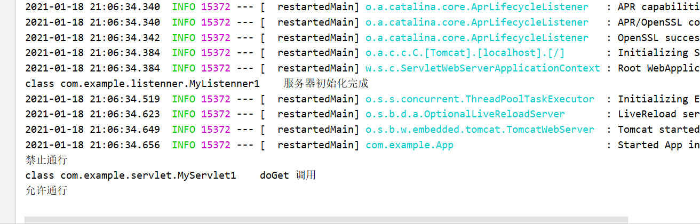


## 6.2：整合servlet/listenner/filter(方式2)


### 1.前言


+ 常用的Web事件的监听接口如下：

| name                              | message                                |
| --------------------------------- | -------------------------------------- |
| ServletContextListener：          | 用于监听Web的启动及关闭                |
| ServletContextAttributeListener： | 用于监听ServletContext范围内属性的改变 |
| ServletRequestListener：          | 用于监听用户请求                       |
| ServletRequestAttributeListener： | 用于监听ServletR                       |
| equest                            | 范围属性的改变                         |
| HttpSessionListener：             | 用于监听用户session的开始及结束        |
| HttpSessionAttributeListener：    | 用于监听HttpSession范围内的属性改变    |

### 1.创建servlet、Linstenner、Filter


```java
===================Servlet===================================

public class MyServlet2  extends HttpServlet {
    @Override
    protected void doGet(HttpServletRequest req, HttpServletResponse resp) throws ServletException, IOException {
        System.out.println(MyServlet2.class+  "\tdoGet 调用");
        resp.getOutputStream().write("hello servlet1".getBytes());
    }
}
===================Linstenner===================================

public class MyListenner2 implements ServletContextListener {
    @Override
    public void contextInitialized(ServletContextEvent sce) {
        System.out.println(MyListenner1.class+"\t服务器初始化完成");
    }

    @Override
    public void contextDestroyed(ServletContextEvent sce) {
        System.out.println(MyListenner2.class+"\t服务器死亡回调");
    }
}
===================Filter===================================

public class MyFilter2 extends HttpFilter {
    public MyFilter1() {
        super();
    }

    @Override
    public void doFilter(ServletRequest request, ServletResponse response, FilterChain chain) throws IOException, ServletException {
        System.out.println("禁止通行");
        chain.doFilter(request, response);
        System.out.println("允许通行");
    }

    @Override
    protected void doFilter(HttpServletRequest request, HttpServletResponse response, FilterChain chain) throws IOException, ServletException {
        super.doFilter(request, response, chain);
    }
}

```


### 2.启动类


```java
@SpringBootApplication
public class App {
    public static void main(String[] args) {
        SpringApplication.run(App.class, args);
    }
}
```


### 3.配置类


```java
@Configuration
public class WebConfig {

    	@Bean
    public ServletRegistrationBean getServlet(){
        ServletRegistrationBean<HttpServlet> registrationBean = new ServletRegistrationBean<>(new MyServlet2());
        registrationBean.addUrlMappings("/servlet2");
        return  registrationBean;
    }
        @Bean
    public ServletListenerRegistrationBean<MyListenner2> getListenner() {
        ServletListenerRegistrationBean<MyListenner2> registrationBean = new ServletListenerRegistrationBean(new MyListenner2());
        return registrationBean;
    }
    	@Bean
    public FilterRegistrationBean<MyFilter2> getFilter(){
        FilterRegistrationBean servletRegistrationBean = new FilterRegistrationBean(new MyFilter2());
        return servletRegistrationBean;
    }
}
```


### 4.测试


http://127.0.0.1:8080/servlet2


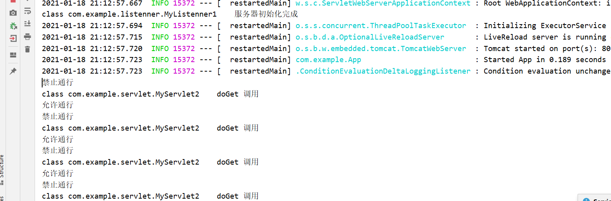


## 6.3：SpringMvc自动配置概述


Spring Boot provides auto-configuration for Spring MVC that **works well with most applications.(大多场景我们都无需自定义配置)**

The auto-configuration adds the following features on top of Spring’s defaults:

- Inclusion of `ContentNegotiatingViewResolver` and `BeanNameViewResolver` beans.

- - 内容协商视图解析器和BeanName视图解析器

- Support for serving static resources, including support for WebJars (covered [later in this document](https://docs.spring.io/spring-boot/docs/current/reference/html/spring-boot-features.html#boot-features-spring-mvc-static-content))).

- - 静态资源（包括webjars）

- Automatic registration of `Converter`, `GenericConverter`, and `Formatter` beans.

- - 自动注册 `Converter，GenericConverter，Formatter `

- Support for `HttpMessageConverters` (covered [later in this document](https://docs.spring.io/spring-boot/docs/current/reference/html/spring-boot-features.html#boot-features-spring-mvc-message-converters)).

- - 支持 `HttpMessageConverters` （后来我们配合内容协商理解原理）

- Automatic registration of `MessageCodesResolver` (covered [later in this document](https://docs.spring.io/spring-boot/docs/current/reference/html/spring-boot-features.html#boot-features-spring-message-codes)).

- - 自动注册 `MessageCodesResolver` （国际化用）

- Static `index.html` support.

- - 静态index.html 页支持

- Custom `Favicon` support (covered [later in this document](https://docs.spring.io/spring-boot/docs/current/reference/html/spring-boot-features.html#boot-features-spring-mvc-favicon)).

- - 自定义 `Favicon`

- Automatic use of a `ConfigurableWebBindingInitializer` bean (covered [later in this document](https://docs.spring.io/spring-boot/docs/current/reference/html/spring-boot-features.html#boot-features-spring-mvc-web-binding-initializer)).

- - 自动使用 `ConfigurableWebBindingInitializer` ，（DataBinder负责将请求数据绑定到JavaBean上）


> If you want to keep those Spring Boot MVC customizations and make more [MVC customizations](https://docs.spring.io/spring/docs/5.2.9.RELEASE/spring-framework-reference/web.html#mvc) (interceptors, formatters, view controllers, and other features), you can add your own `@Configuration` class of type `WebMvcConfigurer` but **without** `@EnableWebMvc`.
>
> **不用@EnableWebMvc注解。使用** **`@Configuration`** **+** **`WebMvcConfigurer`** **自定义规则**


> If you want to provide custom instances of `RequestMappingHandlerMapping`, `RequestMappingHandlerAdapter`, or `ExceptionHandlerExceptionResolver`, and still keep the Spring Boot MVC customizations, you can declare a bean of type `WebMvcRegistrations` and use it to provide custom instances of those components.
>
> **声明** **`WebMvcRegistrations`** **改变默认底层组件**


> If you want to take complete control of Spring MVC, you can add your own `@Configuration` annotated with `@EnableWebMvc`, or alternatively add your own `@Configuration`-annotated `DelegatingWebMvcConfiguration` as described in the Javadoc of `@EnableWebMvc`.
>
> **使用** **`@EnableWebMvc+@Configuration+DelegatingWebMvcConfiguration 全面接管SpringMVC`**


## 6.4：静态资源访问


### 1.静态资源目录


+ classpath:/META-INF/resources/
+ classpath:/resources/
+ classpath:/static/ 这个是工具自动帮我们生成目录，用的最多的目录
+ classpath:/public/
+ / 当前项目的跟路径
+ src/main/webapp/

**访问 ： 当前项目根路径/ + 静态资源名**

原理： 静态映射/**。

请求进来，先去找Controller看能不能处理。不能处理的所有请求又都交给静态资源处理器。静态资源也找不到则响应404页面

改变默认的静态资源路径:

```properties
spring.resources.static-locations=classpath:resources,classpath:static 
```


例如：

照片在static文件中，游览器访问：http://127.0.0.1:8080/1.jpg

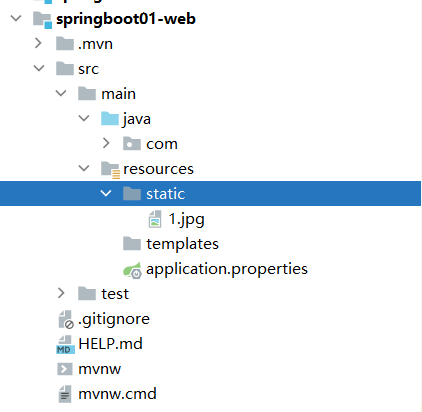


### 2.静态资源访问前缀


默认无前缀


```yaml
spring:
  mvc:
    static-path-pattern: /res/**
```


当前项目 + static-path-pattern + 静态资源名 = 静态资源文件夹下找

例如：http://127.0.0.1:8080/res/1.jpg

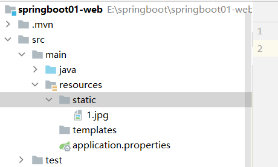


### 3.webjar


自动映射 /[webjars]()/**

http://www.webjars.org 这个网站上提供了常用的静态资源的jar包的maven依赖：

```xml
 <dependency>
    <groupId>org.webjars</groupId>
    <artifactId>jquery</artifactId>
    <version>3.5.1</version>
</dependency>
```


访问地址：[http://localhost:8080/webjars/**jquery/3.5.1/jquery.js**](http://localhost:8080/webjars/jquery/3.5.1/jquery.js)  后面地址要按照依赖里面的包路径


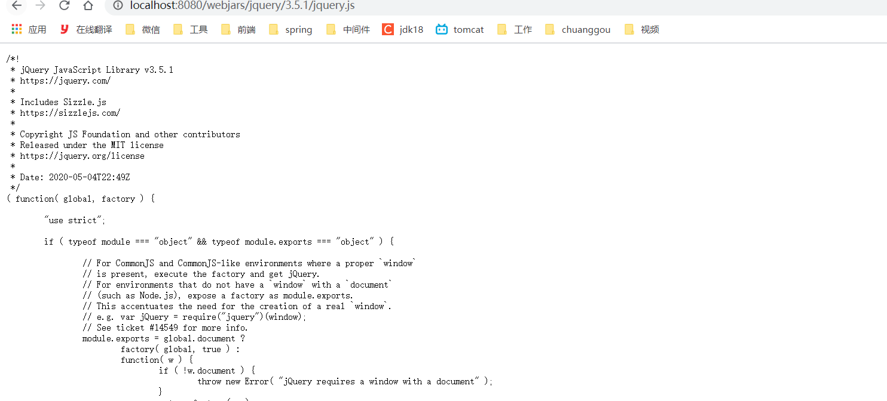


## 6.5：欢迎页支持


- 静态资源路径下  index.html

- - 可以配置静态资源路径
    - 但是不可以配置静态资源的访问前缀。否则导致 index.html不能被默认访问


```yaml
spring:
#  mvc:
#    static-path-pattern: /res/**   这个会导致welcome page功能失效

  resources:
    static-locations: [classpath:/haha/]
```


+ controller能处理/index


## 6.6、自定义 Favicon


favicon.ico 放在静态资源目录下即可。

```yaml
spring:
#  mvc:
#    static-path-pattern: /res/**   这个会导致 Favicon 功能失效
```


## 6.7：整合jsp


### 1.导入依赖


```xml
<dependency>
    <groupId>org.apache.taglibs</groupId>
    <artifactId>taglibs-standard-spec</artifactId>
    <version>1.2.5</version>
</dependency>
<dependency>
    <groupId>org.apache.taglibs</groupId>
    <artifactId>taglibs-standard-impl</artifactId>
    <version>1.2.5</version>
</dependency>
<dependency>
    <groupId>org.apache.tomcat.embed</groupId>
    <artifactId>tomcat-embed-jasper</artifactId>
    <version>8.5.34</version>
</dependency>
```


### 2.配置文件


````properties
spring.mvc.view.prefix=/WEB-INF/view/
spring.mvc.view.suffix=.jsp
````


### 3.创建配置文件


```jsp
<%@ page contentType="text/html;charset=UTF-8" language="java" %>
<%@taglib prefix="c" uri="http://java.sun.com/jsp/jstl/core" %>
<html>
<head>
    <meta charset="UTF-8">
    <title>主页</title>
</head>
<body>
<table border="1" cellpadding="0" cellspacing="1">
    <tr>
        <td>id</td>
        <td>name</td>
        <td>age</td>
    </tr>
    <c:forEach var="user" items="${requestScope.users}">
        <tr>
            <td>${user.id}</td>
            <td>${user.name}</td>
            <td>${user.age}</td>
        </tr>
    </c:forEach>
</table>
</body>
</html>
```


### 4.controller


```java
@Controller
public class TestController {
    @RequestMapping("/testJsp")
    public  String testJsp(Model model){
        Users users1 = new Users();
        users1.setId(1);
        users1.setName("admin");
        users1.setAge(18); Users users2 = new Users();
        users2.setId(1);
        users2.setName("admin");
        users2.setAge(18); Users users3 = new Users();
        users3.setId(1);
        users3.setName("admin");
        users3.setAge(18);
        List<Users> lists = new ArrayList<>();
        lists.add(users1);
        lists.add(users2);
        lists.add(users3);
        model.addAttribute("users",lists);
        return  "testJsp";
    }
}
```


### 5.测试


## 6.8：静态资源配置原理


### 1.前言


```java
@Configuration(proxyBeanMethods = false)
@ConditionalOnWebApplication(type = Type.SERVLET)
@ConditionalOnClass({ Servlet.class, DispatcherServlet.class, WebMvcConfigurer.class })
@ConditionalOnMissingBean(WebMvcConfigurationSupport.class)
@AutoConfigureOrder(Ordered.HIGHEST_PRECEDENCE + 10)
@AutoConfigureAfter({ DispatcherServletAutoConfiguration.class, TaskExecutionAutoConfiguration.class,
		ValidationAutoConfiguration.class })
public class WebMvcAutoConfiguration {
```


+ 看看容器中配置了那些


```java
@Configuration(proxyBeanMethods = false)
    @Import(EnableWebMvcConfiguration.class)
    @EnableConfigurationProperties({ WebMvcProperties.class, ResourceProperties.class })
    @Order(0)
    public static class WebMvcAutoConfigurationAdapter implements WebMvcConfigurer {}
```


+ 陪置文件的相关属性和xxx进行了绑定。
+ WebMvcProperties==**spring.mvc**、ResourceProperties==**spring.resources**


### 2.静态类WebMvcAutoConfigurationAdapter


配置类只有一个有参构造器


```java
//有参构造器所有参数的值都会从容器中确定
//ResourceProperties resourceProperties；获取和spring.resources绑定的所有的值的对象
//WebMvcProperties mvcProperties 获取和spring.mvc绑定的所有的值的对象
//ListableBeanFactory beanFactory Spring的beanFactory
//HttpMessageConverters 找到所有的HttpMessageConverters
//ResourceHandlerRegistrationCustomizer 找到 资源处理器的自定义器。=========
//DispatcherServletPath  DispatcherServlet能处理的路径
//ServletRegistrationBean   给应用注册Servlet、Filter....
@Configuration(proxyBeanMethods = false)
@Import(EnableWebMvcConfiguration.class)
@EnableConfigurationProperties({ WebMvcProperties.class,
			org.springframework.boot.autoconfigure.web.ResourceProperties.class, WebProperties.class })
@Order(0)
public static class WebMvcAutoConfigurationAdapter implements WebMvcConfigurer {
//****************************省略代码*************************************
public WebMvcAutoConfigurationAdapter(
      org.springframework.boot.autoconfigure.web.ResourceProperties resourceProperties,
      WebProperties webProperties, WebMvcProperties mvcProperties, ListableBeanFactory beanFactory,
      ObjectProvider<HttpMessageConverters> messageConvertersProvider,
      ObjectProvider<ResourceHandlerRegistrationCustomizer> resourceHandlerRegistrationCustomizerProvider,
      ObjectProvider<DispatcherServletPath> dispatcherServletPath,
      ObjectProvider<ServletRegistrationBean<?>> servletRegistrations) {
   this.resourceProperties = resourceProperties.hasBeenCustomized() ? resourceProperties
         : webProperties.getResources();
   this.mvcProperties = mvcProperties;
   this.beanFactory = beanFactory;
   this.messageConvertersProvider = messageConvertersProvider;
   this.resourceHandlerRegistrationCustomizer = resourceHandlerRegistrationCustomizerProvider.getIfAvailable();
   this.dispatcherServletPath = dispatcherServletPath;
   this.servletRegistrations = servletRegistrations;
   this.mvcProperties.checkConfiguration();
}
//****************************省略代码*************************************
```


### 3.资源处理的默认规则


```java
@Override
public void addResourceHandlers(ResourceHandlerRegistry registry) {
   if (!this.resourceProperties.isAddMappings()) {
      logger.debug("Default resource handling disabled");
      return;
   }
   Duration cachePeriod = this.resourceProperties.getCache().getPeriod();
   CacheControl cacheControl = this.resourceProperties.getCache().getCachecontrol().toHttpCacheControl();
   if (!registry.hasMappingForPattern("/webjars/**")) {
      customizeResourceHandlerRegistration(registry.addResourceHandler("/webjars/**")
            .addResourceLocations("classpath:/META-INF/resources/webjars/")
            .setCachePeriod(getSeconds(cachePeriod)).setCacheControl(cacheControl)
            .setUseLastModified(this.resourceProperties.getCache().isUseLastModified()));
   }
   String staticPathPattern = this.mvcProperties.getStaticPathPattern();
   if (!registry.hasMappingForPattern(staticPathPattern)) {
      customizeResourceHandlerRegistration(registry.addResourceHandler(staticPathPattern)
            .addResourceLocations(getResourceLocations(this.resourceProperties.getStaticLocations()))
            .setCachePeriod(getSeconds(cachePeriod)).setCacheControl(cacheControl)
            .setUseLastModified(this.resourceProperties.getCache().isUseLastModified()));
   }
}
```


```yaml
spring:
#  mvc:
#    static-path-pattern: /res/**

  resources:
    add-mappings: false   禁用所有静态资源规则
```


```java
@ConfigurationProperties(prefix = "spring.resources", ignoreUnknownFields = false)
public class ResourceProperties {
	//这里就是静态资源的默认位置
    private static final String[] CLASSPATH_RESOURCE_LOCATIONS = { "classpath:/META-INF/resources/",
            "classpath:/resources/", "classpath:/static/", "classpath:/public/" };

    /**
     * Locations of static resources. Defaults to classpath:[/META-INF/resources/,
     * /resources/, /static/, /public/].
     */
    private String[] staticLocations = CLASSPATH_RESOURCE_LOCATIONS;
```


### 4.欢迎页处理


```java
 HandlerMapping：处理器映射。保存了每一个Handler能处理哪些请求。  

    @Bean
        public WelcomePageHandlerMapping welcomePageHandlerMapping(ApplicationContext applicationContext,
                FormattingConversionService mvcConversionService, ResourceUrlProvider mvcResourceUrlProvider) {
            WelcomePageHandlerMapping welcomePageHandlerMapping = new WelcomePageHandlerMapping(
                    new TemplateAvailabilityProviders(applicationContext), applicationContext, getWelcomePage(),
                    this.mvcProperties.getStaticPathPattern());
            welcomePageHandlerMapping.setInterceptors(getInterceptors(mvcConversionService, mvcResourceUrlProvider));
            welcomePageHandlerMapping.setCorsConfigurations(getCorsConfigurations());
            return welcomePageHandlerMapping;
        }

//=======================================================================

    WelcomePageHandlerMapping(TemplateAvailabilityProviders templateAvailabilityProviders,
            ApplicationContext applicationContext, Optional<Resource> welcomePage, String staticPathPattern) {
        if (welcomePage.isPresent() && "/**".equals(staticPathPattern)) {
            //要用欢迎页功能，必须是/**
            logger.info("Adding welcome page: " + welcomePage.get());
            setRootViewName("forward:index.html");
        }
        else if (welcomeTemplateExists(templateAvailabilityProviders, applicationContext)) {
            // 调用Controller  /index
            logger.info("Adding welcome page template: index");
            setRootViewName("index");
        }
    }
```


## 6.9：Rest映射与源码解析


### 1.rest是什么


rest：REST即表述性状态传递（英文：Representational State Transfer，简称REST）是Roy Fielding博士在2000年他的博士论文中提出来的一种软件架构风格。它是一种针对网络应用的设计和开发方式，可以降低开发的复杂性，提高系统的可伸缩性。

restful：一种软件架构风格、设计风格，而不是标准，只是提供了一组设计原则和约束条件。它主要用于客户端和服务器交互类的软件。基于这个风格设计的软件可以更简洁，更有层次，更易于实现缓存等机制。


| **URL**                                                      | **请求方式** | **操作**       |
| ------------------------------------------------------------ | ------------ | -------------- |
| http://localhost:8080/myweb/queryById?id=1或 http://localhost:8080/myweb/query?id=1 | GET          | 根据id查询数据 |
| http://localhost:8080/myweb/save或 http://localhost:8080/myweb/add | POST         | 新增数据       |
| http://localhost:8080/myweb/modify或 http://localhost:8080/myweb/update | POST         | 修改数据       |
| http://localhost:8080/myweb/removeById?id=1                  | GET/POST     | 根据id删除数据 |


> 一看之下是不是很不爽，同样的操作对应这各种不同的url，而且用到的Http 的请求方式要么是GET 要么是POST，然后实际上Http 的请求方式有八种！
>
> 正如此，restful强调的是，一种资源（操作）在网络上对应的有且仅有一个url，而用Http 自身的请求方式来阐述要进行的操作。


| **URL**                              | **请求方式** | **操作**       |
| ------------------------------------ | ------------ | -------------- |
| http://localhost:8080/myweb/query/1  | GET          | 根据id查询数据 |
| http://localhost:8080/myweb/add      | POST         | 新增数据       |
| http://localhost:8080/myweb/modify   | PUT          | 修改数据       |
| http://localhost:8080/myweb/remove/1 | DELETE       | 根据id删除数据 |


两个表格对比之下就简单明了，restful 风格的url 中是不带“动词”的，用请求的方式来描述“动词”，这样的话GET 请求就是查询，POST 请求就是新增，PUT 请求就是修改，DELETE 请求就是删除。

如果按照以前的话，一个查询就可以有多种url，命名不规范，不能很好的统一，这就是为什么有**restful** 的原因。


### 2.rest案例


#### 1.代码


```java
@Controller
public class RestTestController {
    @GetMapping
    public String getIndex() {
        return "rest";
    }
    @ResponseBody
    @RequestMapping(value = "/user", method = RequestMethod.GET)
    public String getUser() {
        return "GET-张三";
    }
    @ResponseBody
    @RequestMapping(value = "/user", method = RequestMethod.POST)
    public String saveUser() {
        return "POST-张三";
    }

    @ResponseBody
    @RequestMapping(value = "/user", method = RequestMethod.PUT)
    public String putUser() {
        return "PUT-张三";
    }
    @ResponseBody
    @RequestMapping(value = "/user", method = RequestMethod.DELETE)
    public String deleteUser() {
        return "DELETE-张三";
    }
}
```


#### 2.配置文件


```properties
spring.mvc.hiddenmethod.filter.enabled=true
```


这里为什么设置true的原因在`WebMvcAutoConfiguration`文件的163行：这个配置bean就是rest风格的配置bean，他这里的默认值是false

```java
@Bean
@ConditionalOnMissingBean(HiddenHttpMethodFilter.class)
@ConditionalOnProperty(prefix = "spring.mvc.hiddenmethod.filter", name = "enabled", matchIfMissing = false)
public OrderedHiddenHttpMethodFilter hiddenHttpMethodFilter() {
	return new OrderedHiddenHttpMethodFilter();
}
```


#### 3.测试


+ postman等工具测试的时候请选择请求方式,可以不配置以下代码


```yaml
spring:
  mvc:
    hiddenmethod:
      filter:
        enabled: true   #开启页面表单的Rest功能
```


+ 代码测试
    + 表单中需要配置一个`表单method=post，隐藏域 _method=put`

```html
    <form method="get" action="/user">
        <input type="hidden" value="get" name="_method">
        <input type="submit" value="提交get">
    </form>
    <form method="post" action="/user">
        <input type="hidden" value="post" name="_method">
        <input type="submit" value="提交post">
    </form>
    <form method="post" action="/user">
        <input type="hidden" value="put" name="_method">
        <input type="submit" value="提交put">
    </form>
    <form method="post" action="/user">
        <input type="hidden" value="delete" name="_method">
        <input type="submit" value="提交delete">
    </form>
```


### 3.rest请求原理


- 表单提交会带上**_method=PUT**
- **请求过来被**`HiddenHttpMethodFilter`拦截

- - 请求是否正常，并且是POST

- - - 获取到**_method**的值。
    - 兼容以下请求；**PUT**.**DELETE**.**PATCH**
    - **原生request（post），包装模式requesWrapper重写了getMethod方法，返回的是传入的值。**
    - **过滤器链放行的时候用wrapper。以后的方法调用getMethod是调用requesWrapper的。**


```java
public class HiddenHttpMethodFilter extends OncePerRequestFilter {
   private static final List<String> ALLOWED_METHODS =
         Collections.unmodifiableList(Arrays.asList(HttpMethod.PUT.name(),
               HttpMethod.DELETE.name(), HttpMethod.PATCH.name()));

   /** Default method parameter: {@code _method}. */
   public static final String DEFAULT_METHOD_PARAM = "_method";

   private String methodParam = DEFAULT_METHOD_PARAM;
   /**
    * Set the parameter name to look for HTTP methods.
    * @see #DEFAULT_METHOD_PARAM
    */
   public void setMethodParam(String methodParam) {
      Assert.hasText(methodParam, "'methodParam' must not be empty");
      this.methodParam = methodParam;
   }

   @Override
   protected void doFilterInternal(HttpServletRequest request, HttpServletResponse response, FilterChain filterChain)
         throws ServletException, IOException {

      HttpServletRequest requestToUse = request;

      if ("POST".equals(request.getMethod()) && request.getAttribute(WebUtils.ERROR_EXCEPTION_ATTRIBUTE) == null) {
         String paramValue = request.getParameter(this.methodParam);
         if (StringUtils.hasLength(paramValue)) {
            String method = paramValue.toUpperCase(Locale.ENGLISH);
            if (ALLOWED_METHODS.contains(method)) {
               requestToUse = new HttpMethodRequestWrapper(request, method);
            }
         }
      }

      filterChain.doFilter(requestToUse, response);
   }


   /**
    * Simple {@link HttpServletRequest} wrapper that returns the supplied method for
    * {@link HttpServletRequest#getMethod()}.
    */
   private static class HttpMethodRequestWrapper extends HttpServletRequestWrapper {

      private final String method;

      public HttpMethodRequestWrapper(HttpServletRequest request, String method) {
         super(request);
         this.method = method;
      }

      @Override
      public String getMethod() {
         return this.method;
      }
   }
}
```


### 4.更改 _method


#### 1.先看源码


#### 2.自定义


```java
@Configuration(proxyBeanMethods = false)
public class RestWebConfig {
    @Bean
    public HiddenHttpMethodFilter getHiddenHttpMethodFilter() {
        HiddenHttpMethodFilter hiddenHttpMethodFilter = new HiddenHttpMethodFilter();
        hiddenHttpMethodFilter.setMethodParam("method");
        return hiddenHttpMethodFilter;
    }
}
```


## 6.10：请求映射原理


### 1.前言


我们的每一次请求，都是怎么进入到每一个Handler里面呢？

我们知道springboot还是springmvc那么我们看源码的时候还是看`DispatcherServlet`这个类

查看继承关系我们`DispatcherServlet`这个类也是一个`Servlet`,那么这里面也有`doGet`或者`doPost`方法，但是`DispatcherServlet`没有重写这两个方法，我们需要到他的父类`FrameworkServlet`里面找，**源码895行左右，源码在下面**，他们里面都调用了一个方法`processRequest`;

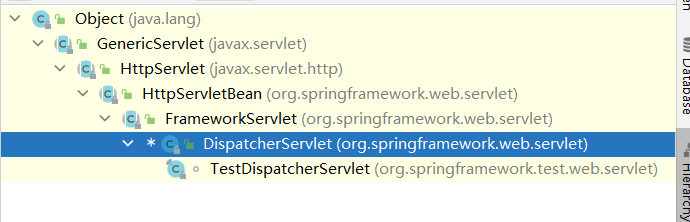

```java
/**
 * Delegate GET requests to processRequest/doService.
 * <p>Will also be invoked by HttpServlet's default implementation of {@code doHead},
 * with a {@code NoBodyResponse} that just captures the content length.
 * @see #doService
 * @see #doHead
 */
@Override
protected final void doGet(HttpServletRequest request, HttpServletResponse response)
      throws ServletException, IOException {
   processRequest(request, response);
}
/**
 * Delegate POST requests to {@link #processRequest}.
 * @see #doService
 */
@Override
protected final void doPost(HttpServletRequest request, HttpServletResponse response)
      throws ServletException, IOException {
   processRequest(request, response);
}

/**
 * Delegate PUT requests to {@link #processRequest}.
 * @see #doService
 */
@Override
protected final void doPut(HttpServletRequest request, HttpServletResponse response)
      throws ServletException, IOException {
   processRequest(request, response);
}
/**
 * Delegate DELETE requests to {@link #processRequest}.
 * @see #doService
 */
@Override
protected final void doDelete(HttpServletRequest request, HttpServletResponse response)
      throws ServletException, IOException {

   processRequest(request, response);
}
```


### 2.processRequest方法


我们从上面知道springboot再`FrameworkServlet`重写了`doGet、doPost、doPut`的方法，并且里面都调用了`processRequest`方法：**（源码988行）**

```java
protected final void processRequest(HttpServletRequest request, HttpServletResponse response)
      throws ServletException, IOException {
	//省略代码
   try {
       //调用doService方法，这个方法也是最重要的方法
      doService(request, response);
   }
   catch (ServletException | IOException ex) {
      failureCause = ex;
      throw ex;
   }
	//省略代码
}
```


### 3.doService方法


我们查看上方的源码，发现他最终带上了`request`,`reponse`这两个参数去调用`doService`这个方法，但是这个方法是我们的`DispatcherServlet`重写的方法**(源码923行)**


```java
@Override
protected void doService(HttpServletRequest request, HttpServletResponse response) throws Exception {
	//省略代码
   try {
      doDispatch(request, response);
   }
	//省略代码
}
```


> **doDispatch**
>
> + 这个方法的名字是转发
> + 我们来查看`DispatcherServlet`的**源码(1021行)**


```java
protected void doDispatch(HttpServletRequest request, HttpServletResponse response) throws Exception {
   HttpServletRequest processedRequest = request;//这个request对象
   HandlerExecutionChain mappedHandler = null;//springboot对异常的处理
   boolean multipartRequestParsed = false;//是否上传文件请求
   WebAsyncManager asyncManager = WebAsyncUtils.getAsyncManager(request);//异步处理
   try {
      ModelAndView mv = null;
      Exception dispatchException = null;
      try {
         processedRequest = checkMultipart(request);//检查是否文件上传
         multipartRequestParsed = (processedRequest != request);
         // Determine handler for the current request.
         mappedHandler = getHandler(processedRequest);//重要的方法，这里面封装了我们所有的Handler的请求，他里面帮我们决定了到底是哪个handler来处理请求的
        /**
        *下方省略代码，具体查看源码1021行
        **/
   }
}
```


### 4.getHandler方法


```java
@Nullable
protected HandlerExecutionChain getHandler(HttpServletRequest request) throws Exception {
   if (this.handlerMappings != null) {
      for (HandlerMapping mapping : this.handlerMappings) {
         HandlerExecutionChain handler = mapping.getHandler(request);
         if (handler != null) {
            return handler;
         }
      }
   }
   return null;
}
```


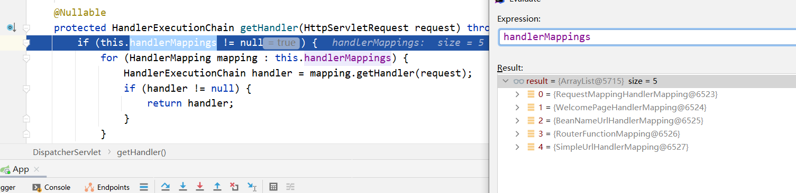


这里面封装了五个springboot自己的`HandlerMapping`:

+ RequestMappingHandlerMapping**保存了所有@RequestMapping 和handler的映射规则**
+ WelcomePageHandlerMapping
+ BeanNameUrlHandlerMapping
+ RouterFunctionMapping
+ SimpleUrlHandlerMapping

> <font color='red'>**所有的请求映射都在HandlerMapping中。**               </font>
>
> <font color='red'>SpringBoot自动配置欢迎页的 WelcomePageHandlerMapping 。访问 /能访问到index.html；</font>
>
> <font color='red'>SpringBoot自动配置了默认 的 RequestMappingHandlerMapping</font>
>
> <font color='red'>请求进来，挨个尝试所有的HandlerMapping看是否有请求信息。</font>
>
> <font color='red'>如果有就找到这个请求对应的handler</font>
>
> <font color='red'>如果没有就是下一个 HandlerMapping</font>
>
> <font color='red'>我们需要一些自定义的映射处理，我们也可以自己给容器中放HandlerMapping。自定义 HandlerMapping</font>f


### 5.提醒看源码流程


# 七、web开发


## 7.1：@PathVariable请求参数


> <font color='black'>注释，指示方法参数应该绑定到URI模板变量。支持RequestMapping带注释的处理程序方法。**如果方法参数是Map，那么Map将使用所有路径变量名和值填充。**</font>


+ 绑定方式

| 请求方式 | 代码                                        | 请求地址                    |
| -------- | ------------------------------------------- | --------------------------- |
| 原方式   | `@GetMapping("user")`                       | user?id=1&name=admin&age=18 |
| 现方式   | `@GetMapping("user/{id}/{userName}/{age}")` | user/1/admin/18             |


```java
@GetMapping("user/{id}/{userName}/{age}")
public Map<Object, Object> getUser(
        @PathVariable(value = "id") Integer id,
        @PathVariable(value = "userName") String userName,
        @PathVariable Map<Object, Object> reqMap
) {
    Map<Object, Object> result = new HashMap<>();
    result.put("id", id);
    result.put("userName", userName);
    result.put("reqMap", reqMap);
    return result;
}
==========================html代码====================================
<li><a href="user/1/admin/18">user/{id}/{userName}/{age}</a></li>
```


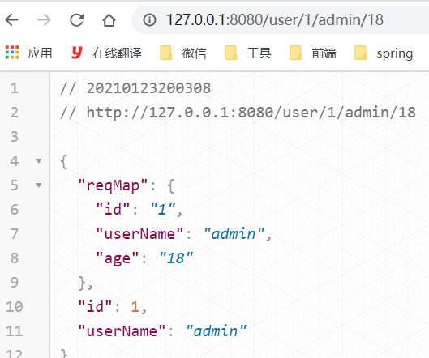


## 7.2：@RequestHeader请求头


> <font color='black'>注释，指示方法参数应该绑定到web请求头。支持Spring MVC和Spring WebFlux中的带注释的处理器方法。**如果方法参数是Map， MultiValueMap，或HttpHeaders，那么Map将被填充所有的头名和值。**</font>


```java
@GetMapping("header")
public Map<Object, Object> getHeader(
        @RequestHeader("User-Agent")String userAgent,
        @RequestHeader Map<String,Object> reqMap,
        @RequestHeader MultiValueMap<String,Object> multiValueMap,
        @RequestHeader  HttpHeaders httpHeaders
) {
    Map<Object, Object> result = new HashMap<>();
    result.put("userAgent",userAgent);
    result.put("reqMap",reqMap);
    result.put("multiValueMap",multiValueMap);
    result.put("httpHeaders",httpHeaders);
    return result;
}
==========================html代码====================================
<li><a href="header">header</a></li>
```


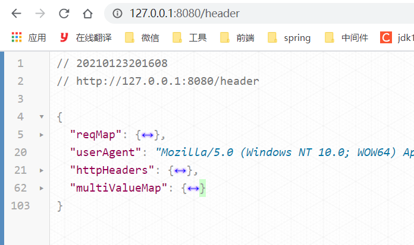


## 7.3：@RequestParam请求参数


> 标注，指示方法参数应该绑定到web请求参数。
>
> 在Spring MVC和Spring WebFlux中支持注解的处理器方法，如下所示:
>
> 在Spring MVC中，“请求参数”映射到查询参数、表单数据和多部分请求中的部件。这是因为Servlet API将查询参数和表单数据组合到一个称为“参数”的单一映射中，其中包括对请求体的自动解析。
>
> 在Spring WebFlux中，“请求参数”只映射到查询参数。要处理所有3种数据(查询数据、表单数据和多部分数据)，您可以使用数据绑定到带ModelAttribute注释的命令对象。
>
> + 如果方法参数类型是Map，并且指定了请求参数名称，那么将请求参数值转换为Map，假设有合适的转换策略可用。
>
> + 如果方法参数是Map或MultiValueMap，并且没有指定参数名，那么Map参数将填充所有请求参数名和值。
> + 如果方法参数是多个我们可以使用数据或者list/set集合来接受
> + <font color='red'>**注意:**这里不推荐使用map和MultiValueMap</font>


```java
@GetMapping("param")
public Map<Object, Object> getParam(
        @RequestParam("name")String name,
        @RequestParam("types")List<String> lists,
        @RequestParam("types") Set<String> sets,
        @RequestParam("types") String[] array,
        @RequestParam Map<String,String> reqMap,
        @RequestParam MultiValueMap<String,String> multiValueMap
        ) {
    Map<Object, Object> result = new HashMap<>();
    result.put("name",name);
    result.put("lists",lists);
    result.put("sets",sets);
    result.put("array",array);
    result.put("reqMap",reqMap);
    result.put("multiValueMap",multiValueMap);
    System.out.println(multiValueMap);
    multiValueMap.forEach((key,value)->{
        System.out.println(key+"============"+value);
    });
    return result;
}
==========================html代码====================================
<li><a href="param?name=admin&types=type1&types=type2&types=type3">param</a></li>
```


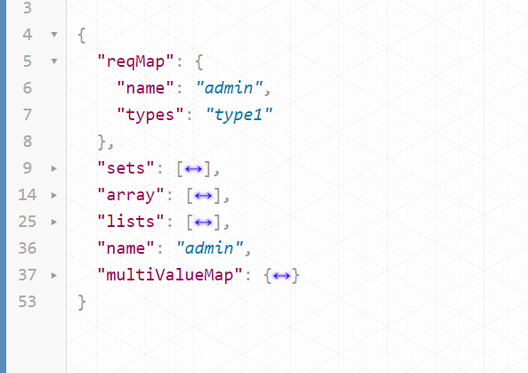


## 7.4：@CookieValue获取cookie


> 注释，指示方法参数应该绑定到HTTP cookie。
>
> 方法参数可以声明为类型javax.servlet.http。Cookie值类型
>
> + <font color='red'>注意：如果没有cookie的时候，我们的程序是会出500的错误</font>

```java
@GetMapping("cookie")
public Map<Object, Object> getcookie(
        @CookieValue("_ga") String _ga,
        @CookieValue("_ga") Cookie cookie

) {
    Map<Object, Object> result = new HashMap<>();
    result.put("_ga", _ga);
    result.put("cookie", cookie);
    return result;
}
```

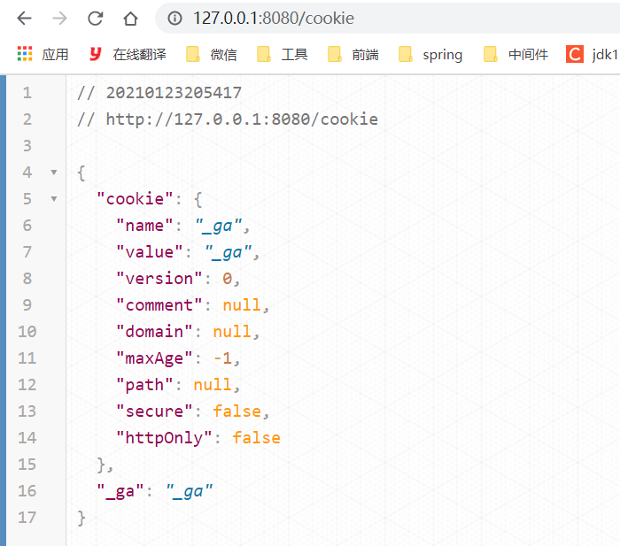


## 7.5：@RequestBody接受json/对象


> 指示方法参数的注释应该绑定到web请求体。请求体通过HttpMessageConverter传递，以根据请求的内容类型解析方法参数。可选地，自动验证可以通过用@Valid注释参数来应用。
>
> 支持带注释的处理程序方法。
>
> + 提交方式必须post提交
> + 后台接收model的时候必须是ajax提交，否则去掉@RequestBody注解，或者接受类型改成String


```java
/**
 * 错误的写法
 *     @PostMapping(value = "/requestBody")
 *     public Map requestBody(
 *       @RequestBody       TestModel testModel
 *     ) {
 *         Map<Object, Object> result = new HashMap<>();
 *         result.put("testModel",testModel);
 *         return result;
 *     }
 * @param testModel
 * @return
 */
@PostMapping(value = "/requestBody")
public Map requestBody(
        TestModel testModel
) {
    Map<Object, Object> result = new HashMap<>();
    result.put("testModel",testModel);
    return result;
}
@PostMapping(value = "/requestBody2")
public Map requestBody2(
        @RequestBody  TestModel testModel
) {
    Map<Object, Object> result = new HashMap<>();
    result.put("testModel",testModel);
    return result;
}
------------------------html代码------------------------------
 <form action="/requestBody" method="post" model="testModel">
        <input type="text" name="id" value="11111111">
        <input type="text" name="name" value="11111111">
        <input type="submit" value="提交requestBody">
 </form>
```

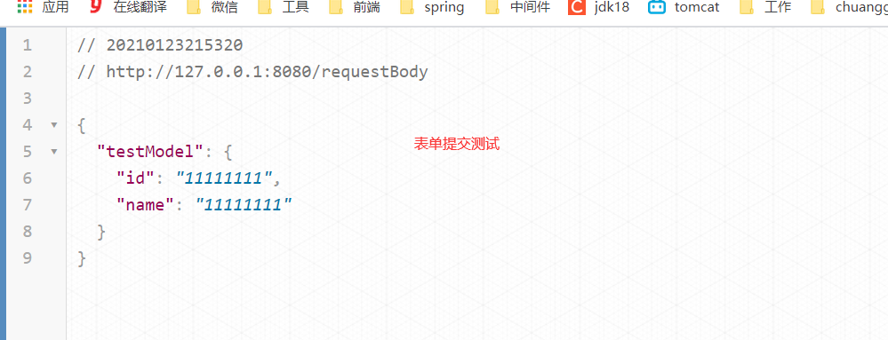


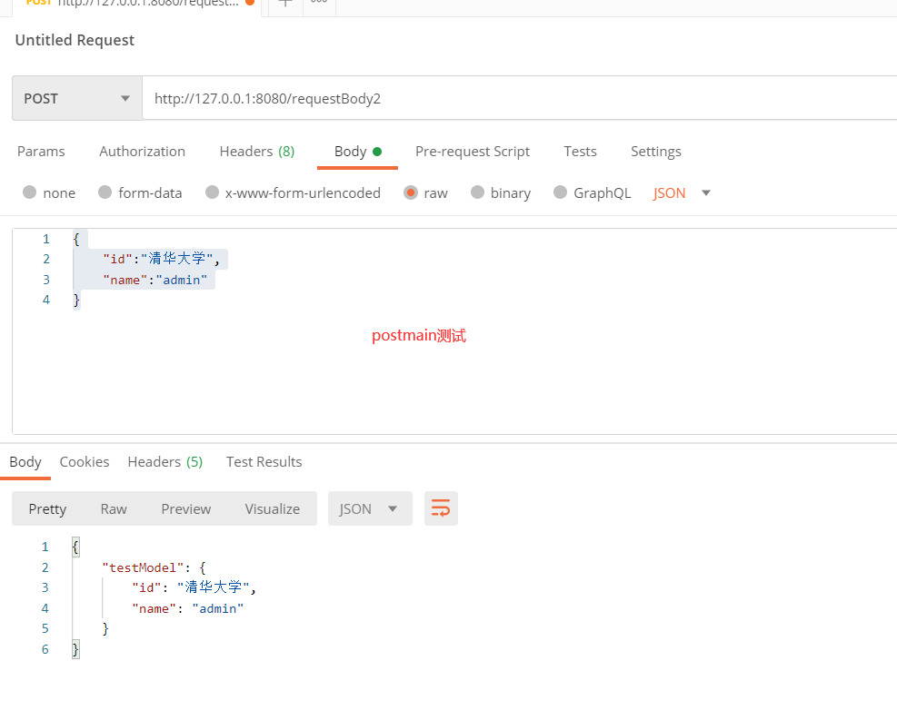

## 7.6：@RequestAttribute获取域对象


> 将方法参数绑定到请求属性的注释。
>
> 主要动机是通过可选/必需的检查和对目标方法参数类型的强制转换，方便地访问控制器方法的请求属性。


```java
@Controller
public class TestRequestAttribute {

    @GetMapping("success")
    public String success(Model model) {
        model.addAttribute("message", "转发成功！");
        model.addAttribute("code", "200");
        return "forward:/requestAttribute";
    }
    @ResponseBody
    @GetMapping(value = "/requestAttribute")
    public Map requestAttribute(
            @RequestAttribute(value = "message") String message,
            @RequestAttribute(value = "code") String code,
            HttpServletRequest request
    ) {
        Map<Object, Object> result = new HashMap<>();
        request.getParameter("message");
        result.put("message-annotation", message);
        result.put("code-annotation", code);
        result.put("message-request", request.getAttribute("message"));
        result.put("code-request", request.getAttribute("code"));
        return result;
    }

}
```


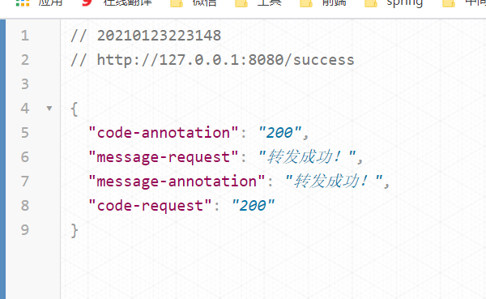


## 7.7：@MatrixVariable接收矩阵变量


### 1.什么是矩阵变量


根据 URI 规范 RFC 3986 中 URL 的定义，路径片段中可以包含键值对。规范中没有对应的术语…在 Spring MVC 它被成为矩阵变量.


### 2.springboot开启矩阵变量


```java
@Configuration
public class WebMVCConfig implements WebMvcConfigurer {

    @Override
    public void configurePathMatch(PathMatchConfigurer configurer) {
        UrlPathHelper urlPathHelper=new UrlPathHelper();
        urlPathHelper.setRemoveSemicolonContent(false);
        configurer.setUrlPathHelper(urlPathHelper);
    }
}
```


> **或者**


```java
@Bean
public WebMvcConfigurer webMvcConfigurer() {
    return new WebMvcConfigurer() {
        @Override
        public void configurePathMatch(PathMatchConfigurer configurer) {
            UrlPathHelper urlPathHelper = new UrlPathHelper();
            urlPathHelper.setRemoveSemicolonContent(false);
            configurer.setUrlPathHelper(urlPathHelper);
        }
    };
}
```


> **配置文件**


```properties
spring.mvc.hiddenmethod.filter.enabled=true
```


### 3.controller


```java
/**\
 * 1、语法： 请求路径：/cars/sell;low=34;brand=byd,audi,yd
 * 2、SpringBoot默认是禁用了矩阵变量的功能
 *    手动开启：原理。对于路径的处理。UrlPathHelper进行解析。
 *     removeSemicolonContent（移除分号内容）支持矩阵变量的
 * 3、矩阵变量必须有url路径变量才能被解析
 * @param one1
 * @param one2
 * @param two1
 * @param two2
 * @param reqMap
 * @param path
 * @return
 */
@GetMapping(value = "/testMatrixVariable/{path}")
public Map TestMatrixVariable(
        @MatrixVariable(value = "one") String one1,
        @MatrixVariable(value = "one") List<String> one2,
        @MatrixVariable(value = "two") String two1,
        @MatrixVariable(value = "two") List<String> two2,
        @MatrixVariable Map<String, List<String>> reqMap,
        @PathVariable(value = "path") String path
) {
    Map<Object, Object> result = new HashMap<>();
    result.put("one1", one1);
    result.put("one2", one2);
    result.put("two1", two1);
    result.put("two2", two2);
    result.put("path", path);
    result.put("reqMap", reqMap);
    return result;
}
================================html=====================================

<li><a href="testMatrixVariable/one=one1,one2,one3;two=two1,two2,two3;">testMatrixVariable</a></li>
```


### 4.测试


http://127.0.0.1:8080/testMatrixVariable/one=one1,one2,one3;two=two1,two2,two3;

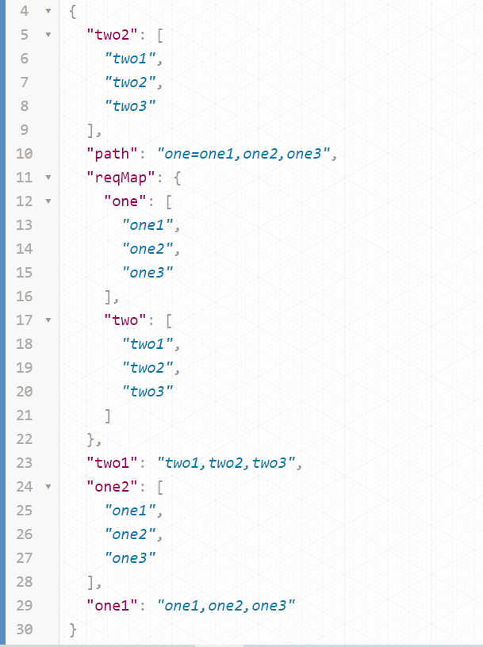


# 附录·FreeMarker

## F.1：简介


FreeMarker 是一款 模板引擎： 即一种基于模板和要改变的数据， 并用来生成输出文本(**HTML网页，电子邮件，配置文件，源代码等**)的通用工具。 它不是面向最终用户的，而是一个Java类库，是一款程序员可以嵌入他们所开发产品的组件。

模板编写为FreeMarker Template Language (FTL)。它是简单的，专用的语言， *不是* 像PHP那样成熟的编程语言。 那就意味着要准备数据在真实编程语言中来显示，比如数据库查询和业务运算， 之后模板显示已经准备好的数据。在模板中，你可以专注于如何展现数据， 而在模板之外可以专注于要展示什么数据。

+ FreeMarker 是 [免费的]()， 基于Apache许可证2.0版本发布。
+ Freemarker后缀名`ftl`
+ 模板文件必须放在`src/resources/templates`目录下


## F.2：参考手册


http://freemarker.foofun.cn/index.html


## F.3：启动器


```xml
<dependency>
    <groupId>org.springframework.boot</groupId>
    <artifactId>spring-boot-starter-freemarker</artifactId>
</dependency>
```


## F.4：HelloWorld


### 1.加入start


```xml
<dependency>
    <groupId>org.springframework.boot</groupId>
    <artifactId>spring-boot-starter-freemarker</artifactId>
</dependency>
```


### 2.配置文件


```properties
spring.freemarker.charset=utf-8
spring.freemarker.suffix=.ftl
```


### 3.controller


```java
@Controller
public class TestController {

    @GetMapping("/")
    public String hello(Model model){
        model.addAttribute("msg","Hello FreeMark!");
        System.out.println("============");
        return "hello";
    }
}
```


### 4.hello.ftl


```html
<html lang="en">
<head>
    <meta charset="UTF-8">
    <title>Hello</title>
</head>
<body>
    <h1>${msg}</h1>
</body>
</html>
```


## F.5：配置文件内容(全)


### 1.properties


```properties
# 是否允许HttpServletRequest属性覆盖(隐藏)控制器生成的同名模型属性。
spring.freemarker.allow-request-override=false
# 是否允许HttpSession属性覆盖(隐藏)控制器生成的同名模型属性。
spring.freemarker.allow-session-override=false
# 是否启用模板缓存。
spring.freemarker.cache=false
# 模板编码。
spring.freemarker.charset=UTF-8
# 是否检查模板位置是否存在。
spring.freemarker.check-template-location=true
# Content-Type value.
spring.freemarker.content-type=text/html
# 是否启用freemarker
spring.freemarker.enabled=true
# 设定所有request的属性在merge到模板的时候，是否要都添加到model中.
spring.freemarker.expose-request-attributes=false
# 是否在merge模板的时候，将HttpSession属性都添加到model中
spring.freemarker.expose-session-attributes=false
# 设定是否以springMacroRequestContext的形式暴露RequestContext给Spring’s macro library使用
spring.freemarker.expose-spring-macro-helpers=true
# 是否优先从文件系统加载template，以支持热加载，默认为true
spring.freemarker.prefer-file-system-access=true
# 设定模板的后缀.
spring.freemarker.suffix=.ftl
# 设定模板的加载路径，多个以逗号分隔，默认:
spring.freemarker.template-loader-path=classpath:/templates/
# 设定FreeMarker keys.
spring.freemarker.settings.template_update_delay=0
spring.freemarker.settings.default_encoding=UTF-8
#处理空值
spring.freemarker.settings.classic_compatible=true 
spring.freemarker.settings.datetime_format=yyy-MM-dd HH:mm
spring.freemarker.settings.number_format=0.##
```


### 2.yaml


```yaml
spring:
  freemarker:
    allow-request-override: false # 是否允许HttpServletRequest属性覆盖(隐藏)控制器生成的同名模型属性。
    allow-session-override: false # 是否允许HttpSession属性覆盖(隐藏)控制器生成的同名模型属性
    cache: false # 是否启用模板缓存。
    charset: UTF-8 # 模板编码。
    check-template-location: true # 是否检查模板位置是否存在。
    content-type: text/html # Content-Type value.
    enabled: true # 是否启用freemarker
    expose-request-attributes: false # 设定所有request的属性在merge到模板的时候，是否要都添加到model中.
    expose-session-attributes: false # 是否在merge模板的时候，将HttpSession属性都添加到model中
    expose-spring-macro-helpers: true # 设定是否以springMacroRequestContext的形式暴露RequestContext给Spring’s macro library使用
    prefer-file-system-access: true # 是否优先从文件系统加载template，以支持热加载，默认为true
    settings: # 设定FreeMarker keys.
      classic_compatible: true #处理空值
      default_encoding: UTF-8
      template_update_delay: 0
      datetime_format: yyy-MM-dd HH:mm
      number_format: 0.##
    suffix: .ftl # 设定模板的后缀.
    template-loader-path: classpath:/templates/ # 设定模板的加载路径，多个以逗号分隔，默认:
```


## F.6：字符串函数


| 函数        | 介绍                                                         | 源码                                                         | 结果                                                         |
| ----------- | ------------------------------------------------------------ | ------------------------------------------------------------ | ------------------------------------------------------------ |
| substring   | 截取子字符串的函数，类似Java的String.substring字符串函数     |                                                              |                                                              |
|             | substring(n) 截取字符串n位置开始到结尾，n大于等于0，小<br>于等于字符串的长度 | `${abcdfg"?substring(2)}`                                    | cdfg                                                         |
|             | substring(m,n) 截取字符串m位置开始到n位置，m,n大于等于<br/>0，小于等于字符串的长度 | `${"abcdfg"?substring(2,4)}`                                 | cd                                                           |
| upperCase   | 变大写                                                       | `${"SAbcdfg"?upperCase}`                                     | SABCDFG                                                      |
| uncapFirst  | 一行文本的首字母小写                                         | `${"SAbcdfg"?uncapFirst}`                                    | sAbcdfg                                                      |
| capFirst    | 一行文本的首字母大写                                         | `${"abcdfg"?capFirst}`                                       | Abcdfg                                                       |
| capitalize  | 每个单词首字母小写改大写，大写改小写                         | `${"abcdfg"?capitalize} ${"ABDCDFG"?capitalize}`             | Abcdfg Abdcdfg                                               |
| endsWith    | 判断字符串使用以某字符串结尾                                 | `${"abcdfg"?endsWith("g")} ${"abcdfg"?endsWith("G")}`        | true                                                         |
| startsWith  | 判断字符串使用以某字符串开头                                 | `${"abcdfg"?startsWith("a")} ${"abcdfg"?startsWith("A")}`    | true                                                         |
| indexOf     | 返回某字符串第一次出现的位置                                 | `${"abcdfg"?indexOf("f")}`                                   | 4                                                            |
| lastIndexOf | 返回某字符串最后一次出现的位置                               | `${"abcdfga"?lastIndexOf("a")}`                              | 6                                                            |
| length      | 返回字符串的长度                                             | `${"abcdfg"?length}`                                         | 6                                                            |
| leftPad     | 左侧补齐空格或指定的字符                                     |                                                              |                                                              |
|             | leftPad(n) n小于字符串的长度，返回全部字符串                 | `${"abcdfg"?leftPad(3)}`                                     | abcdfg                                                       |
|             | 如果leftPad(n) n大于字符串的长度，左侧补充空格或指定字符串   | `${"abcdfg"?leftPad(20)} ${"abcdfg"?leftPad(20,"*")}`        | `abcdfg} **************abcdfg`                               |
| rightPad    | 右侧补齐空格或指定的字符                                     |                                                              |                                                              |
|             | 如果rightPad(n) n小于字符串的长度，返回全部字符串            | `${"abcdfg"?rightPad(2)}`                                    | abcdfg                                                       |
|             | 如果rightPad(n) n大于字符串的长度，右侧补充空格或指定字符串  | `${"abcdfg"?rightPad(20)} ${"abcdfg"?rightPad(20,"*")}`      | `abcdfg abcdfg**************`                                |
| contains    | 判断字符串中是否存在某字符串                                 | `${"abcdfg"?contains("abc")}`                                | true                                                         |
| replace     | 替换字符串                                                   | `${"abcdfg"?replace("abc","cbd")}`                           | cbddfg                                                       |
| split       | 分隔字符串为数组                                             | `<ul> <#list "a==b==d==e==f==g"?split("==") as item> <li> ${item} <li> </#list> </ul>` | `<ul>`<br/>`<li>a</li>`<br/>`<li>b</li>`<br/>`<li>d</li>`<br/>`<li>e</li><br/><li>f</li>`<br/>`<li>g</li>`<br/>`</ul>` |
| wordList    | 以任意多个空格分隔单词                                       | `<ul> <#list "a b s cc dd"?split("==") as item> <li> ${item} <li> </#list> </ul>` | `<ul>`<br/>`<li>a</li> `<br/>`<li>b</li>`<br/>`<li>s</li>`<br/> `<li>cc</li>`<br/>`<li>dd</li>`<br/>`</ul>` |


## F.7：数字函数


|   函数   |             介绍             |                源码                |     结果      |
| :------: | :--------------------------: | :--------------------------------: | :-----------: |
|    c     | 将数字或boolean 转化为字符串 |       `${1234?c} ${true?c}`        | 1234 <br>true |
|  string  |      将数字转化为字符串      |          `${123?string}`           |      123      |
|  round   |           四舍五入           |   `${123.6?round} ${35.3?round}`   |  124 <br/>35  |
|  floor   |           向下取整           |   `${123.6?floor} ${35.3?floor}`   |  123<br/> 35  |
| ceiling  |           向上取整           | `${123.6?ceiling} ${35.3?ceiling}` |  124 <br/>36  |
|  number  |           数字类型           |       `${123?string.number}`       |      123      |
| currency |           货币类型           |      `${123?string.currency}`      |   ￥123.00    |
| percent  |          百分比类型          |      `${123?string.percent}`       |    12,300%    |
|  string  |          格式化数字          |      `${123?string("#.###")}`      |      123      |
|   int    |       取数字的整数部分       |            `${123?int}`            |      123      |


## F.8：日期函数


|             函数              |       介绍       |                  源码                   |        结果         |
| :---------------------------: | :--------------: | :-------------------------------------: | :-----------------: |
|             .now              |   获取当前时间   |                `${.now}`                |  2021-01-30 21:18   |
| string("yyyy-MM-dd HH:mm:ss") |    格式化日期    | `${.now?string("yyyy-MM-dd HH:mm:ss")}` | 2021-01-30 21:18:26 |
|             date              |   获取当前日期   |             `${.now?date}`              |      2021-1-30      |
|             time              |   获取当前时间   |             `${.now?time}`              |      21:18:26       |
|           datetime            | 获取当前日期时间 |           `${.now?datetime}`            |  2021-01-30 21:18   |


## F.9：布尔类型


|   函数   |          介绍           |                  源码                   |   结果   |
| :------: | :---------------------: | :-------------------------------------: | :------: |
| 布尔函数 | 转化boolean类型为字符串 | `${true?c} ${false?string("no","yes")}` | true yes |


## F.10：运算符


| 运算符 | 介绍                                                         | 源码                                       | 结果    |
| ------ | ------------------------------------------------------------ | ------------------------------------------ | ------- |
| !=     | 不等于                                                       | `${(1 != 2)?string('1 != 2', '1 == 2')}`   | 1 != 2  |
| ==     | 等于                                                         | `${(1 == 1)?string('1 == 1', '1 != 1')}`   | 1 == 1  |
| >      | 大于<br>==使用时,必须加括号否则可能会被<br>当成普通的标签闭合符号而引起报错== | `${(2 > 1)?string('2 > 1', '2 < 1')}`      | 2 > 1   |
| gt     | 大于                                                         | `${(2 gt 1)?string('2 gt 1', '2 lte 1')}`  | 2 gt 1  |
| gte    | 大于等于                                                     | `${(2  2)?string('2 gte 2', '2 lt 2')}`    | 2 gte 2 |
| <      | 小于<br>==使用时,必须加括号否则可能会被当成<br>普通的标签闭合符号而引起报错== | `${(1 < 2)?string('1 < 2', '1 > 2')}`      | 1 < 2   |
| lt     | 小于                                                         | `${(1 lt 2)?string('1 lt 2', '1 gte 2')}`  | 1 lt 2  |
| lte    | 小于等于                                                     | `${(2 lte 2)?string('2 lte 2', '2 gt 2')}` | 2 lte 2 |


## F.11：序列函数


+ 下面例子中的变量是这个：`<#assign seq=["1","2","3","2","1"]>`
+ 注意：Sequence不能为null。
+ 指定一个文字的序列，使用逗号来分隔其中的每个 [子变量](http://freemarker.foofun.cn/dgui_quickstart_datamodel.html#topic.dataModel.subVar)， 然后把整个列表放到方括号中。类似我们java中的集合和数组


| 函数                 | 介绍                      | 源码                                                      | 结果                                                         |
| :------------------- | ------------------------- | --------------------------------------------------------- | ------------------------------------------------------------ |
| first                | 返回序列中第一个元素      | `${lists?first}`                                          | Users(id=1, name=迪迦, password=123SA456)                    |
| last                 | 返回序列中最后一个元素    | `${lists?last}`                                           | Users(id=5, name=奥特曼, password=123fea456)                 |
| seq_contains         | 判断序列中是否存在元素n   | `${seq?seq_contains("1")}`                                | true                                                         |
| seq_index_of         | 返回n在序列中的位置       | `${seq?seq_index_of("1")}`                                | 0                                                            |
| seq_last_index_of(n) | 返回n在序列中最后一个位置 | `seq_last_index_of(n)`                                    | 0                                                            |
| reverse              | 返回序列的反序集合        | `<#list lists?reverse as item>`<br>`${item}`<br>`</#list> | Users(id=3, name=赛文, password=12z345cz6)<br/>Users(id=2, name=塞罗, password=1234Axc56)<br/>Users(id=1, name=迪迦, password=123SA456) |
| sort                 | 序列中元素排序            | `<#list lists?sort as item>`<br>`${item}`<br>`</#list>`   | Users(id=1, name=迪迦, password=123SA456)<br/>Users(id=2, name=塞罗, password=1234Axc56)<br/>Users(id=3, name=赛文, password=12z345cz6) |


## F.12：流程语句


### 1.if/else


#### 1.语法


```java
<#if condition>
...
<#elseif condition2>
...
<#elseif condition3>
...
<#else>
...
<#if>
```


#### 2.例子


```java
<h1>
    <#assign price = 100/>
    <#if price==100>
        <li>price==100</li>
    </#if>
    <#if price==100>
        <li>price==100</li>
    <#elseif price>100>
        <li>price>100</li>
    <#else>
        price<100
    </#if>
</h1>
```


#### 3.测试


### 2.swich


#### 1.语法


```java
<#switch value>
<#case refValue1>
...
<#break>
<#case refValue2>
...
<#break>
<#case refValueN>
...
<#break>
<#default> 
...
</#switch>
```


#### 2.例子


```java
<#assign size = "small"><#--// 这里的变量类型可以是字符串也可是整数 -->
<#switch size>
    <#case "small">
        This will be processed if it is small
        <#break>
    <#case "medium">
        This will be processed if it is medium
        <#break>
    <#case "large">
        This will be processed if it is large
        <#break>
    <#default>
        This will be processed if it is neither
</#switch>
```


#### 3.测试


### 3.list循环


#### 1.语法


```java
<#list sequence as item>
...
<#if item ="spring"><#break></#if>
...
</#list> 
```


#### 2.例子


```java
<#assign seq = ["winter", "spring", "summer", "autumn"]>
<#list seq as item>
    ${item_index}-----${item}<#if item_has_next>是否有下一个值<br></#if>
</#list>
```


#### 3.测试


#### 4.注意


关键字：`item_index`:是list当前值的下标，从0开始

`item_has_next`:判断list是否还有值

`item`是变量名


## F.13：宏


### 1.定义宏


#### 1.简介


定义一个宏，其实就相当定义一个代码（java或者javascript）中的方法function，也可以像java代码方法那样定义方法的参数列表


#### 2.普通宏语法


我们比对一下代码

+ 这是freemarker语法

```java
<#macro name param1 param2 ...paramN>
...
</#macro>
```

+ 这是java语法

```java
public void name(param1 param2 ...paramN){
...
}
```


#### 3.定义一个普通宏


```java
<#macro name1 one,two,three>
    名字name1的宏调用成功:${one}---${two}---${three}
</#macro>
```


#### 4.设置默认值


```java
<#macro name2 one,two="默认值1",three="默认值2">
    名字name2的宏调用成功:${one}---${two}---${three}
</#macro>
```


#### 5.body宏语法


```java
<#macro name param1 param2 ... paramN>
...
<#nested loopvar1, loopvar2, ..., loopvarN> //这里相当于java中返回的值
...
<#return>//结束
...
</#macro>
```


#### 6.定义一个body宏


```
<#macro name3 list>
    <#list list as item>
        <#nested item.id, item.name ,item.pwd>
        <#if item_has_next>
           <#return >
        </#if>
     </#list>
</#macro>
```


#### 7.定义一个body宏


```java
<#macro name3 list>
    <#list list as item>
        <#nested item.id, item.name ,item.pwd>
        <#if item_has_next>
            <#return >
        </#if>
    </#list>
</#macro>
```


### 2.调用宏


#### 1.调用普通红语法


```java
<@ name param1=值 param2=值 …… paramN=值N />
```


#### 2.调用普通红例子


```java
<#macro name1 one,two,three>
    名字name1的宏调用成功:${one}---${two}---${three}
</#macro>
<h4>调用普通红1:<@name1 1,2,3/></h4>
<h4>调用普通红2:<@name1 one="1" two="2" three="3"/></h4>
<#--我们可以根据我们的变量名字可以指定变量赋值-->
<h4>调用普通红3:<@name1 two="1" one="2" three="3"/></h4>
```


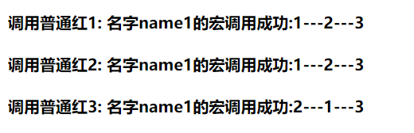


#### 3.调用body宏语法

我们首先要查看调用宏中的nested标签：
例如这个标签里面有这：

```java
<#nested item.id, item.name ,item.pwd>
```

调用如下

```java
<@name param1=值 param2=值 ……  paramN=值N；itemId,itemName,itemPWD />
    ....
</@name>
```


#### 4.调用body宏的例子


```java
<#macro name3 list>
    <#list list as item>
        <#nested item.id, item.name ,item.pwd>
        <#if item_has_next>
            <#return >
        </#if>
    </#list>
</#macro>
<@name3  list=lists ;itemId ,itemNmae ,itemPWd>
    ${itemId}---${itemNmae}---${itemPWd}<br>
</@name3>
```

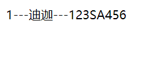

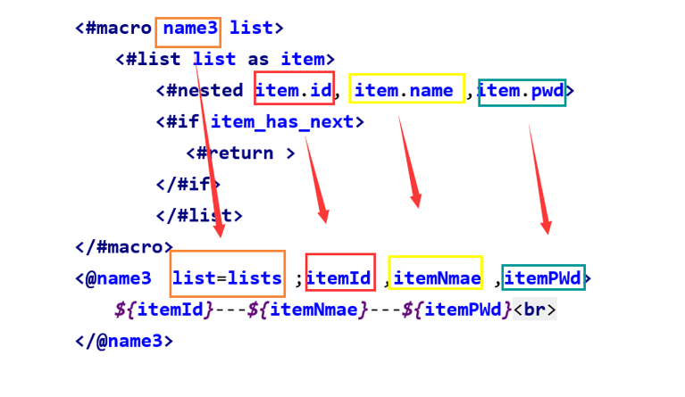


## F.14：特殊指令


### 1.Include


#### 1.语法、简介


| 作用                                   | 语法                          | 属性                                                         |
| -------------------------------------- | ----------------------------- | ------------------------------------------------------------ |
| 和jsp中的include标签一样包括其它的页面 | `<#include filename options>` | Filename：路径名；options包含两个属性：encoding="GBK" 编码格式；parse=true 是否作为ftl语法解析,默认是true，false就是以文本方式引入 |


#### 2.案例


+ inclue.ftl

```java
<!DOCTYPE html>
<html lang="en">
<head>
    <meta charset="UTF-8">
    <title>Title</title>
</head>
<body>
<#assign me="hello world">
<#include "includetest.ftl" encoding="utf-8" parse=true >
</body>
</html>
```

+ incluetest.ftl

```java
<!DOCTYPE html>
<html lang="en">
<head>
    <meta charset="UTF-8">
    <title>Title</title>
</head>
<body>

<h1>你好！me的变量是：${me}</h1>
</body>
</html>
```


### 2.Import关键字


#### 1.语法、简介

> ###### 语法
>
> ```java
> <#import path as namespace >
> ```
>
> 类似于java里的import,它导入文件，然后就可以在当前文件里使用被导入文件里的宏组件用例假设mylib.ftl 里定义了宏copyright 那么我们在其他模板页面里可以这样使用：
>
> ```java
> <#import "/libs/mylib.ftl" as my>
> 
> <@my.copyright date="1999-2002"/>
> 
> <#--"my"在freemarker里被称作namespace -->
> ```

#### 2.案例


+ import.ftl

```java
<#import "importtest.ftl" as copyhong/>
<!DOCTYPE html>
<html lang="en">
<head>
    <meta charset="UTF-8">
    <title>import</title>
</head>
<body>
<@copyhong.test1  date="20000000000000"></@copyhong.test1>
</body>
</html>
```

+ importtest.ftl

```java
<#macro test1  date>
    <hr>
    <h1> 输出内容是：${date}</h1>
</#macro>
```


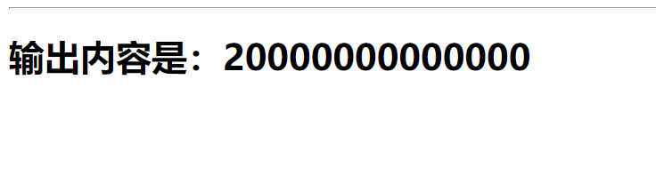


### 3.compress关键字


#### 1.语法、简介


语法

```java
<#compress>

...

</#compress>
```

用来压缩空白空间和空白的行

#### 2.案例

我们再写代码的时候，会有一些空白行，这些空白行会在游览器端实现，我们通常使用这个标签将整个页面的代码都包括起来。

+ 使用

```java
<#compress >
<br>

<h1>12</h1>
                <h1>12</h1>
                <h1>12</h1>
<h1>12</h1>


<h1>12</h1>

<h1>12</h1>

<h1>12</h1>
</#compress>
```


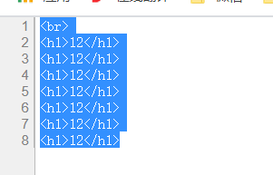

+ 不使用

```java
<br>

<h1>12</h1>
                <h1>12</h1>
                <h1>12</h1>
<h1>12</h1>


<h1>12</h1>

<h1>12</h1>

<h1>12</h1>
```


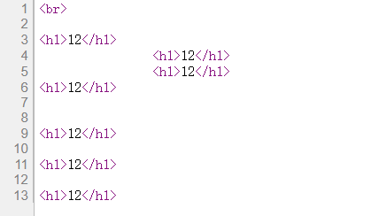


### 4.escape, noescape


#### 1.语法、简介


+ 语法

```java
<#escape identifier as expression>
...
<#noescape>...</#noescape>
...
</#escape>
```


+ 简介

**主要使用在相似的字符串变量输出，比如某一个模块的所有字符串输出都必须是html安全的，这个时候就可以使用，说白了escape 包裹的内容，会被转义比如<>会编程<> 而noescape包裹的字符不会被转义，会被当成html代码执行**

```java
<#escape x as x?html>

First name: ${firstName}

<#noescape>Last name: ${lastName}</#noescape>

Maiden name: ${maidenName}

</#escape>
```

**等同于：**

```java
First name: ${firstName?html}
Last name: ${lastName}
Maiden name: ${maidenName?html}
```


### 5.Global关键字


#### 1.语法、简介


+ 语法

```java
<#global name=value>
<#global name1=value1 name2=value2 ... nameN=valueN>
<#global name>
capture this
</#global>
```

+ 简介

全局赋值语法，利用这个语法给变量赋值，那么这个变量在所有的namespace 中是可见的, 如果这个变量被当前的assign 语法覆盖 如`<#global x=2> <#assign x=1> `在当前页面里`x=2` 将被隐藏，或者通过`${.globals.x}` 来访问


#### 2.案例


+ global.ftl

```java
<#global  aaa = "aaaaaaa">
<#global  bbb = "bbbbbbb">
<#assign  ccc = "ccccccc">
```

+ globaltest.ftl

```java
<#assign bbb="asdasdasd">
调用copyright.ftl页面的aaa变量${aaa}<br>
调用本页面的bbb变量${bbb}<br>
调用copyright.ftl页面的bbb变量${.globals.bbb}<br>
调用copyright.ftl页面的ccc变量${my.ccc}<br>
```


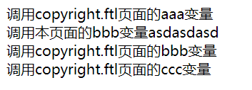

### 6.setting


#### 1.语法、简介


```java
<#setting name=value>
```

用来设置整个系统的一个环境，我们可以设置时间，时区，数字等格式

+  Locale：方言

+ number_format：数字

+  boolean_format：布尔值

+ date_format ,time_format , datetime_format：日期时间

+ time_zone：时区

+ classic_compatible, 默认值false，改成true 不建议开启

更多参数参考：http://freemarker.foofun.cn/ref_directive_setting.html

#### 2.案例


将数字的输出格式改为百分比

```java
<#setting number_format="percent"/>
<#setting datetime_format="yyyy-MM-dd HH:mm:ss"/>
```


### 7.t, lt, rt


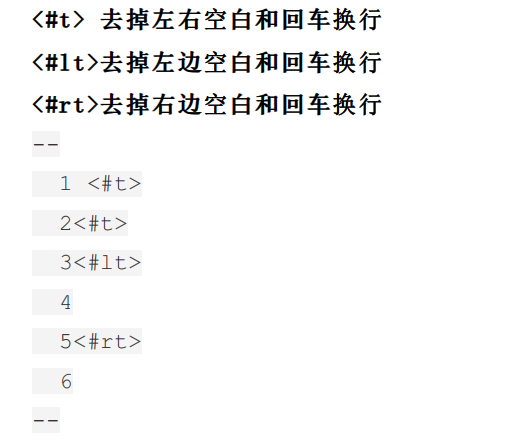


## 其他


### 1.默认值


```html
<h1>${var?default("默认值")?html}</h1>

---页面显示
默认值
```


### 2.声明变量


```html
<#--声名变量-->
<#assign name="李白"/>
<#assign age=123/>
<#assign address = [0,1,2,3] />
<#assign userss = {name:'admin',age:12} />
<#--取值-->
<h1>name:${name}-----age:${123}--------</h1>
<h1>
    <#list userss?keys as item>
        <li>${item}===${userss[item]}</li>
    </#list>
</h1>

<h1>
    <#list address as item>
        <li>${item}</li>
    </#list>
</h1>
```
# 附录·Thymeleaf

## F.1：简介


### 1.什么是Thymeleaf


`Thymeleaf`是适用于`Web`和独立环境的现`代服务器端Java模板引擎`，能够处理`HTML，XML，JavaScript，CSS甚至纯文本`。Thymeleaf的**主要目标是提供一种优雅且高度可维护的模板创建方式**。为此，它以自然模板的概念为基础，以不影响模板用作设计原型的方式将其逻辑注入模板文件。这样可以改善设计沟通，并缩小设计团队与开发团队之间的差距。`Thymeleaf`也已经从一开始就**设计了Web标准记-尤其是HTML5 -允许您创建充分验证模板，如果这是一个需要你。**


### 2.特点


**1.动静结合：**Thymeleaf 在有网络和无网络的环境下皆可运行，即它可以让美工在浏览器查看页面的静态效果，也可以让程序员在服务器查看带数据的动态页面效果。这是由于它支持 html 原型，然后在 html 标签里增加额外的属性来达到模板+数据的展示方式。浏览器解释 html 时会忽略未定义的标签属性，所以 thymeleaf 的模板可以静态地运行；当有数据返回到页面时，Thymeleaf 标签会动态地替换掉静态内容，使页面动态显示。

**2.开箱即用：**它提供标准和spring标准两种方言，可以直接套用模板实现JSTL、 OGNL表达式效果，避免每天套模板、该jstl、改标签的困扰。同时开发人员也可以扩展和创建自定义的方言。

**3.多方言支持：**Thymeleaf 提供spring标准方言和一个与 SpringMVC 完美集成的可选模块，可以快速的实现表单绑定、属性编辑器、国际化等功能。

**4.与SpringBoot完美整合**，SpringBoot提供了Thymeleaf的默认配置，并且为Thymeleaf设置了视图解析器，我们可以像以前操作jsp一样来操作Thymeleaf。代码几乎没有任何区别，就是在模板语法上有区别。


### 3.参考网站


Csdn：https://www.cnblogs.com/msi-chen/p/10974009.html#_label0

官网：https://www.thymeleaf.org/doc/tutorials/3.0/usingthymeleaf.html#what-is-thymeleaf


### 4.启动器


```java
 <dependency>
        <groupId>org.springframework.boot</groupId>
        <artifactId>spring-boot-starter-thymeleaf</artifactId>
</dependency>
```


## F.2：HelloWorld


### 1.pojo


```java
@Data
@AllArgsConstructor
@NoArgsConstructor
public class Users {
    private  Integer id;
    private String name;
    private String pwd;
}
```


### 2.controller


这里的controller为了后面其他的练习直接写在一起

```java
@Controller
public class TestController {
    @GetMapping("/{path}")
    public String test(@PathVariable(value = "path") String path, Model model) {
        System.out.println("================" + path + "===============");
        Users users1 = new Users(1, "admin", "123456");
        Users users2 = new Users(2, "张三", "123456");
        Users users3 = new Users(3, "李四", "123456");
        Users users4 = new Users(4, "王麻子", "123456");
        List<Users> list = new ArrayList<>();
        list.add(users1);
        list.add(users2);
        list.add(users3);
        list.add(users4);
        model.addAttribute("lists", list);
        model.addAttribute("dates", new Date());
        model.addAttribute("user", users1);
        model.addAttribute("hello", "hello world thymeleaf");
        return path;
    }
}
```


### 3.html


```java
<!DOCTYPE html>
<html lang="en" xmlns:th="http://www.thymeleaf.org">
<head>
    <meta charset="UTF-8">
    <title>Title</title>
</head>
<body>
    <h1 th:text="${hello}"></h1>
</body>
</html>
```


### 4.测试


http://127.0.0.1:8080/hello


### 5.错误解决


什么有错误？对的，有错误！就下面的错误

```java
================hello===============
================favicon.ico===============
2021-02-25 18:57:47.616 ERROR 28912 --- [nio-8080-exec-9] org.thymeleaf.TemplateEngine             : [THYMELEAF][http-nio-8080-exec-9] Exception processing template "favicon.ico": Error resolving template [favicon.ico], template might not exist or might not be accessible by any of the configured Template Resolvers

org.thymeleaf.exceptions.TemplateInputException: Error resolving template [favicon.ico], template might not exist or might not be accessible by any of the configured Template Resolvers
	at org.thymeleaf.engine.TemplateManager.resolveTemplate(TemplateManager.java:869) ~[thymeleaf-

2021-02-25 18:57:47.617 ERROR 28912 --- [nio-8080-exec-9] o.a.c.c.C.[.[.[/].[dispatcherServlet]    : Servlet.service() for servlet [dispatcherServlet] in context with path [] threw exception [Request processing failed; nested exception is org.thymeleaf.exceptions.TemplateInputException: Error resolving template [favicon.ico], template might not exist or might not be accessible by any of the configured Template Resolvers] with root cause

org.thymeleaf.exceptions.TemplateInputException: Error resolving template [favicon.ico], template might not exist or might not be accessible by any of the configured Template Resolvers

```


- Thymeleaf进行解析视图的时候,默认会查找一个叫favicon.ico的文件,如果找不到就会报错,一般情况下,使用IDEA或者官网创建的项目中都不会含有该内容,可以使用一个标签,告诉Thymeleaf解析时查找该文件的位置,即便目标位置不存在该文件,也不会报错了

页面中加入这个

```java
<link rel="shortcut icon" href="../resources/favicon.ico" th:href="@{/static/favicon.ico}"/>
```


## F.3：提示thymeleaf标签


我们在书写thymeleaf标签的时候可能不会提示：我们在html标签上加上


```java
<html lang="en" xmlns:th="http://www.thymeleaf.org">
```


## F.4：application配置


### 1.properties配置


```properties
#thymeleaf 配置
spring.thymeleaf.mode=HTML5
spring.thymeleaf.encoding=UTF-8
spring.thymeleaf.content-type=text/html
#缓存设置为false, 这样修改之后马上生效，便于调试
spring.thymeleaf.cache=false
#上下文
server.context-path=/thymeleaf
```


### 2.yaml配置


```yaml
server:
  context-path: /thymeleaf
spring:
  thymeleaf:
    cache: false
    content-type: text/html
    encoding: UTF-8
    mode: HTML5
```


## F.5：常用标签/基础


### 1.输出标签


#### 1.简介


| 标签     | 用法简介                                                     |
| -------- | ------------------------------------------------------------ |
| th:text  | 在页面上输出值，会把特殊字符进行转义后输出，注意：`[[ ]]`和`th:text`等价 |
| th:utext | 在页面上输出值，不会把特殊字符转义，注意：`[()]`和`th:utext`等价 |
| th:value | 在input标签中显示数值`<input type="text" name="username"  th:value="${u.username}" />  ` |


#### 2.例子


```java
<h1 th:text="${text}"></h1> <h1>[[ ${text} ]]</h1>
<h1 th:utext="${text}"></h1> <h1>[( ${text} )]</h1>
<input type="text" th:value="${text}">
```


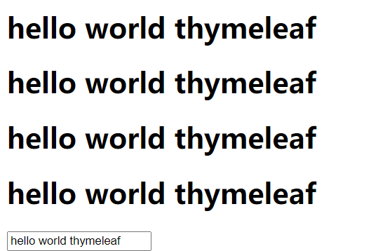


#### 3.注意点


`Th:text( ${…} )`和`thu:text( ${…} )`他们之间必须在标签使用

​                   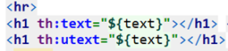

而`[[ ${…} ]]`和`[( ${…} )]`可以在任意位置输出,可以用到js标签当中


### 2.# 调用内置对象


#### 1.简介


在thymeleaf中表示调用内置对象，dates，strings。。。。下面就通过内置对象stirngs对字符串，日期的一些常用操作说明：


#### 2.字符串类型


| Name                                                | 作用                                                  |
| --------------------------------------------------- | ----------------------------------------------------- |
| **${#strings.isEmpty(str)}**                        | 判断字符串是不是空的,为空返回true,否则返回false       |
| **${#strings.contains(母串，子串)}**                | 看子串在母串中存不存在？在返回true，反之false         |
| **${#strings.startsWith(母串，子串)}**              | 看字符串是不是子串开头                                |
| **${#strings.endsWith(母串，子串)}**                | 看字符串是不是子串结尾                                |
| **${#strings.length(字符串)}**                      | 获取字符串长度                                        |
| **${#strings.indexOf(母串，子串)}**                 | 返回子串在母串中的位置索引                            |
| **${#strings.substring(母串，开始索引，结束索引)}** | 截取母串中的部分返回，结束索引省略就截取到末尾        |
| **${#strings.toUpperCase(母串)}**                   | 把字符串中的小写字母都转成大写字母，反之用toLowerCase |


#### 3.日期类型


| name                                           | 简介                                       |
| ---------------------------------------------- | ------------------------------------------ |
| **${#dates.format(日期变量名)}**               | 格式化日期，默认的以浏览器默认语言为格式化 |
| **${#dates.format(日期变量名，”yyyy-MM-dd”)}** | 格式化日期，自定义格式化规则               |
| **${#dates.year(key)}**                        | 获取年                                     |
| **${#dates.month(key)}**                       | 获取月份                                   |
| **${#dates.day(key)}**                         | 获取日期                                   |


#### 4.测试页面


```html
<p>判断字符串是不是空的,为空返回true,否则返回false:<span th:text="${#strings.isEmpty('')}"></span></p>
<p>看子串在母串中存不存在？在返回true，反之false:<span th:text="${#strings.contains('abc','av')}"></span></p>
<p>看字符串是不是子串开头:<span th:text="${#strings.startsWith('abcefg','abc')}"></span></p>
<p>看字符串是不是子串结尾:<span th:text="${#strings.endsWith('abcabc','abc')}"></span></p>
<p>获取字符串长度:<span th:text="${#strings.length('abcdef')}"></span></p>
<p>返回子串在母串中的位置索引:<span th:text=" ${#strings.indexOf('abcabc','abc')}"></span></p>
<p>截取母串中的部分返回，结束索引省略就截取到末尾:<span th:text="${#strings.substring('abcdefghij',6)}"></span></p>
<p>把字符串中的小写字母都转成大写字母，反之用toLowerCase:<span th:text="${#strings.toUpperCase('abcdef')}"></span></p>
<p>格式化日期，默认的以浏览器默认语言为格式化:<span th:text=" ${#dates.format(dates)}   "></span></p>
<p>格式化日期，自定义格式化规则:<span th:text="${#dates.format(dates,'yyyy-MM-dd')}"></span></p>
<p>获取年:<span th:text="${#dates.year(dates)}"></span></p>
<p>获取月份:<span th:text="${#dates.month(dates)}"></span></p>
<p>获取日期:<span th:text="${#dates.day(dates)}"></span></p>
```


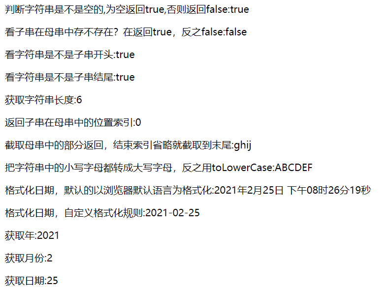


### 3.if


#### 1.语法


```java
th:if()
```


##### 2.案例


```java
<h1>if分支：<span th:if="${user.getId()==1}">超级管理员</span></h1>
```


#### 3.注意


thymeleaf中没有if else标签我们可以使用swich标签


### 4.swich标签


#### 1.语法


```java
th:swich()
     th:case()
     th:case()
     ……………
```


#### 2.案例


```java
<h1>swich分支：
    <i th:switch="${user.getId()}">
        <span th:case="1">超级管理员1</span>
        <span th:case="2">超级管理员2</span>
        <span th:case="3">超级管理员3</span>
    </i>
</h1>
```


### 5.循环标签


#### 1.遍历集合/数组


```java
<h3>
    遍历集合和数组：
    <i th:each="item:${lists}">
        <span th:text="${item.id}"></span>
        <span th:text="${item.name}"></span>
        <span th:text="${item.pwd}"></span><br>
    </i>
</h3>
```


#### 2.内置参数遍历集合和数组


```html
<h5>内置参数遍历集合和数组： <i th:each="item,var:${lists}">
    <span th:text="${item.id}"></span>
    <span th:text="${item.name}"></span>
    <span th:text="${item.pwd}"></span>
    <span th:text="${var.index}"></span> 当前循环的索引，从0开始
    <span th:text="${var.count}"></span> 当前循环的次数，从1开始
    <span th:text="${var.size}"></span> 被循环的集合或数组的长度
    <span th:text="${var.even}"></span> 布尔值，当前循环是偶数？ 从0开始
    <span th:text="${var.odd}"></span> 布尔值，当前循环是奇数？ 从0开始
    <span th:text="${var.first}"></span> 布尔值，当前循环是不是第一条，是返回true
    <span th:text="${var.last}"></span> 布尔值，当前循环是不是最后一条，是返回true<br></i> </h5>
```


#### 3.遍历map


```java
<h5>map遍历
    <i th:each="item:${maps}">
        <span th:text="${item}"></span><br>
    </i>
</h5>
<h5>map遍历升级
    <i th:each="item:${maps}">
        <span th:text="${item.key}"></span>------
        <span th:text="${item.value}"></span>  ------
        <span th:text="${item.value.id}"></span>------
        <span th:text="${item.value.name}"></span>------
        <span th:text="${item.value.pwd}"></span>------
        <br>
    </i>
</h5>
```


### 6.域对象


#### 1  Request


```java
request.setAttribute("req", "HttpServletRequest"）
Request:<span th:text="${#httpServletRequest.getAttribute('req')}"></span><br>
```


#### 2  Session


```java
request.getSession().setAttribute("sess", "HttpSession");
Session:<span th:text="${session.sess}"></span><br>
```


#### 3  ServletContext


```java
request.getSession().getServletContext().setAttribute("app","Application");
Application:<span th:text="${application.app}"></span>
```


### 7.页面抽取


#### 1.简介


| name       | message                              |
| ---------- | ------------------------------------ |
| th:insert  | 将公共片段整个插入到声明引入的元素中 |
| th:replace | 将声明引入的元素替换为公共片段       |
| th:include | 将被引入的片段的内容包含进这个标签中 |


#### 2.案例


```java
定义一个公共的页面：<h1>你好啊</h1>
```


引用页面


```java
<div th:insert="@{~/includ/base.html}"> th:insert：将公共片段整个插入到声明引入的元素中</div> <div th:replace="@{~/includ/base.html}">  th:replace：将声明引入的元素替换为公共片段</div> <div th:include="@{~/includ/base.html}"> th:include：将被引入的片段的内容包含进这个标签中</div>
```


#### 3.测试


游览器编译：

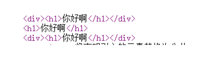

### 8.url


#### 1.简介


```java
th:href标签或th:src标签上
url 表达式基本语法：@{}
```


#### 2.url类型


| name                     | message                                                      |
| ------------------------ | ------------------------------------------------------------ |
| 绝对路径                 | `<a  th:href="@{http://www.baidu.com}">绝对路径</a>  `       |
| 相对路径                 | `1)相对于当前项目的根，相对于项目的上下文的相对路径  <a  th:href="@{/show}">相对路径</a>  2) 相对于服务器路径  <a  th:href="@{~/project2/resourcename}">相对于服务器的根</a>  ` |
| 在url中传递参数          | `<a th:href="@{/show(id=1,name=zhagnsan)}">相对路径-传参</a>  ` |
| restful 风格进行参数传递 | `<a class="btn btn-info"  th:href="@{~/item/detail/}+${item.id}+'/aaa'" >详情</a> ` |


# 附录·源码解析


