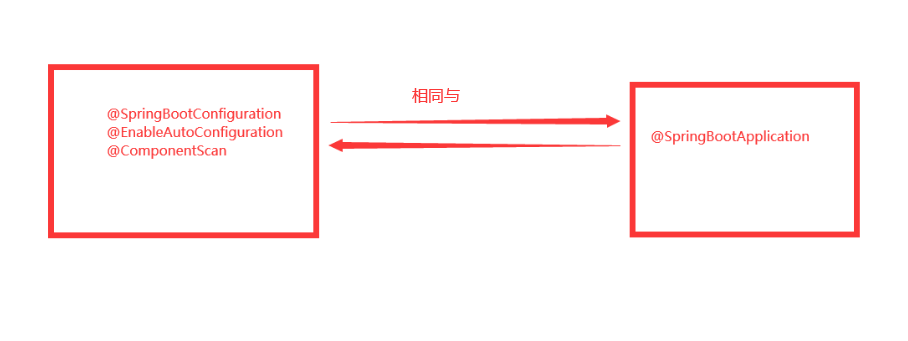
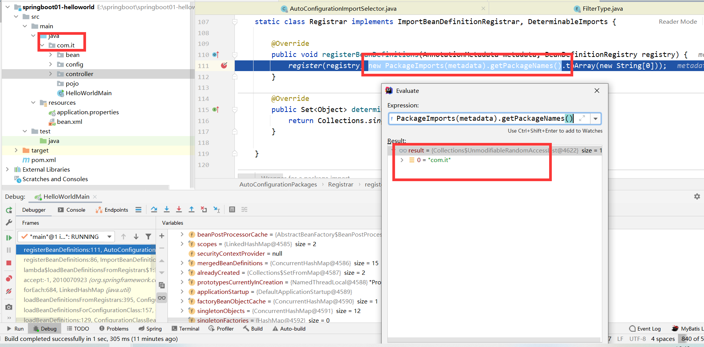
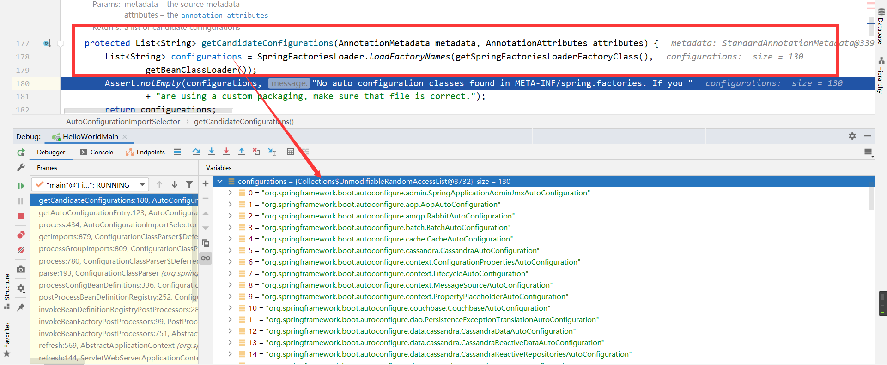
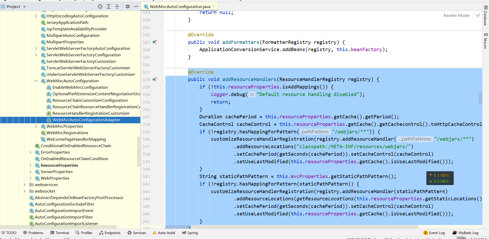

<h1>源码解析</h1>

# 自动配置


## 1.关于@SpringBootApplication


我们在写每一个SpringBoot程序时，都会有一个启动类，上面有一个注解：`@SpringBootApplication`


```java
@SpringBootApplication
public class ThymeleafApplication {

    public static void main(String[] args) {
        SpringApplication.run(ThymeleafApplication.class);
    }
}
```


我们可以看一下源代码：（我的注释翻译了）


```java
/**
指示一个声明一个或多个@Bean方法并触发自动配置和组件扫描的配置类。这是一个方便的注释，相当于声明@Configuration、@EnableAutoConfiguration和@ComponentScan。
 */
@Target(ElementType.TYPE)
@Retention(RetentionPolicy.RUNTIME)
@Documented
@Inherited
@SpringBootConfiguration
@EnableAutoConfiguration
@ComponentScan(excludeFilters = { @Filter(type = FilterType.CUSTOM, classes = TypeExcludeFilter.class),
      @Filter(type = FilterType.CUSTOM, classes = AutoConfigurationExcludeFilter.class) })
public @interface SpringBootApplication {
```


+ 这里面包含了**@SpringBootConfiguration，@EnableAutoConfiguration，@ComponentScan**

+ 此处`@ComponentScan`由于没有指定扫描包，因此它默认扫描的是与该类同级的类或者同级包下的所有类
+ 另外`@SpringBootConfiguration`，通过源码得知它是一个`@Configuration`**（组件类）**

```java
@Target(ElementType.TYPE)
@Retention(RetentionPolicy.RUNTIME)
@Documented
@Configuration
public @interface SpringBootConfiguration {
```


> <font color='red'>**由此我们可以推断出@SpringBootApplication等同于@Configuration @ComponentScan @EnableAutoConfiguration**</font>




## 2.@EnableAutoConfiguration


一旦加上此注解，那么将会开启自动装配功能，简单点讲，Spring会试图在你的classpath下找到所有配置的Bean然后进行装配。当然装配Bean时，会根据若干个(Conditional`条件`)定制规则来进行初始化。我们看一下它的源码：


```java
@Target(ElementType.TYPE)
@Retention(RetentionPolicy.RUNTIME)
@Documented
@Inherited
@AutoConfigurationPackage
@Import(AutoConfigurationImportSelector.class)
public @interface EnableAutoConfiguration {
```


### @AutoConfigurationPackage


```java
@Target(ElementType.TYPE)
@Retention(RetentionPolicy.RUNTIME)
@Documented
@Inherited
@Import(AutoConfigurationPackages.Registrar.class)
public @interface AutoConfigurationPackage {
```


> ==**AutoConfigurationPackages.Registrar**==  (AutoConfigurationPackages类的107行)

```java
static class Registrar implements ImportBeanDefinitionRegistrar, DeterminableImports {

   @Override
   public void registerBeanDefinitions(AnnotationMetadata metadata, BeanDefinitionRegistry registry) {
      register(registry, new PackageImports(metadata).getPackageNames().toArray(new String[0]));
   }

   @Override
   public Set<Object> determineImports(AnnotationMetadata metadata) {
      return Collections.singleton(new PackageImports(metadata));
   }

}
```


### debug调试


先看`new PackageImports(metadata).getPackageNames()`这个方法得到了什么，`com.it`这个包名是我们主启动类所在包下以及子包的目录，这也证明了，我们在写springboot程序时，不可以在**主程序所在包，以及子包外去写我们的组件类**

+ 总结一下

> ```java
> @Import(AutoConfigurationPackages.Registrar.class)  //给容器中导入一个组件
> public @interface AutoConfigurationPackage {}
> ```
>
> + **利用Registrar给容器中导入一系列组件**
> + **将指定的一个包下的所有组件导入进来？主程序 所在包下**





### @Import(AutoConfigurationImportSelector.class)


我们看一下AutoConfigurationImportSelector的源码


```java
public class AutoConfigurationImportSelector implements DeferredImportSelector, BeanClassLoaderAware,
      ResourceLoaderAware, BeanFactoryAware, EnvironmentAware, Ordered {
```


　首先该类实现了DeferredImportSelector接口，这个接口继承了ImportSelector:


```java
public interface ImportSelector {

	/**
	 * Select and return the names of which class(es) should be imported based on
	 * the {@link AnnotationMetadata} of the importing @{@link Configuration} class.
	 * @return the class names, or an empty array if none
	 */
	String[] selectImports(AnnotationMetadata importingClassMetadata);
```


该接口主要是为了导入@Configuration的配置项，而DeferredImportSelector是延期导入，当所有的@Configuration都处理过后才会执行。

我们发现这个类中有一个方法： `String[] selectImports(AnnotationMetadata importingClassMetadata)`,我们来看一下`AutoConfigurationImportSelector`里面的方法实现.

```java
@Override
public String[] selectImports(AnnotationMetadata annotationMetadata) {
   if (!isEnabled(annotationMetadata)) {
      return NO_IMPORTS;
   }
    //我们getCandidateConfigurations(annotationMetadata, attributes);获取到的全部的配置类，但是有一些配置类不需要，通过这个这个方法筛选出来我们需要的配置类
   AutoConfigurationEntry autoConfigurationEntry = getAutoConfigurationEntry(annotationMetadata);
   return StringUtils.toStringArray(autoConfigurationEntry.getConfigurations());
}
```


==getAutoConfigurationEntry==


```java
protected AutoConfigurationEntry getAutoConfigurationEntry(AnnotationMetadata annotationMetadata) {
   if (!isEnabled(annotationMetadata)) {
      return EMPTY_ENTRY;
   }
   AnnotationAttributes attributes = getAttributes(annotationMetadata);//从AnnotationMetadata返回适当的AnnotationAttributes。默认情况下，此方法将返回getAnnotationClass()的属性。
   List<String> configurations = getCandidateConfigurations(annotationMetadata, attributes);  // 从META-INF/spring.factories获取到加载的配置类	
    
    //剩下的方法都是过滤
   configurations = removeDuplicates(configurations);
   Set<String> exclusions = getExclusions(annotationMetadata, attributes);
   checkExcludedClasses(configurations, exclusions);
   configurations.removeAll(exclusions);
   configurations = getConfigurationClassFilter().filter(configurations);
   fireAutoConfigurationImportEvents(configurations, exclusions);
   return new AutoConfigurationEntry(configurations, exclusions);
}
```


+ 总结一下

> 1、利用`getAutoConfigurationEntry(annotationMetadata);`给容器中批量导入一些组件
>
> 2、调用`List<String> configurations = getCandidateConfigurations(annotationMetadata, attributes)`获取到所有需要导入到容器中的配置类
>
> 3、利用工厂加载 `Map<String, List<String>> loadSpringFactories(@Nullable ClassLoader classLoader)；`得到所有的组件
>
> 4、从META-INF/spring.factories位置来加载一个文件。
>
> 默认扫描我们当前系统里面所有META-INF/spring.factories位置的文件 spring-boot-autoconfigure-2.3.4.RELEASE.jar包里面也有META-INF/spring.factories





## 3.META-INF/spring.factories所在位置


springboot启动时会通过`@Import`这个注解，扫描所有的包下面的`META-INF/spring.factories`这个文件

文件里面写死了spring-boot一启动就要给容器中加载的所有配置类，他把所有的启动类写死了


## 4.按需装配


我们查看一下有多少个场景配置类

```java
     ConfigurableApplicationContext run = SpringApplication.run(HelloWorldMain.class);
        System.out.println("一共有几个组件加载："+run.getBeanDefinitionCount());

/**
打印结果：
		一共有几个组件加载：147
*/
```


+ 虽然我们127个场景的所有自动配置启动的时候默认全部加载。xxxxAutoConfiguration
+ 按照条件装配规则（`@Conditiona`），最终会按需配置。


## 5.总结


　　1）自动装配还是利用了`SpringFactoriesLoader`来加载`META-INF/spring.factoires`文件里所有配置的`EnableAutoConfgruation`，它会经过exclude和filter等操作，最终确定要装配的类

　　2)  处理`@Configuration`的核心还是`ConfigurationClassPostProcessor`，这个类实现了`BeanFactoryPostProcessor,` 因此当`AbstractApplicationContext`执行refresh方法里的`invokeBeanFactoryPostProcessors(beanFactory)`方法时会执行自动装配


# 静态资源配置原理


## 资源处理的默认规则源码位置





## 禁用静态资源


```yaml
spring:
#  mvc:
#    static-path-pattern: /res/**

  resources:
    add-mappings: false   禁用所有静态资源规则
```


如果我们配置false，那么上面的源码会直接返回。不再执行


