# 简介


## Spring Cloud的是什么？


Spring Cloud为开发人员提供了工具来快速构建分布式系统中的一些常见模式(例如**配置管理、服务发现、断路器、智能路由、微代理、控制总线、一次性令牌、全局锁、领导选举、分布式会话、集群状态**)。

协调分布式系统有固定样板模型，使用Spring Cloud开发人员可以快速地搭建基于实现了这些模型的服务和应用程序。他们将在任何分布式环境中工作，包括开发人员自己的笔记本电脑，裸机数据中心，和管理的平台，如云计算。


## 服务进化概述


1. 传统服务到微服务进化。

   > 《传统到分布式演进》

2. 单体应用-> SOA ->微服务（下面讲）


```
课外扩展：
持续集成，持续部署，持续交付。
集成:是指软件个人研发的部分向软件整体部分集成，以便尽早发现个人开发部分的问题；
部署: 是代码尽快向可运行的开发/测试节交付，以便尽早测试；
交付: 是指研发尽快向客户交付，以便尽早发现生产环境中存在的问题。
   如果说等到所有东西都完成了才向下个环节交付，导致所有的问题只能在最后才爆发出来，解决成本巨大甚至无法解决。而所谓的持续，就是说每完成一个完整的部分，就向下个环节交付，发现问题可以马上调整。使问题不会放大到其他部分和后面的环节。
   这种做法的核心思想在于：既然事实上难以做到事先完全了解完整的、正确的需求，那么就干脆一小块一小块的做，并且加快交付的速度和频率，使得交付物尽早在下个环节得到验证。早发现问题早返工。

上面的3个持续，也都随着微服务的发展而发展，当架构师的同学，可以参考这种方式。

持续集成的工具，向大家推荐：https://jenkins.io/doc/book/pipeline/
```


### 单体应用


1. 概念：所有功能全部打包在一起。应用大部分是一个war包或jar包。我参与网约车最开始架构是：一个乘客项目中有 用户、订单、消息、地图等功能。随着业务发展，功能增多，这个项目会越来越臃肿。

2. 好处：容易开发、测试、部署，适合项目初期试错。

3. 坏处：

   	随着项目越来越复杂，团队不断扩大。坏处就显现出来了。

   - 复杂性高：代码多，十万行，百万行级别。加一个小功能，会带来其他功能的隐患，因为它们在一起。
   - 技术债务：人员流动，不坏不修，因为不敢修。
   - 持续部署困难：由于是全量应用，改一个小功能，全部部署，会导致无关的功能暂停使用。编译部署上线耗时长，不敢随便部署，导致部署频率低，进而又导致两次部署之间 功能修改多，越不敢部署，恶性循环。
   - 可靠性差：某个小问题，比如小功能出现OOM，会导致整个应用崩溃。
   - 扩展受限：只能整体扩展，无法按照需要进行扩展，  不能根据计算密集型（派单系统）和IO密集型（文件服务） 进行合适的区分。
   - 阻碍创新：单体应用是以一种技术解决所有问题，不容易引入新技术。但在高速的互联网发展过程中，适应的潮流是：用合适的语言做合适的事情。比如在单体应用中，一个项目用spring MVC，想换成spring boot，切换成本很高，因为有可能10万，百万行代码都要改，而微服务可以轻松切换，因为每个服务，功能简单，代码少。


### SOA


   	对单体应用的改进：引入SOA（Service-Oriented Architecture）面向服务架构，拆分系统，用服务的流程化来实现业务的灵活性。服务间需要某些方法进行连接，面向接口等，它是一种设计方法，其中包含多个服务， 服务之间通过相互依赖最终提供一系列的功能。一个服务 通常以独立的形式存在于操作系统进程中。各个服务之间 通过网络调用。但是还是需要用些方法来进行服务组合，有可能还是个单体应用。


所以要引入微服务，是SOA思想的一种具体实践。

微服务架构 = 80%的SOA服务架构思想 + 100%的组件化架构思想


### 微服务


看下一节


## 微服务


### 微服务概况


- 无严格定义。
- 微服务是一种架构风格，将单体应用划分为小型的服务单元。
- 微服务架构是一种使用一系列粒度较小的服务来开发单个应用的方式；每个服务运行在自己的进程中；服务间采用轻量级的方式进行通信(通常是HTTP API)；这些服务是基于业务逻辑和范围，通过自动化部署的机制来独立部署的，并且服务的集中管理应该是最低限度的，即每个服务可以采用不同的编程语言编写，使用不同的数据存储技术。
- 英文定义：

```java
看这篇文章：
http://www.martinfowler.com/articles/microservices.html
```

- 小类比

  合久必分。分开后通信，独立部署，独立存储。

```java
分封制：
服从天子命令：服从服务管理。
有为天子镇守疆土的义务：各自完成各自的一块业务。
随从作战：服务调用。
交纳贡献：分担流量压力。
```

- 段子（中台战略）

```java
Q：大师大师，服务拆多了怎么办？
A：那就再合起来。
Q：那太没面子了。
A：那就说跨过了微服务初级阶段，在做中台（自助建站系统）。
```


### 微服务特性


独立运行在自己进程中。

一系列独立服务共同构建起整个系统。

一个服务只关注自己的独立业务。

轻量的通信机制RESTful API

使用不同语言开发

全自动部署机制


### 微服务组件介绍


不局限与具体的微服务实现技术。

- 服务注册与发现：服务提供方将己方调用地址注册到服务注册中心，让服务调用方能够方便地找到自己；服务调用方从服务注册中心找到自己需要调用的服务的地址。

- 负载均衡：服务提供方一般以多实例的形式提供服务，负载均衡功能能够让服务调用方连接到合适的服务节点。并且，服务节点选择的过程对服务调用方来说是透明的。

- 服务网关：服务网关是服务调用的唯一入口，可以在这个组件中实现用户鉴权、动态路由、灰度发布、A/B测试、负载限流等功能。

  ```java
  灰度发布（又名金丝雀发布）是指在黑与白之间，能够平滑过渡的一种发布方式。在其上可以进行A/B testing，即让一部分用户继续用产品特性A，一部分用户开始用产品特性B，如果用户对B没有什么反对意见，那么逐步扩大范围，把所有用户都迁移到B上面来。灰度发布可以保证整体系统的稳定，在初始灰度的时候就可以发现、调整问题，以保证其影响度。
  ```

- 配置中心：将本地化的配置信息(Properties、XML、YAML等形式)注册到配置中心，实现程序包在开发、测试、生产环境中的无差别性，方便程序包的迁移，也是无状态特性。

- 集成框架：微服务组件都以职责单一的程序包对外提供服务，集成框架以配置的形式将所有微服务组件(特别是管理端组件)集成到统一的界面框架下，让用户能够在统一的界面中使用系统。Spring Cloud就是一个集成框架。

- 调用链监控：记录完成一次请求的先后衔接和调用关系，并将这种串行或并行的调用关系展示出来。在系统出错时，可以方便地找到出错点。

- 支撑平台：系统微服务化后，各个业务模块经过拆分变得更加细化，系统的部署、运维、监控等都比单体应用架构更加复杂，这就需要将大部分的工作自动化。现在，Docker等工具可以给微服务架构的部署带来较多的便利，例如持续集成、蓝绿发布、健康检查、性能监控等等。如果没有合适的支撑平台或工具，微服务架构就无法发挥它最大的功效。

  ```java
  1. 蓝绿部署是不停老版本，部署新版本然后进行测试，确认OK，将流量切到新版本，然后老版本同时也升级到新版本。
  2. 灰度是选择部分部署新版本，将部分流量引入到新版本，新老版本同时提供服务。等待灰度的版本OK，可全量覆盖老版本。
  
  灰度是不同版本共存，蓝绿是新旧版本切换，2种模式的出发点不一样。
  ```

  

### 微服务优点


1. 独立部署。不依赖其他服务，耦合性低，不用管其他服务的部署对自己的影响。
2. 易于开发和维护：关注特定业务，所以业务清晰，代码量少，模块变的易开发、易理解、易维护。
3. 启动块：功能少，代码少，所以启动快，有需要停机维护的服务，不会长时间暂停服务。
4. 局部修改容易：只需要部署 相应的服务即可，适合敏捷开发。
5. 技术栈不受限：java，node.js等
6. 按需伸缩：某个服务受限，可以按需增加内存，cpu等。
7. 职责专一。专门团队负责专门业务，有利于团队分工。
8. 代码复用。不需要重复写。底层实现通过接口方式提供。
9. 便于团队协作：每个团队只需要提供API就行，定义好API后，可以并行开发。


### 微服务缺点


1. 分布式固有的复杂性：容错（某个服务宕机），网络延时，调用关系、分布式事务等，都会带来复杂。

2. 分布式事务的挑战：每个服务有自己的数据库，有点在于不同服务可以选择适合自身业务的数据库。订单用MySQL，评论用Mongodb等。目前最理想解决方案是：柔性事务的最终一致性。

   ```sh
   刚性事务：遵循ACID原则，强一致性。
   柔性事务：遵循BASE理论，最终一致性；与刚性事务不同，柔性事务允许一定时间内，不同节点的数据不一致，但要求最终一致。
   
   BASE 是 Basically Available(基本可用)、Soft state(软状态)和 Eventually consistent (最终一致性)三个短语的缩写。BASE理论是对CAP中AP的一个扩展，通过牺牲强一致性来获得可用性，当出现故障允许部分不可用但要保证核心功能可用，允许数据在一段时间内是不一致的，但最终达到一致状态。满足BASE理论的事务，我们称之为“柔性事务”。
   ```

3. 接口调整成本高：改一个接口，调用方都要改。

4. 测试难度提升：一个接口改变，所有调用方都得测。自动化测试就变的重要了。API文档的管理也尤为重要。推荐：yapi。

5. 运维要求高：需要维护 几十 上百个服务。监控变的复杂。并且还要关注多个集群，不像原来单体，一个应用正常运行即可。

6. 重复工作：比如java的工具类可以在共享common.jar中，但在多语言下行不通，C++无法直接用java的jar包。


### 设计原则


单一职责原则：关注整个系统功能中单独，有界限的一部分。

服务自治原则：可以独立开发，测试，构建，部署，运行，与其他服务解耦。

轻量级通信原则：轻，跨平台，跨语言。REST,AMQP 等。

粒度把控：与自己实际相结合。 不要追求完美，随业务进化而调整。《淘宝技术这10年》。


## 服务治理


  在传统的rpc远程调用框架中，管理每个服务与服务之间依赖关系比较复杂，管理比较复杂，所以需要使用服务治理，管理服务于服务之间依赖关系，可以实现服务调用、负载均衡、容错等，实现服务发现与注册。

服务治理的优点：

- 更高的可用性

  服务治理可以支持动态的服务实例集群环境，任何服务实例可以随时上线或下线。并且当一个服务实例不可用时，治理服务器可以将请求转给其他服务提供者，当一个新的服务实例上线时，也能够快速地分担服务调用请求。

- 负载均衡

  服务治理可以提供动态的负载均衡功能，可以将所有请求动态地分布到其所管理的所有服务实例中进行处理。

- 提升应用的弹性

  服务治理的客户端会定时从服务治理服务器中复制一份服务实例信息缓存到本地中，这样即使当服务治理服务器不可用时，服务消费者也可以使用本地的缓存去访问相应的服务，而不至于中断服务。通过这种机制，极大地提高了应用的弹性。

- 高可用性集群

  可以构建服务治理集群，通过互相注册机制，将每个治理服务器所管辖的服务信息列表进行交换，使服务治理服务拥有更高的可用性。


## 服务注册发现


**服务注册的两种方式**

+ 客户端注册
  客户端注册即为：将服务注册与服务注销的逻辑写进代码里面，当一个微服务启动的时候，将信息写入注册中心，当一个微服务下线的时候，注销相应的信息。且，需要不同的编程语言实现相同的一套逻辑。对业务代码有一定的入侵。期间，注册中心与各个微服务之间还需要保持心跳。

+ 第三方注册
  第三方注册由一个独立的服务 Registrar 负责注册与注销。当服务启动后以某种方式通知Registrar，然后Registrar负责向注册中心发起注册工作。同时注册中心要维护与服务之间的心跳，当服务不可用时，向注册中心注销服务。

**服务发现的两种方式**

+ 客户端发现
  客户端负责向注册中心获取相应的 ip 与 port ，多种语言需要实现同一套逻辑，有点冗余的感觉。
+ 服务端发现
  由 API gateway 实现服务发现的功能，这样一套语言便可轻松维护服务发现的功能


## 心跳机制


如果服务有多个实例，其中一个实例出现宕机，注册中心是可以实时感知到，并且将该实例信息从列表中移出，也称为摘机。

如何实现摘机？业界比较常用的方式是通过心跳检测的方式实现，心跳检测有**主动**和**被动**两种方式。

**被动检测**是指服务主动向注册中心发送心跳消息，时间间隔可自定义，比如配置5秒发送一次，注册中心如果在三个周期内比如说15秒内没有收到实例的心跳消息，就会将该实例从列表中移除。

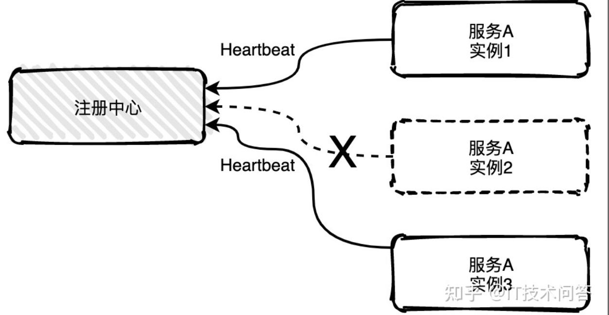

上图中服务A的实例2已经宕机不能主动给注册中心发送心跳消息，15秒之后注册就会将实例2移除掉。

**主动检测**是注册中心主动发起，每隔几秒中会给所有列表中的服务实例发送心跳检测消息，如果多个周期内未发送成功或未收到回复就会主动移除该实例。


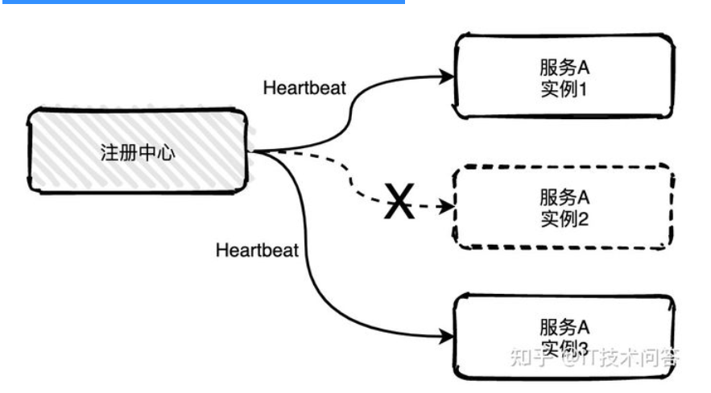


## SpringCloud版本


- 采用版本名+版本号，其中版本名采用伦敦地铁站命名，其中按照地铁首字母A-Z依次命令如Hoxton.SR9。但是现在已更改为主版本号.次版本号.修订号如2020.0.0
- 旧版本命名方式中,开发的快照版本(BUILD-SNAPSHOT)到里程碑版本(M),开发的差不多到会发布的候选发布版(RELEASE),最后到正式版(SR)版本。
- 新版本命名是`YYYY.MINOR.MICRO[-MODIFIER]`，拿**2020.0.1-SNAPSHOT** 这个版本来说，其中YYYY为年份全称、MINOR为辅助版本号、MICRO为补丁版本号。MODIFIER同上述修饰关键节点，BUILD-SNAPSHOT、里程碑M等。

SNAPSHOT 版本：正在开发中的快照版本，例如 2021.0.0-SNAPSHOT，快照版代表当前分支最新的代码进度，也是更新最为频繁的小版本类型，不推荐在线上正式环境使用；

Milestone 版本：在大版本正式发布前的里程碑版本，例如 2021.0.0-M1，M1 代表当前大版本的第一个里程碑版本，M2 代表第二个迭代里程碑，以此类推。在正式版本发布之前要经历多个里程碑的迭代，像 Spring Cloud Finchley 版足足经历了 9 个 M 版本之后，才过渡到了 RC 版。同样地，我也不推荐你在正式项目中使用 Milestone 版本；

Release Candidate 版本：这就是我们俗称的 RC 版，例如 2021.0.0-RC1。当一个版本迭代到 RC 版的时候，意味着离正式发布已经不远了。但是你要注意，RC 版是发布前的候选版本，走到这一步通常已经没有新的功能开发，RC 主要目的是开放出来让大家试用并尽量修复严重 Bug。

Release 版：稳定的正式发布版，比如 2020.0.1。你可以在自己的线上业务中放心使用 Release 稳定版。


## Cloud版本和Boot版本怎么选择


> 与springboot版本对应:https://start.spring.io/actuator/info

```java
{
      "Hoxton.SR12": "Spring Boot >=2.2.0.RELEASE and <2.4.0.M1",
      "2020.0.5": "Spring Boot >=2.4.0.M1 and <2.6.0-M1",
      "2021.0.0-M1": "Spring Boot >=2.6.0-M1 and <2.6.0-M3",
      "2021.0.0-M3": "Spring Boot >=2.6.0-M3 and <2.6.0-RC1",
      "2021.0.0-RC1": "Spring Boot >=2.6.0-RC1 and <2.6.1",
      "2021.0.1": "Spring Boot >=2.6.1 and <2.6.5-SNAPSHOT",
      "2021.0.2-SNAPSHOT": "Spring Boot >=2.6.5-SNAPSHOT and <3.0.0-M1",
      "2022.0.0-M1": "Spring Boot >=3.0.0-M1 and <3.1.0-M1"
}
```


##  AlibabaCloud 以及对应的适配Cloud 和 Boot 版本关系


https://github.com/alibaba/spring-cloud-alibaba/wiki/%E7%89%88%E6%9C%AC%E8%AF%B4%E6%98%8E


下表为按时间顺序发布的 Spring Cloud Alibaba 以及对应的适配 Spring Cloud 和 Spring Boot 版本关系（由于 Spring Cloud 版本命名有调整，所以对应的 Spring Cloud Alibaba 版本号也做了对应变化）

| Spring Cloud Alibaba Version      | Spring Cloud Version        | Spring Boot Version |
| --------------------------------- | --------------------------- | ------------------- |
| 2021.0.1.0                        | Spring Cloud 2021.0.1       | 2.6.3               |
| 2.2.7.RELEASE                     | Spring Cloud Hoxton.SR12    | 2.3.12.RELEASE      |
| 2021.1                            | Spring Cloud 2020.0.1       | 2.4.2               |
| 2.2.6.RELEASE                     | Spring Cloud Hoxton.SR9     | 2.3.2.RELEASE       |
| 2.1.4.RELEASE                     | Spring Cloud Greenwich.SR6  | 2.1.13.RELEASE      |
| 2.2.1.RELEASE                     | Spring Cloud Hoxton.SR3     | 2.2.5.RELEASE       |
| 2.2.0.RELEASE                     | Spring Cloud Hoxton.RELEASE | 2.2.X.RELEASE       |
| 2.1.2.RELEASE                     | Spring Cloud Greenwich      | 2.1.X.RELEASE       |
| 2.0.4.RELEASE(停止维护，建议升级) | Spring Cloud Finchley       | 2.0.X.RELEASE       |
| 1.5.1.RELEASE(停止维护，建议升级) | Spring Cloud Edgware        | 1.5.X.RELEASE       |


## CloudAlibaba版本及其自身所适配的各组件对应版本


https://github.com/alibaba/spring-cloud-alibaba/wiki/%E7%89%88%E6%9C%AC%E8%AF%B4%E6%98%8E

每个 Spring Cloud Alibaba 版本及其自身所适配的各组件对应版本（经过验证，自行搭配各组件版本不保证可用）如下表所示（最新版本用*标记）：

| Spring Cloud Alibaba Version                              | Sentinel Version | Nacos Version | RocketMQ Version | Dubbo Version | Seata Version |
| --------------------------------------------------------- | ---------------- | ------------- | ---------------- | ------------- | ------------- |
| 2021.0.1.0*                                               | 1.8.3            | 1.4.2         | 4.9.2            | 2.7.15        | 1.4.2         |
| 2.2.7.RELEASE                                             | 1.8.1            | 2.0.3         | 4.6.1            | 2.7.13        | 1.3.0         |
| 2.2.6.RELEASE                                             | 1.8.1            | 1.4.2         | 4.4.0            | 2.7.8         | 1.3.0         |
| 2021.1 or 2.2.5.RELEASE or 2.1.4.RELEASE or 2.0.4.RELEASE | 1.8.0            | 1.4.1         | 4.4.0            | 2.7.8         | 1.3.0         |
| 2.2.3.RELEASE or 2.1.3.RELEASE or 2.0.3.RELEASE           | 1.8.0            | 1.3.3         | 4.4.0            | 2.7.8         | 1.3.0         |
| 2.2.1.RELEASE or 2.1.2.RELEASE or 2.0.2.RELEASE           | 1.7.1            | 1.2.1         | 4.4.0            | 2.7.6         | 1.2.0         |
| 2.2.0.RELEASE                                             | 1.7.1            | 1.1.4         | 4.4.0            | 2.7.4.1       | 1.0.0         |
| 2.1.1.RELEASE or 2.0.1.RELEASE or 1.5.1.RELEASE           | 1.7.0            | 1.1.4         | 4.4.0            | 2.7.3         | 0.9.0         |
| 2.1.0.RELEASE or 2.0.0.RELEASE or 1.5.0.RELEASE           | 1.6.3            | 1.1.1         | 4.4.0            | 2.7.3         | 0.7.1         |


## 目前所使用的Cloud组件


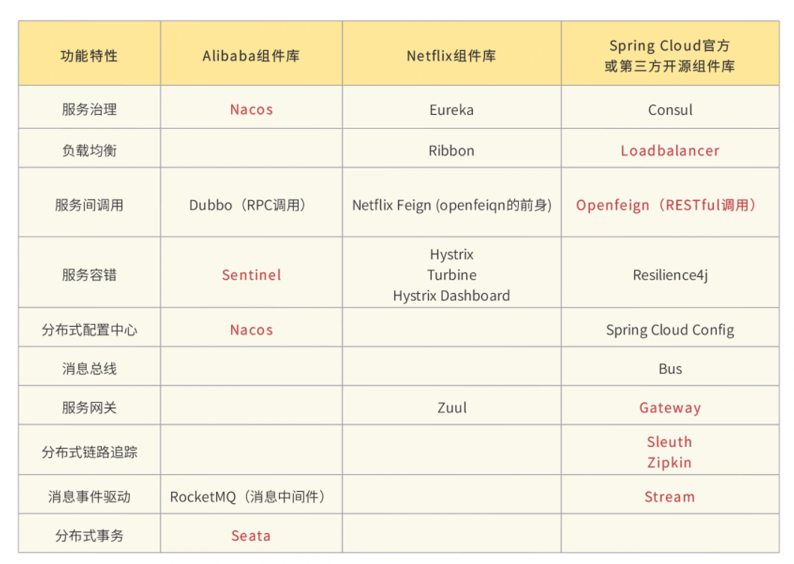


## 相关网址


+ Git源码地址：https://github.com/spring-projects/spring-cloud
+ 官网：https://spring.io/projects/spring-cloud
+ 已发布的稳定版：https://mvnrepository.com/artifact/org.springframework.cloud/spring-cloud-dependencies
+ Cloud与Boot对应关系:https://start.spring.io/actuator/info
+ 中文文档：https://www.bookstack.cn/read/spring-cloud-docs/README.md


# CAP


## 由来


CAP 这个概念最初是由埃里克·布鲁尔博士（Dr. Eric Brewer）在 2000 年的 ACM 年度学术研讨会上提出的。如果你对这次演讲感兴趣的话，可以翻阅他那次名为“Towards Robust Distributed Systems”的演讲 deck。在两年之后，塞思·吉尔伯特（Seth Gilbert）和麻省理工学院的南希·林奇教授（Nancy Ann Lynch）在他们的论文`“Brewer’s conjecture and the Feasibility of Consistent, Available, Partition-Tolerant Web Services”`中证明了这一概念。

他们在这篇论文中证明了：在任意的分布式系统中，**一致性（Consistency）**，**高可用性（Availability）**和**分区容错性（Partition-tolerance）**这三种属性最多只能同时存在两个属性。

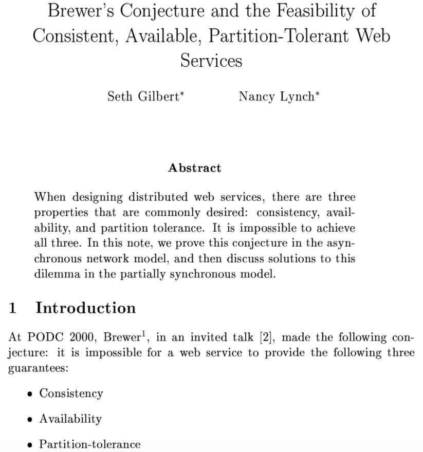


## CAP简介


|      | 描述       |
| ---- | ---------- |
| C    | 一致性     |
| A    | 高可用性   |
| P    | 分区容错性 |


## C(一致性)


一致性在这里指的是**线性一致性（Linearizability Consistency）**。在线性一致性的保证下，所有分布式环境下的操作都像是在单机上完成的一样，也就是说图中 Sever A、B、C 的状态一直是一致的。

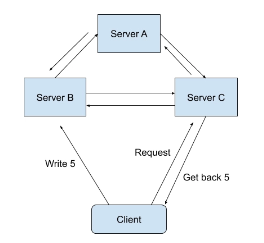

> **例子：**


假设我们设计了一个分布式的购物系统，在这个系统中，商品的存货状态分别保存在服务器 A 和服务器 B 中。我们把存货状态定义为“有货状态”或者“无货状态”。

在最开始的时候，服务器 A 和服务器 B 都会显示商品为有货状态。

等一段时间过后，商品卖完了，后台就必须将这两台服务器上的商品状态更新为无货状态。因为是在分布式的环境下，商品状态的更新在服务器 A 上完成了，显示为无货状态。而服务器 B 的状态因为网络延迟的原因更新还未完成，还是显示着有货状态。

这时，恰好有两个用户使用着这个购物系统，先后发送了一个查询操作（Query Operation）到后台服务器中查询商品状态。

我们假设是用户 A 先查询的，这个查询操作 A 被发送到了服务器 A 上面，并且成功返回了商品是无货状态的。

用户 B 在随后也对同一商品进行查询，而这个查询操作 B 被发送到了服务器 B 上面，并且成功返回了商品是有货状态的。

我们知道，对于整个系统来说，商品的系统状态应该为无货状态。而操作 A 又是在操作 B 之前发送并且成功完成的，所以如果这个系统有线性一致性这个属性的话，操作 B 所看到的系统状态理论上应该是无货状态。

**但在我们这个例子中，操作 B 却返回了有货状态。所以我们说，这个分布式的购物系统并不满足论文里所讲到的线性一致性。聊完了一致性，我们一起来看看可用性的含义。**


## A(高可用性)


可用性的概念比较简单，在这里指的是在分布式系统中，任意非故障的服务器都必须对客户的请求产生响应。

当系统满足可用性的时候，不管出现什么状况（除非所有的服务器全部崩溃），都能返回消息。

**也就是说，当客户端向系统发送请求，只要系统背后的服务器有一台还未崩溃，那么这个未崩溃的服务器必须最终响应客户端。**


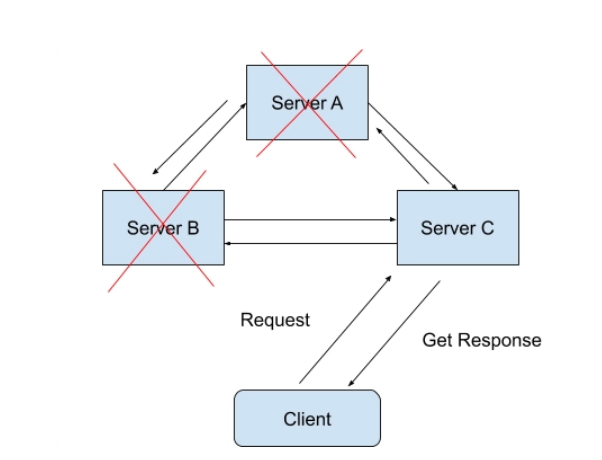


## P(分区容错性)


在了解了可用性之后，你还需要了解分区容错性。

**它分为两个部分，“分区”和“容错”。**

在一个分布式系统里，如果出现一些故障，可能会使得部分节点之间无法连通。由于这些故障节点无法联通，造成整个网络就会被分成几块区域，从而使数据分散在这些无法连通的区域中的情况，你可以认为这就是发生了分区错误。

如图所示，如果你要的数据只在 Sever A 中保存，当系统出现分区错误，在不能直接连接 Sever A 时，你是无法获取数据的。我们要“分区容错”，意思是即使出现这样的“错误”，系统也需要能“容忍”。也就是说，就算错误出现，系统也必须能够返回消息。

分区容错性，**在这里指的是我们的系统允许网络丢失从一个节点发送到另一个节点的任意多条消息。**

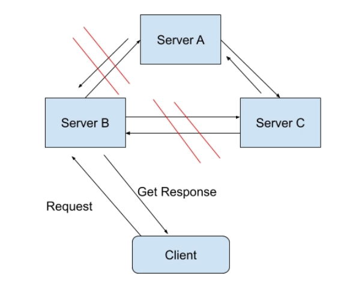


## CAP如何选择


我们知道，在现代网络通信中，节点出现故障或者网络出现丢包这样的情况是时常会发生的。

如果没有了分区容错性，也就是说系统不允许这些节点间的通讯出现任何错误的话，那我们日常所用到的很多系统就不能再继续工作了。所以在大部分情况下，**系统设计都会保留 P 属性，而在 C 和 A 中二选一。**

在任意系统中，我们最多可以保留 CAP 属性中的两种，也就是 CP 或者 AP 或者 CA。


CP 系统：Google BigTable, Hbase, MongoDB, Redis, MemCacheDB，这些存储架构都是放弃了高可用性（High Availablity）而选择 CP 属性的。

AP 系统：Amazon Dynamo 系统以及它的衍生存储系统 Apache Cassandra 和 Voldemort 都是属于 AP 系统CA 系统：Apache Kafka 是一个比较典型的 CA 系统。

我在上面说过，P 属性在现代网络时代中基本上是属于一个必选项，那为什么 Apache Kafka 会放弃 P 选择 CA 属性呢？我来给你解释一下它的架构思想。


## 放弃了P属性的 Kafka


在 Kafka 发布了 0.8 版本之后，Kafka 系统引入了 Replication 的概念。Kafka Relocation 通过将数据复制到不同的节点上，从而增强了数据在系统中的持久性（Durability）和可用性（Availability）。在 Kafka Replication 的系统设计中，所有的数据日志存储是设计在同一个数据中心（Data Center）里面的，也就是说，在同一个数据中心里网络分区出现的可能性是十分之小的。

它的具体架构是这样的，在 Kafka 数据副本（Data Replication）的设计中，先通过 Zookeeper 选举出一个领导者节点（Leader）。这个领导者节点负责维护一组被称作同步数据副本（In-sync-replica）的节点，所有的数据写入都必须在这个领导者节点中记录。

我来举个例子，假设现在数据中心有三台服务器，一台被选为作为领导者节点，另外两台服务器用来保存数据副本，分别是 Replication1 和 Replication2，它们两个节点就是被领导者节点维护的同步数据副本了。领导者节点知道它维护着两个同步数据副本。

如果用户想写入一个数据，假设是“Geekbang”

1. 用户会发请求到领导者节点中想写入“Geekbang”。
2. 领导者节点收到请求后先在本地保存好，然后也同时发消息通知 eplication1 和 Replication2。
3. Replication1 和 Replication2 收到消息后也保存好这条消息并且回复领导者节点写入成功。
4. 领导者节点记录副本 1 和副本 2 都是健康（Healthy）的，并且回复用户写入成功。


**红色的部分是领导者节点本地日志，记录着有哪些同步数据副本是健康的。**

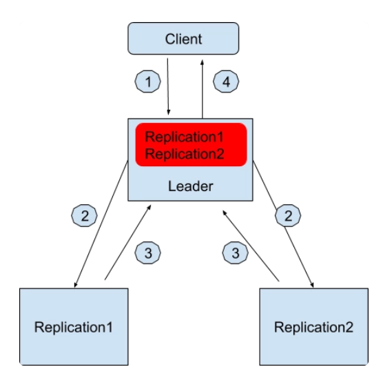

往后用户如果想查询写入的数据，无论是领导者节点还是两个副本都可以返回正确同步的结果。

那假如分区出现了该怎么办呢？例如领导者节点和副本 1 无法通讯了，这个时候流程就变成这样了。


1. 用户会发请求到领导者节点中想写入“Geekbang”。

2. 领导者节点收到请求后先在本地保存好，然后也同时发消息通知 Replication1 和 Replication2。

3. 只有 Replication2 收到消息后也保存好这条消息并且回复领导者节点写入成功。

4. 领导者节点记录副本 2 是健康的，并且回复用户写入成功。


**同样，红色的部分是领导者节点本地日志，记录着有哪些同步数据副本是健康的。**

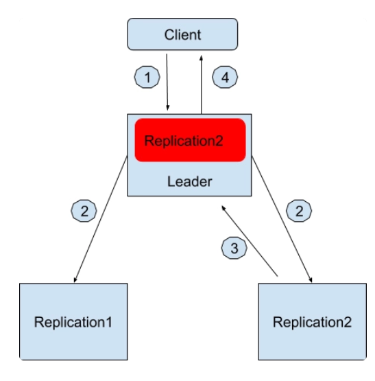


如果所有副本都无法通讯的时候，Apache Kafka 允许系统只有一个节点工作，也就是领导者节点。这个时候所有的写入都只保存在领导者节点了。过程如下，

1. 用户会发请求到领导者节点中想写入“Geekbang”。
2. 领导者节点收到请求后先在本地保存好，然后也同时发消息通知 Replication1 和 Replication2。
3. 没有任何副本回复领导者节点写入成功，领导者节点记录无副本是健康的，并且回复用户写入成功。

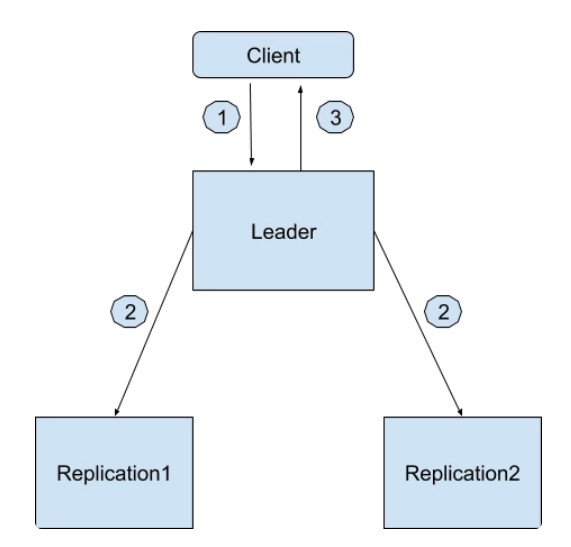


# 项目模块建立


## 项目结构截图


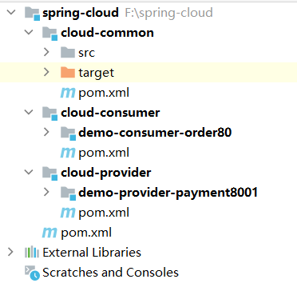


## spring-cloud


### pom


```java
<?xml version="1.0" encoding="UTF-8"?>
<project xmlns="http://maven.apache.org/POM/4.0.0"
         xmlns:xsi="http://www.w3.org/2001/XMLSchema-instance"
         xsi:schemaLocation="http://maven.apache.org/POM/4.0.0 http://maven.apache.org/xsd/maven-4.0.0.xsd">

    <modelVersion>4.0.0</modelVersion>
    <groupId>com.xht.example.cloud</groupId>
    <artifactId>spring-cloud</artifactId>
    <packaging>pom</packaging>
    <version>1.0-SNAPSHOT</version>
    <modules>
        <module>cloud-common</module>
        <module>cloud-consumer</module>
        <module>cloud-provider</module>
    </modules>
    <name>cloud-parent</name>
    <properties>
        <project.build.sourceEncoding>UTF-8</project.build.sourceEncoding>
        <maven.compiler.source>8</maven.compiler.source>
        <maven.compiler.target>8</maven.compiler.target>
        <spring-boot.version>2.6.3</spring-boot.version>
        <spring-cloud.version>2021.0.1</spring-cloud.version>
        <spring-cloud-alibaba.version>2021.0.1.0</spring-cloud-alibaba.version>
        <junit.version>4.12</junit.version>
        <log4j.version>1.2.17</log4j.version>
        <lombok.version>1.16.18</lombok.version>
        <mysql.version>8.0.20</mysql.version>
        <druid.version>1.2.8</druid.version>
        <mybatis.spring.boot.version>3.5.9</mybatis.spring.boot.version>
        <my-version>1.0-SNAPSHOT</my-version>
    </properties>
    <parent>
        <groupId>org.springframework.boot</groupId>
        <artifactId>spring-boot-starter-parent</artifactId>
        <version>2.6.4</version>
    </parent>
    <dependencyManagement>
        <dependencies>
            <dependency>
                <groupId>org.springframework.cloud</groupId>
                <artifactId>spring-cloud-dependencies</artifactId>
                <version>${spring-cloud.version}</version>
                <type>pom</type>
                <scope>import</scope>
            </dependency>
            <dependency>
                <groupId>com.alibaba.cloud</groupId>
                <artifactId>spring-cloud-alibaba-dependencies</artifactId>
                <version>${spring-cloud-alibaba.version}</version>
                <type>pom</type>
                <scope>import</scope>
            </dependency>
            <dependency>
                <groupId>mysql</groupId>
                <artifactId>mysql-connector-java</artifactId>
                <version>${mysql.version}</version>
            </dependency>
            <dependency>
                <groupId>com.alibaba</groupId>
                <artifactId>druid-spring-boot-starter</artifactId>
                <version>${druid.version}</version>
            </dependency>
            <dependency>
                <groupId>org.mybatis.spring.boot</groupId>
                <artifactId>mybatis-spring-boot-starter</artifactId>
                <version>2.2.2</version>
            </dependency>
            <dependency>
                <groupId>junit</groupId>
                <artifactId>junit</artifactId>
                <version>${junit.version}</version>
            </dependency>
            <dependency>
                <groupId>log4j</groupId>
                <artifactId>log4j</artifactId>
                <version>${log4j.version}</version>
            </dependency>
            <dependency>
                <groupId>org.projectlombok</groupId>
                <artifactId>lombok</artifactId>
                <version>${lombok.version}</version>
                <optional>true</optional>
            </dependency>
            <dependency>
                <groupId>com.xht.example.cloud</groupId>
                <artifactId>cloud-common</artifactId>
                <version>${my-version}</version>
            </dependency>
        </dependencies>
    </dependencyManagement>


    <repositories>
        <repository>
            <id>alimaven</id>
            <name>aliyun maven</name>
            <url>http://maven.aliyun.com/nexus/content/groups/public/</url>
        </repository>

        <repository>
            <id>spring-snapshots</id>
            <url>http://repo.spring.io/libs-snapshot</url>
        </repository>
    </repositories>

    <pluginRepositories>
        <pluginRepository>
            <id>spring-snapshots</id>
            <url>http://repo.spring.io/libs-snapshot</url>
        </pluginRepository>
    </pluginRepositories>
    <build>
        <plugins>
            <plugin>
                <groupId>org.springframework.boot</groupId>
                <artifactId>spring-boot-maven-plugin</artifactId>
                <configuration>
                    <fork>true</fork>
                    <addResources>true</addResources>
                </configuration>
            </plugin>
        </plugins>
    </build>
</project>
```


## cloud-common


### pom


```java
<?xml version="1.0" encoding="UTF-8"?>
<project xmlns="http://maven.apache.org/POM/4.0.0"
         xmlns:xsi="http://www.w3.org/2001/XMLSchema-instance"
         xsi:schemaLocation="http://maven.apache.org/POM/4.0.0 http://maven.apache.org/xsd/maven-4.0.0.xsd">
    <parent>
        <artifactId>spring-cloud</artifactId>
        <groupId>com.xht.example.cloud</groupId>
        <version>1.0-SNAPSHOT</version>
    </parent>
    <modelVersion>4.0.0</modelVersion>
    <artifactId>cloud-common</artifactId>
    <packaging>jar</packaging>
    <dependencies>
        <dependency>
            <groupId>org.springframework.boot</groupId>
            <artifactId>spring-boot-devtools</artifactId>
            <scope>runtime</scope>
            <optional>true</optional>
        </dependency>
        <dependency>
            <groupId>org.projectlombok</groupId>
            <artifactId>lombok</artifactId>
        </dependency>
        <dependency>
            <groupId>cn.hutool</groupId>
            <artifactId>hutool-all</artifactId>
            <version>5.1.0</version>
        </dependency>
    </dependencies>
    <properties>
        <maven.compiler.source>8</maven.compiler.source>
        <maven.compiler.target>8</maven.compiler.target>
    </properties>

</project>
```


### PaymentEntity


```java
package com.it.common.entity;

import lombok.AllArgsConstructor;
import lombok.Data;
import lombok.NoArgsConstructor;

import java.io.Serializable;

/**
 * 描述 ：
 *
 * @author : 小糊涂
 * @version : 1.0
 **/
@Data
@AllArgsConstructor
@NoArgsConstructor
public class PaymentEntity implements Serializable {

    private Long id;

    private String serial;

}
```


### CommonResult


```java
package com.it.common;


import lombok.AllArgsConstructor;
import lombok.Data;
import lombok.NoArgsConstructor;
import lombok.extern.slf4j.Slf4j;

/**
 * @auther zzyy
 * @create 2020-01-27 20:17
 */
@Data
@AllArgsConstructor
@NoArgsConstructor
public class CommonResult<T> {
    private Integer code;
    private String message;
    private T data;

    public CommonResult(Integer code, String message) {
        this(code, message, null);
    }
}
```


## cloud-consumer


### pom


```java
<?xml version="1.0" encoding="UTF-8"?>
<project xmlns="http://maven.apache.org/POM/4.0.0"
         xmlns:xsi="http://www.w3.org/2001/XMLSchema-instance"
         xsi:schemaLocation="http://maven.apache.org/POM/4.0.0 http://maven.apache.org/xsd/maven-4.0.0.xsd">
    <parent>
        <artifactId>spring-cloud</artifactId>
        <groupId>com.xht.example.cloud</groupId>
        <version>1.0-SNAPSHOT</version>
    </parent>
    <modelVersion>4.0.0</modelVersion>
    <packaging>pom</packaging>
    <description>服务消费者</description>
    <modules>
        <module>demo-consumer-order80</module>
    </modules>
    <artifactId>cloud-consumer</artifactId>

    <properties>
        <maven.compiler.source>8</maven.compiler.source>
        <maven.compiler.target>8</maven.compiler.target>
    </properties>
    <dependencies>
        <dependency>
            <groupId>com.xht.example.cloud</groupId>
            <artifactId>cloud-common</artifactId>
        </dependency>
        <dependency>
            <groupId>org.springframework.boot</groupId>
            <artifactId>spring-boot-starter-web</artifactId>
        </dependency>
        <dependency>
            <groupId>org.springframework.boot</groupId>
            <artifactId>spring-boot-starter-actuator</artifactId>
        </dependency>
        <dependency>
            <groupId>org.springframework.boot</groupId>
            <artifactId>spring-boot-starter-test</artifactId>
            <scope>test</scope>
        </dependency>
    </dependencies>
</project>
```


## demo-consumer-order80


### pom


```java
<?xml version="1.0" encoding="UTF-8"?>
<project xmlns="http://maven.apache.org/POM/4.0.0"
         xmlns:xsi="http://www.w3.org/2001/XMLSchema-instance"
         xsi:schemaLocation="http://maven.apache.org/POM/4.0.0 http://maven.apache.org/xsd/maven-4.0.0.xsd">
    <parent>
        <artifactId>cloud-consumer</artifactId>
        <groupId>com.xht.example.cloud</groupId>
        <version>1.0-SNAPSHOT</version>
    </parent>
    <modelVersion>4.0.0</modelVersion>

    <artifactId>demo-consumer-order80</artifactId>

    <properties>
        <maven.compiler.source>8</maven.compiler.source>
        <maven.compiler.target>8</maven.compiler.target>
    </properties>
    <dependencies>
        <dependency>
            <groupId>org.springframework.boot</groupId>
            <artifactId>spring-boot-devtools</artifactId>
            <scope>runtime</scope>
            <optional>true</optional>
        </dependency>
    </dependencies>
</project>
```


### application.yml


```yaml
server:
  port: 80
```


### DemoOrderAPP80


```java
package com.it;

import org.springframework.boot.SpringApplication;
import org.springframework.boot.autoconfigure.SpringBootApplication;

/**
 * 描述 ：
 *
 * @author : 小糊涂
 * @version : 1.0
 **/
@SpringBootApplication
public class DemoOrderAPP80 {
    public static void main(String[] args) {
        SpringApplication.run(DemoOrderAPP80.class, args);
    }
}

```


### RestTemplateConfig


```java
package com.it.config;

import org.springframework.context.annotation.Bean;
import org.springframework.context.annotation.Configuration;
import org.springframework.web.client.RestTemplate;

/**
 * 描述 ：
 *
 * @author : 小糊涂
 * @version : 1.0
 **/
@Configuration
public class RestTemplateConfig {

    @Autowired
    private RestTemplateBuilder builder;

    @Bean
    public RestTemplate restTemplate(){
        return builder.build();
    }
}

```


### OrderController


```java
package com.it.controller;

import com.it.common.CommonResult;
import com.it.common.entity.PaymentEntity;
import org.springframework.beans.factory.annotation.Autowired;
import org.springframework.web.bind.annotation.GetMapping;
import org.springframework.web.bind.annotation.PathVariable;
import org.springframework.web.bind.annotation.RestController;
import org.springframework.web.client.RestTemplate;

/**
 * 描述 ：
 *
 * @author : 小糊涂
 * @version : 1.0
 **/
@RestController
public class OrderController
{

    public static final String PaymentSrv_URL = "http://localhost:8001";

    @Autowired
    private RestTemplate restTemplate;

    @GetMapping("/consumer/payment/create") //客户端用浏览器是get请求，但是底层实质发送post调用服务端8001
    public CommonResult create(PaymentEntity payment)
    {
        System.out.println(payment);
        return restTemplate.postForObject(PaymentSrv_URL + "/payment/create",payment,CommonResult.class);
    }


    @GetMapping("/consumer/payment/get/{id}")
    public CommonResult getPayment(@PathVariable Long id)
    {
        return restTemplate.getForObject(PaymentSrv_URL + "/payment/get/"+id, CommonResult.class, id);
    }
}
```


## cloud-provider


### pom


```java
<?xml version="1.0" encoding="UTF-8"?>
<project xmlns="http://maven.apache.org/POM/4.0.0"
         xmlns:xsi="http://www.w3.org/2001/XMLSchema-instance"
         xsi:schemaLocation="http://maven.apache.org/POM/4.0.0 http://maven.apache.org/xsd/maven-4.0.0.xsd">
    <parent>
        <artifactId>spring-cloud</artifactId>
        <groupId>com.xht.example.cloud</groupId>
        <version>1.0-SNAPSHOT</version>
    </parent>
    <modelVersion>4.0.0</modelVersion>
    <packaging>pom</packaging>
    <description>服务提供者</description>
    <modules>
        <module>demo-provider-payment8001</module>
    </modules>
    <artifactId>cloud-provider</artifactId>

    <properties>
        <maven.compiler.source>8</maven.compiler.source>
        <maven.compiler.target>8</maven.compiler.target>
    </properties>
    <dependencies>
        <dependency>
            <groupId>com.xht.example.cloud</groupId>
            <artifactId>cloud-common</artifactId>
        </dependency>
        <dependency>
            <groupId>org.springframework.boot</groupId>
            <artifactId>spring-boot-starter-web</artifactId>
        </dependency>
        <dependency>
            <groupId>org.springframework.boot</groupId>
            <artifactId>spring-boot-starter-actuator</artifactId>
        </dependency>
        <dependency>
            <groupId>org.mybatis.spring.boot</groupId>
            <artifactId>mybatis-spring-boot-starter</artifactId>
        </dependency>
        <!-- https://mvnrepository.com/artifact/mysql/mysql-connector-java -->
        <dependency>
            <groupId>mysql</groupId>
            <artifactId>mysql-connector-java</artifactId>
        </dependency>
        <dependency>
            <groupId>com.alibaba</groupId>
            <artifactId>druid-spring-boot-starter</artifactId>
        </dependency>
    </dependencies>
</project>
```


## demo-provider-payment8001


### pom


```java
<?xml version="1.0" encoding="UTF-8"?>
<project xmlns="http://maven.apache.org/POM/4.0.0"
         xmlns:xsi="http://www.w3.org/2001/XMLSchema-instance"
         xsi:schemaLocation="http://maven.apache.org/POM/4.0.0 http://maven.apache.org/xsd/maven-4.0.0.xsd">
    <parent>
        <artifactId>cloud-provider</artifactId>
        <groupId>com.xht.example.cloud</groupId>
        <version>1.0-SNAPSHOT</version>
    </parent>
    <modelVersion>4.0.0</modelVersion>
    <artifactId>demo-provider-payment8001</artifactId>
    <packaging>jar</packaging>
    <properties>
        <maven.compiler.source>8</maven.compiler.source>
        <maven.compiler.target>8</maven.compiler.target>
    </properties>
    <dependencies>
        <dependency>
            <groupId>org.springframework.boot</groupId>
            <artifactId>spring-boot-devtools</artifactId>
            <scope>runtime</scope>
            <optional>true</optional>
        </dependency>
    </dependencies>
</project>
```


### application.yml


```java
server:
  port: 8001

spring:
  application:
    name: cloud-payment-service
  datasource:
    username: root
    password: 123456
    driver-class-name: com.mysql.jdbc.Driver
    url: jdbc:mysql://127.0.0.1:3306/test?useSSL=false&allowPublicKeyRetrieval=true&useUnicode=true&characterEncoding=utf-8&serverTimezone=GMT%2B8

mybatis:
  mapperLocations: classpath:mapper/*.xml
  type-aliases-package: com.it.common.entity    # 所有Entity别名类所在包
```


### PaymentMapper.xml


在`resources/mapper`目录下


```java
<?xml version="1.0" encoding="UTF-8" ?>
<!DOCTYPE mapper PUBLIC "-//mybatis.org//DTD Mapper 3.0//EN" "http://mybatis.org/dtd/mybatis-3-mapper.dtd" >

<mapper namespace="com.it.dao.PaymentDao">

    <resultMap id="BaseResultMap" type="com.it.common.entity.PaymentEntity">
        <id column="id" property="id" jdbcType="BIGINT"/>
        <result column="serial" property="serial" jdbcType="VARCHAR"/>
    </resultMap>

    <insert id="create" parameterType="com.it.common.entity.PaymentEntity" useGeneratedKeys="true" keyProperty="id">
        INSERT INTO payment(SERIAL)
        VALUES (#{serial});
    </insert>

    <select id="getPaymentById" parameterType="Long" resultMap="BaseResultMap">
        SELECT *
        FROM payment
        WHERE id = #{id};
    </select>

</mapper>
```


### DemoPaymentAPP8001


```java
package com.it;

import org.springframework.boot.SpringApplication;
import org.springframework.boot.autoconfigure.SpringBootApplication;

/**
 * 描述 ：
 *
 * @author : 小糊涂
 * @version : 1.0
 **/
@SpringBootApplication
public class DemoPaymentAPP8001 {
    public static void main(String[] args) {
        SpringApplication.run(DemoPaymentAPP8001.class,args);
    }

}
```


### DruidConfig


```java
package com.it.config;

import com.alibaba.druid.pool.DruidDataSource;
import com.alibaba.druid.support.http.StatViewServlet;
import com.alibaba.druid.support.http.WebStatFilter;
import org.springframework.boot.context.properties.ConfigurationProperties;
import org.springframework.boot.web.servlet.FilterRegistrationBean;
import org.springframework.boot.web.servlet.ServletRegistrationBean;
import org.springframework.context.annotation.Bean;
import org.springframework.context.annotation.Configuration;

import javax.sql.DataSource;
import java.util.HashMap;

/**
 * druid 配置多数据源
 *  访问页面http://ip:port/druid/sql.html
 * @author xht
 */
@Configuration
public class DruidConfig {

    @ConfigurationProperties(prefix = "spring.datasource")
    @Bean
    public DataSource dataSource() {
        return new DruidDataSource();
    }
}
```


### PaymentController


```java
package com.it.controller;

import com.it.common.CommonResult;
import com.it.common.entity.PaymentEntity;
import com.it.service.PaymentService;
import lombok.extern.slf4j.Slf4j;
import org.springframework.web.bind.annotation.GetMapping;
import org.springframework.web.bind.annotation.PathVariable;
import org.springframework.web.bind.annotation.PostMapping;
import org.springframework.web.bind.annotation.RequestBody;
import org.springframework.web.bind.annotation.RestController;

import javax.annotation.Resource;

/**
 * 描述 ：
 *
 * @author : 小糊涂
 * @version : 1.0
 **/
@RestController
@Slf4j
public class PaymentController
{
    @Resource
    private PaymentService paymentService;

    @PostMapping(value = "/payment/create")
    public CommonResult create(@RequestBody PaymentEntity payment)
    {
        int result = paymentService.create(payment);
        log.info("*****插入操作返回结果:" + result);

        if(result > 0)
        {
            return new CommonResult(200,"插入数据库成功",result);
        }else{
            return new CommonResult(444,"插入数据库失败",null);
        }
    }

    @GetMapping(value = "/payment/get/{id}")
    public CommonResult<PaymentEntity> getPaymentById(@PathVariable("id") Long id)
    {
        PaymentEntity payment = paymentService.getPaymentById(id);
        log.info("*****查询结果:{}",payment);
        if (payment != null) {
            return new CommonResult(200,"查询成功",payment);
        }else{
            return new CommonResult(444,"没有对应记录,查询ID: "+id,null);
        }
    }
}
```


### PaymentDao


```java
package com.it.dao;

/**
 * 描述 ：
 *
 * @author : 小糊涂
 * @version : 1.0
 **/

import com.it.common.entity.PaymentEntity;
import org.apache.ibatis.annotations.Mapper;
import org.apache.ibatis.annotations.Param;

@Mapper
public interface PaymentDao {
    public int create(PaymentEntity payment);

    public PaymentEntity getPaymentById(@Param("id") Long id);
}
```


### PaymentService


```java
package com.it.service;

import com.it.common.entity.PaymentEntity;

/**
 * 描述 ：
 *
 * @author : 小糊涂
 * @version : 1.0
 **/
public interface PaymentService {
    public int create(PaymentEntity payment);

    public PaymentEntity getPaymentById(Long id);

}
```


### PaymentServiceImpl


```java
package com.it.service.impl;

import com.it.common.entity.PaymentEntity;
import com.it.dao.PaymentDao;
import com.it.service.PaymentService;
import org.springframework.stereotype.Service;

import javax.annotation.Resource;

/**
 * 描述 ：
 *
 * @author : 小糊涂
 * @version : 1.0
 **/
@Service
public class PaymentServiceImpl implements PaymentService {

    @Resource
    private PaymentDao paymentDao;


    @Override
    public int create(PaymentEntity payment) {
        return paymentDao.create(payment);
    }

    @Override
    public PaymentEntity getPaymentById(Long id) {
        return paymentDao.getPaymentById(id);
    }
}
```


## 测试


postMan测试：复制下面json，复制到任意的json文件中，然后导入到postMan中

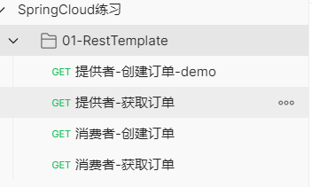

```javascript
{
	"info": {
		"_postman_id": "982a519e-c744-4fcd-a55b-823a5e883fdb",
		"name": "SpringCloud练习",
		"schema": "https://schema.getpostman.com/json/collection/v2.1.0/collection.json"
	},
	"item": [
		{
			"name": "01-RestTemplate",
			"item": [
				{
					"name": "提供者-创建订单-demo",
					"protocolProfileBehavior": {
						"disableBodyPruning": true
					},
					"request": {
						"method": "GET",
						"header": [],
						"body": {
							"mode": "raw",
							"raw": "{\r\n    \"serial\": \"小糊涂\"\r\n}",
							"options": {
								"raw": {
									"language": "json"
								}
							}
						},
						"url": {
							"raw": "http://127.0.0.1:8001/payment/create",
							"protocol": "http",
							"host": [
								"127",
								"0",
								"0",
								"1"
							],
							"port": "8001",
							"path": [
								"payment",
								"create"
							]
						}
					},
					"response": []
				},
				{
					"name": "提供者-获取订单",
					"request": {
						"method": "GET",
						"header": [],
						"url": {
							"raw": "http://127.0.0.1:8001/payment/get/1",
							"protocol": "http",
							"host": [
								"127",
								"0",
								"0",
								"1"
							],
							"port": "8001",
							"path": [
								"payment",
								"get",
								"1"
							]
						}
					},
					"response": []
				},
				{
					"name": "消费者-创建订单",
					"protocolProfileBehavior": {
						"disableBodyPruning": true
					},
					"request": {
						"method": "GET",
						"header": [],
						"body": {
							"mode": "raw",
							"raw": "",
							"options": {
								"raw": {
									"language": "json"
								}
							}
						},
						"url": {
							"raw": "http://127.0.0.1:80/consumer/payment/create?serial=小糊涂",
							"protocol": "http",
							"host": [
								"127",
								"0",
								"0",
								"1"
							],
							"port": "80",
							"path": [
								"consumer",
								"payment",
								"create"
							],
							"query": [
								{
									"key": "serial",
									"value": "小糊涂"
								}
							]
						}
					},
					"response": []
				},
				{
					"name": "消费者-获取订单",
					"request": {
						"method": "GET",
						"header": [],
						"url": {
							"raw": "http://127.0.0.1:80/consumer/payment/get/1",
							"protocol": "http",
							"host": [
								"127",
								"0",
								"0",
								"1"
							],
							"port": "80",
							"path": [
								"consumer",
								"payment",
								"get",
								"1"
							]
						}
					},
					"response": []
				}
			]
		}
	]
}
```


# RestTemplate


## 简介


我们写上面的项目时，发现了一个新的类：`RestTemplate`

`RestTemplate`提供了多种便捷访问**远程Http服务的方法**，是一种简单便捷的访问**restful服务模板类**，是Spring提供的用于访问Rest服务的客户端模板工具集

## 官网地址


https://docs.spring.io/spring-framework/docs/5.2.2.RELEASE/javadoc-api/org/springframework/web/client/RestTemplate.html


## 使用


使用restTemplate访问restful接口非常的简单粗暴无脑。(**url**, **requestMap**, **ResponseBean.class**)这三个参数分别代表 
REST请求地址、请求参数、HTTP响应转换被转换成的对象类型。

 

## SpringBoot配置


```java

/**
 * 描述 ：
 *
 * @author : 小糊涂
 * @version : 1.0
 **/
@Configuration
public class RestTemplateConfig {
    @Bean
    public RestTemplate restTemplate(){
        RestTemplate restTemplate = new RestTemplate();
        HttpComponentsClientHttpRequestFactory httpRequestFactory = new HttpComponentsClientHttpRequestFactory();
        httpRequestFactory.setConnectionRequestTimeout(30 * 1000);//请求连接超时
        httpRequestFactory.setConnectTimeout(30 * 3000);//连接超时时间
        httpRequestFactory.setReadTimeout(30 * 3000);//读取超时
        restTemplate.setRequestFactory(httpRequestFactory);
        return restTemplate;
    }
}
```


 

## 使用案例


```java
@RestController
@Slf4j
public class OrderController {
    private static final String PAYMENT_URL = "http://localhost:8001";

    @Resource
    private RestTemplate restTemplate;
 
    @GetMapping(value = "/consumer/payment/create")
    public CommonResult<Integer> create(Payment payment) {
        return restTemplate.postForObject(PAYMENT_URL + "/payment/create", payment, CommonResult.class);
    }
 
    @GetMapping(value = "consumer/payment/get/{id}")
    public CommonResult<Payment> getPaymentByid(@PathVariable("id") Integer id) {
        return restTemplate.getForObject(PAYMENT_URL + "/payment/get/" + id, CommonResult.class);
    }
}
```


##  有哪些方法


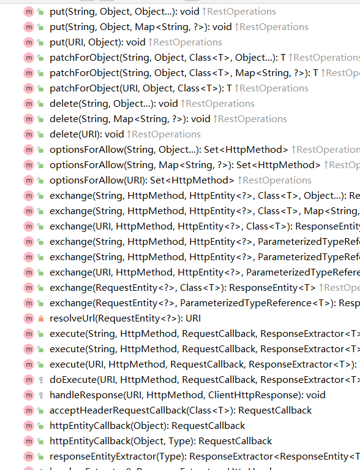


这么些方法其实就够我们用了.


## GetForEntity与getForObject的区别


接下来我们就来分析一下源码,看看这些方法都有什么样的区别,这里以 `get请求` 为例,post请求类似,大家可以自行查阅
其实方法主要分为 **两大类** 一类就是 **`getForEntity`** ,另外一类就是 **`getForObject`**

我们首先区分提下这两个大类的区别,这里我们将两段代码贴出来对比着看首先我们来看 **第一个不同** 的地方:


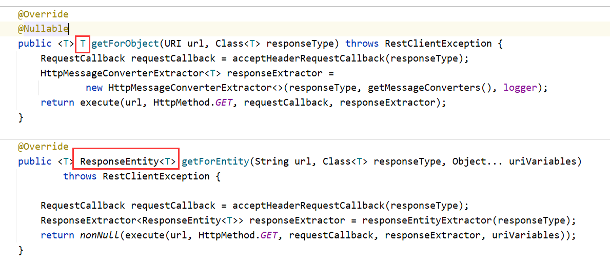


我们首先可以看到就是两者的 `返回类型是不一样` 的,我们可以看到getForEntity的返回类型是规定死的,只能是responseEntity,但是responseEntity里面包含的数据是可以变化的,getForObject的返回类型则是可以变化的,也就是自定义的意思.

接着我们来看第二个不同的地方:

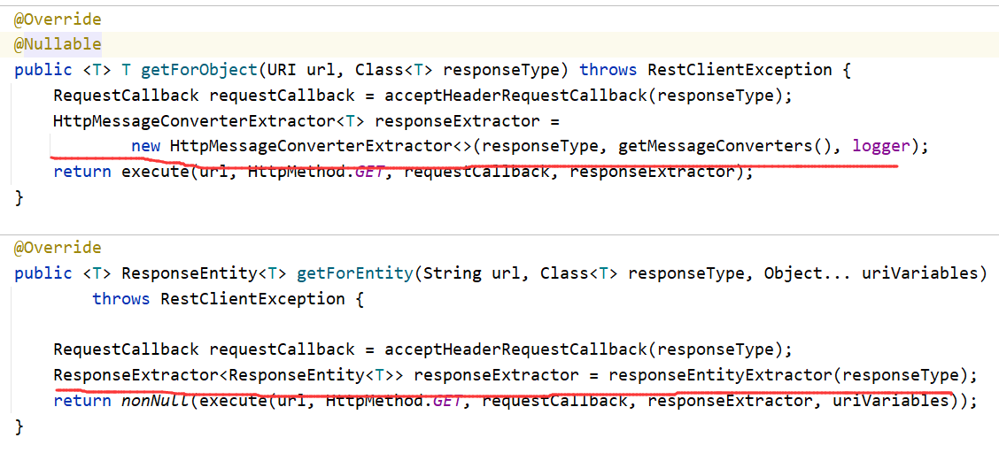


getForObject相对于getForEntity来说,多了一步类型转换的步骤,其实可以理解成**getForObject对getForEntity获得的数据进行了更深层次的一次封装** ,

只让用户注重于他们所注重的数据本身,将其他一些无关紧要的数据,比如说 **请求头,响应状态** 这些数据全部都隐藏起来,只让用户看到他们想要的数据,就比如说查出来的信息


> **getForObject：返回响应体中数据转化成的对象，可以理解为json**
>
> **getForEntity：返回的是ResponseEntity的对象包含了一些重要的信息 例如以下代码**


## 配置字符集,解决乱码


但是还需要注意一点,如果我们请求回来的数据里面包含中文的话,那么我们就需要重新配置一下字符集,否则中文是会乱码的


````java
		@Bean //必须new 一个RestTemplate并放入spring容器当中,否则启动时报错
    public RestTemplate restTemplate() {
        RestTemplate restTemplate = new RestTemplate();
        HttpComponentsClientHttpRequestFactory httpRequestFactory = new HttpComponentsClientHttpRequestFactory();
        httpRequestFactory.setConnectionRequestTimeout(30 * 1000);
        httpRequestFactory.setConnectTimeout(30 * 3000);
        httpRequestFactory.setReadTimeout(30 * 3000);
//        //修改字符集
        List<HttpMessageConverter<?>> list = restTemplate.getMessageConverters();
        for (HttpMessageConverter<?> httpMessageConverter : list) {
            if (httpMessageConverter instanceof StringHttpMessageConverter){
                ((StringHttpMessageConverter)
                        httpMessageConverter).setDefaultCharset(Charset.forName("utf-8"));
                break;
            }
        }
        restTemplate.setRequestFactory(httpRequestFactory);
        return restTemplate;
    }
````


# SpringActuator


## 简介


为了更好的学习后面的知识点，我们先学习一下这个：`SpringActuator`这是springboot里面的一个服务监控

主要运用在微服务架构，所以我建议你先学微服务(至少了解)，否则可能get不到它的用处，只有大型的分布式系统才会用到指标监控... 

**SpringBoot自带监控功能Actuator，可以帮助实现对程序内部运行情况监控，比如监控状况、Bean加载情况、环境变 量、日志信息、线程信息等**


## 为什么要使用它


对于一个大型的几十个、几百个微服务构成的微服务架构系统，在线上时通常会遇到下面一些问题，

比如： 

1. 如何知道哪些服务除了问题，如何快速定位？ (健康状况） 
2. 如何统一监控各个微服务的性能指标（内存、jvm、并发数、线程池、Http 请求统计）
3.  如何统一管理各个微服务的日志？（切换线上日志等级，快速搜索日志...） 
4. 如何优雅管理服务下线（正在运行的线程不发生中断） 


So: 在这种大型分布式应用的环境下，我们如何能够快速发现问题、快速解决问题， 必须要有监控平台、（链路追踪、日志）


## start


```java
<dependency>
     <groupId>org.springframework.boot</groupId>
     <artifactId>spring-boot-starter-actuator</artifactId>
</dependency>
<dependency>
     <groupId>org.springframework.boot</groupId>
     <artifactId>spring-boot-starter-web</artifactId>
</dependency>                
```


## 启动测试


```java
http://localhost:8080/actuator/
```


## yml配置项


  这大抵就是全部默认的 Endpoint 的配置了，怎么样？强大吧！之前做了一个网络监控的项目，就是能够实时查看服务器的 CPU、内存、磁盘、IO 这些（基于 sigar.jar 实现），然后现在发现 SpringBoot 就这样轻松支持了，还更强大，更简便......

  默认的 Endpoint 映射前缀是 **/actuator**，可以通过如上 base-path 自定义设置。

  每个 Endpoint 都可以配置开启或者禁用。但是仅仅开启 Endpoint 是不够的，还需要通过 jmx 或者 web 暴露他们，通过 exclude 和 include 属性配置。


```yaml
management:
  endpoints:
    # 暴露 EndPoint 以供访问，有jmx和web两种方式，exclude 的优先级高于 include
    jmx:
      exposure:
        exclude: '*'
        include: '*'
    web:
      exposure:
        # exclude: '*'
        include: [ "health","info","beans","mappings","logfile","metrics","shutdown","env" ]
      base-path: /actuator  # 配置 Endpoint 的基础路径
      cors: # 配置跨域资源共享
        allowed-origins: http://example.com
        allowed-methods: GET,POST
    enabled-by-default: true # 修改全局 endpoint 默认设置
  endpoint:
    auditevents: # 1、显示当前引用程序的审计事件信息，默认开启
      enabled: true
      cache:
        time-to-live: 10s # 配置端点缓存响应的时间
    beans: # 2、显示一个应用中所有 Spring Beans 的完整列表，默认开启
      enabled: true
    conditions: # 3、显示配置类和自动配置类的状态及它们被应用和未被应用的原因，默认开启
      enabled: true
    configprops: # 4、显示一个所有@ConfigurationProperties的集合列表，默认开启
      enabled: true
    env: # 5、显示来自Spring的 ConfigurableEnvironment的属性，默认开启
      enabled: true
    flyway: # 6、显示数据库迁移路径，如果有的话，默认开启
      enabled: true
    health: # 7、显示健康信息，默认开启
      enabled: true
      show-details: always
    info: # 8、显示任意的应用信息，默认开启
      enabled: true
    liquibase: # 9、展示任何Liquibase数据库迁移路径，如果有的话，默认开启
      enabled: true
    metrics: # 10、展示当前应用的metrics信息，默认开启
      enabled: true
    mappings: # 11、显示一个所有@RequestMapping路径的集合列表，默认开启
      enabled: true
    scheduledtasks: # 12、显示应用程序中的计划任务，默认开启
      enabled: true
    sessions: # 13、允许从Spring会话支持的会话存储中检索和删除(retrieval and deletion)用户会话。使用Spring Session对反应性Web应用程序的支持时不可用。默认开启。
      enabled: true
    shutdown: # 14、允许应用以优雅的方式关闭，默认关闭
      enabled: true
    threaddump: # 15、执行一个线程dump
      enabled: true
    # web 应用时可以使用以下端点
    heapdump: # 16、    返回一个GZip压缩的hprof堆dump文件，默认开启
      enabled: true
    jolokia: # 17、通过HTTP暴露JMX beans（当Jolokia在类路径上时，WebFlux不可用），默认开启
      enabled: true
    logfile: # 18、返回日志文件内容（如果设置了logging.file或logging.path属性的话），支持使用HTTP Range头接收日志文件内容的部分信息，默认开启
      enabled: true
    prometheus: #19、以可以被Prometheus服务器抓取的格式显示metrics信息，默认开启
      enabled: true
```


## 提供的监控项


下表包含了Actuator提供的主要监控项。 

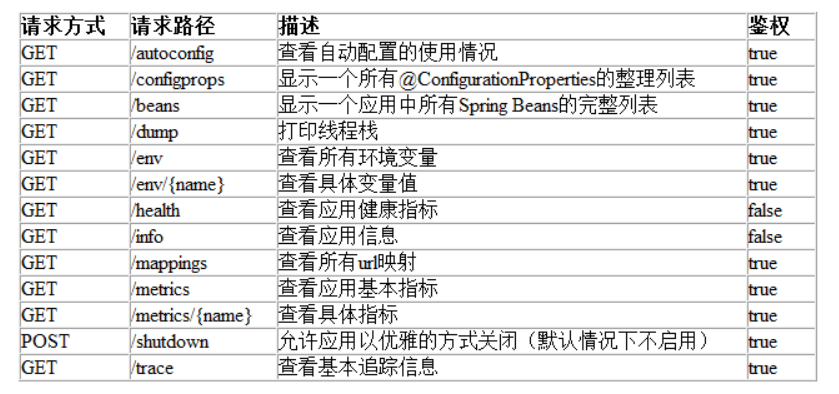


## info接口不显示信息


因为没有build-info.propertiesspa这个文件，我们使用idea的插件里面这个选项，然后再次打包就可以


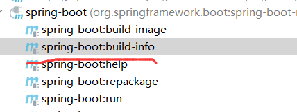


# Spring Boot Admin


## 简介


 可视化监控平台， 是一个基于 Spring Boot Actuator 端点之上的 Vue.js 应用程序。 

https://github.com/codecentric/spring-boot-admin

绿色：健康 灰色：连接客户端健康信息超时（超过10s) 红色：就能看到具体异常信息


## 版本选择


springboot版本是多少admin的版本就是多少

Spring Boot 2.x=Spring Boot Admin 2.x (比如Spring Boot 2.3.x 可以用Spring Boot Admin 2.3.x)

+ 服务端

```java
<dependency>
   <groupId>de.codecentric</groupId>
   <artifactId>spring-boot-admin-starter-server</artifactId>
   <version>2.6.2</version>
</dependency>
```

+ 客户端

```java
<dependency>
   <groupId>de.codecentric</groupId>
   <artifactId>spring-boot-admin-starter-client</artifactId>
   <version>2.6.2</version>
</dependency>
```


## 服务端-pom


```java
<dependencies>
    <dependency>
        <groupId>org.springframework.boot</groupId>
        <artifactId>spring-boot-starter-web</artifactId>
    </dependency>
    <dependency>
        <groupId>de.codecentric</groupId>
        <artifactId>spring-boot-admin-starter-server</artifactId>
        <version>2.6.2</version>
    </dependency>
</dependencies>
```


## 服务端-启动类


```java
package com.it;

import de.codecentric.boot.admin.server.config.EnableAdminServer;
import org.springframework.boot.SpringApplication;
import org.springframework.boot.autoconfigure.SpringBootApplication;

/**
 * 描述 ：
 *
 * @author : 小糊涂
 * @version : 1.0
 **/
@EnableAdminServer
@SpringBootApplication
public class AppAdmin {
    public static void main(String[] args) {
        SpringApplication.run(AppAdmin.class,args);
    }

}
```


## 服务端-application.yaml


```java
server:
  port: 5555
```


## 客户端-pom


```java
<dependencies>
    <dependency>
        <groupId>org.springframework.boot</groupId>
        <artifactId>spring-boot-starter-web</artifactId>
    </dependency>
    <dependency>
        <groupId>org.springframework.boot</groupId>
        <artifactId>spring-boot-starter-actuator</artifactId>
    </dependency>
    <dependency>
        <groupId>de.codecentric</groupId>
        <artifactId>spring-boot-admin-starter-client</artifactId>
        <version>2.6.2</version>
    </dependency>
</dependencies>
```


## 客户端-启动类


```java
@SpringBootApplication
public class DemoPaymentAPP8001 {
    public static void main(String[] args) {
        SpringApplication.run(DemoPaymentAPP8001.class,args);
    }
}
```


## 客户端-application.yaml


```yaml
server:
  port: 6666

spring:
  application:
    name: boot-admin-client
  boot:
    admin:
      client:
        url: http://localhost:5555
        instance:
          prefer-ip: true
#开放端点用于SpringBoot Admin的监控
management:
  endpoints:
    web:
      exposure:
        #开放所有页面节点  默认只开启了health、info两个节点
        include: '*'
  endpoint:
    health:
      #显示健康具体信息  默认不会显示详细信息
      show-details: always

# 利用info端点，加入版本等信息
info:
  versin: @project.version@
  name: @project.artifactId@
  group: @project.groupId@
  description: @project.description@
  #还可以自定义信息
  author: 小糊涂
  age: 保密
```


## 测试


http://localhost:5555/wallboard

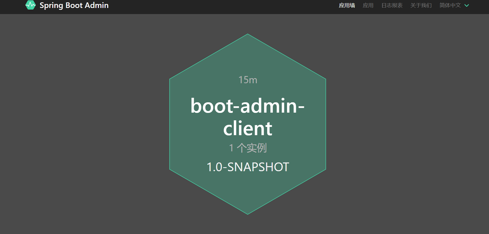


## 给服务端加密码


### 添加依赖


```java
<dependency>
  <groupId>org.springframework.boot</groupId>
  <artifactId>spring-boot-starter-security</artifactId>
</dependency>
```


### application.yaml


```java
server:
  port: 5555

spring:
  application:
    name: springboot-admin-server
  security:
    user:
      name: admin
      password: 123456
```


### 添加配置类


```java
    @Configuration
    public  class SecuritySecureConfig extends WebSecurityConfigurerAdapter {
        private final String adminContextPath;

        public SecuritySecureConfig(AdminServerProperties adminServerProperties) {
            this.adminContextPath = adminServerProperties.getContextPath();
        }

        @Override
        protected void configure(HttpSecurity http) throws Exception {
            // @formatter:off
            SavedRequestAwareAuthenticationSuccessHandler successHandler = new SavedRequestAwareAuthenticationSuccessHandler();
            successHandler.setTargetUrlParameter("redirectTo");
            successHandler.setDefaultTargetUrl(adminContextPath + "/");
            http.authorizeRequests()
                    .antMatchers(adminContextPath + "/assets/**").permitAll()
                    .antMatchers(adminContextPath + "/login").permitAll()
                    .anyRequest().authenticated()
                    .and()
                    .formLogin().loginPage(adminContextPath + "/login").successHandler(successHandler).and()
                    .logout().logoutUrl(adminContextPath + "/logout").and()
                    .httpBasic().and()
                    .csrf()
                    .csrfTokenRepository(CookieCsrfTokenRepository.withHttpOnlyFalse())
                    .ignoringAntMatchers(
                            adminContextPath + "/instances",
                            adminContextPath + "/actuator/**"
                    );
            // @formatter:on
        }
    }
```


### 测试


访问： http://127.0.0.1:5555/login


### 客户端修改


由于服务端配置了密码，客户端访问的时候需要密码，这是基于SBA访问模式，也就是所谓的直接连接springboot admin服务端模式，在application.yml文件中添加username，password


```java
server:
  port: 6666

spring:
  application:
    name: boot-admin-client
  boot:
    admin:
      client:
        url: http://localhost:5555
        instance:
          prefer-ip: true
        username: admin
        password: 123456
#开放端点用于SpringBoot Admin的监控
management:
  endpoints:
    web:
      exposure:
        #开放所有页面节点  默认只开启了health、info两个节点
        include: '*'
  endpoint:
    health:
      #显示健康具体信息  默认不会显示详细信息
      show-details: always

# 利用info端点，加入版本等信息
info:
  app:
    versin: @project.version@
    name: @project.artifactId@
    group: @project.groupId@
    description: @project.description@
    #还可以自定义信息
    author: 小糊涂
    age: 保密

```


### 测试


http://127.0.0.1:5555/instances/c3451f067dbf/details

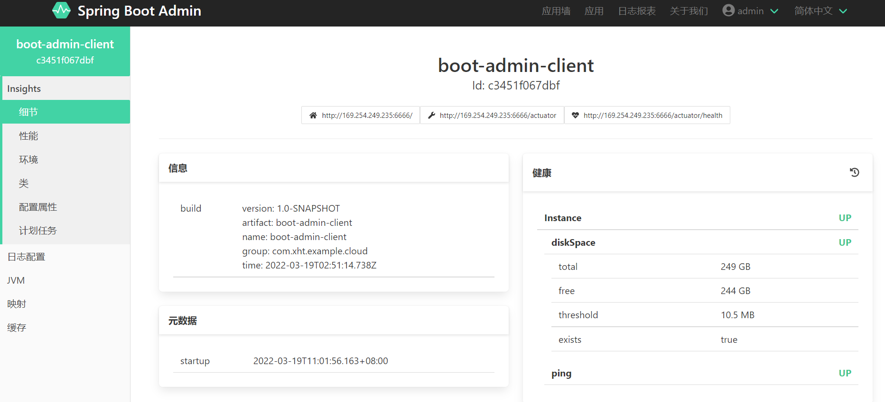


# Eureka


