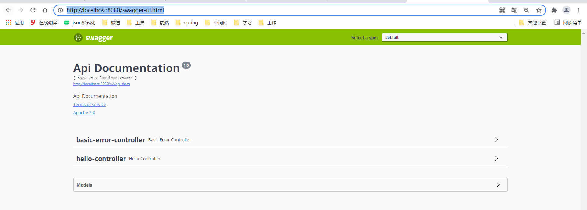
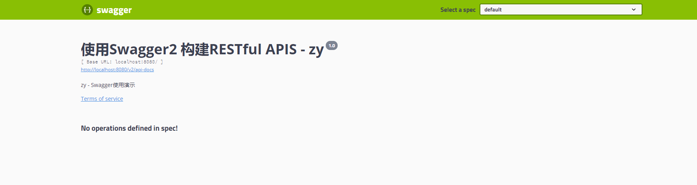
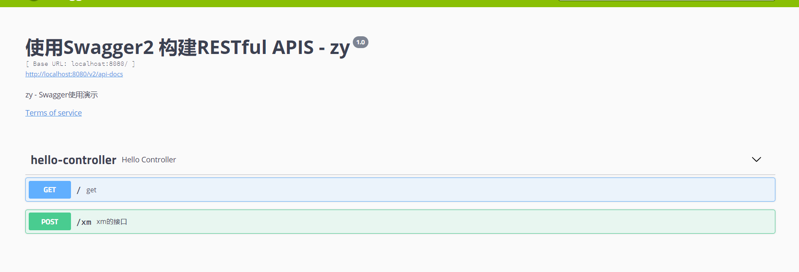

<h1>Swagger</h1>

---------

# 目录

[TOC]


----------


# 一、简介


## 1：前言


相信无论是前端还是后端开发，都或多或少地被接口文档折磨过。前端经常抱怨后端给的接口文档与实际情况不一致。后端又觉得编写及维护接口文档会耗费不少精力，经常来不及更新。其实无论是前端调用后端，还是后端调用后端，都期望有一个好的接口文档。但是这个接口文档对于程序员来说，就跟注释一样，经常会抱怨别人写的代码没有写注释，然而自己写起代码起来，最讨厌的，也是写注释。所以仅仅只通过强制来规范大家是不够的，随着时间推移，版本迭代，接口文档往往很容易就跟不上代码了。

这样，如果按照新的开发模式，在开发新版本或者迭代版本的时候，只需要更新Swagger描述文件，就可以自动生成接口文档和客户端服务端代码，做到调用端代码、服务端代码以及接口文档的一致性。

所以作为Java届服务端的大一统框架Spring，迅速将Swagger规范纳入自身的标准，建立了Spring-swagger项目，后面改成了现在的Springfox。通过在项目中引入Springfox，可以扫描相关的代码，生成该描述文件，进而生成与代码一致的接口文档和客户端代码。这种通过代码生成接口文档的形式，在后面需求持续迭代的项目中，显得尤为重要和高效。


## 2：是什么


Swagger是一个接口文档生成工具，同时提供接口测试调用的辅助功能。

- Swagger 可以生成一个具有互动性的API控制台，开发者可以用来快速学习和尝试API。
- Swagger 可以生成客户端SDK代码用于各种不同的平台上的实现。
- Swagger 文件可以在许多不同的平台上从代码注释中自动生成。
- Swagger 有一个强大的社区，里面有许多强悍的贡献者。
- Swagger 文档提供了一个方法，使我们可以用指定的 JSON 或者 YAML 摘要来描述你的 API，包括了比如 names、order 等 API 信息。

你可以通过一个文本编辑器来编辑 Swagger 文件，或者你也可以从你的代码注释中自动生成。各种工具都可以使用 Swagger 文件来生成互动的 API 文档。


> 注意：用 Swagger 文件生成互动的 API 文档是最精简的，它展示了资源、参数、请求、响应。但是它不会提供你的API如何工作的其他任何一个细节。


## 3：组件


- Swagger spec：这一块对元素的嵌套、命令等采用官方模式。如果你想要对 Swagger 文件手动编码，你必须非常熟悉 Swagger spec。

- Swagger editor：这是在线编辑器，用于验证你的 YML 格式的内容是否违反 Swagger spec 。YML 是一种句法，依赖于空格和嵌套。你需要对 YML 句法很熟悉才能很好的遵守 Swagger spec 规范。Swagger 编辑器会标出错误并且给你格式提醒（Swagger spec 文件可以使用 JSON 或者 YAML 中的任意一种格式）

	 

- Swagger-UI：这是一套 HTML/CSS/JS 框架用于解析遵守 Swagger spec 的 JSON 或 YML 文件，并且生成API文档的UI导航。它可以将你的规格文档转换成Swagger Petsotre-like UI。

- Swagger-codegen：这个工具可以为不同的平台生成客户端 SDK（比如 Java、JavaScript、Python 等）。这些客户端代码帮助开发者在一个规范平台中整合 API ，并且提供了更多健壮的实现，可能包含了多尺度、线程，和其他重要的代码。SDK 是用于支持开发者使用 REST API 的工具。


## 4：SpringFox


使用 Swagger 时如果碰见版本更新或迭代时，只需要更改Swagger 的描述文件即可。但是在频繁的更新项目版本时很多开发人员认为即使修改描述文件（yml 或 json）也是一定的工作负担，久而久之就直接修改代码，而不去修改描述文件了，这样基于描述文件生成接口文档也失去了意义。

Marty Pitt 编写了一个基于 Spring 的组件 swagger-springmvc。Spring-fox 就是根据这个组件发展而来的全新项目。

Spring-fox 是根据代码生成接口文档，所以正常的进行更新项目版本，修改代码即可，而不需要跟随修改描述文件。

Spring-fox 利用自身 AOP 特性，把 Swagger 集成进来，底层还是Swagger。但是使用起来确方便很多。

所以在实际开发中，都是直接使用 spring-fox。


附：官网地址

http://springfox.github.io/springfox/

附：官方源码

https://github.com/springfox/springfox


# 二、HelloWorld


## 1.pom


````java
<!-- https://mvnrepository.com/artifact/io.springfox/springfox-swagger2 -->
<dependency>
   <groupId>io.springfox</groupId>
   <artifactId>springfox-swagger2</artifactId>
   <version>2.9.2</version>
</dependency>
<!-- https://mvnrepository.com/artifact/io.springfox/springfox-swagger-ui -->
<dependency>
   <groupId>io.springfox</groupId>
   <artifactId>springfox-swagger-ui</artifactId>
   <version>2.9.2</version>
</dependency>
````


## 2.controller


```java
@RestController
public class HelloController {

    @GetMapping
    public String get(){
        return "hello world";
    }
}
```


## 3.配置类


```java
/**
 * swagger配置
 */
@Configuration
@EnableSwagger2
public class SwaggerConfig {

}
```


## 4.测试


游览器访问：http://localhost:8080/swagger-ui.html




# 三、配置类模板


```java

/**
 * swagger配置
 */
@Configuration
@EnableSwagger2
public class SwaggerConfig {
    /**
     * 创建API应用
     * apiInfo() 增加API相关信息
     * 通过select()函数返回一个ApiSelectorBuilder实例,用来控制哪些接口暴露给Swagger来展现，
     * 本例采用指定扫描的包路径来定义指定要建立API的目录。
     *
     * @return
     */
    @Bean
    public Docket createRestApi(){
        //版本类型是swagger2
        return new Docket(DocumentationType.SWAGGER_2)
                //通过调用自定义方法apiInfo，获得文档的主要信息
                .apiInfo(apiInfo())
                .select()
                .apis(RequestHandlerSelectors.basePackage("com.example.controller"))//扫描该包下面的API注解
                .paths(PathSelectors.any())
                .build();
    }
    /**
     * 创建该API的基本信息（这些基本信息会展现在文档页面中）
     * 访问地址：http://项目实际地址/swagger-ui.html
     * @return
     */
    private ApiInfo apiInfo() {
        return new ApiInfoBuilder()
                .title("使用Swagger2 构建RESTful APIS - zy") //接口管理文档首页显示
                .description("zy - Swagger使用演示")//API的描述
                .termsOfServiceUrl("www.footmark.top")//网站url等
                .version("1.0")
                .build();
    }
}

```





# 四、常用注解


## 4.1：简介


Swagger的所有注解定义在io.swagger.annotations包下

下面列一些经常用到的，未列举出来的可以另行查阅说明：

| Swagger注解                                            | 简单说明                                             |
| ------------------------------------------------------ | ---------------------------------------------------- |
| @Api(tags = "xxx模块说明")                             | 作用在模块类上                                       |
| @ApiOperation("xxx接口说明")                           | 作用在接口方法上                                     |
| @ApiModel("xxxPOJO说明")                               | 作用在模型类上：如VO、BO                             |
| @ApiModelProperty(value = "xxx属性说明",hidden = true) | 作用在类方法和属性上，hidden设置为true可以隐藏该属性 |
| @ApiParam("xxx参数说明")                               | 作用在参数、方法和字段上，类似@ApiModelProperty      |

我们也可以给请求的接口配置一些注释

```java
@ApiOperation("xm的接口")
@PostMapping("/xm")
@ResponseBody
public String kuang(@ApiParam("这个名字会被返回")String username){
   return username;
}
```





# 五、皮肤


我们可以导入不同的包实现不同的皮肤定义：

## 5.1：默认


1、默认的  **访问 http://localhost:8080/swagger-ui.html**

```java
<dependency>
   <groupId>io.springfox</groupId>
   <artifactId>springfox-swagger-ui</artifactId>
   <version>2.9.2</version>
</dependency>
```


## 5.2：bootstrap-ui


2、bootstrap-ui  **访问 http://localhost:8080/doc.html**

```java
<!-- 引入swagger-bootstrap-ui包 /doc.html-->
<dependency>
   <groupId>com.github.xiaoymin</groupId>
   <artifactId>swagger-bootstrap-ui</artifactId>
   <version>1.9.1</version>
</dependency>
```


## 5.3：Layui-ui


Layui-ui  **访问 http://localhost:8080/docs.html**

```java
<!-- 引入swagger-ui-layer包 /docs.html-->
<dependency>
   <groupId>com.github.caspar-chen</groupId>
   <artifactId>swagger-ui-layer</artifactId>
   <version>1.1.3</version>
</dependency>
```


## 5.4：mg-ui


4、mg-ui  **访问 http://localhost:8080/document.html**

```java
<!-- 引入swagger-ui-layer包 /document.html-->
<dependency>
   <groupId>com.zyplayer</groupId>
   <artifactId>swagger-mg-ui</artifactId>
   <version>1.0.6</version>
</dependency>
```


