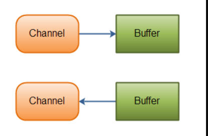
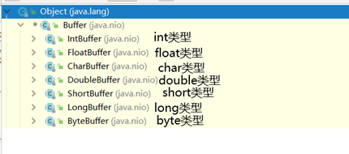
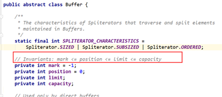
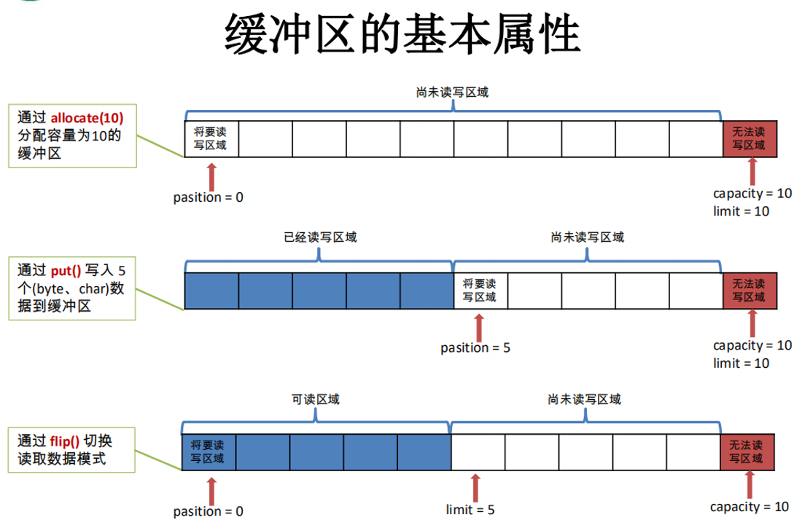

> # BIO
>

# 目录

[TOC]


# 一、简介


**Java NIO（New IO）是从Java 1.4版本开始引入的 一个新的IO API，可以替代标准的Java IO API。NIO与原来的IO有同样的作用和目的，但是使用的方式完全不同，NIO支持面向`缓冲区`的、基于`通道的`IO操作。NIO将以更加高效的方式进行文件的读写操作。**`


# 二、  IO与NIO的区别


## 1.区别

| Io模型 | IO               | NIO                                |
| ------ | ---------------- | ---------------------------------- |
| 通信   | 面向流(乡村公路) | 面向缓冲区(高速公路，多路复用技术) |
| 处理   | 阻塞IO(多线程)   | 非阻塞IO(反应堆Reactor)            |
| 触发   | (无)             | 选择器(Selectors)                  |
| 方式   | 从硬盘到内存     | 从内存到硬盘                       |


## 2.面向流与面向缓冲


Java NIO和IO之间第一个最大的区别是，I**O是面向流的.NIO是面向缓冲区的**。

**Java IO面向流**意味着毎次从流中读一个成多个字节，直至读取所有字节，它们没有被缓存在任何地方，此外，它不能前后移动流中的数据。如果需要前后移动从流中读取的教据，需要先将它缓存到一个缓冲区。

**Java NIO的缓冲导向方法略有不同**。数据读取到一个它稍后处理的缓冲区，需要时可在缓冲区中前后移动。这就增加了处理过程中的灵活性。但是，还需要检查是否该缓冲区中包含所有您需要处理的数裾。而且，需确保当更多的数据读入缓冲区时，不要覆盖缓冲区里尚未处理的数据。


## 3.阻塞与非阻塞


**Java IO的各种流是阻塞的。**这意味着，当一个线程调用read() 或 write()时，该线程被阻塞，直到有一些数据被读取，或数据完全写入。该线程在此期间不能再干任何事情了。 

**Java NIO的非阻塞模式，**使一个线程从某通道发送请求读取数据，但是它仅能得到目前可用的数据，如果目前没有数据可用时，就什么都不会获取。而不是保持线程阻塞，所以直至数据变的可以读取之前，该线程可以继续做其他的事情。 非阻塞写也是如此。一个线程请求写入一些数据到某通道，但不需要等待它完全写入，这个线程同时可以去做别的事情。 线程通常将非阻塞IO的空闲时间用于在其它通道上执行IO操作，所以一个单独的线程现在可以管理多个输入和输出通道（channel）。


# 三、 通道与缓冲区


Java NIO系统的核心在于**：通道(Channel)和缓冲区（Buffer)**。通道表示打开到 IO 设备(例如：文件、套接字)的连接。若需要使用 NIO 系统，需要获取用于连接 IO 设备的通道以及用于容纳数据的缓冲区。然后操作缓冲区，对数据进行处理。

简而言之，Channel 负责传输， Buffer 负责存储。




# 四、缓冲区


## 1.简介

**上面我们了解到Buffer是一个负责存储的缓冲区。**

1、缓冲区（Buffer）：一个用于特定基本数据类型的容器。由 java.nio 包定义的，所有缓冲区都是 Buffer 抽象类的子类。





2、Java NIO 中的 Buffer 主要用于与 NIO 通道进行交互，数据是从通道读入缓冲区，从缓冲区写入通道中的


## 2.Buffer的基本属性


我们查看Buffer的源码中有四个属性：




| 属性                                                         | 作用                                                         |
| :----------------------------------------------------------- | ------------------------------------------------------------ |
| `capacity(容量) `<font color='white'> -----------------------------------------------------------------------------------------------------------------------------------</font> | 表示当前Buffer最大的数据容量，缓冲区容量不能为负数并且创建过后不可以修改。 |
| ` limit(限制、界限)  `                                       | 第一个不应该读取或者写入的数据的索引，即位于limit后的数据不可以读写。缓冲区的限制不能为负数，且不可以超过容量。 |
| ` Position(下次数据读取/写入的索引)  `                       | 下一个要读取或者写入数据的索引。索引不能为负数，且不能大于limit； |
| ` 标记 (mark)与重置 (reset)  `                               | 标记是一个索引，通过Buffer中的mark()方法指定Buffer中一个特定的position，之后可以调用reset()方法恢复到这个position；**(相当于一个书签，简单就是来说，通过make方式来记录一下postion的数值，之后嗲用reset方法来恢复到这个位置。)** |

​		

## 3.常用方法


| 方 法                                     | 描 述                                                     |
| ----------------------------------------- | --------------------------------------------------------- |
| static ByteBuffer  allocate(int capacity) | 创建一个容量为 capacity 的 XxxBuffer 对象                 |
| Buffer clear()                            | 清空缓冲区并返回对缓冲区的引用                            |
| Buffer flip()                             | 将缓冲区的界限设置为当前位置，并将当前位置充值为 0        |
| int capacity()                            | 返回 Buffer 的 capacity 大小                              |
| boolean hasRemaining()                    | 判断缓冲区中是否还有元素                                  |
| int limit()                               | 返回 Buffer 的界限(limit) 的位置                          |
| Buffer limit(int n)                       | 将设置缓冲区界限为 n, 并返回一个具有新 limit 的缓冲区对象 |
| Buffer mark()                             | 对缓冲区设置标记                                          |
| int position()                            | 返回缓冲区的当前位置 position                             |
| Buffer position(int  n)                   | 将设置缓冲区的当前位置为 n , 并返回修改后的 Buffer 对象   |
| int remaining()                           | 返回 position 和 limit 之间的元素个数                     |
| Buffer reset()                            | 将位置 position 转到以前设置的 mark 所在的位置            |
| Buffer rewind()                           | 将位置设为为 0，  取消设置的 mark                         |


## 4.图文


> **看图如果看不懂那么我们去看代码OK**，再看图




## 5.代码


```java
/*
Buffer 就像一个数组，可以保存多个相同类型的数据。根
据数据类型不同(boolean 除外) ，有以下 Buffer 常用子类：
 ByteBuffer
 CharBuffer
 ShortBuffer
 IntBuffer
 LongBuffer
 FloatBuffer
 DoubleBuffer
上述 Buffer 类 他们都采用相似的方法进行管理数据，只是各自
管理的数据类型不同而已。都是通过如下方法获取一个 Buffer
对象：
static XxxBuffer allocate(int capacity) : 创建一个容量为 capacity 的 XxxBuffer 对象
 */
public class TestBuffer {
    /**
     * 重要属性
     */
    @Test
    public void test1() {
        System.out.println("=============//分配一个1024的容量的缓冲区=============");
        ByteBuffer byteBuffer = ByteBuffer.allocate(1024);
        System.out.println("缓冲区的总容量  capacity："+byteBuffer.capacity());
        System.out.println("限制的大小  limit:"+byteBuffer.limit());
        System.out.println("下次读取的索引位置  position："+byteBuffer.position());
        System.out.println("\n=============//通过put()方法来存储数据=============\n");
        byteBuffer.put("abcde".getBytes());
        System.out.println("缓冲区的总容量  capacity："+byteBuffer.capacity());
        System.out.println("限制的大小  limit:"+byteBuffer.limit());
        System.out.println("下次读取的索引位置  position："+byteBuffer.position());
        System.out.println("\n=============//通过flip()切换读取数据模式=============\n");
        byteBuffer.flip();
        System.out.println("缓冲区的总容量  capacity："+byteBuffer.capacity());
        System.out.println("限制的大小  limit:"+byteBuffer.limit());
        System.out.println("下次读取的索引位置  position："+byteBuffer.position());
        System.out.println("\n=============//通过get()方法来获取数据=============\n");
        byte[] bytes = new byte[byteBuffer.limit()];
        byteBuffer.get(bytes);
        System.out.println(new String(bytes,0,bytes.length));
        System.out.println("缓冲区的总容量  capacity："+byteBuffer.capacity());
        System.out.println("限制的大小  limit:"+byteBuffer.limit());
        System.out.println("下次读取的索引位置  position："+byteBuffer.position());
        System.out.println("\n=============//rewind()方法来重新开始读取数据=============\n");
        byteBuffer.rewind();
        System.out.println("缓冲区的总容量  capacity："+byteBuffer.capacity());
        System.out.println("限制的大小  limit:"+byteBuffer.limit());
        System.out.println("下次读取的索引位置  position："+byteBuffer.position());
        System.out.println("\n=============//clear()方法来清空缓存区=============\n");
        byteBuffer.clear();
        System.out.println("缓冲区的总容量  capacity："+byteBuffer.capacity());
        System.out.println("限制的大小  limit:"+byteBuffer.limit());
        System.out.println("下次读取的索引位置  position："+byteBuffer.position());
        //注意：虽然清空缓冲区，但是数据确是没有被清空，他是处在一个被遗忘的状态
        System.out.println((char) byteBuffer.get(0));
        System.out.println("//===============================测试maker和reset\n");
        ByteBuffer allocate = ByteBuffer.allocate(1024);
        allocate.put("abcdefg".getBytes());
        allocate.flip();
        byte[] bytes1 = new byte[allocate.limit()];
        allocate.get(bytes1,0, 2);
        System.out.println(new String(bytes1,0,bytes1.length));
        allocate.get(bytes1,0, 2);
        System.out.println(new String(bytes1,0,bytes1.length));
        System.out.println(allocate.position());
        allocate.mark();
        allocate.get(bytes1,0, 2);
        System.out.println(new String(bytes1,0,bytes1.length));
        System.out.println(allocate.position());
        allocate.reset();
        System.out.println(allocate.position());
        allocate.get(bytes1,0, 2);
        System.out.println(new String(bytes1,0,bytes1.length));  
    }     
}
```


# 五、直接和非直接缓冲区1	


## 1.直接缓冲区


通过


```java
public static ByteBuffer allocateDirect(int capacity)
```

创建的缓冲区

**在JVM内存外开辟内存**，在每次调用基础操作系统的一个本机IO之前或者之后，虚拟机都会避免将缓冲区的内容复制到中间缓冲区（或者从中间缓冲区复制内容），缓冲区的内容驻留在物理内存内，会少一次复制过程，如果需要循环使用缓冲区，用直接缓冲区可以很大地提高性能。虽然直接缓冲区使JVM可以进行高效的I/O操作，但它使用的内存是操作系统分配的，绕过了JVM堆栈，**建立和销毁比堆栈上的缓冲区要更大的开销。**


## 2.非直接缓冲区


通过

```java
public static ByteBuffer allocate(int capacity)
```

创建的缓冲区，**在JVM中内存中创建，**在每次调用基础操作系统的一个本机IO之前或者之后，虚拟机都会将缓冲区的内容复制到中间缓冲区（或者从中间缓冲区复制内容），**缓冲区的内容驻留在JVM内，因此销毁容易，但是占用JVM内存开销，处理过程中有复制操作。**

<font color='red'>非直接缓冲区写入步骤：</font> 

**1.创建一个临时的直接ByteBuffer对象。**

 **2.将非直接缓冲区的内容复制到临时缓冲中。**

 **3.使用临时缓冲区执行低层次I/O操作。**

 **4.临时缓冲区对象离开作用域，并最终成为被回收的无用数据。**


## 3.区别


> **字节缓冲区要么是直接的，要么是非直接的。如果为直接字节缓冲区，则` Java 虚拟机`会尽最大努力直接在此缓冲区上执行`本机 I/O 操作`。也就是说，在每次调用基础操作系统的一个本机	之前（或之后），虚拟机都会尽量避免将缓冲区的内容复制到中间缓冲区中（或从中间缓冲区中复制内容）。**
>
> **直接字节缓冲区可以通过调用此类的 `allocateDirect() 工`厂方法来创建。此方法返回的缓冲区进行分配和取消分配所需成本通常高于非直接缓冲区。直接缓冲区的内容可以驻留在常规的垃圾回收堆之外，因此，它们对应用程序的内存需求量造成的影响可能并不明显。所以，建议将直接缓冲区主要分配给那些易受基础系统的本机` I/O 操作`影响的大型、持久的缓冲区。一般情况下，最好仅在直接缓冲区能在程序性能方面带来明显好处时分配它们。**
>
> **直接字节缓冲区还可以通过` FileChannel` 的 `map() 方法` 将文件区域直接映射到内存中来创建。该方法返回`MappedByteBuffer `。 `Java `平台的实现有助于通过 `JNI `从本机代码创建直接字节缓冲区。如果以上这些缓冲区中的某个缓冲区实例指的是`不可访问的内存区域`，则试图访问该区域不会更改该缓冲区的内容，并且将会在访问期间或稍后的某个时间导致抛出不确定的异常。**
>
> **字节缓冲区是直接缓冲区还是非直接缓冲区可通过调用其` isDirect(`) 方法来确定。提供此方法是为了能够在性能关键型代码中执行显式缓冲区管理。**


## 4.代码


```java
/**
 * ByteBuffer.allocate(1024)创建的是非直接缓冲区
 *  ByteBuffer.allocateDirect(1024)创建的是直接缓冲区
 *
 *  非直接缓冲区：他是由jvm内存来进行的
 *  直接缓冲区：在JVM内存外开辟内存
 */
@Test
public void test2() {
    ByteBuffer allocate1 = ByteBuffer.allocate(1024);
    ByteBuffer allocate2 = ByteBuffer.allocateDirect(1024);
    boolean direct = allocate1.isDirect();
    if (direct) {
        System.out.println("直接缓冲区");
    } else {
        System.out.println("非直接缓冲区");
    }
    direct = allocate2.isDirect();
    if (direct) {
        System.out.println("直接缓冲区");
    } else {
        System.out.println("非直接缓冲区");
    }
}
```


# 六、Files/Path/Paths


## 1.简介


- Paths：通过get()方法返回一个Path对象，Path用于表示文件路径和文件。
- Files：提供了大量处理文件的方法，例如文件复制、读取、写入，获取文件属性、快捷遍历文件目录等.....
- Files 和 Paths是Java8新增的工具类，在处理文件方面功能非常强大。


## 2.Paths/Path类


> **Paths类获取文件或文件目录路径可以使用采用多个字符串形式，也可以使用Path.get(D:\\ReviewIO\\URL)这种形式。返回的Path对象完全可以代替File类用于文件IO操作。**


```java
	//以当前路径作为Path对象
        Path p = Paths.get(".");
        //使用传入的字符串返回一个Path对象
        Path p2 = Paths.get("D","ReviewIO","URL");
        //对应的路径
        System.out.println("p对象的对应路径：" + p.toString());
        System.out.println("p2对象的对应路径：" + p2.toString());
        //路径数量是以路径名的数量作为标准
        System.out.println("p路径数量：" + p.getNameCount());
        System.out.println("p2路径数量：" + p2.getNameCount());        
        //获取绝对路径
        System.out.println("p绝对路径：" + p.toAbsolutePath());
        System.out.println("p2绝对路径：" + p2.toAbsolutePath());
        //获取父路径
        System.out.println("p父路径："  + p.getParent());
        System.out.println("p2父路径：" + p2.getParent());
        //获取p2对象的文件名或者文件目录名
        System.out.println(p2.getFileName());
        //通过Path对象返回一个分隔符对象
        Spliterator<Path> split = p2.spliterator();
```

## 3.Files类


> #### Files完成文件复制的方法，方法很简单。


```java
	Path source = Paths.get("F:","Java经典练习题.pdf");
		Path dest = Paths.get("F:","files.txt");
		File f = new File("F:\\ok.pdf");
		f.createNewFile();//如果f对象对应路径不存在就创建一个。	
		System.out.println("source对象的文件路径：" + source);
		//复制文件
		Files.copy(source, new FileOutputStream(f));
```


> #### Files完成写入文件的方法


```java
//写入内容到文件
		ArrayList<String> as = new ArrayList<>();
		as.add("A");
		as.add("B");
		as.add("C");
		Files.write(dest, as, Charset.forName("GBK"));
```

- 实例说明：个人觉得用起来不怎么方便。方法参数很多，尤其是Iterable<? extends CharSequence>参数，Iterable是个顶级接口，实现类几乎都是集合类，并且限制了类型通配符上限是CharSequence，这意味着要使用泛型为字符类型的集合类作为数据写入指定文件中，很麻烦。
- 如果只是简单写入内容到文件中，**建议使用重定向标准输出流，然后使用打印流写入，简单粗暴。**


## 4.Path


### 


# 七、通道


## 1.简介


通道（Channel）：由` java.nio.channels` 包定义的。Channel 表示 IO 源与目标打开的连接。Channel 类似于传统的“流”。只不过 Channel本身不能直接访问数据，`Channel `只能与`Buffer `进行交互。

**简单的来说就是：**山西有煤，我们想要，于是乎建了一条铁路连通到山西，这**条铁路就是这里的`Channel,`**那么煤通过什么运过来呢？

铁路建好了，就差火车了，因此这里的火车就像是缓冲区，火车把山西的煤运到这边来，把我们这里的钱运过去，这样双向传输就愉快的完成了。


## 2.CPU调用IO


我们最早期的电脑中是由cpu来分发操作的

> 如下图：我们发现电脑中的io接口由cpu来进行分发操作，如果当我们的操作的流变大的时候，我们的CPU暂用率就会变得格外大。


## 3.DMA(直接IO的存储)


**DMA 传输将数据从一个地址空间复制到另外一个地址空间**。当`CPU 初始化`这个传输动作，传输动作本身是由 `DMA 控制器`来实行和完成。典型的例子就是移动一个外部内存的区块到芯片内部更快的内存区。像是这样的操作并没有让处理器工作拖延，反而可以被重新排程去处理其他的工作。**DMA 传输对于高效能 嵌入式系统算法和网络是很重要的**。

在实现DMA传输时，是`由DMA控制器直接掌管总线`，因此，**存在着一个总线控制权转移问题**。即DMA传输前，CPU要把总线控制权交给DMA控制器，而在结束DMA传输后，DMA控制器应立即把总线控制权再交回给CPU。一个完整的DMA传输过程必须经过`DMA请求`、`DMA响应`、`DMA传输`、`DMA结束`4个步骤。


> <font color='red'>**注意：我们java的io流，他有一个致命缺点，有大量的io接口申请调用，cup会开始分配dma总线，造成资源的流失。**</font>


## 3.通道


> **它是一个完全独立的存在，能更好的利用cpu的资源;**

~~简单的说我可以不管你CPU/内存等问题无所谓~~


## 4.通道具体简介


> 1、通道：主要就是在源缓冲区和目标缓冲区之间传输数据的通路，用于I/O操作的连接，代表数据到硬件设备、文件、网络套接字的连接。
>
> 2、缓冲区是将数据进行打包，而通道是将数据进行传输。
>
> 3、缓冲区都是类，而通道都是接口。
>
> 4、Channel接口继承了Closeable接口（关闭I/O流，释放系统资源），Closeable接口继承了AutoCloseable接口。
>
> 5、JDK1.8中，Channel接口具有11个子接口，主要的实现类是FileChannel、SocketChannel、ServerSocketChannel
>
> 6、chianl是完全不存储数据的，他必须和缓冲区配合使用；


## 5.主要实现类


| className             | Message                                                      |
| --------------------- | ------------------------------------------------------------ |
| `FileChannel`         | 用于读取、写入、映射和操作文件的通道。                       |
| `DatagramChannel`     | 通过UDP读写网络中的数据通道。                                |
| `SocketChannel`       | 通过tcp读写网络中的数据。                                    |
| `ServerSocketChannel` | 可以监听新进来的tcp连接，对每一个连接都创建一个SocketChannel。 |


## 6.通过getChinal方法获取


> FileInputStream/FileOutputStream，RandomAccessFile，Socket，ServerSocket ，DatagramSocket


```java
    public static void main(String[] args) throws FileNotFoundException {
        FileInputStream fileInputStream = new FileInputStream("");
        FileChannel inputStreamChannel = fileInputStream.getChannel();
        FileOutputStream fileOutputStream = new FileOutputStream("");
        FileChannel outputStreamChannel = fileOutputStream.getChannel();
        RandomAccessFile randomAccessFile = new  RandomAccessFile("","");
        FileChannel channel = randomAccessFile.getChannel();
        Socket socket = new Socket();
        SocketChannel channel1 = socket.getChannel();
    }
```


## 7.通过静态方法open（）


```java
  public static void main(String[] args) throws IOException {
        FileChannel open = FileChannel.open(Paths.get(""), StandardOpenOption.READ,StandardOpenOption.SYNC);
        FileChannel open1 = FileChannel.open(Paths.get(""), StandardOpenOption.WRITE, StandardOpenOption.CREATE_NEW);
    }
```