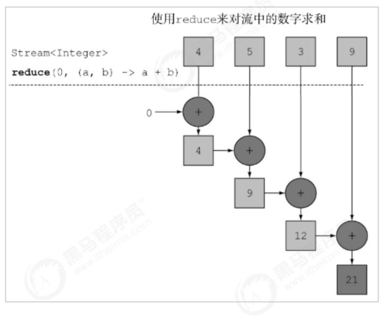

<h1>JDK1.8新特性</h1>

# 目录

[TOC]


# 一、简介


## 1.1：新增加的内容


jdk8增加了很多东西，大致分为以下几种吧(可能不全)

- **Lambda表达式**
- **函数式接口**
- **方法引用和构造器调用**
- **Stream API**
- **接口中的默认方法和静态方法**
- **新时间日期API**


## 1.2：HashMap新机制


在jdk1.8中对hashMap等map集合的数据结构优化。hashMap数据结构的优化原来的hashMap采用的数据结构是哈希表（数组+链表），hashMap默认大小是16，一个0-15索引的数组，如何往里面存储元素，首先调用元素的hashcode方法，计算出哈希码值，经过哈希算法算成数组的索引值，如果对应的索引处没有元素，直接存放，如果有对象在，那么比较它们的equals方法比较内容如果内容一样，后一个value会将前一个value的值覆盖，如果不一样，在1.7的时候，后加的放在前面，形成一个链表，形成了碰撞，在某些情况下如果链表无限下去，那么效率极低，碰撞是避免不了的加载因子：0.75，数组扩容，达到总容量的75%，就进行扩容，但是无法避免碰撞的情况发生在1.8之后，在数组+链表+红黑树来实现hashmap，当碰撞的元素个数大于8时 & 总容量大于64，会有红黑树的引入除了添加之后，效率都比链表高，1.8之后链表新进元素加到末尾ConcurrentHashMap (锁分段机制)concurrentLevel,jdk1.8采用CAS算法(无锁算法，不再使用锁分段)，数组+链表中也引入了红黑树的使用


# 二、Lambda表达式


## 2.1：为什么使用


- 在Java中，我们无法将函数作为参数传递给一个方法，也无法声明返回一个函数的方法, 也无法声明返回一个函数的方法,
- 在JavaScript中，函数参数是一个函数，返回值是 另一个函数的情况是非常常见的; JavaScript是-门非常典型的函数式语言.


## 2.2：Lambda表达式作用


- Lambda表达式为Java添加了缺失的函数式编程特性，使我们能将函数当做一等公民看待
- 在将函数作为一等公民的语言中，Lambda表达式的类型是函数。但在Java中，Lambda表达式是对象，他们必须依附于一类特别的对象类型------>函数式接口(functional interface).


## 2.3：匿名内部类(例子)


### 1.以前的书写


```java
    public static void main(String[] args) {
        Thread thread = new Thread(new Runnable() {
            @Override
            public void run() {
                for (int i = 0; i < 100; i++) {
                    System.out.println(i);
                }
            }
        });
    }
```


### 2.使用Lambda表达式


```java
   public static void main(String[] args) {
        new  Thread(()->{
            for (int i = 0; i < 100; i++) {
                System.out.println(i);
            }
        });
    }
```


## 2.4：Lambda表达式格式


### 1.简介


```java
(参数列表) -> {}

(参数列表)： 参数列表，可有可无
{}: 方体体
->: 没有实际意义起到连接作用   
```


###  2.无参无返回值


```java
@FunctionalInterface
interface MyInterFace1 {
    void test1();
}

public class Test2 {
    public static void main(String[] args) {
        fun1(()->{
            System.out.println("-----------------方法执行了---------------");
        });
    }

    public static void fun1(MyInterFace1 myInterFace) {
        myInterFace.test1();
    }
}
```


### 3.一个参数无返回值


```java
@FunctionalInterface
interface MyInterFace {
    void test1(String name);
}

public class Test2 {
    public static void main(String[] args) {
           //这里的参数都是自定义的，只是这样写代码看起来更舒服
        fun1((String name)->{
            System.out.println("------------方法执行了----------"+name);
        });
        //可以不指定类型
        fun1((name)->{
            System.out.println("------------方法执行了----------"+name);
        });
        //可以省略写
        fun1(name->{
            System.out.println("------------方法执行了----------"+name);
        });
    }

    public static void fun1(MyInterFace myInterFace) {
        myInterFace.test1("admin");
    }
}
```


### 4.多个参数无返回值


```java
@FunctionalInterface
interface MyInterFace {
    void test1(String name,int age,Double price);
}
public class Test2 {
    public static void main(String[] args) {
        //这里的参数都是自定义的，只是这样写代码看起来更舒服
        fun1((name,age,price) -> {
            System.out.println(name+"===="+age+"===="+price);
        });
    }
    public static void fun1(MyInterFace myInterFace) {
        myInterFace.test1("admin",10,20D);
    }
}
```


### 5.一个参数有返回值


```java
@FunctionalInterface
interface MyInterFace {
    String test1(String name);
}

public class Test2 {
    public static void main(String[] args) {
        fun1(name -> {
           return name;
        });
    }

    public static void fun1(MyInterFace myInterFace) {
        myInterFace.test1("admin");
    }
}
```


### 6.多个参数切有返回值


```java
@FunctionalInterface
interface MyInterFace {
    String test1(String name,String name2);
}

public class Test2 {
    public static void main(String[] args) {
        fun1((name,name2) -> {
           return name+name2;
        });
    }

    public static void fun1(MyInterFace myInterFace) {
        System.out.println(myInterFace.test1("admin", "sd"));
    }
}
```


### 2.5：总结


Lmabda表达式的语法总结： () -> ();

| 前置                                       | 语法                                                 |
| ------------------------------------------ | ---------------------------------------------------- |
| 无参数无返回值                             | () -> System.out.println(“Hello WOrld”)              |
| 有一个参数无返回值                         | (x) -> System.out.println(x)                         |
| 有且只有一个参数无返回值                   | x -> System.out.println(x)                           |
| 有多个参数，有返回值，有多条lambda体语句   | (x，y) -> {System.out.println(“xxx”);return xxxx;}； |
| 有多个参数，有返回值，只有一条lambda体语句 | (x，y) -> xxxx                                       |


口诀：左右遇一省括号，左侧推断类型省

注：当一个接口中存在多个抽象方法时，如果使用lambda表达式，并不能智能匹配对应的抽象方法，因此引入了函数式接口的概念


## 2.5：Lambda省略


1.在Lambda标准格式的基础上，使用省略写法的规则为:1.小括号内参数的类型可以省略

2.如果小括号内有且仅有一个参数，则小括号可以省略

3.如果大括号内有且仅有一个语句，可以同时省略大括号、return关键字及语句分号


> 省略前


```java
(int a) -> {return new Person();}
```


> 省略后


```java
 a -> return new Person()
```


> 案例


```java
   public static void main(String[] args) {
        List<Integer> lists = new ArrayList<>();
        lists.add(1);
        lists.add(2);
        lists.add(3);
        lists.add(4);
        lists.add(5);
        Collections.sort(lists, new Comparator<Integer>() {
            @Override
            public int compare(Integer o1, Integer o2) {
                return o2 - o1;
            }
        });
        Collections.sort(lists, (o1, o2) -> {
            return o1 - o2;
        });
        Collections.sort(lists, (o1, o2) -> o1 - o2 );
        System.out.println(lists);
    }
```


## 2.6：附:(接收可变参数)


```java
@FunctionalInterface
interface MyInterFace {
    String test1(Object ...name);
}

public class Test2 {
    public static void main(String[] args) {
        fun1((name) -> {
            for (int i = 0; i < name.length; i++) {
                System.out.println(name[i].getClass());
            }
            return "";
        });

    }

    public static void fun1(MyInterFace myInterFace) {
        System.out.println(myInterFace.test1("admin", "sd",1,232));
    }
}
```


## 2.7：Lamdba与内部类对比


1.匿名内部类可以为任意接口创建实例，不管接口中包含多少个抽象方法，只要在匿名内部类中实现所有抽象方法即可。但在lambda表达式中只能为函数式接口创建实例。

2.匿名内部类可以为抽象类甚至普通类创建实例；但lambda表达式只能为函数式接口创建实例。

3.匿名内部类实现的抽象方法可以允许调用接口中定义默认方法。但lambda表达式的代码块不允许调用接口中定义默认方法。

4.内部类生成class文件与Lamdba不一样


## 2.8：自定义Lamdba接口


### 1.FunctionalInterface注解


我们前面的练习当中已经发现了这个`@FunctionalInterface`注解，他的官方解释：

```java
/**
 * An informative annotation type used to indicate that an interface
 * type declaration is intended to be a <i>functional interface</i> as
 * defined by the Java Language Specification.
 *
 * Conceptually, a functional interface has exactly one abstract
 * method.  Since {@linkplain java.lang.reflect.Method#isDefault()
 * default methods} have an implementation, they are not abstract.  If
 * an interface declares an abstract method overriding one of the
 * public methods of {@code java.lang.Object}, that also does
 * <em>not</em> count toward the interface's abstract method count
 * since any implementation of the interface will have an
 * implementation from {@code java.lang.Object} or elsewhere.
 */
```

通过JDK8源码javadoc，可以知道这个注解有以下特点：

1、该注解只能标记在"有且仅有一个抽象方法"的接口上。

2、JDK8接口中的[静态方法和默认方法]()，都不算是抽象方法。

3、接口默认继承java.lang.Object，所以如果接口显示声明覆盖了Object中方法，那么也不算抽象方法。

4、该注解不是必须的，如果一个接口符合"函数式接口"定义，那么加不加该注解都没有影响。加上该注解能够更好地让编译器进行检查。如果编写的不是函数式接口，但是加上了@FunctionInterface，那么编译器会报错。

5、@FunctionalInterface标记在接口上，“函数式接口”是指仅仅只包含一个抽象方法的接口。

6、如果一个接口中包含不止一个抽象方法，那么不能使用@FunctionalInterface，编译会报错。


### 2.正确的Lamdba接口


```java
// 正确的函数式接口
@FunctionalInterface
public interface TestInterface {
    
    // 抽象方法
    public void sub();
 
    // java.lang.Object中的方法不是抽象方法
    public boolean equals(Object var1);
 
    // default不是抽象方法
    public default void defaultMethod(){
 
    }
 
    // static不是抽象方法
    public static void staticMethod(){
 
    }
}
```


## 2.9：接口方法的更改


jdk1.8之前我们的接口只能写方法接口的名称，不能写其他的方法，但是呢，jdk1.8之后可以写default修饰的方法，这种方法叫做`默认方法`，另一种是static修饰的方法叫做`静态方法`


```java
// 正确的函数式接口
public interface TestInterface {
    // default不是抽象方法
    public default void defaultMethod(){
    }
    // static不是抽象方法
    public static void staticMethod(){
    }
}
```


# 三、常用内置函数式接口


## 3.1：内置函数接口的由来


我们知道使用Lambda表达式的前提是需要有函数式接口。而Lambda使用时不关心接口名，抽象方法名，只关心抽象方法的参数列表和返回值类型。因此为了让我们使用Lambda方便，JDK提供了大量常用的函数式接口。

```java
public class Test3 {
    public static void main(String[] args) {
        Test3.test1((arr) -> {
            int num = 0;
            for (int i = 0; i < arr.length; i++) {
                num+=arr[i];
            }
            return num;
        });

    }
	//我们这里只关心参数的传入和返回值
    public static void test1(Number number) {
        System.out.println(number.sum(new int[]{1, 2, 4, 5, 6, 7}));
    }
}

interface Number {
    int sum(int arr[]);
}
```


## 3.2：函数式接口


函数式接口有很多，他们都在`java.util.function`包下，当然jdk8之前的一些接口现在也支持


```java
java.lang.Runnable
java.util.concurrent.Callable
java.security.PrivilegedAction
java.util.Comparator
java.io.FileFilter
java.nio.file.PathMatcher
java.lang.reflect.InvocationHandler
java.beans.PropertyChangeListener
java.awt.event.ActionListener
javax.swing.event.ChangeListener
```


`java.util.function` 它包含了很多类，用来支持 Java的 函数式编程，该包中的函数式接口有：

| 序号 | 接口 & 描述                                                  |
| :--- | :----------------------------------------------------------- |
| 1    | **BiConsumer<T,U>**代表了一个接受两个输入参数的操作，并且不返回任何结果 |
| 2    | **BiFunction<T,U,R>**代表了一个接受两个输入参数的方法，并且返回一个结果 |
| 3    | **BinaryOperator<T>**代表了一个作用于于两个同类型操作符的操作，并且返回了操作符同类型的结果 |
| 4    | **BiPredicate<T,U>**代表了一个两个参数的boolean值方法        |
| 5    | **BooleanSupplier**代表了boolean值结果的提供方               |
| 6    | **Consumer<T>**代表了接受一个输入参数并且无返回的操作        |
| 7    | **DoubleBinaryOperator**代表了作用于两个double值操作符的操作，并且返回了一个double值的结果。 |
| 8    | **DoubleConsumer**代表一个接受double值参数的操作，并且不返回结果。 |
| 9    | **DoubleFunction<R>**代表接受一个double值参数的方法，并且返回结果 |
| 10   | **DoublePredicate**代表一个拥有double值参数的boolean值方法   |
| 11   | **DoubleSupplier**代表一个double值结构的提供方               |
| 12   | **DoubleToIntFunction**接受一个double类型输入，返回一个int类型结果。 |
| 13   | **DoubleToLongFunction**接受一个double类型输入，返回一个long类型结果 |
| 14   | **DoubleUnaryOperator**接受一个参数同为类型double,返回值类型也为double 。 |
| 15   | **Function<T,R>**接受一个输入参数，返回一个结果。            |
| 16   | **IntBinaryOperator**接受两个参数同为类型int,返回值类型也为int 。 |
| 17   | **IntConsumer**接受一个int类型的输入参数，无返回值 。        |
| 18   | **IntFunction<R>**接受一个int类型输入参数，返回一个结果 。   |
| 19   | **IntPredicate**：接受一个int输入参数，返回一个布尔值的结果。 |
| 20   | **IntSupplier**无参数，返回一个int类型结果。                 |
| 21   | **IntToDoubleFunction**接受一个int类型输入，返回一个double类型结果 。 |
| 22   | **IntToLongFunction**接受一个int类型输入，返回一个long类型结果。 |
| 23   | **IntUnaryOperator**接受一个参数同为类型int,返回值类型也为int 。 |
| 24   | **LongBinaryOperator**接受两个参数同为类型long,返回值类型也为long。 |
| 25   | **LongConsumer**接受一个long类型的输入参数，无返回值。       |
| 26   | **LongFunction<R>**接受一个long类型输入参数，返回一个结果。  |
| 27   | **LongPredicate**R接受一个long输入参数，返回一个布尔值类型结果。 |
| 28   | **LongSupplier**无参数，返回一个结果long类型的值。           |
| 29   | **LongToDoubleFunction**接受一个long类型输入，返回一个double类型结果。 |
| 30   | **LongToIntFunction**接受一个long类型输入，返回一个int类型结果。 |
| 31   | **LongUnaryOperator**接受一个参数同为类型long,返回值类型也为long。 |
| 32   | **ObjDoubleConsumer<T>**接受一个object类型和一个double类型的输入参数，无返回值。 |
| 33   | **ObjIntConsumer<T>**接受一个object类型和一个int类型的输入参数，无返回值。 |
| 34   | **ObjLongConsumer<T>**接受一个object类型和一个long类型的输入参数，无返回值。 |
| 35   | **Predicate<T>**接受一个输入参数，返回一个布尔值结果。       |
| 36   | **Supplier<T>**无参数，返回一个结果。                        |
| 37   | **ToDoubleBiFunction<T,U>**接受两个输入参数，返回一个double类型结果 |
| 38   | **ToDoubleFunction<T>**接受一个输入参数，返回一个double类型结果 |
| 39   | **ToIntBiFunction<T,U>**接受两个输入参数，返回一个int类型结果。 |
| 40   | **ToIntFunction<T>**接受一个输入参数，返回一个int类型结果。  |
| 41   | **ToLongBiFunction<T,U>**接受两个输入参数，返回一个long类型结果。 |
| 42   | **ToLongFunction<T>**接受一个输入参数，返回一个long类型结果。 |
| 43   | **UnaryOperator<T>**接受一个参数为类型T,返回值类型也为T。    |


## 3.3：常用-Supplier


### 1.简介


`java.util.function.Supplier<T>`接口，它意味着==“供给”==，对应的Lambda表达式需要“**对外提供**”一个符合泛型的对象数据。

我们通过调用里面的`get方法`来返回我们需要的数据类型。

```java
@FunctionalInterface
public interface Supplier<T> {
    T get();
}
```


+ Supplier中文翻译就是供应商,对应到java中就是用来提供结果的,其功能类似一个工厂,可以不断的创建对象
+ Supplier里面只有一个 T get()方法。


### 2.案例


**求数据最大值**


```java
public class SupplierTest {
    public static void main(String[] args) {
        maxNumber(()->{
            int[] arrs = {2,3,234};
            Arrays.sort(arrs);
            return arrs[arrs.length-1];
        });
    }
    public static void  maxNumber(Supplier<Integer> supplier){
        System.out.println(supplier.get());
    }
}
```


## 3.4：常用-Consumer


### 1.简介


`java.util.function.Consumer<T>`接口，它是恰恰的相反，他不是生产一个数据，而是**消费**一个数据，其数据类型由泛型参数决定。

他有两个方法：

| method                                         | message                                                      |
| ---------------------------------------------- | ------------------------------------------------------------ |
| Consumer<T>                                    | 我们消费的方法，有参无返回的接口                             |
| Consumer<T> andThen(Consumer<? super T> after) | 如果一个方法的参数和返回值全都是Consumer，那么就可以实现效果：消费一个数据的时候，首先做一个操作，然后再做一个操作，实现组合。而现在这个方法就是`Consumer`接口中的default方法`andThen`。 |


```java
@FunctionalInterface
public interface Consumer<T> {

    void accept(T t);

    default Consumer<T> andThen(Consumer<? super T> after) {
        Objects.requireNonNull(after);
        return (T t) -> { accept(t); after.accept(t); };
    }
}
```


### 2.案例1


**字符串变大写**


```java
public class ConsumerTest {
    public static void main(String[] args) {
        stringCase((str) -> {
            System.out.println(str.toUpperCase());
        });
    }

    public static void stringCase(Consumer<String> consumer) {
        consumer.accept("Hello World");
    }

}
```


### 3.案例2


**字符串变大写再变小写**


```java
public class ConsumerTest {
    public static void main(String[] args) {
        stringCase((str) -> {
            System.out.println(str.toUpperCase());
        },(str)->{
            System.out.println(str.toLowerCase());
        });
        stringCase2((str) -> {
            System.out.println(str.toUpperCase());
        },(str)->{
            System.out.println(str.toLowerCase());
        });
    }
    public static void stringCase(Consumer<String> consumer1, Consumer<String> consumer2) {
              //看这里
        consumer1.accept("Hello World");
        consumer2.accept("Hello World");
    }
    public static void stringCase2(Consumer<String> consumer1, Consumer<String> consumer2) {
        //看这里
       consumer1.andThen(consumer2);
    }
}
```


## 3.5：常用-Function


### 1.简介


`java.util.function.Function<T>`接口用来根据一个类型的数据得到另一个类型的数据，前者称为前置条件，后者成为后置条件。有参数有返回值。他的泛型`T`就是参数类型，`R`就是返回值类型。


```java
@FunctionalInterface
public interface Function<T, R> {

    R apply(T t);

    default <V> Function<V, R> compose(Function<? super V, ? extends T> before) {
        Objects.requireNonNull(before);
        return (V v) -> apply(before.apply(v));
    }

    default <V> Function<T, V> andThen(Function<? super R, ? extends V> after) {
        Objects.requireNonNull(after);
        return (T t) -> after.apply(apply(t));
    }

    static <T> Function<T, T> identity() {
        return t -> t;
    }
}

```


### 2.案例1


**字符串转成数字**


```java
public class FunctionTest {
    public static void main(String[] args) {

        test1((parms) -> {
            return Integer.parseInt(parms);
        });
        test2((parms) -> {
            return Integer.parseInt(parms);
        },(parms)->{
            System.out.println("parms"+parms);
            return parms;
        });
    }

    public static void test1(Function<String, Integer> function1) {
        Integer apply = function1.apply("10");
        System.out.println(apply);
    }

    public static void test2(Function<String, Integer> function1, Function<String, String> function2) {
        System.out.println("=============");
        function1.compose(function2).apply("213");
        System.out.println("=============");
    }

    public static void test3(Function<String, Integer> function1, Function<Integer, Integer> function2) {
        function1.andThen(function2);
    }
}
```


## 3.6：常用-Predicate


### 1.简介


`java.util.function.Predicate<T>`接口：有的时候我们需要对某种类型的数据进行判断，从而得到一个boolean值的结果。这个时候就可以是使用这个`java.util.function.Predicate<T>`接口。


```java
@FunctionalInterface
public interface Predicate<T> {
    /**
     * 具体过滤操作 需要被子类实现.
     * 用来处理参数T是否满足要求,可以理解为 条件A
     */
    boolean test(T t);
    /**
     * 调用当前Predicate的test方法之后再去调用other的test方法,相当于进行两次判断
     * 可理解为 条件A && 条件B
     */
    default Predicate<T> and(Predicate<? super T> other) {
        Objects.requireNonNull(other);
        return (t) -> test(t) && other.test(t);
    }
    /**
     * 对当前判断进行"!"操作,即取非操作，可理解为 ! 条件A
     */
    default Predicate<T> negate() {
        return (t) -> !test(t);
    }
    /**
     * 对当前判断进行"||"操作,即取或操作,可以理解为 条件A ||条件B
     */
    default Predicate<T> or(Predicate<? super T> other) {
        Objects.requireNonNull(other);
        return (t) -> test(t) || other.test(t);
    }

    /**
     * 对当前操作进行"="操作,即取等操作,可以理解为 A == B
     */
    static <T> Predicate<T> isEqual(Object targetRef) {
        return (null == targetRef)
                ? Objects::isNull
                : object -> targetRef.equals(object);
    }
}
```


### 2.案例


```java
public class PredicateTest {
    public static void main(String[] args) {
        test(name->{
            return name.contains("h");
        });
    }
    public static void test(Predicate<String> predicate){
        boolean test = predicate.test("hello world");
        System.out.println(test);
    }
}
```


# 四、方法引用


## 4.1：求数组中数值合


```java
public class Demo11MethodRefIntro {
    static   int[] arr = {10, 20, 30, 40, 50};
    public static void getMax(int[] arr) {
        int sum = 0;
        for (int n : arr) {
            sum += n;
        }
        System.out.println(sum);
    }
    public static void main(String[] args) {
        printMax((int[] arr) -> {
            getMax(arr);
        });
        //简化lamdba表达式
        printMax(Demo11MethodRefIntro::getMax);
    }
    private static void printMax(Consumer<int[]> consumer) {

        consumer.accept(arr);
    }
}
```


> 请注意其中的双冒号 `::` 写法，这被称为`“方法引用”`，是一种新的语法。
>
> + **方法引用的格式**
>   + **符号表示** **:** `::`
>   + **符号说明** **:** 双冒号为方法引用运算符，而它所在的表达式被称为**方法引用**。
>   + **应用场景** **:** 如果Lambda所要实现的方案 , 已经有其他方法存在相同方案，那么则可以使用方法引用。


## 4.2：引用种类


> 方法引用在JDK 8中使用方式相当灵活，有以下几种形式：


| name                        | message                        |
| --------------------------- | ------------------------------ |
| instanceName::methodName    | 对象::方法名                   |
| ClassName::staticMethodName | 类名::静态方法                 |
| ClassName::methodName       | 类名::普通方法                 |
| ClassName::new              | 类名::new 调用的构造器         |
| TypeName[]::new             | String[]::new 调用数组的构造器 |


## 4.3：对象名::引用成员方法


这是最常见的一种用法，与上例相同。如果一个类中已经存在了一个成员方法，则可以通过对象名引用成员方法，代码为


```java
  @Test
    public void test1() {
        UUID uuid = UUID.randomUUID();
        Supplier<String> supplier = () -> {
            return uuid.toString();
        };
        //使用对象名::引用成员方法
        Supplier<String> supplier2 = uuid::toString;
        System.out.println(supplier.get());
        System.out.println(supplier2.get());
    }
```


方法引用的注意事项

1. 被引用的方法，参数要和接口中抽象方法的参数一样

2. 当接口抽象方法有返回值时，被引用的方法也必须有返回值


## 4.4：类名::引用静态方法


由于在 java.lang.System 类中已经存在了静态方法 currentTimeMillis ，所以当我们需要通过Lambda来调用该方法时,可以使用方法引用 , 写法是：


```java
    @Test
    public void test02() {
        Supplier<Long> supp = () -> {
            return System.currentTimeMillis();
        };
        System.out.println(supp.get());
        // 类名::静态方法
        Supplier<Long> supp2 = System::currentTimeMillis;
        System.out.println(supp2.get());
    }
```


## 4.5：类名::引用实例方法


Java面向对象中，类名只能调用静态方法，类名引用实例方法是有前提的，实际上是拿第一个参数作为方法的调用者。


```java
    // 类名::实例方法
    @Test
    public void test03() {
        Function<String, Integer> f1 = (s) -> {
            return s.length();
        };
        System.out.println(f1.apply("abc"));
        Function<String, Integer> f2 = String::length;
        System.out.println(f2.apply("abc"));
        BiFunction<String, Integer, String> bif = String::substring;
        String hello = bif.apply("hello", 2);
        System.out.println("hello = " + hello);
    }
```


## 4.6：类名::new引用构造器


由于构造器的名称与类名完全一样。所以构造器引用使用 类名称::new 的格式表示。首先是一个简单的 Person 类：

```java
public class Person {
    private String name;
    private Integer age;

    public Person(String name, Integer age) {
        this.name = name;
        this.age = age;
    }
    public Person() {

    }
 //get、set   
}   
```


要使用这个函数式接口，可以通过方法引用传递：


```java
// 类名::new
@Test
 public void test04() {
        Supplier<Person> sup = () -> {
            return new Person();
        };
        System.out.println(sup.get());
        Supplier<Person> sup2 = Person::new;
        System.out.println(sup2.get());
      BiFunction<String, Integer, Person> fun2 = Person::new;
        System.out.println(fun2.apply("张三", 18));
}
```


## 4.7：数组::new引用数组构造器


数组也是 Object 的子类对象，所以同样具有构造器，只是语法稍有不同。


```java
    // 类型[]::new
    @Test
    public void test05() {
        Function<Integer, String[]> fun = (len) -> {
            return new String[len];
        };
        String[] arr1 = fun.apply(10);
        System.out.println(arr1 + ", " + arr1.length);
        Function<Integer, String[]> fun2 = String[]::new;
        String[] arr2 = fun.apply(5);
        System.out.println(arr2 + ", " + arr2.length);
    }
```


## 4.8：小结


方法引用是对Lambda表达式符合特定情况下的一种缩写，它使得我们的Lambda表达式更加的精简，也可以理解为Lambda表达式的缩写形式 , 不过要注意的是方法引用只能"引用"已经存在的方法!


# 五、Stream流(一)


## 5.1：简介


+ Stream与IO无任何关系。
+ Java 8 中的Stream是对集合 (Collection) 对象功能的增强, 他专注于对集合对象进行各种非常便利，高效的聚合操作(aggregate operation), 或者大批量数据操作 (bulk data operation).
+ Stream API借助于同样新出现的Lambda 表达式, 极大的提高编程效率和程序可读性. 同时他提供穿行和并行两种模式进行汇聚操作, 并发模式能够成分利用多核处理器的优势, 使用fork/join 并行法师来拆分任务和加速处理过程.
+ 通常编写并行代码很难而且容易出错, 但使用Stream API无需编写一行多线程的代码, 就可以很方便地写出高性能的并发代码.
+ Java 8中首次出现的java.util.stream是一个函数式语言+多核时代综合影响的产物.


## 5.2：集合处理数据的弊端


当我们需要对集合中的元素进行操作的时候，除了必需的添加、删除、获取外，最典型的就是集合遍历。我们来体验集合操作数据的弊端，需求如下：


### 1.需求


```c
一个ArrayList集合中存储有以下数据:张无忌,周芷若,赵敏,张强,张三丰 
需求:
    1.拿到所有姓张的 
    2.拿到名字长度为3个字的
    3.打印这些数据
```


### 2.代码


```java
public class ListTest {
    public static void main(String[] args) {
        // 一个ArrayList集合中存储有以下数据:张无忌,周芷若,赵敏,张强,张三丰
        ArrayList<String> list = new ArrayList<>();
        Collections.addAll(list, "张无忌", "周芷若", "赵敏", "张强", "张三丰");
        // 1.拿到所有姓张的
        ArrayList<String> zhangList = new ArrayList<>(); // {"张无忌", "张强", "张三丰"}
        for (String name : list) {
            if (name.startsWith("张")) {
                zhangList.add(name);
            }
        }
        // 2.拿到名字长度为3个字的
        ArrayList<String> threeList = new ArrayList<>();// {"张无忌", "张三丰"}
        for (String name : zhangList) {
            if (name.length() == 3) {
                threeList.add(name);
            }
        }
        // 3.打印这些数据
        for (String name : threeList) {
            System.out.println(name);
        }
    }
}
```


### 3.弊端


这段代码中含有三个循环，每一个作用不同：

1. 首先筛选所有姓张的人；

2. 然后筛选名字有三个字的人；

3. 最后进行对结果进行打印输出。

每当我们需要对集合中的元素进行操作的时候，总是需要进行循环、循环、再循环。这是理所当然的么？**不是。**循环是做事情的方式，而不是目的。每个需求都要循环一次，还要搞一个新集合来装数据，如果希望再次遍历，只能再使用另一个循环从头开始。那Stream能给我们带来怎样更加优雅的写法呢？


### 4.初次体验stram


```java
public class Demo03StreamFilter {
    public static void main(String[] args) {
        List<String> list = new ArrayList<>();
        list.add("张一");
        list.add("周二");
        list.add("赵二");
        list.add("张22");
        list.add("张三");
        list.stream().filter(s -> s.startsWith("张")).filter(s -> s.length() == 3).forEach(System.out::println);
    }
}
```


## 5.3：获取stram流


### 1.Collection获取流


首先，` java.util.Collection` 接口中加入了``default`方法` stream` 用来获取流，所以其所有实现类均可获取流。


> 源码


```java
public interface Collection { 
  /**
     * Returns a sequential {@code Stream} with this collection as its source.
     *
     * <p>This method should be overridden when the {@link #spliterator()}
     * method cannot return a spliterator that is {@code IMMUTABLE},
     * {@code CONCURRENT}, or <em>late-binding</em>. (See {@link #spliterator()}
     * for details.)
     *
     * @implSpec
     * The default implementation creates a sequential {@code Stream} from the
     * collection's {@code Spliterator}.
     *
     * @return a sequential {@code Stream} over the elements in this collection
     * @since 1.8
     */
    default Stream<E> stream() {
        return StreamSupport.stream(spliterator(), false);
    }
}
```


> 如何获取


```java
    public static void main(String[] args) {
        List<String> list = new ArrayList<>();
        Stream<String> stream1 = list.stream();
        Set<String> set = new HashSet<>();
        Stream<String> stream2 = set.stream();
        Vector<String> vector = new Vector<>();
        Stream<String> stream3 = vector.stream();
        // Map获取流
        Map<String, String> map = new HashMap<>();
        // ...
        Stream<String> keyStream = map.keySet().stream();
        Stream<String> valueStream = map.values().stream();
        Stream<Map.Entry<String, String>> entryStream = map.entrySet().stream();
    }
```


### 2.Stream中的静态方法of获取流


由于数组对象不可能添加默认方法，所以 Stream 接口中提供了静态方法` of `，使用很简单：

> 备注： of 方法的参数其实是一个可变参数，所以支持数组。


```java
    public static void main(String[] args) {
        // Stream中的静态方法:           static Stream of(T... values)
        Stream<String> stream6 = Stream.of("aa", "bb", "cc");
        String[] arr = {"aa", "bb", "cc"};
        Stream<String> stream7 = Stream.of(arr);
        Integer[] arr2 = {11, 22, 33};
        Stream<Integer> stream8 = Stream.of(arr2);
        // 注意:基本数据类型的数组不行,如下，它会将整个数组看成一个数据，不是里面的数据
        int[] arr3 = {11, 22, 33};
        Stream<int[]> stream9 = Stream.of(arr3);
    }
```


### 3、其他创建方法


**Stream里提供了一个generate() 方法可以创建流**，把 Supplier 实例传递给 Stream.generate() 方法会生成的 Stream。由于这种方法创建的流是无限的，在管道中，必须利用 limit 之类的操作限制 Stream 大小。

**生成 10 个随机整数：**

```java
public static void main(String[] args) {
       Stream stream =  Stream.generate(new Random()::nextInt).limit(10)；
       //整数更建议用IntStream
       IntStream intstream =   IntStream.generate(new Random()::nextInt).limit(10)；
    }
```


**Stream里提供了一个iterate () 方法也可以创建流**，iterate 接受一个种子值，和一个一元操作符（例如 f）。然后种子值成为 Stream 的第一个元素，f(seed) 为第二个，f(f(seed)) 第三个，以此类推。

如生成一个等差数列：

```java
Stream stream = Stream.iterate(0, n -> n + 3).limit(10) //0 3 6 9 12 15 18 21 24 27 
```


与 Stream.generate 相仿，在 iterate 时候管道必须有 limit 这样的操作来限制 Stream 大小。否则也是一个无限流。


## 5.4：常用方法、注意事项


### 1.常用方法


Stream流模型的操作很丰富，这里介绍一些常用的API。这些方法可以被分成两种：


| 方法名  | 方法作用   | 返回值类型 | 方法种类 |
| ------- | ---------- | ---------- | -------- |
| count   | 统计个数   | long       | 终结     |
| forEach | 逐一处理   | void       | 终结     |
| filter  | 过滤       | Stream     | 函数拼接 |
| limit   | 取用前几个 | Stream     | 函数拼接 |
| skip    | 跳过前几个 | Stream     | 函数拼接 |
| map     | 映射       | Stream     | 函数拼接 |
| concat  | 组合       | Stream     | 函数拼接 |


**终结方法**：返回值类型不再是 Stream 类型的方法，不再支持链式调用。本小节中，终结方法包括 count 和 forEach 方法。

**非终结方法**：返回值类型仍然是 Stream 类型的方法，支持链式调用。（除了终结方法外，其余方法均为非终结方法。）


> <font color='red'>备注：本小节之外的更多方法，请自行参考API文档。</font >


### 2.Stream注意事项(重要)


1. Stream只能操作一次

2. Stream方法返回的是新的流

3. Stream不调用终结方法，中间的操作不会执行


## 5.5：forEach方法


`forEach `用来遍历流中的数据


```java
void forEach(Consumer<? super T> action);
```


该方法接收一个 Consumer 接口函数，会将每一个流元素交给该函数进行处理。例如：


```java
    @Test
    public  void  testForEach(){
        List<Integer> list = new ArrayList<>();
        list.add(Math.round(2));
        list.add(Math.round(2));
        list.add(Math.round(2));
        list.add(Math.round(2));
        list.add(Math.round(2));
        list.stream().forEach(item->{
            System.out.println(item);
        });
        //简写
        list.stream().forEach(item->System.out.println(item));
        //再次简写
        list.stream().forEach(System.out::println);
    }
```


## 5.6：count方法


Stream流提供 `count` 方法来统计其中的元素个数：


```java
long count();
```


该方法返回一个long值代表元素个数。基本使用：


```java
    @Test
    public  void  testCount(){
        List<Integer> list = new ArrayList<>();
        list.add(Math.round(2));
        list.add(Math.round(2));
        list.add(Math.round(2));
        list.add(Math.round(2));
        list.add(Math.round(2));
        System.out.println(list.stream().count());//5
    }
```


## 5.7：filter方法


`fifilter`用于过滤数据，返回符合过滤条件的数据，可以通过 filter 方法将一个流转换成另一个子集流。方法声明：


```java
Stream<T> filter(Predicate<? super T> predicate);
```


该接口接收一个 `Predicate `函数式接口参数（可以是一个Lambda或方法引用）作为筛选条件。

`Stream`流中的 `filter `方法基本使用的代码如：


```java
    @Test
    public  void  testFilter(){
        List<Integer> list = new ArrayList<>();
        list.add(20);
        list.add(30);
        list.add(1);
        list.add(5);
        list.add(15);
        list.stream().filter(item->item>=10).forEach(System.out::println);//筛选出大于等于10的数值
        /**
        打印结果：
        		20
        		30
        		15
        **/
    }
```


## 5.8：limit方法


`limit` 方法可以对流进行截取，只取用前n个。方法签名：


```java
Stream<T> limit(long maxSize);
```


参数是一个long型，如果集合当前长度大于参数则进行截取。否则不进行操作。基本使用：


```java
    @Test
    public  void  testLimit(){
        List<Integer> list = new ArrayList<>();
        list.add(20);
        list.add(30);
        list.add(1);
        list.add(5);
        list.add(15);
        list.stream().limit(2).forEach(System.out::println);
        /*打印结果：
                    20  
                    30
        */
    }
```


## 5.9：skip方法


如果希望跳过前几个元素，可以使用 skip 方法获取一个截取之后的新流：


```java
Stream<T> skip(long n);
```


如果流的当前长度大于n，则跳过前n个；否则将会得到一个长度为0的空流。基本使用：


```java
   @Test
    public void testSkip() {
        List<Integer> list = new ArrayList<>();
        list.add(20);
        list.add(30);
        list.add(1);
        list.add(5);
        list.add(15);
        list.stream().skip(2).forEach(System.out::println);
        /**
        打印结果：
        		1
        		5
        		15
        **/
    }
```


## 5.10：map方法


如果需要将流中的元素映射到另一个流中，可以使用 map 方法。方法签名：


```java
<R> Stream<R> map(Function<? super T, ? extends R> mapper);
```


该接口需要一个 Function 函数式接口参数，可以将当前流中的T类型数据转换为另一种R类型的流。

Stream流中的 map 方法基本使用的代码如：


```java
    @Test
    public void testMap() {
        Stream<String> original = Stream.of("11", "22", "33");
      /*  original.map((item) -> {
            return Integer.parseInt(item);
        }).forEach(System.out::println);
        //简写
        original.map(item ->
                Integer.parseInt(item)
        ).forEach(System.out::println);*/
        //再次简写
        original.map(Integer::parseInt).forEach(System.out::println);
    }
```


# 六、Stream流(二)


## 6.1：sorted方法


如果需要将数据排序，可以使用 sorted 方法。方法签名：


```java
Stream<T> sorted();
Stream<T> sorted(Comparator<? super T> comparator);
```


**基本使用**

Stream流中的 sorted 方法基本使用的代码如：


```java
   @Test
    public void testSorted() {
        List<Integer> list = new ArrayList<>();
        list.add(20);
        list.add(30);
        list.add(1);
        list.add(5);
        list.add(15);
        list.stream().sorted().forEach(System.out::println);//按照自然顺序排序
        System.out.println("=====================");
        list.stream().sorted((o1, o2) -> o2 - o1).forEach(System.out::println);//自定义比较器
        /**
         * 打印结果
         1
        ................
         30
         =====================
         30
         ................
         1
         */
    }
```


## 6.2：distinct方法


如果需要去除重复数据，可以使用 distinct 方法。方法签名：


```java
Stream<T> distinct();
```


**基本使用**

Stream流中的 distinct 方法基本使用的代码如：


```java
    @Test
    public void testDistinct() {
        List<Integer> list = new ArrayList<>();
        list.add(20);
        list.add(20);
        list.add(10);
        list.add(10);
        list.add(5);
        list.stream().distinct().forEach(System.out::println);
        /**
         * 打印结果
         20
         10
         5
         */
    }
```


> **如何自定义去重**


```java
    @Test
    public void testDistinct2() {
        Stream.of(new Person("刘德华", 58),
                new Person("张学友", 56),
                new Person("张学友", 56),
                new Person("黎明", 52)).distinct().forEach(System.out::println);
        /**
         Person{name='刘德华', age=58}
         Person{name='张学友', age=56}
         Person{name='黎明', age=52}
         */
    }
}
```


自定义对象需要重写`hashcode`和`equals`方法


```java
public class Person {
    private String name;
    private Integer age;

    public Person(String name, Integer age) {
        this.name = name;
        this.age = age;
    }
    public Person() {

    }

    @Override
    public boolean equals(Object o) {
        if (this == o) return true;
        if (o == null || getClass() != o.getClass()) return false;
        Person person = (Person) o;
        return Objects.equals(name, person.name) &&
                Objects.equals(age, person.age);
    }

    @Override
    public int hashCode() {
        return Objects.hash(name, age);
    }

    @Override
    public String toString() {
        return "Person{" +
                "name='" + name + '\'' +
                ", age=" + age +
                '}';
    }

    public Integer getAge() {
        return age;
    }

    public void setAge(Integer age) {
        this.age = age;
    }

    public String getName() {
        return name;
    }

    public void setName(String name) {
        this.name = name;
    }
}

```


## 6.3：match方法


如果需要判断数据是否匹配指定的条件，可以使用 Match 相关方法。方法签名：


```java
boolean allMatch(Predicate<? super T> predicate);// 元素是否全部满足条件
boolean anyMatch(Predicate<? super T> predicate);// 元素是否任意有一个满足条件
boolean noneMatch(Predicate<? super T> predicate);// 元素是否全部不满足条件
```


**基本使用**

Stream流中的 Match 相关方法基本使用的代码如:


```java
    @Test
    public void testMatch() {
        System.out.println(Stream.of(5, 3, 6, 1).allMatch(e -> e > 0)); // allMatch: 元素是否全部满足条件
        System.out.println(Stream.of(5, 3, 6, 1).anyMatch(e -> e > 5));// anyMatch: 元素是否任意有一个满足条件
        System.out.println(Stream.of(5, 3, 6, 1).noneMatch(e -> e > 5)); // noneMatch: 元素是否全部不满足条件
    }
```


## 6.4：find方法


如果需要找到某些数据，可以使用 find 相关方法。方法签名：


```java
Optional<T> findFirst();
Optional<T> findAny();
```


这两个方法一模一样，无区别


**基本使用**

Stream流中的 find 相关方法基本使用的代码如：


```java
    @Test
    public void testFind() {
        Optional<Integer> first = Stream.of(5, 3, 6, 1).findFirst();
        System.out.println("first = " + first.get());
        Optional<Integer> any = Stream.of(5, 5, 6, 1).findAny();
        System.out.println("any = " + any.get());
    }
/**
打印结果：
        first = 5
        any = 5
**/
```


## 6.5：max和min方法


如果需要获取`最大`和`最小`值，可以使用 `max `和 `min `方法。方法签名：


```java
Optional<T> max(Comparator<? super T> comparator); 
Optional<T> min(Comparator<? super T> comparator);
```


这两个方法都可以获取最大最小值，主要区别在于我们自定义比较器,通过我们的比较器排序后获取到第一个值


**基本使用**

Stream流中的 `max `和 `min `相关方法基本使用的代码如：


```java
   @Test
    public void testMax_Min() {
        Optional<Integer> max1 = Stream.of(5, 3, 6, 1).max((o1, o2) -> o1 - o2);
        Optional<Integer> max2 = Stream.of(5, 3, 6, 1).min((o1, o2) -> o2 - o1);
        System.out.println("max1 = " + max1.get());
        System.out.println("max2 = " + max2.get());

        Optional<Integer> min1 = Stream.of(5, 3, 6, 1).max((o1, o2) -> o2 - o1);
        Optional<Integer> min2 = Stream.of(5, 3, 6, 1).min((o1, o2) -> o1 - o2);
        System.out.println("min1 = " + min1.get());
        System.out.println("min2 = " + min2.get());
        /**
        max1 = 6
        max2 = 6
        min1 = 1
        min2 = 1
        **/
    }
```


## 6.6：reduce方法


如果需要将所有数据归纳得到一个数据，可以使用 reduce 方法。方法签名：


```java
T reduce(T identity, BinaryOperator<T> accumulator);//参数数据具体处理方式
T reduce(T identity, BinaryOperator<T> accumulator);//第一个参数是默认值，第二个值是数据具体处理方式
```


**基本使用**

Stream流中的 reduce 相关方法基本使用的代码如：


```java
   @Test
    public void testReduce() {
        List<Integer> list = new ArrayList<>();
        list.add(20);
        list.add(20);
        list.add(10);
        list.add(10);
        list.add(5);
        Optional<Integer> reduce1 = list.stream().reduce((x, y) -> {
            System.out.println("x=" + x + ",y=" + y);
            return x * y;
        });
        System.out.println(reduce1.get());
        System.out.println("===============");
        Integer reduce2 = list.stream().reduce(0, (x, y) -> {
            System.out.println("x=" + x + ",y=" + y);
            return x + y;
        });
        System.out.println(reduce2);
    }
/**
x=20,y=20
x=400,y=10
x=4000,y=10
x=40000,y=5
200000
===============
x=0,y=20
x=20,y=20
x=40,y=10
x=50,y=10
x=60,y=5
65 
**/
```




## 6.7：map和reduce组合使用


```java
 @Test
    public void testMapReduce() {
        // 求出所有年龄的总和
        int totalAge = Stream.of(
                new Person("刘德华", 58),
                new Person("张学友", 56),
                new Person("郭富城", 54),
                new Person("黎明", 52)
        ).map((p) -> p.getAge()).reduce(0, (x, y) -> x + y);
        System.out.println("totalAge = " + totalAge);
        // 找出最大年龄
        int maxAge = Stream.of(
                new Person("刘德华", 58),
                new Person("张学友", 56),
                new Person("郭富城", 54),
                new Person("黎明", 52)
        ).map((p) -> p.getAge()).reduce(0, (x, y) -> x > y ? x : y);
        System.out.println("maxAge = " + maxAge);
        // 统计 数字2 出现的次数
        int count = Stream.of(1, 2, 2, 1, 3, 2).map(i -> {
            if (i == 2) {
                return 1;
            } else {
                return 0;
            }
        }).reduce(0, Integer::sum);
        System.out.println("count = " + count);
    }
```


## 6.8：concat方法


如果有两个流，希望合并成为一个流，那么可以使用 Stream 接口的静态方法 concat ： 


```java
    @Test
    public void testContact() {
        Stream<String> streamA = Stream.of("张三","李四");
        Stream<String> streamB = Stream.of("王麻子");
        Stream<String> result = Stream.concat(streamA, streamB);
        result.forEach(System.out::println);
    }
    /**
    打印结果
    **/
```


## 6.9：总和案例


现在有两个 ArrayList 集合存储队伍当中的多个成员姓名，要求使用传统的for循环（或增强for循环）**依次**进行以下若干操作步骤：

1. 第一个队伍只要名字为3个字的成员姓名；

2. 第一个队伍筛选之后只要前3个人；

3. 第二个队伍只要姓张的成员姓名；

4. 第二个队伍筛选之后不要前2个人；

5. 将两个队伍合并为一个队伍；

6. 根据姓名创建 Person 对象；

7. 打印整个队伍的Person对象信息。


```java
import java.util.ArrayList;
import java.util.Arrays;
import java.util.List;

public class DemoArrayListNames {
    public static void main(String[] args) {
        List<String> one = Arrays.asList("迪丽热巴", "宋远桥", "苏星河", "老子", "庄子", "孙子", "洪七公");
        List<String> two = Arrays.asList("古力娜扎", "张无忌", "张三丰", "赵丽颖", "张二狗", "张天爱", "张三");
        // 第一个队伍只要名字为3个字的成员姓名；
        List<String> oneA = new ArrayList<>();
        for (String name : one) {
            if (name.length() == 3) {
                oneA.add(name);
            }
        }
        System.out.println(oneA.size());
        // 第一个队伍筛选之后只要前3个人；
        List<String> oneB = new ArrayList<>();
        for (int i = 0; i < 3; i++) {
            oneB.add(oneA.get(i));
        }
        // 第二个队伍只要姓张的成员姓名；
        List<String> twoA = new ArrayList<>();
        for (String name : two) {
            if (name.startsWith("张")) {
                twoA.add(name);
            }
        }
        // 第二个队伍筛选之后不要前2个人；
        List<String> twoB = new ArrayList<>();
        for (int i = 2; i < twoA.size(); i++) {
            twoB.add(twoA.get(i));
        }
        // 将两个队伍合并为一个队伍；
        List<String> totalNames = new ArrayList<>();
        totalNames.addAll(oneB);
        totalNames.addAll(twoB);
        // 根据姓名创建Person对象；
        List<Person> totalPersonList = new ArrayList<>();
        for (String name : totalNames) {
            totalPersonList.add(new Person(name));
        }
        // 打印整个队伍的Person对象信息。
        for (Person person : totalPersonList) {
            System.out.println(person);
        }
    }
}
```


# 七、Stream流(三)


## 7.1：转数组


### 1.转换成Object数组


```java
    @Test
    public  void  test2(){
        Stream<String> stream = Stream.of("上单","中单","射手","辅助","打野");
        Object[] objects = stream.toArray();
        Arrays.asList(objects).forEach(item-> System.out.println(item));
    }
```


### 2.转换成指定类型的数组中


```java
    @Test
    public  void  test2(){
        Stream<String> stream = Stream.of("上单","中单","射手","辅助","打野");
        String[] objects = stream.toArray(String[]::new);
        Arrays.asList(objects).forEach(item-> System.out.println(item));
    }
```


## 7.2：转List集合


### 1.转成List集合


```java
    @Test
    public void test3() {
        Stream<String> stream = Stream.of("上单", "中单", "射手", "辅助", "打野");
        List<String> collect = stream.collect(Collectors.toList());
        collect.forEach(System.out::println);
    }
```


### 2.转成指定list类型


```java
  @Test
    public void test4() {
        Stream<String> stream = Stream.of("上单", "中单", "射手", "辅助", "打野");
        ArrayList<String> collect1 = stream.collect(Collectors.toCollection(ArrayList::new));
        LinkedList<String> collect2 = collect1.stream().collect(Collectors.toCollection(LinkedList::new));
        collect1.forEach(System.out::println);
        collect2.forEach(System.out::println);
    }
```


## 7.3：转set集合


### 1.转成set集合


```java
    @Test
    public void test5() {
        Stream<String> stream = Stream.of("上单", "中单", "射手", "辅助", "打野");
        Set<String> collect = stream.collect(Collectors.toSet());
        collect.forEach(System.out::println);
    }
```


### 2.转成指定set类型


```java
    @Test
    public void test6() {
        Stream<String> stream = Stream.of("上单", "中单", "射手", "辅助", "打野");
        TreeSet<String> collect1 = stream.collect(Collectors.toCollection(TreeSet::new));
        HashSet<String> collect2 = collect1.stream().collect(Collectors.toCollection(HashSet::new));
        collect1.forEach(System.out::println);
        collect2.forEach(System.out::println);
    }
```


## 7.4：转map集合


### 1.转成map集合


```java
@Test
    public void test7() {
        Stream<String> stream = Stream.of("上单", "中单", "射手", "辅助", "打野", "打野2");
        Map<String, String> collect = stream.collect(Collectors.toMap(key -> key, value -> value));
        collect.keySet().forEach(item -> {
            System.out.println(item + "========" + collect.get(item));
        });
    }
```


### 2.防止空指针


<font color='red'>**1.key不能有重复，否则会报错，因为HashMap的key不能重复**</font>

<font color='red'>**2.value不能为空，否则报空指针，算是java8的一个bug**</font>

使用下面方法解决，或者我们自己对属性来设置默认值

```java
   @Test
    public void test8() {
        List<Person> lists = new ArrayList<>();
        lists.add(new Person("上单", 12));
        lists.add(new Person("中单", 15));
        lists.add(new Person("射手", 10));
        lists.add(new Person("辅助", 11));
        lists.add(new Person("打野", 14));
        lists.add(new Person("打野", 14));
        //这个是最好的
        lists.stream().collect(HashMap::new, (map, item) -> map.put(item.getName(), item.getAge()), HashMap::putAll);

        
        //这个其次
        HashMap<Object, Object> collect = lists2.stream()
                .collect(Collectors.toMap(key -> key.getName(), value -> value.getAge(), (oldKey, newKey) -> newKey, HashMap::new));
    }
```


### 3.提醒


转map的时候注意防止key相同，null指针问题

java8新特性--Stream将List转为Map汇总

```java
//Stream将List转换为Map，使用Collectors.toMap方法进行转换

//背景：User类，类中分别有id，name,age三个属性。List集合,userList，存储User对象

//1、指定key-value，value是对象中的某个属性值。

 Map<Integer,String> userMap1 = userList.stream().collect(Collectors.toMap(User::getId,User::getName));

//2、指定key-value，value是对象本身，User->User 是一个返回本身的lambda表达式

Map<Integer,User> userMap2 = userList.stream().collect(Collectors.toMap(User::getId,User->User));

//3、指定key-value，value是对象本身，Function.identity()是简洁写法，也是返回对象本身

 Map<Integer,User> userMap3 = userList.stream().collect(Collectors.toMap(User::getId, Function.identity()));

//4、指定key-value，value是对象本身，Function.identity()是简洁写法，也是返回对象本身，key 冲突的解决办法，这里选择第二个key覆盖第一个key。

 Map<Integer,User> userMap4 = userList.stream().collect(Collectors.toMap(User::getId, Function.identity(),(key1,key2)->key2));
```


## 7.5：流中数据进行聚合计算


当我们使用Stream流处理数据后，可以像数据库的聚合函数一样对某个字段进行操作。比如获取最大值，获取最小值，求总和，平均值，统计数量。


> **实体类**


```
@Data
public class Student {
    private String name;
    private int age;
    private int score;
}
```


> 示例代码


```java
   @Test
    public void test9() {

        //获取分数最大值的user----->第一种
        Student student1 = getStream().collect(Collectors.maxBy((o1, o2) -> o1.getScore() - o2.getScore())).get();
        System.out.println(student1);
        //获取分数最大值的user----->第二种
        Student student2 = getStream().collect(Collectors.minBy((o1, o2) -> o2.getScore() - o1.getScore())).get();
        System.out.println(student2);

        //获取分数最小值的user----->第一种
        Student student3 = getStream().collect(Collectors.maxBy((o1, o2) -> o2.getScore() - o1.getScore())).get();
        System.out.println(student3);
        //获取分数最小值的user----->第二种
        Student student4 = getStream().collect(Collectors.minBy((o1, o2) -> o1.getScore() - o2.getScore())).get();
        System.out.println(student4);

        //求和
        Integer collect = getStream().collect(Collectors.summingInt(t -> t.getScore()));
        System.out.println("总分数："+collect);
        // 平均值
        Double collect1 = getStream().collect(Collectors.averagingInt(t -> t.getScore()));
        System.out.println("平均数："+collect1);
        Long collect2 = getStream().collect(Collectors.counting());
        System.out.println("总个数："+collect2);
    }

    public Stream<Student> getStream() {
        return Stream.of(
                new Student("小明", 58, 50),
                new Student("小红", 56, 0),
                new Student("小刚", 56, 60),
                new Student("笑笑", 52, 100));
    }
```


## 7.6：流中数据分组


```java
    @Test
    public void test12() {
        Map<Integer, List<Student>> collect1 = getListStream().collect(Collectors.groupingBy(s -> s.getAge()));
        collect1.forEach((k, v) -> {
            System.out.println(k + "======" + v);
        });
        Map<String, List<Student>> collect2 = getListStream().collect(Collectors.groupingBy(s ->
                s.getScore() >= 60 ? "及格" : "不及格"
        ));
        collect2.forEach((k, v) -> {
            System.out.println(k + "======" + v);
        });
/**打印结果
 50======[Student(name=张三, age=50, score=100)]
 100======[Student(name=jack, age=100, score=100), Student(name=mark, age=100, score=100)]
 20======[Student(name=小红, age=20, score=0)]
 70======[Student(name=王五, age=70, score=100)]
 40======[Student(name=admin, age=40, score=100)]
 90======[Student(name=王麻子, age=90, score=100)]
 10======[Student(name=小明, age=10, score=50)]
 60======[Student(name=李四, age=60, score=100)]
 30======[Student(name=小刚, age=30, score=60)]
 不及格======[Student(name=小明, age=10, score=50), Student(name=小红, age=20, score=0)]
 及格======[Student(name=小刚, age=30, score=60), Student(name=admin, age=40, score=100), Student(name=张三, age=50, score=100), Student(name=李四, age=60, score=100), Student(name=王五, age=70, score=100), Student(name=王麻子, age=90, score=100), Student(name=jack, age=100, score=100), Student(name=mark, age=100, score=100)]
 */
    }
    public Stream<Student> getListStream() {
        return Stream.of(
                new Student("小明", 10, 50),
                new Student("小红", 20, 0),
                new Student("小刚", 30, 60),
                new Student("admin", 40, 100),
                new Student("张三", 50, 100),
                new Student("李四", 60, 100),
                new Student("王五", 70, 100),
                new Student("王麻子", 90, 100),
                new Student("jack", 100, 100),
                new Student("mark", 100, 100)
        );
```


## 7.7：多级分组


先根据年龄分组，再根据分数分组


```java
    // 多级分组
    @Test
    public void testCustomGroup() {
        Map<Integer, Map<String, List<Student>>> map = getListStream().collect(Collectors.groupingBy(s -> s.getAge(), Collectors.groupingBy(s -> {
            if (s.getScore() >= 90) {
                return "优秀";
            } else if (s.getScore() >= 80 && s.getScore() < 90) {
                return "良好";
            } else if (s.getScore() >= 80 && s.getScore() < 80) {
                return "及格";
            } else {
                return "不及格";
            }
        })));
        map.forEach((k, v) -> {
            System.out.println(k + " == " + v);
        });
    }
/**
50 == {优秀=[Student(name=张三, age=50, score=100)]}
100 == {优秀=[Student(name=jack, age=100, score=100), Student(name=mark, age=100, score=100)]}
20 == {不及格=[Student(name=小红, age=20, score=0)]}
70 == {优秀=[Student(name=王五, age=70, score=100)]}
40 == {优秀=[Student(name=admin, age=40, score=100)]}
90 == {优秀=[Student(name=王麻子, age=90, score=100)]}
10 == {不及格=[Student(name=小明, age=10, score=50)]}
60 == {优秀=[Student(name=李四, age=60, score=100)]}
30 == {不及格=[Student(name=小刚, age=30, score=60)]}
**/
```


## 7.8：分区


`Collectors.partitioningBy `会根据值是否为true，把集合分割为两个列表，一个true列表，一个false列表。


```java
// 分区
@Test
public void testPartition() {
    Stream<Student> studentStream = Stream.of(
            new Student("赵丽颖", 52, 95),
            new Student("杨颖", 56, 88),
            new Student("迪丽热巴", 56, 99),
            new Student("柳岩", 52, 77));
    // partitioningBy会根据值是否为true，把集合分割为两个列表，一个true列表，一个false列表。
    Map<Boolean, List<Student>> map = studentStream.collect(Collectors.partitioningBy(s -> s.getScore() > 90));
    map.forEach((k, v) -> {
        System.out.println(k + " == " + v);
    });
}
/**
打印结果：
false == [Student(name=杨颖, age=56, score=88), Student(name=柳岩, age=52, score=77)]
true == [Student(name=赵丽颖, age=52, score=95), Student(name=迪丽热巴, age=56, score=99)]
**/
```


## 7.9：流拼接成字符串


`Collectors.joining `会根据指定的连接符，将所有元素连接成一个字符串。


```java
    @Test
    public void testJoining() {
        System.out.println(getListStream().map(Student::getName).collect(Collectors.joining()));
        System.out.println(getListStream().map(Student::getName).collect(Collectors.joining("==")));
        System.out.println(getListStream().map(Student::getName).collect(Collectors.joining("++", "--", "===")));
    }
/**
小明小红小刚admin张三李四王五王麻子jackmark
小明==小红==小刚==admin==张三==李四==王五==王麻子==jack==mark
--小明++小红++小刚++admin++张三++李四++王五++王麻子++jack++mark===
**/
```


## 7.10：小结


收集Stream流中的结果

+ 到集合中: Collectors.toList()/Collectors.toSet()/Collectors.toCollection()

+ 到数组中: toArray()/toArray(int[]::new)

+ 聚合计算:
  + Collectors.maxBy/Collectors.minBy/Collectors.counting/Collectors.summingInt/Collectors.averagingInt

+ 分组: Collectors.groupingBy

+ 分区: Collectors.partitionBy

+ 拼接: Collectors.joinging


# 八、并行Stream流


## 8.1：串行的stream流


我们使用的stream流就是串行，简单的说就是在一条线程上执行的流：


```java
    @Test
    public void  test14(){
        Stream.of(1, 2, 3, 4, 5, 5, 6).filter(t -> {
            System.out.println(Thread.currentThread().getName() + "::" + t);
            return t > 1;
        }).count();
    /**
    打印结果：
     main::1
     main::2
     main::3
     main::4
     main::5
     main::5
     main::6
     */
    }
```


## 8.2：并行的Stream流


它通过默认的ForkJoinPool，可能提高多线程任务的速度。


## 8.3：获取并行Stream流


1. 直接获取并行流: parallelStream()
2. 将串行流转成并行流: parallel()


```java
    @Test
    public void testgetParallelStream() {
        ArrayList<Integer> list = new ArrayList<>();
        // 直接获取并行的流
        Stream<Integer> stream1 = list.parallelStream();
        // 将串行流转成并行流
        Stream<Integer> stream2 = list.stream().parallel();
    }
```


## 8.4：并行操作代码：


```java
    @Test
    public void test0Parallel() {
        // 将流转成并发流,Stream处理的时候将才去
        long count = Stream.of(4, 5, 3, 9, 1, 2, 6).parallel()
                .filter(s -> {
                    System.out.println(Thread.currentThread() + ", s = " + s);
                    return true;
                }).count();
        System.out.println("count = " + count);
    }
/*
Thread[main,5,main], s = 1
Thread[ForkJoinPool.commonPool-worker-6,5,main], s = 9
Thread[ForkJoinPool.commonPool-worker-13,5,main], s = 3
Thread[ForkJoinPool.commonPool-worker-4,5,main], s = 2
Thread[ForkJoinPool.commonPool-worker-2,5,main], s = 6
Thread[ForkJoinPool.commonPool-worker-9,5,main], s = 5
Thread[ForkJoinPool.commonPool-worker-11,5,main], s = 4
count = 7
*/
```


## 8.5：Stream流的效率对比


使用for循环，串行Stream流，并行Stream流来对5亿个数字求和。看消耗的时间。


```java
public class Demo {

    private static long times = 50000000000L;
    private long start;

    @Before
    public void init() {
        start = System.currentTimeMillis();
    }

    // 测试效率,parallelStream 120
    @Test
    public void parallelStream() {
        System.out.println("serialStream");
        LongStream.rangeClosed(0, times).parallel().reduce(0, Long::sum);
    }

    // 测试效率,普通Stream 342
    @Test
    public void serialStream() {
        System.out.println("serialStream");
        LongStream.rangeClosed(0, times).reduce(0, Long::sum);
    }

    // 测试效率,正常for循环 421
    @Test
    public void forAdd() {
        System.out.println("forAdd");
        long result = 0L;
        for (long i = 1L; i < times; i++) {
            result += i;
        }
    }

    @After
    public void destory() {
        long end = System.currentTimeMillis();
        System.out.println("消耗时间: " + (end - start));
    }
}
```


我们可以看到parallelStream的效率是最高的。

Stream并行处理的过程会分而治之，也就是将一个大任务切分成多个小任务，这表示每个任务都是一个操作。


## 8.6：parallelStream线程安全问题


```java
// parallelStream线程安全问题
@Test
public void parallelStreamNotice() {
    ArrayList<Integer> list = new ArrayList<>();
    /*IntStream.rangeClosed(1, 1000)
            .parallel()
            .forEach(i -> {
                list.add(i);
            });
    System.out.println("list = " + list.size());*/

    // 解决parallelStream线程安全问题方案一: 使用同步代码块
    /*Object obj = new Object();
    IntStream.rangeClosed(1, 1000)
            .parallel()
            .forEach(i -> {
                synchronized (obj) {
                    list.add(i);
                }
            });*/

    // 解决parallelStream线程安全问题方案二: 使用线程安全的集合
    // Vector<Integer> v = new Vector();
    /*List<Integer> synchronizedList = Collections.synchronizedList(list);
    IntStream.rangeClosed(1, 1000)
            .parallel()
            .forEach(i -> {
                synchronizedList.add(i);
            });
    System.out.println("list = " + synchronizedList.size());*/

    // 解决parallelStream线程安全问题方案三: 调用Stream流的collect/toArray
    List<Integer> collect = IntStream.rangeClosed(1, 1000)
            .parallel()
            .boxed()
            .collect(Collectors.toList());
    System.out.println("collect.size = " + collect.size());
}
```


# 九、Optional类


## 9.1：简介


Optional 类是一个可以为null的容器对象。如果值存在则isPresent()方法会返回true，调用get()方法会返回该对象。

Optional 是个容器：它可以保存类型T的值，或者仅仅保存null。Optional提供很多有用的方法，这样我们就不用显式进行空值检测。

它的作用主要就是为了解决避免Null检查，防止NullPointerException。


```java
public final class Optional<T>
extends Object
```


## 9.2：常用方法


| 方法                                                         | 描述                                                         |
| :----------------------------------------------------------- | ------------------------------------------------------------ |
| `static <T> Optional<T> empty()`                             | 返回空的 Optional 实例。                                     |
| `boolean equals(Object obj)`                                 | 判断其他对象是否等于 Optional。                              |
| `Optional<T> filter(Predicate<? super <T> predicate)`        | 如果值存在，并且这个值匹配给定的 predicate，返回一个Optional用以描述这个值，否则返回一个空的Optional。 |
| `<U> Optional<U> flatMap(Function<? super T,Optional<U>> mapper)` | 如果值存在，返回基于Optional包含的映射方法的值，否则返回一个空的Optional |
| `T get()`                                                    | 如果在这个Optional中包含这个值，返回值，否则抛出异常：NoSuchElementException |
| `int hashCode()`                                             | 返回存在值的哈希码，如果值不存在 返回 0。                    |
| `void ifPresent(Consumer<? super T> consumer)`               | 如果值存在则使用该值调用 consumer , 否则不做任何事情。       |
| `boolean isPresent()`                                        | 如果值存在则方法会返回true，否则返回 false。                 |
| `<U>Optional<U> map(Function<? super T,? extends U> mapper)` | 如果有值，则对其执行调用映射函数得到返回值。如果返回值不为 null，则创建包含映射返回值的Optional作为map方法返回值，否则返回空Optional。 |
| `static <T> Optional<T> of(T value)`                         | 返回一个指定非null值的Optional。                             |
| `static <T> Optional<T> ofNullable(T value)`                 | 如果为非空，返回 Optional 描述的指定值，否则返回空的 Optional。 |
| `T orElse(T other)`                                          | 如果存在该值，返回值， 否则返回 other。                      |
| `T orElseGet(Supplier<? extends T> other)`                   | 如果存在该值，返回值， 否则触发 other，并返回 other 调用的结果。 |
| `<X extends Throwable> T orElseThrow(Supplier<? extends X> exceptionSupplier)` | 如果存在该值，返回包含的值，否则抛出由 Supplier 继承的异常   |
| `String toString()`                                          | 返回一个Optional的非空字符串，用来调试                       |


## 9.3：以前判空


```java
    @Test
    public void test01() {
        String userName = "凤姐";
        if (userName != null) {
            System.out.println("用户名为:" + userName);
        } else {
            System.out.println("用户名不存在");
        }
    }
```


## 9.4：创建方式


```c
Optional.of(T t) : 创建一个 Optional 实例 
Optional.empty() : 创建一个空的 Optional 实例
Optional.ofNullable(T t):若 t 不为 null,创建 Optional 实例,否则创建空实例
```


```java
    @Test
    public  void  test1(){
        //of方法只能传入具体值，不能传入null
        Optional<String> s1 = Optional.of("");
        Optional<String> s2 = Optional.of("213");
      //  Optional<String> s3 = Optional.of(null);

        //ofNullable方法可以传入具体值也可以传入null
        Optional<String> s4 = Optional.ofNullable("1231");
        Optional<String> s5 = Optional.ofNullable("");
        Optional<String> s6 = Optional.ofNullable(null);

        Optional<Object> empty = Optional.empty();

    }
```


## 9.5：使用


### 1.基本使用


```java
    @Test
    public void test2() {
        Optional<String> op1 = Optional.of("凤姐");
        // get: 获取Optional中的值,如果有值就返回值具体值,没有值就报错
        System.out.println(op1.get());
        // isPresent: 判断Optional中是否有具体值, 有值返回true,没有值返回false
        if (op1.isPresent()) {
            System.out.println(op1.get());
        } else {
            System.out.println("没有值");
        }
    }
```


### 2.ofElse


```java
  @Test
    public void test03() {
        Optional<String> optional1 = Optional.of("admin");
        Optional<String> optional2 = Optional.empty();
        // orElse: 如果Optional中有值,就取出这个值,如果没有值就使用参数指定的值
        System.out.println(optional1.orElse("没有值"));
        System.out.println(optional2.orElse("没有值"));
        /**
         * 打印结果
         admin
         没有值
         */
    }
```


### 3.ifPresent


```java
@Test
public void test04() {
    Optional<String> userNameO = Optional.of("12132");
    userNameO.ifPresent(s -> {
        System.out.println("有值: " + s);
    });
}
```


## 9.6：其他测试


```java
public class Java8Tester {
   public static void main(String args[]){
   
      Java8Tester java8Tester = new Java8Tester();
      Integer value1 = null;
      Integer value2 = new Integer(10);
        
      // Optional.ofNullable - 允许传递为 null 参数
      Optional<Integer> a = Optional.ofNullable(value1);
        
      // Optional.of - 如果传递的参数是 null，抛出异常 NullPointerException
      Optional<Integer> b = Optional.of(value2);
      System.out.println(java8Tester.sum(a,b));
   }
    
   public Integer sum(Optional<Integer> a, Optional<Integer> b){
    
      // Optional.isPresent - 判断值是否存在
        
      System.out.println("第一个参数值存在: " + a.isPresent());
      System.out.println("第二个参数值存在: " + b.isPresent());
        
      // Optional.orElse - 如果值存在，返回它，否则返回默认值
      Integer value1 = a.orElse(new Integer(0));
        
      //Optional.get - 获取值，值需要存在
      Integer value2 = b.get();
      return value1 + value2;
   }
}
```


# 十、日期

## 10.1：旧版日期api存在问题


1. 设计很差： 在java.util和java.sql的包中都有日期类，java.util.Date同时包含日期和时间，而java.sql.Date仅包含日期。此外用于格式化和解析的类在java.text包中定义。

2. 非线程安全：java.util.Date 是非线程安全的，所有的日期类都是可变的，这是Java日期类最大的问题之一。

3. 时区处理麻烦：日期类并不提供国际化，没有时区支持，因此Java引入了java.util.Calendar和java.util.TimeZone类，但他们同样存在上述所有的问题。


## 10.2：新日期时间 API介绍


JDK 8中增加了一套全新的日期时间API，这套API设计合理，是线程安全的。新的日期及时间API位于 java.time 包中，下面是一些关键类


| className | 介绍 |
| --------- | ---- |
|LocalDate |表示日期，包含年月日，格式为 2019-10-16|
|LocalTime |表示时间，包含时分秒，格式为 16:38:54.158549300|
|LocalDateTime |表示日期时间，包含年月日，时分秒，格式为 2018-09-06T15:33:56.750|
|DateTimeFormatter |日期时间格式化类。|
|Instant|时间戳，表示一个特定的时间瞬间。|
|Duration|用于计算2个时间(LocalTime，时分秒)的距离|
|Period|用于计算2个日期(LocalDate，年月日)的距离|
|ZonedDateTime |包含时区的时间|


## 10.3：使用案例


```java
  /**
     * LocalDate、LocalTime、LocalDateTime
     *
     * from     依据传入的 Temporal 对象创建对象实例
     * now      依据系统时钟创建 Temporal 对象
     * of       由 Temporal 对象的某个部分创建该对象的实例
     * parse    由字符串创建 Temporal 对象的实例
     * atOffset 将 Temporal 对象和某个时区偏移相结合
     * atZone   将 Temporal 对象和某个时区相结合
     * format   使用某个指定的格式器将Temporal对象转换为字符串（Instant类不提供该方法）
     * get      读取 Temporal 对象的某一部分的值
     * minus    创建 Temporal 对象的一个副本，通过将当前 Temporal 对象的值减去一定的时长创建该副本
     * plus     创建 Temporal 对象的一个副本，通过将当前 Temporal 对象的值加上一定的时长创建该副本
     * with     以该 Temporal 对象为模板，对某些状态进行修改创建该对象的副本
     */
    @Test
    public void test1() {
        // 获取时间
        LocalDateTime ldt = LocalDateTime.now();
        System.out.println(ldt);
        System.out.println(ldt.getYear());
        System.out.println(ldt.getMonthValue());
        System.out.println(ldt.getDayOfMonth());
        System.out.println(ldt.getHour());
        System.out.println(ldt.getMinute());
        System.out.println(ldt.getSecond());

        // 指定时间
        LocalDateTime ldt2 = LocalDateTime.of(2020, 1, 2, 8, 10, 0);
        System.out.println(ldt2);

        // 加上时间
        LocalDateTime ldt3 = ldt2.plusYears(20);
        System.out.println(ldt3);

        // 减去时间
        LocalDateTime ldt4 = ldt2.minusMonths(2);
        System.out.println(ldt4);
    }

    /**
     * TemporalAdjuster 时间校正器
     *
     * TemporalAdjusters工具类方法：
     *   dayOfWeekInMonth           创建一个新的日期，它的值为同一个月中每一周的第几天
     *   firstDayOfMonth            创建一个新的日期，它的值为当月的第一天
     *   firstDayOfNextMonth        创建一个新的日期，它的值为下月的第一天
     *   firstDayOfNextYear         创建一个新的日期，它的值为明年的第一天
     *   firstDayOfYear             创建一个新的日期，它的值为当年的第一天
     *   firstInMonth               创建一个新的日期，它的值为同一个月中，第一个符合星期几要求的值
     *   lastDayOfMonth             创建一个新的日期，它的值为当月的最后一天
     *   lastDayOfNextMonth         创建一个新的日期，它的值为下月的最后一天
     *   lastDayOfNextYear          创建一个新的日期，它的值为明年的最后一天
     *   lastDayOfYear              创建一个新的日期，它的值为今年的最后一天
     *   lastInMonth                创建一个新的日期，它的值为同一个月中，最后一个符合星期几要求的值
     *   next/previous              创建一个新的日期，并将其值设定为日期调整后或者调整前，第一个符合指定星期几要求的日期
     *   nextOrSame/previousOrSame  创建一个新的日期，并将其值设定为日期调整后或者调整前，第一个符合指定星期几要求的日期，如果该日期已经符合要求，直接返回该对象
     */
    @Test
    public void test2() {
        // 获取时间
        LocalDateTime ldt = LocalDateTime.now();
        System.out.println(ldt);

        // 修改时间
        LocalDateTime ldt2 = ldt.withDayOfMonth(10);
        System.out.println(ldt2);

        LocalDateTime ldt3 = ldt.with(TemporalAdjusters.next(DayOfWeek.SUNDAY));
        System.out.println(ldt3);

        // 自定义时间：下一个工作日
        LocalDateTime ldt5 = ldt.with((l) -> {
            LocalDateTime ldt4 = (LocalDateTime) l;

            DayOfWeek dow = ldt4.getDayOfWeek();

            if(dow.equals(DayOfWeek.FRIDAY)){
                return ldt4.plusDays(3);
            }else if(dow.equals(DayOfWeek.SATURDAY)){
                return ldt4.plusDays(2);
            }else{
                return ldt4.plusDays(1);
            }
        });
        System.out.println(ldt5);
    }

    /**
     * Instant 时间戳（使用 Unix 元年  1970年1月1日 00:00:00 所经历的毫秒值）
     */
    @Test
    public void test3() {
        // 默认使用 UTC 时区
        Instant ins1 = Instant.now();
        System.out.println(ins1);

        // 设置时区偏移量
        OffsetDateTime odt = ins1.atOffset(ZoneOffset.ofHours(8));
        System.out.println(odt);

        // 获取秒值
        System.out.println(ins1.getEpochSecond());
        System.out.println(ins1.toEpochMilli());

        // 设置秒值
        Instant ins2 = Instant.ofEpochSecond(5);
        System.out.println(ins2);
    }

    /**
     * Duration 用于计算两个“时间”间隔
     * Period   用于计算两个“日期”间隔
     */
    @Test
    public void test4() {
        // 计算两个“时间”间隔
        Instant ins1 = Instant.now();

        try {
            Thread.sleep(1000);
        } catch (InterruptedException e) {
        }

        Instant ins2 = Instant.now();

        Duration duration = Duration.between(ins1, ins2);
        System.out.println(duration);
        System.out.println(duration.getSeconds());
        System.out.println(duration.toMillis());

        System.out.println("----------------------------------");

        // 计算两个“日期”间隔
        LocalDate ld1 = LocalDate.of(2018, 1, 1);
        LocalDate ld2 = LocalDate.now();

        Period pe = Period.between(ld1, ld2);
        System.out.println(pe.getYears());
        System.out.println(pe.getMonths());
        System.out.println(pe.getDays());
    }

    /**
     * DateTimeFormatter 解析和格式化日期或时间
     */
    @Test
    public void test5() {
        //DateTimeFormatter dtf = DateTimeFormatter.ISO_DATE;
        DateTimeFormatter dtf = DateTimeFormatter.ofPattern("yyyy年MM月dd日 HH:mm:ss E");

        LocalDateTime ldt = LocalDateTime.now();

        String date = ldt.format(dtf);
        System.out.println(date);

        LocalDateTime ldt2 = ldt.parse(date, dtf);
        System.out.println(ldt2);
    }

    /**
     * 获取所有可用时区
     */
    @Test
    public void test6() {
        Set<String> set = ZoneId.getAvailableZoneIds();
        set.forEach(System.out::println);
    }

    /**
     * ZonedDate、ZonedTime、ZonedDateTime 带时区的时间或日期
     */
    @Test
    public void test7(){
        LocalDateTime ldt = LocalDateTime.now(ZoneId.of("Asia/Shanghai"));
        System.out.println(ldt);

        ZonedDateTime zdt = ZonedDateTime.now(ZoneId.of("US/Pacific"));
        System.out.println(zdt);
    }
```


