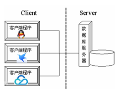
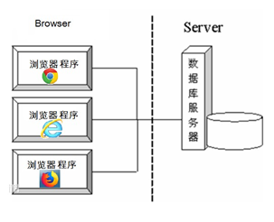
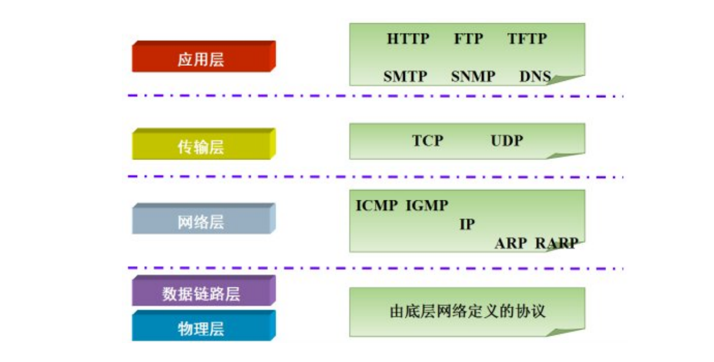
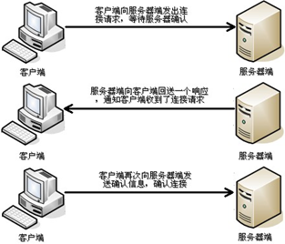
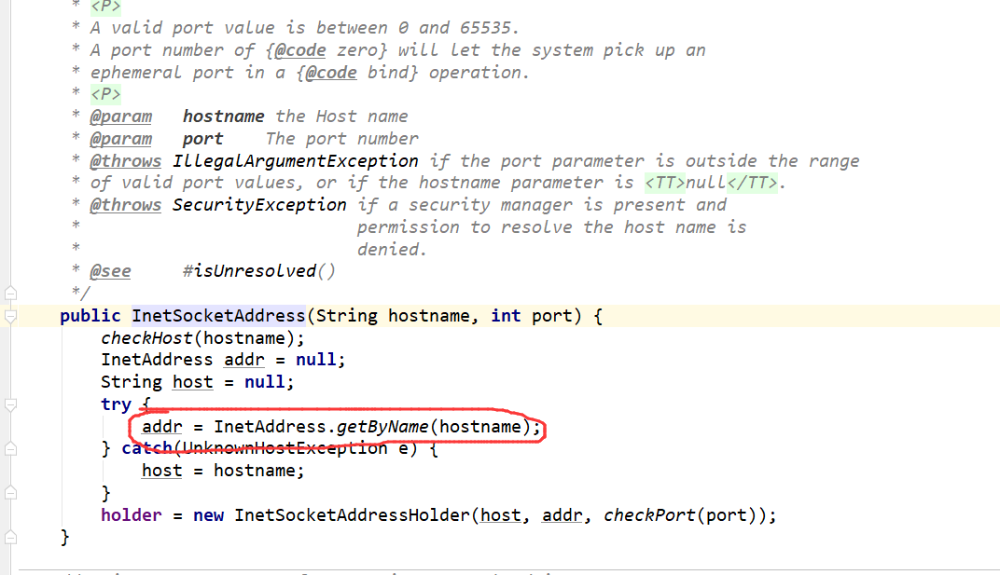
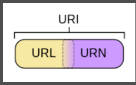

# 初识网络编程


## 1：前言


这篇笔记初衷就是从io--->Nio/Bio/Aio--->网络编程--->Netty框架


## 2：软件结构


### 1.简介


现在流行的软件结构主要有两种，一种是**C/S架构**，另一种是**B/S架构**


### 2.C/S架构


> <font color='red'>**全称为Client/Server结构，是指客户端和服务器结构。常见程序有ＱＱ、迅雷等软件。**</font>
>
> 


### 3.B/S架构


> <font color='red'>**全称为Browser/Server结构，是指浏览器和服务器结构。常见浏览器有谷歌、火狐等。**</font>
>
> 


### 4.总结


**两种架构各有优势，但是无论哪种架构，都离不开网络的支持。网络编程，就是在一定的协议下，实现两台计算机 的通信的程序。**


## 3： 网络通信协议


### 1. 什么是网络通信协议


通信协议是对计算机必须遵守的规则，只有遵守这些规则，计算机之间才能进行通信。这就 好比在道路中行驶的汽车一定要遵守交通规则一样，协议中对数据的传输格式、传输速率、传输步骤等做了 统一规定，通信双方必须同时遵守，最终完成数据交换。

我们主要常见的网络通信协议有:<font color='blue'>**TCP/IP协议、NetBEUI协议、IPX/SPX协议**</font>


### 2.TCP/IP协议


**[TCP/IP]**（Transport Control Protocol/Internet Protocol，传输控制协议/Internet协议）是 Internet最基本、最广泛的协议。它定义了计算机如何连入因特网，以及数据如何在它们之间传输的标准。它的内部包含一系列的用于处理数据通信的协议，并采用了<font color='red'>**5.层的分层模型**</font>，每一层都呼叫它的下一层所提供的协议来完成自己的需求。




<font color='red'>**上图中:**</font>TCP/IP协议中的四层分别是应用层、传输层、网络层和链路层，每层分别负责不同的通信功能。


| **链路层：链路层是用于定义物理传输通道，通常是对某些网络连接设备的驱动协议，例如针对光纤、网线提供的驱动。** |
| ------------------------------------------------------------ |
| **网络层：网络层是整个TCP/IP协议的核心，它主要用于将传输的数据进行分组，将分组数据发送到目标计算机或者网络。** |
| **传输层：主要使网络程序进行通信，在进行网络通信时，可以采用TCP协议，也可以采用UDP协议。** |
| **应用层：主要负责应用程序的协议，例如HTTP协议、FTP协议等。** |


### 3.参考地址


https://www.cnblogs.com/panrenjie/p/10119030.html

**https://blog.csdn.net/g200407331/article/details/97656021**


## 4：协议的分类


### 1.前言


通信的协议还是比较复杂的，`java.net` 包中包含的类和接口，它们提供低层次的通信细节。我们可以直接使用这些类和接口，来专注于网络程序开发，而不用考虑通信的细节。


### 2.UDP协议


> 用户数据报协议(User Datagram Protocol)。UDP协议是一个<font color='red'>**面向无连接的协议**</font>。传输数据时，不需要建立连接，不管对方端服务是否启动，直接将数据、数据源和目的地都封装在数据包中，直接发送。每个数据包的大小限制在64k以内。<font color='red'>它是不可靠协议，因为无连接，所以传输速度快，但是容易丢失数据</font>。
>
> **日常应用中,例如视频会议、QQ聊天等。**


### 3.TCP/IP协议


> <font color='red'>**传输控制协议 (Transmission Control Protocol).**</font>TCP协议是面向连接的通信协议，即传输数据之前， 在发送端和接收端建立逻辑连接，然后再传输数据，它提供了两台计算机之间可靠无差错的数据传输。


### 4.TCP/IP三次握手


> TCP协议中，在发送数据的准备阶段，客户端与服务器之间的三次交互，以保证连接的可 靠性，我们通常叫他为三次握手
>
> - **第一次握手：<font color='red'>客户端向服务器端发出连接请求，等待服务器确认。 </font>**
>
> - **第二次握手：<font color='red'>服务器端向客户端回送一个响应，通知客户端收到了连接请求。 </font>**
>
> - **第三次握手：<font color='red'>客户端再次向服务器端发送确认信息，确认连接。</font>**




<u>**简单的说，客户端给服务端说：哥！借我十块钱；服务端说：好滴老弟；客户端客气的回了一句话我收到了，老哥；**</u>


## 5：网络编程三要素


### 1.IP地址


- **IP地址：**


> **指互联网协议地址(Internet Protocol Address），俗称IP。IP地址用来给一个网络中的计算机设备做唯一的编号。假如我们把“个人电脑”比作“一台电话”的话，那么“IP地址”就相当于“电话号码”。**


- **Ip地址分类：**


> | **IPv4：是一个32位的二进制数，通常被分为4个字节，表示成`a.b.c.d` 的形式，例如192.168.65.100`。其中a、b、c、d都是0~255之间的十进制整数,那么最多可以表示42亿个。** |
> | ------------------------------------------------------------ |
> | **IPv6：由于互联网的蓬勃发展，IP地址的需求量愈来愈大，但是网络地址资源有限，使得IP的分配越发紧张。为了扩大地址空间，拟通过IPv6重新定义地址空间，采用128位地址长度，每16个字节一组，分成8组十六进制数，表示成`ABCD:EF01:2345:6789:ABCD:EF01:2345:6789`，号称可以为全世界的每一粒沙子编上一个网址，这样就解决了网络地址资源数量不够的问题.** |


- **特殊的IP地址**


**本机IP地址：`127.0.0.1`、`localhost` 。**


### 2.端口号


网络的通信，本质上是两个进程（应用程序）的通信。每台计算机都有很多的进程，那么在网络通信时，如何区分这些进程呢？

如果说**IP地址**可以唯一标识网络中的设备，那么**端口号**就可以唯一标识设备中的进程（应用程序）了。

**端口号：**用两个字节表示的整数，它的取值范围是0~65535**。其中，0~1023之间的端口号用于一些知名的网络服务和应用，普通的应用程序需要使用1024以上的端口号。如果端口号被另外一个服务或应用所占用，会导致当前程序启动失败。

利用`协议`+`IP地址`+`端口号` 三元组合，就可以标识网络中的进程了，那么进程间的通信就可以利用这个标识与其它进程进行交互。


### 3.协议


**==我们上一章节已经说过了。==**


## 6：InetAddress类


### 1.简介


> **1.IP地址是IP使用的32位（IPv4）或者128位（IPv6）位无符号数字，<font color='red'>它是传输层协议TCP，UDP的基础</font>。InetAddress是Java对IP地址的封装，几乎所有的Java网络相关的类都和它有关系，例如：<font color='red'>serversocket,socket,URL,DataGramSocket,DataGRamPacket等。</font>**
>
> **2.InetAddress的实例对象包含以数字形式保存的IP地址，同时还可能包含主机名（如果使用主机名来获取InetAddress的实例，或者使用数字来构造，并且启用了反向主机名解析的功能）。<font color='red'>InetAddress类提供了将主机名解析为IP地址（或反之）</font>的方法。**
>
> **3.InetAddress对域名进行解析是<font color='red'>使用本地机器配置或者网络命名服务（如域名系统（Domain Name System，DNS）和网络信息服务（Network Information Service，NIS））来实现</font>。对于DNS来说，本地需要向DNS服务器发送查询的请求，然后服务器根据一系列的操作，返回对应的IP地址，为了提高效率，通常本地会缓存一些主机名与IP地址的映射，这样访问相同的地址，就不需要重复发送DNS请求了。在java.net.InetAddress类同样采用了这种策略。在默认情况下，会缓存一段有限时间的映射，对于主机名解析不成功的结果，会缓存非常短的时间（10秒）来提高性能。**
>
> **4.Java提供了InetAddress类来代表IP地址，InetAddress下还有2个子类：Inet4Address、Inet6Address,它们分别代表Internet Protocol version 4（IPv4）地址和Internet Protocol version 6（IPv6）地址，不过这两个子类不常用，这里也不在赘述。**
>
> **5.此外，InetAddress类没有提供构造器，而是提供了如下两个静态方法来获取InetAddress实例：**
>
> **getByName（String host）：根据主机获取对应的InetAddress对象。**
>
> **getByAddress（byte[] addr）：根据原始IP地址来获取对应的InetAddress对象。**

**简单的来说：**

InetAddress是ip地址的java表示方式。这个类的实例也可以用在UDP DatagramSockets、普通Socket类和ServerSocket类。

------


### 2.方法总结


| 方法摘要               | 描述                                                         |
| ---------------------- | ------------------------------------------------------------ |
| ` boolean`             | `equals(Object obj)`      将此对象与指定对象比较。           |
| ` byte[]`              | `getAddress()`      返回此 `InetAddress` 对象的原始 IP 地址。 |
| `static InetAddress[]` | `getAllByName(String host)`      在给定主机名的情况下，根据系统上配置的名称服务返回其 IP 地址所组成的数组。 |
| `static InetAddress`   | `getByAddress(byte[] addr)`      在给定原始 IP 地址的情况下，返回 `InetAddress` 对象。 |
| `static InetAddress`   | `getByAddress(String host, byte[] addr)`      根据提供的主机名和 IP 地址创建 InetAddress。 |
| `static InetAddress`   | `getByName(String host)`      在给定主机名的情况下确定主机的 IP 地址。 |
| ` String`              | `getCanonicalHostName()`      获取此 IP 地址的完全限定域名。 |
| ` String`              | `getHostAddress()`      返回 IP 地址字符串（以文本表现形式）。 |
| ` String`              | `getHostName()`      获取此 IP 地址的主机名。                |
| `static InetAddress`   | `getLocalHost()`      返回本地主机。                         |
| ` int`                 | `hashCode()`      返回此 IP 地址的哈希码。                   |
| ` boolean`             | `isAnyLocalAddress()`      检查 InetAddress 是否是通配符地址的实用例行程序。 |
| ` boolean`             | `isLinkLocalAddress()`      检查 InetAddress 是否是链接本地地址的实用例行程序。 |
| ` boolean`             | `isLoopbackAddress()`      检查 InetAddress 是否是回送地址的实用例行程序。 |
| ` boolean`             | `isMCGlobal()`      检查多播地址是否具有全局域的实用例行程序。 |
| ` boolean`             | `isMCLinkLocal()`      检查多播地址是否具有链接范围的实用例行程序。 |
| ` boolean`             | `isMCNodeLocal()`      检查多播地址是否具有节点范围的实用例行程序。 |
| ` boolean`             | `isMCOrgLocal()`      检查多播地址是否具有组织范围的实用例行程序。 |
| ` boolean`             | `isMCSiteLocal()`      检查多播地址是否具有站点范围的实用例行程序。 |
| ` boolean`             | `isMulticastAddress()`      检查 InetAddress 是否是 IP 多播地址的实用例行程序。 |
| ` boolean`             | `isReachable(int timeout)`      测试是否可以达到该地址。     |
| ` boolean`             | `isReachable(NetworkInterface netif, int ttl, int timeout)`      测试是否可以达到该地址。 |
| ` boolean`             | `isSiteLocalAddress()`      检查 InetAddress 是否是站点本地地址的实用例行程序。 |
| ` String`              | `toString()`      将此 IP 地址转换为 `String`。              |


### 3.创建本机IP对象


```java
//  创建本机Ip对象
@Test
public void test1() throws UnknownHostException {
    InetAddress localHost = InetAddress.getLocalHost();
    System.out.println("本机Ip地址:"+localHost.getHostAddress()+"\t主机名："+localHost.getHostName());
}
@Test
public void test2() throws UnknownHostException {
    InetAddress localHost = InetAddress.getByName("192.168.245.1");
    System.out.println("本机Ip地址:"+localHost.getHostAddress()+"\t主机名："+localHost.getHostName());
}
@Test
public void test3() throws UnknownHostException {
    InetAddress localHost = InetAddress.getByName("127.0.0.1");
    System.out.println("本机Ip地址:"+localHost.getHostAddress()+"\t主机名："+localHost.getHostName());
}
@Test
public void test4() throws UnknownHostException {
    InetAddress localHost = InetAddress.getByName("localhost");
    System.out.println("本机Ip地址:"+localHost.getHostAddress()+"\t主机名："+localHost.getHostName());
}
```


### 4.创建局域网对象


```java
//  创建局域网Ip对象
@Test
public void  test1() throws IOException {
    InetAddress localHost = InetAddress.getByName("192.168.245.2");
    System.out.println("局域网Ip地址:"+localHost.getHostAddress()+"\t局域网名："+localHost.getHostName());
    System.out.println("局域网Ip在2秒内是否可达："+localHost.isReachable(2000));
}
```


### 5.创建外网对象


```java
// 创建外网IP对象
@Test
public void  test3() throws IOException {
    InetAddress localHost = InetAddress.getByName("www.baidu.com");
    System.out.println("外网Ip地址:"+localHost.getHostAddress()+"\t外网名："+localHost.getHostName());
    System.out.println("外网Ip在2秒内是否可达："+localHost.isReachable(2000));
    InetAddress[] inetAddresses =     InetAddress.getAllByName("www.baidu.com");
    System.out.println("外网所有的ip对象："+ Arrays.toString(inetAddresses));
}
```


## 7：InetSocketAddress


我们平常使用的话一般使用InetSocketAddress

这个类是jdk官方为我们封装好的一个类：


```java
@Test
public void test1() throws Exception {
    InetSocketAddress unresolved = new InetSocketAddress("127.0.0.1", 2000);
    System.out.println(unresolved.getAddress());
    System.out.println(unresolved.getHostName());
    System.out.println(unresolved.getHostString());
    System.out.println(unresolved.getPort());
    //从主机名和端口号创建一个未解析的套接字地址。
    unresolved = InetSocketAddress.createUnresolved("127.0.0.1", 3306);
    System.out.println(unresolved.getAddress());
    System.out.println(unresolved.getHostName());
    System.out.println(unresolved.getHostString());
    System.out.println(unresolved.getPort());
}
```


> 源码分析
>
> 


## 8：URL和URI和URN


### 1.什么URI


URI，全称为==Uniform Resource Identifier==，统一资源标识符，用来唯一的标识一个资源。Web上可用的每种资源如HTML文档、图像、视频片段、程序等都是一个来URI来定位的.

**URI一般由三部组成**
1.访问资源的命名机制
2.存放资源的主机名
3.资源自身的名称，由路径表示，着重强调于资源。
例如：

```javascript
urn:issn:1535-3613
```


### 2.什么是URL


URL，全称==Uniform Resource Locator==，是统一资源定位符，是Internet上用来描述资源的字符串，主要用在各种www客户端和服务器程序是，特别是著名的Mosaic。采用URL可以用一种统一的格式来描述各种信息资源，包括文件、服务器的地址和目录等。

URL一般由三部组成

​        1.协议(或称为服务方式

​        2.存有该资源的主机IP地址(有时也包括端口号)

​        3.主机资源的具体地址。如目录和文件名等。
例如：

```javascript
http://www.jianshu.com/u/606fd5f5448c
```


### 3.什么是URN


URN，全称Universal Resource Name，是统一资源名称。它是通过名字来标识资源。
例如：


```javascript
mailto:java-net@java.sun.com
```


### 4.URL和URI有什么联系


URI属于URL更高层次的抽象，一种字符串文本标准。就是说，URI属于父类，而URL属于URI的子类。URL是URI的一个子集。URI还有一个子类URN-统一资源名称。



### 5.URL和URI有什么区别


其实从上面的对比就能看出来他们的区别。

- URI包含URL和URN。
    - 有人说，
        - URI = 作文
        - URL = 议论文、记叙文、诗歌……
    - 也有人说，
        - URI ：树
        - URL：杨树
- 知乎上也有人简单粗暴的说，
    - 原来uri包括url和urn，后来urn没流行起来，导致几乎目前所有的uri都是url


### 6.URL创建


| 方法                                                         | 描述                                                         |
| ------------------------------------------------------------ | ------------------------------------------------------------ |
| URL(String spec)                                             | 根据String表示形式创建URL对象                                |
| URL(String protocol,String host,int port,String file)        | 根据指定protocol、host、port、file创建URL对象                |
| URL(String protocol,String host,int port,String file,URLStreamHandler handler) | 根据指定protocol、host、port、file和handler创建URL对象       |
| URL(String protocol,String host,String file)                 | 根据指定protocol、host、file创建URL对象                      |
| URL(URL context,String spec)                                 | 通过在指定的上下文对给定的spec进行解析创建URL                |
| URL(URL context,String spec,URLStreamHandler handler)        | 通过在指定的上下文中用指定的处理程序对给指定的spec进行解析来创建URL |


> 常用的方法：
>
> URL(Stringspec) `//绝对路径构建
> `
>
> URL(URLcontext,Stringspec) `//相对路径构`


### 7.基本创建


```java
@Test
public  void  test1() throws MalformedURLException {
    //绝对路径创建
    URL url1 = new URL("http://www.baidu.com:80/index.jsp");
    System.out.println(url1.toString());
    //相对路径创建
    URL url = new URL("http://www.baidu.com:80");
    URL url2 = new URL(url,"/login.html");
    System.out.println(url2.toString());
}
```


### 8.获取地址基本信息


```java
@Test
public  void  test2() throws  Exception{
    URL url = new URL("http://www.baidu.com");
    System.out.println(url.toString());
    System.out.println("协议：" + url.getProtocol());
    System.out.println("主机名：" + url.getHost());
    System.out.println("端口：" + url.getPort());
    System.out.println("资源：" + url.getFile());
    System.out.println("相对路径资源：" + url.getPath());
    System.out.println("锚点：" + url.getRef()); //锚点 #aa
    System.out.println("有锚点时参数：" + url.getQuery()); //存在锚点返回null 不存在锚点返回参数
    url = new URL("http://www.baidu.com:80/index.jsp?dmcId=1");
    System.out.println("无锚点时参数：" + url.getQuery());
}
```


### 9.获取网页编码


```java
@Test
public  void  test3() throws  Exception{
    URL url = new URL("http://www.baidu.com?id=1");
    InputStream inputStream = url.openStream();
    BufferedReader reader = new BufferedReader(
            new InputStreamReader(inputStream,"utf-8"));

    String msg = null;
    while(null != (msg = reader.readLine())){
        System.out.println(msg);
    }
    reader.close();
}
```


### 10.get/post请求工具类


```java
public static String sendGet(String url, String param) {
        String result = "";
        BufferedReader in = null;
        try {
            String urlNameString = url + "?" + param;
            URL realUrl = new URL(urlNameString);
// 打开和URL之间的连接
            URLConnection connection = realUrl.openConnection();
// 设置通用的请求属性
            connection.setRequestProperty("accept", "*/*");
            connection.setRequestProperty("connection", "Keep-Alive");
            connection.setRequestProperty("user-agent",
                    "Mozilla/4.0 (compatible; MSIE 6.0; Windows NT 5.1;SV1)");
// 建立实际的连接
            connection.connect();
// 获取所有响应头字段
            Map<String, List<String>> map = connection.getHeaderFields();
// 遍历所有的响应头字段
            for (String key : map.keySet()) {
                System.out.println(key + "--->" + map.get(key));
            }
// 定义 BufferedReader输入流来读取URL的响应
            in = new BufferedReader(new InputStreamReader(
                    connection.getInputStream()));
            String line;
            while ((line = in.readLine()) != null) {
                result += line;
            }
        } catch (Exception e) {
            System.out.println("发送GET请求出现异常！" + e);
            e.printStackTrace();
        }
// 使用finally块来关闭输入流
        finally {
            try {
                if (in != null) {
                    in.close();
                }
            } catch (Exception e2) {
                e2.printStackTrace();
            }
        }
        return result;
    }

    /**
     * 向指定 URL 发送POST方法的请求
     *
     * @param url   发送请求的 URL
     * @param param 请求参数，请求参数应该是 name1=value1&name2=value2 的形式。
     * @return 所代表远程资源的响应结果
     */
    public static String sendPost(String url, String param) {
        PrintWriter out = null;
        BufferedReader in = null;
        String result = "";
        try {
            URL realUrl = new URL(url);
// 打开和URL之间的连接
            URLConnection conn = realUrl.openConnection();
// 设置通用的请求属性
            conn.setRequestProperty("accept", "*/*");
            conn.setRequestProperty("connection", "Keep-Alive");
            conn.setRequestProperty("user-agent",
                    "Mozilla/4.0 (compatible; MSIE 6.0; Windows NT 5.1;SV1)");
// 发送POST请求必须设置如下两行
            conn.setDoOutput(true);
            conn.setDoInput(true);
// 获取URLConnection对象对应的输出流
            out = new PrintWriter(conn.getOutputStream());
// 发送请求参数
            out.print(param);
// flush输出流的缓冲
            out.flush();
// 定义BufferedReader输入流来读取URL的响应
            in = new BufferedReader(
                    new InputStreamReader(conn.getInputStream()));
            String line;
            while ((line = in.readLine()) != null) {
                result += line;
            }
        } catch (Exception e) {
            System.out.println("发送 POST 请求出现异常！" + e);
            e.printStackTrace();
        }
//使用finally块来关闭输出流、输入流
        finally {
            try {
                if (out != null) {
                    out.close();
                }
                if (in != null) {
                    in.close();
                }
            } catch (IOException ex) {
                ex.printStackTrace();
            }
        }
        return result;
 }
```


## 9：TCP协议


### 1.简介


==TCP通信能实现两台计算机之间的数据交互，通信的两端，要严格区分为客户端（Client）与服务端（Server）。==

> <font color='red'>两端通信时步骤： </font>
>
> 1. 服务端程序，需要事先启动，等待客户端的连接。
>
> 2. 客户端主动连接服务器端，连接成功才能通信。服务端不可以主动连接客户端。
>
> <font color='red'>在Java中，提供了两个类用于实现TCP通信程序： </font>
>
> 1. 客户端： java.net.Socket 类表示。创建 Socket 对象，向服务端发出连接请求，服务端响应请求，两者建 立连接开始通信。
>
> 2. 服务端： java.net.ServerSocket 类表示。创建 ServerSocket 对象，相当于开启一个服务，并等待客户端 的连接。


### 2.客户端实现


过程：

*******

1.创建一个客户端对象Socket,构造方法绑定服务器的IP地址和端口号

2.使用Socket对象中的方法getOutputStream()获取网络字节输出流OutputStream对象

3.使用网络字节输出流OutputStream对象中的方法write,给服务器发送数据

4.使用Socket对象中的方法getInputStream()获取网络字节输入流InputStream对象

5.使用网络字节输入流InputStream对象中的方法read,读取服务器回写的数据

6.释放资源(Socket)


注意：

****************

1. 客户端和服务器端进行交互,必须使用Socket中提供的网络流,不能使用自己创建的流对象
2. 当我们创建客户端对象Socket的时候,就会去请求服务器和服务器经过3次握手建立连接通路这时如果服务器没有启动,那么就会抛出异常ConnectException: Connection refused: connect如果服务器已经启动,那么就可以进行交互了


代码：

********

```java
public class TcpClient {
    public static void main(String[] args) throws IOException {
        //1.创建一个客户端对象Socket,构造方法绑定服务器的IP地址和端口号
        Socket socket = new Socket("127.0.0.1",8888);

        //2.使用Socket对象中的方法getOutputStream()获取网络字节输出流OutputStream对象
        OutputStream os = socket.getOutputStream();

        //3.使用网络字节输出流OutputStream对象中的方法write,给服务器发送数据
        os.write("你好服务器".getBytes());

        //4.使用Socket对象中的方法getInputStream()获取网络字节输入流InputStream对象
        InputStream is = socket.getInputStream();

        //5.使用网络字节输入流InputStream对象中的方法read,读取服务器回写的数据
        byte[] bytes = new byte[1024];
        int len = is.read(bytes);
        System.out.println(new String(bytes,0,len));

        //6.释放资源(Socket)
        socket.close();
    }
}
```


### 3.服务端实现


实现过程：

************

1.创建服务器ServerSocket对象和系统要指定的端口号

2.使用ServerSocket对象中的方法accept,获取到请求的客户端对象Socket

3.使用Socket对象中的方法getInputStream()获取网络字节输入流InputStream对象

4.使用网络字节输入流InputStream对象中的方法read,读取客户端发送的数据

5.使用Socket对象中的方法getOutputStream()获取网络字节输出流OutputStream对象

6.使用网络字节输出流OutputStream对象中的方法write,给客户端回写数据

7.释放资源(Socket,ServerSocket)


代码：

********************

```java
public static void main(String[] args) throws IOException {
    //1.创建服务器ServerSocket对象和系统要指定的端口号
    ServerSocket server = new ServerSocket(8888);
    //2.使用ServerSocket对象中的方法accept,获取到请求的客户端对象Socket
    Socket socket = server.accept();
    //3.使用Socket对象中的方法getInputStream()获取网络字节输入流InputStream对象
    InputStream is = socket.getInputStream();
    //4.使用网络字节输入流InputStream对象中的方法read,读取客户端发送的数据
    byte[] bytes = new byte[1024];
    int len = is.read(bytes);
    System.out.println(new String(bytes,0,len));
    //5.使用Socket对象中的方法getOutputStream()获取网络字节输出流OutputStream对象
    OutputStream os = socket.getOutputStream();
    //6.使用网络字节输出流OutputStream对象中的方法write,给客户端回写数据
    os.write("收到谢谢".getBytes());
    //7.释放资源(Socket,ServerSocket)
    socket.close();
    server.close();
}
```


## 10：结束语


`到这里大概了解网络编程，我们接下来要初步学习一下线程。再来学习网络编程`