# 目录


[TOC]


# 一、多线程(一)

## 1.1：为什么要学习线程


1. **应付面试** ：多线程几乎是面试中必问的题，所以掌握一定的基础知识是必须的。
2. **了解并发编程**：实际工作中很少写多线程的代码，这部分代码一般都被人封装起来了，在业务中使用多线程的机会也不是很多(看具体项目)，虽然代码中很少会自己去创建线程，但是实际环境中每行代码却都是并行执行的，同一时刻大量请求同一个接口，并发可能会产生一些问题，所以也需要掌握一定的并发知识


## 1.2：进程与线程


### 1. 进程


进程是资源（CPU、内存等）分配的基本单位，它是程序执行时的一个实例。程序运行时系统就会创建一个进程，并为它分配资源，然后把该进程放入进程就绪队列，进程调度器选中它的时候就会为它分配CPU时间，程序开始真正运行。


### 2. 线程


线程是一条执行路径，是程序执行时的最小单位，它是进程的一个执行流，是CPU调度和分派的基本单位，一个进程可以由很多个线程组成，线程间共享进程的所有资源，***每个线程有自己的堆栈和局部变量***。线程由CPU独立调度执行，在多CPU环境下就允许多个线程同时运行。同样多线程也可以实现并发操作，每个请求分配一个线程来处理。一个正在运行的软件(如迅雷)就是一个进程，一个进程可以同时运行多个任务( 迅雷软件可以同时下载多个文件，每个下载任务就是一个线程), 可以简单的认为进程是线程的集合。

线程是一条可以执行的路径。多线程就是同时有多条执行路径在同时(并行)执行。


### 3. 进程与线程的关系


一个程序就是一个进程，而一个程序中的多个任务则被称为线程。进程是表示资源分配的基本单位，又是调度运行的基本单位。亦即执行处理机调度的基本单位。 进程和线程的关系：

- 一个线程只能属于一个进程，而一个进程可以有多个线程，但至少有一个线程。线程是操作系统可识别的最小执行和调度单位。
- 资源分配给进程，同一进程的所有线程共享该进程的所有资源。同一进程中的多个线程共享代码段(代码和常量)，数据段(全局变量和静态变量)，扩展段(堆存储)。但是每个线程拥有自己的栈段，栈段又叫运行时段，用来存放所有局部变量和临时变量，即每个线程都有自己的堆栈和局部变量。
- 处理机分给线程，即真正在处理机上运行的是线程。
- 线程在执行过程中，需要协作同步。不同进程的线程间要利用消息通信的办法实现同步。

如果把上课的过程比作进程，把老师比作CPU，那么可以把每个学生比作每个线程，所有学生共享这个教室(也就是所有线程共享进程的资源)，上课时学生A向老师提出问题，老师对A进行解答，此时可能会有学生B对老师的解答不懂会提出B的疑问(注意：此时可能老师还没有对A同学的问题解答完毕)，此时老师又向学生B解惑，解释完之后又继续回答学生A的问题，同一时刻老师只能向一个学生回答问题(即：当多个线程在运行时，同一个CPU在某一个时刻只能服务于一个线程，可能一个线程分配一点时间，时间到了就轮到其它线程执行了，这样多个线程在来回的切换)


> 简单的解释：
>
> **程序(program)**是为完成特定任务、用某种语言编写的一组指令的集合。即指一段静态的代码，静态对象。
>
> **进程(process)**是程序的一次执行过程，或是正在运行的一个程序。动态过程：有它自身的产生、存在和消亡的过程。
>
> - 如：运行中的QQ，运行中的MP3播放器
>
> - 程序是静态的，进程是动态的
>
> **线程(thread)**，进程可进一步细化为线程，是一个程序内部的一条执行路径。
>
> - 若一个程序可同一时间执行多个线程，就是支持多线程


## 1.3： 为什么要使用多线程


`多线程可以提高程序的效率`

实际生活案例：村长要求喜洋洋在一个小时内打100桶水，可喜洋洋一个小时只能打25桶水，如果这样就需要4个小时才能完成任务，为了在一个小时能够完成，喜洋洋就请美洋洋、懒洋洋、沸洋洋，来帮忙，这样4只羊同时干活，在一小时内完成了任务。原本用4个小时完成的任务现在只需要1个小时就完成了，如果把每只羊看做一个线程，多只羊即多线程可以提高程序的效率。

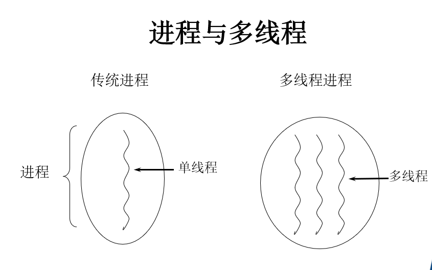


## 1.4：使用多线程的优点


**背景：**只使用单个线程完成多个任务（调用多个方法），肯定比用多个线程来完成用的时间更短，为何仍需多线程呢？

多线程程序的优点：

1.提高应用程序的响应。对图形化界面更有意义，可增强用户体验。

2.提高计算机系统CPU的利用率

3.改善程序结构。将既长又复杂的进程分为多个线程，独立运行，利于理解和修改


## 1.5：看一个程序


### 1.代码


```java
public class Main {
    // 顺序编程 吃喝示例：当吃饭吃不完的时候，是不能喝酒的，只能吃完晚才能喝酒
    public static void main(String[] args) throws Exception {
		// 先吃饭再喝酒
        eat();
        drink();
    }

    private static void eat() throws Exception {
        System.out.println("开始吃饭?...\t" + new Date());
        Thread.sleep(5000);
        System.out.println("结束吃饭?...\t" + new Date());
    }

    private static void drink() throws Exception {
        System.out.println("开始喝酒?️...\t" + new Date());
        Thread.sleep(5000);
        System.out.println("结束喝酒?...\t" + new Date());
    }
}
```


### 2.缺点


顺序编程：`程序从上往下的同步执行，即如果第一行代码执行没有结束，第二行代码就只能等待第一行执行结束后才能结束。`


##1.6：实现线程-继承Thread


> （1）定义Thread类的子类，并重写该类的run方法，该run方法的方法体就代表了线程要完成的任务。因此把run()方法称为执行体。
>
> （2）创建Thread子类的实例，即创建了线程对象。
>
> （3）调用线程对象的start()方法来启动该线程。


```java
public class Demo {
    private static void main(String[] args) {
        for (int i = 0; i < 30; i++) {
            // 通过Thread类的currentThread方法可以得到当前的线程名
            System.out.println(Thread.currentThread().getName()+" "+i);
            if (i==20) {
                // 创建并启动第一个子线程
                new FirstThread().start();
                // 创建并启动第二个子线程
                new FirstThread().start();
            }
        }
    }
}

// 通过继承Thread类来创建线程类
class FirstThread extends Thread {
    int i;
    // 重写run（）方法，run（）方法的方法体是线程的执行体
    @Override
    public void run() {
        super.run();
        // 当线程类继承Thread时，直接使用this通过getName()即可获取到当前的线程名
        for (int i=0; i <30; i++) {
            System.out.println(this.getName()+" "+i);
        }

    }
}
```


## 1.7：实现线程-实现Runnable


> （1）定义runnable接口的实现类，并重写该接口的run()方法，该run()方法的方法体同样是该线程的线程执行体。
>
> （2）创建 Runnable实现类的实例，并以此实例作为Thread的target来创建Thread对象，该Thread对象才是真正的线程对象。
>
> （3）调用线程对象的start()方法来启动该线程。


```java
public class Demo {
    public static void main(String[] args) {
        for (int i = 0; i < 30; i++) {
            // 通过Thread类的currentThread方法可以得到当前的线程名
            System.out.println(Thread.currentThread().getName()+" "+i);
            if (i==20) {
                //通过new Thread(target,name)方式创建新线程
                SecondThread secondThread = new  SecondThread();
                new Thread(secondThread, "线程1").start();
                new Thread(secondThread, "线程2").start();
            }
        }
    }
}

// 通过继承Thread类来创建线程类
class SecondThread implements Runnable{
    int i ;
    // 重写run（）方法，run（）方法的方法体是线程的执行体
    @Override
    public void run() {
        for (  ; i <30; i++) {
            //当使用Runnable接口实现线程类时，若要得到当前的线程名称，只能用Thread.currendThread（）方法
            System.out.println(Thread.currentThread().getName()+" "+i);
        }
    }
}
```


## 1.8：实现线程-Callable和Future


> （1）创建Callable接口的实现类，并实现call()方法，该call()方法将作为线程执行体，并且有返回值。
>
> （2）创建Callable实现类的实例，使用FutureTask类来包装Callable对象，该FutureTask对象封装了该Callable对象的call()方法的返回值。
>
> （3）使用FutureTask对象作为Thread对象的target创建并启动新线程。
>
> （4）调用FutureTask对象的get()方法来获得子线程执行结束后的返回值


```java
public class Demo {
    private static void main(String[] args) {
        //创建Callable对象
        ThirdThreadCallable callable = new  ThirdThreadCallable();
        //创建FutureTask对象，并把callable以形参的方式传入FutureTask的构造方法内
        FutureTask<Integer> futureTask = new FutureTask<>(callable);
        for (int i = 0; i < 30; i++) {
            // 通过Thread类的currentThread方法可以得到当前的线程名
            System.out.println(Thread.currentThread().getName()+" "+i);
            if (i==20) {
                //创建线程并启动
                new Thread(futureTask, "有返回值的线程").start();
            }
        }
        //获取子线程的返回值
        try {
            System.out.println("子线程的返回值： "+futureTask.get());
        } catch (InterruptedException e) {
            // TODO Auto-generated catch block
            e.printStackTrace();
        } catch (ExecutionException e) {
            e.printStackTrace();
        }
    }
}

class ThirdThreadCallable implements Callable<Integer> {
    int i ;
    //call（）方法称之为线程方法执行体，且该方法有返回值，可通过FutureTask实例对象调用get（）方法得到子线程的返回值
    @Override
    public Integer call() throws Exception {
        for (; i <30; i++) {
            System.out.println(Thread.currentThread().getName()+" "+i);
        }
        return i;
    }

}
```


## 1.9：三种创建线程对比


==采用实现Runnable、Callable接口的方式创见多线程时：==

- **优势是：**

<font color='blue'>线程类只是实现了Runnable接口或Callable接口，还可以继承其他类。</font>

<font color='blue'>在这种方式下，多个线程可以共享同一个target对象，所以非常适合多个相同线程来处理同一份资源的情况，从而可以将CPU、代码和数据分开，形成清晰的模型，较好地体现了面向对象的思想。</font>

- **劣势是：**

<font color='red'> 编程稍微复杂，如果要访问当前线程，则必须使用Thread.currentThread()方法。</font>

****************

==使用继承Thread类的方式创建多线程时==

- **优势是：**

<font color='blue'>编写简单，如果需要访问当前线程，则无需使用Thread.currentThread()方法，直接使用this即可获得当前线程。</font>

- **劣势是：**

<font color='red'>线程类已经继承了Thread类，所以不能再继承其他父类。</font>


==<font color='red' align='center'>**一般情况下，项目中推荐使用Runnable接口或Callable接口创建多线程。**</font>==


## 1.10：Thread常用方法


| 方法名                  | static | 功能说明                                                     | 注意                                                         |
| ----------------------- | ------ | ------------------------------------------------------------ | ------------------------------------------------------------ |
| start()                 |        | 启动一个新线程，在新的线程运行run方法中的代码                | start 方法只是让线程进入就绪，里面代码不一定立刻运行（CPU 的时间片还没分给它）。每个线程对象的start方法只能调用一次，如果调用了多次会出现IllegalThreadStateException |
| run()                   |        | 新线程启动后会调用的方法                                     | 如果在构造 Thread 对象时传递了 Runnable 参数，则线程启动后会调用 Runnable 中的 run 方法，否则默认不执行任何操作。但可以创建 Thread 的子类对象，来覆盖默认行为 |
| join()                  |        | 等待线程运行结束                                             |                                                              |
| join(long n)            |        | 等待线程运行结束，最多等待N毫秒                              |                                                              |
| getId()                 |        | 获取线程长整型的id                                           | id唯一                                                       |
| getName()               |        | 获取线程名                                                   |                                                              |
| setName()               |        | 修改线程名                                                   |                                                              |
| getPriority()           |        | 获取线程优先级                                               |                                                              |
| setPriority(int)        |        | 修改线程的优先级                                             | java中规定线程优先级是1~10 的整数，较大的优先级能提高该线程被 CPU 调度的机率 |
| getState()              |        | 获取线程的状态                                               | Java中线程状态是用 6 个enum(枚举)表示，分别为：NEW, RUNNABLE, BLOCKED, WAITING, TIMED_WAITING, TERMINATED |
| isInterrupted()         |        | 判断是否被打断                                               | 不会清楚打断标记                                             |
| isAilvie()              |        | 线程是否存货(还没有运行完毕)                                 |                                                              |
| interrupt()             |        | 打断线程                                                     | 如果被打断线程正在 sleep，wait，join 会导致被打断的线程抛出 InterruptedException，并清除 打断标记 ；如果打断的正在运行的线程，则会设置 打断标记 ；park 的线程被打断，也会设置 打断标记 |
| interrupted()           | static | 判断当前线程是否被打断                                       | 会清楚打断标记                                               |
| currentThread()         | static | 获取当前正在执行的线程                                       |                                                              |
| sleep(long m)           | static | 让当前执行的线程休眠n毫秒休眠时让出cput的时间片给其他的线程  |                                                              |
| sleep(lone m,long n)    | static | 让当前执行的线程休眠m毫秒，n纳秒休眠时让出cput的时间片给其他的线程 |                                                              |
| yield()                 | static | 提示线程调度器让出当前线程对CPU的使用                        | 主要时为了测试和调试                                         |
| setDaemon()和isDaemon() |        | 用来设置线程是否成为守护线程和判断线程是否是守护线程。       |                                                              |


# 二、多线程(二)

## 2.1：线程的生命周期


> 我们知道了有三种方式创建线程：	然后我们通过`thread.start()`来启动线程,但是它并不是<font color='red'>一启动就进入启动状态的</font>，<font color='red'>也不会一直处于执行状态</font>，而是会经历5种状态。
>
> **5种状态就是线程的生命周期，线程状态的5个阶段具体分别是：**
>
> **`新建状态（New）`、`就绪状态（Runnable）`、`运行状态（Running）`、`阻塞状态（Blocked）`、`死亡状态（Dead）`**
>
> <font color='red'>注意:有一些人喜欢把新建状态教成新生状态，根据自己喜好把:balance_scale:</font>


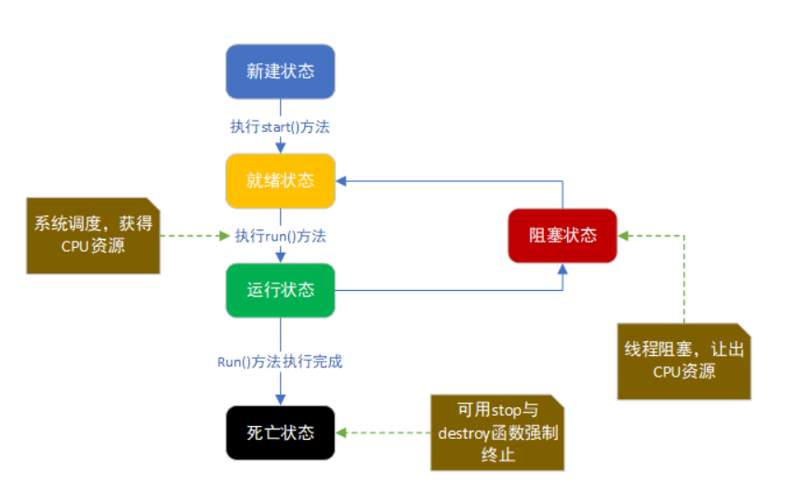


******

| **状态**                                                   | **解释**                                                     |
| ---------------------------------------------------------- | ------------------------------------------------------------ |
| **新建状态(New)**                                          | 当程序使用new关键字创建了一个线程之后，该线程就处于新建状态。例：`Thread t = new MyThread();` |
| **就绪状态(Runnable)**<font color='white'>---------</font> | 调用`start()方法`后，线程就会处于`就绪状态`；此时只能说明此线程做好了执行的就绪准备,`表示可以运行了,但还不是正在运行的线程。` |
| **运行状态(Running)**                                      | 当线程获得到`JVM中线程调度器的调度时`，线程就会处于运行状态，开始执行run()方法的线程执行体。 |
| **阻塞状态(Blocked)**                                      | 这是线程仍处于活动状态但当前没有资格运行（因为一些原因，`暂时放弃对CPU的使用权，停止执行`）时的状态。 |
| **死亡状态（Dead）**                                       | 当`退出run（）方法`时，线程就会自然死亡，`处于终止或死亡状态`，也就结束了生命周期。 |

**<font color='red'>线程进入阻塞状态时分为三种状态：</font>**

> + **1、等待阻塞：**
    > 	+ 1）线程调用wait()方法，使本线程进入到等待状态；
           > 	+ 2）调用join()方法，使本线程进入到另一种等待状态：等待别线程终止或者超时后才执行自己这个线程。
>
> + **2、同步阻塞**
    > 	+ 线程在获取synchronized同步锁失败(因为锁被其它线程所占用)，它会进入同步阻塞状态；
>
> + **3、其他阻塞**
    > 	+ 通过调用线程的sleep()或join()或发出了I/O请求时，线程会进入到阻塞状态。当sleep()状态超时、join()等待线程终止或者超时、或者I/O处理完毕时，线程重新转入就绪状态。


## 2.2：启动线程


> + 我们创建线程时，它会进入`新建状态(New)`
> + 我们通过调用`start()方法`来启动线程时就会进入到`就绪状态(Runnable)`
> + <font color='red'>特别注意不是调用`run()`方法</font>


```java
public class TestDemo {
	public static void main(String[] args) throws Exception {
		MyThread mt1 = new MyThread();		// 实例化多线程对象
		MyThread mt2 = new MyThread();		// 实例化多线程对象
		FutureTask<String> task1 = new FutureTask<String>(mt1) ;
		FutureTask<String> task2 = new FutureTask<String>(mt2) ;
		// FutureTask是Runnable接口子类，所以可以使用Thread类的构造来接收task对象
		new Thread(task1).start();			// 启动第一个线程 
		new Thread(task2).start(); 			// 启动第二个线程
		// 多线程执行完毕后可以取得内容，依靠FutureTask的父接口Future中的get()方法实现
		System.out.println("A线程的返回结果：" + task1.get());
		System.out.println("B线程的返回结果：" + task2.get());
	}
}
```


## 2.3：获取/设置线程名字


```java
public class TestThreadName extends Thread {
    @Override
    public void run() {
        //获取正在运行线程的名字
        System.out.println("线程的名字:"+Thread.currentThread().getName());
    }

    public static void main(String[] args) {
        TestThreadName testThreadName = new TestThreadName();
        new  Thread(testThreadName).start();
        //设置一个名字，不设置的他会默认生成一个，前缀时Thread-
        new  Thread(testThreadName,"自定义的名字1").start();
        new  Thread(testThreadName).start();
        new  Thread(testThreadName,"自定义的名字2").start();
        new  Thread(testThreadName).start();
    }
}
```


## 2.4：查看main方法的优先级


```java
public class ShowMainPriority {
    public static void main(String[] args) {
        System.out.println(Thread.currentThread().getPriority());
        //打印是：5
    }
}
```


## 2.5：串行并行并发


### 1.串行


> 多个任务，执行时一个执行完再执行另一个。


### 2.并发（concurrency）


> 多个线程在单个核心运行，同一时间一个线程运行，系统不停切换线程，看起来像同时运行，实际上是线程不停切换。
>
> 即一个指令 和另一个指令交错执行，操作系统实现这种交错执行的机制称为：上下文切换。上下文是指操作系统保持跟踪进程或线程运行所需的所有状态信息，如寄存器文件的当前值、主存内容等


### 3.并行（parallelism）


> 每个线程分配给独立的核心，线程同时运行。
>
> 单核CPU多个进程或多个线程内能实现并发（微观上的串行，宏观上的并行）；多核CPU线程间可以实现微观上并行。


### 4.总结：


> **<font color='orange'>1、单CPU中进程只能是并发，多CPU计算机中进程可以并行。</font>**
>
> **<font color='blue'>2、单CPU单核中线程只能并发，单CPU多核中线程可以并行。</font>**
>
> **<font color='black'>3、无论是并发还是并行，使用者来看，看到的是多进程，多线程。</font>**


## 2.6：控制线程


**<font color='red'>Java的线程支持提供了一些工具方法，通过这些方法可以很好地控制线程的执行。</font>**

### 1.join线程


> **Thread类中的join方法的主要作用就是`同步`，它可以使得线程之间的并发执行变为`串行执行`。**
>
> `join()方法`的作用<font color='red'>**就是让主线程等待子线程执行结束之后再运行主线程。**</font>
>
>


```java
public class ThreadJoin {
    public static void main(String[] args) {
        Thread myThread1 = new MyThread("+++++myThread1+++++");
        Thread myThread2 = new MyThread("-----myThread2-----");
        myThread1.start();
        /**
         join的意思是使得放弃当前线程的执行，并返回对应的线程，
        例如下面代码的意思就是：
         1:程序在 main线程中调用t1线程的join方法，
         2:则main线程放弃cpu控制权，并返回t1线程继续执行直到线程t1执行完毕
         所以结果是t1线程执行完后，才到主线程执行，相当于在main线程中同步t1线程，t1执行完了，main线程才有执行的机会
         */
        try {
            myThread1.join();
        } catch (InterruptedException e) {
            e.printStackTrace();
        }
        System.out.println("********************************************************************");
        myThread2.start();
    }
}

class MyThread extends Thread {
    public MyThread(String name) {
        super(name);
    }

    @Override
    public void run() {
        for (int i = 0; i < 100; i++) {
            System.out.println("执行中的线程:" + Thread.currentThread().getName());
        }
    }
}
```


> ------------------------------
>
> **<font color='blue'>上面注释也大概说明了join方法的作用：在A线程中调用了B线程的join()方法时，表示只有当B线程执行完毕时，A线程才能继续执行。</font>**
>
>
>
> **<font color='red'>注意:   </font>**这里调用的join方法是没有传参的，join方法其实也可以接收参数的，具体看下面的简单例子：


```java
public class ThreadJoin2 {
    public static void main(String[] args) {
        Thread myThread1 = new MyThread2("+++++myThread1+++++");
        Thread myThread2 = new MyThread2("-----myThread2-----");
        myThread1.start();
        /**
         join方法可以传递参数，join(2000)表示main线程会等待t1线程2秒，2秒过去后，
         main线程和t1线程之间执行顺序由串行执行变为普通的并行执行
         */
        try {
            myThread1.join(2000);
        } catch (InterruptedException e) {
            e.printStackTrace();
        }
        System.out.println("********************************************************************");
        myThread2.start();
    }
}

class MyThread2 extends Thread {
    public MyThread2(String name) {
        super(name);
    }

    @Override
    public void run() {
        for (int i = 0; i < 10; i++) {
            try {
                Thread.sleep(500);//休眠500毫秒
            } catch (InterruptedException e) {
                e.printStackTrace();
            }
            System.out.println("执行中的线程:" + Thread.currentThread().getName());
        }
    }
}
```


| 所以，join方法中如果传入参数，则表示这样的意思：如果A线程中掉用B线程的join(10)，则表示A线程会等待B线程执行10毫秒，10毫秒过后，A、B线程并发执行 |
| ------------------------------------------------------------ |
| `注意:`<font color='blue'>jdk规定，join(0)的意思不是A线程等待B线程0秒，而是A线程等待B线程无限时间，直到B线程执行完毕，即join(0)等价于join()</font>。 |
| 还有一点这里可能效果不明显,多运行几次注意观察                |

****************


### **2.join与start调用顺序问题**


<font color='red'>**上面的讨论大概知道了join的作用了，那么，如果 join在start前调用，会出现什么后果呢？先看下面的测试结果**</font>


```java
public class JoinTest {
    public static void main(String [] args) throws InterruptedException {
        ThreadJoinTest t1 = new ThreadJoinTest("小明");
        ThreadJoinTest t2 = new ThreadJoinTest("小东");
        /**join方法可以在start方法前调用时，并不能起到同步的作用
         */
        t1.join();
        t1.start();
        //Thread.yield();
        t2.start();
    }
}
class ThreadJoinTest extends Thread{
    public ThreadJoinTest(String name){
        super(name);
    }
    @Override
    public void run(){
        for(int i=0;i<1000;i++){
            System.out.println(this.getName() + ":" + i);
        }
    }
}
```


> **所以得到以下结论：join方法必须在线程start方法调用之后调用才有意义。这个也很容易理解：如果一个线程都没有start，那它也就无法同步了**。


### 3.守护线程和非守护线程


+ **守护线程：可以被叫做："`后台线程`"或者"`精灵线程`"**

+ **非守护线程：可以叫做是："`前台线程`”或者"`用户线程`"**


> <font color='orgian'>**所谓守护线程是指在程序运行的时候在后台提供一种通用服务的线程：**</font>
>
> + <font color='black'>==比如垃圾回收线程就是一个很称职的守护者==，并且这种线程并不属于程序中不可或缺的部分。因 此，当所有的非守护线程结束时，程序也就终止了，同时会杀死进程中的所有守护线程。</font>
>
> <font color='orgian'>**反过来说，只要任何非守护线程还在运行，程序就不会终止。**</font>

下面是java中的关于守护线程的方法：


```java
Thread daemonTread = new Thread();
 
// 设定 daemonThread 为 守护线程，default false(非守护线程)
 
daemonThread.setDaemon(true);

// 验证当前线程是否为守护线程，返回 true 则为守护线程
 
daemonThread.isDaemon();
```


### 4.守护线程实例


**注意：**

> (1) thread.setDaemon(true)必须在thread.start()之前设置，否则会跑出一个IllegalThreadStateException异常。（你不能把正在运行的常规线程设置为守护线程。）
>
> (2) 在Daemon线程中产生的新线程也是Daemon的。
>
> (3) 不要认为所有的应用都可以分配给Daemon来进行服务，比如读写操作或者计算逻辑。
>
>
>
> > <font color='red'>**因为你不可能知道在所有的`前台线程(非守护线程)`完成之前，他们所属的`后台线程(守护线程)`是否已经完成了预期的服务任务。一旦`前台线程(非守护线程)`停止，可能`后台线程(守护线程)还有大量数据没有来得及读入或写出`。这对程序是毁灭性的。造成这个结果理由已经说过了：一旦所有`前台线程(非守护线程)`离开了`后台线程(守护线程)`也就退出运行了。** </font>


```java
/**
 * 守护线程
 */
public class ThreadLove {
    public static void main(String[] args) {
        Thread thread1 = new Thread1("守护线程(后台线程|精灵线程)");
        Thread thread2 = new Thread2("非守护线程(前台线程|用户线程)");
        //设置thread1为守护线程  注意一定要在start方法前面调用否则IllegalThreadStateException异常
        thread1.setDaemon(true);
        thread1.start();
        thread2.start();
    }
}
class Thread1 extends Thread{
    public Thread1(String name){
        super(name);
    }
    @Override
    public void run() {
        for (int i = 0; i < 10; i++) {
            try {
                Thread.sleep(100);//休眠100毫秒
                System.out.println(Thread.currentThread().getName()+"-------------"+i);
            } catch (InterruptedException e) {
                e.printStackTrace();
            }
        }
    }

}
class Thread2 extends Thread{
    public Thread2(String name){
        super(name);
    }
    @Override
    public void run() {
        for (int i = 0; i < 10; i++) {
            try {
                Thread.sleep(50);//休眠50毫秒
                System.out.println(Thread.currentThread().getName()+"-------------"+i);
            } catch (InterruptedException e) {
                e.printStackTrace();
            }
        }
    }
}
```


-----------

### 5.线程休眠


> 方法介绍


| 方法                          | 描述                              |
| ----------------------------- | --------------------------------- |
| sleep(long millis)            | 线程睡眠 millis 毫秒              |
| sleep(long millis, int nanos) | 线程睡眠 millis 毫秒 + nanos 纳秒 |


> 如何调用这个方法


**因为sleep()是静态方法，所以最好的调用方法就是 Thread.sleep()。**


> 在哪里写会更有效


```java
public class ThreadSleep {
    public static void main(String[] args) {
        myThread r1 = new myThread();
        Thread t = new Thread(r1);
        t.start();
        for (int i = 0; i < 3; i++) {
            System.out.println("main thread :"+i);
        }
    }
}
class  myThread extends  Thread{

    @Override
    public void run() {
        try {
            Thread.sleep(2000);
        } catch (InterruptedException e) {
            e.printStackTrace();
        }
        for (int i = 0; i < 3; i++) {
            System.out.println(Thread.currentThread().getName()+"---------------->"+i);
        }
    }
}
/*
打印结果：
main thread :0
main thread :1
main thread :2  注意：在这里线程会休眠2000毫秒
Thread-1---------------->0
Thread-1---------------->1
Thread-1---------------->2

*/
```


> `问题：` 到底是让哪个线程睡眠？


sleep方法只能让当前线程睡眠。调用某一个线程类的对象t.sleep()，睡眠的不是t，而是当前线程。代码验证：为了验证，我们通过继承Thread类创建线程。在Runner1的run()中不写sleep()，在主线程中写Runner1.sleep(5000)，结果不是Runner1睡眠，还是主线程睡眠，请看下面输出结果。


```java
public class Thread1 {
    public static void main(String[] args) {
        Runner1 r = new Runner1();
        r.start();
        try {
            Runner1.sleep(5000); //此处是类名.sleep()
            System.out.println("当前运行的线程名称： "+ Runner1.currentThread().getName());
        } catch (InterruptedException e) {
            e.printStackTrace();
        }
        for (int i = 0; i < 3; i++) {
            System.out.println("main thread :"+i);
        }
    }
}

class Runner1 extends Thread{
    public void run() {
        for (int i = 0; i < 3; i++) {
            System.out.println("Runner1 : " + i);
        }
    }
}
/*
Runner1 : 0
Runner1 : 1
Runner1 : 2
---------------------------------  此处睡眠5秒，5秒后出现以下：
当前运行的线程名称： main
main thread :0
main thread :1
main thread :2
*/
```


### 6.线程休眠第二种方法TimeUnit


> 简介


TimeUnit是java.util.concurrent包下面的一个类，表示给定单元粒度的时间段

主要作用

- 时间颗粒度转换
- 延时


> 常用的颗粒度


```java
TimeUnit.DAYS          //天
TimeUnit.HOURS         //小时
TimeUnit.MINUTES       //分钟
TimeUnit.SECONDS       //秒
TimeUnit.MILLISECONDS  //毫秒
```


> 时间粒度的转换


```java
public long toMillis(long d)  //转化成毫秒
public long toSeconds(long d) //转化成秒
public long toMinutes(long d) //转化成分钟
public long toHours(long d)  //转化成小时
public long toDays(long d)  //转化天
```

```java
import java.util.concurrent.TimeUnit;
 
public class Test {
 
    public static void main(String[] args) {
        //1天有24个小时    1代表1天：将1天转化为小时
        System.out.println( TimeUnit.DAYS.toHours( 1 ) );
         
        //结果： 24
         
 
        //1小时有3600秒
        System.out.println( TimeUnit.HOURS.toSeconds( 1 ));
         
        //结果3600
         
         
        //把3天转化成小时
        System.out.println( TimeUnit.HOURS.convert( 3 , TimeUnit.DAYS ) );
        //结果是：72
 
    }
}
```


> 线程睡眠


```java
public class Test2 {
 
    public static void main(String[] args) {
 
        new Thread( new Runnable() {
 
            @Override
            public void run() {
                try {
                    TimeUnit.SECONDS.sleep( 5 );
                    System.out.println( "延时5秒，完成了");
                } catch (InterruptedException e) {
                    e.printStackTrace();
                }
            }
        }).start();  ;
    }
     
}
```


--------------------

### 7.设置线程的优先级


> 简介


+ **每个线程在执行时都具有一定的优先级，`优先级高的线程获得较多的执行机会`，而优先级低的线程则获得较少的执行机会。**

+ **每个线程默认的优先级都与创建它的父线程的优先级相同，在默认情况下`，main线程具有普通优先级5`，由	。**

+ **java 中的线程`优先级的范围是1～10`，`1的优先级最低`，`10的优先级最高`。**

+ **通过`setPriority()`方法，可以改变线程的优先级。**


> 代码


```java
/**
 * 修改线程的优先级
 */
public class UpDateInterrupted extends  Thread{
    @Override
    public void run() {
        System.out.println("正在运行的线程："+Thread.currentThread().getName());
    }

    public static void main(String[] args) {
        UpDateInterrupted upDateInterrupted = new UpDateInterrupted();
        Thread thread = new Thread(upDateInterrupted, "线程1");
        Thread thread1 = new Thread(upDateInterrupted, "线程2");
        Thread thread2 = new Thread(upDateInterrupted, "线程3");
        thread1.setPriority(Thread.MAX_PRIORITY);//随便设置一个线程的优先级
        thread.start();
        thread1.start();
        thread2.start();
    }
}
/**
线程2基本上一直是第一句打印
*/
```


> 注意


+ <font color='red'>**每个线程在执行时都具有一定的优先级，优先级高的线程获得较多的执行机会，而优先级低的线程则获得较少的执行机会。**</font>

+ **<font color='gresad'>每个线程默认的优先级都与创建它的父线程的优先级相同，在默认情况下，main线程具有普通优先级，由main线程创建的子线程也具有普通优先级。</font>**

+ <font color='red'> **java 中的线程优先级的范围是1～10，1的优先级最低，10的优先级最高。**</font>

+ **<font color='red'>通过setPriority()方法，可以改变线程的优先级。</font>**
+ **<font color='greeBl'>在多线程中线程的执行顺序是依靠哪个线程先获得到CUP的执行权谁就先执行，虽然说可以通过线程的优先权进行设置，但是他只是获取CUP执行权的概率高点，但是也不一定必须先执行</font>**


### 8.线程让步


> 简介


`Thread`中有一个线程让步方法`yield()`，作用就是让步。它能让当前线程由==“运行状态”==进入到==“就绪状态”==，从而让其它具有相同优先级的等待线程获取执行权；但是，并不能保证在当前线程调用``yield()``之后**，其它具有相同优先级的线程就一定能获得执行权；也有可能是当前线程又进入到“运行状态”继续运行！**


> 案例


在多线程里面有各种各样的方法，其中有一个礼让的方法很有意思，现实生活中所谓的礼让，就是“委屈自己方便他人”!比如过马路，汽车礼让行人，当然这是在国外!，国内过个斑马线是要看司机的性格的！那么在线程中是个什么情况呢，下面看一下demo


```java
public class YieldThreadTest extends Thread {
    public static void main(String[] args) {
        ThreadA t1 = new ThreadA("t1");
        ThreadA t2 = new ThreadA("t2");
        t1.start();
        t2.start();
    }
}

class ThreadA extends Thread {
    public ThreadA(String name) {
        super(name);
    }

    public void run() {
        System.out.println("start\t"+Thread.currentThread().getName() );
        Thread.yield();
        System.out.println("end\t"+Thread.currentThread().geName());

    }
}
```


> 说明


“线程t1”在能被4整数的时候，并没有切换到“线程t2”。这表明，yield()虽然可以让线程由“运行状态”进入到“就绪状态”；但是，它不一定会让其它线程获取CPU执行权(即，其它线程进入到“运行状态”)，即使这个“其它线程”与当前调用yield()的线程具有相同的优先级。**在多CPU并行的环境下，yield方法的功能有时候不明显，可能看不到效果。**


> 注意


线程礼让这个方法还是看`cpu大佬`的心情的


## 2.7：同步和异步


### 1.同步(sync)


> **所谓同步，就是发出一个功能调用时，在没有得到结果之前，该调用就不返回或继续执行后续操作。根据这个定义，Java中所有方法都是同步调用，应为必须要等到结果后才会继续执行。我们在说同步、异步的时候，一般而言是特指那些需要其他端协作或者需要一定时间完成的任务。简单来说，同步就是必须一件一件事做，等前一件做完了才能做下一件事。**


### 2.异步(async)


> **异步与同步相对，当一个异步过程调用发出后，调用者在没有得到结果之前，就可以继续执行后续操作。当这个调用完成后，一般通过状态、通知和回调来通知调用者。对于异步调用，调用的返回并不受调用者控制。**


### 3.案例说明


***同步：***火车站多个窗口卖火车票，假设A窗口当卖第288张时，在这个短暂的过程中，其他窗口都不能卖这张票，也不能继续往下卖，必须这张票处理完其他窗口才能继续卖票。直白点说就是当你看见程序里出现synchronized这个关键字，将任务锁起来，当某个线程进来时，不能让其他线程继续进来，那就代表是同步了。

***异步：***当我们用手机下载某个视频时，我们大多数人都不会一直等着这个视频下载完，而是在下载的过程看看手机里的其他东西，比如用qq或者是微信聊聊天，这种的就是异步，你执行你的，我执行我的，互不干扰。比如上面卖火车票，如果多个窗口之间互不影响，我行我素，A窗口卖到第288张了，B窗口不管A窗口，自己也卖第288张票，那显然会出错了。


## 2.8：线程同步


<font color='red'>**说线程同步方式之前，先理解一下线程的安全问题，从而搞懂为什么需要线程同步：**</font>


### 1.线程安全问题


> 说明


同时满足以下两个条件时：

+ 1，多个线程在操作共享的数据。

+ 2，操作共享数据的线程代码有多条。

当一个线程在执行操作`共享数据的多条代码过程`中，其他线程参与了运算，就会导致线程安全问题的产生。


> 案例：**四个线程卖100张票**


```java
public class ErrorDemo1 {
    public static void main(String[] args) {
        GouPiao gouPiao = new GouPiao();
        Thread thread1 = new Thread(gouPiao);
        Thread thread2 = new Thread(gouPiao);
        Thread thread3 = new Thread(gouPiao);
        Thread thread4 = new Thread(gouPiao);
        thread1.start();
        thread2.start();
        thread3.start();
        thread4.start();
    }
}

class GouPiao extends Thread {
    //票数
    private Integer count = 100;

    @Override
    public void run() {
        while (true) {
            if (count > 0) {
                try {
                    Thread.sleep(1000);
                } catch (InterruptedException e) {
                    e.printStackTrace();
                }
                System.out.println("线程:"+Thread.currentThread().getName()+"购买一张票,余票还有："+(count--));
            } else {
                break;
            }
        }
    }
}
```


> 打印结果


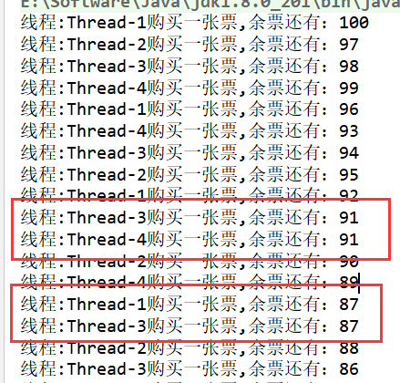

**我们发现可能会有多个线程卖同一张票的情况发生，这就是线程安全问题。**

**解决这样的问题就是线程同步的方式来实现。**


### 2.什么是线程的同步呢？


<font color='red'>**同步就是协同步调，按预定的先后次序进行运行。如：你说完，我再说。这里的同步千万不要==理解成那个同时进行==，应是指`协同`、`协助`、`互相配合`。线程同步是`指多线程通过特定的设置来控制线程之间的执行顺序（即所谓的同步）`，也可以说是在线程之间通过同步建立起执行顺序的关系，如果没有同步，那线程之间是各自运行各自的！**</font>


### **3.进程或线程同步互斥的控制方法**


> 线程就是程序的执行路线，即进程内部的控制序列，或者说是进程的子任务。线程，轻量级，不拥有自己独立的内存资源，共享进程的代码区、数据区、堆区(注意没有栈区)、环境变量和命令行参数、文件描述符、信号处理函数、当前目录、用户ID和组ID等资源。线程拥有自己独立的栈，因此也有自己独立的局部变量。一个进程可以同时拥有多个线程，即同时被系统调度的多条执行路线，但至少要有一个主线程。

1、临界区:通过对多线程的串行化来访问公共资源或一段代码，速度快，适合控制数据访问。

2、互斥量:为协调共同对一个共享资源的单独访问而设计的。

3、信号量:为控制一个具有有限数量用户资源而设计。

4、事 件:用来通知线程有一些事件已发生，从而启动后继任务的开始。


> 解释：


| 名字                                                  | 详情                                                         | 案例                                                         |
| ----------------------------------------------------- | ------------------------------------------------------------ | ------------------------------------------------------------ |
| **临界区(Critical Section)(同一个进程内，实现互斥）** | `保证在某一时刻只有一个线程能访问数据的简便办法`。在任意时刻只允许一个线程对共享资源进行访问。如果有多个线程试图同时访问临界区，那么在有一个线程进入后其他所有试图访问此临界区的线程将被挂起，并一直持续到进入临界区的线程离开。临界区在被释放后，其他线程可以继续抢占，并以此达到用原子方式操作共享资源的目的。 | 私人浴室（没有管理员）只有一间淋浴房，我想洗澡，我时不时来看下淋浴房空了没，空了我就去洗。 |
| **互斥量(Mutex)(可以跨进程，实现互斥）**              | 互斥量跟临界区很相似，`只有拥有互斥对象的线程才具有访问资源的权限`，由于互斥对象只有一个，因此就决定了任何情况下此共享资源都不会同时被多个线程所访问。当前占据资源的线程在任务处理完后应将拥有的互斥对象交出，以便其他线程在获得后得以访问资源。互斥量比临界区复杂。因为使用互斥不仅仅能够在同一应用程序不同线程中实现资源的安全共享，而且可以在不同应用程序的线程之间实现对资源的安全共享。互斥量与临界区的作用非常相似，但互斥量是可以命名的，也就是说它可以跨越进程使用。所以创建互斥量需要的资源更多，所以如果只为了在进程内部是用的话使用临界区会带来速度上的优势并能够减少资源占用量。 | 公共浴室(有管理员）只有一间淋浴房，我想洗澡，问了下管理员，有空的淋浴房么，如果有，管理员就让我洗，否则管理员就让我先去休息室睡一觉，等有空的淋浴房了叫醒我去洗澡。 |
| **信号量(Semaphores）(主要是实现同步，可以跨进程）**  | 信号量对象对线程的同步方式与前面几种方法不同`，信号允许多个线程同时使用共享资源`，这与操作系统中的PV操作相同。它指出了同时访问共享资源的线程最大数目。它允许多个线程在同一时刻访问同一资源，但是需要限制在同一时刻访问此资源的最大线程数目。一般是将当前可用资源计数设置为最大资源计数，每增加一个线程对共享资源的访问，当前可用资源计数就会减1，只要当前可用资源计数是大于0的，就可以发出信号量信号。但是当前可用计数减小到0时则说明当前占用资源的线程数已经达到了所允许的最大数目，不能在允许其他线程的进入，此时的信号量信号将无法发出 | 公共浴室(有管理员）有N间（资源数量限制）淋浴房，我想洗澡，问了下管理员，有空的淋浴房么，如果有，管理员就让我洗，否则管理员就让我先去休息室睡一觉，等有空的淋浴房了叫醒我去洗澡。 |
| **事件（Event)(实现同步，可以跨进程）**               | 事件对象也可以`通过通知操作的方式来保持线程的同步`。并且可以`实现不同进程中的线程同步操作`。 | 公共浴室(有管理员）只有一间淋浴房，我想洗澡，问了下管理员，有空的淋浴房么，如果淋浴房没人洗而且打扫完了(等待的事件），管理员就让我洗，否则管理员就让我先去休息室睡一觉，等没人洗而且打扫完了叫醒我去洗澡。 |


### 4.线程同步-synchronized同步锁


> 简介


在Java中，`synchronized`关键字是用来`控制线程同步的`，就是在多线程的环境下，控制`synchronized`代码段不被多个线程同时执行。

`synchronized`是Java中的关键字，是一种`同步锁`。它修饰的对象有以下几种：

1. **修饰一个代码块**，被修饰的代码块称为同步语句块，其作用的范围是大括号{}括起来的代码，作用的对象是调用这个代码块的对象；
2. **修饰一个方法**，被修饰的方法称为同步方法，其作用的范围是整个方法，作用的对象是调用这个方法的对象；
3. **修改一个静态的方法**，其作用的范围是整个静态方法，作用的对象是这个类的所有对象；
4. **修改一个类**，其作用的范围是synchronized后面括号括起来的部分，作用主的对象是这个类的所有对象。


> 详情


| 分类   | 具体分类           | 被锁对象       | 伪代码                                                       |
| ------ | ------------------ | -------------- | ------------------------------------------------------------ |
| 方法   | 实例方法           | 类的实例对象   | //实例方法，锁住的是该类的实例对象public   synchronized  void method1(){   } |
|        | 静态方法           | 类对象         | //静态方法，锁住的是类对象 public static synchronized void method2( ) { } |
| 代码块 | 实例对象           | 类的实例对象   | //同步代码块，锁住的是该类的实例对象 synchronized(this) { }  |
|        | class对象          | 类对象         | //同步代码块，锁住的是该类的类对象         synchronized (SynchronizedDemo.c1ass) {) |
|        | 任意实例对象Object | 实例对象Object | //同步代码块，锁住的是配置的实例对象,String对象作为锁             String lock = "”;             synchronized (lock){} |


> 代码


```java
public class TestSynchronized {
    public static void main(String[] args) {
        GouPiao2 gouPiao = new GouPiao2();
        Thread thread1 = new Thread(gouPiao);
        Thread thread2 = new Thread(gouPiao);
        Thread thread3 = new Thread(gouPiao);
        Thread thread4 = new Thread(gouPiao);
        thread1.start();
        thread2.start();
        thread3.start();
        thread4.start();
    }
}

class GouPiao2 extends Thread {
    //票数
    private Integer count = 100;

    @Override
    public void run() {
        while (true) {
            synchronized (this) {
                if (count > 0) {
                    System.out.println("线程:" + Thread.currentThread().getName() + "购买一张票,余票还有：" + (count--));
                } else {
                    break;
                }
            }
        }
    }
}
```


### 5.线程同步-重入锁Lock


> 简介


通过查看`Lock`的源码可知，`Lock`是一个接口，接口的实现类`ReentrantLock`, `ReentrantReadWriteLock`.`ReadLock`, `ReentrantReadWriteLock`.`WriteLock`

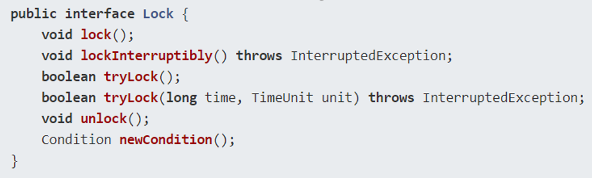

```java
void lock();
boolean tryLock();
boolean tryLock(long time, TimeUnit unit) 
void lockInterruptibly() //是用来获取锁的，
void unlock()//方法是用来释放锁的。
```


>  获取锁-lock()


`lock()`方法是平常使用得最多的一个方法，就是用来获取锁。如果锁已被其他线程获取，则进行等待。采用`Lock`，必须主动去释放锁，并且在发生异常时，不会自动释放锁。因此一般来说，使用`Lock`必须在`try{}catch{}`块中进行，并且将释放锁的操作放在finally块中进行，以保证锁一定被被释放，防止死锁的发生。通常使用`Lock`来进行同步的话，是以下面这种形式去使用的：


```java
Lock lock = new ReentrantLock();
lock.lock();
try {
    //**处理任务** *  
} catch (Exception ex) {
} finally {
   //**释放锁** *  
    lock.unlock();
} 
```


> 尝试获取锁-tryLock()


`tryLock()方法是有返回值的`，它表示用来**尝试获取锁**，如果获取**成功，则返回true，如果获取失败（即锁已被其他线程获取），则返回false**，也就说这个方法无论如何都会立即返回，在拿不到锁时也不会一直在那等待。

` tryLock(long time, TimeUnit unit)方法`和`tryLock()方法`是类似的，只不过区别在于这个方法在拿不到锁时**会等待一定的时间**，在时间期限之内如果还拿不到锁，就返回false。如果如果一开始拿到锁或者在等待期间内拿到了锁，则返回true。

所以，一般情况下通过tryLock来获取锁时是这样使用的：


```java
Lock lock = new ReentrantLock();
   if (lock.tryLock()) {
      try {
             //**处理任务** *
} catch (Exception ex) {
} finally {
   //**释放锁** *
    lock.unlock();  
  }
} else {
   //**如果不能获取锁，则直接做其他事情** *
}
```


>  特殊获取锁- lockInterruptibly()


`lockInterruptibly()`方法比较特殊，当通过这个方法去获取锁时，如果线程正在等待获取锁，则这个线程能够响应中断，即中断线程的等待状态。也就说，当两个线程同时通过`lock.lockInterruptibly()`想获取某个锁时，假若此时线程A获取到了锁，而线程B只有在等待，那么对线程B调用`threadB.interrupt()`方法能够中断线程B的等待过程。

由于`lockInterruptibly()`的声明中抛出了异常，所以`lock.lockInterruptibly()`必须放在try块中或者在调用`lockInterruptibly()`的方法外声明抛出`InterruptedException`。因此`lockInterruptibly()`一般的使用形式如下：

```java
public void method() throws InterruptedException {
    Lock lock = new ReentrantLock();
    lock.lockInterruptibly();
    try {
        //..... 
   } finally {
        lock.unlock();
   }
}
```


**<font color='red'>注意:当一个线程获取了锁之后，是不会被interrupt()方法中断的。因为单独调用interrupt()方法不能中断正在运行过程中的线程，只能中断阻塞过程中的线程。因此当通过lockInterruptibly()方法获取某个锁时，如果不能获取到，只有进行等待的情况下，是可以响应中断的。而用synchronized修饰的话，当一个线程处于等待某个锁的状态，是无法被中断的，只有一直等待下去。</font>**


>  等待通知组件-newCondition()


newCondition()获取等待通知组件，该组件和当前的锁绑定，当前线程只有获得了锁，才能调用该组件的wait()方法，而调用后，当前线程将释放锁。


> 案例


**注：**<font color='red'>ReentrantLock()还有一个可以创建公平锁的构造方法，但由于能大幅度降低程序运行效率，不推荐使用 </font>

```java
public class SellTicket implements Runnable {
    private int tickets = 100;
    private  Lock lock = new ReentrantLock();
    @Override
    public void run() {
        while(true) {
            // 在对共享数据tickets操作之前加锁
            lock.lock();
            try {
                if(tickets > 0) {
                    System.out.println(Thread.currentThread().getName() + "正在出票...   " + tickets--);
                    try {
                        Thread.sleep(10);
                    } catch (InterruptedException e) {
                        throw new RuntimeException(e);
                    }
                }else {
                    break;
                }
            }finally {
                // 在finally确保锁得到了释放。
                lock.unlock();
            }
        }
    }
}
```


###6.Lock与Synchronized


> <font color='black'>**1）`Lock`是一个接口，而`synchronized`是`Java`中的关键字，`synchronized`是内置的语言实现，`synchronized`是在`JVM层面`上实现的，不但可以通过一些监控工具监控`synchronized`的锁定，而且在代码执行时出现异常，`JVM`会自动释放锁定，但是使用`Lock`则不行，`lock`是通过代码实现的，要保证锁定一定会被释放，就必须将` unLock()`放到`finally{}` 中；**</font>
>
> <font color='black'>**2）`synchronized`在发生异常时，会自动释放线程占有的锁，因此不会导致死锁现象发生；而`Lock`在发生异常时，如果没有主动通过`unLock()`去释放锁，则很可能造成死锁现象，因此使用`Lock`时需要在`finally`块中释放锁；**</font>
>
> <font color='black'>**3）`Lock`可以让等待锁的线程响应中断，线程可以中断去干别的事务，而`synchronized`却不行，使用`synchronized`时，等待的线程会一直等待下去，不能够响应中断；**</font>
>
> <font color='black'>**4）通过Lock可以知道有没有成功获取锁，而`synchronized`却无法办到;**</font>
>
> <font color='black'>**5）`Lock`可以提高多个线程进行读操作的效率。**</font>

　　

在性能上来说，<font color='red'>**如果竞争资源不激烈，两者的性能是差不多的**</font>，**<font color='blue'>而当竞争资源非常激烈时（即有大量线程同时竞争）</font>**，此时Lock的性能要远远优于`synchronized`。所以说，在具体使用时要根据适当情况选择。


**举个例子：**当有多个线程读写文件时，读操作和写操作会发生冲突现象，写操作和写操作会发生冲突现象，但是读操作和读操作不会发生冲突现象。

+ 但是采用synchronized关键字来实现同步的话，就会导致一个问题：

    + 如果多个线程都只是进行读操作，所以当一个线程在进行读操作时，其他线程只能等待无法进行读操作。
    + 因此就需要一种机制来使得多个线程都只是进行读操作时，线程之间不会发生冲突，通过Lock就可以办到。
    + 另外，通过Lock可以知道线程有没有成功获取到锁。这个是synchronized无法办到的


### 7.Synchronized锁释放


> **前面我们用关键字`synchronized`构成同步代码块和同步方法，来实现多线程的同步，本质上我们可以理解为`底层的程序给线程加了一把我们看不见的隐藏的锁`，只有获取到这把锁的线程才能被执行，没拿到的线程你就给我等着，从而控制线程的执行顺序，达到同步效果，所以，任何线程进入同步代码块、同步方法之前，必须先获得对于同步监测器的锁定，那么谁释放对同步监测器的锁定呢？在Java中，程序无法显式的释放对同步监测器的锁定，释放权在底层的JVM上，`JVM会从释放机制中自动的释放`，**


<font color='red'>**下面看看都是在什么情况下会进行同步监测器锁定的释放呢，如下所示：**</font>


1. 当前线程的同步方法、同步代码块`执行结束`，当前线程即释放随同步监测器的锁定；

2. 当前线程的同步方法、同步代码块中遇到`break、return`终止了该代码块、方法的继续执行，当前线程会释放同步监测器的锁定；

3. 当前线程在同步方法、同步代码块中出现了`未处理的error或者exception`，导致了该代码块、该方法异常结束时，当前线程会释放同步监测器的锁定；

4. 当前线程执行同步代码块或同步方法时，程序调用了同步监测器的`wait()方法`，当前线程暂停，则当前线程会释放同步监测器的锁定。


<font color='red'>**但是在如下情况下，当前线程不会释放对同步监测器的锁定：**</font>


1. 线程执行同步代码块或者同步方法时，程序调用了`Thread.sleep()、Thread.yield()`方法来暂停当前线程执行，当前线程不会释放对同步监测器的锁定；

2. 线程执行同步代码块时，其他线程调用了该线程的`suspend()方法`*（suspend会阻塞线程直到另一个线程调用resume，这个方法容易死锁，已经不推荐使用了，了解一下就ok）*将该线程挂起，也不会释放同步监测器的锁定。


## 2.9：死锁


### 1.是什么


死锁是指两个或两个以上的进程在`执行过程中`(抢夺CPU执行)，由于竞争资源或者由于彼此通信而造成的一种阻塞的现象，若无外力作用，它们都将无法推进下去。此时称系统处于死锁状态或系统产生了死锁，这些永远在互相等待的进程称为死锁进程。

==案例==

先看生活中的一个实例，两个人面对面过独木桥，甲和乙都已经在桥上走了一段距离，即占用了桥的资源，甲如果想通过独木桥的话，乙必须退出桥面让出桥的资源，让甲通过，但是乙不服，为什么让我先退出去，我还想先过去呢，于是就僵持不下，导致谁也过不了桥，这就是死锁。

在计算机系统中也存在类似的情况。例如，某计算机系统中只有一台打印机和一台输入 设备，进程P1正占用输入设备，同时又提出使用打印机的请求，但此时打印机正被进程P2 所占用，而P2在未释放打印机之前，又提出请求使用正被P1占用着的输入设备。这样两个进程相互无休止地等待下去，均无法继续执行，此时两个进程陷入死锁状态。

> + 扩展
    > 	+ 数据库系统有监视、检测死锁的环节。当两个事务需要的锁相互依赖时，DB将选择一个牺牲者放弃这个事务，牺牲者会释放持有的资源，从而使其他事务顺利的执行。
           > 	+ JVM在解决死锁问题时并没有数据库系统那么强大，当一组线程发生死锁时，那么这写线程就凉凉——永远不会被使用。


### 2.产生原因


> **1、系统资源的竞争**


通常系统中拥有的不可剥夺资源，其数量不足以满足多个进程运行的需要，使得进程在运行过程中，会因争夺资源而陷入僵局，如磁带机、打印机等。只有对不可剥夺资源的竞争才可能产生死锁，对可剥夺资源的竞争是不会引起死锁的。


> **2、进程推进顺序非法**


进程在运行过程中，请求和释放资源的顺序不当，也同样会导致死锁。例如，并发进程 P1、P2分别保持了资源R1、R2，而进程P1申请资源R2，进程P2申请资源R1时，两者都会因为所需资源被占用而阻塞。

Java中死锁最简单的情况是，一个线程T1持有锁L1并且申请获得锁L2，而另一个线程T2持有锁L2并且申请获得锁L1，因为默认的锁申请操作都是阻塞的，所以线程T1和T2永远被阻塞了。导致了死锁。这是最容易理解也是最简单的死锁的形式。但是实际环境中的死锁往往比这个复杂的多。可能会有多个线程形成了一个死锁的环路，比如：线程T1持有锁L1并且申请获得锁L2，而线程T2持有锁L2并且申请获得锁L3，而线程T3持有锁L3并且申请获得锁L1，这样导致了一个锁依赖的环路：T1依赖T2的锁L2，T2依赖T3的锁L3，而T3依赖T1的锁L1。从而导致了死锁。

**************

从上面两个例子中，我们可以得出结论，产生死锁可能性的最根本原因是：**线程在获得一个锁L1的情况下再去申请另外一个锁L2，也就是锁L1想要包含了锁L2，也就是说在获得了锁L1，并且没有释放锁L1的情况下，又去申请获得锁L2，这个是产生死锁的最根本原因**。另一个原因是**默认的锁申请操作是阻塞的**。

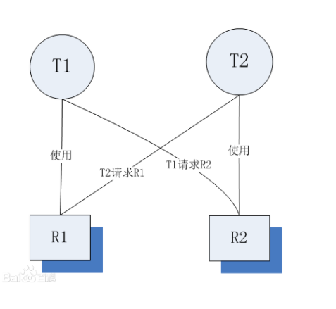

> **3.死锁产生的必要条件：**


<font color='red'>**产生死锁必须同时满足以下四个条件，只要其中任一条件不成立，死锁就不会发生。**</font>

| 条件           | 描述                                                         |
| -------------- | ------------------------------------------------------------ |
| 互斥条件       | 即当资源被一个线程使用(占有)时，别的线程不能使用             |
| 不剥夺条件     | 其他线程不能强行抢占线程 T1 占有的资源                       |
| 请求和保持条件 | 即当资源请求者在请求其他的资源的同时保持对原有资源的占有。   |
| 循环等待条件   | 即存在一个等待队列：P1占有P2的资源，P2占有P3的资源，P3占有P1的资源。这样就形成了一个等待环路。如`图1`所示。 |

**`直观上看：`**循环等待条件似乎和死锁的定义一样，其实不然。按死锁定义构成等待环所 要求的条件更严，它要求Pi等待的资源必须由P(i+1)来满足，而循环等待条件则无此限制。 ==例如==:==**<u>系统中有两台输出设备，P0占有一台，PK占有另一台，且K不属于集合{0, 1, ..., n}。</u>**

**<u>Pn等待一台输出设备，它可以从P1获得，也可能从PK获得</u>**。因此，虽然<u>**Pn、P0和其他 一些进程形成了循环等待圈，但PK不在圈内**</u>，若PK释放了输出设备，则可打破循环等待, 如`图2`所示。**因此循环等待只是死锁的必要条件。**

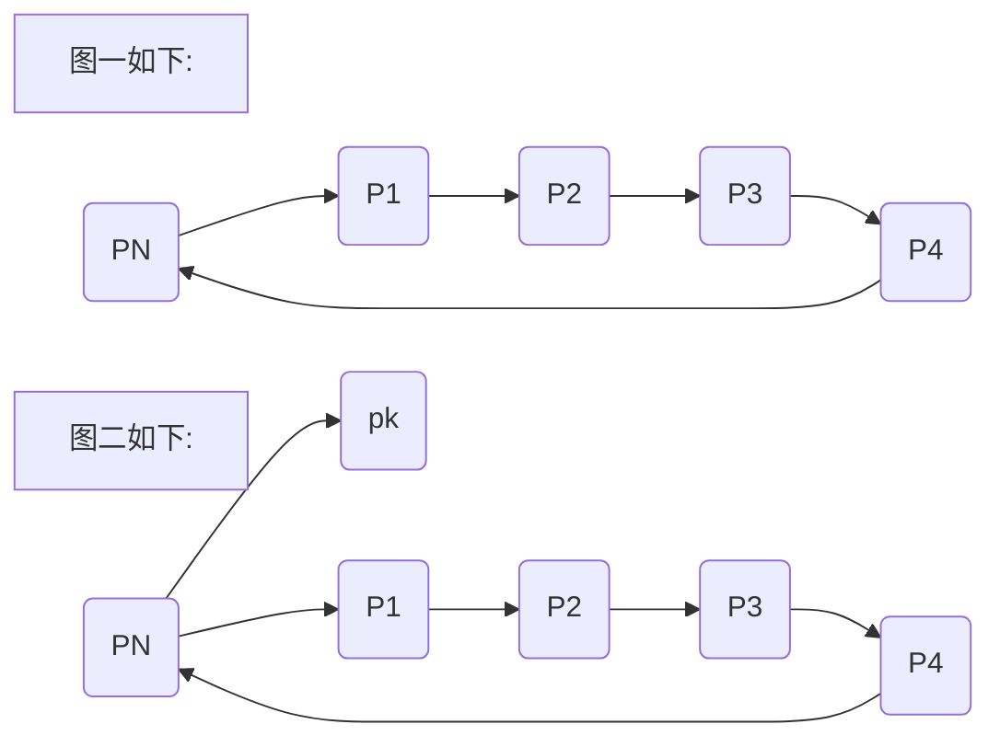

**资源分配图含圈而系统又不一定有死锁的原因是同类资源数大于1。但若系统中每类资 源都只有一个资源，则资源分配图含圈就变成了系统出现死锁的充分必要条件。**

下面再来通俗的解释一下死锁发生时的条件：

* **1.互斥条件：**一个资源每次只能被一个进程使用。独木桥每次只能通过一个人。
* **2.请求与保持条件：**一个进程因请求资源而阻塞时，对已获得的资源保持不放。乙不退出桥面，甲也不退出桥面。
* **3.不剥夺条件:** 进程已获得的资源，在未使用完之前，不能强行剥夺。甲不能强制乙退出桥面，乙也不能强制甲退出桥面。
* **4.循环等待条件**：若干进程之间形成一种头尾相接的循环等待资源关系。如果乙不退出桥面，甲不能通过，甲不退出桥面，乙不能通过。


### 3.锁循序死锁


> 两个线程试图通过不同的顺序获取多个相同的锁。如果请求的顺序不相同，那么会出现循环的锁依赖现象，产生死锁。但是如果保证同时请求锁L和锁M的每一个线程，都是按照从 L 到 M 的顺序，那么就不会发生死锁了。
>
> 简单那的来说如果一个线程调用了 leftRight, 另一个线程调用了 rightLeft，这样的交替运行，那么它们会发生死锁。线程 A 拿到了left锁，而线程 B 拿到了 right 锁，这个时候就陷入了相互等待的循环了。
>
> ```mermaid
> graph LR  
> 锁1-->锁住left-->尝试获取right-->永远等待
> 锁2-->锁住right-->尝试获取left-->永远等待
> 
> ```
>
> <font color='red'>**解决的办法是**:如果所有线程以通用的固定秩序获得锁，程序就不会出现锁顺序死锁问题了。</font>


**死锁案例：**

```java
/**
 * 循环死锁：
 * <p>
 * 两个线程试图通过不同的顺序获取多个相同的锁。如果请求的顺序不相同，那么会出现循环的锁依赖现象，产生死锁。
 * 但是如果保证同时请求锁L和锁M的每一个线程，都是按照从 L 到 M 的顺序，那么就不会发生死锁了。
 */
public class WhileDestoryLock {

    private static final Object left = new Object();
    private static final Object right = new Object();

    public static void main(String[] args) {
        //使用for循环是为了增大查看死锁出现的概率
        for (int i = 0; i < 100; i++) {
            new Thread(() -> {
                leftRight();
            }, "A").start();
        }
        for (int i = 0; i < 100; i++) {
            new Thread(() -> {
                rightLeft();
            }, "B").start();
        }

    }


    public static void leftRight() {
        // 得到left锁
        synchronized (left) {
            System.out.println("线程" + Thread.currentThread().getName() + "拿到left锁要right锁");
            // 得到right锁
            synchronized (right) {
                try {
                    //延迟执行时间，提高死锁概率
                    Thread.currentThread().sleep(20);
                } catch (InterruptedException e) {
                    e.printStackTrace();
                }
                System.out.println("线程" + Thread.currentThread().getName() + "拿到left和right锁");
            }
        }
    }

    public static void rightLeft() {
        // 得到right锁
        synchronized (right) {
            System.out.println("线程" + Thread.currentThread().getName() + "拿到right锁要left锁");
            // 得到left锁
            synchronized (left) {
                try {
                    //延迟执行时间，提高死锁概率
                    Thread.currentThread().sleep(30);
                } catch (InterruptedException e) {
                    e.printStackTrace();
                }
                System.out.println("线程" + Thread.currentThread().getName() + "拿到left和right锁");
            }
        }
    }

}
```


### 4.**动态的锁顺序死锁**


> 然而，有些时候并不是那么容易避免顺序死锁的发生。
>
> 由于方法入参由外部传递而来，方法内部虽然对两个参数按照固定顺序进行加锁，但是由于外部传递时顺序的不可控，而产生锁顺序造成的死锁，即动态锁顺序死锁。
>
> `如下代码：`


```java
public class DongWhileDestoryLock {
    public static void main(String[] args) {
        Trading trading = new Trading();
        for (int i = 0; i < 100; i++) {
            new  Thread(trading,"线程----->"+i).start();
        }
    }
}

class Trading implements Runnable {
    private Account xiaoMing = new Account("小明", 1000);
    private Account xiaoHong = new Account("小红", 1000);
/*
代码看起来是没有问题的：锁定两个账户来判断余额是否充足才进行转账！
但是，同样有可能会发生死锁：
1、如果两个线程同时调用transfer()
2、线程A从X账户向Y账户转账
3、线程B从账户Y向账户X转账
4、那么就会发生死锁。
*/
    @Override
    public void run() {
        System.out.println("");
        transfer(xiaoMing, xiaoHong, 100);
        transfer(xiaoHong, xiaoMing, 100);
        System.out.println("");
    }

    /**
     * 转账
     *
     * @param form  打钱账户
     * @param to    收钱账户
     * @param money 多少钱
     */
    private void transfer(Account form, Account to, double money) {
        synchronized (form) {
            System.out.println("线程：\t" + Thread.currentThread().getName() + ",\t拿到打钱账户：\t" + form.getName());
            synchronized (to) {
                System.out.println("线程：\t" + Thread.currentThread().getName() + ",\t拿到收钱账户：\t" + to.getName());
                if (form.getMoney() >= money) {
                    form.setMoney(form.getMoney() - money);
                    to.setMoney(to.getMoney() + money);
                    System.out.println("转账后,打钱账户：" + form.getName() + "有：" + form.getMoney());
                    System.out.println("转账后,收钱账户：" + to.getName() + "有：" + to.getMoney());
                } else {
                    System.out.println("账户余额不足！");
                }
            }
        }

    }
}

//余额类
class Account {
    private String name;
    private double money;

    public Account(String name, double money) {
        this.name = name;
        this.money = money;
    }

    public String getName() {
        return name;
    }

    public void setName(String name) {
        this.name = name;
    }

    public double getMoney() {
        return money;
    }

    public void setMoney(double money) {
        this.money = money;
    }

}
```


### 5.**协作对象间死锁**


> 上面讲的都是同一个类的对象之间发生的死锁，不同类的对象之间也会导致死锁，并且这种死锁更加隐蔽。


来一个案例吧！我们乘坐出租车来模拟一下：


```java
import java.util.HashSet;
import java.util.Set;

/**
 *案例说明：这是一个乘坐出租车的小程序：
 * 我们用户根据目的地地址来选车
 */

public class CooperatingDeadlock {
    //多运行几次就可以出现死锁现象
    public static void main(String[] args) {
        //一个程序调度中心
        final Dispatcher d1 = new Dispatcher();
        //提前备好一些车辆
        final Taxi t1 = new Taxi(d1, "北京");
        d1.addTaxi(t1);

        Thread thread1 = new Thread(new Runnable() {
            public void run() {
                //这一条线程是获取我们当前可以去的目的地的车辆
                d1.reportLocation();
            }
        });
        Thread thread2 = new Thread(new Runnable() {
            public void run() {
                //我们设置地址
                t1.setLocation("北京");
            }
        });
        thread1.start();
        thread2.start();
    }
}

/***
 * 这是一个程序调度类
 */
class Dispatcher {
    private Set<Taxi> taxis;//已有的车
    private Set<Taxi> availableTaxis;//可用的车

    public Dispatcher() {
        taxis = new HashSet<Taxi>();
        availableTaxis = new HashSet<Taxi>();
    }

    /**
     *添加车辆
     * @param taxi
     */
    public synchronized void notifyAvailable(Taxi taxi) {
        System.out.println(Thread.currentThread().getName() + "notifyAvailable.");
        availableTaxis.add(taxi);
    }

    /**
     *显示位置
     */
    public synchronized void reportLocation() {
        System.out.println(Thread.currentThread().getName() + "report location.");
        for (Taxi t : taxis) {
            t.getLocation();
        }
    }

    public void addTaxi(Taxi taxi) {
        taxis.add(taxi);
    }
}

 class Taxi {
    private String location;//本地
    private String destination;//目的地
    private Dispatcher dispatcher;

    public Taxi(Dispatcher dispatcher, String destination) {
        this.dispatcher = dispatcher;
        this.destination = destination;
    }

     /**
      * 获取目的地
      * @return
      */
    public synchronized String getLocation() {
        return this.location;
    }

     /**
      * 设置位置
      * @param location
      */
    public synchronized void setLocation(String location) {
        this.location = location;
        System.out.println(Thread.currentThread().getName() + "taxi set location:" + location);
        if (this.location.equals(destination)) {
            dispatcher.notifyAvailable(this);
        }
    }
}
```


上面的代码看着是不是没有一点问题啊！不可能出现死锁的啊！

> 上面的getImage()和setLocation(Point location)都需要获取两个锁的
>
> 并且在操作途中是没有释放锁的
>
> 这就是隐式获取两个锁(对象之间协作)..
>
> 这种方式也很容易就造成死锁.....


### 6.避免死锁的方法


> **避免死锁的方法**


避免死锁可以概括成三种方法：

- **固定加锁的顺序**(针对锁顺序死锁)
- **开放调用**(针对对象之间协作造成的死锁)
- **使用定时锁**-->tryLock()

- - 如果等待获取锁时间超时，则**抛出异常而不是一直等待**

-

### 7.锁循环死锁----解决


> - 我们解决这个<font color='red'>锁循环死锁</font>可以使用固定加锁顺序来加锁


```java
    public static void leftRight() {
        // 得到left锁
        synchronized (left) {
            System.out.println("线程" + Thread.currentThread().getName() + "拿到left锁要right锁");
            // 得到right锁
            synchronized (right) {
                try {
                    //延迟执行时间，提高死锁概率
                    Thread.currentThread().sleep(20);
                } catch (InterruptedException e) {
                    e.printStackTrace();
                }
                System.out.println("线程" + Thread.currentThread().getName() + "拿到left和right锁");
            }
        }
    }

    public static void rightLeft() {
        // 得到left锁
        synchronized (left) {
            System.out.println("线程" + Thread.currentThread().getName() + "拿到left锁要right锁");
            // 得到right锁
            synchronized (right) {
                try {
                    //延迟执行时间，提高死锁概率
                    Thread.currentThread().sleep(30);
                } catch (InterruptedException e) {
                    e.printStackTrace();
                }
                System.out.println("线程" + Thread.currentThread().getName() + "拿到left和right锁");
            }
        }
    }
```


### 8.动态的锁循环枷锁---解决


> + **固定加锁的顺序**(针对锁顺序死锁)不过需要采用hash值来比较


**在上面的代码中我们先比较两个账号的哈希值，==先获取哈希值大的对象的锁，再获取哈希值小的对象的锁。如果两个对象的哈希值相同，则先获取当前类对象的锁，再分别获取两个账号对象的锁，此时两个账号锁对象的顺序已经不重要了，因为即使两个帐户同时向对方转账，两个线程在获取CLASSNAME.class锁的时候只能有一个拿到锁，所以不会出现死锁==。除了哈希值之外我们还有更好的办法用于比较两个对象的大小，通常情况下我们的`对象都有一个唯一的ID(好比数据库id不重复)`，我们可以使用这个ID比较两个对象的大小，使用这种方法可以规避两个对象的哈希值相等的情况。**


```java
  private static final Object objLock = new Object();
    /**
     * 转账
     *
     * @param form  打钱账户
     * @param to    收钱账户
     * @param money 多少钱
     */
    private void transfer(Account form, Account to, double money) {
        //获取当前的hash值大小
        int formHash = form.hashCode();
        int toHash = to.hashCode();

        if (formHash < toHash) { //根据hash值来上锁
            synchronized (form) {
                System.out.println("线程：\t" + Thread.currentThread().getName() + ",\t拿到打钱账户：\t" + form.getName());
                synchronized (to) {
                    System.out.println("线程：\t" + Thread.currentThread().getName() + ",\t拿到收钱账户：\t" + to.getName());
                    if (form.getMoney() >= money) {
                        form.setMoney(form.getMoney() - money);
                        to.setMoney(to.getMoney() + money);
                        System.out.println("转账后,打钱账户：" + form.getName() + "有：" + form.getMoney());
                        System.out.println("转账后,收钱账户：" + to.getName() + "有：" + to.getMoney());
                    } else {
                        System.out.println("账户余额不足！");
                    }
                }
            }
        } else if (formHash > toHash) {//根据hash值来上锁
            synchronized (to) {
                System.out.println("线程：\t" + Thread.currentThread().getName() + ",\t拿到打钱账户：\t" + form.getName());
                synchronized (form) {
                    System.out.println("线程：\t" + Thread.currentThread().getName() + ",\t拿到收钱账户：\t" + to.getName());
                    if (form.getMoney() >= money) {
                        form.setMoney(form.getMoney() - money);
                        to.setMoney(to.getMoney() + money);
                        System.out.println("转账后,打钱账户：" + form.getName() + "有：" + form.getMoney());
                        System.out.println("转账后,收钱账户：" + to.getName() + "有：" + to.getMoney());
                    } else {
                        System.out.println("账户余额不足！");
                    }
                }
            }
        } else {// 额外的锁、避免两个对象hash值相等的情况(即使很少)
            synchronized (this){
                System.out.println("=============hash值相等=============");
                synchronized (form) {
                    synchronized (to) {
                        form.setMoney(form.getMoney() - money);
                        to.setMoney(to.getMoney() + money);
                        System.out.println("转账后,打钱账户：" + form.getName() + "有：" + form.getMoney());
                        System.out.println("转账后,收钱账户：" + to.getName() + "有：" + to.getMoney());
                    }
                }
            }
        }


    }
```


### 9.协作对象间死锁---解决


> **开放调用避免死锁**
>
> 在协作对象之间发生死锁的例子中，主要是因为在**调用某个方法时就需要持有锁**，并且在方法内部也调用了其他带锁的方法！
>
> - **如果在调用某个方法时不需要持有锁，那么这种调用被称为开放调用**！
>
> 我们可以这样来改造：
>
> - 同步代码块最好**仅被用于保护那些涉及共享状态的操作**！


使用开放调用是**非常好的一种方式**，应该尽量使用它~


```java
/***
 * 这是一个程序调度类
 */
class Dispatcher2 {
    private Set<Taxi2> taxis;//已有的车
    private Set<Taxi2> availableTaxis;//可用的车

    public Dispatcher2() {
        taxis = new HashSet<Taxi2>();
        availableTaxis = new HashSet<Taxi2>();
    }

    /**
     * 添加车辆
     *
     * @param taxi
     */
    public void notifyAvailable(Taxi2 taxi) {
        System.out.println(Thread.currentThread().getName() + "notifyAvailable.");
        availableTaxis.add(taxi);
    }

    /**
     * 显示位置
     */
    public void reportLocation() {
        // 加Dispatcher2内置锁
        Set<Taxi2> copy;
        synchronized (this) {
            copy = new HashSet<>(availableTaxis);
        }
        // 执行同步代码块后完毕，释放锁
        System.out.println(Thread.currentThread().getName() + "report location.");
        for (Taxi2 t : copy) {
            // 加Taix2内置锁
            t.getLocation();
        }
    }

    public void addTaxi(Taxi2 taxi) {
        taxis.add(taxi);
    }
}

class Taxi2 {
    private String location;//本地
    private String destination;//目的地
    private Dispatcher2 dispatcher;

    public Taxi2(Dispatcher2 dispatcher, String destination) {
        this.dispatcher = dispatcher;
        this.destination = destination;
    }

    /**
     * @return
     */
    public String getLocation() {
        return this.location;
    }

    /**
     * 设置位置
     *
     * @param location
     */
    public void setLocation(String location) {
        boolean reachedDestination;
        // 加Taxi2内置锁
        synchronized (this) {
            this.location = location;
            reachedDestination = this.location.equals(destination);
        }
        // 执行同步代码块后完毕，释放锁
        System.out.println(Thread.currentThread().getName() + "taxi set location:" + location);
        if (reachedDestination) {
            // 加Dispatcher2内置锁
            dispatcher.notifyAvailable(this);
        }
    }
}
```


### 10.使用定时锁--解决死锁


> **使用定时锁**
>
> + 使用显式Lock锁，在获取锁时使用tryLock()方法。当等待**超过时限**的时候，tryLock()不会一直等待，而是返回错误信息。
>
> + 使用tryLock()能够有效避免死锁问题~~
>
> + tryLock 是防止自锁的一个重要方式。
>
> + tryLock()方法是有返回值的，它表示用来尝试获取锁，如果获取成功，则返回true，如果获取失败（即锁已被其他线程获取），则返回false，这个方法无论如何都会立即返回。在拿不到锁时不会一直在那等待。


示例代码：`这里只是提提后面还会说`

```java
import java.util.concurrent.locks.Lock;
import java.util.concurrent.locks.ReentrantLock;

public class TryLock {
    public static void main(String[] args) {

        System.out.println("开始");
        final Lock lock = new ReentrantLock();
        new Thread() {
            @Override
            public void run() {
                String tName = Thread.currentThread().getName();
                if (lock.tryLock()) {
                    System.out.println(tName + "获取到锁！");
                } else {
                    System.out.println(tName + "获取不到锁！");
                    return;
                }
                try {
                    for (int i = 0; i < 5; i++) {
                        System.out.println(tName + ":" + i);
                    }
                    Thread.sleep(5000);
                } catch (Exception e) {
                    System.out.println(tName + "出错了！！！");
                } finally {
                    System.out.println(tName + "释放锁！！");
                    lock.unlock();
                }

            }
        }.start();

        new Thread() {
            @Override
            public void run() {
                String tName = Thread.currentThread().getName();

                if (lock.tryLock()) {
                    System.out.println(tName + "获取到锁！");
                } else {
                    System.out.println(tName + "获取不到锁！");
                    return;
                }

                try {
                    for (int i = 0; i < 5; i++) {
                        System.out.println(tName + ":" + i);
                    }

                } catch (Exception e) {
                    System.out.println(tName + "出错了！！！");
                } finally {
                    System.out.println(tName + "释放锁！！");
                    lock.unlock();
                }
            }
        }.start();
        System.out.println("结束");
    }
}
```


### 11.总结

发生死锁的原因主要由于：

- 线程之间交错执行

- - 解决：**以固定的顺序加锁**

- 执行某方法时就需要持有锁，且不释放

- - 解决：**缩减同步代码块范围，最好仅操作共享变量时才加锁**

- 永久等待

- - 解决：使用tryLock()定时锁，超过时限则返回错误信息


## 2.10：活锁


### 1.什么是活锁


> 活锁：是指线程1可以使用资源，但它很礼貌，让其他线程先使用资源，线程2也可以使用资源，但它很绅士，也让其他线程先使用资源。这样你让我，我让你，最后两个线程都无法使用资源。

‘

### 2.活锁与死锁形象比喻


- 死锁：迎面开来的汽车A和汽车B过马路，汽车A得到了半条路的资源（满足死锁发生条件1：资源访问是排他性的，我占了路你就不能上来，除非你爬我头上去），汽车B占了汽车A的另外半条路的资源，A想过去必须请求另一半被B占用的道路（死锁发生条件2：必须整条车身的空间才能开过去，我已经占了一半，尼玛另一半的路被B占用了），B若想过去也必须等待A让路，A是辆兰博基尼，B是开奇瑞QQ的屌丝，A素质比较低开窗对B狂骂：快给老子让开，B很生气，你妈逼的，老子就不让（死锁发生条件3：在未使用完资源前，不能被其他线程剥夺），于是==两者相互僵持一个都走不了（==死锁发生条件4：环路等待条件），而且导致整条道上的后续车辆也走不了。
- 活锁：马路中间有条小桥，只能容纳一辆车经过，桥两头开来两辆车A和B，A比较礼貌，示意B先过，B也比较礼貌，示意A先过，结果两人一直谦让谁也过不去。

简单的说，死锁两条线程互相争夺资源，谁不让谁，倔； 活锁就是两个线程都很文明，但是文明过头了，装；


### 3.案例


小明和小刚见面了，两个人都开始相互的鞠躬，一直不停息


```java
public class BowTest {
    /**假设有两个朋友见面,要鞠躬,其中一个开始鞠躬,另一个再鞠躬
     * 要求每次对方鞠躬,另外一方也要鞠躬还礼,如此循环.......
     * @param args
     */
    public static void main(String[] args) {
// TODO Auto-generated method stub
        final Person A = new Person("张三");
        final Person B = new Person("李四");
        new Thread(
                new Runnable() {
                    @Override
                    public void run() {
                        for(int i = 1;i <= 10;i ++){
                            A.bow(i);
                            B.bow(i);
                            try {
                                Thread.sleep((long)(Math.random()*5000));
                            } catch (InterruptedException e) {
// TODO Auto-generated catch block
                                e.printStackTrace();
                            }
                        }
                    }
                }
        ).start();
    }
    static class Person{
        public String name;
        public Person(String nam){
            this.name = nam;
        }
        public void bow(int index){
            synchronized (Person.class){
                System.out.println("你好！" + name + "第" + index + "次鞠躬!");
            }
        }
    }
}
```


## 2.11：附录


当线程死锁时线程处于阻塞状态，线程只占用内存空间，不占用CPU；而发生活锁时线程处于运行状态，既占用内存空间也占用CPU时间（有点像忙等待），因此活锁对系统性能的影响比死锁还要大。

在多线程的系统中，饥饿和活锁是常见的多线程问题，出现这两种情况都会导致系统性能下降。“不公平”是产生饥饿的主要原因，要想避免死锁只需要尽可能的减少“不公平”的情况，比如，不人为设置线程的优先级。产生活锁的主要原因是所有线程都无限制的重试，并且线程的步调惊人的一致，解决活锁可以为线程重试的次数设置一个最大值，并且引入一个随机变量，比如每个线程随机等待10-1000毫秒后重试，这样就避免了所有线程有相同的步调。


# 三、并发编程(三)


## 3.1：并发编程的源头


这些年，我们的 CPU、内存、I/O 设备都在不断迭代，不断朝着更快的方向努力。但是，在这个快速发展的过程中，有一个**核心矛盾一直存在，就是这三者的速度差异。**CPU 和内存的速度差异可以形象地描述为：CPU 是天上一天，内存是地上一年（假设 CPU 执行一条普通指令需要一天，那么 CPU 读写内存得等待一年的时间）。内存和 I/O 设备的速度差异就更大了，内存是天上一天，I/O 设备是地上十年。

程序里大部分语句都要访问内存，有些还要访问 I/O，根据木桶理论（一只水桶能装多少水取决于它最短的那块木板），程序整体的性能取决于最慢的操作——读写 I/O 设备，也就是说单方面提高 CPU 性能是无效的。

为了合理利用 CPU 的高性能，平衡这三者的速度差异，计算机体系结构、操作系统、编译程序都做出了贡献，主要体现为：

+ CPU 增加了缓存，以均衡与内存的速度差异；

+ 操作系统增加了进程、线程，以分时复用 CPU，进而均衡 CPU 与 I/O 设备的速度差异；

+ 编译程序优化指令执行次序，使得缓存能够得到更加合理地利用。


现在我们几乎所有的程序都默默地享受着这些成果，但是天下没有免费的午餐，并发程序很多诡异问题的`根源`也在这里。


## 3.2：缓存(内存)导致的可见性


### 1.什么是可见性


> <font color='red'>**1：一个线程对共享变量的修改，另外一个线程能够立刻看到，我们称为可见性。**</font>
>
>


### 2.CPU单核时代


在单核时代，所有的线程都是**在一颗 CPU 上执行**，CPU 缓存与内存的数据一致性容易解决。因为**所有线程都是操作同一个 CPU 的缓存，一个线程对缓存的写，对另外一个线程来说一定是可见的**。

例如在下面的图中，线程 A 和线程 B 都是操作同一个 CPU 里面的缓存，所以线程 A 更新了变量 V 的值，那么线程 B 之后再访问变量 V，得到的一定是 V 的最新值（线程 A 写过的值）。


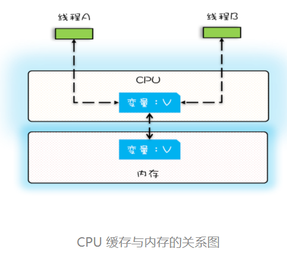


### 3.CPU多核时代


多核时代，每颗 CPU 都有自己的缓存，这时 CPU 缓存与内存的数据一致性就没那么容易解决了，当多个线程在不同的 CPU 上执行时，这些线程`操作的是不同的 CPU 缓存。`

比如下图中，线程 A 操作的是 CPU-1 上的缓存，而线程 B 操作的是 CPU-2 上的缓存，很明显，这个时候线程 A 对变量 V 的操作对于线程 B 而言就不具备可见性了。这个就属于硬件程序员给软件程序员挖的“坑”。


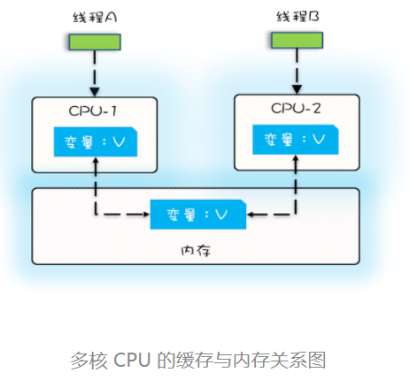


### 4.代码验证


下面我们再用一段代码来验证一下多核场景下的可见性问题。下面的代码，每执行一次 add10K() 方法，都会循环 10000 次 count+=1 操作。在 calc() 方法中我们创建了两个线程，每个线程调用一次 add10K() 方法，我们来想一想执行 calc() 方法得到的结果应该是多少呢？


```java
/**
 * 下面我们再用一段代码来验证一下多核场景下的可见性问题。
 * 下面的代码，每执行一次 add10K() 方法，都会循环 10000 次 count+=1 操作。
 * 在 calc() 方法中我们创建了两个线程，每个线程调用一次 add10K() 方法，我们来想一想执行 calc()
 * 方法得到的结果应该是多少呢？
 */
public class TestVisbility {
    private static long count = 0;

    private void add10K() {
        int idx = 0;
        while (idx++ < 10000) {
            count += 1;
        }
    }


    public static void main(String[] args) throws InterruptedException {
        final TestVisbility test = new TestVisbility();
        // 创建两个线程，执行add()操作
        Thread th1 = new Thread(() -> {
            test.add10K();
        });
        Thread th2 = new Thread(() -> {
            test.add10K();
        });
        // 启动两个线程
        th1.start();
        th2.start();
        // 等待两个线程执行结束
        th1.join();
        th2.join();
        System.out.println(count);//打印结果10000-->20000的随机数
    }
}
```


### 5.代码解惑


> 直觉告诉我们应该是 20000，因为在单线程里调用两次 add10K() 方法，count 的值就是 20000，但实际上 calc() 的执行结果是个 10000 到 20000 之间的随机数。为什么呢？


我们假设线程 A 和线程 B 同时开始执行，那么**<font color='red'>第一次都会将 count=0 读到各自的 CPU 缓存里，执行完 count+=1 之后，</font><font color='blue'>各自 CPU 缓存里的值都是 1，同时写入内存后，我们会发现内存中是 1，而不是我们期望的 2**。</font>之后由于各自的 CPU 缓存里都有了 count 的值，<font color='gree'>**两个线程都是基于 CPU 缓存里的 count 值来计算，所以导致最终 count 的值都是小于 20000 的**。</font>

==这就是缓存的可见性问题。==

循环 10000 次 count+=1 操作如果改为循环 1 亿次，你会发现效果更明显，最终 count 的值接近 1 亿，而不是 2 亿。如果循环 10000 次，count 的值接近 20000，原因是两个线程不是同时启动的，`有一个时差`。


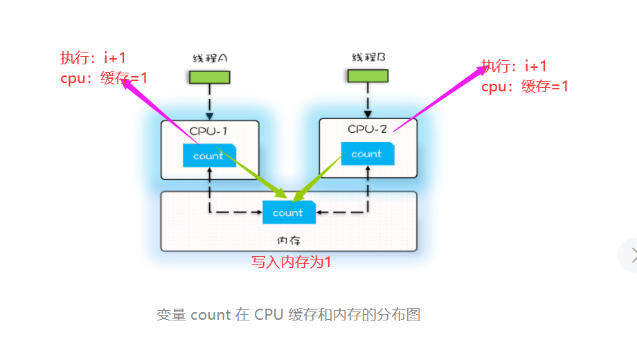

## 3.3：线程切换带来的原子性问题


### 1.什么是原子性


> <font color='red'>**我们把一个或者多个操作在 CPU 执行的过程中不被中断的特性称为原子性**</font>


### 2.时间片


由于 IO 太慢，早期的操作系统就发明了多进程，即便在单核的 CPU 上我们也可以一边听着歌，一边写 Bug，这个就是多进程的功劳。操作系统允许某个进程执行一小段时间，例如 50 毫秒，过了 50 毫秒操作系统就会重新选择一个进程来执行（我们称为“任务切换”），这个 50 毫秒称为“时间片”。


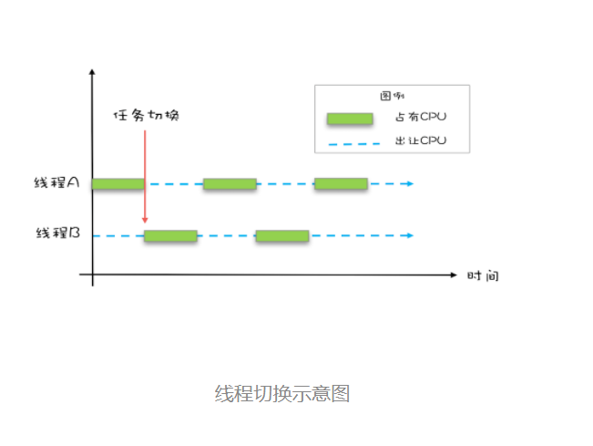

在一个时间片内，如果一个进程进行一个 IO 操作，例如读个文件，这个时候该进程可以把自己标记为“休眠状态”并出让 CPU 的使用权，待文件读进内存，操作系统会把这个休眠的进程唤醒，唤醒后的进程就有机会重新获得 CPU 的使用权了。

这里的进程在等待 IO 时之所以会释放 CPU 使用权，是为了让 CPU 在这段等待时间里可以做别的事情，这样一来 CPU 的使用率就上来了；此外，如果这时有另外一个进程也读文件，读文件的操作就会排队，磁盘驱动在完成一个进程的读操作后，发现有排队的任务，就会立即启动下一个读操作，这样 IO 的使用率也上来了。

是不是很简单的逻辑？

但是，虽然看似简单，支持多进程分时复用在操作系统的发展史上却具有里程碑意义，Unix 就是因为解决了这个问题而名噪天下的。

早期的操作系统基于进程来调度 CPU，不同进程间是不共享内存空间的，所以进程要做任务切换就要切换内存映射地址，而一个进程创建的所有线程，都是共享一个内存空间的，所以线程做任务切换成本就很低了。现代的操作系统都基于更轻量的线程来调度`，现在我们提到的“任务切换”都是指“线程切换”`。


### 3.java进行自加1


如上面代码中的count += 1，至少需要三条 CPU 指令。

+ 指令 1：首先，需要把变量 count 从内存加载到 CPU 的寄存器；

+ 指令 2：之后，在寄存器中执行 +1 操作；

+ 指令 3：最后，将结果写入内存（缓存机制导致可能写入的是 CPU 缓存而不是内存）。


操作系统做任务切换，可以发生在任何一条 CPU 指令执行完，是的，**是 CPU 指令**，而不是高级语言里的**一条语句**。对于上面的三条指令来说，我们假设 count=0，如果线程 A 在指令 1 执行完后做线程切换，线程 A 和线程 B 按照下图的序列执行，那么我们会发现两个线程都执行了 count+=1 的操作，但是得到的结果不是==我们期望的 2，而是 1。==


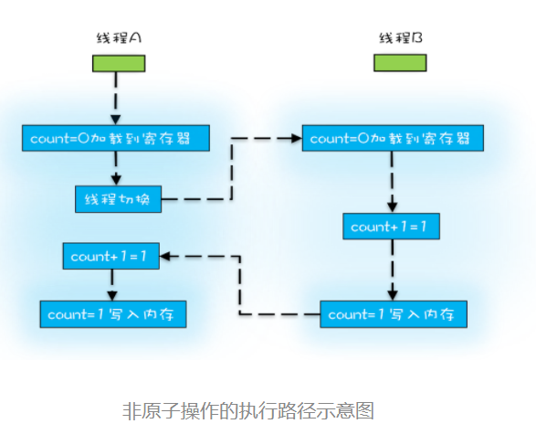

我们感觉 count+=1 这个操作就是一个不可分割的整体，就像一个原子一样，

线程的切换可以发生在 count+=1 之前，也可以发生在 count+=1 之后，但就是不会发生在中间。

我们把一个或者多个操作在 CPU 执行的过程中不被中断的特性称为原子性。CPU 能保证的原子操作是 CPU 指令级别的，而不是高级语言的操作符，这是违背我们直觉的地方。因此，很多时候我们需要在==高级语言层面保证操作的原子性==。


## 3.4：编译优化带来的有序性问题


### 1.编译优化带来的问题


看一段代码：


```java
public class Test {
        int a = 1;
        int b = 2;
}
```


如程序中：“a=6；b=7；”编译器优化后可能变成“b=7；a=6；”，在这个例子中，编译器调整了语句的顺序，但是不影响程序的最终结果。不过有时候编译器及解释器的优化可能导致意想不到的 Bug。


### 2.单例模式代码模板


```java
public class Singleton {
    private static   Singleton singleton;
    private Singleton(){

    }
    public  static  Singleton getInstance(){
        if (null==singleton){
            synchronized (Singleton.class){
                if (null==singleton){
                    singleton = new Singleton();
                }
            }
        }
        return singleton;
    }
}
```


### 3.代码问题及解析


> 假设有两个线程 A、B 同时调用 getInstance() 方法，他们会同时发现 instance == null ，于是同时对 Singleton.class 加锁，此时 JVM 保证只有一个线程能够加锁成功（假设是线程 A），另外一个线程则会处于等待状态（假设是线程 B）；线程 A 会创建一个 Singleton 实例，之后释放锁，锁释放后，线程 B 被唤醒，线程 B 再次尝试加锁，此时是可以加锁成功的，加锁成功后，线程 B 检查 instance == null 时会发现，已经创建过 Singleton 实例了，所以线程 B 不会再创建一个 Singleton 实例。


这看上去一切都很完美，无懈可击，但实际上这个 getInstance() 方法并不完美。问题出在哪里呢？出在 new 操作上，

+ 我们以为的 new 操作应该是：

    + 分配一块内存 M；
    + 在内存 M 上初始化 Singleton 对象；
    + 然后 M 的地址赋值给 instance 变量。

+ 但是实际上优化后的执行路径却是这样的：

    + 分配一块内存 M；
    + 将 M 的地址赋值给 instance 变量；
    + 最后在内存 M 上初始化 Singleton 对象。


> **优化后会导致什么问题呢？**<font color='red'>我们假设线程 A 先执行 getInstance() 方法，当执行完指令 2 时恰好发生了线程切换，切换到了线程 B 上；如果此时线程 B 也执行 getInstance() 方法，那么线程 B 在执行第一个判断时会发现 instance != null ，所以直接返回 instance，而此时的 instance 是没有初始化过的，如果我们这个时候访问 instance 的成员变量就可能触发空指针异常。</font>


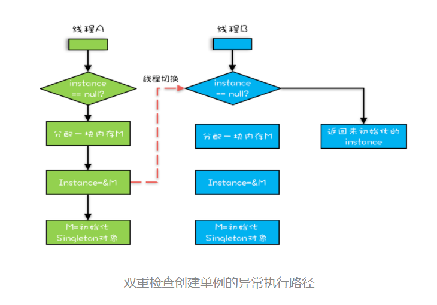

### 4.什么是有序性


<font color='red'>**程序执行的顺序按照代码的先后顺序执行，禁止进行指令重排序**</font>


## 3.5：可见性、原子性、有序性


### 1.是什么


| 名字   | 描述                                                       |
| ------ | ---------------------------------------------------------- |
| 原子性 | 指定代码块是原子操作。要么一起成功要么一起失败             |
| 可见性 | 修改共享变量时，立即同步到主存中，并使该修改对其他线程可见 |
| 有序性 | 程序执行的顺序按照代码的先后顺序执行，禁止进行指令重排序   |


## 3.6：总结


要写好并发程序，首先要知道并发程序的问题在哪里，只有确定了“靶子”，才有可能把问题解决，毕竟所有的解决方案都是针对问题的。并发程序经常出现的诡异问题看上去非常无厘头，但是深究的话，无外乎就是直觉欺骗了我们，只要我们能够深刻理解可见性、原子性、有序性在并发场景下的原理，很多并发 Bug 都是可以理解、可以诊断的。在介绍可见性、原子性、有序性的时候，特意提到缓存导致的可见性问题，线程切换带来的原子性问题，编译优化带来的有序性问题，其实缓存、线程、编译优化的目的和我们写并发程序的目的是相同的，都是提高程序性能。但是技术在解决一个问题的同时，必然会带来另外一个问题，所以在采用一项技术的同时，一定要清楚它带来的问题是什么，以及如何规避。我们这个专栏在讲解每项技术的时候，都会尽量将每项技术解决的问题以及产生的问题讲清楚，也希望你能够在这方面多思考、多总结。

**课后思考**

常听人说，在 32 位的机器上对 long 型变量进行加减操作存在并发隐患，到底是不是这样呢？


## 3.7：java内存模型(jmm)


### 1.什么是内存模型


jmm（java memory model）规范，他规范了java虚拟机与计算机内存如何协调工作 ，他规定了一个线程如何及何时看到其他线程修改过的变量的值，以及在必须时，如何同步的访问共享变量。


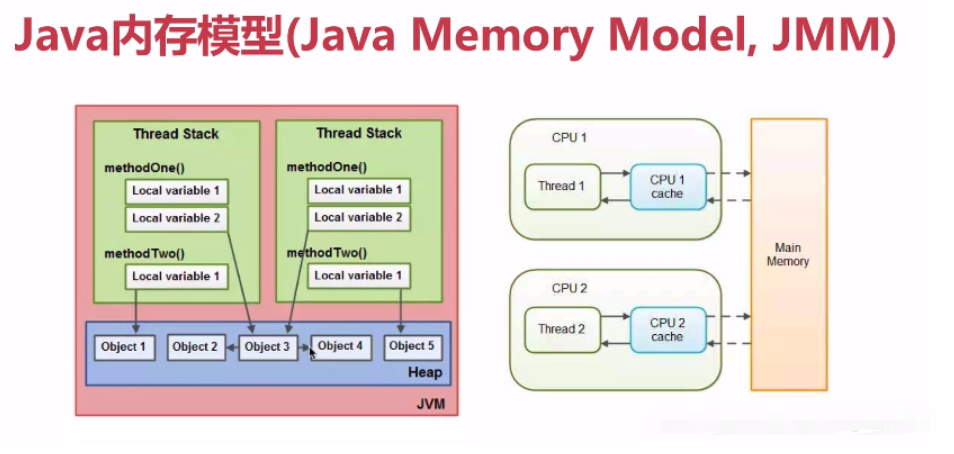


### 2.jmm内存分配的概念


+ **堆heap**： 优点：运行时数据区，动态分配内存大小，有gc；,缺点：因为要在运行时动态分配，所以存取速度慢，对象存储在堆上，静态类型的变量跟着类的定义一起存储在堆上。

+ **栈stack**：存取速度快，仅次于寄存器，缺点：数据大小与生存期必须是确定的，缺乏灵活性，栈中主要存放基本类型变量（比如，int,shot,byte,char,double,foalt,boolean和对象句柄），jmm要求，调用栈和本地变量存放在线程栈上

当一个线程可以访问一个对象时，也可以访问对象的成员变量，如果有两个线程访问对象的成员变量，则每个线程都有对象的成员变量的私有拷贝，


### 3.计算机 硬件架构


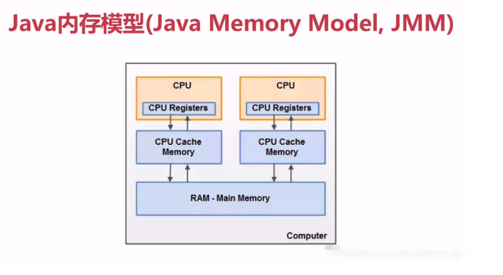


**处理器（cpu）**： 寄存器：每个cpu都包含一系列寄存器，他们是cpu的基础，寄存器执行的速度，远大于在主存上执行的速度

**cpu高速缓存**：由于处理器与内存访问速度差距非常大，所以添加了读写速度尽可能接近处理器的高速缓存，来作为内存与处理器之间的缓冲，将数据读到缓存中，让运算快速进行，当运算结束，再从缓存同步到主存中，就无须等待缓慢的内存读写了。处理器访问缓存的速度快与访问主存的速度，但比访问内部寄存器的速度还是要慢点，每个cpu有一个cpu的缓存层，一个cpu含有多层缓存，，某一时刻，一个或者多个缓存行可能同时被读取到缓存取，也可能同时被刷新到主存中，同一时刻，可能存在多个操作，

**内存**：一个计算机包含一个主存，所有cpu都可以访问主存，主存通常远大于cpu中的缓存，
运作原理： 通常，当一个cpu需要读取主存时，他会将主存的内容读取到缓存中，将缓存中的内容读取到内部寄存器中，在寄存器中执行操作，当cpu需要将结果回写到主存中时，他会将内部寄存器的值刷新到缓存中，然后会在某个时间点将值刷新回主存


### 4.jmm 和硬件内存架构


> jmm 和硬件内存架构
>
> + **硬件没有区分线程栈和堆，线程栈和堆主要在分布在主内存中，有时部分线程栈和堆会分布在cpu寄存器和cpu缓存中**


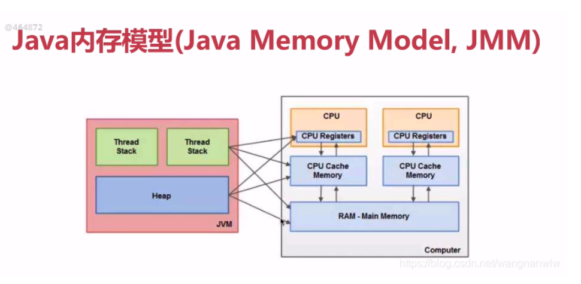


> jmm抽象结构


+ 所有的变量都存储在主内存中（操作系统给进程分配的内存空间）

+ 每个线程都有自己独立的工作内存，里面保存该线程使用到的变量的副本

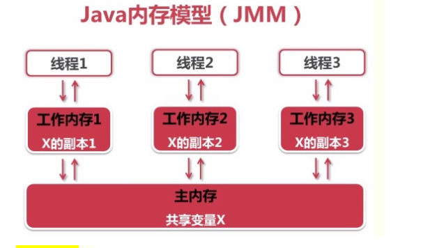

**特别注意:**

线程对共享变量的所有操作都必须在自己的工作内存（working memory,是cache和寄存器的一个抽象，而并不是内存中的某个部分）不同线程之间，当前线程无法直接访问其他线程的工作内存中的变量，线程间变量值得传递需要通过主内存来完成

==共享变量可见性的实现原理==

把工作内存1中更新过的共享变量刷新到主内存中

将主内存中最新的共享变量的值更新到工作内存2中


### 5.Java内存模型-同步八种操作


| name                                                  | message                                                      |
| ----------------------------------------------------- | ------------------------------------------------------------ |
| lock(锁定)<font color='white'>----------------</font> | 作用于主内存的变量,把一个变量标识为一条线程独占状态          |
| unlock(解锁)                                          | 作用于主内存的变量,把一个处于锁定状态的变量释放出来 , 释放后的变量才可以被其他线程锁定: |
| unlock(解锁)                                          | 作用于主内存的变量,把一个处于锁定状态的变量释放出来 , 释放后的变量才可以被其他线程锁定 |
| read(读取)                                            | 作用于主内存的变量 , 把一个变量值从主内存传输到线程的工作内存中,以便随后的load动作使用read(读取) : 作用于主内存的变量 , 把一个变量值从主内存传输到线程的工作内存中,以便随后的load动作使用 |
| load(载入)                                            | 作用域工作内存的变量，它把read操作从主内存中得到的变量值放入工作内存的变量副本中load(载入)：作用域工作内存的变量，它把read操作从主内存中得到的变量值放入工作内存的变量副本中 |
| use (使用)                                            | 作用于工作内存的变量 , 把工作内存中的一个变量值传递给执行引擎use (使用) : 作用于工作内存的变量 , 把工作内存中的一个变量值传递给执行引擎 |
| assign(赋值)                                          | 作用于工作内存的变量,它把一个从执行引擎接收到的值赋值给工作内存的变量 |
| store (存储)                                          | 作用于工作内存的变量 , 把工作内存中的一个变量的值传送到主内存中 , 以便随后的write的操作 |
| write (写入)                                          | 作用于主内存的变量, 它把store操作从工作内存中一个变量的值传送到主内存的变量中 |


### ## 6.Java内存模型-同步规则


> 1. **如果要把一个变量从主内存中复制到工作内存, 就需要按顺序地执 行read和load操作 , 如果把变量从工作内存中同步回主内存中, 就要按顺序地执行store和write操作. 但Java内存模型只要求上述操作必须按顺序执行,而没有保证必须是连续执行**
> 2. **不允许read和load、 store和write操作之一单独出现**
> 3. **不允许一个线程丢弃它的最近assign的操作,即变量在工作内存中改变了之后必须同步到主内存中**
> 4. **不允许一个线程无原因地(没有发生过任何assign操作)把数据从工作内存同步回主内存中**
> 5. **一个新的变量只能在主内存中诞生, 不允许在工作内存中直接使用一个未被初始化(load或assign)的变量。 即就是对一个变量实施use和store操作之前 , 必须先执行过了assign和load操作**
> 6. **一个变量在同一时刻只允许一条线程对 其进行lock操作 , 但lock操作可以被同一条线程重复执行多次,多次执行lock后,只有执行相同次数的unlock操作,变量才会被解锁。lock和unlock必须成对出现**
> 7. **如果对一个变量执行lock操作,将会清空工作内存中此变量的值, 在执行引擎使用这个变量前需要重新执行load或assign操作初始化变量的值**
> 8. **如果一个变量事先没有被lock操作锁定 , 则不允许 对它执行unlock操作 ; 也不允许去unlock一个被其他线程锁定的变量**
> 9. **对一个变量执行unlock操作之前 , 必须先把此变量同步到主内存中(执行store和write操作)**


## 3.8：volatile关键字


### 1.内存可见性代码


> **运行发现程序不会停止：**
>
> + 即使我们在子线程中将线程的共享变量flag的值修改成了false，
>
> + 但是主线程在while条件判断的时候读到的flag一直是false，这是什么原因导致的呢？
>
> **这就涉及到内存的可见性问题了，在讲怎么解决内存可见性问题之前，什么是内存可见性。**


```java
public class TestNoVolatile {
    public static void main(String[] args) {
        ThreadDemo td = new ThreadDemo();
        new Thread(td).start();
        while (true) {
            if (td.isFlag()) {
                System.out.println("--------主线中的程序读到flag为true了----------");
                break;
            }
        //这里不能有语句，有语句,循环之间就有间隙产生了时间分片
        }
    }
}

class ThreadDemo implements Runnable {
    private boolean flag = false;

    @Override
    public void run() {
        try {
            Thread.sleep(200);
        } catch (InterruptedException e) {
        }
        flag = true;
        System.out.println(Thread.currentThread().getName()+"flag=" + isFlag());
    }

    public boolean isFlag() {
        return flag;
    }

    public void setFlag(boolean flag) {
        this.flag = flag;
    }
}
```


### 2.volatile解决


> + 发现程序停止了


**volatile关键字实现可见性，尤其是在嵌入式开发中，这个关键字在多线程开发不可或缺**


```java
/***其他代码相同***/
private volatile boolean flag = false;
/****其他代码相同****/
```


### **3.synchronized**解决


JMM关于synchronized的两条规定：

+ 线程解锁前，必须把共享变量的最新值刷新到主内存中

+ 线程加锁时，将清空工作内存中共享变量的值，从而使用共享变量时需要从主内存中重新读取最新的值

**缺点：程序效率低，对计算机硬件资源是高开销动作。**

```java
public class TestSynchronized {
    public static void main(String[] args) {
        ThreadDemo3 td = new ThreadDemo3();
        new Thread(td).start();
        while (true) {
            synchronized (td){
                if (td.isFlag()) {
                    System.out.println("--------主线中的程序读到flag为true了----------");
                    break;
                }
            }
            //这里不能有语句，有语句,循环之间就有间隙产生了时间分片
        }
    }
}
class ThreadDemo3 implements Runnable {
    private  boolean flag = false;

    @Override
    public void run() {
        try {
            Thread.sleep(200);
        } catch (InterruptedException e) {
        }
        flag = true;
        System.out.println(Thread.currentThread().getName()+"flag=" + isFlag());
    }

    public boolean isFlag() {
        return flag;
    }

    public void setFlag(boolean flag) {
        this.flag = flag;
    }
}
```


### **4.synchronized和volatile比较**


+ volatile不需要加锁，比synchronized更轻量级，不会阻塞线程，效率更高

+ 从内存可见性角度讲，volatile读相当于加锁，volatile写相当于解锁

+ volatile不具备“互斥性”，synchronized就具备“互斥性”

**何为互斥性？**

比方说当我们用synchronize修饰方法，当一个线程抢到锁执行该方法后另一个线程无法再抢到锁执行该方法:

+ **synchronized既能保证可见性，又能保证原子性，**

+ **而volatile只能保证可见性，不能保证原子性。原子性下部分详细来讲！**

+ **如果能用volatile解决问题，还是应尽量使用`volatile`，因为它的`效率更高`**


## 3.9.使用Volatile困惑


### 1.困惑


> **Volatile：它最原始的意义就是禁用 CPU 缓存。**


**例如，我们声明一个 volatile 变量 volatile int x = 0，它表达的是：告诉编译器，对这个变量的读写，不能使用 CPU 缓存，必须从内存中读取或者写入。这个语义看上去相当明确，但是在实际使用的时候却会带来困惑。**

==cpu与内存的区别：redis数据库和mysql数据库==


> 示例代码
>
> + 假设线程 A 执行 writer() 方法，按照 volatile 语义，会把变量 “v=true” 写入内存；
>
> + 假设线程 B 执行 reader() 方法，同样按照 volatile 语义，线程 B 会从内存中读取变量 v，
>
> + 如果线程 B 看到 “v == true” 时，那么线程 B 看到的变量 x 是多少呢？
    > 	+ 直觉上是42但是需要看jdk版本
           > 	+ 如果在低于 1.5 版本上运行，x 可能是 42，也有可能是 0；
> 	+ 如果在 1.5 以上的版本上运行，x 就是等于 42。


```java
public class Test3 {
    public static void main(String[] args) {
        final VolatileExample volatileExample = new VolatileExample();
       while (true){
           new Thread(() -> {
               volatileExample.writer();
           }).start();
           new Thread(() -> {
               volatileExample.reader();
           }).start();
       }
    }
}

class VolatileExample {
    int x = 0;
    volatile boolean v = false;

    //写数据
    public void writer() {
        x = 42;
        v = true;
    }

    //读数据
    public void reader() {
        if (v == true) { // 这里x会是多少呢？
            System.out.println(x);//42
        }
    }
}
```


### 2.Happens-Before 规则


> #### 分析以下


分析一下，为什么 1.5 以前的版本会出现 x = 0 的情况呢？

这是由于变量 x 可能被 CPU 缓存而导致可见性问题。这个问题在 1.5 版本已经被圆满解决了。Java 内存模型在 1.5 版本对 volatile 语义进行了增强。怎么增强的呢？答案是一项` Happens-Before 规则`。Happens-Before（位于什么什么之前） 规则:


| Name                                             | Message                                                      |
| ------------------------------------------------ | ------------------------------------------------------------ |
| 程序次序规则<font color='white'>---------</font> | 一个线程内，按照代码顺序，书写在前面的操作先行发生于书写在后面的操作； |
| 管程序中锁定规则                                 | 一个 unLock 操作先行发生于后面对同一个锁的 lock 操作         |
| volatile 变量规则                                | 对一个变量的写操作先行发生于后面对这个变量的读操作           |
| 传递规则                                         | 如果操作A先行发生于操作B，而操作B又先行发生于操作C，则可以得出操作A先行发生于操作C |
| 线程start规则                                    | Thread对象的start()方法先行发生于此线程的每个一个动作        |
| 线程中断规则                                     | 对线程interrupt()方法的调用先行发生于被中断线程的代码检测到中断事件的发生 |
| 线程join规则                                     | 线程中所有的操作都先行发生于线程的终止检测，我们可以通过Thread.join()方法结束、Thread.isAlive()的返回值手段检测到线程已经终止执行； |
| 对象终结规则                                     | 一个对象的初始化完成先行发生于他的 finalize() 方法的开始；   |


### 3.Happens-Before-程序的顺序性规则


> 这条规则是指在一个线程中，按照程序顺序，前面的操作 Happens-Before 于后续的任意操作。

这还是比较容易理解的，比如刚才那段示例代码，按照程序的顺序，==第 6 行代码 “x = 42;” Happens-Before 于第 7 行代码 “v = true;”==，这就是规则 1 的内容，也比较符合单线程里面的思维**：程序前面对某个变量的修改一定是对后续操作可见的。**

**<font color='red'>简单的说就是禁止指令重排序：第6行的操作一定在第7行之前完成</font>**


> 代码

```java
class VolatileExample {
    int x = 0;
    volatile boolean v = false;
    //写数据
    public void writer() {
        x = 42;
        v = true;
    }
    //读数据
    public void reader() {
        if (v == true) { // 这里x会是多少呢？
            System.out.println(x);
        }
    }
}
```


### 4.Happens-Before-volatile 变量规则


> 这条规则是指对一个 volatile 变量的写操作， Happens-Before 于后续对这个 volatile 变量的读操作。

这个就有点费解了，对一个 volatile 变量的写操作相对于后续对这个 volatile 变量的读操作是可见的，这怎么看都是禁用缓存的意思啊，貌似和 1.5 版本以前的语义没有变化啊？如果单看这个规则，的确是这样，但是如果我们关联一下规则 3，就有点不一样的感觉了。


**<font color='red'>简单说：就是我们修改删除增加数据一定是在读数据之前完成的。</font>**


### 5.Happens-Before-传递性


> 这条规则是指如果 A操作 Happens-Before B操作，且 B操作 Happens-Before C操作，那么 A操作 Happens-Before C操作。

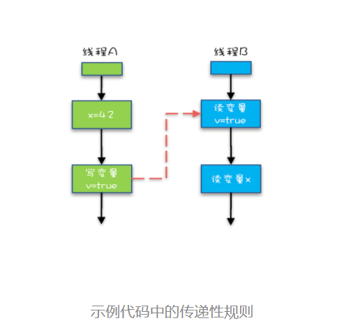


从图中，我们可以看到：

+ 1：“x=42” Happens-Before 写变量 “v=true” ，这是规则 1 的内容；
+ 2：写变量“v=true” Happens-Before 读变量 “v=true”，这是规则 2 的内容 。
+ 3：再根据这个传递性规则，我们得到结果：“x=42” Happens-Before 读变量“v=true”。这意味着什么呢？

**如果线程 B 读到了“v=true”，那么线程 A 设置的“x=42”对线程 B 是可见的。也就是说，线程 B 能看到 “x == 42”**


### 6.Happens-Before-管程中锁的规则


> 这条规则是指对一个锁的解锁 Happens-Before 于后续对这个锁的加锁。

要理解这个规则，就首先要了解“管程指的是什么”。管程是一种通用的同步原语，在 Java 中指的就是 synchronized，synchronized 是 Java 里对管程的实现。

管程中的锁在 Java 里是隐式实现的，例如下面的代码，在进入同步块之前，会自动加锁，而在代码块执行完会自动释放锁，加锁以及释放锁都是编译器帮我们实现的。

```java
synchronized (this) { //此处自动加锁 
    // x是共享变量,初始值=10 
    if (this.x < 12) { 
        this.x = 12; 
    } 
} //此处自动解锁
```

可以这样理解：

+ 假设 x 的初始值是 10，线程 A 执行完代码块后 x 的值会变成 12（执行完自动释放锁），
+ 线程 B 进入代码块时，能够看到线程 A 对 x 的写操作，也就是线程 B 能够看到 x==12。
+ 这个也是符合我们直觉的，应该不难理解。


### 7.Happens-Before-线程start原则


> 它是指主线程 A 启动子线程 B 后，子线程 B 能够看到主线程在启动子线程 B 前的操作。


换句话说就是，如果线程 A 调用线程 B 的 start() 方法（即在线程 A 中启动线程 B），==那么该 start() 操作 Happens-Before 于线程 B 中的任意操作==。具体可参考下面示例代码。

```java
public class Test4 {
  static   int var = 0;
    public static void main(String[] args) {
        while (true) {
            Thread thread = new Thread(() -> {
                // 主线程调用B.start()之前
                // 所有对共享变量的修改，此处皆可见
                // 此例中，var==77
                System.out.println("var:" + var);
            });
            // 此处对共享变量var修改
            var = 77;
            // 主线程启动子线程
            thread.start();
        }
    }
}
```


### 8.Happens-Before-线程 join() 规则


> 这条是关于线程等待的。它是指主线程 A 等待子线程 B 完成（主线程 A 通过调用子线程 B 的 join() 方法实现），当子线程 B 完成后（主线程 A 中 join() 方法返回），主线程能够看到子线程的操作。

当然所谓的“看到”，指的是对共享变量的操作。换句话说就是，如果在线程 A 中，调用线程 B 的 join() 并成功返回，那么线程 B 中的任意操作 Happens-Before 于该 join() 操作的返回。具体可参考下面示例代码。


```java
public class Test5 {
    static int var = 0;
    public static void main(String[] args) {
        while (true) {
            Thread B = new Thread(() -> {
                // 此处对共享变量var修改
                var = 66;
            });// 例如此处对共享变量修改，// 则这个修改结果对线程B可见
            // 主线程启动子线程
            B.start();
            try {
                if (B.isAlive()){
                    System.out.println(var);
                }
                /**
                 * 也可以使用以下方法
                 *    B.join();
                 *    // 子线程所有对共享变量的修改
                 *    // 在主线程调用B.join()之后皆可见
                 *    // 此例中，var==66
                 *    System.out.println(var);
                 */
            } catch (Exception e) {
                e.printStackTrace();
            }
        }
     }
}
```


### 9.Happens-Before-线程中断原则


> **对线程interrupt()方法的调用先行发生于被中断线程的代码检测到中断事件的发生，可以通过Thread.interrupted()方法检测到是否有中断发生。**


```java
public class Test6 {
  static   int var = 0;
    public static void main(String[] args) {
        while (true) {
            Thread thread = new Thread(() -> {
                var = 77;
                String s = new String("");
                s.equals("");
            });
            thread.start();
            System.out.println();
            System.out.println();
            System.out.println();
            System.out.println();
            if (!thread.isInterrupted()){
                System.out.println(var);
            }
        }
    }
}
```


### 10.Happens-Before-对象终结规则


> 一个对象的初始化完成(构造函数执行结束)先行发生于它的finalize()方法的开始。


### 11.被我们忽视的 final


前面我们讲 volatile 为的是禁用缓存以及编译优化，我们再从另外一个方面来看，有没有办法告诉编译器优化得更好一点呢？这个可以有，就是 final 关键字。final 修饰变量时，初衷是告诉编译器：这个变量生而不变，可以可劲儿优化。Java 编译器在 1.5 以前的版本的确优化得很努力，以至于都优化错了。问题类似于上一期提到的利用双重检查方法创建单例，构造函数的错误重排导致线程可能看到 final 变量的值会变化。当然了，在 1.5 以后 Java 内存模型对 final 类型变量的重排进行了约束。现在只要我们提供正确构造函数没有“逸出”，就不会出问题了。


### 12.Volatitle不能保证原子性


> 看下面的代码
>
> - 从A的帐户中减去1000块钱。如果A的帐户原来有3000块钱，现在就变成2000块钱了。
> - 在B的帐户里加1000块钱。如果B的帐户如果原来有2000块钱，现在则变成3000块钱了。
>
> 如果在A的帐户已经减去了1000块钱的时候，忽然发生了意外，比如停电什么的，导致转帐事务意外终止了，而此时B的帐户里还没有增加1000块钱。那么，我们称这个操作失败了，要进行回滚。回滚就是回到事务开始之前的状态，也就是回到A的帐户还没减1000块的状态，B的帐户的原来的状态。此时A的帐户仍然有3000块，B的帐户仍然有2000块。
>
> 我们把这种要么一起成功（A帐户成功减少1000，同时B帐户成功增加1000），
>
> 要么一起失败（A帐户回到原来状态，B帐户也回到原来状态）的操作叫原子性操作。


```java
public class TestAtomicDemo {
    public static void main(String[] args) {
        AtomicDemo ad = new AtomicDemo();
        for (int i = 0; i < 10; i++) {
            new Thread(ad).start();
        }
    }
}

class AtomicDemo implements Runnable{
    private volatile int serialNumber = 0; //线程共享变量
    @Override
    public void run() {
        try {
            Thread.sleep(1000);
        } catch (InterruptedException e) {
        }
        System.out.println(Thread.currentThread().getName()+"---------->"+getSerialNumber());
    }
    public int getSerialNumber(){
        return serialNumber++;
    }
}
/*
Thread-1---------->0
Thread-2---------->2
Thread-0---------->1
Thread-9---------->3
Thread-8---------->4
Thread-7---------->5
Thread-6---------->6
Thread-4---------->8
Thread-5---------->7
Thread-3---------->9
 */
```

自增操作是不具备原子性的，它包括读取变量的原始值、进行加1操作、写入工作内存。那么就是说自增操作的三个子操作可能会分割开执行，就有可能导致下面这种情况出现：

+ 假如某个时刻变量serialNumber的值为10，

+ 线程1对变量进行自增操作，线程1先读取了变量serialNumber的原始值，然后线程1被阻塞了；

+ 然后线程2对变量进行自增操作，线程2也去读取变量serialNumber的原始值，

+ 线程2会直接去主存读取serialNumber的值(volatile就是要直接从内存读取)，

+ 发现serialNumber的值时10，然后进行加1操作，并把11写入工作内存，最后写入主存。

回到线程1接着进行加1操作，由于已经读取了serialNumber的值，注意此时在线程1的工作内存中serialNumber的值仍然为10，所以线程1对serialNumber进行加1操作后inc的值为11，然后将11写入工作内存，最后写入主存。那么两个线程分别进行了一次自增操作后，serialNumber只增加了1。根源就在这里，自增操作不是原子性操作，而且volatile也无法保证对变量的任何操作都是原子性的。


> **上面的问题怎么解决呢？这个时候就要用到JUC了！**

JUC这个工具包里，有一个包含原子变量子包，java.util.concurrent.atomic，里边封装了一系列常用的数据类型对应的封装类，

Java.util.concurrent.atomic中实现的原子操作类包括：

AtomicBoolean、AtomicInteger、AtomicLong、AtomicReference。

> **这些类都保证了两点：**

1、类里的变量都用了volatile保证内存是可见的

2、使用了一个算法CAS，保证对这些数据的操作具有原子性

> 具体的代码上的修改：

```
class AtomicDemo implements Runnable{
   //private volatile int serialNumber = 0; //线程共享变量
   private AtomicInteger serialNumber  =  new AtomicInteger (0)；
   @Override
    public void run() {
        try {
            Thread.sleep(200);
        } catch (InterruptedException e) {
        }
        System.out.println(SerialNumber.get());
    }
    public int getSerialNumber(){
       // return serialNumber++;
 return serialNumber .getAndIncrement();
    }
}
```


**上面的代码就效率上讲，比synchronized和Lock实现的线程同步都高，**

**同时既保证了内存可见性，有保证了操作原子性，也解决了线程安全问题，是一种无锁的线程同步。**


##3.10.CAS算法


### 1.定义

一个线程失败或挂起并不会导致其他线程也失败或挂起，那么这种算法就被称为**非阻塞算法**。而CAS就是一种**非阻塞算法**实现，也是一种**乐观锁**技术，它能在不使用锁的情况下实现多线程安全，所以CAS也是一种无锁算法。

CAS ![[公式]](https://www.zhihu.com/equation?tex=%28Compare+And+Swap%29) 比较并交换，是一种实现并发算法时常用到的技术，Java并发包中的很多类都使用了CAS技术。CAS具体包括三个参数：<font color='red'>**当前内存值V、旧的预期值A**、**即将更新的值B**，</font>当且仅当预期值A和内存值V相同时，将内存值修改为B并返回true，否则什么都不做，并返回false。CAS 有效地说明了“ 我认为位置 V 应该包含值 A，如果真的包含A值，则将 B 放到这个位置，否则，不要更改该位置，只告诉我这个位置现在的值(A)即可。 ”整个比较并交换的操作是**原子操作**。

> ABA问题：
> ABA问题是CAS中的一个漏洞。CAS的定义，当且仅当内存值V等于就得预期值A时，CAS才会通过原子方式用新值B来更新V的值，否则不会执行任何操作。那么如果先将预期值A给成B，再改回A，那CAS操作就会误认为A的值从来没有被改变过，这时其他线程的CAS操作仍然能够成功，但是很明显是个漏洞，因为预期值A的值变化过了。如何解决这个异常现象？java并发包为了解决这个漏洞，提供了一个带有标记的原子引用类“AtomicStampedReference”，它可以通过控制变量值的版本来保证CAS的正确性，即在变量前面添加版本号，每次变量更新的时候都把版本号+1，这样变化过程就从“A－B－A”变成了“1A－2B－3A”。


### 2.CAS算法理解


CAS指令在Intel CPU上称为CMPXCHG指令，**它的作用是将指定内存地址的内容与所给的某个值相比，如果相等，则将其内容替换为指令中提供的新值，如果不相等，则更新失败。**这一比较并交换的操作是原子的，不可以被中断。初一看，CAS也包含了读取、比较 (这也是种操作)和写入这三个操作，和之前的i++并没有太大区别，的确在操作上没有区别，但**CAS是通过硬件命令保证了原子性**，而i++没有，且硬件级别的原子性比i++这样高级语言的软件级别的运行速度要快地多。虽然CAS也包含了多个操作，但其的运算是固定的(就是个比较)，这样的锁定性能开销很小。

简单的来说，**CAS有3个操作数，内存值V，旧的预期值A，要修改的新值B。当且仅当预期值A和内存值V相同时，将内存值V修改为B，否则返回V。**

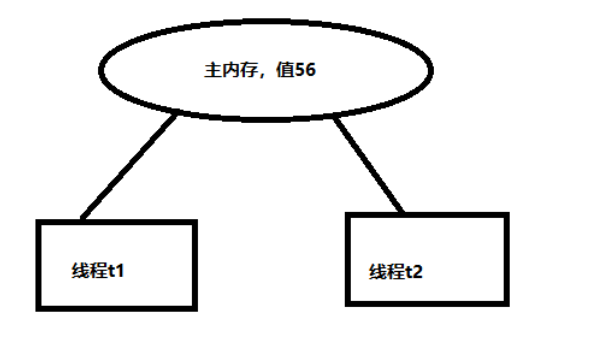

> + t1，t2线程是同时更新同一变量56的值
>
> + 因为t1和t2线程都同时去访问同一变量值56，所以他们会把主内存的值完全拷贝一份到自己的工作内存空间，所以t1和t2线程的预期值都为56。
>
> + 假设t1在与t2线程竞争中，线程t1竞争到了，能去更新变量的值，t2线程没争到。
>
>
>
> + 注意：失败的线程并不会被挂起，而是被告知这次竞争中失败，并可以再次发起尝试
    >
    > 	+ t1线程去更新变量值改为57，然后写到内存中。
           > 	+ 此时对于t2来讲它会检测到，内存值变为了57，与预期值56不一致，就不能把它修改的值写回主内存
>
> 	+ 就会判定就操作失败了（想改的值不再是原来的值，因为很明显，有其它操作先改变了这个值）


**总结CAS的核心逻辑：就是指当<font color='red'>V(内存值)</font>和<font color='red'>A(旧的预期值</font>)两者进行比较时，<font color='blue'>如果相等，则证明共享数据没有被修改，替换成新值，然后继续往下运行</font>；<font color='gree'>如果不相等，说明共享数据已经被修改，放弃已经所做的操作，然后重新执行刚才的操作</font>。这样子，就能保证操作的原子性了。**


# 四、并发编程(四)


## 4.1：等待通知


### 1.简介


在操作系统中，线程是个独立的个体，但是在线程执行过程中，如果处理同一个业务逻辑，可能会产生资源争抢，导致并发问题，通常使用`互斥`锁`来`控制该逻辑。但是在还有这样一类场景，任务`执行`是有顺序控制的，例如常见的报表数据生成：


- 启动数据分析任务，生成报表数据；
- 报表数据存入指定位置数据容器；
- 通知数据搬运任务，把数据写入报表库；

该场景在相对复杂的系统中非常常见，如果基于多线程来描述该过程，则需要线程之间通信协作，才能有条不紊的处理该场景业务。


### 2.等待通知机制


如上的业务场景，如果线程A生成数据过程中，线程B一直在访问数据容器，判断该过程的数据是否已经生成，则会造成资源浪费。正常的流程应该如图，线程A和线程B同时启动，线程A开始处理数据生成任务，线程B尝试获取容器数据，数据还没过来，线程B则进入等待状态，当线程A的任务处理完成，则通知线程B去容器中获取数据，这样基于线程等待和通知的机制来协作完成任务。


### 3.基础方法

等待/通知机制的相关方法是Java中Object层级的基础方法，任何对象都有该方法：

- `notify`：随机通知一个在该对象上等待的线程，使其结束wait状态返回；
- `notifyAll`：唤醒在该对象上所有等待的线程，进入对象锁争抢队列中；
- `wait`：线程进入`waiting`等待状态，不会争抢锁对象，也可以设置等待时间；


| method             | message                                                      |
| ------------------ | ------------------------------------------------------------ |
| wait()             | 线程调用wait()方法，**释放**它对锁的拥有权，同时他会在等待的位置加一个标志，为了以后使用`notify`()或者`notifyAll`()方法 唤醒它时，它好能从当前位置==获得锁的拥有权，变成就绪状态==，要确保调用wait()方法的时候**拥有锁**，即，`wait()方法`的调用必须放在`synchronized`方法或`synchronized`块中。 **在哪里等待被唤醒时，就在那里开始执行。** |
| notify/notifyAll() | **`notify()方法会唤醒一个等待当前对象的锁的线程。唤醒在此对象监视器上等待的单个线程。`**<br/>**`notifyAll（）方法会唤醒在此对象监视器上等待的所有线程。`** |


>  **当执行notify/notifyAll方法时，会唤醒一个处于等待该 对象锁 的线程，然后继续往下执行，直到执行完退出对象锁锁住的区域（synchronized修饰的代码块）后再释放锁。**
>
>  从这里可以看出，notify/notifyAll()执行后，并不立即释放锁，而是要等到执行完临界区中代码后，再释放。故，在实际编程中，我们应该尽量在线程调用notify/notifyAll()后，立即退出临界区。即不要在notify/notifyAll()后面再写一些耗时的代码。


```java
   public static void main(String[] args) {
        Taskr taskr = new Taskr();
        Taskr.add();
    }
    int num = 10;
    public  synchronized void add() {
        while (num == 0) {
            try {
                this. wait();
            } catch (InterruptedException e) {
                e.printStackTrace();
            }
        }
        num--;
        System.out.println(Thread.currentThread().getName()+":num:"+num);
        this.notify();
        System.out.println("==================");
    }
```


### 3.基本原理


等待/通知机制，该模式下指线程A在不满足任务执行的情况下调用对象wait()方法进入等待状态，线程B修改了线程A的执行条件，并调用对象notify()或者notifyAll()方法，线程A收到通知后从wait状态返回，进而执行后续操作。两个线程通过基于对象提供的wait()/notify()/notifyAll()等方法完成等待和通知间交互，提高程序的可伸缩性。


### 4.制作面包/买面包


> 简介


如大众所说，体现线程通信的鲜明的例子：生产者---消费者是最明显的例子之一。那我们接下来敲一个关于生产者和消费者的简单的小demo（生产者和消费者是一对一的模式），来演示一下线程的通信：


> 面包类


```java
public class Brend {
    private int id;
    private String name;
    private long price;


    public Brend(int id, String name, long price) {
        this.id = id;
        this.name = name;
        this.price = price;

    }

    public int getId() {
        return id;
    }

    public void setId(int id) {
        this.id = id;
    }

    public String getName() {
        return name;
    }

    public void setName(String name) {
        this.name = name;
    }

    public long getPrice() {
        return price;
    }

    public void setPrice(long price) {
        this.price = price;
    }

}
```


> 工厂类


```java
import java.util.ArrayList;
import java.util.List;
import java.util.UUID;

public class ProductFactory {
    private static final List<Brend> list = new ArrayList<>();

    public  static void makeBread() {
        synchronized (list) {
            if (list.size() <= 10) {
                    list.add(new Brend((int) Thread.currentThread().getId(), UUID.randomUUID().toString(), Thread.currentThread().getId()));
                System.out.println("生产面包成功，库存\t" + list.size());
                list.notify();
            } else {
                try {
                    list.wait();
                } catch (InterruptedException e) {
                    e.printStackTrace();
                }
            }
        }
    }
    public  static void removeBreak() {
        synchronized (list) {
            if (list.size() >= 10) {
                    list.remove(list.get(list.size() - 1));
                System.out.println("消费面包成功，库存\t" + list.size());
                list.notify();
            } else {
                try {
                    list.wait();
                } catch (InterruptedException e) {
                    e.printStackTrace();
                }
            }
        }
    }
}
```


> 消费者


```java
public class Coustemer implements Runnable {
    @Override
    public void run() {
        while (true) {
            ProductFactory.removeBreak();
        }
    }
}
```


> 生产者


```java
public class Production implements Runnable {

    @Override
    public void run() {
        while (true){
            ProductFactory.makeBread();
        }
    }
}
```


> 测试


```java
public class TestDemo1 {
    public static void main(String[] args) {
        Production production = new Production();
        Coustemer coustemer = new Coustemer();
        Thread thread1 = new Thread(production);
        Thread thread2 = new Thread(coustemer);
        Thread thread3 = new Thread(coustemer);
        Thread thread4 = new Thread(coustemer);
        thread1.start();
        thread2.start();
        thread3.start();
        thread4.start();
    }
}
```


### 5.备注


消费者/生产者模式后面会细致讲


### 6.尽量使用 notifyAll()


**在上面的代码中，我用的是`notify() `来实现通知机制，为什么不使用`  notifyAll()` 呢？这二者是有区别的，`notify() `是会随机地通知等待队列中的一个线程，而 notifyAll() 会通知等待队列中的所有线程。从感觉上来讲，应该是 `notify()` 更好一些，因为即便通知所有线程，也只有一个线程能够进入临界区。但那所谓的感觉往往都蕴藏着风险，实际上使用 `notify() `也很有风险，它的风险在于可能导致某些线程永远不会被通知到。假设我们有资源 A、B、C、D，线程 1 申请到了 AB，线程 2 申请到了 CD，此时线程 3 申请 AB，会进入等待队列（AB 分配给线程 1，线程 3 要求的条件不满足），线程 4 申请 CD 也会进入等待队列。我们再假设之后线程 1 归还了资源 AB，如果使用 `notify() `来通知等待队列中的线程，有可能被通知的是线程 4，但线程 4 申请的是 CD，所以此时线程 4 还是会继续等待，而真正该唤醒的线程 3 就再也没有机会被唤醒了。**

**<font color='red'>所以除非经过深思熟虑，否则尽量使用 notifyAll()。</font>**


### 7.总结


> **等待 - 通知机制是一种非常普遍的线程间协作的方式。工作中经常看到有同学使用轮询的方式来等待某个状态，其实很多情况下都可以用今天我们介绍的等待 - 通知机制来优化。Java 语言内置的 synchronized 配合 wait()、notify()、notifyAll() 这三个方法可以快速实现这种机制，但是它们的使用看上去还是有点复杂，所以你需要认真理解等待队列和 wait()、notify()、notifyAll() 的关系。最好用现实世界做个类比，这样有助于你的理解。**


## 4.2：管程


### 1.什么是管程


不知道你是否曾思考过这个问题：为什么 Java 在 1.5 之前仅仅提供了 `synchronized `关键字及 `wait()`、`notify()`、`notifyAll() `这三个看似从天而降的方法？在刚接触 Java 的时候，我以为它会提供信号量这种编程原语，因为操作系统原理课程告诉我，用信号量能解决所有并发问题，结果我发现不是。

后来我找到了原因：Java 采用的是管程技术，`synchronized `关键字及` wait()、notify()、notifyAll()` 这三个方法都是管程的组成部分。**而管程和信号量是等价的，所谓等价指的是用管程能够实现信号量，也能用信号量实现管程。**但是管程更容易使用，所以 Java 选择了管程。

管程，对应的英文是 `Monitor`，很多 Java 领域的同学都喜欢将其翻译成“监视器”，这是直译。操作系统领域一般都翻译成“管程”，这个是意译，而我自己也更倾向于使用“管程”。

所谓**管程，指的是管理共享变量以及对共享变量的操作过程，让他们支持并**发。翻译为 Java 领域的语言，就是管理类的成员变量和成员方法，让这个类是线程安全的。那管程是怎么管的呢？


### 2.MESA 模型


在管程的发展史上，先后出现过三种不同的管程模型，分别是：`Hasen 模型`、`Hoare 模型`和` MESA 模型`。其中，现在广泛应用的是` MESA 模型`，并且 Java 管程的实现参考的也是` MESA 模型`。所以今天我们重点介绍一下` MESA 模型`。

在并发编程领域，有两大核心问题：一个是`互斥`，即同一时刻只允许一个线程访问共享资源；另一个是`同步`，即线程之间如何通信、协作。这两大问题，管程都是能够解决的。

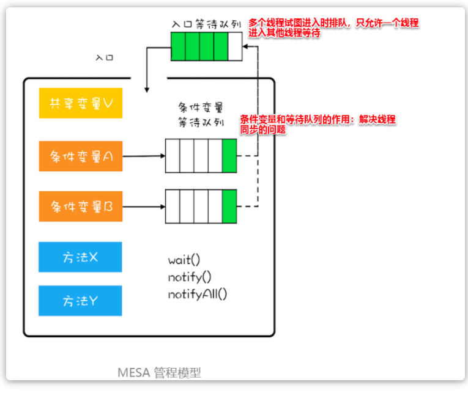

管程中引入了**条件变量的概念**，而且每个条件变量**都对应有一个等待队列**。**条件变量和等待队列的作用是解决线程之间的同步问题。**

我们来看一个例子来理解这个模型。多个线程对一个共享队列进行操作

假设线程T1要执行出队操作，但是这个操作要执行成功的前提是队列不能为空。这个队列不能为空就是管程里的条件变量。若是**线程T1进入管程后发现队列是空的**，那它就**需要在“队列不空”这个条件变量的等待队列中等待**。通过调用`wait()`实现。若是用对象A代表“队列不空”这个条件，那么线程T1需要调用`A.wait()`，来将自己阻塞。在线程T1进入条件变量的等待队列后，是允许其他线程进入管程的。

再假设之后另外一个线程T2执行了入队操作，入队操作成功之后，“队列不空”这个条件对于线程T1来说已经满足了，此时**线程T2要通知线程T1**，告诉它调用需要的条件已经满足了。那么线程T2怎么通知线程T1？线程T2调用`A.notify()`来通知A等待队列中的一个线程，此时这个线程里面只有T1，所以notify唤醒的就是线程T1，如果当这个条件变量的等待队列不止T1一个线程，我们就需要使用notifyAll()。当线程**T1得到通知后**，会从等待队列中出来，**重新进入到入口等待队列中**。

> 使用代码说明就如下：
> 注意，`await()`和前面的`wait()`的语义是一样的；`signal()`和前面的`notify()`语义是一样的（没有提到的`signalAll()`和`notifyAll()`语义也是一样的）。


```java
public class BlockedQueue<T>{
    final Lock lock = new ReentrantLock();
    // 条件变量：队列不满  
    final Condition notFull = lock.newCondition();
    // 条件变量：队列不空  
    final Condition notEmpty = lock.newCondition();

    // 入队
    void enq(T x) {
        lock.lock();
        try {
            while (队列已满){
                // 等待队列不满
                notFull.await();
            }  
            // 省略入队操作...
            // 入队后, 通知可出队
            notEmpty.signal();
        }finally {
            lock.unlock();
        }
    }
    // 出队
    void deq(){
        lock.lock();
        try {
            while (队列已空){
                // 等待队列不空
                notEmpty.await();
            }
            // 省略出队操作...
            // 出队后，通知可入队
            notFull.signal();
        }finally {
            lock.unlock();
        }  
    }
}
```


### 3.如何解决线程间的同步问题


在管程模型里，共享变量和对共享变量的操作是被封装起来的，图中最外层的框就代表封装的意思。

+ 框的上面只有一个入口，并且在入口旁边还有一个入口等待队列。
+ 当多个线程同时试图进入管程内部时，只允许一个线程进入，其他线程则在入口等待队列中等待。
+ 这个过程类似就医流程的分诊，只允许一个患者就诊，其他患者都在门口等待。

> 管程里还引入了条件变量的概念，而且**每个条件变量都对应有一个等待队列**，如下图，条件变量 A 和条件变量 B 分别都有自己的等待队列。

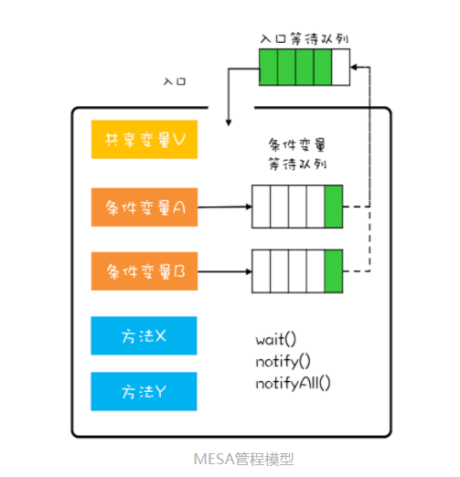

### 4.wait()的正确使用姿势


对于MESA管程来说，有一个编程范式：

```java
while(条件不满足) {
  wait();
}
```

我们在前面介绍[等待-通知机制](https://www.cnblogs.com/myworld7/p/12231936.html#_label3)时就提到过这种范式。这个范式可以解决“条件曾将满足过”这个问题。唤醒的时间和获取到锁继续执行的时间是不一致的，**被唤醒的线程再次执行时可能条件又不满足了，所以循环检验条件**。

MESA模型的wait()方法还有一个**超时参数，为了避免线程进入等待队列永久阻塞**。


> 为什么不适用if


**<font color='red'>当线程被唤醒后，是从wait命令后开始执行的(不是从头开始执行该方法，这点上老师的示意图容易让人产生歧义)，而执行时间点往往跟唤醒时间点不一致，所以条件变量此时不一定满足了，所以通过while循环可以再验证，而if条件却做不到，它只能从wait命令后开始执行，所以要用while</font>**


### 5.notify()和notifyAll()分别何时使用


满足以下三个条件时，可以使用notify()，其余情况尽量使用notifyAll()：

1. 所有等待线程拥有相同的等待条件；
2. 所有等待线程被唤醒后，执行相同的操作；
3. 只需要唤醒一个线程。


###6. 三种管程模型在通知线程上的区别

Hasen模型、Hoare模型和MESA模型的**一个核心区别是当条件满足后，如何通知相关线程**。

**管程要求同一时刻只允许一个线程执行**，**那当线程T2的操作使得线程T1等待的条件满足时，T1和T2究竟谁可以执行呢**？

1. 在Hasen模型里，要求**notify()放在代码的最后**，这样**T2通知完T1后，T2就结束了，然后T1再执行**这样就可以保证同一时刻只有一个线程执行。
2. 在Hoare模型里面，**T2通知完T1后，T2阻塞，T1马上执行；等T1执行完，再唤醒t2**。比起Hasen模型，T2多了一次阻塞唤醒操作。
3. 在MESA管程里，**T2通知完T1后，T2还是会接着执行**，T1并不立即执行，仅仅是**从条件变量的等待队列进入到入口等待队列中**（**但是T1再次执行时，可能条件又不满足了，所以需要循环防方式检验条件变量**）。这样的好处是：notify()代码不用放到代码的最后，T2也没有多余的阻塞唤醒操作。


### 7.Java语言的内置管程synchronized


Java 参考了 MESA 模型，语言内置的管程（synchronized）对 MESA 模型进行了精简。MESA 模型中，条件变量可以有多个，Java 语言内置的管程里只有一个条件变量。模型如下图所示。

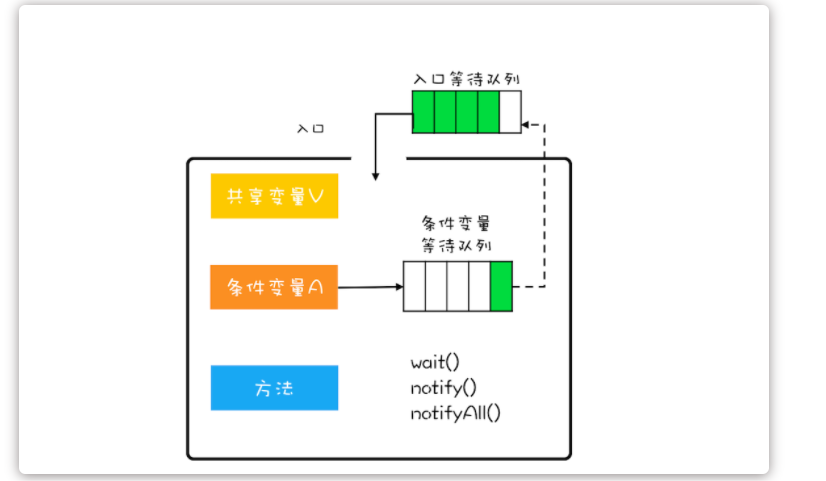


Java 内置的管程方案（synchronized）使用简单，synchronized 关键字修饰的代码块，在编译期会自动生成相关加锁和解锁的代码，但是仅支持一个条件变量；而 Java SDK 并发包实现的管程支持多个条件变量，不过并发包里的锁，需要我们自己进行加锁和解锁操作。


### 8.总结


1.管程是一种概念，任何语言都可以通用。

2.在java中，每个加锁的对象都绑定着一个管程（监视器）

3.线程访问加锁对象，就是去拥有一个监视器的过程。如一个病人去门诊室看医生，医生是共享资源，门锁锁定医生，病人去看医生，就是访问医生这个共享资源，门诊室其实是监视器（管程）。

4.所有线程访问共享资源，都需要先拥有监视器。就像所有病人看病都需要先拥有进入门诊室的资格。

5.监视器至少有两个等待队列。一个是进入监视器的等待队列一个是条件变量对应的等待队列。后者可以有多个。就像一个病人进入门诊室诊断后，需要去验血，那么它需要去抽血室排队等待。另外一个病人心脏不舒服，需要去拍胸片，去拍摄室等待。

6.监视器要求的条件满足后，位于条件变量下等待的线程需要重新在门诊室门外排队，等待进入监视器。就像抽血的那位，抽完后，拿到了化验单，然后，重新回到门诊室等待，然后进入看病，然后退出，医生通知下一位进入。

> 总结起来就是，管程就是一个对象监视器。任何线程想要访问该资源，就要排队进入监控范围。进入之后，接受检查，不符合条件，则要继续等待，直到被通知，然后继续进入监视器。


## 4.3：创建多少线程合适


### 1.前言


在 Java 领域，实现并发程序的主要手段就是多线程，使用多线程还是比较简单的，但是使用多少个线程却是个困难的问题。工作中，经常有人问，“**各种线程池的线程数量调整成多少是合适的？**”或者**“Tomcat 的线程数、Jdbc 连接池的连接数是多少？**”等等。那我们应该如何设置合适的线程数呢？要解决这个问题，首先要分析以下两个问题：

+ 为什么要使用多线程？
+ 多线程的应用场景有哪些？


### 2.为什么使用多线程


使用多线程，本质上就是提升程序性能。不过此刻谈到的性能，可能在你脑海里还是比较笼统的，基本上就是快、快、快，这种无法度量的感性认识很不科学，所以在提升性能之前，**首要问题是：如何度量性能。**

**度量性能的指标有很多，**但是有两个指标是最核心的，它们就是**延迟和吞吐量**。

+ 延迟指的是发出请求到收到响应这个过程的时间；延迟越短，意味着程序执行得越快，性能也就越好。
+ 吞吐量指的是在单位时间内能处理请求的数量；吞吐量越大，意味着程序能处理的请求越多，性能也就越好。


这两个指标内部有一定的联系（**同等条件下，延迟越短，吞吐量越大**），但是由于它们隶属不同的维度（**一个是时间维度，一个是空间维**度），并不能互相转换。**我们所谓提升性能，从度量的角度，主要是降低延迟，提高吞吐量**。这也是我们使用多线程的主要目的。那我们该怎么降低延迟，提高吞吐量呢？这个就要从多线程的应用场景说起了。


### 3.降低延迟，提高吞吐


+ 一个方向是优化算法，
+ 另一个方向是将硬件的性能发挥到极致。


> **在并发编程领域，提升性能本质上就是提升硬件的利用率，再具体点来说，就是提升 I/O 的利用率和 CPU 的利用率。**


**但是操作系统不能完美的解决：**

例如操作系统已经解决了磁盘和网卡的利用率问题，利用中断机制还能避免 CPU 轮询 I/O 状态，也提升了 CPU 的利用率。但是操作系统解决硬件利用率问题的对象往往是单一的硬件设备，而我们的并发程序，往往需要 CPU 和 I/O 设备相互配合工作，也就是说，我们需要解决 CPU 和 I/O 设备综合利用率的问题。关于这个综合利用率的问题，操作系统虽然没有办法完美解决，但是却给我们提供了方案，那就是：多线程。


> **如何利用多线程来提升 CPU 和 I/O 设备的利用率？**
>
> + 如果只有一个线程，执行 CPU 计算的时候，I/O 设备空闲；
>
> + 执行 I/O 操作的时候，CPU 空闲，所以 CPU 的利用率和 I/O 设备的利用率都是 50%。

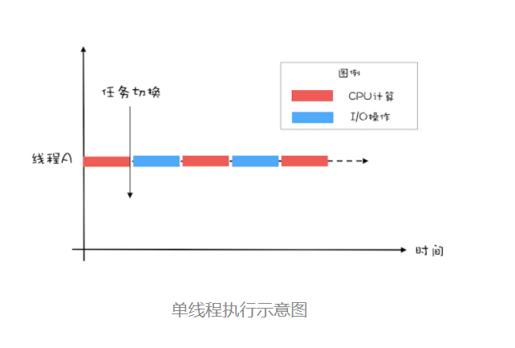

> + 如果有两个线程，如下图所示，当线程 A 执行 CPU 计算的时候，线程 B 执行 I/O 操作；
> + 当线程 A 执行 I/O 操作的时候，线程 B 执行 CPU 计算，
> + 这样 CPU 的利用率和 I/O 设备的利用率就都达到了 100%。

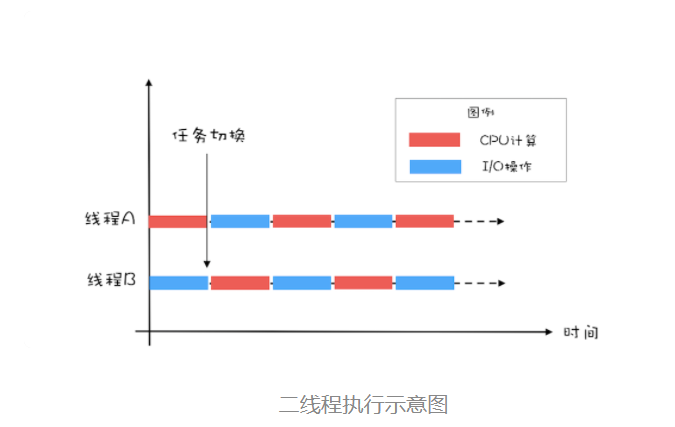


**我们将 CPU 的利用率和 I/O 设备的利用率都提升到了 100%，会对性能产生了哪些影响呢？通过上面的图示，很容易看出：单位时间处理的请求数量翻了一番，也就是说吞吐量提高了 1 倍。此时可以逆向思维一下，<font color='red'>如果 CPU 和 I/O 设备的利用率都很低，那么可以尝试通过增加线程来提高吞吐量。</font>**


### 4.创建多少线程合适呢？


> **创建多少线程合适，要看多线程具体的应用场景。我们的程序一般都是` CPU 计算`和 `I/O 操作`交叉执行的，由于` I/O 设备的速度`相对于` CPU `来说都很慢，所以大部分情况下`，I/O 操作执行的时间`相对于` CPU 计算`来说都非常长，这种场景我们一般都称为` I/O 密集型计算`；和` I/O 密集型计算`相对的就是` CPU 密集型计算了`，`CPU 密集型计算`大部分场景下都是`纯 CPU 计算``。I/O 密集型程序`和` CPU 密集型程序`，计算最佳线程数的方法是不同的。**


对于 I/O 密集型的计算场景，比如前面我们的例子中，

+ 如果 CPU 计算和 I/O 操作的耗时是 1:1，那么 2 个线程是最合适的。
+ 如果 CPU 计算和 I/O 操作的耗时是 1:2，那多少个线程合适呢？是 3 个线程，


**如下图所示：CPU 在 A、B、C 三个线程之间切换，对于线程 A，当 CPU 从 B、C 切换回来时，线程 A 正好执行完 I/O 操作。这样 CPU 和 I/O 设备的利用率都达到了 100%。**

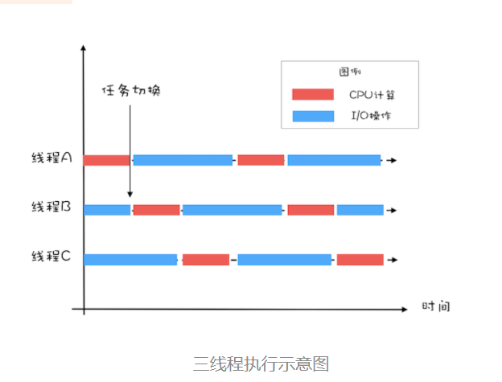


通过上面这个例子，我们会发现，对于 I/O 密集型计算场景，最佳的线程数是与程序中 CPU 计算和 I/O 操作的耗时比相关的，我们可以总结出这样一个公式：
$$
最佳线程数 =1 +（I/O 耗时 / CPU 耗时）
$$


我们令 R=I/O 耗时 / CPU 耗时，综合上图，可以这样理解：当线程 A 执行 IO 操作时，另外 R 个线程正好执行完各自的 CPU 计算。这样 CPU 的利用率就达到了 100%。不过上面这个公式是针对单核 CPU 的，至于多核 CPU，也很简单，只需要等比扩大就可以了，计算公式如下：


$$
最佳线程数 =CPU 核数 * [ 1 +（I/O 耗时 / CPU 耗时）]
$$


### 5.总结


很多人都知道线程数不是越多越好，但是设置多少是合适的，却又拿不定主意。其实只要把握住一条原则就可以了，**这条原则就是将硬件的性能发挥到极致。**上面我们针对 CPU 密集型和 I/O 密集型计算场景都给出了理论上的最佳公式，这些公式背后的目标其实就是将硬件的性能发挥到极致。对于 I/O 密集型计算场景，I/O 耗时和 CPU 耗时的比值是一个关键参数，不幸的是这个参数是未知的，而且是动态变化的，所以工程上，我们要估算这个参数，然后做各种不同场景下的压测来验证我们的估计。不过工程上，原则还是将硬件的性能发挥到极致，所以压测时，**我们需要重点关注 CPU、I/O 设备的利用率和性能指标（响应时间、吞吐量）之间的关系。**


## 4.4：如何写好并发程序


### 1.封装共享变量


面向对象思想里面有一个很重要的特性是**封装**，封装的通俗解释就是将属性和实现细节封装在对象内部**，外界对象只能通过目标对象提供的公共方法来间接访问这些内部属性**，这和门票管理模型匹配度相当的高，球场里的座位就是对象属性，球场入口就是对象的公共方法。我们把共享变量作为对象的属性，那对于共享变量的访问路径就是对象的公共方法，所有入口都要安排检票程序就相当于我们前面提到的并发访问策略。

**利用面向对象思想写并发程序的思路，**其实就这么简单：**将共享变量作为对象属性封装在内部，对所有公共方法制定并发访问策略。**就拿很多统计程序都要用到计数器来说，下面的计数器程序共享变量只有一个，就是 value，我们把它作为 Counter 类的属性，并且将两个公共方法 get() 和 addOne() 声明为同步方法，这样 Counter 类就成为一个线程安全的类了。


```java
public class Counter {
    private long value; 
    synchronized long get(){
        return value; 
    } 
    synchronized long addOne(){
        return ++value; 
    }
}
```


> 当然，实际工作中，很多的场景都不会像计数器这么简单，经常要面临的情况往往是有很多的共享变量，例如，信用卡账户有卡号、姓名、身份证、信用额度、已出账单、未出账单等很多共享变量。这么多的共享变量，如果每一个都考虑它的并发安全问题，那我们就累死了。但其实仔细观察，你会发现，很多共享变量的值是不会变的，例如信用卡账户的卡号、姓名、身份证。对于**这些不会发生变化的共享变量，建议你用 final 关键字来修饰。**这样既能避免并发问题，也能很明了地表明你的设计意图，让后面接手你程序的兄弟知道，你已经考虑过这些共享变量的并发安全问题了。


### 2.识别共享变量间的约束条件


> **识别共享变量间的约束条件非常重要。因为这些约束条件，决定了并发访问策略。**


例如，库存管理里面有个合理库存的概念，库存量不能太高，也不能太低，它有一个上限和一个下限。关于这些约束条件，我们可以用下面的程序来模拟一下。在类 SafeWM 中，声明了两个成员变量 upper 和 lower，分别代表库存上限和库存下限，这两个变量用了 AtomicLong 这个原子类，**原子类是线程安全的**，所以这两个成员变量的 set 方法就不需要同步了。


```java
public class SafeWM {
  // 库存上限
  private final AtomicLong upper =
        new AtomicLong(0);
  // 库存下限
  private final AtomicLong lower =
        new AtomicLong(0);
  // 设置库存上限
  void setUpper(long v){
    upper.set(v);
  }
  // 设置库存下限
  void setLower(long v){
    lower.set(v);
  }
  // 省略其他业务代码
}
```


> **所以说，在设计阶段，我们一定要识别出所有共享变量之间的约束条件，如果约束条件识别不足，很可能导致制定的并发访问策略南辕北辙。共享变量之间的约束条件，反映在代码里，基本上都会有 if 语句，所以，一定要特别注意竞态条件。**


### 3.制定并发访问策略


> **制定并发访问策略，是一个非常复杂的事情。应该说整个专栏都是在尝试搞定它。不过从方案上来看，无外乎就是以下“三件事”。**


+ 避免共享：避免共享的技术主要是利于线程本地存储以及为每个任务分配独立的线程。
+ 不变模式：这个在 Java 领域应用的很少，但在其他领域却有着广泛的应用，例如 Actor 模式、CSP 模式以及函数式编程的基础都是不变模式。
+ 管程及其他同步工具：Java 领域万能的解决方案是管程，但是对于很多特定场景，使用 Java 并发包提供的读写锁、并发容器等同步工具会更好。


### 4.宏观原则


+ 优先使用成熟的工具类：Java SDK 并发包里提供了丰富的工具类，基本上能满足你日常的需要，建议你熟悉它们，用好它们，而不是自己再“发明轮子”，毕竟并发工具类不是随随便便就能发明成功的。

+ 迫不得已时才使用低级的同步原语：低级的同步原语主要指的是 synchronized、Lock、Semaphore 等，这些虽然感觉简单，但实际上并没那么简单，一定要小心使用。

+ 避免过早优化：安全第一，并发程序首先要保证安全，出现性能瓶颈后再优化。在设计期和开发期，很多人经常会情不自禁地预估性能的瓶颈，并对此实施优化，但残酷的现实却是：性能瓶颈不是你想预估就能预估的。


## 4.5：juc中的同步容器类


> 在JavaSE基础课程中，我们给大家介绍了集合接口set，map，以及我们最常用的几个接口实现类，
>
> 如：HashMap，HashSet，ArrayList...等等，但是我们在前面，没涉及这些集合的线程安全问题，
>
> 在这里我们先总结一下，那些集合线程安全，那些集合非线程安全。


### 1.常见类


| className     | message    |
| ------------- | ---------- |
| Vector        | 线程安全   |
| HashTable     | 线程安全   |
| StringBuffer  | 线程安全   |
| ArrayList     | 线程不安全 |
| LinkedList    | 线程不安全 |
| HashMap       | 线程不安全 |
| HashSet       | 线程不安全 |
| TreeMap       | 线程不安全 |
| TreeSet       | 线程不安全 |
| StringBulider | 线程不安全 |


### 2.不使用juc工具类如何做到安全


以前都是使用的`Collections.synchronizedXXX()`方法来转换！

```java
List li = Collections.synchronizedList(new ArrayList<>());

Map map = Collections.synchronizedMap(new HashMap<>());

//当转换HashMap的时候
Collections.synchronizedMap(new HashMap<>())，还可以直接使用HashTable
```


HashMap和HashTable的数据结构都是一样的Key—Value，所以可以替换，**一个线程不安全，一个现在安全。**


### 3.juc解决


> **一是程序效率低，这是主要问题；**
>
> **二是在复合操作的时候会报并发修改异常；**

+ JUC里的ConcurrentHashMap优于同步的HashMap

+ JUC里的ConcurrentSkipListMap优于同步的TreeMap

+ JUC里的CopyOnWriteArrayList优于同步的ArrayList

+ JUC里的CopyOnWriteArraySet优于同步的ArraySet


##4.6：CountDownLatch


### 1.简介


> **CountDownLatch一个同步辅助类，在完成一组正在其他线程中执行的操作之前，它允许一个或多个线程一直等待;**


闭锁：在完成某些运算时，只有其他所有线程的运算全部完成，当前运算才会继续执行


### 2.计算多线程执行的时间


java中多线程的主线程是main线程，我们这个时候开启10个子线程我们计算一下这个执行时间。

平时解决：

```java
public class TestCountDownLatch {
    public static void main(String[] args) {
        LatchDemo runnable = new LatchDemo(cdl);
        long start = System.currentTimeMillis();
        for (int i = 0; i < 10; i++) {
            new Thread(runnable).start();
        }
        System.out.println("耗费时间为：" + (end - start));
    }
}

class LatchDemo implements Runnable {
    @Override
    public void run() {
        for (int i = 0; i < 50000; i++) {
            if (i % 2 == 0) {
                System.out.println(i);
            }
        }

    }
}
```


> 我们发现根本计算不出来


```java
/*
1.一个线程或多个线程一直等待，直到其他线程执行的操作完成。

2.CountDownLatch用一个给定的计数器来初始化，该计数器的操作是原子操作，即同时只能有一个线程去操作该计数器。
3.调用该类await方法的线程会一直处于阻塞状态，直到其他线程调用countDown方法，每次调用countDown方法，

4.计数器的值减1。当计数器值减至零时，所有因调用await()方法而处于等待状态的线程就会继续往下执行。
* */
public class TestCountDownLatch {
    public static void main(String[] args) {
        final CountDownLatch latch = new CountDownLatch(5);
        LatchDemo runnable = new LatchDemo(latch);
        long start = System.currentTimeMillis();
        for (int i = 0; i < 5; i++) {
            new Thread(runnable).start();
        }
        try {
            latch.await();//他会判断当前计数器是否为0，不为0会进入闭锁状态，为0的时候才会执行下面计算
        } catch (InterruptedException e) {
            e.printStackTrace();
        }
        long end = System.currentTimeMillis();
        System.out.println("耗费时间为：" + (end - start));
    }
}

class LatchDemo implements Runnable {
    private CountDownLatch countDownLatch;

    public LatchDemo(CountDownLatch countDownLatch) {
        this.countDownLatch = countDownLatch;
    }

    @Override
    public void run() {
        synchronized (this) {//防止进到死锁
            try {
                for (int i = 0; i < 50000; i++) {
                    if (i % 2 == 0) {
                        System.out.println(i);
                    }
                }
            } catch (Exception e) {

            }finally {
                //如果有异常照常执行,计数器减一的操作
                countDownLatch.countDown();
            }
        }
    }
}
```


### 3.小案例


流水线制作手机，我们知道手机制作，可以分为流水线，那么组装的一步肯定在最后。

手机壳、手机主板、手机屏幕等可以多条流水线一块完成，但是手机组装是不可能的，他必须需要手机零件都完后才可以

```java
public class TestCountDownLatchDemo {
    public static void main(String[] args) {
        final CountDownLatch countDownLatch = new CountDownLatch(3);
        Phone phone = new Phone(countDownLatch);
        new Thread(phone, "主板").start();
        new Thread(phone, "屏幕").start();
        new Thread(phone, "后壳").start();
        try {
            countDownLatch.await(1, TimeUnit.MINUTES);
        } catch (InterruptedException e) {
            e.printStackTrace();
        }
        System.out.println("组装手机");
    }
}

class Phone implements Runnable {
    private CountDownLatch countDownLatch;

    public Phone(CountDownLatch countDownLatch) {
        this.countDownLatch = countDownLatch;
    }

    @Override
    public void run() {
        synchronized (this){
            try {
                System.out.println("生产零件：" + Thread.currentThread().getName());

            }catch (Exception e){

            }finally {
                this.countDownLatch.countDown();
            }
        }
    }
}
```


### 4.总结


**CountDownLatch是一个计数器闭锁，通过它可以完成类似于阻塞当前线程的功能，**

即：

+ 一个线程或多个线程一直等待，直到其他线程执行的操作完成。

+ CountDownLatch用一个给定的计数器来初始化，该计数器的操作是原子操作，即同时只能有一个线程去操作该计数器。

+ 调用该类await方法的线程会一直处于阻塞状态，直到其他线程调用countDown方法，每次调用countDown方法，

+ 计数器的值减1。当计数器值减至零时，所有因调用await()方法而处于等待状态的线程就会继续往下执行


## 4.7：Semaphore信号量


### 1.简介


**Semaphore，现在普遍翻译为“信号量”，以前也曾被翻译成“信号灯”，因为类似现实生活里的红绿灯，车辆能不能通行，要看是不是绿灯。同样，在编程世界里，线程能不能执行，也要看信号量是不是允许。**


### 2.信号量模型


**信号量模型还是很简单的，可以简单概括为：`一个计数器``，一个等待队列`，`三个方法`。在信号量模型里，计数器和等待队列对外是透明的，所以只能通过信号量模型提供的三个方法来访问它们，这三个方法分别是：`init()`、`down()` 和 `up()`。你可以结合下图来形象化地理解。**


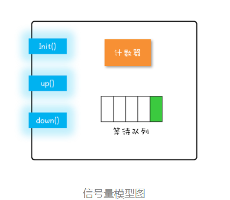

| MethodName | message                                                      |
| ---------- | ------------------------------------------------------------ |
| init()：   | 设置计数器的初始值。                                         |
| down()：   | 计数器的值减 1；如果此时计数器的值小于 0，则当前线程将被阻塞，否则当前线程可以继续执行。 |
| up()：     | 计数器的值加 1；如果此时计数器的值小于或者等于 0，则唤醒等待队列中的一个线程，并将其从等待队列中移除。 |

> 这里提到的 init()、down() 和 up() 三个方法都是原子性的，并且这个原子性是由信号量模型的实现方保证的。在 Java SDK 里面，信号量模型是由 java.util.concurrent.Semaphore 实现的，Semaphore 这个类能够保证这三个方法都是原子操作。


### 3.方法介绍


**类Semaphore的构造函数permits 是许可的意思，代表同一时间，最多允许permits执行acquire() 和release() 之间的代码。**
**例如：**

```java
//表示同一时间内最多只允许1个线程执行 acquire()和release()之间的代码。
Semaphore semaphore = new Semaphore(1);

//公平和非公平信号量：
Semaphore semaphore = new Semaphore(1，false);
/**
False：表示非公平信号量，即线程启动的顺序与调用semaphore.acquire() 的顺序无关，也就是线程先启动了并不代表先获得 许可。
True：公平信号量，即线程启动的顺序与调用semaphore.acquire() 的顺序有关，也就是先启动的线程优先获得许可。
*/
```


| methodName                                               | message                                                      |
| -------------------------------------------------------- | ------------------------------------------------------------ |
| 方法acquire(n)                                           | 是每调用1次此方法，就消耗掉n个许可。                         |
| 方法release(n)                                           | 每调用1次此方法，就动态添加n个许可。                         |
| 方法acquireUnnterruptibly()                              | 等待进入acquire() 方法的线程不允许被中断                     |
| 方法availablePermits()                                   | 返回Semaphore对象中当前可以用的许可数                        |
| 方法drainPermits()                                       | 获取并返回所有的许可个数，并且将可用的许可重置为0            |
| 方法 getQueueLength()                                    | 取得等待的许可的线程个数                                     |
| 方法 hasQueueThreads()                                   | 判断有没有线程在等待这个许可                                 |
| 方法tryAcquire()                                         | 是尝试获取1个许可。如果获取不到则返回false，通常与if语句结合使用，其具有无阻塞的特点。无阻塞的特点可以使不至于在同步处于一直持续等待的状态。 |
| 方法tryAcquire(n)                                        | 尝试获取n个许可，如果获取不到则返回false                     |
| 方法tryAcquire(long timeout，TimeUnit unit)              | 在指定的时间内尝试获取1个许可，如果获取不到则返回false       |
| 方法tryAcquire(int permits，long timeout，TimeUnit unit) | 是在指定的时间内尝试获取n 个许可，如果获取不到则返回false    |
| 多进路-多处理-多出路：                                   | 允许多个线程同时处理任务                                     |


### 4.案例1


工人和机器之间的斗争，现在有7个工人，5台机器，所以每个工人工作的时候都需要去等；


```java
/**
 * 工人和机器之间的斗争，现在有7个工人，5台机器，所以每个工人工作的时候都需要去等；
 */
public class TestSemaphore {
    public static void main(String[] args) {
        int N = 8;            //工人数
        Semaphore semaphore = new Semaphore(5); //机器数目
        for(int i=0;i<N;i++)
            new Worker(i,semaphore).start();
    }
    static class Worker extends Thread{
        private int num;
        private Semaphore semaphore;
        public Worker(int num,Semaphore semaphore){
            this.num = num;
            this.semaphore = semaphore;
        }

        @Override
        public void run() {
            try {
                semaphore.acquire();
                System.out.println("工人"+this.num+"占用一个机器在生产...");
                Thread.sleep(2000);
                System.out.println("工人"+this.num+"释放出机器");
                semaphore.release();
            } catch (InterruptedException e) {
                e.printStackTrace();
            }
        }
    }
}
```


### 5.案例2


食堂吃饭，五个餐位。100名学生


```java
//食堂吃饭，五个餐位。100名学生
public class TestSemaphoreDemo {
    public static void main(String[] args) {
        final Semaphore semaphore = new Semaphore(5);
        DiningRoom diningRoom = new DiningRoom(semaphore);
        for (int i = 0; i < 100; i++) {
            new Thread(diningRoom).start();
        }
    }
}

class DiningRoom implements Runnable {
    private Semaphore semaphore;

    public DiningRoom(Semaphore semaphore) {
        this.semaphore = semaphore;
    }

    @Override
    public void run() {
        try {
            semaphore.acquire();
            System.out.println("第"+Thread.currentThread().getName()+"名学生开始吃饭");
            Thread.sleep(2000);
            System.out.println("第"+Thread.currentThread().getName()+"名学生结束吃饭");
            semaphore.release();
        } catch (InterruptedException e) {
            e.printStackTrace();
        }
    }
}
```


## 4.8：CyclicBarrier栅栏


### 1.简介


> 从字面上的意思可以知道，这个类的中文意思是“循环栅栏”。大概的意思就是一个可循环利用的屏障。
>
> **CyclicBarrier 的字面意思是可循环使用（Cyclic）的屏障（Barrier）。它要做的事情是，让一组线程到达一个屏障（也可以叫同步点）时被阻塞，直到最后一个线程到达屏障时，屏障才会开门，所有被屏障拦截的线程都到齐了才会继续干活。**

它的作用就是会让所有线程都等待完成后才会继续下一步行动。

举个例子，就像生活中我们会约朋友们到某个餐厅一起吃饭，有些朋友可能会早到，有些朋友可能会晚到，但是这个餐厅规定必须等到所有人到齐之后才会让我们进去。这里的朋友们就是各个线程，餐厅就是 CyclicBarrier。


### 2.方法


> 构造器


```java
/*
parties 是参与线程的个数
第二个构造方法有一个 Runnable 参数，这个参数的意思是最后一个到达线程要做的任务
*/
public CyclicBarrier(int parties)
public CyclicBarrier(int parties, Runnable barrierAction)
```


> 方法


```java
/*
线程调用 await() 表示自己已经到达栅栏
BrokenBarrierException 表示栅栏已经被破坏，破坏的原因可能是其中一个线程 await() 时被中断或者超时
*/
public int await() throws InterruptedException, BrokenBarrierException
public int await(long timeout, TimeUnit unit) throws InterruptedException, BrokenBarrierException, TimeoutException
```


### 3.案例


```java
public class TestCyclicBarrier {
    public static void main(String[] args) {
        final CyclicBarrier cb = new CyclicBarrier(3);
        MyThead mt = new MyThead(cb);
        for (int i = 0; i < 3; i++) {
            new Thread(mt).start();
        }
    }
}
class MyThead implements Runnable {
    private CyclicBarrier cb;

    public MyThead(CyclicBarrier cb) {
        this.cb = cb;
    }

    @Override
    public void run() {
        try {
            Thread.sleep((long) (Math.random() * 10000));
            System.out.println("线程" + Thread.currentThread().getName() + "即将到达集合地点1，当前已有" +
                    (cb.getNumberWaiting() + 1) + "个已经到达，"
                    + (cb.getNumberWaiting() == 2 ? "都到齐了，继续走啊" : "正在等候"));
            cb.await();
            Thread.sleep((long) (Math.random() * 10000));
            System.out.println("线程" + Thread.currentThread().getName()
                    + "即将到达集合地点2，当前已有" + (cb.getNumberWaiting() + 1)
                    + "个已经到达，" + (cb.getNumberWaiting() == 2 ? "都到齐了，继续走啊" : "正在等候"));
            cb.await();
            Thread.sleep((long) (Math.random() * 10000));
            System.out.println("线程" + Thread.currentThread().getName()
                    + "即将到达集合地点3，当前已有" + (cb.getNumberWaiting() + 1)
                    + "个已经到达，" + (cb.getNumberWaiting() == 2 ? "都到齐了，继续走啊" : "正在等候"));
            cb.await();
        } catch (Exception e) {
            e.printStackTrace();
        }
    }
}
/**
线程Thread-1即将到达集合地点1，当前已有1个已经到达，正在等候
线程Thread-0即将到达集合地点1，当前已有2个已经到达，正在等候
线程Thread-2即将到达集合地点1，当前已有3个已经到达，都到齐了，继续走啊
线程Thread-2即将到达集合地点2，当前已有1个已经到达，正在等候
线程Thread-1即将到达集合地点2，当前已有2个已经到达，正在等候
线程Thread-0即将到达集合地点2，当前已有3个已经到达，都到齐了，继续走啊
线程Thread-1即将到达集合地点3，当前已有1个已经到达，正在等候
线程Thread-0即将到达集合地点3，当前已有2个已经到达，正在等候
线程Thread-2即将到达集合地点3，当前已有3个已经到达，都到齐了，继续走啊
*/
```


### 4.案例2


我们玩过有一些游戏对吧！必须玩家到了才可以进入下一关，比如地下城，记起来没有？模拟一下


```java
//我们玩过有一些游戏对吧！必须玩家到了才可以进入下一关，比如地下城，记起来没有？模拟一下
public class TestCyclicBarrierDemo2 {
    public static void main(String[] args) {
        final CyclicBarrier cyclicBarrier = new CyclicBarrier(3);
        Game game = new Game(cyclicBarrier);
        for (int i = 0; i < 3; i++) {
            new Thread(game).start();
        }
    }
}

class Game implements Runnable {

    private CyclicBarrier cyclicBarrier;

    public Game(CyclicBarrier cyclicBarrier) {
        this.cyclicBarrier = cyclicBarrier;
    }


    @Override
    public void run() {
        try {
            Thread.sleep((long) (Math.random() * 10000));//闯关时间
            System.out.println(Thread.currentThread().getName() + "到达，到达了   1：\t" + (cyclicBarrier.getNumberWaiting() + 1) + "人,-----");
            cyclicBarrier.await();
            Thread.sleep((long) (Math.random() * 10000));//闯关时间
            System.out.println(Thread.currentThread().getName() + "到达，到达了   2：\t" + (cyclicBarrier.getNumberWaiting() + 1) + "人,-----");
            cyclicBarrier.await();
            Thread.sleep((long) (Math.random() * 10000));//闯关时间
            System.out.println(Thread.currentThread().getName() + "到达，到达了   3：\t" + (cyclicBarrier.getNumberWaiting() + 1) + "人,-----");
            cyclicBarrier.await();

        } catch (Exception e) {
            e.printStackTrace();
        }
    }
}
```


## 4.9：Exchanger线程交换器


### 1.简介


> + **Exchanger** 用于线程之间数据交换，通过**Exchanger**.exchange(obj) 这个方法交换
>
> + 如果第一个线程执行到exchange方法，它会等待第二个线程也执行到exchange，
>
> + 当两个线程都执行到同步点时，这两个线程就可以交换数据。


### 2.原理


>  **Exchanger（交换者）是一个用于线程间协作的工具类。Exchanger用于进行线程间的数据交换。它提供一个同步点，在这个同步点两个线程可以交换彼此的数据。这两个线程通过exchange方法交换数据， 如果第一个线程先执行exchange方法，它会一直等待第二个线程也执行exchange，当两个线程都到达同步点时，这两个线程就可以交换数据，将本线程生产出来的数据传递给对方。因此使用Exchanger的重点是成对的线程使用exchange()方法，当有一对线程达到了同步点，就会进行交换数据。因此该工具类的线程对象是成对的。**
>
>  ​    **Exchanger类提供了两个方法，String exchange(V x):用于交换，启动交换并等待另一个线程调用exchange；String exchange(V x,long timeout,TimeUnit unit)：用于交换，启动交换并等待另一个线程调用exchange，并且设置最大等待时间，当等待时间超过timeout便停止等待。**


### 3.代码


```java
/**
 * Exchanger 用于线程之间数据交换，通过Exchanger.exchange(obj) 这个方法交换 
 * 如果第一个线程执行到exchange方法，它会等待第二个线程也执行到exchange， 
 * 当两个线程都执行到同步点时，这两个线程就可以交换数据。 
 */
public class ExchangerTest {
    public static void main(String[] args) {
        final Exchanger<String> exchanger = new Exchanger<>();
        final ExchangerTest test = new ExchangerTest();
        Thread t1 = new Thread(new Runnable() {
            @Override
            public void run() {
                test.a(exchanger);
            }
        });
        Thread t2 = new Thread(new Runnable() {
            @Override
            public void run() {
                test.b(exchanger);
            }
        });
        t1.start();
        t2.start();
        //等t1 t2线程执行结束，不然数据没有交换完毕
        while (t1.isAlive() || t2.isAlive()) {
        }

        System.out.println("steve :" + steve);
        System.out.println("tao :" + tao);
    }
    private static String steve = null;
    private static String tao = null;
    public void a(Exchanger<String> exchanger) {
        steve = "steve";
        try {
            //把交换来的数据替换本身的数据
            System.out.println("steve =" + steve);
            steve = exchanger.exchange(steve);
            System.out.println("a 交换数据完成！时间：" + System.currentTimeMillis());
            //等待模拟延迟和处理耗费的时间
            TimeUnit.SECONDS.sleep(1);
        } catch (Exception e) {
            e.printStackTrace();
        }
    }
    public void b(Exchanger<String> exchanger) {
        tao = "tao";
        try {
            //把交换来的数据替换本身的数据
            System.out.println("tao =" + tao);
            tao = exchanger.exchange(tao);
            System.out.println("b 交换数据完成！时间：" + System.currentTimeMillis());
            TimeUnit.SECONDS.sleep(4);
        } catch (Exception e) {
            e.printStackTrace();
        }
    }

}
```


### 4.注意


​    因此，当`两个线程之间`出现数据交换的情况，可以使用Exchanger工具类实现数据交换。注意exchange方法的含义，以及触发数据交换的条件。


## 4.10：线程八锁


### 1.题目


题目：判断打印的 "one" or "two" ？

1. **两个普通同步方法，两个线程，标准打印， 打印? //one  two**
2. **新增 Thread.sleep() 给 getOne() ,打印? //one  two**
3. **新增普通方法 getThree() , 打印? //three  one   two**
4. **两个普通同步方法，两个 Number 对象，打印?  //two  one**
5. **修改 getOne() 为静态同步方法，打印?  //two   one**
6. **修改两个方法均为静态同步方法，一个 Number 对象?  //one   two**
7. **一个静态同步方法，一个非静态同步方法，两个 Number 对象?  //two  one**
8. **两个静态同步方法，两个 Number 对象?   //one  two**

> 线程八锁的关键：
>
> ①非静态方法的锁默认为  this,  静态方法的锁为 对应的 Class 实例
>
> ②某一个时刻内，只能有一个线程持有锁，无论几个方法.


### 2.两个线程调用同一个对象的两个同步方法


> **结果分析：**
>
> **被synchronized修饰的方法，锁的对象是方法的调用者。因为两个方法的调用者是同一个，所以两个方法用的是同一个锁，先调用方法的先执行。**

```java
public class Demo {
    public static void main(String[] args) {
        Number number = new Number();

        new Thread(new Runnable() {
            @Override
            public void run() {
                number.getOne();
            }
        }).start();
        new Thread(new Runnable() {
            @Override
            public void run() {
                number.getTwo();
            }
        }).start();
    }
}
class Number {
    public synchronized void getOne() {
        System.out.println("one");
    }

    public synchronized void getTwo() {
        System.out.println("two");
    }
}
/*
one
two
*/
```


### **3.新增Thread.sleep()给某个方法**


> **结果说明：**
>
> **被synchronized修饰的方法，锁的对象是方法的调用者。因为两个方法的调用者是同一个，所以两个方法用的是同一个锁，先调用方法的先执行，第二个方法只有在第一个方法执行完释放锁之后才能执行。sleep方法，让线程沉睡，但不会让线程释放锁。**


```java
public class Demo {
    public static void main(String[] args) {
        Number number = new Number();

        new Thread(new Runnable() {
            @Override
            public void run() {
                number.getOne();
            }
        }).start();

        new Thread(new Runnable() {
            @Override
            public void run() {
                number.getTwo();
            }
        }).start();
    }
}

class Number {
    public synchronized void getOne() {
        try {
            Thread.sleep(1000);
        } catch (InterruptedException e) {
            e.printStackTrace();
        }
        System.out.println("one");
    }

    public synchronized void getTwo() {
        System.out.println("two");
    }
}
```


### **4.新增一个线程调用新增的一个普通方法**


> **结果说明：**
>
> **新增的方法没有被synchronized修饰，不是同步方法，不受锁的影响，所以不需要等待。其他线程共用了一把锁，所以还需要等待。**


```java
public class Demo {
    public static void main(String[] args) {
        Number number = new Number();

        new Thread(new Runnable() {
            @Override
            public void run() {
                number.getOne();
            }
        }).start();

        new Thread(new Runnable() {
            @Override
            public void run() {
                number.getTwo();
            }
        }).start();

        new Thread(new Runnable() {
            @Override
            public void run() {
                number.getThree();
            }
        }).start();
    }
}

class Number {
    public synchronized void getOne() {
        try {
            Thread.sleep(3000);
        } catch (InterruptedException e) {
            e.printStackTrace();
        }
        System.out.println("one");
    }

    public synchronized void getTwo() {
        System.out.println("two");
    }

    public void getThree() {
        System.out.println("three");
    }
}
```


### **5.两个线程调用两个对象的同步方法，其中一个方法有Thread.sleep()**


> ·**结果说明：**
>
> **被synchronized修饰的方法，锁的对象是方法的调用者。因为用了两个对象调用各自的方法，所以两个方法的调用者不是同一个，所以两个方法用的不是同一个锁，后调用的方法不需要等待先调用的方法。**


```java
public class Demo {
    public static void main(String[] args) {
        Number numberOne = new Number();
        Number numberTwo = new Number();

        new Thread(new Runnable() {
            @Override
            public void run() {
                numberOne.getOne();
            }
        }).start();

        new Thread(new Runnable() {
            @Override
            public void run() {
                numberTwo.getTwo();
            }
        }).start();
    }
}
class Number {
    public synchronized void getOne() {
        try {
            Thread.sleep(1000);
        } catch (InterruptedException e) {
            e.printStackTrace();
        }
        System.out.println("one");
    }

    public synchronized void getTwo() {
        System.out.println("two");
    }
}
```


### 6.将有Thread.sleep()的方法设置为static方法，并且让两个线程用同一个对象调用两个方法


> **被synchronized和static修饰的方法，锁的对象是类的class对象。仅仅被synchronized修饰的方法，锁的对象是方法的调用者。因为两个方法锁的对象不是同一个，所以两个方法用的不是同一个锁，后调用的方法不需要等待先调用的方法。**


```java
public class Demo {
    public static void main(String[] args) {
        Number number = new Number();

        new Thread(new Runnable() {
            @Override
            public void run() {
                number.getOne();
            }
        }).start();

        new Thread(new Runnable() {
            @Override
            public void run() {
                number.getTwo();
            }
        }).start();
    }
}

class Number {
    public static synchronized void getOne() {
        try {
            Thread.sleep(1000);
        } catch (InterruptedException e) {
            e.printStackTrace();
        }
        System.out.println("one");
    }

    public synchronized void getTwo() {
        System.out.println("two");
    }
}
```


### 7.将两个方法均设置为static方法，并且让两个线程用同一个对象调用两个方法


> **结果说明：**
>
> **被synchronized和static修饰的方法，锁的对象是类的class对象。因为两个同步方法都被static修饰了，所以两个方法用的是同一个锁，后调用的方法需要等待先调用的方法。**


```java
public class Demo {
    public static void main(String[] args) {
        Number number = new Number();

        new Thread(new Runnable() {
            @Override
            public void run() {
                number.getOne();
            }
        }).start();

        new Thread(new Runnable() {
            @Override
            public void run() {
                number.getTwo();
            }
        }).start();
    }
}

class Number {
    public static synchronized void getOne() {
        try {
            Thread.sleep(1000);
        } catch (InterruptedException e) {
            e.printStackTrace();
        }
        System.out.println("one");
    }

    public static synchronized void getTwo() {
        System.out.println("two");
    }
}
```


### 8.将两个方法中有Thread.sleep()的方法设置为static方法，另一个方法去掉static修饰，让两个线程用两个对象调用两个方法


> **结果说明：**
>
> **被synchronized和static修饰的方法，锁的对象是类的class对象。仅仅被synchronized修饰的方法，锁的对象是方法的调用者。即便是用同一个对象调用两个方法，锁的对象也不是同一个，所以两个方法用的不是同一个锁，后调用的方法不需要等待先调用的方法。**


```java
public class Demo {
    public static void main(String[] args) {
        Number numberOne = new Number();
        Number numberTwo = new Number();

        new Thread(new Runnable() {
            @Override
            public void run() {
                numberOne.getOne();
            }
        }).start();

        new Thread(new Runnable() {
            @Override
            public void run() {
                numberTwo.getTwo();
            }
        }).start();
    }
}

class Number {
    public static synchronized void getOne() {
        try {
            Thread.sleep(1000);
        } catch (InterruptedException e) {
            e.printStackTrace();
        }
        System.out.println("one");
    }

    public synchronized void getTwo() {
        System.out.println("two");
    }
}
```


### 9.将两个方法均设置为static方法，并且让两个线程用同一个对象调用两个方法


> **结果说明：**
>
> **被synchronized和static修饰的方法，锁的对象是类的class对象。因为两个同步方法都被static修饰了，即便用了两个不同的对象调用方法，两个方法用的还是同一个锁，后调用的方法需要等待先调用的方法。**


```java
public class Demo {
    public static void main(String[] args) {
        Number numberOne = new Number();
        Number numberTwo = new Number();

        new Thread(new Runnable() {
            @Override
            public void run() {
                numberOne.getOne();
            }
        }).start();

        new Thread(new Runnable() {
            @Override
            public void run() {
                numberTwo.getTwo();
            }
        }).start();
    }
}

class Number {
    public static synchronized void getOne() {
        try {
            Thread.sleep(1000);
        } catch (InterruptedException e) {
            e.printStackTrace();
        }
        System.out.println("one");
    }

    public static synchronized void getTwo() {
        System.out.println("two");
    }
}
```


### **10.总结**

万变不离其中，静态的同步方法，锁都是类的class对象，普通的同步方法，锁就是方法的调用者。


# 五、并发编程(五)


## 5.1：线程池简介自定义线程池


### 1.前言


虽然在 Java 语言中创建线程看上去就像创建一个对象一样简单，只需要 `new Thread()` 就可以了，但实际上创建线程远不是创建一个对象那么简单。创建对象，仅仅是在 JVM 的堆里分配一块内存而已；而创建一个线程，却需要`调用操作系统内核`的 API，然后`操作系统要为线程分配一系列的资`源，这个成本就很高了，所以线程是一个`重量级的对象`，应该避免频繁创建和销毁。

**java线程的创建、销毁和线程间切换是一件比较耗费计算机资源的事。如果我们需要用多线程处理任务，并频繁的创建、销毁线程会造成计算机资源的无端浪费，因此我们在真正的项目中，使用的是线程池技术。**


### 2.线程池的好处


1.**降低资源消耗**。通过重复利用已创建的线程降低线程创建和销毁造成的消耗。

2.**提高响应速度。**当任务到达时，任务可以不需要的等到线程创建就能立即执行。

3.**提高线程的可管理性。**线程是稀缺资源，如果无限制的创建，不仅会消耗系统资源，还会降低系统的稳定性，使用线程池可以进行统一的分配，调优和监控。


### 3.自定义线程池


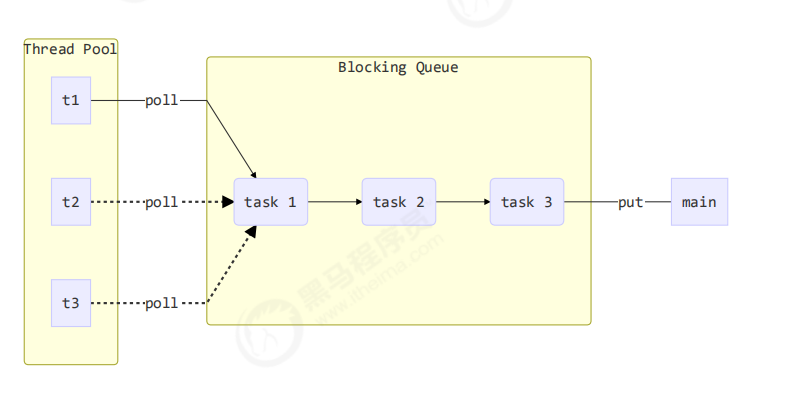


> 阻塞队列


```java
@Slf4j(topic = "BlockingQueue")
public class BlockingQueue<T> {

    //1.任务队列
    private Deque<T> queue = new ArrayDeque<>();


    //2.锁
    private ReentrantLock lock = new ReentrantLock();

    //3.生产者条件变量
    private Condition fullWaitSet = lock.newCondition();

    //4.消费者条件变量
    private Condition emptyWaitSet = lock.newCondition();

    //5.容量
    private int capcity;

    public BlockingQueue(int capcity) {
        this.capcity = capcity;
    }

    /**
     * 带超时的阻塞获取
     *
     * @param timeout
     * @param timeUnit
     * @return
     */
    public T pool(long timeout, TimeUnit timeUnit) {
        lock.lock();
        try {
            //讲timeout统一转换为纳秒
            long nanos = timeUnit.toNanos(timeout);
            while (queue.isEmpty()) {
                try {
                    //如果没有等到那么就会一直等
                    if (nanos <= 0) {
                        return null;
                    }
                    //返回的是剩余的时间
                    nanos = emptyWaitSet.awaitNanos(nanos);
                } catch (InterruptedException e) {
                    e.printStackTrace();
                }
            }
            T t = queue.removeFirst();
            return t;
        } finally {
            lock.unlock();
        }
    }


    /**
     * 阻塞获取
     *
     * @return
     */
    public T task() {
        lock.lock();
        try {
            while (queue.isEmpty()) {
                try {
                    emptyWaitSet.await();
                } catch (InterruptedException e) {
                    e.printStackTrace();
                }
            }
            T t = queue.removeFirst();
            return t;
        } finally {
            lock.unlock();
        }
    }

    /**
     * 阻塞添加
     *
     * @param element
     */
    public void put(T element) {
        lock.lock();
        try {
            while (queue.size() == capcity) {
                try {
                    log.debug("等待加入任务队列 {}................", element);
                    fullWaitSet.await();
                } catch (InterruptedException e) {
                    e.printStackTrace();
                }
            }
            log.debug("加入任务队列 {}", element);
            queue.addLast(element);
            emptyWaitSet.signal();//唤醒
        } finally {
            lock.unlock();
        }
    }

    // 带超时时间阻塞添加
    public boolean offer(T task, long timeout, TimeUnit timeUnit) {
        lock.lock();
        try {
            long nanos = timeUnit.toNanos(timeout);
            while (queue.size() == capcity) {
                try {
                    if (nanos <= 0) {
                        return false;
                    }
                    log.debug("等待加入任务队列 {} ...", task);
                    nanos = fullWaitSet.awaitNanos(nanos);
                } catch (InterruptedException e) {
                    e.printStackTrace();
                }
            }
            log.debug("加入任务队列 {},{},{}", task, timeout, timeUnit);
            queue.addLast(task);
            emptyWaitSet.signal();
            return true;
        } finally {
            lock.unlock();
        }
    }

    /**
     * 获取锁
     *
     * @return
     */
    public int size() {
        lock.lock();
        try {
            return queue.size();
        } finally {
            lock.unlock();
        }
    }


    public void tryPut(RejectPolicy<T> rejectPolicy, T task) {
        lock.lock();
        try {
            // 判断队列是否满
            if(queue.size() == capcity) {
                rejectPolicy.reject(this, task);
            } else { // 有空闲
                log.debug("加入任务队列 {}", task);
                queue.addLast(task);
                emptyWaitSet.signal();
            }
        } finally {
            lock.unlock();
        }
    }
}
```


> 拒绝策略


```java
//拒绝策略
@FunctionalInterface
public interface RejectPolicy<T> {
    void reject(BlockingQueue<T> blockingQueue, T t);

}
```


> 线程池实现


```java
@Slf4j(topic = "ThreadPool")
public class ThreadPool {
    //任务队列
    private BlockingQueue<Runnable> taskQueue;

    //线程集合
    private HashSet<Worker> workers = new HashSet<>();

    //核心线程数
    private int coreSize;

    //获取任务的超时时间

    private long timeOut;

    private TimeUnit timeUnit;

    private RejectPolicy<Runnable> runnableRejectPolicy;

    public ThreadPool(int coreSize, long timeOut, TimeUnit timeUnit, int queueCapctiy, RejectPolicy<Runnable> runnableRejectPolicy) {
        this.coreSize = coreSize;
        this.timeOut = timeOut;
        this.timeUnit = timeUnit;
        this.taskQueue = new BlockingQueue<>(queueCapctiy);
        this.runnableRejectPolicy = runnableRejectPolicy;
    }

    /**
     * 执行任务
     *
     * @param task
     */
    public void execute(Runnable task) {
        synchronized (workers) {
            //当任务数没有超过coreSize时，直接交给worker对象执行
            if (workers.size() < coreSize) {
                Worker worker = new Worker(task);
                log.debug("新增 worker{}, {}", worker, task);
                workers.add(worker);
                worker.start();
            } else {
                //如果任务数超过coreSzie时，交给任务队列执行
                //taskQueue.put(task);
                taskQueue.tryPut(runnableRejectPolicy, task);
            }
        }
    }

    class Worker extends Thread {
        private Runnable task;

        public Worker(Runnable task) {
            this.task = task;
        }

        @Override
        public void run() {
            //执行任务
            //1.当runnableTask不为空执行任务

            //2.当task执行完毕，在接着从任务队列获取任务并自行
//            while (task != null || (task = taskQueue.task()) != null) { 执行完线程池不关闭一直等
            while (task != null || (task = taskQueue.pool(timeOut, timeUnit)) != null) {
                try {
                    log.debug("正在执行...{}", task);
                    task.run();
                } catch (Exception e) {
                    e.printStackTrace();
                } finally {
                    task = null;
                }
            }
            synchronized (workers) {
                log.debug("worker 被移除{}", this);
                workers.remove(this);
            }

        }
    }
}
```


> 测试


```java
@Slf4j(topic = "MyThreadPool")
public class MyThreadPool {
    public static void main(String[] args) {
        ThreadPool threadPool = new ThreadPool(2, 1000, TimeUnit.MILLISECONDS, 10,(queue,task)->{
            //1.死等
 //           queue.put(task);
            //2.超时等待
  //          queue.offer(task, 500,TimeUnit.MILLISECONDS);
            //3.让超时者放弃任务执行
          //  log.debug("放弃{}", task);
            //4.让调用者抛出异常
         //   throw new RuntimeException("任务执行失败 " + task);
            //5.让调用者自己执行任务
            task.run();
        });
        for (int i = 0; i < 3; i++) {
            int j = i;
            threadPool.execute(() -> {
                try {
                    Thread.sleep(500);
                } catch (InterruptedException e) {
                    e.printStackTrace();
                }
                log.info("j={}", j);
            });
        }


    }
}
```


##  5.2ThreadPoolExecutor


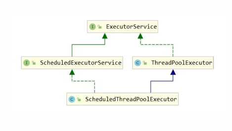

### 1.生命周期


> 先看源码：

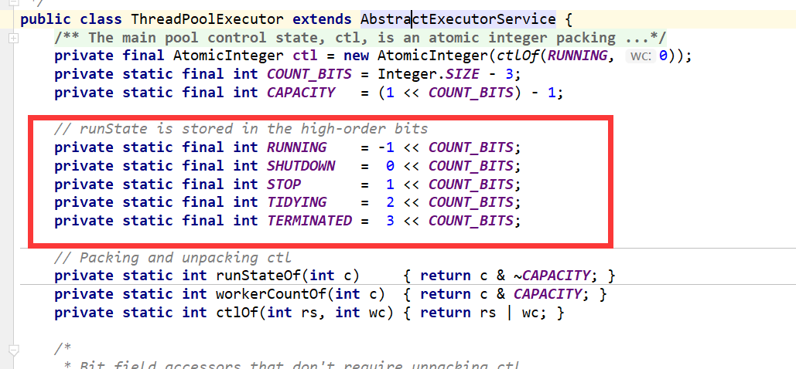


**ThreadPoolExecutor 使用 int 的高 3 位来表示线程池状态，低 29 位表示线程数量**

| **状态名** | **高3位** | **接收新任务** | **处理阻塞队列任务** | **说明**                                       |
| ---------- | --------- | -------------- | -------------------- | ---------------------------------------------- |
| RUNNING    | 111       | Y              | Y                    |                                                |
| SHUTDOWN   | 000       | N              | Y                    | 不会接收新的任务，但是会处理阻塞队列剩余的任务 |
| STOP       | 001       | N              | N                    | 会中断正在执行的任务，并抛弃阻塞队列任务       |
| TIDYING    | 010       | -              | -                    | 任务全执行完毕，活动线程为 0 即将进入终结      |
| TERMINATED | 011       | -              | -                    | 终结状态                                       |

从数字上比较，`TERMINATED `> `TIDYING `> `STOP `> `SHUTDOWN `> `RUNNING`

这些信息存储在一个`原子变量 ctl` 中，目的是将线程池状态与线程个数合二为一，这样就可以用一次` cas 原子操作`进行赋值

```java
// c 为旧值， ctlOf 返回结果为新值
ctl.compareAndSet(c, ctlOf(targetState, workerCountOf(c))));
// rs 为高 3 位代表线程池状态， wc 为低 29 位代表线程个数，ctl 是合并它们
private static int ctlOf(int rs, int wc) { return rs | wc; }
```


### 2.构造方法


```java
public ThreadPoolExecutor(int corePoolSize,
         int maximumPoolSize,
         long keepAliveTime,
         TimeUnit unit,
         BlockingQueue<Runnable> workQueue,
         ThreadFactory threadFactory,
         RejectedExecutionHandler handler)
```

+ **corePoolSize 核心线程数目 (最多保留的线程数)**

+ **maximumPoolSize 最大线程数目**

+ **keepAliveTime 生存时间 - 针对救急线程**

+ **unit 时间单位 - 针对救急线程**

+ **workQueue 阻塞队列**

+ **threadFactory 线程工厂 - 可以为线程创建时起个好名字**

+ **handler 拒绝策略**


> 工作方式


```mermaid
graph LR

subgraph 阻塞队列
size=2
t3(任务3)
t4(任务4)
end

subgraph 线程池c=2,m=3
ct1(核心线程1)
ct2(核心线程2)
mt1(救急线程1)
ct1-->t1(任务1)
ct2-->t2(任务2)
mt1-->T5(任务5)
T6(任务6)-->a(执行拒绝策略)
end


style ct1 fill:#ccf,stroke:#f66,stroke-width:2px,stroke-dasharray: 5,5
style ct2 fill:#ccf,stroke:#f66,stroke-width:2px,stroke-dasharray: 5,5
style mt1 fill:#ccf,stroke:#f66,stroke-width:2px,stroke-dasharray: 5,5

```


1. 线程池中刚开始没有线程，当一个任务提交给线程池后，线程池会创建一个新线程来执行任务。

2. 当线程数达到 corePoolSize 并没有线程空闲，这时再加入任务，新加的任务会被加入workQueue 队列排队，直到有空闲的线程。

3. 如果队列选择了有界队列，那么任务超过了队列大小时，会创建 maximumPoolSize - corePoolSize 数目的线程来救急。

4. 如果线程到达 maximumPoolSize 仍然有新任务这时会执行拒绝策略。拒绝策略 jdk 提供了 4 种实现，其它著名框架也提供了实现
    1. AbortPolicy 让调用者抛出 RejectedExecutionException 异常，这是默认策略
    2. CallerRunsPolicy 让调用者运行任务
    3. DiscardPolicy 放弃本次任务
    4. DiscardOldestPolicy 放弃队列中最早的任务，本任务取而代之
    5. Netty 的实现，是创建一个新线程来执行任务
    6. ActiveMQ 的实现，带超时等待（60s）尝试放入队列，类似我们之前自定义的拒绝策略
    7. PinPoint 的实现，它使用了一个拒绝策略链，会逐一尝试策略链中每种拒绝策略
    8. Dubbo 的实现，在抛出 RejectedExecutionException 异常之前会记录日志，并 dump 线程栈信息，方便定位问题
5. 当高峰过去后，超过corePoolSize 的救急线程如果一段时间没有任务做，需要结束节省资源，这个时间由keepAliveTime 和 unit 来控制。

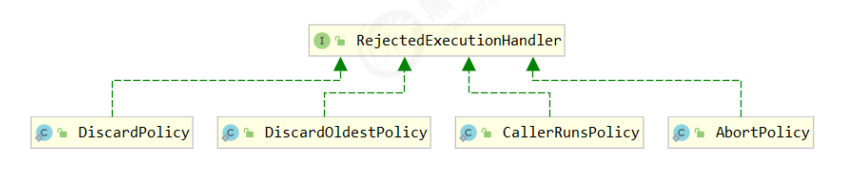

**根据这个构造方法，JDK Executors 类中提供了众多工厂方法来创建各种用途的线程池**


### 3.jdk线程池


|          name           | 描述                                       |
| :---------------------: | ------------------------------------------ |
|   newFixedThreadPool    | 固定大小的线程池                           |
|   newCachedThreadPool   | 创建一个可缓存的线程池                     |
| newSingleThreadExecutor | 创建一个单线程的线程池，保证线程的顺序执行 |


### 4.newFixedThreadPool


```java
 public static ExecutorService newFixedThreadPool(int nThreads) {
    return new ThreadPoolExecutor(nThreads, nThreads,
                  0L, TimeUnit.MILLISECONDS,
                 new LinkedBlockingQueue<Runnable>());
}
```


+ `特点:`
    + ** 核心线程数 == 最大线程数（没有救急线程被创建），因此也无需超时时间**
    + **阻塞队列是无界的，可以放任意数量的任务**

**评价** 适用于任务量已知，相对耗时的任务


> 案例


```java
@Slf4j(topic = "TestFixedThreadPool-1")
public class TestFixedThreadPool {
    public static void main(String[] args) {
        ExecutorService executorService = Executors.newFixedThreadPool(1);
        executorService.execute(() -> {
            log.info("-------------->1");
        });
        executorService.execute(() -> {
            log.info("-------------->2");
        });
        executorService.execute(() -> {
            log.info("-------------->3");
        });

    }
}
/**
21:50:03.754 [pool-1-thread-1] INFO TestFixedThreadPool-1 - -------------->1
21:50:03.758 [pool-1-thread-1] INFO TestFixedThreadPool-1 - -------------->2
21:50:03.758 [pool-1-thread-1] INFO TestFixedThreadPool-1 - -------------->3
程序不会结束.....结束线程池后面说
*/
```


> 线程名字自定义


```java
ExecutorService executorService2 = Executors.newFixedThreadPool(1,new ThreadFactory(){
     //为线程起一个更好的名字
    @Override
   public Thread newThread(Runnable r) {
      return new Thread(r,UUID.randomUUID().toString());
      }
 });
```


### 5.newCachedThreadPool


```java
public static ExecutorService newCachedThreadPool() {
 return new ThreadPoolExecutor(0, Integer.MAX_VALUE,
 			60L, TimeUnit.SECONDS,
			 new SynchronousQueue<Runnable>());
}
```

+ 特点
    +  核心线程数是 0， 最大线程数是 Integer.MAX_VALUE，救急线程的空闲生存时间是 60s，
        + 意味着全部都是救急线程（60s 后可以回收）
        + 救急线程可以无限创建
    +  队列采用了 SynchronousQueue 实现特点是，它没有容量，没有线程来取是放不进去的（一手交钱、一手交

货）


> 代码案例


```java
@Slf4j(topic = "TestCachedThreadPool")
public class TestCachedThreadPool {
    public static void main(String[] args) throws InterruptedException {
        SynchronousQueue<Object> integers = new SynchronousQueue<>();
        new Thread(() -> {
            try {
                log.debug("putting {} ", 1);
                integers.put(1);
                log.debug("{} putted...", 1);
                log.debug("putting...{} ", 2);
                integers.put(2);
                log.debug("{} putted...", 2);
            } catch (InterruptedException e) {
                e.printStackTrace();
            }
        },"t1").start();
        Thread.sleep(1);
        new Thread(() -> {
            try {
                log.debug("taking {}", 1);
                integers.take();
            } catch (InterruptedException e) {
                e.printStackTrace();
            }
        },"t2").start();
        Thread.sleep(1);
        new Thread(() -> {
            try {
                log.debug("taking {}", 2);
                integers.take();
            } catch (InterruptedException e) {
                e.printStackTrace();
            }
        },"t3").start();

    }
}
/*
22:01:20.056 [t1] DEBUG TestCachedThreadPool - putting 1 
22:01:20.060 [t2] DEBUG TestCachedThreadPool - taking 1
22:01:20.061 [t1] DEBUG TestCachedThreadPool - 1 putted...
22:01:20.061 [t1] DEBUG TestCachedThreadPool - putting...2 
22:01:20.060 [t3] DEBUG TestCachedThreadPool - taking 2
22:01:20.062 [t1] DEBUG TestCachedThreadPool - 2 putted...
*/
```


> **评价** 整个线程池表现为线程数会根据任务量不断增长，没有上限，当任务执行完毕，空闲 1分钟后释放线
>
> 程。 适合任务数比较密集，但每个任务执行时间较短的情况


### **6.newSingleThreadExecutor**


```java
public static ExecutorService newSingleThreadExecutor() {
         return new FinalizableDelegatedExecutorService
         (new ThreadPoolExecutor(1, 1, 0L, TimeUnit.MILLISECONDS,
         new LinkedBlockingQueue<Runnable>()));
}
```


+ **使用场景：**
    + 希望多个任务排队执行。线程数固定为 1，任务数多于 1 时，会放入无界队列排队。任务执行完毕，这唯一的线程也不会被释放。

**区别：**

+ 自己创建一个单线程串行执行任务，如果任务执行失败而终止那么没有任何补救措施，而线程池还会新建一个线程，保证池的正常工作

+ Executors.newSingleThreadExecutor() 线程个数始终为1，不能修改
    + FinalizableDelegatedExecutorService 应用的是装饰器模式，只对外暴露了 ExecutorService 接口，因

此不能调用 ThreadPoolExecutor 中特有的方法

+ Executors.newFixedThreadPool(1) 初始时为1，以后还可以修改
    + 对外暴露的是 ThreadPoolExecutor 对象，可以强转后调用 setCorePoolSize 等方法进行修改


> 代码


```java
@Slf4j(topic = "TestSingleThreadExecutor-1")
public class TestSingleThreadExecutor {
    public static void main(String[] args) {
        ExecutorService executorService = Executors.newSingleThreadExecutor();
        executorService.execute(() -> {
            log.info("-------------->1");
        });
        executorService.execute(() -> {
            log.info("-------------->2");
        });
        executorService.execute(() -> {
            log.info("-------------->3");
        });
    }
}
/*
22:11:05.026 [pool-1-thread-1] INFO TestSingleThreadExecutor-1 - -------------->1
22:11:05.029 [pool-1-thread-1] INFO TestSingleThreadExecutor-1 - -------------->2
22:11:05.029 [pool-1-thread-1] INFO TestSingleThreadExecutor-1 - -------------->3
*/
```


### 7.提交任务


| method                                                       | message                                                      |
| ------------------------------------------------------------ | ------------------------------------------------------------ |
| `void execute(Runnable command)`                             | 执行任务                                                     |
| `<T> Future<T> submit(Callable<T> task)`                     | 提交任务 task，用返回值 Future 获得任务执行结果              |
| `<T> Future<T> submit(Runnable task, T result)`              | 提交任务 task，自定义返回值 Future 获得任务执行结果          |
| `Future<?> submit(Runnable task)`                            | 提交任务 task，Future 获得任务执行结果为`null`               |
| `<T> List<Future<T>> invokeAll(Collection<? extends Callable<T>> tasks) throws InterruptedException;` | 提交 tasks 中所有任务                                        |
| `<T> List<Future<T>> invokeAll(Collection<? extends Callable<T>> tasks, long timeout, TimeUnit unit) throws InterruptedException;` | 提交 tasks 中所有任务，带超时时间                            |
| `<T> T invokeAny(Collection<? extends Callable<T>> tasks) throws InterruptedException, ExecutionException;` | 提交 tasks 中所有任务，哪个任务先成功执行完毕，返回此任务执行结果，其它任务取消 |


> 测试submit


```java
@Slf4j(topic = "TestSubmit")
public class TestSubmit {
    public static void main(String[] args) {
        ExecutorService executorService = Executors.newFixedThreadPool(10);
        //---------------Callable接口------------------
        Future<String> submit1 = executorService.submit(() -> {
            log.info("Callable");
            return "ok";
        });
        try {
            log.info(submit1.get());
        } catch (InterruptedException e) {
            e.printStackTrace();
        } catch (ExecutionException e) {
            e.printStackTrace();
        }
        //---------------Collection接口------------------
        Future<?> submit2 = executorService.submit(() -> {
            log.info("Collection");
        });
        try {
            log.info((String) submit2.get());
        } catch (InterruptedException e) {
            e.printStackTrace();
        } catch (ExecutionException e) {
            e.printStackTrace();
        }
        //---------------自定义返回值-------------------
        Future<String> collection = executorService.submit(() -> {
            log.info("Collection");
        }, "自定义返回值");
        try {
            log.info((String) submit2.get());
        } catch (InterruptedException e) {
            e.printStackTrace();
        } catch (ExecutionException e) {
            e.printStackTrace();
        }
    }
}
```


> invokeAll


```java
@Slf4j(topic = "TestInvokeAll")
public class TestInvokeAll {
    public static void main(String[] args) {
        ExecutorService executorService = Executors.newFixedThreadPool(2);
        try {
            List<Future<Object>> futures = executorService.invokeAll(Arrays.asList(
                    () -> {
                        log.info("1");
                        Thread.sleep(100);
                        return "1";
                    }, () -> {
                        log.info("2");
                        Thread.sleep(200);
                        return "2";
                    }, () -> {
                        log.info("3");
                        Thread.sleep(300);
                        return "3";
                    }
            ));
            futures.forEach(item->{
                try {
                    log.info(item.get().toString());
                } catch (InterruptedException e) {
                    e.printStackTrace();
                } catch (ExecutionException e) {
                    e.printStackTrace();
                }
            });
        } catch (InterruptedException e) {
            e.printStackTrace();
        }
    }
}
```


> invokeAny


```java
@Slf4j(topic = "TestInvokeAny")
public class TestInvokeAny {
    public static void main(String[] args) {
        ExecutorService executorService = Executors.newFixedThreadPool(2);
        try {
            // 提交 tasks 中所有任务，哪个任务先成功执行完毕，返回此任务执行结果，其它任务取消，带超时时间
            String invokeAny = executorService.invokeAny(Arrays.asList(
                    () -> {
                        log.info("1");
                        Thread.sleep(100);
                        return "1";
                    }, () -> {
                        log.info("2");
                        Thread.sleep(200);
                        return "2";
                    }, () -> {
                        log.info("3");
                        Thread.sleep(300);
                        return "3";
                    }
            ));
        log.info(invokeAny);

        } catch (InterruptedException | ExecutionException e) {
            e.printStackTrace();
        }
    }
}
```


> 带超时的自己测试


### 8.关闭线程池


> **shutdown**
>
> ```java
> /*
> 线程池状态变为 SHUTDOWN
> - 不会接收新任务
> - 但已提交任务会执行完
> - 此方法不会阻塞调用线程的执行
> */
> void shutdown();
> ```


```java
public void shutdown() {
 final ReentrantLock mainLock = this.mainLock;
 mainLock.lock();
 try {
 checkShutdownAccess();
 // 修改线程池状态
 advanceRunState(SHUTDOWN);
 // 仅会打断空闲线程
 interruptIdleWorkers();
 onShutdown(); // 扩展点 ScheduledThreadPoolExecutor
 } finally {
 mainLock.unlock();
 }
 // 尝试终结(没有运行的线程可以立刻终结，如果还有运行的线程也不会等)
 tryTerminate();
}
```


> **shutdownNow**
>
> ```java
> /*
> 线程池状态变为 STOP
> - 不会接收新任务
> - 会将队列中的任务返回
> - 并用 interrupt 的方式中断正在执行的任务
> */
> List<Runnable> shutdownNow();
> ```


```java
public List<Runnable> shutdownNow() {
     List<Runnable> tasks;
     final ReentrantLock mainLock = this.mainLock;
     mainLock.lock();
     try {
     checkShutdownAccess();
     // 修改线程池状态
     advanceRunState(STOP);
     // 打断所有线程
     interruptWorkers();
     // 获取队列中剩余任务
     tasks = drainQueue();
     } finally {
     mainLock.unlock();
     }
     // 尝试终结
     tryTerminate();
     return tasks; 
}
```


> 其它方法


```java
// 不在 RUNNING 状态的线程池，此方法就返回 true
boolean isShutdown();

// 线程池状态是否是 TERMINATED
boolean isTerminated();

// 调用 shutdown 后，由于调用线程并不会等待所有任务运行结束，因此如果它想在线程池 TERMINATED 后做些事情，可以利用此方法等待
boolean awaitTermination(long timeout, TimeUnit unit) throws InterruptedException;
```


### 9.newSingleThreadExecutor


```java
public static ExecutorService newSingleThreadExecutor() {
    return new FinalizableDelegatedExecutorService
        (new ThreadPoolExecutor(1, 1,
                       0L, TimeUnit.MILLISECONDS,
                       new LinkedBlockingQueue<Runnable>()));
}
```


优点：创建一个单线程的线程池，保证线程的顺序执行

缺点：不适合并发。。


> 代码


```java
/**
 * 创建一个大小无限的线程池。此线程池支持定时以及周期性执行任务的需求。
 */
public class TestNewScheduledThreadPool {

    public static void main(String[] args) {

        ScheduledExecutorService service = Executors.newScheduledThreadPool(2);

        scheduleAtFixedRate(service,1000);
        scheduleAtFixedRate(service,6000);

        scheduleWithFixedDelay(service,1000);
        scheduleWithFixedDelay(service,6000);


    }

    private static void scheduleAtFixedRate(ScheduledExecutorService service, final int sleepTime){
        service.scheduleAtFixedRate(new Runnable() {
            @Override
            public void run() {
                long start = new Date().getTime();
                System.out.println("scheduleAtFixedRate 开始执行时间:" +
                        DateFormat.getTimeInstance().format(new Date()));
                try {
                    Thread.sleep(sleepTime);
                } catch (InterruptedException e) {
                    e.printStackTrace();
                }
                long end = new Date().getTime();
                System.out.println("scheduleAtFixedRate 执行花费时间=" + (end -start)/1000 + "m");
                System.out.println("scheduleAtFixedRate 执行完成时间："
                        + DateFormat.getTimeInstance().format(new Date()));
                System.out.println("======================================");
            }
        },1000,5000,TimeUnit.MILLISECONDS);
    }

    private static void scheduleWithFixedDelay(ScheduledExecutorService service,final int sleepTime){
        service.scheduleWithFixedDelay(new Runnable() {
            @Override
            public void run() {
                long start = new Date().getTime();
                System.out.println("scheduleWithFixedDelay 开始执行时间:" +
                        DateFormat.getTimeInstance().format(new Date()));
                try {
                    Thread.sleep(sleepTime);
                } catch (InterruptedException e) {
                    e.printStackTrace();
                }
                long end = new Date().getTime();
                System.out.println("scheduleWithFixedDelay执行花费时间=" + (end -start)/1000 + "m");
                System.out.println("scheduleWithFixedDelay执行完成时间："
                        + DateFormat.getTimeInstance().format(new Date()));
                System.out.println("======================================");
            }
        },1000,5000, TimeUnit.MILLISECONDS);
    }
}
```


### 10.ForkJoinPool


> **简介**


`Fork/Join `是一个并行计算的框架，主要就是用来支持分治任务模型的，这个计算框架里的 Fork 对应的是分治任务模型里的任务分解，Join 对应的是结果合并。Fork/Join 计算框架主要包含两部分，`一部分是分治任务的线程池 ForkJoinPool`，`另一部分是分治任务 ForkJoinTask`。这两部分的关系类似于` ThreadPoolExecutor` 和 `Runnable 的`关系，都可以理解为提交任务到线程池，只不过`分治任务有自己独特类型 ForkJoinTask。`


**ForkJoinTask 是一个抽象类，**它的方法有很多，**最核心的是 fork() 方法和 join() 方法**，

+ 其中 fork() 方法会异步地执行一个子任务，
+ 而 join() 方法则会阻塞当前线程来等待子任务的执行结果。

**ForkJoinTask 有两个子类——RecursiveAction 和 RecursiveTask**，通过名字你就应该能知道，它们都是用递归的方式来处理分治任务的。这两个子类都定义了抽象方法 compute()，不过区别是 RecursiveAction 定义的 compute() 没有返回值，而 RecursiveTask 定义的 compute() 方法是有返回值的。这两个子类也是抽象类，在使用的时候，需要你定义子类去扩展。


> 简单的来解释


+ **Fork/Join 是 JDK 1.7 加入的新的线程池实现，它体现的是一种分治思想，适用于能够进行任务拆分的 cpu 密集型运算**

+ **所谓的任务拆分，是将一个大任务拆分为算法上相同的小任务，直至不能拆分可以直接求解。跟递归相关的一些计算，如归并排序、斐波那契数列、都可以用分治思想进行求解**

+ **Fork/Join 在分治的基础上加入了多线程，可以把每个任务的分解和合并交给不同的线程来完成，进一步提升了运算效率**

+ **Fork/Join 默认会创建与 cpu 核心数大小相同的线程池**


> 简单的使用


```java
@Slf4j(topic = "TestJoinForkPool")
public class TestJoinForkPool {
    public static void main(String[] args) {
        ForkJoinPool forkJoinPool = new ForkJoinPool(4);
        System.out.println(forkJoinPool.invoke(new MyTask(5)));
    }
}
//1~n的整数和
@Slf4j(topic = "MyTask")
class MyTask extends RecursiveTask<Integer> {

    private int n;

    public MyTask(int n) {
        this.n = n;
    }


    @Override
    protected Integer compute() {
        //如果n已经为1就可以得到结果
        if (n == 1) {
            log.debug("join(){}", n);
            return 1;
        }
        //将任务进行拆分
        MyTask myTask = new MyTask(n - 1);
        myTask.fork();///让一个线程去执行任务

        //合并(join)结果
        int result = n + myTask.join();
        log.info("join(){}+{}={}",n,myTask,result);
        return result;
    }
    @Override
    public String toString() {
        return "MyTask{" +
                "n=" + n +
                '}';
    }
}
/*
23:31:07.241 [ForkJoinPool-1-worker-2] DEBUG MyTask - join()1
23:31:07.245 [ForkJoinPool-1-worker-2] DEBUG MyTask - join() 2 + MyTask{n=1} = 3
23:31:07.246 [ForkJoinPool-1-worker-1] DEBUG MyTask - join() 3 + MyTask{n=2} = 6
23:31:07.246 [ForkJoinPool-1-worker-1] DEBUG MyTask - join() 4 + MyTask{n=3} = 10
23:31:07.246 [ForkJoinPool-1-worker-1] DEBUG MyTask - join() 5 + MyTask{n=4} = 15
15
*/
```


> 总结


**在Java 7中引入了一种新的线程池：ForkJoinPool。**

它同ThreadPoolExecutor一样，也实现了Executor和ExecutorService接口。

它使用了一个无限队列来保存需要执行的任务，而线程的数量则是通过构造函数传入，

如果没有向构造函数中传入希望的线程数量，那么当前计算机可用的CPU数量会被设置为线程数量作为默认值。

**那么使用ThreadPoolExecutor或者ForkJoinPool，会有什么性能的差异呢？**

首先，使用ForkJoinPool能够使用**数量有限的线程**来完成非常多的具有父子关系的任务，比如使用4个线程来完成超过200万个任务。

但是，使用ThreadPoolExecutor时，是不可能完成的，因为ThreadPoolExecutor中的Thread无法选择优先执行子任务，需要完成200万个具有父子关系的任务时，也需要200万个线程，显然这是不可行的。


> 优化代码


```java
class AddTask3 extends RecursiveTask<Integer> {
 
 int begin;
 int end;
 public AddTask3(int begin, int end) {
 this.begin = begin;
 this.end = end;
 }
 @Override
 public String toString() {
 return "{" + begin + "," + end + '}';
 }
 @Override
 protected Integer compute() {
 // 5, 5
 if (begin == end) {
 log.debug("join() {}", begin);
 return begin;
 }
 // 4, 5
  if (end - begin == 1) {
 log.debug("join() {} + {} = {}", begin, end, end + begin);
 return end + begin;
 }
 
 // 1 5
 int mid = (end + begin) / 2; // 3
 AddTask3 t1 = new AddTask3(begin, mid); // 1,3
 t1.fork();
 AddTask3 t2 = new AddTask3(mid + 1, end); // 4,5
 t2.fork();
 log.debug("fork() {} + {} = ?", t1, t2);
 int result = t1.join() + t2.join();
 log.debug("join() {} + {} = {}", t1, t2, result);
 return result;
 }
}      
```


> 检查单词

```java
public class TestJoinForkDemo {

    public static void main(String[] args) {
        String[] fc = {"hello world",
                "hello me",
                "hello fork",
                "hello join",
                "fork join in world"};
        //创建ForkJoin线程池
        ForkJoinPool fjp =
                new ForkJoinPool(3);
        //创建任务
        MR mr = new MR(
                fc, 0, fc.length);
        //启动任务
        Map<String, Long> result =
                fjp.invoke(mr);
        //输出结果
        result.forEach((k, v) ->
                System.out.println(k + ":" + v));
    }

    //MR模拟类
    static class MR extends
            RecursiveTask<Map<String, Long>> {
        private String[] fc;
        private int start, end;

        //构造函数
        MR(String[] fc, int fr, int to) {
            this.fc = fc;
            this.start = fr;
            this.end = to;
        }

        @Override
        protected Map<String, Long> compute() {
            if (end - start == 1) {
                return calc(fc[start]);
            } else {
                int mid = (start + end) / 2;
                MR mr1 = new MR(
                        fc, start, mid);
                mr1.fork();
                MR mr2 = new MR(
                        fc, mid, end);
                //计算子任务，并返回合并的结果
                return merge(mr2.compute(),
                        mr1.join());
            }
        }

        //合并结果
        private Map<String, Long> merge(
                Map<String, Long> r1,
                Map<String, Long> r2) {
            Map<String, Long> result =
                    new HashMap<>();
            result.putAll(r1);
            //合并结果
            r2.forEach((k, v) -> {
                Long c = result.get(k);
                if (c != null)
                    result.put(k, c + v);
                else
                    result.put(k, v);
            });
            return result;
        }

        //统计单词数量
        private Map<String, Long>
        calc(String line) {
            Map<String, Long> result =
                    new HashMap<>();
            //分割单词
            String[] words =
                    line.split("\\s+");
            //统计单词数量
            for (String w : words) {
                Long v = result.get(w);
                if (v != null)
                    result.put(w, v + 1);
                else
                    result.put(w, 1L);
            }
            return result;
        }
    }
}
```


## 5.3：ReentrantLock


### 1.简介


相对于 synchronized 它具备如下特点

+ 可中断

+ 可以设置超时时间

+ 可以设置为公平锁

+ 支持多个条件变量

与 synchronized 一样，都支持可重入

**基本语法**

```java
	// 获取锁
reentrantLock.lock();
	try {
 	// 临界区
	} finally {
 	// 释放锁
	 reentrantLock.unlock();
}
```


### 2.可重入


> **可重入是指同一个线程如果首次获得了这把锁，那么因为它是这把锁的拥有者，因此有权利再次获取这把锁**
>
> **如果是不可重入锁，那么第二次获得锁时，自己也会被锁挡住**


```java
@Slf4j(topic = "TestReentrantLock")
public class TestReentrantLock {
    private static final ReentrantLock REENTRANT_LOCK = new ReentrantLock();

    public static void main(String[] args) {
        REENTRANT_LOCK.lock();
        try {
            log.info("main");
            method1();
        } finally {
            REENTRANT_LOCK.unlock();
        }
    }

    public static void method1() {
        REENTRANT_LOCK.lock();
        try {
            log.info("method1");
            method2();
        } finally {
            REENTRANT_LOCK.unlock();
        }
    }

    public static void method2() {
        REENTRANT_LOCK.lock();
        try {
            log.info("method2");
        } finally {
            REENTRANT_LOCK.unlock();
        }
    }
}
```


### 3.可打断


```java
@Slf4j(topic = "TestReentrantLock2")
public class TestReentrantLock2 {
    private static final ReentrantLock REENTRANT_LOCK = new ReentrantLock();

    public static void main(String[] args) {
        Thread t1 = new Thread(() -> {
            try {
                // 如果没有竞争那么此方法就会获取Lock对象锁
                // 如果有竞争就进入阻塞队列，可以被其它线程用interruput方法
                log.debug("尝试获得到锁");
                REENTRANT_LOCK.lockInterruptibly();
            } catch (Exception e) {
                e.printStackTrace();
                log.debug("没有获得到锁，返回");
                return;
            }
            try {
                log.debug("获得到锁");
            } finally {
                REENTRANT_LOCK.unlock();
            }
        }, "t1");

        REENTRANT_LOCK.lock();
        log.debug("获得了锁");
        t1.start();
        try {
            Thread.sleep(1000);
            log.debug("执行打断");
            t1.interrupt();
        } catch (InterruptedException e) {
            e.printStackTrace();
        } finally {
            REENTRANT_LOCK.unlock();
        }
    }
}
/*
00:03:21.554 [main] DEBUG TestReentrantLock2 - 获得了锁
00:03:21.557 [t1] DEBUG TestReentrantLock2 - 尝试获得到锁
00:03:22.557 [main] DEBUG TestReentrantLock2 - 执行打断
00:03:22.558 [t1] DEBUG TestReentrantLock2 - 没有获得到锁，返回
java.lang.InterruptedException
	at java.util.concurrent.locks.AbstractQueuedSynchronizer.doAcquireInterruptibly(AbstractQueuedSynchronizer.java:898)
	at java.util.concurrent.locks.AbstractQueuedSynchronizer.acquireInterruptibly(AbstractQueuedSynchronizer.java:1222)
	at java.util.concurrent.locks.ReentrantLock.lockInterruptibly(ReentrantLock.java:335)
	at com.lock.TestReentrantLock2.lambda$main$0(TestReentrantLock2.java:16)
	at java.lang.Thread.run(Thread.java:748)
*/
```


### 4.超时锁


```java
@Slf4j(topic = "TestReentrantLock3")
public class TestReentrantLock3 {
    private static final ReentrantLock REENTRANT_LOCK = new ReentrantLock();

    public static void main(String[] args) {
        Thread t1 = new Thread(() -> {
            log.debug("尝试获取锁");
            try {
                if (!REENTRANT_LOCK.tryLock(1, TimeUnit.MILLISECONDS)){
                    log.debug("获取不到锁,返回");
                    return;
                }
            } catch (InterruptedException e) {
                e.printStackTrace();
            }
            try {
                log.debug("获得到了锁");
            }finally {
                log.debug("释放了锁");
                REENTRANT_LOCK.unlock();
            }

        },"t1");
        try {
            REENTRANT_LOCK.lock();
            log.debug("获得到了锁");
            t1.start();
            Thread.sleep(1000);
        } catch (InterruptedException e) {
            e.printStackTrace();
        }finally {
            log.debug("释放了锁");
            REENTRANT_LOCK.unlock();
        }
    }

}
```


### 5.公平锁


**ReentrantLock 默认是不公平的**


```java
ReentrantLock lock = new ReentrantLock(false);//true公平反之不公平
```


### 6.条件变量-Condition


> 简介


**此前，我们知道用`synchronized`与`wait()`和`notify()/notifyAll()`方法结合可以实现等待/通知模式。但是，在使用`notify()/notifyAll()`方法进行通知时，被通知的线程却是由`JVM`随机选择的。为了摆脱这种窘境，Java在1.5引入了`ReentrantLock`和`Condition`类结合使用来达到有选择性的进行线程通知，在调度线程上更加灵活。下面是个测试方法：**


> 方法


**Object类中的`wait()`方法相当于`Condition`类中`await()`方法。**

**Object类中的`wait(long time)`方法相当于`Condition`类中`await`(long time,TimeUnit unit)方法。**

**Object类中的`notify()`方法相当于`Condition`类中`signal`()方法。**

**Object类中的`notifyAll()`方法相当于`Condition`类中`signalAll`()方法。**


> 代码


```java
import java.util.concurrent.locks.Condition;
import java.util.concurrent.locks.Lock;
import java.util.concurrent.locks.ReentrantLock;

public class Test {
    private Lock lock = new ReentrantLock();
    public Condition conditionB = lock.newCondition();
    public Condition conditionA = lock.newCondition();
    //等待
    public void awaitA() {
        try {
            lock.lock();    //调用lock.lock()方法的线程就持有了"对象监视器"，其他线程只有等待锁被释放时再次争抢
            System.out.println("awaitA()时间为：" + System.currentTimeMillis());
            conditionA.await();
        } catch (InterruptedException e) {
            e.printStackTrace();
        } finally {
            lock.unlock();
        }
     }
     //等待
    public void awaitB() {
        try {
            lock.lock();    //调用lock.lock()方法的线程就持有了"对象监视器"，其他线程只有等待锁被释放时再次争抢
            System.out.println("awaitB()时间为：" + System.currentTimeMillis());
            conditionB.await();
        } catch (InterruptedException e) {
            e.printStackTrace();
        } finally {
            lock.unlock();
        }
     }
     //通知
     public void signalA() {
        try {
            lock.lock();
            System.out.println("signalA()时间为：" + System.currentTimeMillis());
            conditionA.signalAll();
        } finally {
            lock.unlock();
        }
     }
     //通知
     public void signalB() {
        try {
            lock.lock();
            System.out.println("signalB()时间为：" + System.currentTimeMillis());
            conditionB.signalAll();
        } finally {
            lock.unlock();
        }
     }
}

//线程类
class ThreadA extends Thread {
    private Test test;
    public ThreadA(Test test) {
        super();
        this.test = test;
    }
    @Override
    public void run() {
        test.awaitA();
    }
}

//线程类
class ThreadB extends Thread {
    private Test test;
    public ThreadB(Test test) {
        super();
        this.test = test;
    }
    @Override
    public void run() {
        test.awaitB();
    }
}

//运行主类
class Run {
    public static void main(String[] args) throws InterruptedException {
        Test test = new Test();
        ThreadA a = new ThreadA(test);
        a.start();
        ThreadB b = new ThreadB(test);
        b.start();
        Thread.sleep(3000);
        test.signalA(); //唤醒A
    }
}
```


## 5.4：读写锁ReadWriteLock


### 1.简介


**`ReadWriteLock`同`Lock`一样也是一个接口，提供了`readLock`和`writeLock`两种锁的操作机制，一个是读锁，一个是写锁。我们称作为`读写锁`**


> + 读锁可以在没有写锁的时候被多个线程同时持有，写锁是独占的(排他的)。
>
> + 每次只能有一个写线程，但是可以有多个线程并发地读数据。
>
> + 所有读写锁的实现必须确保写操作对读操作的内存影响。
>
> + 换句话说，一个获得了读锁的线程必须能看到前一个释放的写锁所更新的内容。
>
> + 理论上，读写锁比互斥锁允许对于共享数据更大程度的并发。
>
> + 与互斥锁相比，读写锁是否能够提高性能取决于读写数据的频率、读取和写入操作的持续时间、以及读线程和写线程之间的竞争。


### 2.使用场景


**假设你的程序中涉及到对一些共享资源的读和写操作，且写操作没有读操作那么频繁。**


**<font color='blue'>例如，最初填充有数据，然后很少修改的集合，同时频繁搜索（例如某种目录）是使用读写锁的理想候选项。</font>**


**在没有写操作的时候，两个线程同时读一个资源没有任何问题，所以应该允许多个线程能在同时读取共享资源。**

**但是如果有一个线程想去写这些共享资源，就不应该再有其它线程对该资源进行读或写。**

==**这就需要一个读/写锁来解决这个问题。**==


### 3.互斥原则


- 读-读能共存，
- 读-写不能共存，
- 写-写不能共存。


### 4.简单使用


```java
/**
 * 首先启动读线程，此时number为0；然后某个时刻写线程修改了共享资源number数据，读线程再次读取最新值！
 */
public class TestReadWriteLock {
    public static void main(String[] args) {
        ReadWriteLockDemo rwd = new ReadWriteLockDemo();
        //启动100个读线程
        for (int i = 0; i < 100; i++) {
            new Thread(new Runnable() {
                @Override
                public void run() {
                    rwd.get();
                }
            },"Read").start();
        }
        //写线程
        new Thread(new Runnable() {
            @Override
            public void run() {
                rwd.set((int) (Math.random() * 101));
            }
        }, "Write").start();
    }
}

class ReadWriteLockDemo {
    //模拟共享资源--Number
    private int number = 0;
    // 实际实现类--ReentrantReadWriteLock，构造器里是可以传入一个布尔值做参数的，默认false表示非公平模式
    private ReadWriteLock readWriteLock = new ReentrantReadWriteLock();

    //读
    public void get() {
        //使用读锁
        readWriteLock.readLock().lock();
        try {
            System.out.println(Thread.currentThread().getName() + " : " + number);
        } finally {
            readWriteLock.readLock().unlock();
        }
    }

    //写
    public void set(int number) {
        readWriteLock.writeLock().lock();
        try {
            this.number = number;
            System.out.println(Thread.currentThread().getName() + " : " + number);
        } finally {
            readWriteLock.writeLock().unlock();
        }
    }
}
//打印结果如下
```

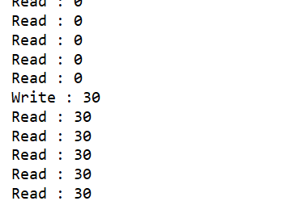


### 5.注意


+ 读锁不支持条件变量

+ 重入时升级不支持：即持有读锁的情况下去获取写锁，会导致获取写锁永久等待

````java
r.lock();
try {
 // ...
 w.lock();
 try {
 // ...
 } finally{
 w.unlock();
 }
} finally{
 r.unlock();
}
````

+ 重入时降级支持：即持有写锁的情况下去获取读锁

```java
class CachedData {
    Object data;
    // 是否有效，如果失效，需要重新计算 data
    volatile boolean cacheValid;
    final ReentrantReadWriteLock rwl = new ReentrantReadWriteLock();
    void processCachedData() {
        rwl.readLock().lock();
        if (!cacheValid) {
            // 获取写锁前必须释放读锁
            rwl.readLock().unlock();
            rwl.writeLock().lock();
            try {
                // 判断是否有其它线程已经获取了写锁、更新了缓存, 避免重复更新
                if (!cacheValid) {
                    data = ...
                    cacheValid = true;
                }
                // 降级为读锁, 释放写锁, 这样能够让其它线程读取缓存
                rwl.readLock().lock();
            } finally {
                rwl.writeLock().unlock();
            }
        }
        // 自己用完数据, 释放读锁 
        try {
            use(data);
        } finally {
            rwl.readLock().unlock();
        }
    }
}
```


### 6.公平

`ReentrantReadWriteLock`不会为锁定访问强加读或者写偏向顺序，但是它确实是支持可选的公平策略。

非公平模式(默认)

比公平锁更高的吞吐量。

公平模式

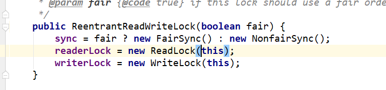


### 7.可重入


**写锁(写线程)可以在不释放已经拥有的写锁的情况下，重新获取读锁，但是不允许读锁(读线程)获取写锁。**


### 8.锁降级


可重入特性还允许从写锁降级到读锁—通过获取写锁，然后获取读锁，然后释放写锁。但是，从读锁到写锁的升级是不可能的。

**当前线程拥有写锁，然后将其释放，最后再获取读锁，这种并不能称之为锁降级，锁降级指的是把持住(当前拥有的)写锁，再获取到读锁，随后释放(先前有用的)写锁的过程。**

通过这种重入，可以减少一步流程——释放写锁后 再次 获取读锁。

使用了锁降级，就可以减去**释放写锁**的步骤。直接获取读锁。效率更高。


### 9.其他

+ **锁获取的中断**

在读锁和写锁的获取过程中支持中断 。

+ **支持Condition**

写锁提供了Condition实现，ReentrantLock.newCondition;读锁不支持Condition。

+ **监控**

该类支持确定锁是否持有或争用的方法。这些方法是为了监视系统状态而设计的，而不是用于同步控制。


### 10.案例


> 锁降级


```java
class CachedData {
    //模拟共享数据
    String data = "原来的数据";
    //volatile修饰，保持内存可见性,数据是不是最新的
    volatile boolean isUpdate;
    //可重入读写锁
    final ReentrantReadWriteLock rwl = new ReentrantReadWriteLock();

    public void processCachedData(String d) {
        //首先获取读锁
        rwl.readLock().lock();
        //发现数据不是最新的则放弃读锁，获取写锁
        if (!isUpdate) {
            rwl.readLock().unlock();
            rwl.writeLock().lock();
            try {
                if (!isUpdate) {
                    data = d;  //拿到写锁后，把新的数据写入
                    isUpdate = true;
                }
                rwl.readLock().lock(); //没释放写锁直接获取读锁
            } finally {
                //进行锁降级
                rwl.writeLock().unlock();
            }
        }
        try {
            // 使用最新的数据，这个打印一下
            System.out.println(data);
        } finally {
            rwl.readLock().unlock();
        }
    }
}
```


> 集合使用场景
>
> 通常可以在集合使用场景中看到ReentrantReadWriteLock的身影。不过只有在集合比较大，读操作比写操作多，操作开销大于同步开销的时候才是值得的。


```java
class RWDictionary {
    //集合对象TreeMap中的元素默认按照keys的自然排序排列。
    //（对Integer来说，其自然排序就是数字的升序；对String来说，其自然排序就是按照字母表排序）
    private final Map<String, Object> m = new TreeMap<String, Object>();
    //读写锁
    private final ReentrantReadWriteLock rwl = new ReentrantReadWriteLock();
    //获取读锁
    private final Lock r = rwl.readLock();
    //获取写锁
    private final Lock w = rwl.writeLock();

    public Object get(String key) {
        r.lock();
        try {
            return m.get(key);
        } finally {
            r.unlock();
        }
    }
    public String[] allKeys() {
        r.lock();
        try {
            Set<String> rsSet = m.keySet();
            return rsSet.toArray(new String[rsSet.size()]);
        } finally {
            r.unlock();
        }
    }
    public Object put(String key, Object value) {
        w.lock();
        try {
            return m.put(key, value);
        } finally {
            w.unlock();
        }
    }
    public void clear() {
        w.lock();
        try {
            m.clear();
        } finally {
            w.unlock();
        }
    }
}
```

## 5.5：Unsafe


### 1.简介


Unsafe:不安全的

吓住没，一个类的名字叫做不安全的；


Unsafe类使Java拥有了像C语言的指针一样操作内存空间的能力，同时也带来了指针的问题。过度的使用Unsafe类会使得出错的几率变大，因此Java官方并不建议使用的，官方文档也几乎没有。Oracle正在计划从Java 9中去掉Unsafe类，如果真是如此影响就太大了。


### 2.获取Unsafe


```java
public class UnsafeAccessor {
 static Unsafe unsafe;
 static {
     try { 
     Field theUnsafe = Unsafe.class.getDeclaredField("theUnsafe");
     theUnsafe.setAccessible(true);
     unsafe = (Unsafe) theUnsafe.get(null);
     } catch (NoSuchFieldException | IllegalAccessException e) {
     throw new Error(e);
     }
     }
     static Unsafe getUnsafe() {
     return unsafe;
     }
}
```


### 3.内存操作


这部分主要包含堆外内存的分配、拷贝、释放、给定地址值操作等方法。


```java
//分配内存, 相当于C++的malloc函数
public native long allocateMemory(long bytes);
//扩充内存
public native long reallocateMemory(long address, long bytes);
//释放内存
public native void freeMemory(long address);
//在给定的内存块中设置值
public native void setMemory(Object o, long offset, long bytes, byte value);
//内存拷贝
public native void copyMemory(Object srcBase, long srcOffset, Object destBase, long destOffset, long bytes);
//获取给定地址值，忽略修饰限定符的限制访问限制。与此类似操作还有: getInt，getDouble，getLong，getChar等
public native Object getObject(Object o, long offset);
//为给定地址设置值，忽略修饰限定符的访问限制，与此类似操作还有: putInt,putDouble，putLong，putChar等
public native void putObject(Object o, long offset, Object x);
//获取给定地址的byte类型的值(当且仅当该内存地址为allocateMemory分配时，此方法结果为确定的)
public native byte getByte(long address);
//为给定地址设置byte类型的值(当且仅当该内存地址为allocateMemory分配时，此方法结果才是确定的)
public native void putByte(long address, byte x);
```


通常，我们在Java中创建的对象都处于堆内内存（heap）中，堆内内存是由JVM所管控的Java进程内存，并且它们遵循JVM的内存管理机制，JVM会采用垃圾回收机制统一管理堆内存。与之相对的是堆外内存，存在于JVM管控之外的内存区域，Java中对堆外内存的操作，依赖于Unsafe提供的操作堆外内存的native方法。


## 5.6：注意


还有可多关于线程的我没总结，自己可以参考参考，还是多看看源码


# 结束


