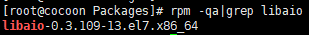
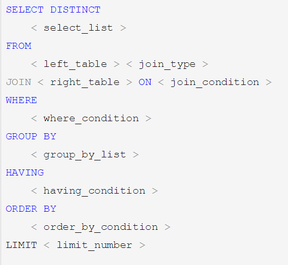

https://www.bilibili.com/video/BV12b411K7Zu?from=search&seid=9024313630851004811

> # MySql


# 目录


[TOC]

****************

# 一、初级篇简介


## 1.1：是什么


MySQL 是一款安全、跨平台、高效的，并与 PHP、Java 等主流编程语言紧密结合的数据库系统。该数据库系统是由瑞典的 MySQL AB 公司开发、发布并支持，由 MySQL 的初始开发人员 David Axmark 和 Michael Monty Widenius 于 1995 年建立的。

MySQL 的象征符号是一只名为 Sakila 的海豚，代表着 MySQL 数据库的速度、能力、精确和优秀本质。


目前 MySQL 被广泛地应用在 Internet 上的中小型网站中。由于其体积小、速度快、总体拥有成本低，尤其是开放源码这一特点，使得很多公司都采用 MySQL 数据库以降低成本。

MySQL 数据库可以称得上是目前运行速度最快的 SQL 语言数据库之一。除了具有许多其他数据库所不具备的功能外，MySQL 数据库还是一种完全免费的产品，用户可以直接通过网络下载 MySQL 数据库，而不必支付任何费用


文档：https://dev.mysql.com/doc/refman/5.7/en/innodb-storage-engine.html


## 1.2：MySQL 特点


下面总结了一下 MySQL 具备的特点。

下面总结了一下 MySQL 具备的特点。

> ### 1) 功能强大


MySQL 中提供了多种数据库存储引擎，各引擎各有所长，适用于不同的应用场合，用户可以选择最合适的引擎以得到最高性能，可以处理每天访问量超过数亿的高强度的搜索 Web 站点。MySQL5 支持事务、视图、存储过程、触发器等。


> ### 2) 支持跨平台


MySQL 支持至少 20 种以上的开发平台，包括 Linux、Windows、FreeBSD 、IBMAIX、AIX、FreeBSD 等。这使得在任何平台下编写的程序都可以进行移植，而不需要对程序做任何的修改。


> ### 3) 运行速度快


高速是 MySQL 的显著特性。在 MySQL 中，使用了极快的 B 树磁盘表（MyISAM）和索引压缩；通过使用优化的单扫描多连接，能够极快地实现连接；SQL 函数使用高度优化的类库实现，运行速度极快。


> ### 4) 支持面向对象


PHP 支持混合编程方式。编程方式可分为纯粹面向对象、纯粹面向过程、面句对象与面向过程混合 3 种方式。


> ### 5) 安全性高


灵活和安全的权限与密码系统，允许基本主机的验证。连接到服务器时，所有的密码传输均采用加密形式，从而保证了密码的安全。


> ### 6) 成本低


MySQL 数据库是一种完全免费的产品，用户可以直接通过网络下载。


> ### 7) 支持各种开发语言


MySQL 为各种流行的程序设计语言提供支持，为它们提供了很多的 API 函数，包括 PHP、ASP.NET、Java、Eiffel、Python、Ruby、Tcl、C、C++、Perl 语言等。


> ### 8) 数据库存储容量大


MySQL 数据库的最大有效表尺寸通常是由操作系统对文件大小的限制决定的，而不是由 MySQL 内部限制决定的。InnoDB 存储引擎将 InnoDB 表保存在一个表空间内，该表空间可由数个文件创建，表空间的最大容量为 64TB，可以轻松处理拥有上千万条记录的大型数据库。


> ### 9) 支持强大的内置函数


PHP 中提供了大量内置函数，几乎涵盖了 Web 应用开发中的所有功能。它内置了数据库连接、文件上传等功能，MySQL 支持大量的扩展库，如 MySQLi 等，可以为快速开发 Web 应用提供便利。


## 1.3：下载


+ 社区版（免费）

+ 企业版（收费）

Windows平台下下载：http://dev.mysql.com/downloads/mysql

**目前可以下载的版本：**

5.5

5.6

5.7

8.0 测试版


## 1.4：安装


略…..基本傻瓜式安装


## 1.5：start/stop mysql server


**方式一：通过计算机管理方式**

右击计算机—管理—服务—启动或停止MySQL服务

• **方式二：通过命令行方式**

启动：net start mysql服务名

停止：net stop mysql服务名


## 1.6：图形化界面使用


**Navicat**

 **SQLyog**

**PhpMyadmin**

**Workbench**

**idea**

不必在意是用哪款软件，软件只是帮我们更快的学习开发


# 二、基础


## 2.1：登录/退出


| 登录                            | 退出     |
| ------------------------------- | -------- |
| mysql –h 主机名 –u用户名 –p密码 | 退出exit |


## 2.2：mysql语法规范


+ 不区分大小写

+ 每句话用;或\g结尾

+ 各子句一般分行写

+ 关键字不能缩写也不能分行

+ 用缩进提高语句的可读性


## 2.3：数据库操作


### 1.查看数据库


```sql
show databases;
```


### 2.使用数据库


```sql
use databaseName
```


### 3.创建数据库


```sql
create database test2
```


## 2.4：mysql数据版本查看


## 2.5：数据类型


### 1.数值类型


MySQL支持所有标准SQL数值数据类型。

这些类型包括严格数值数据类型(INTEGER、SMALLINT、DECIMAL和NUMERIC)，以及近似数值数据类型(FLOAT、REAL和DOUBLE PRECISION)。

关键字INT是INTEGER的同义词，关键字DEC是DECIMAL的同义词。

BIT数据类型保存位字段值，并且支持MyISAM、MEMORY、InnoDB和BDB表。

作为SQL标准的扩展，MySQL也支持整数类型TINYINT、MEDIUMINT和BIGINT。下面的表显示了需要的每个整数类型的存储和范围。

| 类型         | 大小                                     | 范围（有符号）                                               | 范围（无符号）                                               | 用途            |
| :----------- | :--------------------------------------- | :----------------------------------------------------------- | :----------------------------------------------------------- | :-------------- |
| TINYINT      | 1 byte                                   | (-128，127)                                                  | (0，255)                                                     | 小整数值        |
| SMALLINT     | 2 bytes                                  | (-32 768，32 767)                                            | (0，65 535)                                                  | 大整数值        |
| MEDIUMINT    | 3 bytes                                  | (-8 388 608，8 388 607)                                      | (0，16 777 215)                                              | 大整数值        |
| INT或INTEGER | 4 bytes                                  | (-2 147 483 648，2 147 483 647)                              | (0，4 294 967 295)                                           | 大整数值        |
| BIGINT       | 8 bytes                                  | (-9,223,372,036,854,775,808，9 223 372 036 854 775 807)      | (0，18 446 744 073 709 551 615)                              | 极大整数值      |
| FLOAT        | 4 bytes                                  | (-3.402 823 466 E+38，-1.175 494 351 E-38)，0，(1.175 494 351 E-38，3.402 823 466 351 E+38) | 0，(1.175 494 351 E-38，3.402 823 466 E+38)                  | 单精度 浮点数值 |
| DOUBLE       | 8 bytes                                  | (-1.797 693 134 862 315 7 E+308，-2.225 073 858 507 201 4 E-308)，0，(2.225 073 858 507 201 4 E-308，1.797 693 134 862 315 7 E+308) | 0，(2.225 073 858 507 201 4 E-308，1.797 693 134 862 315 7 E+308) | 双精度 浮点数值 |
| DECIMAL      | 对DECIMAL(M,D) ，如果M>D，为M+2否则为D+2 | 依赖于M和D的值                                               | 依赖于M和D的值                                               | 小数值          |


### 2.日期和时间类型


表示时间值的日期和时间类型为DATETIME、DATE、TIMESTAMP、TIME和YEAR。

每个时间类型有一个有效值范围和一个"零"值，当指定不合法的MySQL不能表示的值时使用"零"值。

TIMESTAMP类型有专有的自动更新特性，将在后面描述。

| 类型      | 大小 ( bytes) | 范围                                                         | 格式                | 用途                     |
| :-------- | :------------ | :----------------------------------------------------------- | :------------------ | :----------------------- |
| DATE      | 3             | 1000-01-01/9999-12-31                                        | YYYY-MM-DD          | 日期值                   |
| TIME      | 3             | '-838:59:59'/'838:59:59'                                     | HH:MM:SS            | 时间值或持续时间         |
| YEAR      | 1             | 1901/2155                                                    | YYYY                | 年份值                   |
| DATETIME  | 8             | 1000-01-01 00:00:00/9999-12-31 23:59:59                      | YYYY-MM-DD HH:MM:SS | 混合日期和时间值         |
| TIMESTAMP | 4             | 1970-01-01 00:00:00/2038结束时间是第 **2147483647** 秒，北京时间 **2038-1-19 11:14:07**，格林尼治时间 2038年1月19日 凌晨 03:14:07 | YYYYMMDD HHMMSS     | 混合日期和时间值，时间戳 |


### 3.字符串类型


字符串类型指CHAR、VARCHAR、BINARY、VARBINARY、BLOB、TEXT、ENUM和SET。该节描述了这些类型如何工作以及如何在查询中使用这些类型。

| 类型       | 大小                  | 用途                            |
| :--------- | :-------------------- | :------------------------------ |
| CHAR       | 0-255 bytes           | 定长字符串                      |
| VARCHAR    | 0-65535 bytes         | 变长字符串                      |
| TINYBLOB   | 0-255 bytes           | 不超过 255 个字符的二进制字符串 |
| TINYTEXT   | 0-255 bytes           | 短文本字符串                    |
| BLOB       | 0-65 535 bytes        | 二进制形式的长文本数据          |
| TEXT       | 0-65 535 bytes        | 长文本数据                      |
| MEDIUMBLOB | 0-16 777 215 bytes    | 二进制形式的中等长度文本数据    |
| MEDIUMTEXT | 0-16 777 215 bytes    | 中等长度文本数据                |
| LONGBLOB   | 0-4 294 967 295 bytes | 二进制形式的极大文本数据        |
| LONGTEXT   | 0-4 294 967 295 bytes | 极大文本数据                    |


### **4.注意**：


char(n) 和 varchar(n) 中括号中 n 代表字符的个数，并不代表字节个数，比如 CHAR(30) 就可以存储 30 个字符。

CHAR 和 VARCHAR 类型类似，但它们保存和检索的方式不同。它们的最大长度和是否尾部空格被保留等方面也不同。在存储或检索过程中不进行大小写转换。

BINARY 和 VARBINARY 类似于 CHAR 和 VARCHAR，不同的是它们包含二进制字符串而不要非二进制字符串。也就是说，它们包含字节字符串而不是字符字符串。这说明它们没有字符集，并且排序和比较基于列值字节的数值值。

BLOB 是一个二进制大对象，可以容纳可变数量的数据。有 4 种 BLOB 类型：TINYBLOB、BLOB、MEDIUMBLOB 和 LONGBLOB。它们区别在于可容纳存储范围不同。

有 4 种 TEXT 类型：TINYTEXT、TEXT、MEDIUMTEXT 和 LONGTEXT。对应的这 4 种 BLOB 类型，可存储的最大长度不同，可根据实际情况选择。


## 2.6：练习sql


方便我们学习请执行一下语句


```sql
CREATE DATABASE /*!32312 IF NOT EXISTS*/`myemployees` /*!40100 DEFAULT CHARACTER SET gb2312 */;

USE `myemployees`;

/*Table structure for table `departments` */
dddddd
DROP TABLE IF EXISTS `departments`;

CREATE TABLE `departments` (
  `department_id` int(4) NOT NULL AUTO_INCREMENT,
  `department_name` varchar(3) DEFAULT NULL,
  `manager_id` int(6) DEFAULT NULL,
  `location_id` int(4) DEFAULT NULL,
  PRIMARY KEY (`department_id`),
  KEY `loc_id_fk` (`location_id`),
  CONSTRAINT `loc_id_fk` FOREIGN KEY (`location_id`) REFERENCES `locations` (`location_id`)
) ENGINE=InnoDB AUTO_INCREMENT=271 DEFAULT CHARSET=gb2312;

/*Data for the table `departments` */

insert  into `departments`(`department_id`,`department_name`,`manager_id`,`location_id`) values (10,'Adm',200,1700),(20,'Mar',201,1800),(30,'Pur',114,1700),(40,'Hum',203,2400),(50,'Shi',121,1500),(60,'IT',103,1400),(70,'Pub',204,2700),(80,'Sal',145,2500),(90,'Exe',100,1700),(100,'Fin',108,1700),(110,'Acc',205,1700),(120,'Tre',NULL,1700),(130,'Cor',NULL,1700),(140,'Con',NULL,1700),(150,'Sha',NULL,1700),(160,'Ben',NULL,1700),(170,'Man',NULL,1700),(180,'Con',NULL,1700),(190,'Con',NULL,1700),(200,'Ope',NULL,1700),(210,'IT ',NULL,1700),(220,'NOC',NULL,1700),(230,'IT ',NULL,1700),(240,'Gov',NULL,1700),(250,'Ret',NULL,1700),(260,'Rec',NULL,1700),(270,'Pay',NULL,1700);

/*Table structure for table `employees` */

DROP TABLE IF EXISTS `employees`;

CREATE TABLE `employees` (
  `employee_id` int(6) NOT NULL AUTO_INCREMENT,
  `first_name` varchar(20) DEFAULT NULL,
  `last_name` varchar(25) DEFAULT NULL,
  `email` varchar(25) DEFAULT NULL,
  `phone_number` varchar(20) DEFAULT NULL,
  `job_id` varchar(10) DEFAULT NULL,
  `salary` double(10,2) DEFAULT NULL,
  `commission_pct` double(4,2) DEFAULT NULL,
  `manager_id` int(6) DEFAULT NULL,
  `department_id` int(4) DEFAULT NULL,
  `hiredate` datetime DEFAULT NULL,
  PRIMARY KEY (`employee_id`),
  KEY `dept_id_fk` (`department_id`),
  KEY `job_id_fk` (`job_id`),
  CONSTRAINT `dept_id_fk` FOREIGN KEY (`department_id`) REFERENCES `departments` (`department_id`),
  CONSTRAINT `job_id_fk` FOREIGN KEY (`job_id`) REFERENCES `jobs` (`job_id`)
) ENGINE=InnoDB AUTO_INCREMENT=207 DEFAULT CHARSET=gb2312;

/*Data for the table `employees` */

insert  into `employees`(`employee_id`,`first_name`,`last_name`,`email`,`phone_number`,`job_id`,`salary`,`commission_pct`,`manager_id`,`department_id`,`hiredate`) values (100,'Steven','K_ing','SKING','515.123.4567','AD_PRES',24000.00,NULL,NULL,90,'1992-04-03 00:00:00'),(101,'Neena','Kochhar','NKOCHHAR','515.123.4568','AD_VP',17000.00,NULL,100,90,'1992-04-03 00:00:00'),(102,'Lex','De Haan','LDEHAAN','515.123.4569','AD_VP',17000.00,NULL,100,90,'1992-04-03 00:00:00'),(103,'Alexander','Hunold','AHUNOLD','590.423.4567','IT_PROG',9000.00,NULL,102,60,'1992-04-03 00:00:00'),(104,'Bruce','Ernst','BERNST','590.423.4568','IT_PROG',6000.00,NULL,103,60,'1992-04-03 00:00:00'),(105,'David','Austin','DAUSTIN','590.423.4569','IT_PROG',4800.00,NULL,103,60,'1998-03-03 00:00:00'),(106,'Valli','Pataballa','VPATABAL','590.423.4560','IT_PROG',4800.00,NULL,103,60,'1998-03-03 00:00:00'),(107,'Diana','Lorentz','DLORENTZ','590.423.5567','IT_PROG',4200.00,NULL,103,60,'1998-03-03 00:00:00'),(108,'Nancy','Greenberg','NGREENBE','515.124.4569','FI_MGR',12000.00,NULL,101,100,'1998-03-03 00:00:00'),(109,'Daniel','Faviet','DFAVIET','515.124.4169','FI_ACCOUNT',9000.00,NULL,108,100,'1998-03-03 00:00:00'),(110,'John','Chen','JCHEN','515.124.4269','FI_ACCOUNT',8200.00,NULL,108,100,'2000-09-09 00:00:00'),(111,'Ismael','Sciarra','ISCIARRA','515.124.4369','FI_ACCOUNT',7700.00,NULL,108,100,'2000-09-09 00:00:00'),(112,'Jose Manuel','Urman','JMURMAN','515.124.4469','FI_ACCOUNT',7800.00,NULL,108,100,'2000-09-09 00:00:00'),(113,'Luis','Popp','LPOPP','515.124.4567','FI_ACCOUNT',6900.00,NULL,108,100,'2000-09-09 00:00:00'),(114,'Den','Raphaely','DRAPHEAL','515.127.4561','PU_MAN',11000.00,NULL,100,30,'2000-09-09 00:00:00'),(115,'Alexander','Khoo','AKHOO','515.127.4562','PU_CLERK',3100.00,NULL,114,30,'2000-09-09 00:00:00'),(116,'Shelli','Baida','SBAIDA','515.127.4563','PU_CLERK',2900.00,NULL,114,30,'2000-09-09 00:00:00'),(117,'Sigal','Tobias','STOBIAS','515.127.4564','PU_CLERK',2800.00,NULL,114,30,'2000-09-09 00:00:00'),(118,'Guy','Himuro','GHIMURO','515.127.4565','PU_CLERK',2600.00,NULL,114,30,'2000-09-09 00:00:00'),(119,'Karen','Colmenares','KCOLMENA','515.127.4566','PU_CLERK',2500.00,NULL,114,30,'2000-09-09 00:00:00'),(120,'Matthew','Weiss','MWEISS','650.123.1234','ST_MAN',8000.00,NULL,100,50,'2004-02-06 00:00:00'),(121,'Adam','Fripp','AFRIPP','650.123.2234','ST_MAN',8200.00,NULL,100,50,'2004-02-06 00:00:00'),(122,'Payam','Kaufling','PKAUFLIN','650.123.3234','ST_MAN',7900.00,NULL,100,50,'2004-02-06 00:00:00'),(123,'Shanta','Vollman','SVOLLMAN','650.123.4234','ST_MAN',6500.00,NULL,100,50,'2004-02-06 00:00:00'),(124,'Kevin','Mourgos','KMOURGOS','650.123.5234','ST_MAN',5800.00,NULL,100,50,'2004-02-06 00:00:00'),(125,'Julia','Nayer','JNAYER','650.124.1214','ST_CLERK',3200.00,NULL,120,50,'2004-02-06 00:00:00'),(126,'Irene','Mikkilineni','IMIKKILI','650.124.1224','ST_CLERK',2700.00,NULL,120,50,'2004-02-06 00:00:00'),(127,'James','Landry','JLANDRY','650.124.1334','ST_CLERK',2400.00,NULL,120,50,'2004-02-06 00:00:00'),(128,'Steven','Markle','SMARKLE','650.124.1434','ST_CLERK',2200.00,NULL,120,50,'2004-02-06 00:00:00'),(129,'Laura','Bissot','LBISSOT','650.124.5234','ST_CLERK',3300.00,NULL,121,50,'2004-02-06 00:00:00'),(130,'Mozhe','Atkinson','MATKINSO','650.124.6234','ST_CLERK',2800.00,NULL,121,50,'2004-02-06 00:00:00'),(131,'James','Marlow','JAMRLOW','650.124.7234','ST_CLERK',2500.00,NULL,121,50,'2004-02-06 00:00:00'),(132,'TJ','Olson','TJOLSON','650.124.8234','ST_CLERK',2100.00,NULL,121,50,'2004-02-06 00:00:00'),(133,'Jason','Mallin','JMALLIN','650.127.1934','ST_CLERK',3300.00,NULL,122,50,'2004-02-06 00:00:00'),(134,'Michael','Rogers','MROGERS','650.127.1834','ST_CLERK',2900.00,NULL,122,50,'2002-12-23 00:00:00'),(135,'Ki','Gee','KGEE','650.127.1734','ST_CLERK',2400.00,NULL,122,50,'2002-12-23 00:00:00'),(136,'Hazel','Philtanker','HPHILTAN','650.127.1634','ST_CLERK',2200.00,NULL,122,50,'2002-12-23 00:00:00'),(137,'Renske','Ladwig','RLADWIG','650.121.1234','ST_CLERK',3600.00,NULL,123,50,'2002-12-23 00:00:00'),(138,'Stephen','Stiles','SSTILES','650.121.2034','ST_CLERK',3200.00,NULL,123,50,'2002-12-23 00:00:00'),(139,'John','Seo','JSEO','650.121.2019','ST_CLERK',2700.00,NULL,123,50,'2002-12-23 00:00:00'),(140,'Joshua','Patel','JPATEL','650.121.1834','ST_CLERK',2500.00,NULL,123,50,'2002-12-23 00:00:00'),(141,'Trenna','Rajs','TRAJS','650.121.8009','ST_CLERK',3500.00,NULL,124,50,'2002-12-23 00:00:00'),(142,'Curtis','Davies','CDAVIES','650.121.2994','ST_CLERK',3100.00,NULL,124,50,'2002-12-23 00:00:00'),(143,'Randall','Matos','RMATOS','650.121.2874','ST_CLERK',2600.00,NULL,124,50,'2002-12-23 00:00:00'),(144,'Peter','Vargas','PVARGAS','650.121.2004','ST_CLERK',2500.00,NULL,124,50,'2002-12-23 00:00:00'),(145,'John','Russell','JRUSSEL','011.44.1344.429268','SA_MAN',14000.00,0.40,100,80,'2002-12-23 00:00:00'),(146,'Karen','Partners','KPARTNER','011.44.1344.467268','SA_MAN',13500.00,0.30,100,80,'2002-12-23 00:00:00'),(147,'Alberto','Errazuriz','AERRAZUR','011.44.1344.429278','SA_MAN',12000.00,0.30,100,80,'2002-12-23 00:00:00'),(148,'Gerald','Cambrault','GCAMBRAU','011.44.1344.619268','SA_MAN',11000.00,0.30,100,80,'2002-12-23 00:00:00'),(149,'Eleni','Zlotkey','EZLOTKEY','011.44.1344.429018','SA_MAN',10500.00,0.20,100,80,'2002-12-23 00:00:00'),(150,'Peter','Tucker','PTUCKER','011.44.1344.129268','SA_REP',10000.00,0.30,145,80,'2014-03-05 00:00:00'),(151,'David','Bernstein','DBERNSTE','011.44.1344.345268','SA_REP',9500.00,0.25,145,80,'2014-03-05 00:00:00'),(152,'Peter','Hall','PHALL','011.44.1344.478968','SA_REP',9000.00,0.25,145,80,'2014-03-05 00:00:00'),(153,'Christopher','Olsen','COLSEN','011.44.1344.498718','SA_REP',8000.00,0.20,145,80,'2014-03-05 00:00:00'),(154,'Nanette','Cambrault','NCAMBRAU','011.44.1344.987668','SA_REP',7500.00,0.20,145,80,'2014-03-05 00:00:00'),(155,'Oliver','Tuvault','OTUVAULT','011.44.1344.486508','SA_REP',7000.00,0.15,145,80,'2014-03-05 00:00:00'),(156,'Janette','K_ing','JKING','011.44.1345.429268','SA_REP',10000.00,0.35,146,80,'2014-03-05 00:00:00'),(157,'Patrick','Sully','PSULLY','011.44.1345.929268','SA_REP',9500.00,0.35,146,80,'2014-03-05 00:00:00'),(158,'Allan','McEwen','AMCEWEN','011.44.1345.829268','SA_REP',9000.00,0.35,146,80,'2014-03-05 00:00:00'),(159,'Lindsey','Smith','LSMITH','011.44.1345.729268','SA_REP',8000.00,0.30,146,80,'2014-03-05 00:00:00'),(160,'Louise','Doran','LDORAN','011.44.1345.629268','SA_REP',7500.00,0.30,146,80,'2014-03-05 00:00:00'),(161,'Sarath','Sewall','SSEWALL','011.44.1345.529268','SA_REP',7000.00,0.25,146,80,'2014-03-05 00:00:00'),(162,'Clara','Vishney','CVISHNEY','011.44.1346.129268','SA_REP',10500.00,0.25,147,80,'2014-03-05 00:00:00'),(163,'Danielle','Greene','DGREENE','011.44.1346.229268','SA_REP',9500.00,0.15,147,80,'2014-03-05 00:00:00'),(164,'Mattea','Marvins','MMARVINS','011.44.1346.329268','SA_REP',7200.00,0.10,147,80,'2014-03-05 00:00:00'),(165,'David','Lee','DLEE','011.44.1346.529268','SA_REP',6800.00,0.10,147,80,'2014-03-05 00:00:00'),(166,'Sundar','Ande','SANDE','011.44.1346.629268','SA_REP',6400.00,0.10,147,80,'2014-03-05 00:00:00'),(167,'Amit','Banda','ABANDA','011.44.1346.729268','SA_REP',6200.00,0.10,147,80,'2014-03-05 00:00:00'),(168,'Lisa','Ozer','LOZER','011.44.1343.929268','SA_REP',11500.00,0.25,148,80,'2014-03-05 00:00:00'),(169,'Harrison','Bloom','HBLOOM','011.44.1343.829268','SA_REP',10000.00,0.20,148,80,'2014-03-05 00:00:00'),(170,'Tayler','Fox','TFOX','011.44.1343.729268','SA_REP',9600.00,0.20,148,80,'2014-03-05 00:00:00'),(171,'William','Smith','WSMITH','011.44.1343.629268','SA_REP',7400.00,0.15,148,80,'2014-03-05 00:00:00'),(172,'Elizabeth','Bates','EBATES','011.44.1343.529268','SA_REP',7300.00,0.15,148,80,'2014-03-05 00:00:00'),(173,'Sundita','Kumar','SKUMAR','011.44.1343.329268','SA_REP',6100.00,0.10,148,80,'2014-03-05 00:00:00'),(174,'Ellen','Abel','EABEL','011.44.1644.429267','SA_REP',11000.00,0.30,149,80,'2014-03-05 00:00:00'),(175,'Alyssa','Hutton','AHUTTON','011.44.1644.429266','SA_REP',8800.00,0.25,149,80,'2014-03-05 00:00:00'),(176,'Jonathon','Taylor','JTAYLOR','011.44.1644.429265','SA_REP',8600.00,0.20,149,80,'2014-03-05 00:00:00'),(177,'Jack','Livingston','JLIVINGS','011.44.1644.429264','SA_REP',8400.00,0.20,149,80,'2014-03-05 00:00:00'),(178,'Kimberely','Grant','KGRANT','011.44.1644.429263','SA_REP',7000.00,0.15,149,NULL,'2014-03-05 00:00:00'),(179,'Charles','Johnson','CJOHNSON','011.44.1644.429262','SA_REP',6200.00,0.10,149,80,'2014-03-05 00:00:00'),(180,'Winston','Taylor','WTAYLOR','650.507.9876','SH_CLERK',3200.00,NULL,120,50,'2014-03-05 00:00:00'),(181,'Jean','Fleaur','JFLEAUR','650.507.9877','SH_CLERK',3100.00,NULL,120,50,'2014-03-05 00:00:00'),(182,'Martha','Sullivan','MSULLIVA','650.507.9878','SH_CLERK',2500.00,NULL,120,50,'2014-03-05 00:00:00'),(183,'Girard','Geoni','GGEONI','650.507.9879','SH_CLERK',2800.00,NULL,120,50,'2014-03-05 00:00:00'),(184,'Nandita','Sarchand','NSARCHAN','650.509.1876','SH_CLERK',4200.00,NULL,121,50,'2014-03-05 00:00:00'),(185,'Alexis','Bull','ABULL','650.509.2876','SH_CLERK',4100.00,NULL,121,50,'2014-03-05 00:00:00'),(186,'Julia','Dellinger','JDELLING','650.509.3876','SH_CLERK',3400.00,NULL,121,50,'2014-03-05 00:00:00'),(187,'Anthony','Cabrio','ACABRIO','650.509.4876','SH_CLERK',3000.00,NULL,121,50,'2014-03-05 00:00:00'),(188,'Kelly','Chung','KCHUNG','650.505.1876','SH_CLERK',3800.00,NULL,122,50,'2014-03-05 00:00:00'),(189,'Jennifer','Dilly','JDILLY','650.505.2876','SH_CLERK',3600.00,NULL,122,50,'2014-03-05 00:00:00'),(190,'Timothy','Gates','TGATES','650.505.3876','SH_CLERK',2900.00,NULL,122,50,'2014-03-05 00:00:00'),(191,'Randall','Perkins','RPERKINS','650.505.4876','SH_CLERK',2500.00,NULL,122,50,'2014-03-05 00:00:00'),(192,'Sarah','Bell','SBELL','650.501.1876','SH_CLERK',4000.00,NULL,123,50,'2014-03-05 00:00:00'),(193,'Britney','Everett','BEVERETT','650.501.2876','SH_CLERK',3900.00,NULL,123,50,'2014-03-05 00:00:00'),(194,'Samuel','McCain','SMCCAIN','650.501.3876','SH_CLERK',3200.00,NULL,123,50,'2014-03-05 00:00:00'),(195,'Vance','Jones','VJONES','650.501.4876','SH_CLERK',2800.00,NULL,123,50,'2014-03-05 00:00:00'),(196,'Alana','Walsh','AWALSH','650.507.9811','SH_CLERK',3100.00,NULL,124,50,'2014-03-05 00:00:00'),(197,'Kevin','Feeney','KFEENEY','650.507.9822','SH_CLERK',3000.00,NULL,124,50,'2014-03-05 00:00:00'),(198,'Donald','OConnell','DOCONNEL','650.507.9833','SH_CLERK',2600.00,NULL,124,50,'2014-03-05 00:00:00'),(199,'Douglas','Grant','DGRANT','650.507.9844','SH_CLERK',2600.00,NULL,124,50,'2014-03-05 00:00:00'),(200,'Jennifer','Whalen','JWHALEN','515.123.4444','AD_ASST',4400.00,NULL,101,10,'2016-03-03 00:00:00'),(201,'Michael','Hartstein','MHARTSTE','515.123.5555','MK_MAN',13000.00,NULL,100,20,'2016-03-03 00:00:00'),(202,'Pat','Fay','PFAY','603.123.6666','MK_REP',6000.00,NULL,201,20,'2016-03-03 00:00:00'),(203,'Susan','Mavris','SMAVRIS','515.123.7777','HR_REP',6500.00,NULL,101,40,'2016-03-03 00:00:00'),(204,'Hermann','Baer','HBAER','515.123.8888','PR_REP',10000.00,NULL,101,70,'2016-03-03 00:00:00'),(205,'Shelley','Higgins','SHIGGINS','515.123.8080','AC_MGR',12000.00,NULL,101,110,'2016-03-03 00:00:00'),(206,'William','Gietz','WGIETZ','515.123.8181','AC_ACCOUNT',8300.00,NULL,205,110,'2016-03-03 00:00:00');

/*Table structure for table `jobs` */

DROP TABLE IF EXISTS `jobs`;

CREATE TABLE `jobs` (
  `job_id` varchar(10) NOT NULL,
  `job_title` varchar(35) DEFAULT NULL,
  `min_salary` int(6) DEFAULT NULL,
  `max_salary` int(6) DEFAULT NULL,
  PRIMARY KEY (`job_id`)
) ENGINE=InnoDB DEFAULT CHARSET=gb2312;

/*Data for the table `jobs` */

insert  into `jobs`(`job_id`,`job_title`,`min_salary`,`max_salary`) values ('AC_ACCOUNT','Public Accountant',4200,9000),('AC_MGR','Accounting Manager',8200,16000),('AD_ASST','Administration Assistant',3000,6000),('AD_PRES','President',20000,40000),('AD_VP','Administration Vice President',15000,30000),('FI_ACCOUNT','Accountant',4200,9000),('FI_MGR','Finance Manager',8200,16000),('HR_REP','Human Resources Representative',4000,9000),('IT_PROG','Programmer',4000,10000),('MK_MAN','Marketing Manager',9000,15000),('MK_REP','Marketing Representative',4000,9000),('PR_REP','Public Relations Representative',4500,10500),('PU_CLERK','Purchasing Clerk',2500,5500),('PU_MAN','Purchasing Manager',8000,15000),('SA_MAN','Sales Manager',10000,20000),('SA_REP','Sales Representative',6000,12000),('SH_CLERK','Shipping Clerk',2500,5500),('ST_CLERK','Stock Clerk',2000,5000),('ST_MAN','Stock Manager',5500,8500);

/*Table structure for table `locations` */

DROP TABLE IF EXISTS `locations`;

CREATE TABLE `locations` (
  `location_id` int(11) NOT NULL AUTO_INCREMENT,
  `street_address` varchar(40) DEFAULT NULL,
  `postal_code` varchar(12) DEFAULT NULL,
  `city` varchar(30) DEFAULT NULL,
  `state_province` varchar(25) DEFAULT NULL,
  `country_id` varchar(2) DEFAULT NULL,
  PRIMARY KEY (`location_id`)
) ENGINE=InnoDB AUTO_INCREMENT=3201 DEFAULT CHARSET=gb2312;

/*Data for the table `locations` */

insert  into `locations`(`location_id`,`street_address`,`postal_code`,`city`,`state_province`,`country_id`) values (1000,'1297 Via Cola di Rie','00989','Roma',NULL,'IT'),(1100,'93091 Calle della Testa','10934','Venice',NULL,'IT'),(1200,'2017 Shinjuku-ku','1689','Tokyo','Tokyo Prefecture','JP'),(1300,'9450 Kamiya-cho','6823','Hiroshima',NULL,'JP'),(1400,'2014 Jabberwocky Rd','26192','Southlake','Texas','US'),(1500,'2011 Interiors Blvd','99236','South San Francisco','California','US'),(1600,'2007 Zagora St','50090','South Brunswick','New Jersey','US'),(1700,'2004 Charade Rd','98199','Seattle','Washington','US'),(1800,'147 Spadina Ave','M5V 2L7','Toronto','Ontario','CA'),(1900,'6092 Boxwood St','YSW 9T2','Whitehorse','Yukon','CA'),(2000,'40-5-12 Laogianggen','190518','Beijing',NULL,'CN'),(2100,'1298 Vileparle (E)','490231','Bombay','Maharashtra','IN'),(2200,'12-98 Victoria Street','2901','Sydney','New South Wales','AU'),(2300,'198 Clementi North','540198','Singapore',NULL,'SG'),(2400,'8204 Arthur St',NULL,'London',NULL,'UK'),(2500,'Magdalen Centre, The Oxford Science Park','OX9 9ZB','Oxford','Oxford','UK'),(2600,'9702 Chester Road','09629850293','Stretford','Manchester','UK'),(2700,'Schwanthalerstr. 7031','80925','Munich','Bavaria','DE'),(2800,'Rua Frei Caneca 1360 ','01307-002','Sao Paulo','Sao Paulo','BR'),(2900,'20 Rue des Corps-Saints','1730','Geneva','Geneve','CH'),(3000,'Murtenstrasse 921','3095','Bern','BE','CH'),(3100,'Pieter Breughelstraat 837','3029SK','Utrecht','Utrecht','NL'),(3200,'Mariano Escobedo 9991','11932','Mexico City','Distrito Federal,','MX');

```


# 三、查询（一）


## 3.1：SELECT语法


```sql
SELECT *|{[DISTINCT] column|expression [alias],...} FROM table;
```


+ SELECT  
  + 标识选择哪些列。

+ FROM   
  + 标识从哪个表中选择。


## 3.2：查看表结构


```sql
DESC employees;
SHOW COLUMNS FROM employees;
```


## 3.3：查询全部列


```sql
SELECT * FROM departments
```


## 3.4：映射查询


数据表字段多的时候，我们还去查询很多列会很麻烦，比如我们只要一条列的数据，可是呢我们还是去全部的查询出来这样就很不友好。


```sql
SELECT department_id, location_id FROM departments;
```


## 3.5：别名查询


+ 列的别名: 

+ 表起别名

**通过使用 SQL，可以为列名称和表名称指定别名（Alias）。 关键字`AS` 当然也可以省略不写**


```sql
SELECT t.department_id as id  FROM  departments as t;
SELECT t.department_id  id  FROM  departments  t;
```


## 3.6：查询数据信息


```sql
/*正在使用的数据库*/
SELECT DATABASE();
/*当前使用的用户*/
SELECT USER();
/*当前数据库版本*/
SELECT VERSION();
```


## 3.7：拼接字段


### 1.使用+号


```sql
SELECT department_id,location_id, (department_id +location_id) as result  FROM  departments ;
```


注意：如果列的类型有字符类型那么的话就不可以相加,必须是**数字类型**才可以


```sql
SELECT department_id,department_name, (department_id +department_name) as result  FROM  departments ;
```


### 2.concat函数使用


```sql
SELECT department_id,department_name, CONCAT(department_id,department_name) as result  FROM  departments ;
```


## 3.8：去重


去除重复的数据，我们使用`DISTINCT`关键字，当然我们可以使用分组查询，下一节讲解


```sql
SELECT DISTINCT salary FROM employees;
```


## 3.9：WHERE 子句


### 1.简介


如需有条件地从表中选取数据，可将 WHERE 子句添加到 SELECT 语句。


### 2.语法


```sql
SELECT 列名称 FROM 表名称 WHERE 列 运算符 值
```


### 3.可以使用的运算符


| 操作符  | 描述         |
| :------ | :----------- |
| =       | 等于         |
| <>      | 不等于       |
| >       | 大于         |
| <       | 小于         |
| >=      | 大于等于     |
| <=      | 小于等于     |
| BETWEEN | 在某个范围内 |
| LIKE    | 搜索某种模式 |

> ##### **注释：**在某些版本的 SQL 中，操作符 <> 可以写为 !=。


### 4.使用where子句


```
SELECT * FROM Persons WHERE City='Beijing'
```


> ### "Persons" 表


| LastName | FirstName | Address        | City     | Year |
| :------- | :-------- | :------------- | :------- | :--- |
| Adams    | John      | Oxford Street  | London   | 1970 |
| Bush     | George    | Fifth Avenue   | New York | 1975 |
| Carter   | Thomas    | Changan Street | Beijing  | 1980 |
| Gates    | Bill      | Xuanwumen 10   | Beijing  | 1985 |


> ### 结果：


| LastName | FirstName | Address        | City    | Year |
| :------- | :-------- | :------------- | :------ | :--- |
| Carter   | Thomas    | Changan Street | Beijing | 1980 |
| Gates    | Bill      | Xuanwumen 10   | Beijing | 1985 |


### 5.引号的使用


请注意，我们在例子中的条件值周围使用的是单引号。

SQL 使用单引号来环绕文本值（大部分数据库系统也接受双引号）。如果是数值，请不要使用引号。


> ### 文本值：


```sql
/*这是正确的：*/
SELECT * FROM Persons WHERE FirstName='Bush'

/*这是错误的：*/
SELECT * FROM Persons WHERE FirstName=Bush
```


> ### 数值：


```sql
/*这是正确的：*/
SELECT * FROM Persons WHERE Year>1965

/*这是错误的：*/
SELECT * FROM Persons WHERE Year>'1965'
```


## 3.10：AND & OR 运算符


```sql
-- and使用
SELECT * FROM employees WHERE   job_id ='AD_VP' AND salary >24000;
-- OR使用
SELECT * FROM employees WHERE   job_id ='AD_VP' OR salary >24000;
-- and 和 OR使用
SELECT * FROM employees WHERE   job_id ='AD_VP' AND salary >24000 OR manager_id = 100;
```


# 四、查询(二)


## 4.1：IN


判断一个值是否符合多个条件时使用in，它可以帮我们少写一些语句


> ###### 不使用in


```sql
SELECT * FROM employees WHERE   salary = 24000 OR salary = 25000  OR salary = 23432;
```


> ###### 使用in


```
SELECT * FROM employees WHERE   salary in(24000,25000,23432);
```


## 4.2：NOT


**not关键字表示不，我们可以让true变成false反之不,可以配合运算符和in、like来使用**


```sql
SELECT * FROM employees WHERE   NOT (salary  < 24000);
SELECT * FROM employees WHERE   NOT (salary  = 24000);
SELECT * FROM employees WHERE   NOT (salary  > 24000);
SELECT * FROM employees WHERE   salary not  in(24000,25000,23432);
```


## 4.3：NULL值处理


我们已经知道 MySQL 使用 SQL SELECT 命令及 WHERE 子句来读取数据表中的数据,但是当提供的查询条件字段为 NULL 时，该命令可能就无法正常工作。

为了处理这种情况，MySQL提供了三大运算符:

- **IS NULL:** 当列的值是 NULL,此运算符返回 true。
- **IS NOT NULL:** 当列的值不为 NULL, 运算符返回 true。
- **<=>:** 比较操作符（不同于 = 运算符），当比较的的两个值相等或者都为 NULL 时返回 true。


> ##### 注意：我们不可以使用` !=null `或者 `=null`
>
> 如下他是不成功的
>
> ```sql
> SELECT * FROM employees WHERE manager_id != NULL;
> SELECT * FROM employees WHERE manager_id == NULL;
> ```


<font color='red'>**我们使用下面这样来写**</font>


```sql
SELECT * FROM employees WHERE manager_id  IS NOT NULL;
SELECT * FROM employees WHERE manager_id IS NULL;
```


## 4.4：BETWEEN ... AND


操作符 BETWEEN ... AND 会选取介于两个值之间的数据范围。这些值可以是数值、文本或者日期。


```sql
SELECT salary FROM employees WHERE salary BETWEEN 4200 AND  9000 ;
```


## 4.5：排序查询


如果我们需要对读取的数据进行排序，我们就可以使用 MySQL 的`ORDER BY子句`来设定你想按哪个字段哪种方式来进行排序，再返回搜索结果。**也可以多个列排序**

+ **ASC 正序**
+ **DESC 倒序**


```sql
--  正序
SELECT salary FROM employees ORDER BY salary ASC;
--  倒叙
SELECT salary FROM employees ORDER BY salary DESC;
--  多个列排序
SELECT last_name, department_id, salary FROM employees ORDER BY department_id, salary DESC
```


## 4.6：模糊查询


`like`模糊查询只能应用在字符串类型。`like`关键字要使用时必须配合通配符一起使用.通配符有以下：


+ **% ：表示任意字符，不确定有几个**

+ **_ : 表示一个字符**


> **注意：**


如果我们使用模糊查询时想要查询一些特殊的符号：比如查询一个员工名字中有 `_ `,这个时候我们可以使用：`escap  `关键字：

```sql
SELECT last_name FROM   employees WHERE  last_name LIKE '_o%';
```


## 4.7：UNION语句


### 描述


MySQL UNION 操作符用于连接两个以上的 SELECT 语句的结果组合到一个结果集合中。多个 SELECT 语句会删除重复的数据。


### 语法


MySQL UNION 操作符语法格式：


```sql
SELECT expression1, expression2, ... expression_n
FROM tables
[WHERE conditions]
UNION [ALL | DISTINCT]
SELECT expression1, expression2, ... expression_n
FROM tables
[WHERE conditions];
```


### 参数


- **expression1, expression2, ... expression_n**: 要检索的列。
- **tables:** 要检索的数据表。
- **WHERE conditions:** 可选， 检索条件。
- **DISTINCT:** 可选，删除结果集中重复的数据。默认情况下 UNION 操作符已经删除了重复数据，所以 DISTINCT 修饰符对结果没啥影响。
- **ALL:** 可选，返回所有结果集，包含重复数据。


## 4.8：聚合函数


| 函数名字 | 描述               |
| -------- | ------------------ |
| COUNT    | 统计行数量         |
| SUM      | 获取单个列的合计值 |
| MAX      | 计算列的最大值     |
| AVG      | 计算某个列的平均值 |
| MIN      | 计算列的最小值     |


````sql
--  COUNT：统计行数量
SELECT COUNT(*) FROM employees;
SELECT COUNT(1) FROM employees;
SELECT COUNT(salary) FROM employees;
--  SUM：获取单个列的合计值
SELECT SUM(salary) FROM employees;
--  AVG：计算某个列的平均值
SELECT AVG(salary) FROM employees;
--  MAX：计算列的最大值
SELECT MAX(salary) FROM employees;
--  MIN：计算列的最小值
SELECT MIN(salary) FROM employees;
````


**count是一种最简单的聚合函数，一般也是我们第一个开始学习的聚合函数，那么他们之间究竟由什么区别呢？**


+ 有的人说count（1）和count（*）他们之间有区别，
+ 而有的人说他们之间没有区别那么他们之间到底有没有区别呢。


**从执行结果来说：**


+ `count（1）`和`count（*）`之间没有区别，因为`count（*）count（1）`都不会去过滤空值
+  但`count（列名）`就有区别了，因为`count（列名）`会去过滤空值。


**从执行效率来说：**


​     他们之间根据不同情况会有些许区别，MySQL会对`count（*）`做优化。


+ 如果列为主键，count(列名)效率优于count(1)  

+ 如果列不为主键，count(1)效率优于count(列名)  

+ 如果表中存在主键，count(主键列名)效率最优  

+ 如果表中只有一列，则count(*)效率最优  

+ 如果表有多列，且不存在主键，则count(1)效率优于count(*)


## 4.9：分组查询


GROUP BY 语句根据一个或多个列对结果集进行分组。

在分组的列上我们可以使用 COUNT, SUM, AVG,等函数。


```sql
-- 语法

SELECT column_name, function(column_name)
FROM table_name
WHERE column_name operator value
GROUP BY column_name;

--- 例子
SELECT salary FROM employees GROUP BY salary;
SELECT job_id,salary FROM employees GROUP BY job_id,salary;
```


## 4.10：HAVING子句


在 SQL 中增加 HAVING 子句原因是，WHERE 关键字无法与合计函数一起使用。


```sql
SELECT job_id,salary FROM employees GROUP BY job_id,salary HAVING salary >= 8300;
SELECT job_id,salary FROM employees GROUP BY job_id,salary HAVING salary >= 8300 ORDER BY salary DESC;
```


# 五、查询(三)


## 5.1：字符转换函数


| NAME                                      | MESSAGE                                                      |
| ----------------------------------------- | ------------------------------------------------------------ |
| ASCII()<font color='white'>———————</font> | 返回字符表达式最左端字符的ASCII 码值。在ASCII（）函数中，纯数字的字符串可不用‘’括起来，但含其它字符的字符串必须用‘’括起来使用，否则会出错。 |
| CHAR()                                    | 将ASCII 码转换为字符。如果没有输入0 ~ 255 之间的ASCII 码值，CHAR（） 返回NULL 。 |
| LOWER()和UPPER()                          | LOWER()将字符串全部转为小写；UPPER()将字符串全部转为大写。   |
| STR()                                     | 把数值型数据转换为字符型数据。<br/>如select STR(12345.633,7,1) 结果为12345.6<br/>第一个参数是要转换的数值，<br/>第二个参数是转换後的总长度（含小数点，正负号），<br/>第三个参数为小数位 |

```sql
--  ASCII()返回字符表达式最左端字符的ASCII 码值
SELECT ASCII("a"); --  97
SELECT ASCII("s"); --  157
SELECT ASCII("asss");  /*这里输出的是a97*/
-- CHAR()将ASCII 码转换为字符。如果没有输入0 ~ 255 之间的ASCII 码值，CHAR()返回NULL 
SELECT CHAR(133); --  
-- LOWER()将字符串全部转为小写；
SELECT LOWER("abcDed");--  abcded
-- UPPER()将字符串全部转为大写。
SELECT UPPER("abcDed");--  
-- STR()把数值型数据转换为字符型数据如

select STR(12345.633,7,1);
/*
第一个参数是要转换的数值，
第二个参数是转换後的总长度（含小数点，正负号）
第三个参数为小数位
*/
```


## 5.2：空格函数


| name    | message                  |
| ------- | ------------------------ |
| LTRIM() | 把字符串头部的空格去掉。 |
| RTRIM() | 把字符串尾部的空格去掉。 |


```java
-- 1、LTRIM() 把字符串头部的空格去掉。
SELECT LTRIM(" abdc ");
-- 2、RTRIM() 把字符串尾部的空格去掉。
SELECT RTRIM(" abdc ");
```


## 5.3：取子串函数


| name        | message                                                      |
| ----------- | ------------------------------------------------------------ |
| left()      | LEFT (<character_expression>， <integer_expression>)<br/>返回character_expression 左起 integer_expression 个字符。 |
| RIGHT()     | RIGHT (<character_expression>， <integer_expression>)<br/>返回character_expression 右起 integer_expression 个字符。 |
| SUBSTRING() | SUBSTRING (<expression>， <starting_ position>， length) 返回从字符串左边第starting_ position 个字符起length个字符的部分 |


```java
SELECT LEFT("abcde",2); -- ab

SELECT RIGHT("abcde",2); --  de

SELECT SUBSTRING("abcdef",2,4); -- bcde
```


## 5.4：字符串操作函数


| name             | message                                |
| ---------------- | -------------------------------------- |
| REPLACE(s,s1,s2) | 将字符串 s2 替代字符串 s 中的字符串 s1 |
| REVERSE(s)       | 将字符串s的顺序反过来                  |
| SPACE(n)         | 返回 n 个空格                          |


```sql
-- REPLACE(s,s1,s2)将字符串 s2 替代字符串 s 中的字符串 s1
SELECT REPLACE("abcdef","def","abc"); -- abcabc
-- REVERSE(s)将字符串s的顺序反过来
SELECT REVERSE("abcdef"); -- fedcba
-- SPACE(n)返回 n 个空格
SELECT SPACE(10);-- 10个空格
```


## 5.5：数据类型转换函数


| name                | message                                                      |
| ------------------- | ------------------------------------------------------------ |
| CAST(x AS type)     | 转换数据类型,支持类型有BINARY、CHAR(n)、DATE、TIME、DATETIME、DECIMAL、SIGNED和UNSIGNE |
| CONVERT(s USING cs) | 函数将字符串 s 的字符集变成 cs                               |


```sql
SELECT CAST("123" AS TIME);
SELECT CAST("2017-08-29" AS DATE);
SELECT CONVERT("你好" USING gbk)
```


## 5.6：日期函数


| name            | message                              |
| --------------- | ------------------------------------ |
| DAY(d)          | 返回日期值 d 的日期部分              |
| MONTH(d)        | 返回日期d中的月份值，1 到 12         |
| YEAR(d)         | 返回年份                             |
| DATEDIFF(d1,d2) | 计算日期 d1->d2 之间相隔的天数       |
| now()           | 获取当前日期                         |
| str_to_date     | 将日期格式的字符转换成指定格式的日期 |
| date_format     | 将日期转换成字符                     |


```sql
SELECT DAY("2017-08-29" );-- 29
SELECT MONTH('2018-8-11 11:11:11'); -- 8
SELECT YEAR("2017-06-15");-- 2017
SELECT DATEDIFF('2001-01-01','2001-02-02');-- -32
SELECT NOW(); -- 2020-10-19 16:11:23
SELECT STR_TO_DATE('9-13-1999','%m-%d-%Y'); -- 1999-09-13
SELECT DATE_FORMAT('2018/6/6','%Y年%m月%d日');-- 2018年06月06日
```


| **序号** | **格式符** |      **功能**       |
| :------: | :--------: | :-----------------: |
|    1     |     %Y     |     四位的年份      |
|    2     |     %y     |      2位的年份      |
|    3     |     %m     | 月份（01,02…11,12） |
|    4     |     %c     | 月份（1,2,…11,12）  |
|    5     |     %d     |    日（01,02,…）    |
|    6     |     %H     |  小时（24小时制）   |
|    7     |     %h     |  小时（12小时制）   |
|    8     |     %i     |  分钟（00,01…59）   |
|    9     |     %s     |   秒（00,01,…59）   |


## 5.7：数字函数


| name            | message                                                      |
| --------------- | ------------------------------------------------------------ |
| RAND()          | 生成随机数                                                   |
| ROUND(number,n) | 取数字小数点后的n位                                          |
| TRUNCATE(x,y)   | 返回数值 x 保留到小数点后 y 位的值（与 ROUND 最大的区别是不会进行四舍五入） |
| MOD(x,y)        | 返回 x 除以 y 以后的余数                                     |


```mysql
SELECT RAND(); -- 0.8565491501768577
SELECT  ROUND(45.926232, 3); --  45.926
SELECT TRUNCATE(1.23456,3) -- 1.234
SELECT MOD(5,2)  -- 1
```


## 5.8：分页查询


### 1.分页公式


1）limit分页公式：curPage是当前第几页；pageSize是一页多少条记录

```sql
limit  (curPage-1)*pageSize,pageSize
```

（2）用的地方：sql语句中

```sql
select * from student limit(curPage-1)*pageSize,pageSize;
```


### 2.总页数公式


（1）总页数公式：totalRecord是总记录数；pageSize是一页分多少条记录

```cpp
int totalPageNum = (totalRecord +pageSize - 1) / pageSize;
```

（2）用的地方：前台UI分页插件显示分页码

（3）查询总条数：totalRecord是总记录数，SELECT COUNT(*) FROM tablename


### 3.limit m,n分页语句


```sql
select * from employees order by employee_id desc limit 3,3;
select * from employees order by employee_id desc limit m,n;
```


limit 3,3的意思扫描满足条件的3+3行，撇去前面的3行，返回最后的3行，那么问题来了，如果是limit 200000,200，需要扫描200200行，如果在一个高并发的应用里，每次查询需要扫描超过20W行，效率十分低下。


> ###### 例如：


```sql
select * from orders_history where type=8 limit 100,100;
select * from orders_history where type=8 limit 1000,100;
select * from orders_history where type=8 limit 10000,100;
select * from orders_history where type=8 limit 100000,100;
select * from orders_history where type=8 limit 1000000,100;
```


### 4.limit m语句


```sql
select * from dept where deptno >10 order by deptno asc limit n;//下一页
select * from dept where deptno <60 order by deptno desc limit n//上一页
```

这种方式不管翻多少页只需要扫描n条数据。

但是，虽然扫描的数据量少了，但是在某些需要跳转到多少也得时候就无法实现，这时还是需要用到方法1，既然不能避免，那么我们可以考虑尽量减小m的值，因此我们可以给这条语句加上一个条件限制。是的每次扫描不用从第一条开始。这样就能尽量减少扫描的数据量。


例如：每页10条数据，当前是第10页，当前条目ID的最大值是109，最小值是100.(当前100-109)
那么跳到第9页：

```sql
select * from dept where deptno<100 order by deptno desc limit 0,10;   //倒序
```

那么跳到第8页：

```sql
select * from dept where deptno<100 order by deptno desc limit 10,10;
```

那么跳到第11页：

```sql
select * from dept where deptno>109 order by deptno asc limit 0,10;
```


### 5.使用子查询优化


**这种方式先定位偏移位置的 id，然后往后查询，这种方式适用于 id 递增的情况。**


```sql
select * from orders_history where type=8 limit 100000,1;
select id from orders_history where type=8 limit 100000,1;
select * from orders_history where type=8 and id>=(select id from orders_history where type=8 limit 100000,1) limit 100;
select * from orders_history where type=8 limit 100000,100;
```

**4条语句的查询时间如下：**

- 第1条语句：3674ms
- 第2条语句：1315ms
- 第3条语句：1327ms
- 第4条语句：3710ms

**针对上面的查询需要注意：**

- 比较第1条语句和第2条语句：使用 select id 代替 select * 速度增加了3倍
- 比较第2条语句和第3条语句：速度相差几十毫秒
- 比较第3条语句和第4条语句：得益于 select id 速度增加，第3条语句查询速度增加了3倍

**这种方式相较于原始一般的查询方法，将会增快数倍。**


### 6.使用id限定优化（前提：id是**连续递增，删除过记录不符合）**


这种方式假设数据表的id是**连续递增**的，则我们根据查询的页数和查询的记录数可以算出查询的id的范围，可以使用 id between and 来查询：

```sql
select * from orders_history where type=2 and id between 1000000 and 1000100 limit 100;
```

查询时间：15ms 12ms 9ms

这种查询方式能够极大地优化查询速度，基本能够在几十毫秒之内完成。限制是只能使用于明确知道id的情况，不过一般建立表的时候，都会添加基本的id字段，这为分页查询带来很多便利。

还可以有另外一种写法：

```sql
select * from orders_history where id >= 1000001 limit 100;
```

当然还可以使用 in 的方式来进行查询，这种方式经常用在多表关联的时候进行查询，使用其他表查询的id集合，来进行查询：

```sql
select * from orders_history where id in
(select order_id from trade_2 where goods = 'pen')
limit 100;
```

<font color='red'>这种 in 查询的方式要注意：某些 mysql 版本不支持在 in 子句中使用 limit。</font>


### 7.使用临时表优化


这种方式已经不属于查询优化，这儿附带提一下。

对于使用 id 限定优化中的问题，需要 id 是连续递增的，但是在一些场景下，比如使用历史表的时候，或者**出现过数据缺失问题**时，可以考虑使用临时存储的表来记录分页的id，使用分页的id来进行 in 查询。这样能够极大的提高传统的分页查询速度，尤其是数据量上千万的时候。

 

## 5.9：子查询


### 1.简介


出现在其他语句内部的select语句，称为子查询或内查询内部嵌套其他select语句的查询，称为外查询或主查询


> ###### 注意：
>
> + ###### 子查询要包含在括号内。 
>
> + ###### 将子查询放在比较条件的右侧。 
>
> + ######  单行操作符对应单行子查询，多行操作符对应多行子查询。
>
> + ###### l而且我们还要把我们第一个需要执行的查询语句用小括号括起来
>
> + ###### 我们要注意我们在使用条条件的时候，如果第一次查询出来是一个数据，那么我们不用管，如果我们查询查询出来是多个数据，那么我们需要使用ALL、IN、ANY
>
> + ###### 子查询 (内查询) 在主查询之前一次执行完成。
>
> + ###### 子查询的结果被主查询(外查询)使用
>
> + ###### 将子查询放在比较条件的右侧


### 2.类型


> ##### 单行子查询：子查询语句返回一行数据
>
> ##### 多行子查询：子查询语句返回多行数据


> ##### 这里面有几个特殊的函数，他们主要是用来解决多行子查询的。


| 操作符 | 含义                         |
| ------ | ---------------------------- |
| in     | 等于列表中的任意一个         |
| any    | 和子查询返回的某一个值比较   |
| all    | 和子查询返回的所有值进行比较 |


### 3.例


```sql
-- 1.	查询一个比员工‘Fripp’工资高的所有员工
SELECT * FROM EMPLOYEES WHERE SALARY > (SELECT SALARY FROM EMPLOYEES WHERE LAST_NAME = 'Fripp');
```


###   4.运算符号


如果我们比较的数据是一个单行的数据(也就是单个数据)，我们可以任意的使用运算符号，但是如果是多行数据时我们需要使用IN（）、ALL（）、ANY（）这三个函数，这三个函数我们会在下面讲解

运算符号：


### 5.IN使用


查询20部门或者30部门或者40号部门的员工信息

代码：

  ```sql
-- 查询20部门或者30部门或者40号部门的员工信息
SELECT * FROM EMPLOYEES WHERE DEPARTMENT_ID in (20,30,40);  
  ```


### 6.all使用


返回其它部门中比job_id为‘IT_PROG’部门所有工资都低的员工的员工号、姓名、job_id 以及salary

代码：


```sql
-- 返回其它部门中比job_id为‘IT_PROG’部门所有工资都低的员工的员工号、姓名、job_id 以及salary  

SELECT employee_id, last_name, job_id, salary  FROM   employees WHERE salary < ALL   (SELECT salary       FROM   employees     WHERE   job_id = 'IT_PROG')    AND JOB_ID != 'IT_PROG';  
```


### 7.any使用

 

返回其它部门中比job_id为‘IT_PROG’部门任一工资低的员工的员工号、姓名、job_id 以及salary

代码：

```sql
  -- 返回其它部门中比job_id为‘IT_PROG’部门任一工资低的员工的员工号、姓名、job_id 以及salary    
  SELECT employee_id, last_name, job_id, salary  FROM  employees WHERE salary < ANY   
  (SELECT salary    FROM  employees            
   WHERE job_id = 'IT_PROG')                      
  AND JOB_ID != 'IT_PROG';  
```


### 8. EXISTS关键字


EXISTS 操作符检查在子查询中是否存在满足条件的行

+ 如果在子查询中存在满足条件的行:
  + 不在子查询中继续查找
  + 条件返回 TRUE

+  如果在子查询中不存在满足条件的行:
  + 条件返回 FALSE
  + 继续在子查询中查找

代码：


```sql
SELECT * FROM DEPT  WHERE NOT EXISTS (    SELECT 1 FROM EMP     WHERE     EMP.DEPTNO = DEPT.DEPTNO  );
```

  


## 5.10：连接查询


### 1.简介


本章节我们将向大家介绍如何使用 MySQL 的 JOIN 在两个或多个表中查询数据。

你可以在 SELECT, UPDATE 和 DELETE 语句中使用 Mysql 的 JOIN 来联合多表查询。

JOIN 按照功能大致分为如下三类：

- **INNER JOIN（内连接,或等值连接）**：获取两个表中字段匹配关系的记录。
- **LEFT JOIN（左连接）：**获取左表所有记录，即使右表没有对应匹配的记录。
- **RIGHT JOIN（右连接）：** 与 LEFT JOIN 相反，用于获取右表所有记录，即使左表没有对应匹配的记录


### 2.测试sql


```sql

SET NAMES utf8;
SET FOREIGN_KEY_CHECKS = 0;

-- ----------------------------
--  Table structure for `runoob_tbl`
-- ----------------------------
DROP TABLE IF EXISTS `runoob_tbl`;
CREATE TABLE `runoob_tbl` (
  `runoob_id` int(11) NOT NULL AUTO_INCREMENT,
  `runoob_title` varchar(100) NOT NULL,
  `runoob_author` varchar(40) NOT NULL,
  `submission_date` date DEFAULT NULL,
  PRIMARY KEY (`runoob_id`)
) ENGINE=InnoDB AUTO_INCREMENT=6 DEFAULT CHARSET=utf8;

-- ----------------------------
--  Records of `runoob_tbl`
-- ----------------------------
BEGIN;
INSERT INTO `runoob_tbl` VALUES ('1', '学习 PHP', 'PHP教程', '2017-04-12'), ('2', '学习 MySQL', 'MySQL教程', '2017-04-12'), ('3', '学习 Java', 'RUNOOB.COM', '2015-05-01'), ('4', '学习 Python', 'RUNOOB.COM', '2016-03-06'), ('5', '学习 C', 'FK', '2017-04-05');
COMMIT;

-- ----------------------------
--  Table structure for `tcount_tbl`
-- ----------------------------
DROP TABLE IF EXISTS `tcount_tbl`;
CREATE TABLE `tcount_tbl` (
  `runoob_author` varchar(255) NOT NULL DEFAULT '',
  `runoob_count` int(11) NOT NULL DEFAULT '0'
) ENGINE=InnoDB DEFAULT CHARSET=utf8;

-- ----------------------------
--  Records of `tcount_tbl`
-- ----------------------------
BEGIN;
INSERT INTO `tcount_tbl` VALUES ('PHP教程', '10'), ('RUNOOB.COM ', '20'), ('Google', '22');
COMMIT;

SET FOREIGN_KEY_CHECKS = 1;
```


### 3.inner join


使用MySQL的**INNER JOIN(也可以省略 INNER 使用 JOIN，效果一样)**来连接以上两张表来读取runoob_tbl表中所有runoob_author字段在tcount_tbl表对应的runoob_count字段值


```sql
SELECT a.runoob_id, a.runoob_author, b.runoob_count FROM runoob_tbl a INNER JOIN tcount_tbl b ON a.runoob_author = b.runoob_author;
```


以上 SQL 语句等价于：


```sql
--  WHERE 子句
SELECT a.runoob_id, a.runoob_author, b.runoob_count FROM runoob_tbl a, tcount_tbl b WHERE a.runoob_author = b.runoob_author;
```


### 4.left join


left join 与 join 有所不同。 MySQL LEFT JOIN 会读取左边数据表的全部数据，即便右边表无对应数据。

 **runoob_tbl** 为左表，**tcount_tbl** 为右表，理解 MySQL LEFT JOIN 的应用：

```sql
SELECT a.runoob_id, a.runoob_author, b.runoob_count FROM runoob_tbl a LEFT JOIN tcount_tbl b ON a.runoob_author = b.runoob_author;
```


### 5.right join


MySQL RIGHT JOIN 会读取右边数据表的全部数据，即便左边边表无对应数据。

以 **runoob_tbl** 为左表，**tcount_tbl** 为右表，理解MySQL RIGHT JOIN的应用：


```sql
SELECT a.runoob_id, a.runoob_author, b.runoob_count FROM runoob_tbl a RIGHT JOIN tcount_tbl b ON a.runoob_author = b.runoob_author;
```


### 6.区别


# 六、流程控制


## 6.1：IF ELSE


> #### 语法
>
> 如果表达式 expr 成立，返回结果 v1；否则，返回结果 v2


```sql
IF(expr,v1,v2)
```


```sql
SELECT IF(10>5,'大','小'); -- 大
SELECT IF(1 > 0,'正确','错误')；  -- 正确
```


## 6.2：CASE WHEN


> ### 语法
>
> CASE 表示函数开始，END 表示函数结束。如果 condition1 成立，则返回 result1, 如果 condition2 成立，则返回 result2，当全部不成立则返回 result，而当有一个成立之后，后面的就不执行了


```sql
CASE expression
    WHEN condition1 THEN result1
    WHEN condition2 THEN result2
   ...
    WHEN conditionN THEN resultN
    ELSE result
END
```


````sql
SELECT CASE 
　　WHEN 1 > 0
　　THEN '1 > 0'
　　WHEN 2 > 0
　　THEN '2 > 0'
　　ELSE '3 > 0'
　　END
-- 1 > 0
````


# 七、增删改


## 7.1：增加数据


> ### 语法


```sql
INSERT INTO table_name ( field1, field2,...fieldN )
                       VALUES
                       ( value1, value2,...valueN );
```


> ### 案例


```sql
-- 插入数据
INSERT INTO 
employees(employee_id,last_name,email,hire_date,job_id)
VALUES (300,’Tom’,’tom@126.com’,to_date(‘2012-3-
21’,’yyyy-mm-dd’),’SA_RAP’);

-- 选择行插入
INSERT INTO departments (department_id, 
department_name )
VALUES (30, 'Purchasing');
```


## 7.2：批量增加


> **使用Inset into 表名(字段1,字段2,字段3) values(值1,值2,值3);Inset into 表名(字段1,字段2,字段3) values(值1,值2,值3)进行插入,并对查看插入数据是否成功**


```sql
INSERT INTO departments (department_id, department_name )VALUES (30, 'Purchasing');
INSERT INTO departments (department_id, department_name ) VALUES (30, 'Purchasing');
INSERT INTO departments (department_id, department_name ) VALUES (30, 'Purchasing');
```


> **使用简写方式使用Inset into 表名(字段1,字段2,字段3) values(值1,值2,值3),(值1,值2,值3)进行插入,并对查看插入数据是否成功,必须保证values后的值都和字段相对应.**


```sql
INSERT INTO runoob_tbl 
 (runoob_title, runoob_author)
 VALUES
("学习", "PHP"),("学习 ", "java"),("学习", "菜鸟C");
```


> **从其它表中拷贝数据**


```sql
INSERT INTO emp2 
SELECT * 
FROM employees
WHERE department_id = 90;
```


• **不必书写** **VALUES** **子句。**

• 子查询中的值列表应与 INSERT 子句中的列名对应


## 7.3：更新语句


```sql
UPDATE table_name SET field1=new-value1, field2=new-value2
[WHERE Clause]
```


- 你可以同时更新一个或多个字段。
- 你可以在 WHERE 子句中指定任何条件。
- 你可以在一个单独表中同时更新数据。

当你需要更新数据表中指定行的数据时 WHERE 子句是非常有用的。


```sql
UPDATE runoob_tbl SET runoob_title='学习 C++' WHERE runoob_id=3;
```


> ### <font color='red'>我们更新数据的时候一定要带where判断条件，因为害怕更新多条数据</font>


## 7.4：删除语句


```sql
DELETE FROM table_name [WHERE Clause]
```


- 如果没有指定 WHERE 子句，MySQL 表中的所有记录将被删除。
- 你可以在 WHERE 子句中指定任何条件
- 您可以在单个表中一次性删除记录。

当你想删除数据表中指定的记录时 WHERE 子句是非常有用的。


```sql
DELETE FROM runoob_tbl WHERE runoob_id=3;
```


> ### <font color='red'>我们删除数据的时候一定要带where判断条件，因为害怕更新多条数据</font>


# 八、表和列


## 8.1：常用数据类型


| INT  | 使用4个字节保存整数数据 |
| ---- | ----------------------- |
|CHAR(*size*) |定长字符数据。若未指定，默认为1个字符，最大长度255|
|VARCHAR(*size*) |可变长字符数据，根据字符串实际长度保存，必须指定长度 |
|FLOAT(M,D)  |单精度，M=整数位+小数位，D=小数位。 D<=M<=255,0<=D<=30，默认M+D<=6 |
|DOUBLE(M,D)  |双精度。D<=M<=255,0<=D<=30，默认M+D<=15 |
|DATE | 日期型数据，格式’YYYY-MM-DD |
|BLOB  |二进制形式的长文本数据，最大可达4G |
|TEXT| 长文本数据，最大可达4G|


## 8.2：查询/使用tableANDdatabase


| name                         | message                                             |
| ---------------------------- | --------------------------------------------------- |
| 创建数据库                   | `create database db_name;`                          |
| 使用数据库                   | `use databases db_name;`                            |
| 查看数据库的创建语句         | `show create database db_name;`                     |
| 创建表                       | `create table db_name.tb_name (列的属性) [表选项];` |
| 查看表的结构                 | `describe tb_name;（可简写为 desc tb_name;）`       |
| 查询部分表：例如前缀为ex的表 | `show tables like 'ex_%';`                          |
| 查询所有数据库/表            | `show databases;`                                   |


## 8.3：命名规则


• 数据库名不得超过30个字符，变量名限制为29个 

• 必须只能包含 A–Z, a–z, 0–9, _共63个字符

• 不能在对象名的字符间留空格

• 必须不能和用户定义的其他对象重名

• 必须保证你的字段没有和保留字、数据库系统或常用方法冲突

• 保持字段名和类型的一致性,在命名字段并为其指定数据类型的时候一定要保证一致性。假如数据类型在一个表里是整数,那在另一个表里可就别变成字符型了


## 8.4：表操作

 

### 1.查看表:

 

```sql
  SELECT * FROM user_tables  --查看用户定义的表  
  SELECT TABLE_NAME FROM   user_tables  --查看用户定义的各种数据库对象  
  SELECT DISTINCT object_type FROM   user_objects ;  --查看用户定义的表, 视图, 同义词和序列  
  SELECT  * FROM   user_catalog ;  
```


 

### 2.创建表：

 

 ```sql
 -- 创建表的第一种方式 
 CREATE TABLE EMP1( 
     ID NUMBER(10), 
     NAME  VARCHAR2(20), 
     SALARY  NUMBER(10,2), ---表示数字一共10位两位小数 
     HIRE_DATE date  ) ;    
     SELECT * FROM EMP1;     
     -- 创建表的第二种方式  
     /*  依托已经创建的表来创建表,  而且创建出来的这个表中有依托表的数据  */ 
     CREATE TABLE EMP2 AS   SELECT EMPLOYEE_ID ID,          LAST_NAME NAME,          HIRE_DATE  FROM EMPLOYEES 
     -- 不要依托表的任何数据  
     /*  不让这个select这条语句查询出来数据  也就是使用where子句加一个不满足的条件  */  
     CREATE TABLE EMP3 AS  
     SELECT EMPLOYEE_ID ID,       
     LAST_NAME NAME,   
     HIRE_DATE 
     FROM EMPLOYEES WHERE 3=2;    
     SELECT * FROM EMP3;  
 ```


### 3.修改表名：


```sql
  -- 重命名表  
  RENAME EMP2 to  emp;  
```


 

### 4.删除表：


 ```sql
  -- 删除表 
  DROP TABLE emp3;  DROP TABLE emp2;  DROP TABLE emp1;  
 ```


### 5.清空表数据：


```sql
-- 清空表     
TRUNCATE TABLE EMP2;-- 第一种  
DELETE FROM emp2;-- 第二种  
```


### 6.引擎选择和字符集


ENGINE 设置存储引擎，CHARSET 设置编码。


## 8.5：列操作


### 1.增加列：


  ```sql
-- 增加一列  
ALTER TABLE EMP3  ADD (EMAIL VARCHAR2(20));  SELECT * FROM EMP3;  
  ```


 

### 2.修改列：


```sql
  -- 改变数据长度 
  ALTER TABLE EMP3  MODIFY (EMAIL  VARCHAR2(250));    
  -- 改变数据类型 
  ALTER TABLE EMP3  MODIFY (EMAIL  NUMBER(20));        
  -- 如果表中已经有数据的时候是改变不成表的结构,如果改变会报错ORA-01439  
```


 

### 3.删除列：


```sql
  -- 删除一行列     
  ALTER TABLE emp3 DROP COLUMN email;       
  SELECT * FROM EMP3;  
```


### 4.重命名列：


```sql
 -- 删除一行列 
ALTER TABLE emp3 RENAME COLUMN HIRE TO HIRE2 ;   
SELECT * FROM EMP3;  
```


## 8.5：约束


### 1.什么是约束


一种限制，用于限制表中的数据，为了保证表中的数据的准确和可靠性。MySQL数据库通过约束(`constraints`)防止无效的数据进入到表中，以保护数据的实体完整性。


+ 为了保证数据的一致性和完整性，SQL规范以约束的方式对表数据进行额外的条件限制。
+ 约束是表级的强制规定
+  可以在创建表时规定约束（通过 CREATE TABLE 语句），或者在表创建之后也可以（通过 ALTER TABLE 语句）


> 关键字(CONSTRAINT)：


Constraint这个关键子主要为我们的约束起一个名字，如果我们没有使用这个名字他会默认的使用sys格式来为我们的约束起名字。这个名字很关键我们在删除约束时必须用到这个约束。

SYS格式：

​                 

这个表中的name字段就是我们没有设置约束条件的结果，他会以开头为sys的格式来命名我们的约束条件。


### 2.有哪些约束


|      name       | message                                                      |
| :-------------: | ------------------------------------------------------------ |
|  **NOT NULL**   | `非空`，用于保证该字段的值不能为空。比如姓名、学号等。       |
|   **DEFAULT**   | `默认`，用于保证该字段有默认值。比如性别。                   |
| **PRIMARY KEY** | `主键`，用于保证该字段的值具有唯一性，并且非空。比如学号、员工编号等。 |
|   **UNIQUE**    | `唯一`，用于保证该字段的值具有唯一性，可以为空。比如座位号。 |
|    **CHECK**    | `检查约束`【`mysql中不支持`】。比如年龄、性别。              |
| **FOREIGN KEY** | `外键`，用于限制两个表的关系，用于保证该字段的值必须来自于主<br/>表的关联列的值。在从表添加外键约束，用于引用主表中某列的值。<br/>比如学生表的专业编号，员工表的部门编号，员工表的工种编号。 |


> 注意： MySQL不支持`check`约束，但可以使用check约束，而没有任何效果；具体细节可以参阅W3Cschool手册


### 3.约束的分类


> + **根据约束数据列的限制，约束可分为：**
>   +  **单列约束：每个约束只约束一**
>   + **多列约束：每个约束可约束多列数据**
>
> + **根据约束的作用范围，约束可分为：**
>   + **列级约束只能作用在一个列上，跟在列的定义后面**
>   + **表级约束可以作用在多个列上，不与列一起，而是单独定义**


### 4.NOT NULL约束


> ##### 是什么


+ 非空约束用于确保当前列的值不为空值，非空约束只能出现在表对象的列上。

+ Null类型特征：

  + 所有的类型的值都可以是null，包括int、float等数据类型
  + 空字符串””不等于null，0也不等于null

  


> ##### 添加唯一约束


```sql
create table test3(
	id INT(11) NOT NULL,
	name INT(1) NOT NULL,
	age VARCHAR(100) NOT NULL
);
```


### 5.UNIQUE  约束


> ##### 是什么


+ 同一个表可以有多个唯一约束，多个列组合的约束。

+ 在创建唯一约束的时候，如果不给唯一约束名称，就默认和列名相同。

+ MySQL会给唯一约束的列上默认**创建一个唯一索引**

+ 唯一约束，允许出现多个空值：NULL。


> ##### 使用唯一约束


```sql
CREATE TABLE TEST4(
	id INT(11) UNIQUE,
	name INT(1) UNIQUE,
	age VARCHAR(100) UNIQUE
);
```


### 6.PRIMARY KEY 约束


> ### 是什么


+ 主键约束相当于唯一约束+非空约束的组合，主键约束列不允许重复，也不允许出现空值
+ 如果是多列组合的主键约束，那么这些列都不允许为空值，并且组合的值不允许重复。
+  每个表最多只允许一个主键，建立主键约束可以在列级别创建，也可以在表级别上创建。
+  MySQL的主键名总是PRIMARY，当创建主键约束时，系统默认会在所在的列和列组合上建立对应的唯一索引


> ### 使用主键约束


```sql
CREATE TABLE TEST5(
	id INT(11) UNIQUE PRIMARY KEY,
	name INT(1) UNIQUE,
	age VARCHAR(100) UNIQUE
);
```


### 7.FOREIGN KEY 约束


> ### 是什么


+ 外键约束是保证一个或两个表之间的参照完整性，外键是构建于一个表的两个字段或是两个表的两个字段之间的参照关系。

+  从表的外键值必须在主表中能找到或者为空。当主表的记录被从表参照时，主表的记录将不允许删除，如果要删除数据，需要先删除从表中依赖该记录的数据，然后才可以删除主表的数据。

+ 还有一种就是级联删除子表数据。

+  注意：外键约束的参照列，在主表中引用的只能是主键或唯一键约束的列

+ 同一个表可以有多个外键约束


> ### 使用外键约束


```sql
CREATE TABLE TEST6p(
	id INT(11) UNIQUE PRIMARY KEY,
	name INT(1) UNIQUE,
	age VARCHAR(100) UNIQUE
);
CREATE TABLE TEST6f(
	id INT(11) UNIQUE PRIMARY KEY,
	name INT(1) UNIQUE ,
	age VARCHAR(100) UNIQUE,
	FOREIGN KEY (name) REFERENCES TEST6p(name)
);
```


### 8.CHECK 约束


• MySQL可以使用check约束，但check约束对数据验证没有任何作用,添加数据时，没有任何错误或警告

```sql
CREATE TABLE temp(
id INT AUTO_INCREMENT,
NAME VARCHAR(20),
age INT CHECK(age > 20),
PRIMARY KEY(id)
);
```


### 9.DEFAULT约束


用于保证该字段有默认值。比如性别。


```sql
CREATE TABLE temp(
id INT DEFAULT 0,
NAME VARCHAR(20) DEFAULT 'ADMIN',
age INT DEFAULT 20
);
```


### 10.主键自增


又称为标识符，可以不用手动的插入值，系统提供默认的序列值。


```sql
CREATE TABLE temp4 ( 
		id INT AUTO_INCREMENT PRIMARY KEY, 
		NAME VARCHAR ( 20 ), 
		age INT CHECK ( age > 20 )
);
INSERT INTO temp4(NAME,age) VALUES('1',1);
INSERT INTO temp4(NAME,age) VALUES('1',1);
INSERT INTO temp4(NAME,age) VALUES('1',1);
SELECT * FROM temp4;
```


## 8.6：添加约束的时机


### 1. 添加或删除约束


上面的几种方式都是我们在创建表的时候创建的约束，可是如果我们没有在创建表的时候为某一个字段添加约束时，那么我们就需要对这个字段添加约束，或者我们创建的约束不符合条件的时候，我们就要对这个约束进行删除，特别注意约束是不可以修改的只能删除和添加


### 2.用到的表：

 

```sql
  CREATE TABLE test6(    id number(20) CONSTRAINT test6_id_pk PRIMARY key,    name VARCHAR2(30),    age number(2) ,    salay number(10,2)  )  
```


### 3.添加约束：


添加约束使用的关键是ALTER

​             


```sql
-- 添加约束
ALTER TABLE test6 MODIFY(name VARCHAR2(30) NOT NULL);
-- 或者
ALTER TABLE test6 add(CONSTRAINT TEST6_salay_uinque UNIQUE(salay));
 -- 测试
 INSERT INTO test6 VALUES(1,null,20,2000);
```

 

### 4.删除约束


​        删除约束使用的关键是ALTER ..DROP CONSTRAINT 


```sql
-- 删除约束
ALTER TABLE test6 DROP CONSTRAINT test6_age_notnull;
 INSERT INTO test6 VALUES(2,'小明',NULL,2000);
 -- 测试
 SELECT * FROM test6;
```


 

### 5. 查询约束(了解)


代码：

```sql
  --查询定义的约束 
  SELECT 
  constraint_name,  constraint_type, 
  search_condition  
  FROM 
  user_constraints  WHERE  table_name  = 'EMPLOYEES';     
  --查询定义约束的列  
  SELECT 
  constraint_name,  column_name 
  FROM  
  user_cons_columns  WHERE  table_name  = 'EMPLOYEES';  
```


# 九、事务


## 9.1：引入案例


银行引用是事务的一个经典例子：假如银行有两张表，一张支票表，一张储蓄表，现在需要从Jones用户的支票账户转移200￥ 至储蓄账户，那么至少需要三步：

1. 检查Jones的支票账户余额是否大于200￥

2. Jones的支票账户-200￥

3. Jones的储蓄账户+200￥

   

**上述三步可组成一个事务，当2、3步故障时，之前执行的操作会自动回滚，保证数据的一致性。**


- 在 MySQL 中只有使用了 `Innodb` 数据库引擎的数据库或表才支持事务。
- 事务处理可以用来维护数据库的完整性，保证成批的 SQL 语句要么全部执行，要么全部不执行。
- 事务用来管理 `insert`,`update`,`delete `语句


## 9.2：事务控制语句


| name                                                         | message                                                      |
| ------------------------------------------------------------ | ------------------------------------------------------------ |
| `BEGIN `或 `START TRANSACTION`<font color='white'>–———————————————–</font> | 显式地开启一个事务；                                         |
| `COMMIT`或者 `COMMIT WORK`                                   | COMMIT 会提交事务，并使已对数据库进行的所有修改成为永久性的； |
| `ROLLBACK `或者`ROLLBACK WORK`                               | 回滚会结束用户的事务，并撤销正在进行的所有未提交的修改；     |
| `SAVEPOINT identifier`或者`SAVEPOINT`                        | 允许在事务中创建一个保存点，一个事务中可以有多个 SAVEPOINT   |
| `RELEASE SAVEPOINT identifier`                               | 删除一个事务的保存点，当没有指定的保存点时，执行该语句会抛出一个异常； |
| `ROLLBACK TO identifier`                                     | 把事务回滚到标记点；                                         |
| `SET TRANSACTION`                                            | 用来设置事务的隔离级别。InnoDB 存储引擎提供事务的隔离级别有READ UNCOMMITTED、READ COMMITTED、REPEATABLE READ 和 SERIALIZABLE。 |


## 9.3：事务处理方法


### 1.用 BEGIN, ROLLBACK, COMMIT来实现


- **`BEGIN `开始一个事务**
- **`ROLLBACK `事务回滚**
- **`COMMIT `事务确认**


### 2.直接用 SET 来改变 MySQL 的自动提交模式


- **`SET AUTOCOMMIT=0 `禁止自动提交**
- **`SET AUTOCOMMIT=1 `开启自动提交**


### 3.案例


```mysql
mysql> create table testdb(id int(10));
Query OK, 0 rows affected (0.03 sec)

mysql> select * from testdb;
Empty set (0.00 sec)

mysql> begin; #开始事务
Query OK, 0 rows affected (0.00 sec)

mysql> insert into  testdb values(1); # 插入一条数据
Query OK, 1 row affected (0.00 sec)

mysql> insert into  testdb values(2); # 再插入一条数据
Query OK, 1 row affected (0.00 sec)

mysql> commit; # 提交事务
Query OK, 0 rows affected (0.00 sec)

mysql> select * from testdb;
+------+
| id   |
+------+
|    1 |
|    2 |
+------+
2 rows in set (0.00 sec)

mysql> begin;    # 开始事务
Query OK, 0 rows affected (0.00 sec)

mysql> insert into  testdb values(1); # 插入一条数据
Query OK, 1 row affected (0.00 sec)

mysql> insert into  testdb values(2); # 再插入一条数据
Query OK, 1 row affected (0.00 sec)

mysql> rollback;   # 回滚
Query OK, 0 rows affected (0.00 sec)

mysql>  select * from testdb;   # 因为回滚所以数据没有插入
+------+
| id   |
+------+
|    1 |
|    2 |
+------+
2 rows in set (0.00 sec)
```


## 9.4：事务ACID特性


**事务有四大特性：**


| name                | message                                                      |
| ------------------- | ------------------------------------------------------------ |
| 原子性(Atomicity)   | 组成事务的SQL语句不可在分,要么都执行,要么都不执行.           |
| 一致性(Consistency) | 事务必须让数据的数据状态变化到另一个一致性的状态             |
| 隔离性(Isolation)   | 一个事务的执行,不受其他事务的干扰,相互应该是隔离的,<br>但是实际上是很难做到的,要通过隔离级别做选择! |
| 持久性(Durability)  | 一个事务被提交,并成功执行,那么它对数据的修改就是永<br>久性的.接下来 的其他操作或出现的故障,不能影响到它执行的结果! |


## 9.5：事务并发问题


### 1.前言


我们事务单线程下是安全的，但是呢？

当我们在实际业务开发中，我们会有很多个客户端去链接mysql，这个时候就会出现问题了

会出现以下几种问题


### 2.脏读


> ###### 当t2正在更新某个字段但还没有提交数据库执行时,t1在这个时刻正好读取这个字段 的数据,然后t2在发生错误,然后回滚数据,导致t1读取到数据就是t2更新时的临时数据,而且最 终没有更新成功的无效数据! 


例如：用户A向用户B转账100元，对应SQL命令如下


```mysql
  update account set money=money+100 where name=’B’;  (此时A通知B)
  update account set money=money - 100 where name=’A’;
```

　　

当只执行第一条SQL时，A通知B查看账户，B发现确实钱已到账（此时即发生了脏读），而之后无论第二条SQL是否执行，只要该事务不提交，则所有操作都将回滚，那么当B以后再次查看账户时就会发现钱其实并没有转。


### 3.不可重复读


> ###### t1读取一个字段是数值,然后t2更新了这个字段,之后t1在读取同一个字段,值发生了变化! 


不可重复读和脏读的区别是，脏读是某一事务读取了另一个事务未提交的脏数据，而不可重复读则是读取了前一事务提交的数据。

在某些情况下，不可重复读并不是问题，比如我们多次查询某个数据当然以最后查询得到的结果为主。但在另一些情况下就有可能发生问题，例如对于同一个数据A和B依次查询就可能不同，A和B就可能打起来了……


### 4.幻读(虚读)


> ###### t1读取一个字段是数值,然后t2对这个字段插入新数值,t1在读突然就多了几行数据. 


幻读和不可重复读都是读取了另一条已经提交的事务（这点就脏读不同），所不同的是不可重复读查询的都是同一个数据项，而幻读针对的是一批数据整体（比如数据的个数）。


### 5.区别


| name       | message                                                      |
| ---------- | ------------------------------------------------------------ |
| 脏读       | 某一事务读取了另一个事务未提交的脏数据                       |
| 不可重复读 | 某一个事务读取了前一事务提交的数据。并且是同一个数据项       |
| 幻读(虚读) | 某一个事务读取了前一事务提交的数据。针对的同一批数据但是数据的个数不同 |


### 6.隔离级别


==数据库事务的隔离性:==数据库必须具有隔离这种并发运行的事务的能力,避免这些个错误现象! 

==一个事务与其他事务隔离的程度称为隔离级别==:数据库规定了事务隔离级别,不同隔离级别对 应不同的干扰程度,级别越高,数据一致性越好,但并发性越弱!


> ### **Read Uncommitted（读取未提交内容）**

 

在该隔离级别，所有事务都可以看到其他未提交事务的执行结果。本隔离级别很少用于实际应用，因为它的性能也不比其他级别好多少。读取未提交的数据，也被称之为`脏读（Dirty Read）`。

 

> ### Read Committed（读取提交内容）

 

这是大多数数据库系统的默认隔离级别（但不是MySQL默认的）。它满足了隔离的简单定义：一个事务只能看见已经提交事务所做的改变。这种隔离级别 也支持所谓的不可重复读（Nonrepeatable Read），因为同一事务的其他实例在该实例处理其间可能会有新的commit，所以同一select可能返回不同结果。

 

> ### Repeatable Read（可重读）

 

这是MySQL的默认事务隔离级别，它确保同一事务的多个实例在并发读取数据时，会看到同样的数据行。不过理论上，这会导致另一个棘手的问题：幻读 （Phantom Read）。简单的说，幻读指当用户读取某一范围的数据行时，另一个事务又在该范围内插入了新行，当用户再读取该范围的数据行时，会发现有新的“幻影” 行。InnoDB和Falcon存储引擎通过多版本并发控制（MVCC，Multiversion Concurrency Control）机制解决了该问题。

 

> ### Serializable（可串行化）


这是最高的隔离级别，它通过强制事务排序，使之不可能相互冲突，从而解决幻读问题。简言之，它是在每个读的数据行上加上共享锁。在这个级别，可能导致大量的超时现象和锁竞争。


### 7.隔离级别解决那些问题


| 隔离级别   | 脏读   | 不可重复读 | 幻读(虚读) |
| ---------- | ------ | ---------- | ---------- |
| 读未提交   | 未解决 | 未解决     | 未解决     |
| 读已提交   | 解决   | 未解决     | 未解决     |
| 可重复性读 | 解决   | 解决       | 未解决     |
| 可串行化   | 解决   | 解决       | 解决       |


我们看到可串行话解决了事务所有的问题但是呢？我们使用它还是会出现很大的性能下降！


### 8.演示隔离级别


```mysql

演示隔离级别:(在cmd命令窗口演示，要模拟并发情况，需要不同客户端) 

①net stop mysql , net start mysql 重启mysql数据库,清除隔离级别 

②登录进入myslq mysql -u root -proot 

③查看当前的隔离级别 select @@tx_isolation; 

④设置成最低的级别 set session transaction isolation level serialable; 

⑤进入test 库 use test; 

⑥查看account表 select * from account;⑦开启事务 set autocommit=0; 

⑧修改数据 update account set username='C' where id=1; 注意这里没有事务提交 

⑨在开一个dos窗口,连上mysql,模拟另一个事务 

myslq mysql -u root -proot 

select @@tx_isolation; 

set session transaction isolation level read uncommitted; 

use test; 

select * from account; 

set autocommit=0; //开启一个新的事务 

select * from account; //这时候你看到查到的数据是C,但是前一个事务并没有提交 

⑩结束事务:原来的事务回滚 rollback; 

这里只是演示了一下脏读，其他实验你们下去自己做一下！
```


## 9.6：设置回滚点


```mysql
#  主要是关键字:savepoint 
SET autocommit = 0;#开启事务 
START TRANSACTION; 
#编写sql语句 
DELETE FROM account WHERE id=1; 
SAVEPOINT a; #设置保存点 
DELETE FROM account WHERE id=2; 
#结束事务 
#commit; 
ROLLBACK TO a; #回滚到保存点
```


# 十、触发器


## 10.1：什么是触发器


- 触发器用来在某些操作之后，“自动”执行一些操作。（比如插入了新的 学生信息，那么在班级表中应该修改学生数）。
- 当insert delete update设置触发器之后，执行insert delete update操作就会自动触发设置的内容。
- 一张表最大能有6个触发器(32,三种操作两种时间(before|after)

简单的来说，触发器相当于一个函数方法，我们对一个数据表进行RUD操作的时候，去调用这个触发器。


## 10.2：语法及说明


### 1.语法


```mysql
CREATE <触发器名> < BEFORE | AFTER >
<INSERT | UPDATE | DELETE >
ON <表名> FOR EACH Row<触发器主体>
```


### 2.触发器名


触发器的名称，触发器在当前数据库中必须具有`唯一的名称`。如果要在某个特定数据库中创建，名称前面应该加上数据库的名称。


### 3.INSERT | UPDATE | DELETE


触发事件，用于指定激活触发器的语句的种类。

注意：三种触发器的执行时间如下。

- INSERT：将新行插入表时激活触发器。例如，INSERT 的 BEFORE 触发器不仅能被 MySQL 的 INSERT 语句激活，也能被 LOAD DATA 语句激活。
- DELETE： 从表中删除某一行数据时激活触发器，例如 DELETE 和 REPLACE 语句。
- UPDATE：更改表中某一行数据时激活触发器，例如 UPDATE 语句。


### 4. BEFORE | AFTER


BEFORE 和 AFTER，触发器被触发的时刻，表示触发器是在激活它的语句之前或之后触发。若希望验证新数据是否满足条件，则使用 BEFORE 选项；若希望在激活触发器的语句执行之后完成几个或更多的改变，则通常使用 AFTER 选项。


### 5. 表名


与触发器相关联的表名，此表必须是永久性表，不能将触发器与临时表或视图关联起来。在该表上触发事件发生时才会激活触发器。同一个表不能拥有两个具有相同触发时刻和事件的触发器。例如，对于一张数据表，不能同时有两个 BEFORE UPDATE 触发器，但可以有一个 BEFORE UPDATE 触发器和一个 BEFORE INSERT 触发器，或一个 BEFORE UPDATE 触发器和一个 AFTER UPDATE 触发器。


### 6.触发器主体


触发器动作主体，包含触发器激活时将要执行的 MySQL 语句。如果要执行多个语句，可使用 BEGIN…END 复合语句结构。


### 7.FOR EACH ROW


一般是指行级触发，对于受触发事件影响的每一行都要激活触发器的动作。例如，使用 INSERT 语句向某个表中插入多行数据时，触发器会对每一行数据的插入都执行相应的触发器动作。

> 注意：每个表都支持 INSERT、UPDATE 和 DELETE 的 BEFORE 与 AFTER，因此每个表最多支持 6 个触发器。每个表的每个事件每次只允许有一个触发器。单一触发器不能与多个事件或多个表关联。


## 10.3：查看已有触发器


另外，在 MySQL 中，若需要查看数据库中已有的触发器，则可以使用  ：


```mysql
SHOW TRIGGERS;
```


## 10.4：创建 BEFORE 类型触发器


### 1.准备表


```sql
CREATE table testchu1(
	id int(11) 
);
```


### 2.创建


```sql
CREATE TRIGGER fun1
BEFORE 
INSERT ON testchu1
FOR EACH ROW
SELECT NOW() INTO @beforetimes; -- 赋值操作
SELECT @beforetimes; -- 观察结果
INSERT testchu1 VALUES(1);
SELECT @beforetimes; -- 观察结果
```


## 10.5：创建after触发器


### 1.准备表


```mysql
CREATE TABLE t1(
id int(11)
);

CREATE TABLE t2(
id int(11)
);
```


### 2.创建


```mysql
CREATE TRIGGER fun2
AFTER
INSERT ON t2
FOR EACH ROW
INSERT INTO t1 VALUES(new.id);

SELECT * FROM t1;
SELECT * FROM t2;
INSERT INTO t2 VALUES(1);
SELECT * FROM t1;
SELECT * FROM t2;
```


## 10.6：多条触发语句


```sql
CREATE TRIGGER fun4
AFTER
INSERT ON t2
FOR EACH ROW
BEGIN
INSERT INTO t1 VALUES(new.id);
INSERT INTO t1 VALUES(new.id);
INSERT INTO t1 VALUES(new.id);
INSERT INTO t1 VALUES(new.id);
INSERT INTO t1 VALUES(new.id);
END;
```


## 10.7：删除触发器


```mysql
  使用  drop   trigger   触发器名;
```


## 10.8：注意


增加程序的复杂度，有些业务逻辑在代码中处理，有些业务逻辑用触发器处理，会使后期维护变得困难；


# 十一、存储过程


## 11.1 什么是存储过程


> 存储过程（Stored Procedure）是在大型数据库系统中，一组为了完成特定功能的SQL 语句集，它存储在数据库中，一次编译后永久有效，用户通过指定存储过程的名字并给出参数（如果该存储过程带有参数）来执行它。
>
> 存储过程是数据库中的一个重要对象。
>
> 存储过程思想上很简单，就是数据库 SQL 语言层面的代码封装与重用。


需要将编译好的一段或多段SQL语句放置在数据库端的存储程序中，以便解决以上问题并方便开发者直接调用。


## 11.2 数据库存储过程程序


> 当我们了了解存储过程是什么之后，就需要了解数据库中存在的这三种类型的数据库存储类型程序，如下：
>
> - **存储过程：** 存储过程是最常见的存储程序，存储过程是能够接受输入和输出参数并且能够在请求时被执行的程序单元。
> - **存储函数：** 存储函数和存储过程很相像，但是它的执行结果会返回一个值。最重要的是存储函数可以被用来充当标准的 SQL 语句，允许程序员有效的扩展 SQL 语言的能力。
> - **触发器：** 触发器是用来响应激活或者触发数据库行为事件的存储程序。通常，触发器用来作为数据库操作语言的响应而被调用，触发器可以被用来作为数据校验和自动反向格式化。
>
> 注意： 其他的数据库提供了别的数据存储程序，包括包和类。目前MySQL不提供这种结构。


## 11.3 为什么要使用存储程序


> 虽然目前的开发中存储程序我们使用的并不是很多，但是不一定就否认它。其实存储程序会为我们使用和管理数据库带来了很多优势：
>
> - 使用存储程序更加安全。
> - 存储程序提供了一种数据访问的抽象机制，它能够极大的改善你的代码在底层数据结构演化过程中的易维护性。
> - 存储程序可以降低网络拥阻，因为属于数据库服务器的内部数据，这相比在网上传输数据要快的多。
> - 存储程序可以替多种使用不同构架的外围应用实现共享的访问例程，无论这些构架是基于数据库服务器外部还是内部。
> - 以数据为中心的逻辑可以被独立的放置于存储程序中，这样可以为程序员带来更高、更为独特的数据库编程体验。
> - 在某些情况下，使用存储程序可以改善应用程序的可移植性。（在另外某些情况下，可移植性也会很差！）


## 11.4：优缺点


### 1.优点


- 存储过程可封装，并隐藏复杂的商业逻辑。
- 存储过程可以回传值，并可以接受参数。
- 存储过程无法使用 SELECT 指令来运行，因为它是子程序，与查看表，数据表或用户定义函数不同。
- 存储过程可以用在数据检验，强制实行商业逻辑等。


### 2.缺点


- 存储过程，往往定制化于特定的数据库上，因为支持的编程语言不同。当切换到其他厂商的数据库系统时，需要重写原有的存储过程。
- 存储过程的性能调校与撰写，受限于各种数据库系统。


## 11.5：创建存储过程语法


```sql
create procedure
-- 存储过程的名字(参数列表)
begin 
-- 存储过程体(SQL语句的集合);
end;
```


| name           | message                                                      |
| -------------- | ------------------------------------------------------------ |
| 存储过程的名字 | 自定义                                                       |
| 参数列表       | 参数模式:<br/>`in `: 该参数可以作为输入,需要调用方传入值来给存储过程<br>`out `: 该参数可以作为输出,该参数可以作为返回值给调用方<br>`inout `: 该参数既可以做输入,也可以作为输出 |
|                | 参数名:<br/>自定义的参数名字                                 |
|                | 参数类型:<br/>`int`、`varchar`等类型                         |
| begin和end     | 如果存储体只要一句SQL语句,begin和end可以省略,存储体里的slq语句结尾处必须加分号, |


> ###### 避免数据库误判为存储过程的结束标记,所以需要我们自定义命令的结尾符号: 


```mysql
delimiter 结尾标记   -- 比如:delimiter $
```


## 11.6：存储过程的调用语法


```mysql
call 存储过程名(参数列表); 
```


## 11.7：无参数存储过程


```mysql
--  准备一张数据表表
create table c1(
		id int,
		name VARCHAR(255)
);
--  让结束的分号变成 $ 号
delimiter $

CREATE PROCEDURE my1()
BEGIN
	INSERT INTO c1 VALUES(1,'admin1');
	INSERT INTO c1 VALUES(2,'admin2');
	INSERT INTO c1 VALUES(3,'admin3');
	INSERT INTO c1 VALUES(4,'admin4');
	INSERT INTO c1 VALUES(5,'admin5');
END $

-- 让$变成;
DELIMITER ;


-- 调用这个存储函数,这句话如果在我们可视化工具上报错，请到命令行操作就可以
CALL my1();
```


## 11.8：in入参


```mysql
CREATE TABLE test1(
id int(11),
name VARCHAR(255)
);

DELIMITER $
CREATE PROCEDURE my1(in id int(11),in name VARCHAR(255))
BEGIN 
INSERT INTO test1 VALUES(id,name);
INSERT INTO test1 VALUES(id,name);
INSERT INTO test1 VALUES(id,name);
END $

DELIMITER ;
CALL MY1(1,'myadmin');
SELECT * FROM test1;
```


## 11.9：OUT出参


```mysql
DELIMITER $
CREATE PROCEDURE testOne(in i int(10),OUT j int(10))
BEGIN 
		SELECT COUNT(1) into j FROM test1  WHERE id = i ; 
END $
DELIMITER ;
SET @countw = 1;

CALL testOne(1,@countw);

SELECT @countw
```


## 11.10:inout入参出参


```mysql
DELIMITER $
CREATE  PROCEDURE myp7 ( INOUT a INT, INOUT b INT ) 
BEGIN

SET a = a * 2;

SET b = b * 2;

END ;
DELIMITER ;
 set @a=10;
 set @b=20;
 call myp5(@a,@b);
 select @a,@b ;
```


# 一、高级篇简介


## 1.1：简介


 

+ MySQL是一个关系型数据库管理系统，由瑞典MySQL AB公司开发，目前属于Oracle公司。 
+ MySQL是一种关联数据库管理系统，将数据保存在不同的表中，而不是将所有数据放在一个大仓库内，这样就增加了速度并提高了灵活性。
+ Mysql是开源的，所以你不需要支付额外的费用。
+ Mysql是可以定制的，采用了GPL协议，你可以修改源码来开发自己的Mysql系统。 
+ Mysql支持大型的数据库。可以处理拥有上千万条记录的大型数据库。
+ MySQL使用标准的SQL数据语言形式。
+ Mysql可以允许于多个系统上，并且支持多种语言。这些编程语言包括C、C++、Python、Java、Perl、PHP、Eiffel、Ruby和Tcl等。
+ MySQL支持大型数据库，支持5000万条记录的数据仓库，32位系统表文件最大可支持4GB，64位系统支持最大的表文件为8TB。

 

## 1.2：mysql5.7安装


### 1.下载


http://dev.mysql.com/downloads/mysql/


### 2.拷贝&解压缩


### 3.检查是否安装过mysql


CentOS6


```sh
rpm -qa|grep mysql
```


如果存在mysql-libs的旧版本包如下：


请先执行卸载命令：


```shell
rpm -e --nodeps  mysql-libs
```


CentOS7

```shell
rpm -qa|grep mariadb
```

 

如果存在如下：

请先执行卸载命令：

```shell
rpm -e --nodeps  mariadb-libs
```


### 4.检查当前mysql依赖环境


执行安装命令前，先执行查询命令


```shell
 rpm -qa|grep libaio
```




如果存在libaio包如下：·


```shell
 rpm -qa|grep net-tools
```


如果不存在需要到centos安装盘里进行rpm安装


### 5.检查/tmp文件夹权限


由于mysql安装过程中，会通过mysql用户在/tmp目录下新建tmp_db文件，所以请给/tmp较大的权限
执行 ：

```shell
chmod -R 777 /tmp
```


### 6.安装


```shell
# 在mysql的安装文件目录下执行：（必须按照顺序执行）
rpm -ivh mysql-community-common-5.7.16-1.el7.x86_64.rpm 
rpm -ivh mysql-community-libs-5.7.16-1.el7.x86_64.rpm
rpm -ivh mysql-community-client-5.7.16-1.el7.x86_64.rpm 
rpm -ivh mysql-community-server-5.7.16-1.el7.x86_64.rpm
```


如在检查工作时，没有检查mysql依赖环境在安装mysql-community-server会报错


### 7.查看安装版本


```shell
  mysql --version
 mysqladmin --version
```


 执行 mysqladmin --version命令，类似java -version如果打出消息，即为成功。


### 8.mysql服务初始化


为了保证数据库目录为与文件的所有者为 mysql 登陆用户，如果你是以 root 身份运行 mysql 服务，需要执行下面的命令初始化

```shell
mysqld --initialize --user=mysql
```


另外` --initialize `选项默认以“安全”模式来初始化，则会为 root 用户生成一个密码并将该密码标记为过期，登陆后你需要设置一个新的密码.


### 9.查看密码


```shell
cat /var/log/mysqld.log
```


### 10.服务启动/关闭


 启动：


```shell
systemctl start mysqld.service
```


关闭：


```shell
systemctl stop mysqld.service
```


### 11.首次登录


首次登陆通过 mysql -uroot -p进行登录，在Enter password：录入初始化密码


### 12.修改密码


```sql
ALTER USER 'root'@'localhost' IDENTIFIED BY 'root'; 
```


置完密码就可以用新密码登陆，正常使用数据库了


### 13.查看安装位置


在linux下查看安装目录 

```shell
ps -ef|grep mysql
```


### 14.自启动mysql服务


查看mysql是否自启动（默认自启动）


```shell
systemctl list-unit-files|grep mysqld.service 
```


如不是enabled可以运行如下命令设置自启动


```shell
systemctl enable mysqld.sercice
```


### 15.修改字符集


mysql5.7

直接插入中文数据报错。 

 1、修改配置文件：  

```shell
vim  /etc/my.cnf
```

在最后加上中文字符集配置

```ini
character_set_server=utf8
```

+  2、重新启动mysql

+  3、已生成的库表字符集如何变更
   修改数据库的字符集

  ```mysql
  mysql> alter database mydb character set 'utf8';
  ```

  修改数据表的字符集

  ```mysql
  mysql> alter table mytbl convert to  character set 'utf8';
  ```

  


# 二、用户与权限管理


## 2.1：创建用户


创建用户


```mysql
create user zhang identified by '123123';
```


表示创建名称为`zhang`的用户，密码设为`123123`；


## 2.2：user表了解


```mysql
-- 查看用户
select host,user,authentication_string,select_priv,insert_priv,drop_priv from mysql.user;
```


| name                        | message                                                      |
| --------------------------- | ------------------------------------------------------------ |
| host                        | % 表示所有远程通过 TCP方式的连接<br/>IP 地址 如 (192.168.1.2,127.0.0.1) 通过制定ip地址进行的TCP方式的连接<br/> 机器名   通过制定i网络中的机器名进行的TCP方式的连接<br/>::1   IPv6的本地ip地址  等同于IPv4的 127.0.0.1<br/> localhost 本地方式通过命令行方式的连接 ，比如mysql -u xxx -p 123xxx 方式的连接。 |
| User                        | 表示用户名<br/>       同一用户通过不同方式链接的权限是不一样的。 |
| password                    | 密码所有密码串通过 password(明文字符串) 生成的密文字符串。加密算法为MYSQLSHA1 ，不可逆 。<br/>     mysql 5.7 的密码保存到 authentication_string 字段中不再使用password 字段。 |
| select_priv , insert_priv等 | 为该用户所拥有的权限                                         |


## 2.3：修改密码


```mysql
#修改当前用户的密码:
set password =password('123456')
#修改某个用户的密码:
update mysql.user set password=password('123456') where user='li4';
flush privileges;   #所有通过user表的修改，必须用该命令才能生效。
```


## 2.4：修改用户


```mysql
# 修改用户名：
update mysql.user set user='li4' where user='wang5';
flush privileges;   #所有通过user表的修改，必须用该命令才能生效。
```


## 2.5：删除用户


```mysql
drop user li4 ;
```


不要通过delete from  user u where user='li4' 进行删除，系统会有残留信息保留。


## 2.6：查看权限


```mysql
-- 查看当前用户权限
show grants;
 
-- 查看某用户的全局权限
select  * from user ;
 
-- 查看某用户的某个表的权限
select * from tables_priv;
```


## 2.7：增加删除权限


```mysql
# 授权命令： 
grant 权限1,权限2,…权限n on 数据库名称.表名称 to 用户名@用户地址 identified by ‘连接口令’;
该权限如果发现没有该用户，则会直接新建一个用户。
# 比如  
grant select,insert,delete,drop on atguigudb.* to li4@localhost  ;
 #给li4用户用本地命令行方式下，授予atguigudb这个库下的所有表的插删改查的权限。
 
grant all privileges on *.* to joe@'%'  identified by '123'; 
#授予通过网络方式登录的的joe用户 ，对所有库所有表的全部权限，密码设为123.


#查看当前用户权限
show grants;
 
#收回权限命令： 
revoke  权限1,权限2,…权限n on 数据库名称.表名称  from  用户名@用户地址 ;
 
REVOKE ALL PRIVILEGES ON mysql.* FROM joe@localhost;
#收回全库全表的所有权限
 
REVOKE select,insert,update,delete ON mysql.* FROM joe@localhost;
#收回mysql库下的所有表的插删改查权限
 

```


 必须用户重新登录后才能生效


## 2.8：远程链接


1、先 ping 一下数据库服务器的ip 地址确认网络畅通。

2、关闭数据库服务的防火墙

```shell
    service iptables stop
```

3、 确认Mysql中已经有可以通过远程登录的账户

```mysql
    select  * from mysql.user where user='li4' and host='%';
```

如果没有用户,先执行如下命令：

```shell
grant all privileges on *.*  to li4@'%'  identified by '123123';
```


# 三、sql_mode


## 3.1：是什么


> #### sql_mode是个很容易被忽视的变量，默认值是空值，在这种设置下是可以允许一些非法操作的，比如允许一些非法数据的插入。在生产环境必须将这个值设置为严格模式，所以开发、测试环境的数据库也必须要设置，这样在开发测试阶段就可以发现问题。


## 3.2：测试


### 1.导入数据


```mysql
CREATE database mydb;
USE mydb;
CREATE TABLE mytbl2 (id INT,NAME VARCHAR(200),age INT,dept INT);
INSERT INTO mytbl2 VALUES(1,'zhang3',33,101);
INSERT INTO mytbl2 VALUES(2,'li4',34,101);
INSERT INTO mytbl2 VALUES(3,'wang5',34,102);
INSERT INTO mytbl2 VALUES(4,'zhao6',34,102);
INSERT INTO mytbl2 VALUES(5,'tian7',36,102);
```


### 2.测试数据


```mysql
#每个机构年龄最大的人
SELECT NAME,dept,MAX(age) FROM mytbl2 GROUP BY dept;
```

会报错，这里。但是mysql5.5会出现数据，这个地方就是sqlmodel


## 3.3：sql_model常用属性


```mysql
set sql_mode='ORACLE,ONLY_FULL_GROUP_BY,NO_AUTO_VALUE_ON_ZERO,STRICT_TRANS_TABLES,NO_ZERO_IN_DATE,NO_ZERO_DATE,ERROR_FOR_DIVISION_BY_ZERO,NO_AUTO_CREATE_USER,NO_ENGINE_SUBSTITUTION,PIPES_AS_CONCAT,ANSI_QUOTES';
```


| NAME                       | MESSAGE                                                      |
| -------------------------- | ------------------------------------------------------------ |
| ONLY_FULL_GROUP_BY         | 对于GROUP BY聚合操作，如果在SELECT中的列，没有在GROUP BY中出现，那么这个SQL是不合法的，因为列不在GROUP BY从句中 |
| NO_AUTO_VALUE_ON_ZERO      | 该值影响自增长列的插入。默认设置下，插入0或NULL代表生成下一个自增长值。如果用户 希望插入的值为0，而该列又是自增长的，那么这个选项就有用了。 |
| STRICT_TRANS_TABLES        | 在该模式下，如果一个值不能插入到一个事务表中，则中断当前的操作，对非事务表不做限制 |
| NO_ZERO_IN_DATE            | 在严格模式下，不允许日期和月份为零                           |
| NO_ZERO_DATE               | 设置该值，mysql数据库不允许插入零日期，插入零日期会抛出错误而不是警告。 |
| ERROR_FOR_DIVISION_BY_ZERO | 在INSERT或UPDATE过程中，如果数据被零除，则产生错误而非警告。如 果未给出该模式，那么数据被零除时MySQL返回NULL |
| NO_AUTO_CREATE_USER        | 禁止GRANT创建密码为空的用户                                  |
| NO_ENGINE_SUBSTITUTION     | 如果需要的存储引擎被禁用或未编译，那么抛出错误。不设置此值时，用默认的存储引擎替代，并抛出一个异常 |
| PIPES_AS_CONCAT            | 将"\|\|"视为字符串的连接操作符而非或运算符，这和Oracle数据库是一样的，也和字符串的拼接函数Concat相类似 |
| ANSI_QUOTES                | 启用ANSI_QUOTES后，不能用双引号来引用字符串，因为它被解释为识别符 |
| ORACLE                     | 设置等同：PIPES_AS_CONCAT, ANSI_QUOTES, IGNORE_SPACE, NO_KEY_OPTIONS, NO_TABLE_OPTIONS, NO_FIELD_OPTIONS, NO_AUTO_CREATE_USER. |


## 3.4：测试的正确答案


上面语句是错的
 group by使用原则：select 后面只能放 函数 和group by后的字段

```mysql
1、每个机构最大年龄 2、的人
SELECT * FROM mytbl2 m INNER JOIN(
SELECT dept,MAX(age)maxage FROM mytbl2 GROUP BY dept
)ab ON ab.dept=m.dept AND m.age=ab.maxage
```


# 四、逻辑架构介绍


## 4.1：完整的整体架构


## 4.2：简易版本


## 4.3：架构图解析


### 1.简介


> #### 和其它数据库相比，MySQL有点与众不同，它的架构可以在多种不同场景中应用并发挥良好作用。主要体现在存储引擎的架构上，插件式的存储引擎架构将查询处理和其它的系统任务以及数据的存储提取相分离。这种架构可以根据业务的需求和实际需要选择合适的存储引擎。


### 2.连接层


 最上层是一些客户端和连接服务，包含`本地sock通信`和大多数基于客户端/服务端工具实现的类似于`tcp/ip的通信`。主要完成一些类似于**连接处理、授权认证、及相关的安全方案**。在该层上引入了线程池的概念，为通过认证安全接入的客户端提供线程。同样在该层上可以实现基于`SSL的安全链接`。服务器也会为安全接入的每个客户端验证它所具有的操作权限。


### 3.服务层


| name                             | message                                                      |
| -------------------------------- | ------------------------------------------------------------ |
| Management Serveices & Utilities | 系统管理和控制工具                                           |
| SQL Interface(SQL接口)           | 接受用户的SQL命令，并且返回用户需要查询的结果。比如select from就是调用SQL Interface |
| Parser( 解析器)                  | SQL命令传递到解析器的时候会被解析器验证和解析。              |
| Optimizer(查询优化器)            | SQL语句在查询之前会使用查询优化器对查询进行优化。 <br/> 用一个例子就可以理解： `select uid,name from user where  gender= 1;`<br/> 优化器来决定先投影还是先过滤。 |
| Cache和Buffer(查询缓存/缓冲写读) | 如果查询缓存有命中的查询结果，查询语句就可以直接去查询缓存中取数据。<br/> 这个缓存机制是由一系列小缓存组成的。比如表缓存，记录缓存，key缓存，权限缓存等 |


### 3.引擎层


  存储引擎层，存储引擎真正的负责了MySQL中数据的存储和提取，服务器通过API与存储引擎进行通信。不同的存储引擎具有的功能不同，这样我们可以根据自己的实际需要进行选取。后面介绍MyISAM和InnoDB


### 4.存储层


  数据存储层，主要是将数据存储在运行于裸设备的文件系统之上，并完成与存储引擎的交互。


## 4.5：show profile 查看sql的执行周期


### 1.配置


+ 修改配置文件

```shell
vim /etc/my.cnf
```

+ 新增一行：

```ini
query_cache_type=1
```

+ 重启mysql 

+  先开启 

```mysql
show variables  like '%profiling%';
set profiling=1;
```


### 2.使用


> #### 我们随意执行一条sql语句例如：


```mysql
SELECT * FROM mytbl2 where id =200;
```


> #### 然后执行：


```mysql
SHOW PROFILES;
```


> #### 找到我们执行sql的id，我这里是17,执行以下代码


```mysql
show profile cpu,block io for query 17;  #查看程序的执行步骤
```


### 3.测试


> 我们重新登录sql执行以下sql


```sql
SELECT * FROM mytbl2 where id =100;
show profile cpu,block io for query 1;
SELECT * FROM mytbl2 where id =200;
show profile cpu,block io for query 1;
show profile cpu,block io for query 2;
SELECT * FROM mytbl2 where id =300;
show profile cpu,block io for query 1;
show profile cpu,block io for query 2;
show profile cpu,block io for query 3;
```


我们执行每一条sql查看他们的执行周期，执行一次查看一次。发现击中缓存


## 4.6：查询说明


首先，mysql的查询流程大致是：


| 步骤 | 说明                                                         |
| :--- | ------------------------------------------------------------ |
| 1    | **mysql客户端**通过协议与**mysql服务器建连接**，发送**查询语句**，**先检查查询缓存**，如果命中，**直接返回结果**，否则进行语句解析,也就是说，在解析查询之前，服务器会先访问查询缓存(query cache)——它存储SELECT语句以及相应的查询结果集。如果某个查询结果已经位于缓存中，**服务器就不会再对查询进行解析、优化、以及执行**。它仅仅将缓存中的结果返回给用户即可，这将大大提高系统的性能。 |
| 2    | **语法解析器和预处理**：首先mysql通过关键字将SQL语句进行解析，并生成一颗对应的“解析树”。mysql解析器将使用mysql语法规则验证和解析查询；预处理器则根据一些mysql规则进一步检查解析数是否合法。 |
| 3    | 查询优化器当解析树被认为是合法的了，并且由优化器将其转化成执行计划。一条查询可以有很多种执行方式，最后都返回相同的结果。**优化器的作用就是找到这其中最好的执行计划**。。 |
| 4    | 然后，mysql默认使用的BTREE索引，并且一个大致方向是:无论怎么折腾sql，至少在目前来说，mysql最多只用到表中的一个索引。 |


## 4.7：sql执行顺序


### 1.手写





### 2.机读


随着Mysql版本的更新换代，其优化器也在不断的升级，优化器会分析不同执行顺序产生的性能消耗不同而动态调整执行顺序。下面是经常出现的查询顺序：


# 五、Mysql存储引擎


## 5.1：存储引擎相关命令


查看存储引擎：


```mysql
show engines;
```


看你的mysql当前默认的存储引擎:


```mysql
show variables like '%storage_engine%';
```


## 5.2：各种数据引擎简介


| name           | message                                                      |
| -------------- | ------------------------------------------------------------ |
| InnoDB存储引擎 | InnoDB是MySQL的默认事务型引擎，它被设计用来处理大量的短期(short-lived)事务。除非有非常特别的原因需要使用其他的存储引擎，否则应该优先考虑InnoDB引擎。 |
| MyISAM存储引擎 | MyISAM提供了大量的特性，包括全文索引、压缩、空间函数(GIS)等，但MyISAM不支持事务和行级锁，有一个毫无疑问的缺陷就是崩溃后无法安全恢复。 |
| Archive引擎    | Archive档案存储引擎只支持INSERT和SELECT操作，在MySQL5.1之前不支持索引。<br/>Archive表适合日志和数据采集类应用。<br/>根据英文的测试结论来看，Archive表比MyISAM表要小大约75%，比支持事务处理的InnoDB表小大约83%。 |
| Blackhole引擎  | Blackhole引擎没有实现任何存储机制，它会丢弃所有插入的数据，不做任何保存。但服务器会记录Blackhole表的日志，所以可以用于复制数据到备库，或者简单地记录到日志。但这种应用方式会碰到很多问题，因此并不推荐。 |
| CSV引擎        | CSV引擎可以将普通的CSV文件作为MySQL的表来处理，但不支持索引。<br/>CSV引擎可以作为一种数据交换的机制，非常有用。<br/>CSV存储的数据直接可以在操作系统里，用文本编辑器，或者excel读取。 |
| Memory引擎     | 如果需要快速地访问数据，并且这些数据不会被修改，重启以后丢失也没有关系，那么使用Memory表是非常有用。Memory表至少比MyISAM表要快一个数量级。 |
| Federated引擎  | Federated引擎是访问其他MySQL服务器的一个代理，尽管该引擎看起来提供了一种很好的跨服务器的灵活性，但也经常带来问题，因此默认是禁用的。 |


## 5.3：MyISAM和InnoDB

 

| 对比项 | MyISAM | InnoDB |
| ------ | ------ | ------ |
|外键	|不支持|	支持|
|事务	|不支持|支持|
|行表锁	|表锁，即使操作一条记录也会锁住整个表，不适合高并发的操作|	行锁,操作时只锁某一行，不对其它行有影响，适合高并发的操作|
|缓存	|只缓存索引，不缓存真实数据| 不仅缓存索引还要缓存真实数据，对内存要求较高，而且内存大小对性能有决定性的影响 |
|关注点	|节省资源、消耗少、简单业务| 并发写、事务、更大资源 |
|默认安装	|Y| Y |
|默认使用	|N| Y |
|自带系统表使用	|Y| N |


> ### 表锁会出现死锁，行锁不会出现死锁


我们选择场景来使用他们：例如我们写数据的时候要用innodb因为他有事务，但是myISAM没有

**看业务场景**如果并发高的使用我们使用innodb，但是并发低的时候我们使用mysam


# 六、索引


## 6.1：是什么


### 1.看一个例子


在数据之外，数据库系统还维护着满足特定查找算法的数据结构，这些数据结构以某种方式引用（指向）数据，
这样就可以在这些数据结构上实现高级查找算法。这种数据结构，就是索引。下图就是一种可能的索引方式示例：


左边是数据表，一共有两列七条记录，最左边的是数据记录的物理地址
 为了加快Col2的查找，可以维护一个右边所示的二叉查找树，每个节点分别包含索引键值和一个指向对应数据记录物理地址的指针，这样就可以运用二叉查找在一定的复杂度内获取到相应数据，从而快速的检索出符合条件的记录。


### 2.简介


索引的目的在于提高查询效率，可以类比字典，如果要查“mysql”这个单词，我们肯定需要定位到m字母，然后从下往下找到y字母，再找到剩下的sql。如果没有索引，那么你可能需要a----z，如果我想找到Java开头的单词呢？或者Oracle开头的单词呢？是不是觉得如果没有索引，这个事情根本无法完成？


> ##### 索引是一种数据结构,可以帮助我们快速的进行数据的查找.
>
> 一般来说索引本身也很大，不可能**全部存储在内存**中，因此索引往往以**索引文件的形式存储的磁盘上**


## 6.2：优缺点


### 1.优点


**1.通过创建唯一性索引，可以保证数据库表中每一行`数据的唯一性`。**

**2.可以大大`加快数据的检索速度`，这也是创建索引的最主要的原因。**

**3.可以`加速表和表之间的连接`，特别是在实现数据的参考完整性方面特别有意义。**

**4.在使用分组和排序子句进行数据检索时，同样可以显著`减少查询中分组和排序的时间。`**

**5.通过使用索引，可以在查询的过程中，使用优化隐藏器，`提高系统的性能`。**


### 2.缺点：


**1.创建索引和维护索引要`耗费时间`，这种时间随着数据量的增加而增加。**

**2.索引需要占物理空间，除了数据表占数据空间之外，每一个索引还要`占一定的物理空间`，如果要建立聚集索引那么需要的空间就会更大。**

**3.当对表中的数据进行增加、删除和修改的时候，索引也要动态的维护，这样就降低了`数据的维护速度`。**


### 3.注意


> **因为索引非常占内存，所以索引也需要谨慎添加，那些字段需要索引。**


## 6.3：索引是什么数据结构


### 1.前言


> ##### 索引的数据结构和具体存储引擎的实现有关, 在MySQL中使用较多的索引有`Hash`索引,`B+树`索引等,而我们经常使用的`InnoDB`存储引擎的默认索引实现为:`B+树索引`.


### 2.二叉树为什么不行


对数据的加速检索，首先想到的就是二叉树，二叉树的查找时间复杂度可以达到O(log2(n))。下面看一下二叉树的存储结构：


二叉树搜索相当于一个二分查找。二叉查找能大大提升查询的效率，但是它有一个问题：二叉树以第一个插入的数据作为根节点，如上图中，如果只看右侧，就会发现，就是一个线性链表结构。如果我们现在的数据只包含1, 2, 3, 4，就会出现


如果我们要查询的数据为4，则需要遍历所有的节点才能找到4，即，相当于全表扫描，就是由于存在这种问题，所以二叉查找树不适合用于作为索引的数据结构。


###  3.平衡二叉树为什么不可行


为了解决二叉树存在线性链表的问题，会想到用平衡二叉查找树来解决。下面看看平衡二叉树是怎样的：


平衡二叉查找树定义为：节点的子节点高度差不能超过1,如上图中的节点20，左节点高度为1，右节点高度0，差为1，所以上图没有违反定义，它就是一个平衡二叉树。保证二叉树平衡的方式为左旋，右旋等操作，至于如何左旋右旋，可以自行去搜索相关的知识。

如果上图中平衡二叉树保存的是id索引，现在要查找id = 8的数据，过程如下：

1. 把根节点加载进内存，用8和10进行比较，发现8比10小，继续加载10的左子树。
2. 把5加载进内存，用8和5比较，同理，加载5节点的右子树。
3. 此时发现命中，则读取id为8的索引对应的数据。

索引保存数据的方式一般有两种：

- 数据区保存id 对应行数据的所有数据具体内容。
- 数据区保存的是真正保存数据的磁盘地址。

到这里，平衡二叉树解决了存在线性链表的问题，数据查询的效率好像也还可以，基本能达到O(log2(n))， 那为什么mysql不选择平衡二叉树作为索引存储结构，他又存在什么样的问题呢？

1. 搜索效率不足。一般来说，在树结构中，数据所处的深度，决定了搜索时的IO次数（MySql中将每个节点大小设置为一页大小，一次IO读取一页 / 一个节点）。如上图中搜索id = 8的数据，需要进行3次IO。当数据量到达几百万的时候，树的高度就会很恐怖。
2. 查询不不稳定。如果查询的数据落在根节点，只需要一次IO，如果是叶子节点或者是支节点，会需要多次IO才可以。
3. 存储的数据内容太少。没有很好利用操作系统和磁盘数据交换特性，也没有利用好磁盘IO的预读能力。因为操作系统和磁盘之间一次数据交换是以页为单位的，一页大小为 4K，即每次IO操作系统会将4K数据加载进内存。但是，在二叉树每个节点的结构只保存一个关键字，一个数据区，两个子节点的引用，并不能够填满4K的内容。幸幸苦苦做了一次的IO操作，却只加载了一个关键字。在树的高度很高，恰好又搜索的关键字位于叶子节点或者支节点的时候，取一个关键字要做很多次的IO。

那有没有一种结构能够解决二叉树的这种问题呢？有，那就是多路平衡查找树。


### 4.B Tree 


B Tree 是一个绝对平衡树，所有的叶子节点在同一高度，如下图所示：


上图为一个2-3树（每个节点存储2个关键字，有3路），多路平衡查找树也就是多叉的意思，从上图中可以看出，每个节点保存的关键字的个数和路数关系为：关键字个数 = 路数 – 1。

假设要从上图中查找id = X的数据，B TREE 搜索过程如下：

1. **取出根磁盘块，加载40和60两个关键字。**
2. **如果X等于40，则命中；如果X小于40走P1；如果40 < X < 60走P2；如果X = 60，则命中；如果X > 60走P3。**
3. **根据以上规则命中后，接下来加载对应的数据， 数据区中存储的是具体的数据或者是指向数据的指针。**

为什么说这种结构能够解决平衡二叉树存在的问题呢？

B Tree 能够很好的利用操作系统和磁盘的交互特性， MySQL为了很好的利用磁盘的预读能力，将页大小设置为16K，即将一个节点（磁盘块）的大小设置为16K，一次IO将一个节点（16K）内容加载进内存。这里，假设关键字类型为 int，即4字节，若每个关键字对应的数据区也为4字节，不考虑子节点引用的情况下，则上图中的每个节点大约能够存储（16 * 1000）/ 8 = 2000个关键字，共2001个路数。对于二叉树，三层高度，最多可以保存7个关键字，而对于这种有2001路的B树，三层高度能够搜索的关键字个数远远的大于二叉树。

这里顺便说一下：在B Tree保证树的平衡的过程中，每次关键字的变化，都会导致结构发生很大的变化，这个过程是特别浪费时间的，所以创建索引一定要创建合适的索引，而不是把所有的字段都创建索引，创建冗余索引只会在对数据进行新增，删除，修改时增加性能消耗。


### 5.B+Tree


B+Tree是B Tree的一个变种，在B+Tree中，B树的路数和关键字的个数的关系不再成立了，数据检索规则采用的是左闭合区间，路数和关键个数关系为1比1，具体如下图所示：


如果上图中是用ID做的索引，如果是搜索X = 1的数据，搜索规则如下：

1. 取出根磁盘块，加载1，28，66三个关键字。
2. X <= 1 走P1，取出磁盘块，加载1，10，20三个关键字。
3. X <= 1 走P1，取出磁盘块，加载1，8，9三个关键字。
4. 已经到达叶子节点，命中1，接下来加载对应的数据，图中数据区中存储的是具体的数据。


### 6.B TREE和B+TREE区别是什么？


1. B+Tree 关键字的搜索采用的是左闭合区间，之所以采用左闭合区间是因为他要最好的去支持自增id，这也是mysql的设计初衷。即，如果id = 1命中，会继续往下查找，直到找到叶子节点中的1。
2. B+Tree 根节点和支节点没有数据区，关键字对应的数据只保存在叶子节点中。即只有叶子节点中的关键字数据区才会保存真正的数据内容或者是内容的地址。而在B树种，如果根节点命中，则会直接返回数据。
3. 在B+Tree中，叶子节点不会去保存子节点的引用。
4. B+Tree叶子节点是顺序排列的，并且相邻的节点具有顺序引用的关系，如上图中叶子节点之间有指针相连接。


### 7.MySQL为什么最终要去选择B+Tree？


1. B+Tree是B TREE的变种，B TREE能解决的问题，B+TREE也能够解决（降低树的高度，增大节点存储数据量）
2. B+Tree扫库和扫表能力更强。如果我们要根据索引去进行数据表的扫描，对B TREE进行扫描，需要把整棵树遍历一遍，而B+TREE只需要遍历他的所有叶子节点即可（叶子节点之间有引用）。
3. B+TREE磁盘读写能力更强。他的根节点和支节点不保存数据区，所以根节点和支节点同样大小的情况下，保存的关键字要比B TREE要多。而叶子节点不保存子节点引用，能用于保存更多的关键字和数据。所以，B+TREE读写一次磁盘加载的关键字比B TREE更多。
4. B+Tree排序能力更强。上面的图中可以看出，B+Tree天然具有排序功能。
5. B+Tree查询性能稳定。B+Tree数据只保存在叶子节点，每次查询数据，查询IO次数一定是稳定的。当然这个每个人的理解都不同，因为在B TREE如果根节点命中直接返回，确实效率更高。


## 6.4：索引怎么储存


### 1.简介


```mysql
SHOW VARIABLES LIKE '%datadir%';
```


入到这个目录下，这个目录下保存的是所有数据库，再进入到具体的一个数据库目录下。就能够看到MySQL存储数据和索引的文件了。

这里我创建了两张表，test1和test2，分别指定索引为innodb和myisam。对于每张表，MySQL会创建相应的文件保存数据和索引，具体如下：

```mysql
DROP TABLE IF EXISTS `test1`;
CREATE TABLE `test1`  (
  `id` int(11) NOT NULL AUTO_INCREMENT,
  `name` tinytext CHARACTER SET utf8 COLLATE utf8_general_ci NULL,
  PRIMARY KEY (`id`) USING BTREE
) ENGINE = INNODB AUTO_INCREMENT = 1 CHARACTER SET = utf8 COLLATE = utf8_general_ci ROW_FORMAT = Dynamic;
DROP TABLE IF EXISTS `test2`;
CREATE TABLE `test2`  (
  `id` int(11) NOT NULL AUTO_INCREMENT,
  `name` tinytext CHARACTER SET utf8 COLLATE utf8_general_ci NULL,
  PRIMARY KEY (`id`) USING BTREE
) ENGINE = MyISAM AUTO_INCREMENT = 1 CHARACTER SET = utf8 COLLATE = utf8_general_ci ROW_FORMAT = Dynamic;
```


从图中可以看出：

- MYISAM存储引擎存储数据库数据，一共有三个文件：
  Frm：表的定义文件。
  MYD：数据文件，所有的数据保存在这个文件中。
  MYI：索引文件。
- Innodb存储引擎存储数据库数据，一共有两个文件(没有专门保存数据的文件)：
  Frm文件： 表的定义文件。
  Ibd文件：数据和索引存储文件。数据以主键进行聚集存储，把真正的数据保存在叶子节点中。

###  2.MyISAM存储引擎


说明：为了画图简便，下面部分图使用[在线数据结构工具](https://www.cs.usfca.edu/~galles/visualization/Algorithms.html)进行组织数据，组织的B+Tree为右闭合区间，但不影响理解存储引擎数据存储结构。

在MYISAM存储引擎中，数据和索引的关系如下：


如何查找数据的呢？
如果要查询id = 40的数据：先根据MyISAM索引文件（如上图左）去找id = 40的节点，通过这个节点的数据区拿到真正保存数据的磁盘地址，再通过这个地址从MYD数据文件（如上图右）中加载对应的记录。

如果有多个索引，表现形式如下：


所以在MYISAM存储引擎中，主键索引和辅助索引是同级别的，没有主次之分。


### 3.Innodb存储引擎


Innodb主键索引为聚集索引，首先简单理解一下聚集索引的概念：数据库表行中数据的物理顺序和键值的逻辑顺序相同。Innodb以主键索引来聚集组织数据的存储，下面看看Innodb是如何组织数据的。


**如上图中，叶子节点的数据区保存的就是真实的数据，在通过索引进行检索的时候，命中叶子节点，就可以直接从叶子节点中取出行数据。**

mysql5.5版本之前默认采用的是MyISAM引擎，5.5之后默认采用的是innodb引擎。


在innodb中，辅助索引的格式如下图所示？


上图，主键索引的叶子节点保存的是真正的数据。而辅助索引叶子节点的数据区保存的是主键索引关键字的值。

假如要查询name = C 的数据，其搜索过程如下：

1. 先在辅助索引中通过C查询最后找到主键id = 9.
2. 在主键索引中搜索id为9的数据，最终在主键索引的叶子节点中获取到真正的数据。

所以通过辅助索引进行检索，需要检索两次索引。

之所以这样设计，一个原因就是：如果和MyISAM一样在主键索引和辅助索引的叶子节点中都存放数据行指针，一旦数据发生迁移，则需要去重新组织维护所有的索引。


### 4.把Innodb 和 MYISAM区别


　InnoDB的数据文件本身就是主索引文件，而MyISAM的主索引和数据是分开的。

　InnoDB的辅助索引data域存储相应记录主键的值而不是地址。而MyISAM的辅助索引和主索引没有多大区别。

　innoDB是聚簇索引，数据存储在对应索引之下。


### 5.扩展innodb引擎


上面的innodb可能理解难：


> **1、聚集索引**

　　InnoDB存储引擎表是索引组织表，即按照主键的顺序存储数据。

　　与 MyISAM相同的一点是，InnoDB 也采用 B+Tree这种数据结构来实现 B-Tree索引。而很大的区别在于，InnoDB 存储引擎采用“聚集索引”的数据存储方式实现B-Tree索引，
　　聚集索引（clustered index）就是按照每张表的主键构造一棵B+树，树中的叶子节点存放着表中的行记录数据也就是数据行和相邻的键值紧凑地存储在一起。

　　下图为 InnoDB聚集索引原理图：


　由此可看出InnoDB的数据文件本身要按主键聚集，因此在InnoDB中要求一张表必须有主键(而MyISAM引擎中可以没有)，如果没有显式指定主键，MySQL会自动选择一个可以唯一标识数据记录的列作为主键。如果还不存在这种列，则MySQL自动为InnoDB表生成一个长整型、长度为6个字节的隐含字段作为主键。


> **2、辅助索引**

　　

InnoDB对辅助索引采取的方式是在叶子页中保存主键值，通过这个主键值来回表查询到一条完整记录，所以按辅助索引检索实际上进行了二次查询，效率肯定是没有按照主键检索高的。下图是辅助索引的实现方式：


　由于辅助索引包含主键索引，为了减小辅助索引所占空间，我们应该将 InnoDB 表中的主键索引尽量定义得小一些（MySIAM会使用前缀压缩技术使得索引变小，而InnoDB不会压缩索引）。

　同时由于InnoDB数据文件本身是一棵B+Tree，非单调的主键会造成在插入新记录时数据文件为了维持B+Tree的特性而频繁的分裂调整，造成效率低下，而使用自增字段作为主键则是一个很好的选择。


## 6.5：索引基础语法


### 1.查看索引


**语法：**

```mysql
SHOW INDEX FROM table_name
```


**案例：**


```mysql
show index from test1;
```


### 2.创建索引


**语法：**


```mysql
CREATE  [UNIQUE ]  INDEX [indexName] ON table_name(column)) 
```


**案例：**


```mysql
create index myindex1 on test1(id);
show index from test1;
```


### 3.删除索引


**语法：**


```
DROP INDEX [indexName] ON mytable; 
```


**案例：**


```mysql
drop index myindex1 on test1;
show index from test1;
```


### 4.alert语法


```mysql
 -- 有四种方式来添加数据表的索引：
-- 该语句添加一个主键，这意味着索引值必须是唯一的，且不能为NULL。
ALTER TABLE tbl_name ADD PRIMARY KEY (column_list): 

 
-- 这条语句创建索引的值必须是唯一的（除了NULL外，NULL可能会出现多次）。
ALTER TABLE tbl_name ADD UNIQUE index_name (column_list): 

 
-- 添加普通索引，索引值可出现多次。
ALTER TABLE tbl_name ADD INDEX index_name (column_list): 


-- 该语句指定了索引为 FULLTEXT ，用于全文索引。
ALTER TABLE tbl_name ADD FULLTEXT index_name (column_list):
```


## 6.6：索引分类


### 1.单值索引


即一个索引只包含单个列，一个表可以有多个单列索引


```mysql
-- 随表一起建索引：
CREATE TABLE customer (
    id INT(10) UNSIGNED  AUTO_INCREMENT ,
    customer_no VARCHAR(200),
    customer_name VARCHAR(200),
  PRIMARY KEY(id),
  KEY (customer_name)
);
  
-- 单独建单值索引：
CREATE  INDEX idx_customer_name ON customer(customer_name); 
 
-- 删除索引：
DROP INDEX idx_customer_name  on customer;
```


### 2.唯一索引


索引列的值必须唯一，但允许有空值

```mysql
-- 随表一起建索引：
CREATE TABLE customer (id INT(10) UNSIGNED  AUTO_INCREMENT ,customer_no VARCHAR(200),customer_name VARCHAR(200),
  PRIMARY KEY(id),
  KEY (customer_name),
  UNIQUE (customer_no)
);
  
-- 单独建唯一索引：
CREATE UNIQUE INDEX idx_customer_no ON customer(customer_no); 
 
-- 删除索引：
DROP INDEX idx_customer_no on customer ;
```


### 3.主键索引


设定为主键后数据库会自动建立索引，innodb为聚簇索引

```mysql
-- 随表一起建索引：
CREATE TABLE customer (id INT(10) UNSIGNED  AUTO_INCREMENT ,customer_no VARCHAR(200),customer_name VARCHAR(200),
  PRIMARY KEY(id) 
);
   
CREATE TABLE customer2 (id INT(10) UNSIGNED   ,customer_no VARCHAR(200),customer_name VARCHAR(200),
  PRIMARY KEY(id) 
);
 
-- 单独建主键索引：
ALTER TABLE customer add PRIMARY KEY customer(customer_no);  
 
-- 删除建主键索引：
ALTER TABLE customer drop PRIMARY KEY ;  
 
-- 修改建主键索引：
-- 必须先删除掉(drop)原索引，再新建(add)索引
```


### 4.复合索引


即一个索引包含多个列

```mysql
-- 随表一起建索引：
CREATE TABLE customer (id INT(10) UNSIGNED  AUTO_INCREMENT ,customer_no VARCHAR(200),customer_name VARCHAR(200),
  PRIMARY KEY(id),
  KEY (customer_name),
  UNIQUE (customer_name),
  KEY (customer_no,customer_name)
);
 
-- 单独建索引：
CREATE  INDEX idx_no_name ON customer(customer_no,customer_name); 
 
-- 删除索引：
DROP INDEX idx_no_name  on customer ;
```


## 6.7：什么情况简历索引


> + 主键自动建立唯一索引
> + 频繁作为查询条件的字段应该创建索引
> + 查询中与其它表关联的字段，外键关系建立索引
> + 单键/组合索引的选择问题， 组合索引性价比更高
> + 查询中排序的字段，排序字段若通过索引去访问将大大提高排序速度
> + 查询中统计或者分组字段
>


## 6.8：什情况不用建立索引


> + 表记录太少
>
> + 经常增删改的表或者字段
>
>   + Why:提高了查询速度，同时却会降低更新表的速度，如对表进行INSERT、UPDATE和DELETE。 因为更新表时，MySQL不仅要保存数据，还要保存一下索引文件
>
> + Where条件里用不到的字段不创建索引
> + 过滤性不好的不适合建索引

​    

## 6.9：性能分析Explain


### 1.是什么


官网简介：http://dev.mysql.com/doc/refman/5.5/en/explain-output.html


使用EXPLAIN关键字可以模拟优化器执行SQL查询语句，从而知道MySQL是如何处理你的SQL语句的。分析你的查询语句或是表结构的性能瓶颈


### 2.能干吗


+ 表的读取顺序
+ 哪些索引可以使用
+ 数据读取操作的操作类型
+ 哪些索引被实际使用
+ 表之间的引用
+ 每张表有多少行被物理查询


### 3.怎么玩


> ##### EXPLAIN+ SQL语句

**建表sql**

```mysql
 CREATE TABLE t1(id INT(10) AUTO_INCREMENT,content  VARCHAR(100) NULL ,  PRIMARY KEY (id));
 CREATE TABLE t2(id INT(10) AUTO_INCREMENT,content  VARCHAR(100) NULL ,  PRIMARY KEY (id));
 CREATE TABLE t3(id INT(10) AUTO_INCREMENT,content  VARCHAR(100) NULL ,  PRIMARY KEY (id));
 CREATE TABLE t4(id INT(10) AUTO_INCREMENT,content  VARCHAR(100) NULL ,  PRIMARY KEY (id));
 
 
 INSERT INTO t1(content) VALUES(CONCAT('t1_',FLOOR(1+RAND()*1000)));
 
  INSERT INTO t2(content) VALUES(CONCAT('t2_',FLOOR(1+RAND()*1000)));
  
  INSERT INTO t3(content) VALUES(CONCAT('t3_',FLOOR(1+RAND()*1000)));
    
  INSERT INTO t4(content) VALUES(CONCAT('t4_',FLOOR(1+RAND()*1000)));
```


**测试**


```mysql
EXPLAIN select * from t1;
```


## 6.10：Explain字段介绍


### 1.id


select查询的序列号,包含一组数字，表示查询中执行select子句或操作表的顺序

他有三种情况：

| name                 | message                                                      |
| -------------------- | ------------------------------------------------------------ |
| id相同               | 执行顺序由上至下                                             |
| id不同               | 如果是子查询，id的序号会递增，id值越大优先级越高，越先被执行 |
| id相同不同，同时存在 | id相同的可以认为是一组，同一组中从上往下执行，所有组中id大的优先执行 |


### 2.select_type


查询的类型，主要是用于区别普通查询、联合查询、子查询等的复杂查询

| name                 | message                                                      |
| ------ | ---------------------------------------------- |
| SIMPLE | 简单的 select 查询,查询中不包含子查询或者UNION |
|PRIMARY|查询中若包含任何复杂的子部分，最外层查询则被标记为Primary|
|DERIVED|在FROM列表中包含的子查询被标记为DERIVED(衍生) MySQL会递归执行这些子查询, 把结果放在临时表里。|
|SUBQUERY|在SELECT或WHERE列表中包含了子查询|
|DEPENDENT SUBQUERY |在SELECT或WHERE列表中包含了子查询,子查询基于外层|
|UNCACHEABLE SUBQUREY||
| UNION | 若第二个SELECT出现在UNION之后，则被标记为UNION； 若UNION包含在FROM子句的子查询中,外层SELECT将被标记为：DERIVED |
|UNION RESUL|T从UNION表获取结果的SELECT|


### 3.table


显示这一行的数据是关于哪张表的


###  4.partitions


代表分区表中的命中情况，非分区表，该项为null


### 5.type


type所显示的是查询使用了哪种类型，type包含的类型包括如下图所示的几种，从好到差依次是

system > const > eq_ref > ref > range > index > all

- `system` 表只有一行记录（等于系统表），这是const类型的特列，平时不会出现，这个也可以忽略不计
- `const` 表示通过索引一次就找到了，const用于比较primary key 或者unique索引。因为只匹配一行数据，所以很快。如将主键置于where列表中，MySQL就能将该查询转换为一个常量。 
- `eq_ref` 唯一性索引扫描，对于每个索引键，表中只有一条记录与之匹配。常见于主键或唯一索引扫描
- `ref` 非唯一性索引扫描，返回匹配某个单独值的所有行，本质上也是一种索引访问，它返回所有匹配某个单独值的行，然而，它可能会找到多个符合条件的行，所以他应该属于查找和扫描的混合体。 
- `range` 只检索给定范围的行，使用一个索引来选择行，key列显示使用了哪个索引，一般就是在你的where语句中出现between、< 、>、in等的查询，这种范围扫描索引比全表扫描要好，因为它只需要开始于索引的某一点，而结束于另一点，不用扫描全部索引。 
- `index`  Full Index Scan，Index与All区别为index类型只遍历索引树。这通常比ALL快，因为索引文件通常比数据文件小。（也就是说虽然all和Index都是读全表，但index是从索引中读取的，而all是从硬盘读取的） 
- `all`  Full Table Scan 将遍历全表以找到匹配的行 


### 6.possible_keys


显示可能应用在这张表中的索引，一个或多个。查询涉及到的字段上若存在索引，则该索引将被列出，但不一定被查询实际使用

### 7.key

+ 实际使用的索引。如果为NULL，则没有使用索引
+ 查询中若使用了覆盖索引，则该索引和查询的select字段重叠

### 8.key_len

+ 表示索引中使用的字节数，可通过该列计算查询中使用的索引的长度。 
+ key_len字段能够帮你检查是否充分的利用上了索引

### 9.ref

+ 显示索引的哪一列被使用了，如果可能的话，是一个常数。哪些列或常量被用于查找索引列上的值

### 10.rows

rows列显示MySQL认为它执行查询时必须检查的行数。越少越好

### 11.filtered

这个字段表示存储引擎返回的数据在server层过滤后，剩下多少满足查询的记录数量的比例，注意是百分比，不是具体记录数

### 12.Extra

包含不适合在其他列中显示但十分重要的额外信息


# 七、索引二


## 7.1：批量数据脚本


### 1.建表


```mysql
 CREATE TABLE `dept` (
 `id` INT(11) NOT NULL AUTO_INCREMENT,
 `deptName` VARCHAR(30) DEFAULT NULL,
 `address` VARCHAR(40) DEFAULT NULL,
 ceo INT NULL ,
 PRIMARY KEY (`id`)
) ENGINE=INNODB AUTO_INCREMENT=1 DEFAULT CHARSET=utf8;
 
 
CREATE TABLE `emp` (
 `id` INT(11) NOT NULL AUTO_INCREMENT,
 `empno` INT NOT NULL ,
 `name` VARCHAR(20) DEFAULT NULL,
 `age` INT(3) DEFAULT NULL,
 `deptId` INT(11) DEFAULT NULL,
 PRIMARY KEY (`id`)
 #CONSTRAINT `fk_dept_id` FOREIGN KEY (`deptId`) REFERENCES `t_dept` (`id`)
) ENGINE=INNODB AUTO_INCREMENT=1 DEFAULT CHARSET=utf8;

```


### 2.设置log_bin_trust_function_creators


> 创建函数，假如报错：This function has none of DETERMINISTIC......
>
> > 由于开启过慢查询日志，因为我们开启了 bin-log, 我们就必须为我们的function指定一个参数。


```mysql
show variables like 'log_bin_trust_function_creators';

set global log_bin_trust_function_creators=1;
```


> 这样添加了参数以后，如果mysqld重启，上述参数又会消失，永久方法：


windows下my.ini[mysqld]加上log_bin_trust_function_creators=1 

linux下    /etc/my.cnf下my.cnf[mysqld]加上log_bin_trust_function_creators=1


### 3.随机生成字符串函数


```mysql
DELIMITER $$
CREATE FUNCTION rand_string(n INT) RETURNS VARCHAR(255)
BEGIN    
DECLARE chars_str VARCHAR(100) DEFAULT 'abcdefghijklmnopqrstuvwxyzABCDEFJHIJKLMNOPQRSTUVWXYZ';
 DECLARE return_str VARCHAR(255) DEFAULT '';
 DECLARE i INT DEFAULT 0;
 WHILE i < n DO  
 SET return_str =CONCAT(return_str,SUBSTRING(chars_str,FLOOR(1+RAND()*52),1));  
 SET i = i + 1;
 END WHILE;
 RETURN return_str;
END $$
 


#假如要删除
drop function rand_string;

#调用
SELECT rand_string(123); -- 生成123位的随机字符
```


### 4.随机生成编号


```mysql
#用于随机产生多少到多少的编号
DELIMITER $$
CREATE FUNCTION  rand_num (from_num INT ,to_num INT) RETURNS INT(11)
BEGIN   
 DECLARE i INT DEFAULT 0;  
 SET i = FLOOR(from_num +RAND()*(to_num -from_num+1))   ;
RETURN i;  
 END$$ 

#假如要删除
drop function rand_num;

#查看
SELECT rand_num(1 , 200000);
```


### 5.创建存储过程


```mysql
# 创建往emp表中插入数据的存储过程
 
DELIMITER $$
CREATE PROCEDURE  insert_emp(start_num INT ,  max_num INT )
BEGIN  
DECLARE i INT DEFAULT 0;   
#set autocommit =0 把autocommit设置成0  
 SET autocommit = 0;    
 REPEAT  
 SET i = i + 1;  
 INSERT INTO emp (empno, NAME ,age ,deptid ) VALUES ((start_num+i) ,rand_string(6)   , rand_num(30,50),rand_num(1,10000));  
 UNTIL i = max_num  
 END REPEAT;  
 COMMIT;  
 END$$ 
 
#删除
#DELIMITER ;
#drop PROCEDURE insert_emp;
#使用
#CALL insert_emp(0,100000)

#------------------------
#创建往dept表中插入数据的存储过程
#执行存储过程，往dept表添加随机数据
DELIMITER $$
CREATE PROCEDURE `insert_dept`(  max_num INT )
BEGIN  
DECLARE i INT DEFAULT 0;   
 SET autocommit = 0;    
 REPEAT  
 SET i = i + 1;  
 INSERT INTO dept ( deptname,address,ceo ) VALUES (rand_string(8),rand_string(10),rand_num(1,500000));  
 UNTIL i = max_num  
 END REPEAT;  
 COMMIT;  
 END$$
 
#删除
#DELIMITER ;
#drop PROCEDURE insert_dept;

#使用
#CALL insert_dept(100000)

```


### 6.调用存储过程


```mysql
# ZEN
CALL insert_dept(10000);
CALL insert_emp(0,10000);
```


### 7.批量索引操作


```mysql
DELIMITER $$
CREATE  PROCEDURE `proc_drop_index`(dbname VARCHAR(200),tablename VARCHAR(200))
BEGIN
       DECLARE done INT DEFAULT 0;
       DECLARE ct INT DEFAULT 0;
       DECLARE _index VARCHAR(200) DEFAULT '';
       DECLARE _cur CURSOR FOR  SELECT   index_name   FROM information_schema.STATISTICS   WHERE table_schema=dbname AND table_name=tablename AND seq_in_index=1 AND    index_name <>'PRIMARY'  ;
       DECLARE  CONTINUE HANDLER FOR NOT FOUND set done=2 ;      
        OPEN _cur;
        FETCH   _cur INTO _index;
        WHILE  _index<>'' DO 
               SET @str = CONCAT("drop index ",_index," on ",tablename ); 
               PREPARE sql_str FROM @str ;
               EXECUTE  sql_str;
               DEALLOCATE PREPARE sql_str;
               SET _index=''; 
               FETCH   _cur INTO _index; 
        END WHILE;
   CLOSE _cur;
   END$$
   
   CALL proc_drop_index("dbname","tablename");
```


## 7.2：单表优化-全值匹配


### 1.案例1


> ###### 执行下列sql


```mysql
# 检查是否还有索引 一定保证一个都没有
show index from emp;
#查看执行计划
explain select SQL_NO_CACHE * from  emp e where e.age = 50;
# 建立索引
create index emp_age on emp(age);
#查看执行计划
explain select SQL_NO_CACHE * from  emp e where e.age = 50;
```


> ###### 	总结
>
> 我们发现使用索引后查询的行数变得更低了，而且查询类型`all全表从硬盘中查询`变成了`ref非唯一性索引查找`，效率变得更高了


### 2.案例2


> ###### 执行下列sql


```mysql
# 检查是否还有索引 一定保证一个都没有
show index from emp;
# 查看执行计划
explain select SQL_NO_CACHE * from emp where age = 20 and deptId = 50;
#创建索引
create index index_emp_age_deptId on emp(age,deptId);
#查看执行计划
explain select SQL_NO_CACHE * from emp where age = 20 and deptId = 50;
#调整sql语序查看执行计划
explain select SQL_NO_CACHE * from emp where deptId = 50 and age = 20;
```


### 3.案例3


