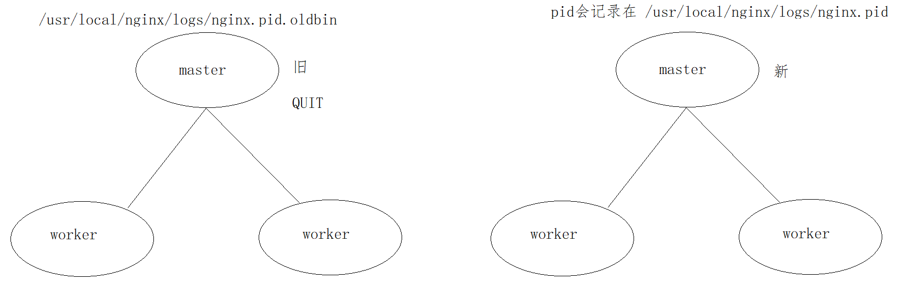
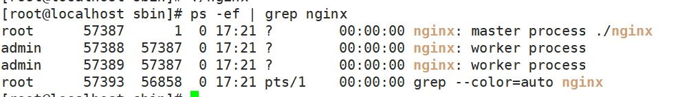

<h1>Nginx</h1>


--------

# 目录

[TOC]


# 一、简介


## 1.1：背景简介


Nginx`（engine x）`一个具有高性能的**【HTTP】**和**【反向代理】**的**【WEB服务器】**，同时也是一个**【POP3/SMTP/IMAP代理服务器】**，是由伊戈尔·赛索耶夫(俄罗斯人)使用C语言编写的，Nginx的第一个版本是2004年10月4号发布的0.1.0版本。另外值得一提的是伊戈尔·赛索耶夫将Nginx的源码进行了开源，这也为Nginx的发展提供了良好的保障。


+ WEB服务器
	+ WEB服务器也叫网页服务器，英文名叫Web Server，主要功能是为用户提供网上信息浏览服务。

+ HTTP
	+ HTTP是超文本传输协议的缩写，是用于从WEB服务器传输超文本到本地浏览器的传输协议，也是互联网上应用最为广泛的一种网络协议。HTTP是一个客户端和服务器端请求和应答的标准，客户端是终端用户，服务端是网站，通过使用Web浏览器、网络爬虫或者其他工具，客户端发起一个到服务器上指定端口的HTTP请求。

+ POP3/SMTP/IMAP：
	+ POP3(Post Offic Protocol 3)邮局协议的第三个版本，
	+ SMTP(Simple Mail Transfer Protocol)简单邮件传输协议，
	+ IMAP(Internet Mail Access Protocol)交互式邮件存取协议，

**通过上述名词的解释，我们可以了解到Nginx也可以作为电子邮件代理服务器。**

+ 反向代理


+ 反向代理


## 1.2：常见服务器对比


| 名称         | 简介                                                         |
| ------------ | ------------------------------------------------------------ |
| IIS          | 全称(Internet Information Services)即互联网信息服务，是由微软公司提供的基于windows系统的互联网基本服务。windows作为服务器在稳定性与其他一些性能上都不如类UNIX操作系统，因此在需要高性能Web服务器的场合下，IIS可能就会被"冷落". |
| Tomcat       | Tomcat是一个运行Servlet和JSP的Web应用软件，Tomcat技术先进、性能稳定而且开放源代码，因此深受Java爱好者的喜爱并得到了部分软件开发商的认可，成为目前比较流行的Web应用服务器。但是Tomcat天生是一个重量级的Web服务器，对静态文件和高并发的处理比较弱。 |
| Apache       | Apache的发展时期很长，同时也有过一段辉煌的业绩。从上图可以看出大概在2014年以前都是市场份额第一的服务器。Apache有很多优点，如稳定、开源、跨平台等。但是它出现的时间太久了，在它兴起的年代，互联网的产业规模远远不如今天，所以它被设计成一个重量级的、不支持高并发的Web服务器。在Apache服务器上，如果有数以万计的并发HTTP请求同时访问，就会导致服务器上消耗大量能存，操作系统内核对成百上千的Apache进程做进程间切换也会消耗大量的CUP资源，并导致HTTP请求的平均响应速度降低，这些都决定了Apache不可能成为高性能的Web服务器。这也促使了Lighttpd和Nginx的出现。 |
| Lighttpd     | Lighttpd是德国的一个开源的Web服务器软件，它和Nginx一样，都是轻量级、高性能的Web服务器，欧美的业界开发者比较钟爱Lighttpd,而国内的公司更多的青睐Nginx，同时网上Nginx的资源要更丰富些。 |
| 其他的服务器 | Google Servers，Weblogic, Webshpere(IBM)...经过各个服务器的对比，种种迹象都表明，Nginx将以性能为王。这也是我们为什么选择Nginx的理由。 |


## 1.3：Nginx优点


### 1.速度更快、并发更高


单次请求或者高并发请求的环境下，Nginx都会比其他Web服务器响应的速度更快。一方面在正常情况下，单次请求会得到更快的响应，另一方面，在高峰期(如有数以万计的并发请求)，Nginx比其他Web服务器更快的响应请求。Nginx之所以有这么高的并发处理能力和这么好的性能原因在于Nginx**采用了多进程和I/O多路复用(epoll)的底层实现**。


### 2.配置简单，扩展性强


Nginx的设计极具扩展性，它本身就是由**很多模块组成**，这些模块的使用可以通过配置文件的配置来添加。这些模块有官方提供的也有第三方提供的模块，如果需要完全可以开发服务自己业务特性的定制模块。


### 3.高可靠性


**Nginx采用的是多进程模式运行，其中有一个master主进程和N多个worker进程**，worker进程的数量我们可以手动设置，每个worker进程之间都是相互独立提供服务，并且master主进程可以在某一个worker进程出错时，快速去"拉起"新的worker进程提供服务。


### 4.热部署


现在互联网项目都要求以7*24小时进行服务的提供，针对于这一要求，Nginx也提供了热部署功能，即可以在Nginx不停止的情况下，对Nginx进行文件升级、更新配置和更换日志文件等功能。


### 5.成本低、BSD许可证


BSD是一个开源的许可证，世界上的开源许可证有很多，现在比较流行的有六种分别是GPL、BSD、MIT、Mozilla、Apache、LGPL。这六种的区别是什么，我们可以通过下面一张图来解释下：


> **<font color='black'>Nginx本身是开源的，我们不仅可以免费的将Nginx应用在商业领域，而且还可以在项目中直接修改Nginx的源码来定制自己的特殊要求。这些点也都是Nginx为什么能吸引无数开发者继续为Nginx来贡献自己的智慧和青春。OpenRestry [Nginx+Lua]   Tengine[淘宝]</font>**


## 1.4：Nginx的功能特性及常用功能


### 1.简介


Nginx提供的基本功能服务从大体上归纳为"基本HTTP服务"、“高级HTTP服务”和"邮件服务"等三大类。


### 2.基本HTTP服务


Nginx可以提供基本HTTP服务，可以作为HTTP代理服务器和反向代理服务器，支持通过缓存加速访问，可以完成简单的负载均衡和容错，支持包过滤功能，支持SSL等。

- 处理静态文件、处理索引文件以及支持自动索引；
- 提供反向代理服务器，并可以使用缓存加上反向代理，同时完成负载均衡和容错；
- 提供对FastCGI、memcached等服务的缓存机制，，同时完成负载均衡和容错；
- 使用Nginx的模块化特性提供过滤器功能。Nginx基本过滤器包括gzip压缩、ranges支持、chunked响应、XSLT、SSI以及图像缩放等。其中针对包含多个SSI的页面，经由FastCGI或反向代理，SSI过滤器可以并行处理。
- 支持HTTP下的安全套接层安全协议SSL.
- 支持基于加权和依赖的优先权的HTTP/2


### 3.高级HTTP服务


- 支持基于名字和IP的虚拟主机设置
- 支持HTTP/1.0中的KEEP-Alive模式和管线(PipeLined)模型连接
- 自定义访问日志格式、带缓存的日志写操作以及快速日志轮转。
- 提供3xx~5xx错误代码重定向功能
- 支持重写（Rewrite)模块扩展
- 支持重新加载配置以及在线升级时无需中断正在处理的请求
- 支持网络监控
- 支持FLV和MP4流媒体传输


### 4.邮件服务


Nginx提供邮件代理服务也是其基本开发需求之一，主要包含以下特性：

- 支持IMPA/POP3代理服务功能
- 支持内部SMTP代理服务功能


### 5.常用功能模块


```java
静态资源部署
Rewrite地址重写
	正则表达式
反向代理
负载均衡
	轮询、加权轮询、ip_hash、url_hash、fair
Web缓存
环境部署
	高可用的环境
用户认证模块...
```


### 6.核心组成


+ nginx二进制可执行文件
+ nginx.conf配置文件
+ error.log错误的日志记录
+ access.log访问日志记录


## 1.5：官网


### 1.官网首页


+ Nginx的官方网站为: http://nginx.org


### 2.下载地址


Nginx的官方下载网站为<http://nginx.org/en/download.html>，当然你也可以之间在首页选中右边的download进入版本下载网页。在下载页面我们会看到如下内容：


### 获取Nginx源码

<http://nginx.org/download/>

打开上述网站，就可以查看到Nginx的所有版本，选中自己需要的版本进行下载。下载我们可以直接在windows上下载然后上传到服务器，也可以直接从服务器上下载，这个时候就需要准备一台服务器。


## 1.6：安装


### 1.安装依赖


+ GCC

```java
yum install -y gcc
```

安装成功后，可以通过`gcc --version`来查看gcc是否安装成功


+ PCRE


Nginx在编译过程中需要使用到PCRE库（perl Compatible Regular Expressoin 兼容正则表达式库)，因为在Nginx的Rewrite模块和http核心模块都会使用到PCRE正则表达式语法。

```java
yum install -y pcre pcre-devel
```

安装成功后，可以通过`rpm -qa pcre pcre-devel`来查看是否安装成功


+ zlib


zlib库提供了开发人员的压缩算法，在Nginx的各个模块中需要使用gzip压缩，所以我们也需要提前安装其库及源代码zlib和zlib-devel

```java
yum install -y zlib zlib-devel
```

安装成功后，可以通过`rpm -qa zlib zlib-devel`来查看是否安装成功


+ OpenSSL


OpenSSL是一个开放源代码的软件库包，应用程序可以使用这个包进行安全通信，并且避免被窃听。

SSL:Secure Sockets Layer安全套接协议的缩写，可以在Internet上提供秘密性传输，其目标是保证两个应用间通信的保密性和可靠性。在Nginx中，如果服务器需要提供安全网页时就需要用到OpenSSL库，所以我们需要对OpenSSL的库文件及它的开发安装包进行一个安装。

```java
yum install -y openssl openssl-devel
```

安装成功后，可以通过`rpm -qa openssl openssl-devel`来查看是否安装成功


### 2.一键安装依赖


上述命令，一个个来的话比较麻烦，我们也可以通过一条命令来进行安装


```java
yum install -y gcc pcre pcre-devel zlib zlib-devel openssl openssl-devel
```


### 3.源码安装


+ 地址

```java
wget  http://nginx.org/download/nginx-1.18.0.tar.gz
```

+ 复制到我们安装位置

```java
cp /app/package/nginx-1.18.0.tar.gz /app/nginx/core/
```

+ 解压

```java
tar -zxvf nginx-1.18.0.tar.gz
```

+ 进入目录配置

```java
./configure 
```

+ 编译

```java
make
```

+ 安装

```java
make install
```

+ 安装路径

```java
默认安装在：/usr/local/nginx
```


### 4.yum安装


使用源码进行简单安装，我们会发现安装的过程比较繁琐，需要提前准备GCC编译器、PCRE兼容正则表达式库、zlib压缩库、OpenSSL安全通信的软件库包，然后才能进行Nginx的安装。

+ 安装yum-utils

```java
sudo yum  install -y yum-utils
```

+ 安装yum源文件

```java
vim /etc/yum.repos.d/nginx.repo
```

```shell
[nginx-stable]
name=nginx stable repo
baseurl=http://nginx.org/packages/centos/$releasever/$basearch/
gpgcheck=1
enabled=1
gpgkey=https://nginx.org/keys/nginx_signing.key
module_hotfixes=true

[nginx-mainline]
name=nginx mainline repo
baseurl=http://nginx.org/packages/mainline/centos/$releasever/$basearch/
gpgcheck=1
enabled=0
gpgkey=https://nginx.org/keys/nginx_signing.key
module_hotfixes=true
```

+ 查看是否安装成功

```java
yum list | grep nginx
```

+ 安装

```java
yun install -y nginx
```

+ 查看安装位置

```java
whereis nginx
```


# 二、基础内容


## 2.1：目录结构分析


### 1.图


> 在使用Nginx之前，我们先对安装好的Nginx目录文件进行一个分析，在这块给大家介绍一个工具tree，通过tree我们可以很方面的去查看centos系统上的文件目录结构，当然，如果想使用tree工具，就得先通过`yum install -y tree`来进行安装，安装成功后，可以通过执行`tree /usr/local/nginx`(tree后面跟的是Nginx的安装目录)，获取的结果如下：


### 2.主要目录


| 名称 | 简介                                                         |
| ---- | ------------------------------------------------------------ |
| conf | nginx所有配置文件目录                                        |
| html | 存放nginx自带的两个静态的html页面                            |
| logs | 记录日志的文件，当nginx服务器启动后，这里面会有 access.log error.log 和nginx.pid三个文件出现。 |
| sbin | 是存放执行程序文件nginx                                      |


### 3.CGI


公共网关接口（Common Gateway Interface，CGI）是Web 服务器运行时外部程序的规范，按CGI 编写的程序可以扩展服务器功能。CGI 应用程序能与浏览器进行交互，还可通过数据API与数据库服务器等外部数据源进行通信，从数据库服务器中获取数据。格式化为HTML文档后，发送给浏览器，也可以将从浏览器获得的数据放到数据库中。几乎所有服务器都支持CGI，可用任何语言编写CGI，包括流行的C、C ++、Java、VB 和Delphi 等。CGI分为标准CGI和间接CGI两种。标准CGI使用命令行参数或环境变量表示服务器的详细请求，服务器与浏览器通信采用标准输入输出方式。间接CGI又称缓冲CGI，在CGI程序和CGI接口之间插入一个缓冲程序，缓冲程序与CGI接口间用标准输入输出进行通信 。


### 4.conf目录文件


| 文件名                    | 简称                                                         |
| ------------------------- | ------------------------------------------------------------ |
| fastcgi.conf              | fastcgi相关配置文件                                          |
| fastcgi.conf.default      | fastcgi.conf的备份文件                                       |
| fastcgi_params            | fastcgi的参数文件                                            |
| fastcgi_params.default    | fastcgi的参数备份文件                                        |
| scgi_params               | scgi的参数文件                                               |
| scgi_params.default       | scgi的参数备份文件                                           |
| uwsgi_params              | uwsgi的参数文件                                              |
| uwsgi_params.default      | uwsgi的参数备份文件                                          |
| mime.types                | 记录的是HTTP协议中的Content-Type的值和文件后缀名的对应关系   |
| mime.types.default        | mime.types的备份文件                                         |
| nginx.conf                | 这个是Nginx的核心配置文件，这个文件非常重要，也是我们即将要学习的重点 |
| nginx.conf.default        | nginx.conf的备份文件                                         |
| oi-utf、koi-win、win-utfk | 这三个文件都是与编码转换映射相关的配置文件，用来将一种编码转换成另一种编码 |


### 5.html目录


| 文件名称   | 描述                 |
| ---------- | -------------------- |
| 50x.html   | 访问失败后的失败页面 |
| index.html | 成功访问的默认首页   |


### 6.sbin目录


| 文件名称 | 描述                                    |
| -------- | --------------------------------------- |
| nginx    | 是用来控制Nginx的启动和停止等相关的命令 |


## 2.2：启动/停止/重启


### 1.简介


对于Nginx的启停在linux系统中也有很多种方式：

1. Nginx服务的信号控制

2. Nginx的命令行控制


### 2.Nginx服务的信号控制


#### 简介

前面在提到Nginx的高性能，其实也和它的架构模式有关。Nginx默认采用的是多进程的方式来工作的，当将Nginx启动后，我们通过`ps -ef | grep nginx`命令可以查看到如下内容：


从上图中可以看到：

+ **Nginx后台进程中包含一个master进程和多个worker进程，**
+ **master进程主要用来管理worker进程，包含接收外界的信息，并将接收到的信号发送给各个worker进程，监控worker进程的状态，**
+ **当worker进程出现异常退出后，会自动重新启动新的worker进程。**
+ **而worker进程则是专门用来处理用户请求的，各个worker进程之间是平等的并且相互独立，处理请求的机会也是一样的。**


nginx的进程模型，我们可以通过下图来说明下：


我们现在作为管理员，只需要通过给master进程发送信号就可以来控制Nginx,这个时候我们需要有两个前提条件，一个是要操作的master进程，一个是信号。


#### 获取master进程id


+ 方式一：通过`ps -ef | grep nginx`；
+ 方式二：在讲解nginx的`./configure`的配置参数的时候，有一个参数是`--pid-path=PATH`默认是`/usr/local/nginx/logs/nginx.pid`,所以可以通过查看该文件来获取nginx的master进程ID.


#### 信号种类


| 信号     | 作用                                                       |
| -------- | ---------------------------------------------------------- |
| TERM/INT | 立即关闭整个服务                                           |
| QUIT     | "优雅"地关闭整个服务                                       |
| HUP      | 重读配置文件并使用服务对新配置项生效                       |
| USR1     | 重新打开日志文件，可以用来进行日志切割                     |
| USR2     | 平滑升级到最新版的nginx                                    |
| WINCH    | 所有子进程不在接收处理新连接，相当于给work进程发送QUIT指令 |


#### 使用信号语法


```java
kill -signal PID
```


+ signal:即为信号；

+ PID即为获取到的master线程ID


#### 信号具体使用


1. 发送TERM/INT信号给master进程，会将Nginx服务立即关闭。


```shell
kill -TERM PID / kill -TERM `cat /usr/local/nginx/logs/nginx.pid`
kill -INT PID / kill -INT `cat /usr/local/nginx/logs/nginx.pid`
```


2. 发送QUIT信号给master进程，master进程会控制所有的work进程不再接收新的请求，等所有请求处理完后，在把进程都关闭掉。


```shell
kill -QUIT PID / kill -TERM `cat /usr/local/nginx/logs/nginx.pid`
```


3. 发送HUP信号给master进程，master进程会把控制旧的work进程不再接收新的请求，等处理完请求后将旧的work进程关闭掉，然后根据nginx的配置文件重新启动新的work进程


```shell
kill -HUP PID / kill -TERM `cat /usr/local/nginx/logs/nginx.pid`
```


4. 发送USR1信号给master进程，告诉Nginx重新开启日志文件


```shell
kill -USR1 PID / kill -TERM `cat /usr/local/nginx/logs/nginx.pid`
```


5. 发送USR2信号给master进程，告诉master进程要平滑升级，这个时候，会重新开启对应的master进程和work进程，整个系统中将会有两个master进程，并且新的master进程的PID会被记录在`/usr/local/nginx/logs/nginx.pid`而之前的旧的master进程PID会被记录在`/usr/local/nginx/logs/nginx.pid.oldbin`文件中，接着再次发送QUIT信号给旧的master进程，让其处理完请求后再进行关闭


```shell
kill -USR2 PID / kill -USR2 `cat /usr/local/nginx/logs/nginx.pid`
```

```shell
kill -QUIT PID / kill -QUIT `cat /usr/local/nginx/logs/nginx.pid.oldbin`
```




6. 发送WINCH信号给master进程,让master进程控制不让所有的work进程在接收新的请求了，请求处理完后关闭work进程。注意master进程不会被关闭掉


```shell
kill -WINCH PID /kill -WINCH`cat /usr/local/nginx/logs/nginx.pid`
```


### 3.命令行控制


#### 简介

此方式是通过Nginx安装目录下的sbin下的可执行文件nginx来进行Nginx状态的控制，我们可以通过`nginx -h`来查看都有哪些参数可以用：


| 参数   | 说明                                                         |
| ------ | ------------------------------------------------------------ |
| -?和-h | 显示帮助信息                                                 |
| -v     | 打印版本号信息并退出                                         |
| -V     | 打印版本号信息和配置信息并退出                               |
| -t     | 测试nginx的配置文件语法是否正确并退出                        |
| -T     | 测试nginx的配置文件语法是否正确并列出用到的配置文件信息然后退出 |
| -q     | 在配置测试期间禁止显示非错误消息                             |
| -s     | signal信号，后面可以跟 ：<br>          stop[快速关闭，类似于TERM/INT信号的作用]<br>          quit[优雅的关闭，类似于QUIT信号的作用] 	<br>          reopen[重新打开日志文件类似于USR1信号的作用] 	<br>          reload[类似于HUP信号的作用] |
| -p     | prefix指定Nginx的prefix路径，(默认为: /usr/local/nginx/)     |
| -c     | filename指定Nginx的配置文件路径,(默认为: conf/nginx.conf)    |
| -g     | directives用来补充Nginx配置文件，向Nginx服务指定启动时应用全局的配置 |


### 4.常用命令


+ 查看 nginx 版本号

```java
./nginx -v
```

+ 启动 nginx

```java
./nginx
```

+  停止 nginx

```java
./nginx -s stop
```

+ 重新加载 nginx

```java
./nginx -s reload
```


## 2.2：nginx.conf


从前面的内容学习中，我们知道Nginx的核心配置文件默认是放在`/usr/local/nginx/conf/nginx.conf`，这一节，我们就来学习下nginx.conf的内容和基本配置方法。

读取Nginx自带的Nginx配置文件，我们将其中的注释部分【学习一个技术点就是在Nginx的配置文件中可以使用`#`来注释】删除掉后，就剩下下面内容:	

> **简单小结下:**
>
> **nginx.conf配置文件中默认有三大块：全局块、events块、http块**
>
> **http块中可以配置多个server块，每个server块又可以配置多个location块。**

```java
worker_processes  1;

events {
    worker_connections  1024;
}

http {
    include       mime.types;
    default_type  application/octet-stream;
    sendfile        on;
    keepalive_timeout  65;

    server {
        listen       80;
        server_name  localhost;
        location / {
            root   html;
            index  index.html index.htm;
        }
        error_page   500 502 503 504  /50x.html;
        location = /50x.html {
            root   html;
        }
    }

}
```


```java
指令名	指令值;  #全局块，主要设置Nginx服务器整体运行的配置指令

 #events块,主要设置,Nginx服务器与用户的网络连接,这一部分对Nginx服务器的性能影响较大
events {	 
    指令名	指令值;
}
#http块，是Nginx服务器配置中的重要部分，代理、缓存、日志记录、第三方模块配置...             
http {		
    指令名	指令值;
    server { #server块，是Nginx配置和虚拟主机相关的内容
        指令名	指令值;
        location / { 
        #location块，基于Nginx服务器接收请求字符串与location后面的值进行匹配，对特定请求进行处理
            指令名	指令值;
        }
    }
	...
}
```


## 2.3：全局块


### 1.简介

主要设置Nginx服务器整体运行的配置指令


### 2.user指令简介


nginx 运行后可以指定用户，比如说一个静态网页服务器的文件目录的不同的用户有不同的访问权限，使用 nginx 指定用户就可以有权限对此目录读写。

user指令:用于配置运行Nginx服务器的worker进程的用户和用户组。

| 语法   | user user [group] |
| ------ | ----------------- |
| 默认值 | nobody            |
| 位置   | 全局块            |

该属性也可以在编译的时候指定，语法如下

```java
./configure --user=user --group=group
```

如果两个地方都进行了设置，最终生效的是配置文件中的配置。


### 3.user指令使用


+ centos新建用户admin

```java
useradd admin
```

+ 配置nginx.conf

```java
user admin;
```


+ 测试配置文件语法格式

```java
cd /usr/local/nginx/sbin
./nginx -t    
```


+ 创建/root/html/index.html文件

```java
<h1>MY name is admin`</h1>
```

+ 再次修改nginx.conf文件

```java
location / {
	root   /root/html;
	index  index.html index.htm;
}
```


+ 重启nginx

```java
./nginx -s reload
```


+ 403解决

页面会报403拒绝访问的错误

因为当前用户没有访问/root/html目录的权限

将文件创建到 `/home/admin/html/index.html`,修改配置

```java
location / {
	root   /home/admin/html;
	index  index.html index.htm;
}
```


+ 重启测试

	


### 4.user指令总结


综上所述，使用user指令可以指定**启动运行工作进程的用户及用户组**，这样对于系统的权限访问控制的更加精细，也更加安全。

这里的用户和用户组指的是：`liunx的用户`


### 5.master_process指令


master_process:用来指定**是否开启工作进程**，如果开启只会主进程


| 语法   | master_process on\|off; |
| ------ | ----------------------- |
| 默认值 | master_process on;      |
| 位置   | 全局块                  |

**注意：如果修改了mater_process的值我们是需要来重启nginx的**


### 6.worker_processes指令


worker_processes:用于配置Nginx生成工作进程的数量，这个是Nginx服务器实现并发处理服务的关键所在。理论上来说workder process的值越大，可以支持的并发处理量也越多，但事实上这个值的设定是需要受到来自服务器自身的限制，建议将该值和服务器CPU的内核数保存一致。


| 语法   | worker_processes     num/auto; |
| ------ | ------------------------------ |
| 默认值 | 1                              |
| 位置   | 全局块                         |


+ 如果将worker_processes设置成2，则会看到如下内容:





+ 注意：**开启worker的时候，不能设置master_pocesses进程**


### 7.daemon指令


设定Nginx是否以守护进程的方式启动。

守护式进程是linux后台执行的一种服务进程，特点是独立于控制终端，不会随着终端关闭而停止。

简单的说是否以后台方式启动，**默认on打开**

| 简介   | 描述            |
| ------ | --------------- |
| 语法   | daemon on\|off; |
| 默认值 | daemon on;      |
| 位置   | 全局块          |


**<font color='red'>重启生效</font>**


### 8.pid指令


pid:用来配置Nginx当前master进程的进程号ID存储的文件路径。


|        | 描述                                     |
| ------ | ---------------------------------------- |
| 语法   | pid file;                                |
| 默认值 | 默认为:`/usr/local/nginx/logs/nginx.pid` |
| 位置   | 全局块                                   |

该属性可以通过`./configure --pid-path=PATH`来指定


### 9.error_log指令


error_log:用来配置Nginx的错误日志存放路径

|        | 描述                            |
| ------ | ------------------------------- |
| 语法   | error_log  file [日志级别];     |
| 默认值 | error_log logs/error.log error; |
| 位置   | 全局块、http、server、location  |

该属性可以通过`./configure --error-log-path=PATH`来指定

其中日志级别的值有：`debug|info|notice|warn|error|crit|alert|emerg`，翻译过来为试`信息|通知|警告|错误|临界|警报|紧急`，这块建议大家设置的时候不要设置成info以下的等级，因为会带来大量的磁盘I/O消耗，影响Nginx的性能。


### 10.include


include:用来引入其他配置文件，使Nginx的配置更加灵活

|        | 描述          |
| ------ | ------------- |
| 语法   | include file; |
| 默认值 | 无            |
| 位置   | any           |


## 2.4：events块


### 1.简介

主要设置,Nginx服务器与用户的网络连接,这一部分对Nginx服务器的性能影响较大

所在位置


### 2.accept_mutex-设置Nginx网络连接序列化


用来设置Nginx网络连接序列化

|        | 描述                  |
| ------ | --------------------- |
| 语法   | accept_mutex on\|off; |
| 默认值 | accept_mutex on;      |
| 位置   | events                |

这个配置主要可以用来解决常说的"惊群"问题。大致意思是在某一个时刻，客户端发来一个请求连接，Nginx后台是以多进程的工作模式，也就是说有多个worker进程会被同时唤醒，但是最终只会有一个进程可以获取到连接，如果每次唤醒的进程数目太多，就会影响Nginx的整体性能。如果将上述值设置为on(开启状态)，将会对多个Nginx进程接收连接进行序列号，一个个来唤醒接收，就防止了多个进程对连接的争抢。


> 简单的就说如果不设置的话，那么我们进来的请求，nginx不知道安排那个work proeccs来处理


### 3.multi_accept-接收多个网络连接


用来设置是否允许同时接收多个网络连接

如果multi_accept被禁止了，nginx一个工作进程只能同时接受一个新的连接。否则，一个工作进程可以同时接受所有的新连接

|        | 描述                  |
| ------ | --------------------- |
| 语法   | multi_accept on\|off; |
| 默认值 | multi_accept off;     |
| 位置   | events                |


### 4.worker_connections-单个worker进程最大的连接数


用来配置单个worker进程最大的连接数

这里的连接数不仅仅包括和前端用户建立的连接数，而是包括所有可能的连接数。另外，number值不能大于操作系统支持打开的最大文件句柄数量。

|        | 描述                       |
| ------ | -------------------------- |
| 语法   | worker_connections number; |
| 默认值 | worker_commections 512;    |
| 位置   | events                     |


### 5.use-事件驱动来处理网络消息


用来设置Nginx服务器选择哪种事件驱动来处理网络消息。

注意：此处所选择事件处理模型是Nginx优化部分的一个重要内容，**method的可选值有`select/poll/epoll/kqueue`等**，之前在准备centos环境的时候，我们强调过要使用linux内核在2.6以上，就是为了能使用epoll函数来优化Nginx。


|        | 描述           |
| ------ | -------------- |
| 语法   | use  method;   |
| 默认值 | 根据操作系统定 |
| 位置   | events         |


另外这些值的选择，我们也可以在编译的时候使用

`--with-select_module`、`--without-select_module`、

` --with-poll_module`、` --without-poll_module`来设置是否需要将对应的事件驱动模块编译到Nginx的内核。

### 6.events指令配置实例


+ 打开Nginx的配置文件 nginx.conf,添加如下配置


```java
events{
	accept_mutex on;
	multi_accept on;
	worker_connections 1024;
	use epoll;
}
```


+ 启动测试


```java
./nginx -t
./nginx -s reload
```


## 2.5：http块


### 1.简介


是Nginx服务器配置中的重要部分，代理、缓存、日志记录、第三方模块配置...   


### 2.定义MIME-Type


我们都知道浏览器中可以显示的内容有HTML、XML、GIF等种类繁多的文件、媒体等资源，浏览器为了区分这些资源，就需要使用MIME Type。所以说MIME Type是网络资源的媒体类型。Nginx作为web服务器，也需要能够识别前端请求的资源类型。

在Nginx的配置文件中，默认有两行配置

```java
include mime.types;
default_type application/octet-stream;
```


> default_type:用来配置Nginx响应前端请求默认的MIME类型。
>
> |        | 描述                      |
> | ------ | ------------------------- |
> | 语法   | default_type mime-type;   |
> | 默认值 | default_type text/plain； |
> | 位置   | http、server、location    |
>
> 在default_type之前还有一句`include mime.types`,include之前我们已经介绍过，相当于把mime.types文件中MIMT类型与相关类型文件的文件后缀名的对应关系加入到当前的配置文件中。
>
> 举例来说明：
>
> 有些时候请求某些接口的时候需要返回指定的文本字符串或者json字符串，如果逻辑非常简单或者干脆是固定的字符串，那么可以使用nginx快速实现，这样就不用编写程序响应请求了，可以减少服务器资源占用并且响应性能非常快。
>

如何实现:

```java
location /get_text {
	#这里也可以设置成text/plain
    default_type text/html;
    return 200 "This is nginx's text";
}
location /get_json{
    default_type application/json;
    return 200 '{"name":"TOM","age":18}';
}
```


### 3.自定义服务日志


Nginx中日志的类型分access.log、error.log。

| 分类       | 描述                                                    |
| ---------- | ------------------------------------------------------- |
| access.log | 用来记录用户所有的访问请求。                            |
| error.log  | 记录nginx本身运行时的错误信息，不会记录用户的访问请求。 |

Nginx服务器支持对服务日志的格式、大小、输出等进行设置，需要使用到两个指令，分别是access_log和log_format指令。


+ access_log:用来设置用户访问日志的相关属性。


|        | 描述                                 |
| ------ | ------------------------------------ |
| 语法   | access_log path[format[buffer=size]] |
| 默认值 | access_log logs/access.log combined; |
| 位置   | `http`, `server`, `location`         |


+ log_format:用来指定日志的输出格式。


|        | 描述                                                     |
| ------ | -------------------------------------------------------- |
| 语法   | log_format name [escape=default\|json\|none] string....; |
| 默认值 | log_format combined "...";                               |
| 位置   | http                                                     |


### 4.sendfile-处理静态资源的性能


用来设置Nginx服务器是否使用sendfile()传输文件，该属性可以大大提高Nginx处理静态资源的性能

|        | 描述                   |
| ------ | ---------------------- |
| 语法   | sendfile on\|off；     |
| 默认值 | sendfile off;          |
| 位置   | http、server、location |


### 5.keepalive_timeout-长连接的超时时间。


用来设置长连接的超时时间。

> 为什么要使用keepalive？
>
> 我们都知道HTTP是一种无状态协议，客户端向服务端发送一个TCP请求，服务端响应完毕后断开连接。
> 如何客户端向服务端发送多个请求，每个请求都需要重新创建一次连接，效率相对来说比较多，使用keepalive模式，可以告诉服务器端在处理完一个请求后保持这个TCP连接的打开状态，若接收到来自这个客户端的其他请求，服务端就会利用这个未被关闭的连接，而不需要重新创建一个新连接，提升效率，但是这个连接也不能一直保持，这样的话，连接如果过多，也会是服务端的性能下降，这个时候就需要我们进行设置其的超时时间。


|        | 描述                    |
| ------ | ----------------------- |
| 语法   | keepalive_timeout time; |
| 默认值 | keepalive_timeout 75s;  |
| 位置   | http、server、location  |


### 6.keepalive_requests


keepalive_requests:用来设置一个keep-alive连接使用的次数。

|        | 描述                       |
| ------ | -------------------------- |
| 语法   | keepalive_requests number; |
| 默认值 | keepalive_requests 100;    |
| 位置   | http、server、location     |


### 7.server块和location块


server块和location块都是我们要重点讲解和学习的内容，因为我们后面会对Nginx的功能进行详细讲解，所以这块内容就放到静态资源部署的地方给大家详细说明。

本节我们主要来认识下Nginx默认给的nginx.conf中的相关内容，以及server块与location块在使用的时候需要注意的一些内容。


```java
	server {
        listen       80;
        server_name  localhost;
        location / {
            root   html;
            index  index.html index.htm;
        }
       
        error_page   500 502 503 504 404  /50x.html;
        location = /50x.html {
            root   html;
        }
    }
```


## 2.6：nginx配置成系统服务


### 1.前言


经过前面的操作，我们会发现，如果想要启动、关闭或重新加载nginx配置文件，都需要先进入到nginx的安装目录的sbin目录，然后使用nginx的二级制可执行文件来操作，相对来说操作比较繁琐，这块该如何优化？另外如果我们想把Nginx设置成随着服务器启动就自动完成启动操作，又该如何来实现?


### 2.配置

把Nginx应用服务设置成为系统服务，方便对Nginx服务的启动和停止等相关操作，具体实现步骤:

```shell
vim /usr/lib/systemd/system/nginx.service
```

```c#
[Unit]
Description=nginx web service
Documentation=http://nginx.org/en/docs/
After=network.target

[Service]
Type=forking
PIDFile=/usr/local/nginx/logs/nginx.pid
ExecStartPre=/usr/local/nginx/sbin/nginx -t -c /usr/local/nginx/conf/nginx.conf
ExecStart=/usr/local/nginx/sbin/nginx
ExecReload=/usr/local/nginx/sbin/nginx -s reload
ExecStop=/usr/local/nginx/sbin/nginx -s stop
PrivateTmp=true

[Install]
WantedBy=default.target
```


### 3.修改权限


```shell
chmod 755 /usr/lib/systemd/system/nginx.service
```


### 4.使用命令来操作nginx


| 描述             | 命令                    |
| ---------------- | ----------------------- |
| 启动             | systemctl start nginx   |
| 停止             | systemctl stop nginx    |
| 重启             | systemctl restart nginx |
| 重新加载配置文件 | systemctl reload nginx  |
| 查看nginx状态    | systemctl status nginx  |
| 开机启动         | systemctl enable nginx  |


## 2.7：Nginx命令配置到系统环境


### 1.简介


前面我们介绍过Nginx安装目录下的二级制可执行文件`nginx`的很多命令，要想使用这些命令前提是需要进入sbin目录下才能使用，很不方便，如何去优化，我们可以将该二进制可执行文件加入到系统的环境变量，这样的话在任何目录都可以使用nginx对应的相关命令。具体实现步骤如下:


### 2.配置


(1)修改`/etc/profile`文件

```java
vim /etc/profile
在最后一行添加
export PATH=$PATH:/usr/local/nginx/sbin
```


(2)使之立即生效

```shell
source /etc/profile
```

(3)执行nginx命令

```shell
nginx -V
```


# 三、基础配置实战


## 3.1：需求分析


前面我们已经对Nginx服务器默认配置文件的结构和涉及的基本指令做了详细的阐述。通过这些指令的合理配置，我们就可以让一台Nginx服务器正常工作，并且提供基本的web服务器功能。

接下来我们将通过一个比较完整和最简单的基础配置实例，来巩固下前面所学习的指令及其配置。

+ 需求如下

```c
（1）有如下访问：
	http://192.168.244.100:8081/server1/location1
		访问的是：index_sr1_location1.html
	http://192.168.244.100:8081/server1/location2
		访问的是：index_sr1_location2.html
	http://192.168.244.100:8082/server2/location1
		访问的是：index_sr2_location1.html
	http://192.168.244.100:8082/server2/location2
		访问的是：index_sr2_location2.html
（2）如果访问的资源不存在，
	返回自定义的404页面
（3）将/server1和/server2的配置使用不同的配置文件分割
	将文件放到/home/www/conf.d目录下，然后使用include进行合并
（4）为/server1和/server2各自创建一个访问日志文件
```


## 3.2：静态资源准备


## 3.3：配置文件


### 1.操作1

```shell
cd /usr/local/nginx/conf/
cp nginx.conf nginx-1.conf
vim nginx.conf
```

### 2.写入以下内容

```java
##全局块 begin##
#配置允许运行Nginx工作进程的用户和用户组
user admin;
#配置运行Nginx进程生成的worker进程数
worker_processes 2;
#配置Nginx服务器运行对错误日志存放的路径
error_log logs/error.log;
#配置Nginx服务器允许时记录Nginx的master进程的PID文件路径和名称
pid logs/nginx.pid;
#配置Nginx服务是否以守护进程方法启动
#daemon on;
##全局块 end##

##events块 begin##
events{
	#设置Nginx网络连接序列化
	accept_mutex on;
	#设置Nginx的worker进程是否可以同时接收多个请求
	multi_accept on;
	#设置Nginx的worker进程最大的连接数
	worker_connections 1024;
	#设置Nginx使用的事件驱动模型
	use epoll;
}
##events块 end##
##http块 start##
http{
	#定义MIME-Type
	include mime.types;
	default_type application/octet-stream;
	#配置允许使用sendfile方式运输
	sendfile on;
	#配置连接超时时间
	keepalive_timeout 65;
	#配置请求处理日志格式
	log_format server1 '===>server1 access log';
	log_format server2 '===>server2 access log';
	##server块 开始##
	include /home/admin/html/conf.d/*.conf;
	##server块 结束##
}
##http块 end##
```


### 3.操作2


```shell
vim /home/admin/html/conf.d/server1.conf
```


### 4.写入以下内容


```java
server{
		#配置监听端口和主机名称
		listen 8081;
		server_name localhost;
		#配置请求处理日志存放路径
		access_log /home/admin/html/server1/log/access.log server1;
		#配置错误页面
		error_page 404 /404.html;
		#配置处理/server1/location1请求的location
		location /server1/location1{
			root /home/admin/html;
			index index_sr1_location1.html;
		}
		#配置处理/server1/location2请求的location
		location /server1/location2{
			root /home/admin/html;
			index index_sr2_location2.html;
		}
		#配置错误页面转向
		location = /404.html {
			root /home/admin/html;
			index 404.html;
		}
}
```


### 5.操作2


```shell
vim /home/admin/html/conf.d/server2.conf
```


### 6.写入以下内容


```java
server{
		#配置监听端口和主机名称
		listen 8082;
		server_name localhost;
		#配置请求处理日志存放路径
		access_log /home/admin/html/server2/log/access.log server1;
		#配置错误页面
		error_page 404 /404.html;
		#配置处理/server2/location1请求的location
		location /server2/location1{
			root /home/admin/html;
			index index_sr1_location1.html;
		}
		#配置处理/server2/location2请求的location
		location /server2/location2{
			root /home/admin/html;
			index index_sr2_location2.html;
		}
		#配置错误页面转向
		location = /404.html {
			root /home/admin/html;
			index 404.html;
		}
}
```


### 7.操作


```java
vim /home/admin/html/404.html
```


```html
<h1>404</h1>
```


## 3.4：测试


```shell
#运行
./nginx -t
#重启
./nginx -s reload
```


游览器访问：


http://192.168.244.100:8081/server1/location1/

http://192.168.244.100:8081/server1/location2/

http://192.168.244.100:8082/server2/location1/

http://192.168.244.100:8082/server2/location2/


# 四、静态资源配置

## 4.1：静态资源概述


上网去搜索访问资源对于我们来说并不陌生，通过浏览器发送一个HTTP请求实现从客户端发送请求到服务器端获取所需要内容后并把内容回显展示在页面的一个过程。这个时候，我们所请 求的内容就分为两种类型，一类是静态资源、一类是动态资源。静态资源即指在服务器端真实存在并且能直接拿来展示的一些文件，比如常见的html页面、css文件、js文件、图 片、视频等资源；动态资源即指在服务器端真实存在但是要想获取需要经过一定的业务逻辑处理，根据不同的条件展示在页面不同这 一部分内容，比如说报表数据展示、根据当前登录用户展示相关具体数据等资源；

Nginx处理静态资源的内容，我们需要考虑下面这几个问题：

```java
（1）静态资源的配置指令
（2）静态资源的配置优化
（3）静态资源的压缩配置指令
（4）静态资源的缓存处理
（5）静态资源的访问控制，包括跨域问题和防盗链问题
```


## 4.2：listen监听端口


### 1.简介


listen:用来配置监听端口。

|        | 描述                                                         |
| ------ | ------------------------------------------------------------ |
| 语法   | listen address[:port] [default_server]...;<br/>listen port [default_server]...; |
| 默认值 | listen *:80 \| *:8000                                        |
| 位置   | server                                                       |

listen的设置比较灵活，我们通过几个例子来把常用的设置方式熟悉下：

```java
listen 127.0.0.1:8000; 监听指定的IP和端口
listen localhost:8000; 监听指定的IP和端口 
listen 127.0.0.1;	监听指定IP的所有端口
listen 8000;	监听指定端口上的连接
listen *:8000;	监听指定端口上的连接
```


### 2.default_server


default_server属性是标识符，用来将此虚拟主机设置成默认主机。所谓的默认主机指的是如果没有匹配到对应的address:port，则会默认执行的。如果不指定默认使用的是第一个server。

```java
server{
	listen 8080;
	server_name 127.0.0.1;
	location /{
		root html;
		index index.html;
	}
}
server{
	listen 8080 default_server;
	server_name localhost;
	default_type text/plain;
	return 444 'This is a error request';
}
```


## 4.3：host文件配置


为了方便学习配置一下host

hosts是一个没有扩展名的系统文件，可以用记事本等工具打开，其作用就是将一些常用的网址域名与其对应的IP地址建立一个关联“数据库”，当用户在浏览器中输入一个需要登录的网址时，系统会首先自动从hosts文件中寻找对应的IP地址，一旦找到，系统会立即打开对应网页，如果没有找到，则系统会再将网址提交DNS域名解析服务器进行IP地址的解析。

windows:C:\Windows\System32\drivers\etc

centos：/etc/hosts

因为域名是要收取一定的费用，所以我们可以使用修改hosts文件来制作一些虚拟域名来使用。需要修改 `/etc/hosts`文件来添加

```java
vim /etc/hosts
127.0.0.1 www.xm.cn
127.0.0.1 www.itxm.cn
127.0.0.1 www.itwhite.cn
```


## 4.4：server_name


### 1.简介


server_name：用来设置虚拟主机服务名称。

127.0.0.1 、 localhost 、域名[www.baidu.com | www.jd.com]

127.0.0.1 、 localhost 、域名[www.baidu.com | www.jd.com]

|        |                                                           |
| ------ | --------------------------------------------------------- |
| 语法   | server_name  name ...;<br/>name可以提供多个中间用空格分隔 |
| 默认值 | server_name  "";                                          |
| 位置   | server                                                    |

关于server_name的配置方式有三种，分别是：

```
精确匹配
通配符匹配
正则表达式匹配
```

配置方式一：精确匹配

如：

```
server {
	listen 80;
	server_name www.itcast.cn www.itheima.cn;
	...
}
```


