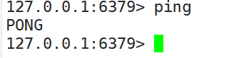

<h1>Redis</h1>

-------------


# 目录

[TOC]

*******************


# 一、简介/安装


## 1.1：概述


REmote DIctionary Server(Redis) 是一个由 Salvatore Sanfilippo 写的 key-value 存储系统，是跨平台的非关系型数据库。

Redis 是一个开源的使用 ANSI C 语言编写、遵守 BSD 协议、支持网络、可基于内存、分布式、可选持久性的键值对(Key-Value)存储数据库，并提供多种语言的 API。

Redis 通常被称为数据结构服务器，因为值（value）可以是字符串(String)、哈希(Hash)、列表(list)、集合(sets)和有序集合(sorted sets)等类型。


+ Redis是一个`开源`的`key-value`存储系统。
+ 和Memcached类似，它支持存储的value类型相对更多，包括`string`(字符串)、`list`(链表)、`set`(集合)、`zset`(sorted set --有序集合)和`hash`（哈希类型）。
+ 这些数据类型都支持push/pop、add/remove及取交集并集和差集及更丰富的操作，而且这些操作都是`原子性`的。
+ 在此基础上，Redis支持各种不同方式的`排序`。
+ 与memcached一样，为了保证效率，数据都是`缓存在内存`中。
+ 区别的是Redis会`周期性`的把更新的`数据写入磁盘`或者把修改操作写入追加的记录文件。
+ 并且在此基础上实现了`master-slave(主从)`同步。


## 1.2：官网


| 简介           | 网址                           |
| -------------- | ------------------------------ |
| Redis 官网     | https://redis.io/              |
| 中文官网       | http://redis.cn/               |
| 源码地址       | https://github.com/redis/redis |
| Redis 在线测试 | http://try.redis.io/           |
| Redis 命令参考 | http://doc.redisfans.com/      |


## 1.3：redis的优势


- **性能极高** – Redis能读的速度是110000次/s,写的速度是81000次/s 。
- **丰富的数据类型** – Redis支持二进制案例的 Strings, Lists, Hashes, Sets 及 Ordered Sets 数据类型操作。
- 原子 – Redis的所有操作都是**原子性的**，意思就是要么成功执行要么失败完全不执行。单个操作是原子性的。多个操作也支持事务，即原子性，通过MULTI和EXEC指令包起来。
- **丰富的特性** – Redis还支持 publish/subscribe, 通知, key 过期等等特性。


## 1.4：Redis与其他key-value存储有什么不同


- Redis有着更为复杂的数据结构并且提供对他们的原子性操作，这是一个不同于其他数据库的进化路径。Redis的数据类型都是基于基本数据结构的同时对程序员透明，无需进行额外的抽象。
- Redis运行在内存中但是可以持久化到磁盘，所以在对不同数据集进行高速读写时需要权衡内存，因为数据量不能大于硬件内存。在内存数据库方面的另一个优点是，相比在磁盘上相同的复杂的数据结构，在内存中操作起来非常简单，这样Redis可以做很多内部复杂性很强的事情。同时，在磁盘格式方面他们是紧凑的以追加的方式产生的，因为他们并不需要进行随机访问。


## 1.5：安装


### 1.下载地址


https://redis.io/download


安装的版本是6.2.1


### 2.安装C语言编译环境


```java
yum install centos-release-scl scl-utils-build
yum install -y devtoolset-8-toolchain
scl enable devtoolset-8 bash
```


安装成功后： **gcc --version**


### 3.上传并解压安装


+ 上传包到liunx虚拟机上： `/app/package`
+ 解压并移动项目：`/app/`


```javascript
tar -zxvf redis-6.2.1.tar.gz 
mv redis-6.2.1 /app/
```


### 4.进入目录编译


进入到`/app/redis-6.2.1`

```javascript
cd /app/redis-6.2.1
make
make install
```


  **如果没有准备好C语言编译环境，make 会报错—Jemalloc/jemalloc.h：没有那个文件**

  **解决方案：运行make distclean,然后再次运行`make` 和`make install`**


### 5.安装目录：/usr/local/bin


查看默认安装目录：

redis-benchmark:性能测试工具，可以在自己本子运行，看看自己本子性能如何

redis-check-aof：修复有问题的AOF文件，rdb和aof后面讲

redis-check-dump：修复有问题的dump.rdb文件

redis-sentinel：Redis集群使用

redis-server：Redis服务器启动命令

redis-cli：客户端，操作入口


## 1.6：启动


### 1.前台启动


运行

```java
/usr/local/bin/redis-server
```


### 2.后台启动


复制一份`redis.conf`文件到任意目录下：

我放在了`/app/redis/rdis-6379`下面了

然后修改文件中的：**daemonize  no 改成 yes**

在`redis-6379`目录下运行命令：


```java
/usr/local/bin/redis-server redis.conf 
```


## 1.7：redis-cli访问


```java
 redis-cli -h host -p port -a password
```

**有时候会有中文乱码:**

要在` redis-cli` 后面加上 `--raw`

| 访问方式       | 命令                             |
| -------------- | -------------------------------- |
| 默认端口访问   | /usr/local/bin/redis-cli         |
| 自定义端口访问 | /usr/local/bin/redis-cli -p 6379 |


测试验证 ： ping




退出： quit

## 1.8：关闭


| 关闭方式       | 命令                       |
| -------------- | -------------------------- |
| 默认端口关闭   | redis-cli shutdown         |
| 自定义端口关闭 | redis-cli -p 6379 shutdown |


## 1.8：redis相关


Redis是单线程+多路IO复用技术

> 多路复用是指使用一个线程来检查多个文件描述符（Socket）的就绪状态，比如调用select和poll函数，传入多个文件描述符，如果有一个文件描述符就绪，则返回，否则阻塞直到超时。得到就绪状态后进行真正的操作可以在同一个线程里执行，也可以启动线程执行（比如使用线程池）


==串行  vs  多线程+锁（memcached） vs  单线程+多路IO复用(Redis)==

与Memcache三点不同: 支持多数据类型，支持持久化，单线程+多路IO复用） 


# 二、Key(键)


## 2.1：查找key-keys


### 1.用法及简介


+ 语法：
	+ **KEYS pattern**
	+ 查找所有符合给定模式 `pattern` 的 `key` 。

+ 案例：
	+ `KEYS *` 匹配数据库中所有 `key` 。
	+ `KEYS h?llo` 匹配 `hello` ， `hallo` 和 `hxllo` 等。

	+ `KEYS h*llo` 匹配 `hllo` 和 `heeeeello` 等。
	+ `KEYS h[ae]llo` 匹配 `hello` 和 `hallo` ，但不匹配 `hillo`
	+ 特殊符号用 `\` 隔开

	

### 2.时间复杂度


O(N)， `N` 为数据库中 `key` 的数量。


### 3.返回值


符合给定模式的 `key` 列表。


### 4.案例


### 5.注意


[KEYS]() 的速度非常快，但在一个大的数据库中使用它仍然可能造成性能问题，如果你需要从一个数据集中查找特定的 `key` ，你最好还是用 Redis 的集合结构(set)来代替。


## 2.2： 删除key-del


### 1.用法及简介


+ 语法

	+ **DEL key [key ...]**
	+ 

	

	**删除给定的一个或多个 `key` 。不存在的 `key` 会被忽略。**

	

### 2.时间复杂度


+ O(N)， `N` 为被删除的 `key` 的数量。

+ 删除单个字符串类型的 `key` ，时间复杂度为O(1)。

+ 删除单个列表、集合、有序集合或哈希表类型的 `key` ，时间复杂度为O(M)， `M` 为以上数据结构内的元素数量。


### 3.返回值


被删除 `key` 的数量。


### 4.案例


```shell
#  删除单个 key
127.0.0.1:6379> set name zhangsan
OK
127.0.0.1:6379> del name
(integer) 1
# 删除一个不存在的 key
127.0.0.1:6379> exists phone 
(integer) 0
127.0.0.1:6379> del phone # 失败，没有 key 被删除
(integer) 0
# 同时删除多个 key
127.0.0.1:6379> del one two three four five
(integer) 5
127.0.0.1:6379> 
```


## 2.3：判断key是否存在-exists


### 1.用法及简介


+ 语法
	+ **EXISTS key**

检查给定 `key` 是否存在。


### 2.时间复杂度


O(1)


### 3.返回值


若 `key` 存在，返回 `1` ，否则返回 `0` 。


### 4.案例


```java
127.0.0.1:6379> EXISTS name
(integer) 1
127.0.0.1:6379> EXISTS name2
(integer) 0
127.0.0.1:6379> 
```


## 2.4：设置过期key-expire


### 1.用法及简介


+ 语法
	+ **EXPIRE key seconds**


为给定 `key` 设置生存时间，当 `key` 过期时(生存时间为 `0` )，它会被自动删除。

在 Redis 中，带有生存时间的 `key` 被称为『易失的』(volatile)。


### 2.生存时间


**生存时间也就是我们设置的过期时间**


+ 生存时间可以通过使用 [*DEL*](http://doc.redisfans.com/key/del.html#del) 命令来删除整个 `key` 来移除，或者被 [*SET*](http://doc.redisfans.com/string/set.html#set) 和 [*GETSET*](http://doc.redisfans.com/string/getset.html#getset) 命令覆写(overwrite)，这意味着，如果一个命令只是修改(alter)一个带生存时间的 `key` 的值而不是用一个新的 `key` 值来代替(replace)它的话，那么生存时间不会被改变。**（用新的key来替代掉它删除它，才可以改变生存时间）**

+ 比如说，对一个 `key` 执行 [*INCR*](http://doc.redisfans.com/string/incr.html#incr) 命令，对一个列表进行 [*LPUSH*](http://doc.redisfans.com/list/lpush.html#lpush) 命令，或者对一个哈希表执行 [*HSET*](http://doc.redisfans.com/hash/hset.html#hset) 命令，这类操作都不会修改 `key` 本身的生存时间。

+ 另一方面，如果使用 [*RENAME*](http://doc.redisfans.com/key/rename.html) 对一个 `key` 进行改名，那么改名后的 `key` 的生存时间和改名前一样。

+ [*RENAME*](http://doc.redisfans.com/key/rename.html) 命令的另一种可能是，尝试将一个带生存时间的 `key` 改名成另一个带生存时间的 `another_key` ，这时旧的 `another_key` (以及它的生存时间)会被删除，然后旧的 `key` 会改名为 `another_key` ，因此，新的 `another_key` 的生存时间也和原本的 `key` 一样。

+ 使用 [*PERSIST*](http://doc.redisfans.com/key/persist.html) 命令可以在不删除 `key` 的情况下，移除 `key` 的生存时间，让 `key` 重新成为一个『持久的』(persistent) `key` 。


### 3.更新生存时间


可以对一个已经带有生存时间的 `key` 执行 [*EXPIRE*](http://doc.redisfans.com/key/expire.html#expire) 命令，新指定的生存时间会取代旧的生存时间。


### 4.过期时间的精确度


在 Redis 2.4 版本中，过期时间的延迟在 1 秒钟之内 —— 也即是，就算 `key` 已经过期，但它还是可能在过期之后一秒钟之内被访问到，而在新的 Redis 2.6 版本中，延迟被降低到 1 毫秒之内。

> 但是注意：
>
> 在 Redis 2.1.3 之前的版本中，修改一个带有生存时间的 `key` 会导致整个 `key` 被删除，这一行为是受当时复制(replication)层的限制而作出的，现在这一限制已经被修复。


### 5.时间复杂度


O(1)


### 6.返回值


设置成功返回 `1` 。

当 `key` 不存在或者不能为 `key` 设置生存时间时(比如在低于 2.1.3 版本的 Redis 中你尝试更新 `key` 的生存时间)，返回 `0` 。


### 7.案例


```java
127.0.0.1:6379> set name admin
OK
127.0.0.1:6379> EXPIRE name 30
(integer) 1
127.0.0.1:6379> TTL name
(integer) 25
127.0.0.1:6379> EXPIRE name 5000
(integer) 1
127.0.0.1:6379> ttl name
(integer) 4997
```


## 2.5：设置过期key-expireat


### 1.用法及简介


+ 语法

	+ **EXPIREAT key timestamp**

	

[EXPIREAT](http://doc.redisfans.com/key/expireat.html#expireat) 的作用和 [*EXPIRE*](http://doc.redisfans.com/key/expire.html) 类似，都用于为 `key` 设置生存时间。

不同在于 [EXPIREAT](http://doc.redisfans.com/key/expireat.html#expireat) 命令接受的时间参数是 UNIX 时间戳(unix timestamp)。


### 2.时间复杂度


O(1)


### 3.返回值


如果生存时间设置成功，返回 `1` 。当 `key` 不存在或没办法设置生存时间，返回 `0` 。


### 4.案例


```java
redis> SET cache www.google.com
OK

redis> EXPIREAT cache 1355292000     # 这个 key 将在 2012.12.12 过期
(integer) 1

redis> TTL cache
(integer) 45081860
```


## 2.6：设置过期key-PEXPIRE


### 1.用法及简介


+ 语法

	+ **PEXPIRE key milliseconds**

	

这个命令和 [*EXPIRE*](http://doc.redisfans.com/key/expire.html) 命令的作用类似，但是**它以毫秒为单位**设置 `key` 的生存时间，而不像 [*EXPIRE*](http://doc.redisfans.com/key/expire.html) 命令那样，**以秒为单位。**


### 2.时间复杂度


O(1)


### 3.返回值


设置成功，返回 `1`

key不存在或设置失败，返回 `0` 


### 4.案例


```shell
127.0.0.1:6379> PEXPIRE mykey 10000
(integer) 1
127.0.0.1:6379> ttl mykey # TTL 的返回值以秒为单位
(integer) 6
127.0.0.1:6379> pttl mykey # PTTL 可以给出准确的毫秒数
(integer) 375
```


## 2.7：设置过期key-pexpireat


### 1.语法及简介


+ 语法
	+ **PEXPIREAT key milliseconds-timestamp**

这个命令和 [*EXPIREAT*](http://doc.redisfans.com/key/expireat.html) 命令类似，但它以毫秒为单位设置 `key` 的过期 unix 时间戳，而不是像 [*EXPIREAT*](http://doc.redisfans.com/key/expireat.html) 那样，以秒为单位。


### 2.时间复杂度


O(1)


### 3.返回值


如果生存时间设置成功，返回 `1` 。

当 `key` 不存在或没办法设置生存时间时，返回 `0` 。(查看 [*EXPIRE*](http://doc.redisfans.com/key/expire.html) 命令获取更多信息)


### 4.案例


```shell
127.0.0.1:6379> set mykey2 121213
OK
127.0.0.1:6379> pexpireat mykey2 1555555555005
(integer) 1
127.0.0.1:6379> ttl mykey2  # TTL 返回秒
(integer) 223157079
127.0.0.1:6379> pttl mykey2  # PTTL 返回毫秒
(integer) 223157079318
127.0.0.1:6379> 
```


## 2.8：查看过期时间–ttl/pttl


### 1.语法及简介


+ **PTTL key**
	+ 以毫秒为单位，返回给定 `key` 的剩余生存时间(TTL, time to live)。

+ **TTL key**
	+ 以秒为单位，返回给定 `key` 的剩余生存时间(TTL, time to live)。


### 2.时间复杂度


O(1)


### 3.返回值


当 `key` 不存在时，返回 `-2` 。

当 `key` 存在但没有设置剩余生存时间时，返回 `-1` 。

否则，以秒为单位，返回 `key` 的剩余生存时间。


### 4.案例


```shell
127.0.0.1:6379> set name 111
OK
127.0.0.1:6379> expire name 1000000
(integer) 1
127.0.0.1:6379> ttl name
(integer) 999996
127.0.0.1:6379> pttl name
(integer) 999992141
127.0.0.1:6379> 
```


## 2.9：改过期key为持久key-PERSIST


### 1.用法及简介


+ 语法

	+ **PERSIST key**

	移除给定 `key` 的生存时间，将这个 `key` 从『易失的』(带生存时间 `key` )转换成『持久的』(一个不带生存时间、永不过期的 `key` )。

	

### 2.时间复杂度


O(1)


### 3.返回值


当生存时间移除成功时，返回 `1` .

如果 `key` 不存在或 `key` 没有设置生存时间，返回 `0` 。


### 4.案例


```java
127.0.0.1:6379> EXPIRE hello 1000
(integer) 1
127.0.0.1:6379> PERSIST hello
(integer) 1
127.0.0.1:6379> ttl hello
(integer) -1
127.0.0.1:6379> 
```


## 2.10：重命名key-RENAME


### 1.语法及简介


+ 语法

	+ **RENAME key newkey**

	

将 `key` 改名为 `newkey` 。

当 `key` 和 `newkey` 相同，或者 `key` 不存在时，返回一个错误。

当 `newkey` 已经存在时， [RENAME](http://doc.redisfans.com/key/rename.html#rename) 命令将覆盖旧值。


### 2.时间复杂度


O(1)


### 3.返回值


改名成功时提示 `OK` ，失败时候返回一个错误。


### 4.案例


####  key 存在且 newkey 不存在

```java
127.0.0.1:6379> set old old
OK
127.0.0.1:6379> EXISTS old
(integer) 1
127.0.0.1:6379> exists new
(integer) 0
127.0.0.1:6379> rename old new
OK
127.0.0.1:6379> exists old
(integer) 0
127.0.0.1:6379> exists new
(integer) 1
```

#### 当 key 不存在时，返回错误

```java
127.0.0.1:6379> exists old 
(integer) 0
127.0.0.1:6379> exists new
(integer) 0
127.0.0.1:6379> rename old new
(error) ERR no such key
```

#### newkey 已存在时， RENAME 会覆盖旧 newkey

```java
127.0.0.1:6379> mset old old new new
OK
127.0.0.1:6379> rename old new
OK
127.0.0.1:6379> get old
(nil)
127.0.0.1:6379> get new
"old"
```


## 2.11：重命名key-RENAMENX


### 1.语法及简介


+ 语法
	+ **RENAMENX key newkey**

当且仅当 `newkey` 不存在时，将 `key` 改名为 `newkey` 。

当 `key` 不存在时，返回一个错误。


### 2.时间复杂度


O(1)


### 3.返回值


修改成功时，返回 `1` 。

如果 `newkey` 已经存在，返回 `0` 。


### 4.案例


#### newkey不存在

```java
127.0.0.1:6379> mset old old
OK
127.0.0.1:6379> renamenx old new
(integer) 1
127.0.0.1:6379> get new
"old"
127.0.0.1:6379> 
```

#### newkey存在

```java
127.0.0.1:6379> mset old old new new
OK
127.0.0.1:6379> RENAMENX old new
(integer) 0
```


## 2.12：查看类型-type


### 1.语法及简介


+ 语法
	+ **TYPE key**

返回 `key` 所储存的值的类型。


### 2.时间复杂度


O(1)


### 3.返回值


`none` (key不存在)

`string` (字符串)

`list` (列表)

`set` (集合)

`zset` (有序集)

`hash` (哈希表)


### 4.案例


```shell
# 字符串

redis> SET weather "sunny"
OK

redis> TYPE weather
string


# 列表

redis> LPUSH book_list "programming in scala"
(integer) 1

redis> TYPE book_list
list


# 集合

redis> SADD pat "dog"
(integer) 1

redis> TYPE pat
set
```


## 2.13：序列化key-dump


### 1.用法及简介


+ 语法
	+ **DUMP key**

序列化给定 `key` ，并返回被序列化的值，使用 [*RESTORE*](http://doc.redisfans.com/key/restore.html) 命令可以将这个值反序列化为 Redis 键。

+ 序列化生成的值有以下几个特点：
	+ 它带有 64 位的校验和，用于检测错误， [*RESTORE*](http://doc.redisfans.com/key/restore.html) 在进行反序列化之前会先检查校验和。
	+ 值的编码格式和 RDB 文件保持一致。
	+ RDB 版本会被编码在序列化值当中，如果因为 Redis 的版本不同造成 RDB 格式不兼容，那么 Redis 会拒绝对这个值进行反序列化操作。


序列化的值不包括任何生存时间信息。


### 2.时间复杂度


查找给定键的复杂度为 O(1) ，对键进行序列化的复杂度为 O(N*M) ，其中 N 是构成 `key` 的 Redis 对象的数量，而 M 则是这些对象的平均大小。

如果序列化的对象是比较小的字符串，那么复杂度为 O(1) 。


### 3.返回值：


如果 `key` 不存在，那么返回 `nil` 。

否则，返回序列化之后的值。


### 4.案例


```java
127.0.0.1:6379> set name "hello world ! liming"
OK
127.0.0.1:6379> DUMP name
"\x00\x14hello world ! liming\t\x00<gx\x80\xa5\xc1^\xce"
127.0.0.1:6379> DUMP name2
(nil)
```


## 2.14：反序列化-RESTORE


### 1.语法及简介

+ 语法
	+ **RESTORE key ttl serialized-value**

反序列化给定的序列化值，并将它和给定的 `key` 关联。

参数 `ttl` 以毫秒为单位为 `key` 设置生存时间；如果 `ttl` 为 `0` ，那么不设置生存时间。

[RESTORE](http://doc.redisfans.com/key/restore.html#restore) 在执行反序列化之前会先对序列化值的 RDB 版本和数据校验和进行检查，如果 RDB 版本不相同或者数据不完整的话，那么 [RESTORE](http://doc.redisfans.com/key/restore.html#restore) 会拒绝进行反序列化，并返回一个错误。


### 2.时间复杂度：


查找给定键的复杂度为 O(1) ，对键进行反序列化的复杂度为 O(N*M) ，其中 N 是构成 `key` 的 Redis 对象的数量，而 M 则是这些对象的平均大小。

有序集合(sorted set)的反序列化复杂度为 O(N*M*log(N)) ，因为有序集合每次插入的复杂度为 O(log(N)) 。

如果反序列化的对象是比较小的字符串，那么复杂度为 O(1) 。


### 3.返回值：


如果反序列化成功那么返回 `OK` ，否则返回一个错误。


### 4.案例


```java
redis> SET greeting "hello, dumping world!"
OK

redis> DUMP greeting
"\x00\x15hello, dumping world!\x06\x00E\xa0Z\x82\xd8r\xc1\xde"

redis> RESTORE greeting-again 0 "\x00\x15hello, dumping world!\x06\x00E\xa0Z\x82\xd8r\xc1\xde"
OK

redis> GET greeting-again
"hello, dumping world!"

redis> RESTORE fake-message 0 "hello moto moto blah blah"   ; 使用错误的值进行反序列化
(error) ERR DUMP payload version or checksum are wrong
```


## 2.15：移动key到指定数据库-move


### 1.用法及简介


+ 语法
	+ **MOVE key db**

将当前数据库的 `key` 移动到给定的数据库 `db` 当中。

如果当前数据库(源数据库)和给定数据库(目标数据库)有相同名字的给定 `key` ，或者 `key` 不存在于当前数据库，那么 `MOVE` 没有任何效果。

因此，也可以利用这一特性，将 [MOVE](http://doc.redisfans.com/key/move.html#move) 当作锁(locking)原语(primitive)。


### 2.时间复杂度


O(1)


### 3.返回值


移动成功返回 `1` ，失败则返回 `0` 。


### 4.案例


#### 0数据库key存在—1数据库key不存在


```java
127.0.0.1:6379> select 0
OK
127.0.0.1:6379> EXISTS admin
(integer) 0
127.0.0.1:6379> set admin 1
OK
127.0.0.1:6379> select 1
OK
127.0.0.1:6379[1]> exists admin
(integer) 0
127.0.0.1:6379[1]> select 0
OK
127.0.0.1:6379> move admin 1
(integer) 1
127.0.0.1:6379> EXISTS admin
(integer) 0
127.0.0.1:6379> select 1
OK
127.0.0.1:6379[1]> exists admin
(integer) 1
127.0.0.1:6379[1]> 
```


#### 0数据库key存在—1数据库key存在


```java
127.0.0.1:6379[1]> select 0
OK
127.0.0.1:6379> set lisi 1
OK
127.0.0.1:6379> select 1
OK
127.0.0.1:6379[1]> set lisi 2
OK
127.0.0.1:6379[1]> select 0
OK
127.0.0.1:6379> move lisi 1
(integer) 0
```


#### 0数据库key不存在—1数据库key存在


```java
127.0.0.1:6379> select  0
OK
127.0.0.1:6379> exists one
(integer) 0
127.0.0.1:6379> select 1
OK
127.0.0.1:6379[1]> set one 1
OK
127.0.0.1:6379[1]> select 0
OK
127.0.0.1:6379> move one 1
(integer) 0
```


# 三、数据类型


## 3.1：string


### 1.简介


string 是 redis 最基本的类型，你可以理解成与 Memcached 一模一样的类型，一个 key 对应一个 value。

string 类型是二进制安全的。意思是 redis 的 string 可以包含任何数据。比如jpg图片或者序列化的对象。

string 类型是 Redis 最基本的数据类型，string 类型的值最大能存储 512MB。

**<font color='red'>注意：一个键最大能存储512MB。</font>**


### 2.常用命令


| 命令        | 简介                                                         | 语法                             |
| ----------- | ------------------------------------------------------------ | -------------------------------- |
| APPEND      | 如果 key 已经存在并且是一个字符串， APPEND 命令将指定的 value 追加到该 key 原来值（value）的末尾 | APPEND key value                 |
| DECR        | 将 key 中储存的数字值减一                                    | DECR key                         |
| DECRBY      | key 所储存的值减去给定的减量值（decrement）                  | DECRBY key decrement             |
| GET         | 获取指定 key 的值                                            | GET key                          |
| GETRANGE    | 截取字符串从0开始                                            | GETRANGE key start end           |
| GETSET      | 将给定 key 的值设为 value ，并返回 key 的旧值(old value)     | GETSET key value                 |
| INCR        | 将 key 中储存的数字值增一                                    | INCR key                         |
| INCRBY      | 将 key 所储存的值加上给定的增量值（increment）               | INCRBY key increment             |
| INCRBYFLOAT | 将 key 所储存的值加上给定的浮点增量值（increment）           | INCRBYFLOAT key increment        |
| MGET        | 获取所有(一个或多个)给定 key 的值。                          | MGET key1 [key2..]               |
| MSET        | 同时设置一个或多个 key-value 对。                            | MSET key value [key value ...]   |
| MSETNX      | 同时设置一个或多个 key-value 对，当且仅当所有给定 key 都不存在。 | MSETNX key value [key value ...] |
| PSETEX      | 这个命令和 SETEX 命令相似，但它以毫秒为单位设置 key 的生存时间，而不是像 SETEX 命令那样，以秒为单位。 | PSETEX key milliseconds value    |
| SET         | 设置指定 key 的值                                            | SET key value                    |
| SETEX       | 将值 value 关联到 key ，并将 key 的过期时间设为 seconds (以秒为单位)。 | SETEX key seconds value          |
| SETNX       | 只有在 key 不存在时设置 key 的值。                           | SETNX key value                  |
| STRLEN      | 返回 key 所储存的字符串值的长度。                            | STRLEN key                       |


### 3.string只代表字符串类型吗？


- 字符串类型
- int类型
- bitmap类型（下个篇幅重点）


### 4.正反向索引


#### 简介：


+ string类型再存储的时候会创建两套索引：正向索引、反向索引。
+ 比如我们执行命令 `set key hello`

#### 正向索引：


| h    | e    | l    | l    | o    |
| ---- | ---- | ---- | ---- | ---- |
| 0    | 1    | 2    | 3    | 4    |


#### 反向索引


| h    | e    | l    | l    | o    |
| ---- | ---- | ---- | ---- | ---- |
| -5   | -4   | -3   | -2   | -1   |


#### 验证正反向索引


> 下图对照上图一起看，我不会骗你的。实战出真理。


```shell
127.0.0.1:6379> set key hello
OK
127.0.0.1:6379> get  key
"hello"
127.0.0.1:6379> getrange key 0 1
"he"
127.0.0.1:6379> getrange key -5 -4
"he"
```


### 5.查看数据类型


object encoding key


## 3.2：list


### 1.简介


Redis 列表是简单的字符串列表，按照插入顺序排序。你可以添加一个元素到列表的头部（左边）或者尾部（右边）。

list类型经常会被用于消息队列的服务，以完成多程序之间的消息交换


它的底层实际是个双向链表，对两端的操作性能很高，通过索引下标的操作中间的节点性能会较差。


List数据结构是链表结构，这意味这无论数据量多大，头尾操作数据还是很快的，list的容量是2的32次方减1个元素，即4294967295个元素数量。

### 2.命令


| 命令      | 简介                                                         | 语法                      |
| --------- | ------------------------------------------------------------ | ------------------------- |
| lpush     | 列表左边添加**一个或多个值**,`key`不存在则创建               | LPUSH key value1 [value2] |
| rpush     | 列表右边添加**一个或多个值**,`key`不存在则创建               | RPUSH key value1 [value2] |
| lpushx    | 列表左边添加**一个值**,当` key `不存在时，` lpushx `命令什么也不做 | LPUSHX key value          |
| rpushx    | 列表右边添加**一个值**当 `key `不存在时， `rpushx`命令什么也不做 | RPUSHX key value          |
| lpop      | 移除左边并返回列表 `key` 的头元素。                          | LPOP key                  |
| rpop      | 移除右边并返回列表 `key` 的头元素。                          | RPOP key                  |
| rpoplpush | 从key1列表右边吐出一个值，插到key2列表左边。                 | rpoplpush key1  key2      |
| lrange    | 获取列表指定范围内的元素，但不删除元素，0左边第一个，-1右边第一个，（`0` `-1`表示获取所有） | LRANGE key start stop     |
| lindex    | 通过索引获取列表中的元素,左边开始是1，右边开始是-1           | LINDEX key index          |
| llen      | 获取列表长度                                                 | LLEN key                  |
| lrem      | **移除列表元素**<br>1.count > 0 : 从左到右，移除与 VALUE 相等的元素，数量为 COUNT 。<br/>2.count < 0 : 从右到左，移除与 VALUE 相等的元素，数量为 COUNT 的绝对值。<br/>3.count = 0 : 移除表中所有与 VALUE 相等的值。 | LREM key count value      |
| lset      | 将列表 `key` 下标为 `index` 的元素的值设置为 `value` 。0开始 | LSET key index value      |


### 4.数据结构


List的数据结构为快速链表quickList。

+ 首先在列表元素较少的情况下会使用一块连续的内存存储，这个结构是ziplist，也即是压缩列表。

+ 它将所有的元素紧挨着一起存储，分配的是一块连续的内存。

+ 当数据量比较多的时候才会改成quicklist。

**因为普通的链表需要的附加指针空间太大，会比较浪费空间。比如这个列表里存的只是int类型的数据，结构上还需要两个额外的指针prev和next**


Redis将链表和ziplist结合起来组成了quicklist。也就是将多个ziplist使用双向指针串起来使用。这样既满足了快速的插入删除性能，又不会出现太大的空间冗余。


## 3.3：set


### 1.简介


Redis set对外提供的功能与list类似是一个列表的功能，特殊之处在于set是可以**自动排重**的，当你需要存储一个列表数据，又不希望出现重复数据时，set是一个很好的选择，并且set提供了判断某个成员是否在一个set集合内的重要接口，这个也是list所不能提供的。

Redis的Set是string类型的无序集合。它底层其实是一个value为null的hash表，所以添加，删除，查找的**复杂度都是O(1)**。

一个算法，随着数据的增加，执行时间的长短，如果是O(1)，数据增加，查找数据的时间不变


### 2.命令


| 命令      | 简介                                                         | 语法                         |
| --------- | ------------------------------------------------------------ | ---------------------------- |
| sadd      | 添加将一个或多个到集合 key 中，已经存在的元素将被忽略        | SADD key member [member ...] |
| smembers  | 取出该集合的所有值。                                         | SMEMBERS key                 |
| sismember | 判断 `member` 元素是否集合 `key` 的成员。                    | SISMEMBER key member         |
| scard     | 返回集合中的个数                                             | SCARD key                    |
| srem      | 移除集合 `key` 中的一个或多个 `member` 元素，不存在的 `member` 元<br>素会被忽略。当 `key` 不是集合类型，返回一个错误 | SREM key member [member ...] |
| spop      | 移除并返回集合中的一个随机元素。                             | SPOP key                     |
| srem      | 返回集合中一个或多个随机数，不移除元素                       | SREM key member1 [member2]   |
| sinter    | 返回两个集合的交集元素。                                     | SINTER key1 key2             |
| sunion    | 返回两个集合的并集元素。                                     | SUNION key1 key2             |
| sdiff     | 返回两个集合的**差集**元素(key1中的，不包含key2中的)         | SDIFF key1 key2              |


### 3.数据结构


Set数据结构是dict字典，字典是用哈希表实现的。

Java中HashSet的内部实现使用的是HashMap，只不过所有的value都指向同一个对象。Redis的set结构也是一样，它的内部也使用hash结构，所有的value都指向同一个内部值。


## 3.4：zset


### 1.简介


+ Redis有序集合zset与普通集合set非常相似，是一个没有重复元素的字符串集合。

+ 不同之处是有序集合的每个成员都关联了一个**评分（score）**,这个评分（score）被用来按照从最低分到最高分的方式排序集合中的成员。集合的成员是唯一的，但是评分可以是重复了 。

+ 因为元素是有序的, 所以你也可以很快的根据评分（score）或者次序（position）来获取一个范围的元素。

+ 访问有序集合的中间元素也是非常快的,因此你能够使用有序集合作为一个没有重复成员的智能列表。


> 简单的说：
>
> zset是一个有序集合，每一个成员有一个分数与之对应，成员不可以重复，但是数是可以重复的，zset会自动用分数对成员进行排序。


### 2.命令


| 命令             | 简介                                                         | 语法                                                        |
| ---------------- | ------------------------------------------------------------ | ----------------------------------------------------------- |
| zadd             | 将一个或多个 member 元素及其 score 值加入到有序集 key 当中。（`score` 值可以是整数值或双精度浮点数。） | ZADD key score member [[score member] [score member] ...]   |
| zrange           | 返回有序集 `key` 中，指定区间内的成员。带WITHSCORES，可以让分数一起和值返回到结果集。`0 `  `-`是返回全部的 | ZRANGE key start stop [WITHSCORES]                          |
| zrangebyscore    | 通过分数返回有序集合指定区间内的成员                         | ZRANGEBYSCORE key min max [WITHSCORES] [LIMIT offset count] |
| zrevrangebyscore | 返回有序集中指定分数区间内的成员，分数从高到低排序           | ZREVRANGEBYSCORE key max min [WITHSCORES]                   |
| zincrby          | 有序集合中对指定成员的分数加上增量 increment                 | ZINCRBY key increment member                                |
| zrem             | 移除有序集合中的一个或多个成员                               | ZREM key member [member ...]                                |
| zcount           | 计算在有序集合中指定区间分数的成员数                         | ZCOUNT key min max                                          |
| zrank            | 返回该值在集合中的排名，从0开始。                            | ZRANK key member                                            |


### 3.数据结构


SortedSet(zset)是Redis提供的一个非常特别的数据结构，一方面它等价于Java的数据结构Map<String, Double>，可以给每一个元素value赋予一个权重score，另一方面它又类似于TreeSet，内部的元素会按照权重score进行排序，可以得到每个元素的名次，还可以通过score的范围来获取元素的列表。

zset底层使用了两个数据结构

（1）hash，hash的作用就是关联元素value和权重score，保障元素value的唯一性，可以通过元素value找到相应的score值。

（2）跳跃表，跳跃表的目的在于给元素value排序，根据score的范围获取元素列表。


## 3.5：hash


### 1.简介


Redis hash 是一个 string 类型的 field（字段） 和 value（值） 的映射表，hash 特别适合用于存储对象。

Redis 中每个 hash 可以存储 232 - 1 键值对（40多亿）。

类似Java里面的Map<String,Object>


### 2.命令


| 命令    | 简介                                                         | 语法                                    |
| ------- | ------------------------------------------------------------ | --------------------------------------- |
| hset    | 将哈希表 key 中的字段 field 的值设为 value 。                | HSET key field value                    |
| hget    | 返回哈希表 `key` 中给定域 `field` 的值。                     | HGET key field                          |
| hmset   | 同时将多个 field-value (域-值)对设置到哈希表 key 中。        | HMSET key field value [field value ...] |
| hexists | 查看哈希表 `key` 中，给定域 `field` 是否存在。               | HEXISTS key field                       |
| hkeys   | 返回哈希表 `key` 中的所有域。                                | HKEYS key                               |
| hvals   | 返回哈希表 `key` 中所有域的值。                              | HVALS key                               |
| hsetnx  | 将哈希表 `key` 中的域 `field` 的值设置为 `value` ，当且仅当域 `field` 不存在。 | HSETNX key field value                  |
| hlen    | 返回哈希表 `key` 中域的数量。                                | HLEN key                                |
| hincrby | 为哈希表 `key` 中的域 `field` 的值加上增量 `increment` 。    | HINCRBY key field increment             |


### 3.数据结构


Hash类型对应的数据结构是两种：ziplist（压缩列表），hashtable（哈希表）。当field-value长度较短且个数较少时，使用ziplist，否则使用hashtable。


## 3.6：BitMaps


### 1.简介


现代计算机用二进制（位） 作为信息的基础单位， 1个字节等于8位， 例如`abc`字符串是由3个字节组成， 但实际在计算机存储时将其用二进制表示， `abc`分别对应的ASCII码分别是`97`、 `98`、 `99`， 对应的二进制分别是`01100001`、 `01100010`和`01100011`，


B**itmaps并不属于Redis中数据结构的一种，它实际上是使用了字符串类型,是set、get等一系列字符串操做的一种扩展，与其不一样的是，它提供的是位级别的操做，从这个角度看，咱们也能够把它当成是一种位数组、位向量结构。当咱们须要存取一些boolean类型的信息时，Bitmap是一个很是不错的选择，在节省内存的同时也拥有很好的存取速度(getbit/setbit操做时间复杂度为O(1))。**


### 2.命令


#### setbit


+ 语法

```java
SETBIT key offset value
```

+ 对 `key` 所储存的字符串值，设置或清除指定偏移量上的位(bit)。

+ 位的设置或清除取决于 `value` 参数，可以是 `0` 也可以是 `1` 。

+ 当 `key` 不存在时，自动生成一个新的字符串值。

+ 字符串会进行伸展(grown)以确保它可以将 `value` 保存在指定的偏移量上。当字符串值进行伸展时，空白位置以 `0` 填充。

+ `offset` 参数必须大于或等于 `0` ，小于 2^32 (bit 映射被限制在 512 MB 之内)。（int类型）

> 对使用大的 `offset` 的 [SETBIT](http://doc.redisfans.com/string/setbit.html#setbit) 操作来说，内存分配可能造成 Redis 服务器被阻塞。


#### getbit


语法：


```java
GETBIT key offset
```


获取键的第offset位的值（从0开始算）


#### bitcount


语法：


```java
BITCOUNT key [start] [end]
```

统计**字符串**被设置为1的bit数。一般情况下，给定的整个字符串都会被进行计数，通过指定额外的 start 或 end 参数，可以让计数只在特定的位上进行。start 和 end 参数的设置，都可以使用负数值：比如 -1 表示最后一个位，而 -2 表示倒数第二个位，start、end 是指bit组的字节的下标数，二者皆包含。

#### bitop


```java
BITOP operation destkey key [key ...]
```


对一个或多个保存二进制位的字符串 `key` 进行位元操作，并将结果保存到 `destkey` 上。

`operation` 可以是 `AND` 、 `OR` 、 `NOT` 、 `XOR` 这四种操作中的任意一种：

- `BITOP AND destkey key [key ...]` ，对一个或多个 `key` 求逻辑并，并将结果保存到 `destkey` 。
- `BITOP OR destkey key [key ...]` ，对一个或多个 `key` 求逻辑或，并将结果保存到 `destkey` 。
- `BITOP XOR destkey key [key ...]` ，对一个或多个 `key` 求逻辑异或，并将结果保存到 `destkey` 。
- `BITOP NOT destkey key` ，对给定 `key` 求逻辑非，并将结果保存到 `destkey` 。

除了 `NOT` 操作之外，其他操作都可以接受一个或多个 `key` 作为输入。


## 3.7：HyperLogLog


### 1.简介


Redis HyperLogLog 是用来做基数统计的算法，HyperLogLog 的优点是，在输入元素的数量或者体积非常非常大时，计算基数所需的空间总是固定 的、并且是很小的。

在 Redis 里面，每个 HyperLogLog 键只需要花费 12 KB 内存，就可以计算接近 2^64 个不同元素的基 数。这和计算基数时，元素越多耗费内存就越多的集合形成鲜明对比。

但是，因为 HyperLogLog 只会根据输入元素来计算基数，而不会储存输入元素本身，所以 HyperLogLog 不能像集合那样，返回输入的各个元素。


### 2.什么是基数


比如数据集 {1, 3, 5, 7, 5, 7, 8}， 那么这个数据集的基数集为 {1, 3, 5 ,7, 8}, **基数(不重复的元素)为5**。 基数估计就是在误差可接受的范围内，快速计算基数。


### 3.命令


| 命令     | 简介                                      | 语法                                      |
| -------- | ----------------------------------------- | ----------------------------------------- |
| pfadd    | 添加指定元素到 HyperLogLog 中。           | PFADD key element [element ...]           |
| pfcount  | 返回给定 HyperLogLog 的基数估算值。       | PFCOUNT key [key ...]                     |
| pofmerge | 将多个 HyperLogLog 合并为一个 HyperLogLog | PFMERGE destkey sourcekey [sourcekey ...] |


## 3.8：GEO


### 1.简介


Redis 3.2 中增加了对GEO类型的支持。GEO，Geographic，地理信息的缩写。该类型，就是元素的2维坐标，在地图上就是经纬度。redis基于该类型，提供了经纬度设置，查询，范围查询，距离查询，经纬度Hash等常见操作。

Redis GEO 主要用于存储地理位置信息，并对存储的信息进行操作，该功能在 Redis 3.2 版本新增。

Redis GEO 操作方法有：

- geoadd：添加地理位置的坐标。
- geopos：获取地理位置的坐标。
- geodist：计算两个位置之间的距离。
- georadius：根据用户给定的经纬度坐标来获取指定范围内的地理位置集合。
- georadiusbymember：根据储存在位置集合里面的某个地点获取指定范围内的地理位置集合。
- geohash：返回一个或多个位置对象的 geohash 值。


# 四、配置文件redis.conf


## 4.1：Unit


+ 配置大小单位,开头定义了一些基本的度量单位，只支持bytes，不支持bit

+ 大小写不敏感


## 4.2：INCLUDES


类似jsp中的include，多实例的情况可以把公用的配置文件提取出来


## 4.3：NETWORK


### 1.简介


网络配置


### 2.bind


默认情况bind=127.0.0.1只能接受本机的访问请求

不写的情况下，无限制接受任何ip地址的访问

生产环境肯定要写你应用服务器的地址；服务器是需要远程访问的，所以需要将其注释掉

如果开启了protected-mode，那么在没有设定bind ip且没有设密码的情况下，Redis只允许接受本机的响应


### 3.protected-mode


将本机访问保护模式设置no


### 4.port


端口：默认6379


### 5.tcp-backlog


设置tcp的backlog，backlog其实是一个连接队列，backlog队列总和=未完成三次握手队列 + 已经完成三次握手队列。

在高并发环境下你需要一个高backlog值来避免慢客户端连接问题。

注意Linux内核会将这个值减小到/proc/sys/net/core/somaxconn的值（128），所以需要确认增大/proc/sys/net/core/somaxconn和/proc/sys/net/ipv4/tcp_max_syn_backlog（128）两个值来达到想要的效果


### 6.timeout


一个空闲的客户端维持多少秒会关闭，0表示关闭该功能。即永不关闭。


### 7.tcp-keepalive


对访问客户端的一种心跳检测，每个n秒检测一次。

单位为秒，如果设置为0，则不会进行Keepalive检测，建议设置成60 


## 4.4：GENERAL通用


### 1.daemonize


是否为后台进程，设置为yes

守护进程，后台启动


### 2.pidfile


存放pid文件的位置，每个实例会产生一个不同的pid文件


### 3.loglevel


指定日志记录级别，Redis总共支持四个级别：debug、verbose、notice、warning，默认为**notice**

+ 四个级别根据使用阶段来选择，生产环境选择notice 或者warning


### 4.logfile


日志文件名称


### 5.database


设定库的数量 默认16，默认数据库为0，可以使用`SELECT <dbid>`命令在连接上指定数据库id


## 4.5：SECURITY安全


访问密码的查看、设置和取消

在命令中设置密码，只是临时的。重启redis服务器，密码就还原了。

永久设置，需要再配置文件中进行设置。


# 五、发布订阅


## 5.1：简介


Redis 发布订阅 (pub/sub) 是一种消息通信模式：发送者 (pub) 发送消息，订阅者 (sub) 接收消息。

Redis 客户端可以订阅任意数量的频道。


## 5.2：图文展示


### 1.客户端可以订阅频道如下图


### 2.当给这个频道发布消息后，消息就会发送给订阅的客户端


## 5.3：命令


| 命令         | 简介                                        | 语法                                 |
| ------------ | ------------------------------------------- | ------------------------------------ |
| subscribe    | 订阅给定的一个或多个频道的信息。            | SUBSCRIBE channel [channel ...]      |
| publish      | 将信息 `message` 发送到指定的频道 `channel` | PUBLISH channel message              |
| unsubscribe  | 指示客户端退订给定的频道。                  | UNSUBSCRIBE [channel [channel ...]   |
| punsubscribe | 退订所有给定模式的频道。                    | PUNSUBSCRIBE [pattern [pattern ...]] |


## 5.4：注意


发布的消息没有持久化，如果在订阅的客户端收不到hello，只能收到订阅后发布的消息