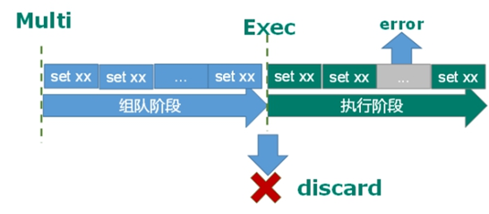
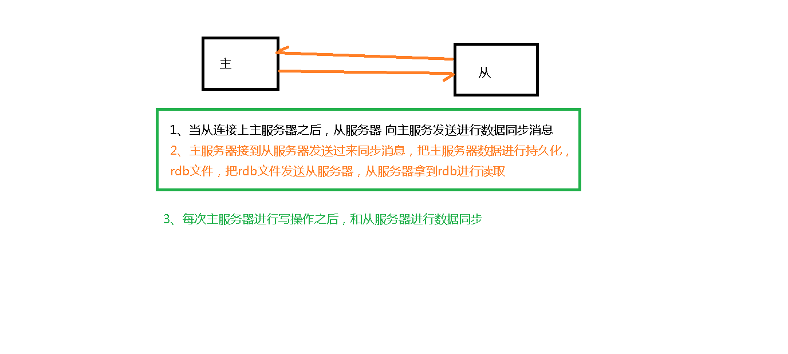
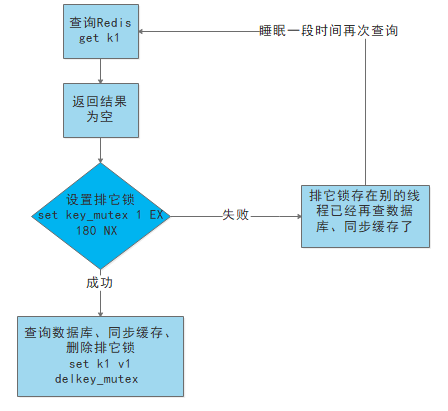

<h1>Redis</h1>

-------------


# 目录

[TOC]

*******************


# 一、简介/安装


## 1.1：概述


REmote DIctionary Server(Redis) 是一个由 Salvatore Sanfilippo 写的 key-value 存储系统，是跨平台的非关系型数据库。

Redis 是一个开源的使用 ANSI C 语言编写、遵守 BSD 协议、支持网络、可基于内存、分布式、可选持久性的键值对(Key-Value)存储数据库，并提供多种语言的 API。

Redis 通常被称为数据结构服务器，因为值（value）可以是字符串(String)、哈希(Hash)、列表(list)、集合(sets)和有序集合(sorted sets)等类型。


+ Redis是一个`开源`的`key-value`存储系统。
+ 和Memcached类似，它支持存储的value类型相对更多，包括`string`(字符串)、`list`(链表)、`set`(集合)、`zset`(sorted set --有序集合)和`hash`（哈希类型）。
+ 这些数据类型都支持push/pop、add/remove及取交集并集和差集及更丰富的操作，而且这些操作都是`原子性`的。
+ 在此基础上，Redis支持各种不同方式的`排序`。
+ 与memcached一样，为了保证效率，数据都是`缓存在内存`中。
+ 区别的是Redis会`周期性`的把更新的`数据写入磁盘`或者把修改操作写入追加的记录文件。
+ 并且在此基础上实现了`master-slave(主从)`同步。


## 1.2：官网


| 简介           | 网址                           |
| -------------- | ------------------------------ |
| Redis 官网     | https://redis.io/              |
| 中文官网       | http://redis.cn/               |
| 源码地址       | https://github.com/redis/redis |
| Redis 在线测试 | http://try.redis.io/           |
| Redis 命令参考 | http://doc.redisfans.com/      |


## 1.3：redis的优势


- **性能极高** – Redis能读的速度是110000次/s,写的速度是81000次/s 。
- **丰富的数据类型** – Redis支持二进制案例的 Strings, Lists, Hashes, Sets 及 Ordered Sets 数据类型操作。
- 原子 – Redis的所有操作都是**原子性的**，意思就是要么成功执行要么失败完全不执行。单个操作是原子性的。多个操作也支持事务，即原子性，通过MULTI和EXEC指令包起来。
- **丰富的特性** – Redis还支持 publish/subscribe, 通知, key 过期等等特性。


## 1.4：Redis与其他key-value存储有什么不同


- Redis有着更为复杂的数据结构并且提供对他们的原子性操作，这是一个不同于其他数据库的进化路径。Redis的数据类型都是基于基本数据结构的同时对程序员透明，无需进行额外的抽象。
- Redis运行在内存中但是可以持久化到磁盘，所以在对不同数据集进行高速读写时需要权衡内存，因为数据量不能大于硬件内存。在内存数据库方面的另一个优点是，相比在磁盘上相同的复杂的数据结构，在内存中操作起来非常简单，这样Redis可以做很多内部复杂性很强的事情。同时，在磁盘格式方面他们是紧凑的以追加的方式产生的，因为他们并不需要进行随机访问。


## 1.5：安装


### 1.下载地址


https://redis.io/download


安装的版本是6.2.1


### 2.安装C语言编译环境


```java
yum install centos-release-scl scl-utils-build
yum install -y devtoolset-8-toolchain
scl enable devtoolset-8 bash
```


安装成功后： **gcc --version**


### 3.上传并解压安装


+ 上传包到liunx虚拟机上： `/app/package`
+ 解压并移动项目：`/app/`


```javascript
tar -zxvf redis-6.2.1.tar.gz 
mv redis-6.2.1 /app/
```


### 4.进入目录编译


进入到`/app/redis-6.2.1`

```javascript
cd /app/redis-6.2.1
make
make install
```


  **如果没有准备好C语言编译环境，make 会报错—Jemalloc/jemalloc.h：没有那个文件**

  **解决方案：运行make distclean,然后再次运行`make` 和`make install`**


### 5.安装目录：/usr/local/bin


查看默认安装目录：

redis-benchmark:性能测试工具，可以在自己本子运行，看看自己本子性能如何

redis-check-aof：修复有问题的AOF文件，rdb和aof后面讲

redis-check-dump：修复有问题的dump.rdb文件

redis-sentinel：Redis集群使用

redis-server：Redis服务器启动命令

redis-cli：客户端，操作入口


## 1.6：启动


### 1.前台启动


运行

```java
/usr/local/bin/redis-server
```


### 2.后台启动


复制一份`redis.conf`文件到任意目录下：

我放在了`/app/redis/rdis-6379`下面了

然后修改文件中的：**daemonize  no 改成 yes**

在`redis-6379`目录下运行命令：


```java
/usr/local/bin/redis-server redis.conf 
```


## 1.7：redis-cli访问


```java
 redis-cli -h host -p port -a password
```

**有时候会有中文乱码:**

要在` redis-cli` 后面加上 `--raw`

| 访问方式       | 命令                             |
| -------------- | -------------------------------- |
| 默认端口访问   | /usr/local/bin/redis-cli         |
| 自定义端口访问 | /usr/local/bin/redis-cli -p 6379 |


测试验证 ： ping


退出： quit

## 1.8：关闭


| 关闭方式       | 命令                       |
| -------------- | -------------------------- |
| 默认端口关闭   | redis-cli shutdown         |
| 自定义端口关闭 | redis-cli -p 6379 shutdown |


## 1.8：redis相关


Redis是单线程+多路IO复用技术

> 多路复用是指使用一个线程来检查多个文件描述符（Socket）的就绪状态，比如调用select和poll函数，传入多个文件描述符，如果有一个文件描述符就绪，则返回，否则阻塞直到超时。得到就绪状态后进行真正的操作可以在同一个线程里执行，也可以启动线程执行（比如使用线程池）


==串行  vs  多线程+锁（memcached） vs  单线程+多路IO复用(Redis)==

与Memcache三点不同: 支持多数据类型，支持持久化，单线程+多路IO复用） 


# 二、Key(键)


## 2.1：查找key-keys


### 1.用法及简介


+ 语法：
	+ **KEYS pattern**
	+ 查找所有符合给定模式 `pattern` 的 `key` 。

+ 案例：
	+ `KEYS *` 匹配数据库中所有 `key` 。
	+ `KEYS h?llo` 匹配 `hello` ， `hallo` 和 `hxllo` 等。

	+ `KEYS h*llo` 匹配 `hllo` 和 `heeeeello` 等。
	+ `KEYS h[ae]llo` 匹配 `hello` 和 `hallo` ，但不匹配 `hillo`
	+ 特殊符号用 `\` 隔开

	

### 2.时间复杂度


O(N)， `N` 为数据库中 `key` 的数量。


### 3.返回值


符合给定模式的 `key` 列表。


### 4.案例


### 5.注意


[KEYS]() 的速度非常快，但在一个大的数据库中使用它仍然可能造成性能问题，如果你需要从一个数据集中查找特定的 `key` ，你最好还是用 Redis 的集合结构(set)来代替。


## 2.2： 删除key-del


### 1.用法及简介


+ 语法

	+ **DEL key [key ...]**
	+ 

	

	**删除给定的一个或多个 `key` 。不存在的 `key` 会被忽略。**

	

### 2.时间复杂度


+ O(N)， `N` 为被删除的 `key` 的数量。

+ 删除单个字符串类型的 `key` ，时间复杂度为O(1)。

+ 删除单个列表、集合、有序集合或哈希表类型的 `key` ，时间复杂度为O(M)， `M` 为以上数据结构内的元素数量。


### 3.返回值


被删除 `key` 的数量。


### 4.案例


```shell
#  删除单个 key
127.0.0.1:6379> set name zhangsan
OK
127.0.0.1:6379> del name
(integer) 1
# 删除一个不存在的 key
127.0.0.1:6379> exists phone 
(integer) 0
127.0.0.1:6379> del phone # 失败，没有 key 被删除
(integer) 0
# 同时删除多个 key
127.0.0.1:6379> del one two three four five
(integer) 5
127.0.0.1:6379> 
```


## 2.3：判断key是否存在-exists


### 1.用法及简介


+ 语法
	+ **EXISTS key**

检查给定 `key` 是否存在。


### 2.时间复杂度


O(1)


### 3.返回值


若 `key` 存在，返回 `1` ，否则返回 `0` 。


### 4.案例


```java
127.0.0.1:6379> EXISTS name
(integer) 1
127.0.0.1:6379> EXISTS name2
(integer) 0
127.0.0.1:6379> 
```


## 2.4：设置过期key-expire


### 1.用法及简介


+ 语法
	+ **EXPIRE key seconds**


为给定 `key` 设置生存时间，当 `key` 过期时(生存时间为 `0` )，它会被自动删除。

在 Redis 中，带有生存时间的 `key` 被称为『易失的』(volatile)。


### 2.生存时间


**生存时间也就是我们设置的过期时间**


+ 生存时间可以通过使用 [*DEL*](http://doc.redisfans.com/key/del.html#del) 命令来删除整个 `key` 来移除，或者被 [*SET*](http://doc.redisfans.com/string/set.html#set) 和 [*GETSET*](http://doc.redisfans.com/string/getset.html#getset) 命令覆写(overwrite)，这意味着，如果一个命令只是修改(alter)一个带生存时间的 `key` 的值而不是用一个新的 `key` 值来代替(replace)它的话，那么生存时间不会被改变。**（用新的key来替代掉它删除它，才可以改变生存时间）**

+ 比如说，对一个 `key` 执行 [*INCR*](http://doc.redisfans.com/string/incr.html#incr) 命令，对一个列表进行 [*LPUSH*](http://doc.redisfans.com/list/lpush.html#lpush) 命令，或者对一个哈希表执行 [*HSET*](http://doc.redisfans.com/hash/hset.html#hset) 命令，这类操作都不会修改 `key` 本身的生存时间。

+ 另一方面，如果使用 [*RENAME*](http://doc.redisfans.com/key/rename.html) 对一个 `key` 进行改名，那么改名后的 `key` 的生存时间和改名前一样。

+ [*RENAME*](http://doc.redisfans.com/key/rename.html) 命令的另一种可能是，尝试将一个带生存时间的 `key` 改名成另一个带生存时间的 `another_key` ，这时旧的 `another_key` (以及它的生存时间)会被删除，然后旧的 `key` 会改名为 `another_key` ，因此，新的 `another_key` 的生存时间也和原本的 `key` 一样。

+ 使用 [*PERSIST*](http://doc.redisfans.com/key/persist.html) 命令可以在不删除 `key` 的情况下，移除 `key` 的生存时间，让 `key` 重新成为一个『持久的』(persistent) `key` 。


### 3.更新生存时间


可以对一个已经带有生存时间的 `key` 执行 [*EXPIRE*](http://doc.redisfans.com/key/expire.html#expire) 命令，新指定的生存时间会取代旧的生存时间。


### 4.过期时间的精确度


在 Redis 2.4 版本中，过期时间的延迟在 1 秒钟之内 —— 也即是，就算 `key` 已经过期，但它还是可能在过期之后一秒钟之内被访问到，而在新的 Redis 2.6 版本中，延迟被降低到 1 毫秒之内。

> 但是注意：
>
> 在 Redis 2.1.3 之前的版本中，修改一个带有生存时间的 `key` 会导致整个 `key` 被删除，这一行为是受当时复制(replication)层的限制而作出的，现在这一限制已经被修复。


### 5.时间复杂度


O(1)


### 6.返回值


设置成功返回 `1` 。

当 `key` 不存在或者不能为 `key` 设置生存时间时(比如在低于 2.1.3 版本的 Redis 中你尝试更新 `key` 的生存时间)，返回 `0` 。


### 7.案例


```java
127.0.0.1:6379> set name admin
OK
127.0.0.1:6379> EXPIRE name 30
(integer) 1
127.0.0.1:6379> TTL name
(integer) 25
127.0.0.1:6379> EXPIRE name 5000
(integer) 1
127.0.0.1:6379> ttl name
(integer) 4997
```


## 2.5：设置过期key-expireat


### 1.用法及简介


+ 语法

	+ **EXPIREAT key timestamp**

	

[EXPIREAT](http://doc.redisfans.com/key/expireat.html#expireat) 的作用和 [*EXPIRE*](http://doc.redisfans.com/key/expire.html) 类似，都用于为 `key` 设置生存时间。

不同在于 [EXPIREAT](http://doc.redisfans.com/key/expireat.html#expireat) 命令接受的时间参数是 UNIX 时间戳(unix timestamp)。


### 2.时间复杂度


O(1)


### 3.返回值


如果生存时间设置成功，返回 `1` 。当 `key` 不存在或没办法设置生存时间，返回 `0` 。


### 4.案例


```java
redis> SET cache www.google.com
OK

redis> EXPIREAT cache 1355292000     # 这个 key 将在 2012.12.12 过期
(integer) 1

redis> TTL cache
(integer) 45081860
```


## 2.6：设置过期key-PEXPIRE


### 1.用法及简介


+ 语法

	+ **PEXPIRE key milliseconds**

	

这个命令和 [*EXPIRE*](http://doc.redisfans.com/key/expire.html) 命令的作用类似，但是**它以毫秒为单位**设置 `key` 的生存时间，而不像 [*EXPIRE*](http://doc.redisfans.com/key/expire.html) 命令那样，**以秒为单位。**


### 2.时间复杂度


O(1)


### 3.返回值


设置成功，返回 `1`

key不存在或设置失败，返回 `0` 


### 4.案例


```shell
127.0.0.1:6379> PEXPIRE mykey 10000
(integer) 1
127.0.0.1:6379> ttl mykey # TTL 的返回值以秒为单位
(integer) 6
127.0.0.1:6379> pttl mykey # PTTL 可以给出准确的毫秒数
(integer) 375
```


## 2.7：设置过期key-pexpireat


### 1.语法及简介


+ 语法
	+ **PEXPIREAT key milliseconds-timestamp**

这个命令和 [*EXPIREAT*](http://doc.redisfans.com/key/expireat.html) 命令类似，但它以毫秒为单位设置 `key` 的过期 unix 时间戳，而不是像 [*EXPIREAT*](http://doc.redisfans.com/key/expireat.html) 那样，以秒为单位。


### 2.时间复杂度


O(1)


### 3.返回值


如果生存时间设置成功，返回 `1` 。

当 `key` 不存在或没办法设置生存时间时，返回 `0` 。(查看 [*EXPIRE*](http://doc.redisfans.com/key/expire.html) 命令获取更多信息)


### 4.案例


```shell
127.0.0.1:6379> set mykey2 121213
OK
127.0.0.1:6379> pexpireat mykey2 1555555555005
(integer) 1
127.0.0.1:6379> ttl mykey2  # TTL 返回秒
(integer) 223157079
127.0.0.1:6379> pttl mykey2  # PTTL 返回毫秒
(integer) 223157079318
127.0.0.1:6379> 
```


## 2.8：查看过期时间–ttl/pttl


### 1.语法及简介


+ **PTTL key**
	+ 以毫秒为单位，返回给定 `key` 的剩余生存时间(TTL, time to live)。

+ **TTL key**
	+ 以秒为单位，返回给定 `key` 的剩余生存时间(TTL, time to live)。


### 2.时间复杂度


O(1)


### 3.返回值


当 `key` 不存在时，返回 `-2` 。

当 `key` 存在但没有设置剩余生存时间时，返回 `-1` 。

否则，以秒为单位，返回 `key` 的剩余生存时间。


### 4.案例


```shell
127.0.0.1:6379> set name 111
OK
127.0.0.1:6379> expire name 1000000
(integer) 1
127.0.0.1:6379> ttl name
(integer) 999996
127.0.0.1:6379> pttl name
(integer) 999992141
127.0.0.1:6379> 
```


## 2.9：改过期key为持久key-PERSIST


### 1.用法及简介


+ 语法

	+ **PERSIST key**

	移除给定 `key` 的生存时间，将这个 `key` 从『易失的』(带生存时间 `key` )转换成『持久的』(一个不带生存时间、永不过期的 `key` )。

	

### 2.时间复杂度


O(1)


### 3.返回值


当生存时间移除成功时，返回 `1` .

如果 `key` 不存在或 `key` 没有设置生存时间，返回 `0` 。


### 4.案例


```java
127.0.0.1:6379> EXPIRE hello 1000
(integer) 1
127.0.0.1:6379> PERSIST hello
(integer) 1
127.0.0.1:6379> ttl hello
(integer) -1
127.0.0.1:6379> 
```


## 2.10：重命名key-RENAME


### 1.语法及简介


+ 语法

	+ **RENAME key newkey**

	

将 `key` 改名为 `newkey` 。

当 `key` 和 `newkey` 相同，或者 `key` 不存在时，返回一个错误。

当 `newkey` 已经存在时， [RENAME](http://doc.redisfans.com/key/rename.html#rename) 命令将覆盖旧值。


### 2.时间复杂度


O(1)


### 3.返回值


改名成功时提示 `OK` ，失败时候返回一个错误。


### 4.案例


####  key 存在且 newkey 不存在

```java
127.0.0.1:6379> set old old
OK
127.0.0.1:6379> EXISTS old
(integer) 1
127.0.0.1:6379> exists new
(integer) 0
127.0.0.1:6379> rename old new
OK
127.0.0.1:6379> exists old
(integer) 0
127.0.0.1:6379> exists new
(integer) 1
```

#### 当 key 不存在时，返回错误

```java
127.0.0.1:6379> exists old 
(integer) 0
127.0.0.1:6379> exists new
(integer) 0
127.0.0.1:6379> rename old new
(error) ERR no such key
```

#### newkey 已存在时， RENAME 会覆盖旧 newkey

```java
127.0.0.1:6379> mset old old new new
OK
127.0.0.1:6379> rename old new
OK
127.0.0.1:6379> get old
(nil)
127.0.0.1:6379> get new
"old"
```


## 2.11：重命名key-RENAMENX


### 1.语法及简介


+ 语法
	+ **RENAMENX key newkey**

当且仅当 `newkey` 不存在时，将 `key` 改名为 `newkey` 。

当 `key` 不存在时，返回一个错误。


### 2.时间复杂度


O(1)


### 3.返回值


修改成功时，返回 `1` 。

如果 `newkey` 已经存在，返回 `0` 。


### 4.案例


#### newkey不存在

```java
127.0.0.1:6379> mset old old
OK
127.0.0.1:6379> renamenx old new
(integer) 1
127.0.0.1:6379> get new
"old"
127.0.0.1:6379> 
```

#### newkey存在

```java
127.0.0.1:6379> mset old old new new
OK
127.0.0.1:6379> RENAMENX old new
(integer) 0
```


## 2.12：查看类型-type


### 1.语法及简介


+ 语法
	+ **TYPE key**

返回 `key` 所储存的值的类型。


### 2.时间复杂度


O(1)


### 3.返回值


`none` (key不存在)

`string` (字符串)

`list` (列表)

`set` (集合)

`zset` (有序集)

`hash` (哈希表)


### 4.案例


```shell
# 字符串

redis> SET weather "sunny"
OK

redis> TYPE weather
string


# 列表

redis> LPUSH book_list "programming in scala"
(integer) 1

redis> TYPE book_list
list


# 集合

redis> SADD pat "dog"
(integer) 1

redis> TYPE pat
set
```


## 2.13：序列化key-dump


### 1.用法及简介


+ 语法
	+ **DUMP key**

序列化给定 `key` ，并返回被序列化的值，使用 [*RESTORE*](http://doc.redisfans.com/key/restore.html) 命令可以将这个值反序列化为 Redis 键。

+ 序列化生成的值有以下几个特点：
	+ 它带有 64 位的校验和，用于检测错误， [*RESTORE*](http://doc.redisfans.com/key/restore.html) 在进行反序列化之前会先检查校验和。
	+ 值的编码格式和 RDB 文件保持一致。
	+ RDB 版本会被编码在序列化值当中，如果因为 Redis 的版本不同造成 RDB 格式不兼容，那么 Redis 会拒绝对这个值进行反序列化操作。


序列化的值不包括任何生存时间信息。


### 2.时间复杂度


查找给定键的复杂度为 O(1) ，对键进行序列化的复杂度为 O(N*M) ，其中 N 是构成 `key` 的 Redis 对象的数量，而 M 则是这些对象的平均大小。

如果序列化的对象是比较小的字符串，那么复杂度为 O(1) 。


### 3.返回值：


如果 `key` 不存在，那么返回 `nil` 。

否则，返回序列化之后的值。


### 4.案例


```java
127.0.0.1:6379> set name "hello world ! liming"
OK
127.0.0.1:6379> DUMP name
"\x00\x14hello world ! liming\t\x00<gx\x80\xa5\xc1^\xce"
127.0.0.1:6379> DUMP name2
(nil)
```


## 2.14：反序列化-RESTORE


### 1.语法及简介

+ 语法
	+ **RESTORE key ttl serialized-value**

反序列化给定的序列化值，并将它和给定的 `key` 关联。

参数 `ttl` 以毫秒为单位为 `key` 设置生存时间；如果 `ttl` 为 `0` ，那么不设置生存时间。

[RESTORE](http://doc.redisfans.com/key/restore.html#restore) 在执行反序列化之前会先对序列化值的 RDB 版本和数据校验和进行检查，如果 RDB 版本不相同或者数据不完整的话，那么 [RESTORE](http://doc.redisfans.com/key/restore.html#restore) 会拒绝进行反序列化，并返回一个错误。


### 2.时间复杂度：


查找给定键的复杂度为 O(1) ，对键进行反序列化的复杂度为 O(N*M) ，其中 N 是构成 `key` 的 Redis 对象的数量，而 M 则是这些对象的平均大小。

有序集合(sorted set)的反序列化复杂度为 O(N*M*log(N)) ，因为有序集合每次插入的复杂度为 O(log(N)) 。

如果反序列化的对象是比较小的字符串，那么复杂度为 O(1) 。


### 3.返回值：


如果反序列化成功那么返回 `OK` ，否则返回一个错误。


### 4.案例


```java
redis> SET greeting "hello, dumping world!"
OK

redis> DUMP greeting
"\x00\x15hello, dumping world!\x06\x00E\xa0Z\x82\xd8r\xc1\xde"

redis> RESTORE greeting-again 0 "\x00\x15hello, dumping world!\x06\x00E\xa0Z\x82\xd8r\xc1\xde"
OK

redis> GET greeting-again
"hello, dumping world!"

redis> RESTORE fake-message 0 "hello moto moto blah blah"   ; 使用错误的值进行反序列化
(error) ERR DUMP payload version or checksum are wrong
```


## 2.15：移动key到指定数据库-move


### 1.用法及简介


+ 语法
	+ **MOVE key db**

将当前数据库的 `key` 移动到给定的数据库 `db` 当中。

如果当前数据库(源数据库)和给定数据库(目标数据库)有相同名字的给定 `key` ，或者 `key` 不存在于当前数据库，那么 `MOVE` 没有任何效果。

因此，也可以利用这一特性，将 [MOVE](http://doc.redisfans.com/key/move.html#move) 当作锁(locking)原语(primitive)。


### 2.时间复杂度


O(1)


### 3.返回值


移动成功返回 `1` ，失败则返回 `0` 。


### 4.案例


#### 0数据库key存在—1数据库key不存在


```java
127.0.0.1:6379> select 0
OK
127.0.0.1:6379> EXISTS admin
(integer) 0
127.0.0.1:6379> set admin 1
OK
127.0.0.1:6379> select 1
OK
127.0.0.1:6379[1]> exists admin
(integer) 0
127.0.0.1:6379[1]> select 0
OK
127.0.0.1:6379> move admin 1
(integer) 1
127.0.0.1:6379> EXISTS admin
(integer) 0
127.0.0.1:6379> select 1
OK
127.0.0.1:6379[1]> exists admin
(integer) 1
127.0.0.1:6379[1]> 
```


#### 0数据库key存在—1数据库key存在


```java
127.0.0.1:6379[1]> select 0
OK
127.0.0.1:6379> set lisi 1
OK
127.0.0.1:6379> select 1
OK
127.0.0.1:6379[1]> set lisi 2
OK
127.0.0.1:6379[1]> select 0
OK
127.0.0.1:6379> move lisi 1
(integer) 0
```


#### 0数据库key不存在—1数据库key存在


```java
127.0.0.1:6379> select  0
OK
127.0.0.1:6379> exists one
(integer) 0
127.0.0.1:6379> select 1
OK
127.0.0.1:6379[1]> set one 1
OK
127.0.0.1:6379[1]> select 0
OK
127.0.0.1:6379> move one 1
(integer) 0
```


# 三、数据类型


## 3.1：string


### 1.简介


string 是 redis 最基本的类型，你可以理解成与 Memcached 一模一样的类型，一个 key 对应一个 value。

string 类型是二进制安全的。意思是 redis 的 string 可以包含任何数据。比如jpg图片或者序列化的对象。

string 类型是 Redis 最基本的数据类型，string 类型的值最大能存储 512MB。

**<font color='red'>注意：一个键最大能存储512MB。</font>**


### 2.常用命令


| 命令        | 简介                                                         | 语法                             |
| ----------- | ------------------------------------------------------------ | -------------------------------- |
| APPEND      | 如果 key 已经存在并且是一个字符串， APPEND 命令将指定的 value 追加到该 key 原来值（value）的末尾 | APPEND key value                 |
| DECR        | 将 key 中储存的数字值减一                                    | DECR key                         |
| DECRBY      | key 所储存的值减去给定的减量值（decrement）                  | DECRBY key decrement             |
| GET         | 获取指定 key 的值                                            | GET key                          |
| GETRANGE    | 截取字符串从0开始                                            | GETRANGE key start end           |
| GETSET      | 将给定 key 的值设为 value ，并返回 key 的旧值(old value)     | GETSET key value                 |
| INCR        | 将 key 中储存的数字值增一                                    | INCR key                         |
| INCRBY      | 将 key 所储存的值加上给定的增量值（increment）               | INCRBY key increment             |
| INCRBYFLOAT | 将 key 所储存的值加上给定的浮点增量值（increment）           | INCRBYFLOAT key increment        |
| MGET        | 获取所有(一个或多个)给定 key 的值。                          | MGET key1 [key2..]               |
| MSET        | 同时设置一个或多个 key-value 对。                            | MSET key value [key value ...]   |
| MSETNX      | 同时设置一个或多个 key-value 对，当且仅当所有给定 key 都不存在。 | MSETNX key value [key value ...] |
| PSETEX      | 这个命令和 SETEX 命令相似，但它以毫秒为单位设置 key 的生存时间，而不是像 SETEX 命令那样，以秒为单位。 | PSETEX key milliseconds value    |
| SET         | 设置指定 key 的值                                            | SET key value                    |
| SETEX       | 将值 value 关联到 key ，并将 key 的过期时间设为 seconds (以秒为单位)。 | SETEX key seconds value          |
| SETNX       | 只有在 key 不存在时设置 key 的值。                           | SETNX key value                  |
| STRLEN      | 返回 key 所储存的字符串值的长度。                            | STRLEN key                       |


### 3.string只代表字符串类型吗？


- 字符串类型
- int类型
- bitmap类型（下个篇幅重点）


### 4.正反向索引


#### 简介：


+ string类型再存储的时候会创建两套索引：正向索引、反向索引。
+ 比如我们执行命令 `set key hello`

#### 正向索引：


| h    | e    | l    | l    | o    |
| ---- | ---- | ---- | ---- | ---- |
| 0    | 1    | 2    | 3    | 4    |


#### 反向索引


| h    | e    | l    | l    | o    |
| ---- | ---- | ---- | ---- | ---- |
| -5   | -4   | -3   | -2   | -1   |


#### 验证正反向索引


> 下图对照上图一起看，我不会骗你的。实战出真理。


```shell
127.0.0.1:6379> set key hello
OK
127.0.0.1:6379> get  key
"hello"
127.0.0.1:6379> getrange key 0 1
"he"
127.0.0.1:6379> getrange key -5 -4
"he"
```


### 5.查看数据类型


object encoding key


## 3.2：list


### 1.简介


Redis 列表是简单的字符串列表，按照插入顺序排序。你可以添加一个元素到列表的头部（左边）或者尾部（右边）。

list类型经常会被用于消息队列的服务，以完成多程序之间的消息交换


它的底层实际是个双向链表，对两端的操作性能很高，通过索引下标的操作中间的节点性能会较差。


List数据结构是链表结构，这意味这无论数据量多大，头尾操作数据还是很快的，list的容量是2的32次方减1个元素，即4294967295个元素数量。

### 2.命令


| 命令      | 简介                                                         | 语法                      |
| --------- | ------------------------------------------------------------ | ------------------------- |
| lpush     | 列表左边添加**一个或多个值**,`key`不存在则创建               | LPUSH key value1 [value2] |
| rpush     | 列表右边添加**一个或多个值**,`key`不存在则创建               | RPUSH key value1 [value2] |
| lpushx    | 列表左边添加**一个值**,当` key `不存在时，` lpushx `命令什么也不做 | LPUSHX key value          |
| rpushx    | 列表右边添加**一个值**当 `key `不存在时， `rpushx`命令什么也不做 | RPUSHX key value          |
| lpop      | 移除左边并返回列表 `key` 的头元素。                          | LPOP key                  |
| rpop      | 移除右边并返回列表 `key` 的头元素。                          | RPOP key                  |
| rpoplpush | 从key1列表右边吐出一个值，插到key2列表左边。                 | rpoplpush key1  key2      |
| lrange    | 获取列表指定范围内的元素，但不删除元素，0左边第一个，-1右边第一个，（`0` `-1`表示获取所有） | LRANGE key start stop     |
| lindex    | 通过索引获取列表中的元素,左边开始是1，右边开始是-1           | LINDEX key index          |
| llen      | 获取列表长度                                                 | LLEN key                  |
| lrem      | **移除列表元素**<br>1.count > 0 : 从左到右，移除与 VALUE 相等的元素，数量为 COUNT 。<br/>2.count < 0 : 从右到左，移除与 VALUE 相等的元素，数量为 COUNT 的绝对值。<br/>3.count = 0 : 移除表中所有与 VALUE 相等的值。 | LREM key count value      |
| lset      | 将列表 `key` 下标为 `index` 的元素的值设置为 `value` 。0开始 | LSET key index value      |


### 4.数据结构


List的数据结构为快速链表quickList。

+ 首先在列表元素较少的情况下会使用一块连续的内存存储，这个结构是ziplist，也即是压缩列表。

+ 它将所有的元素紧挨着一起存储，分配的是一块连续的内存。

+ 当数据量比较多的时候才会改成quicklist。

**因为普通的链表需要的附加指针空间太大，会比较浪费空间。比如这个列表里存的只是int类型的数据，结构上还需要两个额外的指针prev和next**


Redis将链表和ziplist结合起来组成了quicklist。也就是将多个ziplist使用双向指针串起来使用。这样既满足了快速的插入删除性能，又不会出现太大的空间冗余。


## 3.3：set


### 1.简介


Redis set对外提供的功能与list类似是一个列表的功能，特殊之处在于set是可以**自动排重**的，当你需要存储一个列表数据，又不希望出现重复数据时，set是一个很好的选择，并且set提供了判断某个成员是否在一个set集合内的重要接口，这个也是list所不能提供的。

Redis的Set是string类型的无序集合。它底层其实是一个value为null的hash表，所以添加，删除，查找的**复杂度都是O(1)**。

一个算法，随着数据的增加，执行时间的长短，如果是O(1)，数据增加，查找数据的时间不变


### 2.命令


| 命令      | 简介                                                         | 语法                         |
| --------- | ------------------------------------------------------------ | ---------------------------- |
| sadd      | 添加将一个或多个到集合 key 中，已经存在的元素将被忽略        | SADD key member [member ...] |
| smembers  | 取出该集合的所有值。                                         | SMEMBERS key                 |
| sismember | 判断 `member` 元素是否集合 `key` 的成员。                    | SISMEMBER key member         |
| scard     | 返回集合中的个数                                             | SCARD key                    |
| srem      | 移除集合 `key` 中的一个或多个 `member` 元素，不存在的 `member` 元<br>素会被忽略。当 `key` 不是集合类型，返回一个错误 | SREM key member [member ...] |
| spop      | 移除并返回集合中的一个随机元素。                             | SPOP key                     |
| srem      | 返回集合中一个或多个随机数，不移除元素                       | SREM key member1 [member2]   |
| sinter    | 返回两个集合的交集元素。                                     | SINTER key1 key2             |
| sunion    | 返回两个集合的并集元素。                                     | SUNION key1 key2             |
| sdiff     | 返回两个集合的**差集**元素(key1中的，不包含key2中的)         | SDIFF key1 key2              |


### 3.数据结构


Set数据结构是dict字典，字典是用哈希表实现的。

Java中HashSet的内部实现使用的是HashMap，只不过所有的value都指向同一个对象。Redis的set结构也是一样，它的内部也使用hash结构，所有的value都指向同一个内部值。


## 3.4：zset


### 1.简介


+ Redis有序集合zset与普通集合set非常相似，是一个没有重复元素的字符串集合。

+ 不同之处是有序集合的每个成员都关联了一个**评分（score）**,这个评分（score）被用来按照从最低分到最高分的方式排序集合中的成员。集合的成员是唯一的，但是评分可以是重复了 。

+ 因为元素是有序的, 所以你也可以很快的根据评分（score）或者次序（position）来获取一个范围的元素。

+ 访问有序集合的中间元素也是非常快的,因此你能够使用有序集合作为一个没有重复成员的智能列表。


> 简单的说：
>
> zset是一个有序集合，每一个成员有一个分数与之对应，成员不可以重复，但是数是可以重复的，zset会自动用分数对成员进行排序。


### 2.命令


| 命令             | 简介                                                         | 语法                                                        |
| ---------------- | ------------------------------------------------------------ | ----------------------------------------------------------- |
| zadd             | 将一个或多个 member 元素及其 score 值加入到有序集 key 当中。（`score` 值可以是整数值或双精度浮点数。） | ZADD key score member [[score member] [score member] ...]   |
| zrange           | 返回有序集 `key` 中，指定区间内的成员。带WITHSCORES，可以让分数一起和值返回到结果集。`0 `  `-`是返回全部的 | ZRANGE key start stop [WITHSCORES]                          |
| zrangebyscore    | 通过分数返回有序集合指定区间内的成员                         | ZRANGEBYSCORE key min max [WITHSCORES] [LIMIT offset count] |
| zrevrangebyscore | 返回有序集中指定分数区间内的成员，分数从高到低排序           | ZREVRANGEBYSCORE key max min [WITHSCORES]                   |
| zincrby          | 有序集合中对指定成员的分数加上增量 increment                 | ZINCRBY key increment member                                |
| zrem             | 移除有序集合中的一个或多个成员                               | ZREM key member [member ...]                                |
| zcount           | 计算在有序集合中指定区间分数的成员数                         | ZCOUNT key min max                                          |
| zrank            | 返回该值在集合中的排名，从0开始。                            | ZRANK key member                                            |


### 3.数据结构


SortedSet(zset)是Redis提供的一个非常特别的数据结构，一方面它等价于Java的数据结构Map<String, Double>，可以给每一个元素value赋予一个权重score，另一方面它又类似于TreeSet，内部的元素会按照权重score进行排序，可以得到每个元素的名次，还可以通过score的范围来获取元素的列表。

zset底层使用了两个数据结构

（1）hash，hash的作用就是关联元素value和权重score，保障元素value的唯一性，可以通过元素value找到相应的score值。

（2）跳跃表，跳跃表的目的在于给元素value排序，根据score的范围获取元素列表。


## 3.5：hash


### 1.简介


Redis hash 是一个 string 类型的 field（字段） 和 value（值） 的映射表，hash 特别适合用于存储对象。

Redis 中每个 hash 可以存储 232 - 1 键值对（40多亿）。

类似Java里面的Map<String,Object>


### 2.命令


| 命令    | 简介                                                         | 语法                                    |
| ------- | ------------------------------------------------------------ | --------------------------------------- |
| hset    | 将哈希表 key 中的字段 field 的值设为 value 。                | HSET key field value                    |
| hget    | 返回哈希表 `key` 中给定域 `field` 的值。                     | HGET key field                          |
| hmset   | 同时将多个 field-value (域-值)对设置到哈希表 key 中。        | HMSET key field value [field value ...] |
| hexists | 查看哈希表 `key` 中，给定域 `field` 是否存在。               | HEXISTS key field                       |
| hkeys   | 返回哈希表 `key` 中的所有域。                                | HKEYS key                               |
| hvals   | 返回哈希表 `key` 中所有域的值。                              | HVALS key                               |
| hsetnx  | 将哈希表 `key` 中的域 `field` 的值设置为 `value` ，当且仅当域 `field` 不存在。 | HSETNX key field value                  |
| hlen    | 返回哈希表 `key` 中域的数量。                                | HLEN key                                |
| hincrby | 为哈希表 `key` 中的域 `field` 的值加上增量 `increment` 。    | HINCRBY key field increment             |


### 3.数据结构


Hash类型对应的数据结构是两种：ziplist（压缩列表），hashtable（哈希表）。当field-value长度较短且个数较少时，使用ziplist，否则使用hashtable。


## 3.6：BitMaps


### 1.简介


现代计算机用二进制（位） 作为信息的基础单位， 1个字节等于8位， 例如`abc`字符串是由3个字节组成， 但实际在计算机存储时将其用二进制表示， `abc`分别对应的ASCII码分别是`97`、 `98`、 `99`， 对应的二进制分别是`01100001`、 `01100010`和`01100011`，


B**itmaps并不属于Redis中数据结构的一种，它实际上是使用了字符串类型,是set、get等一系列字符串操做的一种扩展，与其不一样的是，它提供的是位级别的操做，从这个角度看，咱们也能够把它当成是一种位数组、位向量结构。当咱们须要存取一些boolean类型的信息时，Bitmap是一个很是不错的选择，在节省内存的同时也拥有很好的存取速度(getbit/setbit操做时间复杂度为O(1))。**


### 2.命令


#### setbit


+ 语法

```java
SETBIT key offset value
```

+ 对 `key` 所储存的字符串值，设置或清除指定偏移量上的位(bit)。

+ 位的设置或清除取决于 `value` 参数，可以是 `0` 也可以是 `1` 。

+ 当 `key` 不存在时，自动生成一个新的字符串值。

+ 字符串会进行伸展(grown)以确保它可以将 `value` 保存在指定的偏移量上。当字符串值进行伸展时，空白位置以 `0` 填充。

+ `offset` 参数必须大于或等于 `0` ，小于 2^32 (bit 映射被限制在 512 MB 之内)。（int类型）

> 对使用大的 `offset` 的 [SETBIT](http://doc.redisfans.com/string/setbit.html#setbit) 操作来说，内存分配可能造成 Redis 服务器被阻塞。


#### getbit


语法：


```java
GETBIT key offset
```


获取键的第offset位的值（从0开始算）


#### bitcount


语法：


```java
BITCOUNT key [start] [end]
```

统计**字符串**被设置为1的bit数。一般情况下，给定的整个字符串都会被进行计数，通过指定额外的 start 或 end 参数，可以让计数只在特定的位上进行。start 和 end 参数的设置，都可以使用负数值：比如 -1 表示最后一个位，而 -2 表示倒数第二个位，start、end 是指bit组的字节的下标数，二者皆包含。

#### bitop


```java
BITOP operation destkey key [key ...]
```


对一个或多个保存二进制位的字符串 `key` 进行位元操作，并将结果保存到 `destkey` 上。

`operation` 可以是 `AND` 、 `OR` 、 `NOT` 、 `XOR` 这四种操作中的任意一种：

- `BITOP AND destkey key [key ...]` ，对一个或多个 `key` 求逻辑并，并将结果保存到 `destkey` 。
- `BITOP OR destkey key [key ...]` ，对一个或多个 `key` 求逻辑或，并将结果保存到 `destkey` 。
- `BITOP XOR destkey key [key ...]` ，对一个或多个 `key` 求逻辑异或，并将结果保存到 `destkey` 。
- `BITOP NOT destkey key` ，对给定 `key` 求逻辑非，并将结果保存到 `destkey` 。

除了 `NOT` 操作之外，其他操作都可以接受一个或多个 `key` 作为输入。


## 3.7：HyperLogLog


### 1.简介


Redis HyperLogLog 是用来做基数统计的算法，HyperLogLog 的优点是，在输入元素的数量或者体积非常非常大时，计算基数所需的空间总是固定 的、并且是很小的。

在 Redis 里面，每个 HyperLogLog 键只需要花费 12 KB 内存，就可以计算接近 2^64 个不同元素的基 数。这和计算基数时，元素越多耗费内存就越多的集合形成鲜明对比。

但是，因为 HyperLogLog 只会根据输入元素来计算基数，而不会储存输入元素本身，所以 HyperLogLog 不能像集合那样，返回输入的各个元素。


### 2.什么是基数


比如数据集 {1, 3, 5, 7, 5, 7, 8}， 那么这个数据集的基数集为 {1, 3, 5 ,7, 8}, **基数(不重复的元素)为5**。 基数估计就是在误差可接受的范围内，快速计算基数。


### 3.命令


| 命令     | 简介                                      | 语法                                      |
| -------- | ----------------------------------------- | ----------------------------------------- |
| pfadd    | 添加指定元素到 HyperLogLog 中。           | PFADD key element [element ...]           |
| pfcount  | 返回给定 HyperLogLog 的基数估算值。       | PFCOUNT key [key ...]                     |
| pofmerge | 将多个 HyperLogLog 合并为一个 HyperLogLog | PFMERGE destkey sourcekey [sourcekey ...] |


## 3.8：GEO


Redis 3.2 中增加了对GEO类型的支持。GEO，Geographic，地理信息的缩写。该类型，就是元素的2维坐标，在地图上就是经纬度。redis基于该类型，提供了经纬度设置，查询，范围查询，距离查询，经纬度Hash等常见操作。

Redis GEO 主要用于存储地理位置信息，并对存储的信息进行操作，该功能在 Redis 3.2 版本新增。

Redis GEO 操作方法有：

- geoadd：添加地理位置的坐标。
- geopos：获取地理位置的坐标。
- geodist：计算两个位置之间的距离。
- georadius：根据用户给定的经纬度坐标来获取指定范围内的地理位置集合。
- georadiusbymember：根据储存在位置集合里面的某个地点获取指定范围内的地理位置集合。
- geohash：返回一个或多个位置对象的 geohash 值。


# 四、配置文件redis.conf


## 4.1：Unit


+ 配置大小单位,开头定义了一些基本的度量单位，只支持bytes，不支持bit

+ 大小写不敏感


## 4.2：INCLUDES


类似jsp中的include，多实例的情况可以把公用的配置文件提取出来


## 4.3：NETWORK


### 1.简介


网络配置


### 2.bind


默认情况bind=127.0.0.1只能接受本机的访问请求

不写的情况下，无限制接受任何ip地址的访问

生产环境肯定要写你应用服务器的地址；服务器是需要远程访问的，所以需要将其注释掉

如果开启了protected-mode，那么在没有设定bind ip且没有设密码的情况下，Redis只允许接受本机的响应


### 3.protected-mode


将本机访问保护模式设置no


### 4.port


端口：默认6379


### 5.tcp-backlog


设置tcp的backlog，backlog其实是一个连接队列，backlog队列总和=未完成三次握手队列 + 已经完成三次握手队列。

在高并发环境下你需要一个高backlog值来避免慢客户端连接问题。

注意Linux内核会将这个值减小到/proc/sys/net/core/somaxconn的值（128），所以需要确认增大/proc/sys/net/core/somaxconn和/proc/sys/net/ipv4/tcp_max_syn_backlog（128）两个值来达到想要的效果


### 6.timeout


一个空闲的客户端维持多少秒会关闭，0表示关闭该功能。即永不关闭。


### 7.tcp-keepalive


对访问客户端的一种心跳检测，每个n秒检测一次。

单位为秒，如果设置为0，则不会进行Keepalive检测，建议设置成60 


## 4.4：GENERAL通用


### 1.daemonize


是否为后台进程，设置为yes

守护进程，后台启动


### 2.pidfile


存放pid文件的位置，每个实例会产生一个不同的pid文件


### 3.loglevel


指定日志记录级别，Redis总共支持四个级别：debug、verbose、notice、warning，默认为**notice**

+ 四个级别根据使用阶段来选择，生产环境选择notice 或者warning


### 4.logfile


日志文件名称


### 5.database


设定库的数量 默认16，默认数据库为0，可以使用`SELECT <dbid>`命令在连接上指定数据库id


## 4.5：SECURITY安全


访问密码的查看、设置和取消

在命令中设置密码，只是临时的。重启redis服务器，密码就还原了。

永久设置，需要再配置文件中进行设置。


# 五、发布订阅


## 5.1：简介


Redis 发布订阅 (pub/sub) 是一种消息通信模式：发送者 (pub) 发送消息，订阅者 (sub) 接收消息。

Redis 客户端可以订阅任意数量的频道。


## 5.2：图文展示


### 1.客户端可以订阅频道如下图


### 2.当给这个频道发布消息后，消息就会发送给订阅的客户端


## 5.3：命令


| 命令         | 简介                                        | 语法                                 |
| ------------ | ------------------------------------------- | ------------------------------------ |
| subscribe    | 订阅给定的一个或多个频道的信息。            | SUBSCRIBE channel [channel ...]      |
| publish      | 将信息 `message` 发送到指定的频道 `channel` | PUBLISH channel message              |
| unsubscribe  | 指示客户端退订给定的频道。                  | UNSUBSCRIBE [channel [channel ...]   |
| punsubscribe | 退订所有给定模式的频道。                    | PUNSUBSCRIBE [pattern [pattern ...]] |


## 5.4：注意


发布的消息没有持久化，如果在订阅的客户端收不到hello，只能收到订阅后发布的消息


# 六、持久化

## 6.1：简介


### 1.什么是持久化


利用永久性存储介质将数据进行保存，在特定的时间将保存的数据进行恢复的工作机制称为持久化。


### 2.为什么要持久化


防止数据的意外丢失，确保数据安全性


### 3.redis的持久化


Redis 提供了多种不同级别的持久化方式：

- RDB 持久化可以在指定的时间间隔内生成数据集的时间点快照（point-in-time snapshot）。
- AOF 持久化记录服务器执行的所有写操作命令，并在服务器启动时，通过重新执行这些命令来还原数据集。 AOF 文件中的命令全部以 Redis 协议的格式来保存，新命令会被追加到文件的末尾。 Redis 还可以在后台对 AOF 文件进行重写（rewrite），使得 AOF 文件的体积不会超出保存数据集状态所需的实际大小。
- Redis 还可以同时使用 AOF 持久化和 RDB 持久化。 在这种情况下， 当 Redis 重启时， 它会优先使用 AOF 文件来还原数据集， 因为 AOF 文件保存的数据集通常比 RDB 文件所保存的数据集更完整。
- 你甚至可以关闭持久化功能，让数据只在服务器运行时存在。


## 6.3：持久化-命令


### 1.save命令


手动执行一次保存操作，立即执行

```java
save 
```


### 2.bgsave命令


手动启动后台保存操作，但不是立即执行

```java
bgsave
```


## 6.3：RDB


### 1.是什么


在指定的时间间隔内将内存中的数据集快照写入磁盘， 也就是行话讲的Snapshot**快照**，它恢复时是将快照文件直接读到内存里


### 2.备份如何执行


Redis会单独创建（fork）一个子进程来进行持久化，会先将数据写入到 一个临时文件中，待持久化过程都结束了，再用这个临时文件替换上次持久化好的文件。 整个过程中，主进程是不进行任何IO操作的，这就确保了极高的性能 如果需要进行大规模数据的恢复，且对于数据恢复的完整性不是非常敏感，那RDB方式要比AOF方式更加的高效。**RDB的缺点是最后一次持久化后的数据可能丢失**


### 3.5.save指令配置


+  dbfilename dump.rdb
	+ 说明：设置本地数据库文件名，默认值为 dump.rdb
	+ 经验：通常设置为dump-端口号.rdb

+ dir
	+ 说明：设置存储.rdb文件的路径
	+ 经验：通常设置成存储空间较大的目录中，目录名称**data**

+ rdbcompression yes
	+ 说明：设置存储至本地数据库时是否压缩数据，默认为 yes，采用 LZF 压缩
	+ 经验：通常默认为开启状态，如果设置为no，可以节省 CPU 运行时间，但会使存储的文件变大（巨大）

+ rdbchecksum yes
	+ 说明：设置是否进行RDB文件格式校验，该校验过程在写文件和读文件过程均进行
	+ 经验：通常默认为开启状态，如果设置为no，可以节约读写性过程约10%时间消耗，但是存储一定的数据损坏风险


### 4.save指令原理


我们知道redis是单线程，其他的客户端发过来的命令。redis服务端会依次的将他们排序好，然后依次执行，但是如果`save`命令，执行的时间太长的话，那么其他的命令就会进入等待的时间。

**所以生产环境不建议这样使用**


### 5.bgsave指令原理


 bgsave命令是针对save阻塞问题做的优化。Redis内部所有涉及到RDB操作都采用bgsave的方式，save命令可以放弃使用**。**


### 6.bgsave指令配置


### 7.save高级用法


+ 配置

```java
save second changes
```

+ 作用
	+ 满足限定时间范围内key的变化数量达到指定数量即进行持久化

+ 参数
	+ second：监控时间范围
	+ changes：监控key的变化量

+ 位置

	+ 在conf文件中进行配置
	
+ 范例

>   **save** *900 1*
>
> **save** *300 10*
>
> **save** *60 10000*


### 8.save高级用法原理


+ save配置要根据实际业务情况进行设置，频度过高或过低都会出现性能问题，结果可能是灾难性的

+ save配置中对于second与changes设置通常具有互补对应关系，尽量不要设置成包含性关系

+ save配置启动后执行的是bgsave操作


### 9.rdb三种启动方式


save配置的底层就是bgsave，详情看上一节

| **方式**       | **save指令** | **bgsave指令** | **save配置** |
| -------------- | ------------ | -------------- | ------------ |
| 读写           | 同步         | 异步           | 异步         |
| 阻塞客户端指令 | 是           | 否             | 否           |
| 额外内存消耗   | 否           | 是             | 是           |
| 启动新进程     | 否           | 是             | 是           |


### 10.优缺点


#### **RDB优点**

+ RDB是一个紧凑压缩的二进制文件，存储效率较高

+ RDB内部存储的是redis在某个时间点的数据快照，非常适合用于数据备份，全量复制等场景

+ RDB恢复数据的速度要比AOF快很多

+ 应用：服务器中每X小时执行bgsave备份，并将RDB文件拷贝到远程机器中，用于灾难恢复。

#### **Rdb缺点**

+ RDB方式无论是执行指令还是利用配置，无法做到实时持久化，具有较大的可能性丢失数据

+ bgsave指令每次运行要执行fork操作创建子进程，要牺牲掉一些性能

+ Redis的众多版本中未进行RDB文件格式的版本统一，有可能出现各版本服务之间数据格式无法兼容现象


## 6.4：AOF


### 1.rdb持久化问题


+ 存储数据量较大，效率较低
	+ 基于快照思想，每次读写都是全部数据，当数据量巨大时，效率非常低

+ 大数据量下的IO性能较低
+ 基于fork创建子进程，内存产生额外消耗
+ 宕机带来的数据丢失风险


### 2.解决方式


+ 不写全数据，仅记录部分数据
+ 降低区分数据是否改变的难度，改记录数据为记录操作过程
+ 对所有操作均进行记录，排除丢失数据的风险


### 3.AOF概念


+ AOF(append only file)持久化：以独立日志的方式记录每次写命令，重启时再重新执行AOF文件中命令达到恢复数据的目的。与RDB相比可以简单描述为**改记录数据为记录数据产生的过程**

+ AOF的主要作用是解决了数据持久化的实时性，目前已经是Redis持久化的主流方式


### 4.AOF写数据过程


### 5.AOF写数据策略


+ always(每次）
	+ 每次写入操作均同步到AOF文件中，`数据零误差`，`性能较低`，**不建议使用。** 

+ everysec（每秒）
	+ 每秒将缓冲区中的指令同步到AOF文件中，`数据准确性较高`，`性能较高`，**建议使用，也是默认配置**
	+ 在系统突然宕机的情况下丢失1秒内的数据

+ no（系统控制）
	+ 由操作系统控制每次同步到AOF文件的周期，`整体过程不可控`


### 6.AOF开启


配置

+ 在redis.conf配置

```javascript
appendonly yes|no
```


+ 作用
	+ 是否开启AOF持久化功能，默认为不开启状态

+  配置

```java
appendfsync always|everysec|no
```

+ 作用
	+ AOF写数据策略


### 7.AOF相关配置


```java
appendfilename filename
```


AOF持久化文件名，默认文件名未appendonly.aof，建议配置为appendonly-端口号.aof


```java
dir
```


AOF持久化文件保存路径，与RDB持久化文件保持一致即可


### 8.AOF重写


随着命令不断写入AOF，文件会越来越大，为了解决这个问题，Redis引入了AOF重写机制压缩文件体积。AOF文件重

写是将Redis进程内的数据转化为写命令同步到新AOF文件的过程。

**简单说就是将对同一个数据的若干个条命令执行结果转化成最终结果数据对应的指令进行记录。**


+ 重写的作用
	+ 降低磁盘占用量，提高磁盘利用率
	+ 提高持久化效率，降低持久化写时间，提高IO性能
	+ 降低数据恢复用时，提高数据恢复效率


### 9.AOF重写规则


+ 进程内已超时的数据不再写入文件

+ 忽略无效指令，重写时使用进程内数据直接生成，这样新的AOF文件只保留最终数据的写入命令
	+ 如`del key1`、 `hdel key2`、`srem key3`、`set key4 111`、`set key4 222`等 

+ 对同一数据的多条写命令合并为一条命令
	+ 如`lpush list1 a`、`lpush list1 b`、 `lpush list1 c `可以转化为：`lpush list1 a b c`。
	+ 为防止数据量过大造成客户端缓冲区溢出，**对list、set、hash、zset等类型，每条指令最多写入64个元素**


### 10.AOF重写方式


+ 手动重写

```java
bgrewriteaof
```

+ 自动重写条件配置

```java
auto-aof-rewrite-min-size size

auto-aof-rewrite-percentage percentage
```

+ 自动重写触发比对参数（ 运行指令info Persistence获取具体信息 ）

```java
aof_current_size

aof_base_size
```

+ 自动重写触发条件


## 6.5：RDB与AOF区别


| **持久化方式**   | **RDB**            | AOF                |
| ---------------- | ------------------ | ------------------ |
| **占用存储空间** | 小（数据级：压缩） | 大（指令级：重写） |
| **存储速度**     | 慢                 | 快                 |
| **恢复速度**     | 快                 | 慢                 |
| **数据安全性**   | 会丢失数据         | 依据策略决定       |
| **资源消耗**     | 高/重量级          | 低/轻量级          |
| **启动优先级**   | 低                 | 高                 |

官方推荐两个都启用。

如果对数据不敏感，可以选单独用RDB。

不建议单独用 AOF，因为可能会出现Bug。

如果只是做纯内存缓存，可以都不用。


# 七、事务

## 7.1：简介


**Redis执行指令过程中，多条连续执行的指令被干扰，打断，插队**

redis事务就是一个命令执行的队列，将一系列预定义命令包装成一个整体（一个队列）。当执行时，一次性按照添加顺序依次执行，中间不会被打断或者干扰。

一个队列中，一次性、顺序性、排他性的执行一系列命令


## 7.2：事务命令


| 命令        | 简介                                                         |
| ----------- | ------------------------------------------------------------ |
| **multi**   | 开启事务：设定事务的开启位置，此指令执行后，后续的所有指令均加入到事务中 |
| **exec**    | 执行事务：设定事务的结束位置，同时执行事务。与multi成对出现，成对使用 |
| **discard** | 取消事务：终止当前事务的定义，发生在multi之后，exec之前      |

<font color='red'>  **注意：加入事务的命令暂时进入到任务队列中，并没有立即执行，只有执行exec命令才开始执行**</font>


## 7.3：事务流程


## 7.4：错误处理


**组队中某个命令出现了报告错误，执行时整个的所有队列都会被取消。**


**如果执行阶段某个命令报出了错误，则只有报错的命令不会被执行，而其他的命令都会执行，不会回滚。**




<font color='red'>**注意：已经执行完毕的命令对应的数据不会自动回滚，需要程序员自己在代码中实现回滚。**</font>


## 7.5：手动事务回滚


+ 记录操作过程中被影响的数据之前的状态
	+ 单数据：string
	+ 多数据：hash、list、set、zset

+ 设置指令恢复所有的被修改的项
	+ 单数据：直接set（注意周边属性，例如时效）
	+ 多数据：修改对应值或整体克隆复制


## 7.6：事务冲突例子


### 1.业务需求


天猫双11热卖过程中，对已经售罄的货物追加补货，4个业务员都有权限进行补货。补货的操作可能是一系列的操作，牵扯到多个连续操作，如何保障不会重复操作？


### 2.业务分析


+ 多个客户端有可能同时操作同一组数据，并且该数据一旦被操作修改后，将不适用于继续操作

+ 在操作之前锁定要操作的数据，一旦发生变化，终止当前操作


## 7.7：watch和unwatch


+ 对 key 添加监视锁，在执行exec前如果key发生了变化，终止事务执行

```javascript
watch key1 [key2……]
```

+ 取消对所有 key 的监视

```java
unwatch
```


+ `WATCH` 命令可以被调用多次。 对键的监视从`WATCH`执行之后开始生效， 直到调用` EXEC `为止。

+ 当` EXEC` 被调用时， 不管事务是否成功执行， 对所有键的监视都会被取消。

+ 使用无参数的` UNWATCH`命令可以手动取消对所有键的监视。 对于一些需要改动多个键的事务， 有时候程序需要同时对多个键进行加锁， 然后检查这些键的当前值是否符合程序的要求。 当值达不到要求时， 就可以使用 `UNWATCH `命令来取消目前对键的监视， 中途放弃这个事务， 并等待事务的下次尝试。


## 7.8：事务冲突例子


### 1.业务场景


天猫双11热卖过程中，对已经售罄的货物追加补货，且补货完成。客户购买热情高涨，3秒内将所有商品购买完毕。本次补货已经将库存全部清空，如何避免最后一件商品不被多人同时购买？


### 2.业务分析


使用watch监控一个key有没有改变已经不能解决问题，此处要监控的是具体数据

虽然redis是单线程的，但是多个客户端对同一数据同时进行操作时，如何避免不被同时修改？


## 7.9：setnx


+ 使用 setnx 设置一个公共锁

```java
setnx lock-key value
```


+  利用setnx命令的返回值特征，有值则返回设置失败，无值则返回设置成功
	+  对于返回设置成功的，拥有控制权，进行下一步的具体业务操作
	+ 对于返回设置失败的，不具有控制权，排队或等待

+ 操作完毕通过del操作释放锁

**注意：上述解决方案是一种设计概念，依赖规范保障，具有风险性**


## 7.10：事务冲突例子


依赖分布式锁的机制，某个用户操作时对应客户端宕机，且此时已经获取到锁。如何解决？


**业务分析**

+ 由于锁操作由用户控制加锁解锁，必定会存在加锁后未解锁的风险

+ 需要解锁操作不能仅依赖用户控制，系统级别要给出对应的保底处理方案


## 7.11：expire


使用 expire 为锁key添加时间限定，到时不释放，放弃锁

```java
expire lock-key second

pexpire lock-key milliseconds
```


由于操作通常都是微秒或毫秒级，因此该锁定时间不宜设置过大。具体时间需要业务测试后确认。

+ 例如：持有锁的操作最长执行时间127ms，最短执行时间7ms。 

+ 测试百万次最长执行时间对应命令的最大耗时，测试百万次网络延迟平均耗时

+ 锁时间设定推荐：最大耗时*120%+平均网络延迟*110%

+ 如果业务最大耗时<<网络平均延迟，通常为2个数量级，取其中单个耗时较长即可


# 八、删除策略|逐出(淘汰)策略


## 8.1：redis中的数据特征


Redis是一种内存级数据库，所有数据均存放在内存中，内存中的数据可以通过TTL指令获取其状态

+ XX ：具有时效性的数据
+ -1 ：永久有效的数据

+ 2 ：已经过期的数据 或 被删除的数据 或 未定义的数据


## 8.2：删除策略


1. 定时删除

2. 惰性删除

3. 定期删除


删除数据目标：**在内存占用与CPU占用之间寻找一种平衡，顾此失彼都会造成整体redis性能的下降，甚至引发服务器宕机或**

**内存泄露**


## 8.3：定时删除


+ 创建一个定时器，当key设置有过期时间，且过期时间到达时，由定时器任务立即执行对键的删除操作

+ 优点：节约内存，到时就删除，快速释放掉不必要的内存占用

+ 缺点：CPU压力很大，无论CPU此时负载量多高，均占用CPU，会影响redis服务器响应时间和指令吞吐量

+ 总结：用处理器性能换取存储空间（拿时间换空间）


## 8.4：惰性删除


+  数据到达过期时间，不做处理。等下次访问该数据时
	+ 如果未过期，返回数据

	+ 发现已过期，删除，返回不存在

+ 优点：节约CPU性能，发现必须删除的时候才删除

+ 缺点：内存压力很大，出现长期占用内存的数据

+ 总结：用存储空间换取处理器性能 

> 我们在获取数据时，他都会嗲用**expireIfNeeded()**这个函数 （拿时间换空间）


## 8.5：定期删除


- 周期性轮询redis库中的时效性数据，采用随机抽取的策略，利用过期数据占比的方式控制删除频度 
- 特点1：CPU性能占用设置有峰值，检测频度可自定义设置 
- 特点2：内存压力不是很大，长期占用内存的冷数据会被持续清理 
- 总结：周期性抽查存储空间 （随机抽查，重点抽查） 


## 8.6：对比


| 策略     | 内存             | cpu                           | 时间               |
| -------- | ---------------- | ----------------------------- | ------------------ |
| 定时删除 | 节约内存，无占用 | 不分时段占用CPU资源，频度高   | 拿时间换空间       |
| 惰性删除 | 内存占用严重     | 延时执行，CPU利用率高         | 拿空间换时间       |
| 定期删除 | 内存定期随机清理 | 每秒花费固定的CPU资源维护内存 | 随机抽查，重点抽查 |


## 8.7：问题内存不足


+ Redis使用内存存储数据，在执行每一个命令前，会调用**freeMemoryIfNeeded()**检测内存是否充足。如果内存不满足新加入数据的最低存储要求，redis要临时删除一些数据为当前指令清理存储空间。清理数据的策略称为逐出算法。

+ 注意：逐出数据的过程不是100%能够清理出足够的可使用的内存空间，如果不成功则反复执行。当对所有数据尝试完毕后，如果不能达到内存清理的要求，将出现错误信息。


````java
(error) OOM command not allowed when used memory >'maxmemory'
````


## 8.8：逐出算法


### 1.影响数据逐出的相关配置


+ 最大可使用内存

```java
maxmemory
```

 占用物理内存的比例，默认值为0，表示不限制。生产环境中根据需求设定，通常设置在50%以上。

+ 每次选取待删除数据的个数

```java
maxmemory-samples
```

 选取数据时并不会全库扫描，导致严重的性能消耗，降低读写性能。因此采用随机获取数据的方式作为待检测删除数据

+ 删除策略

```java
maxmemory-policy
```

 达到最大内存后的，对被挑选出来的数据进行删除的策略


### 2.影响数据逐出的相关配置


+ 检测易失数据（可能会过期的数据集server.db[i].expires ） 
	+ volatile-lru：挑选最近最少使用的数据淘汰
	+ volatile-lfu：挑选最近使用次数最少的数据淘汰
	+ volatile-ttl：挑选将要过期的数据淘汰
	+ volatile-random：任意选择数据淘汰

+ 检测全库数据（所有数据集server.db[i].dict ） 
	+ allkeys-lru：挑选最近最少使用的数据淘汰
	+ allkeys-lfu：挑选最近使用次数最少的数据淘汰

+ allkeys-random：任意选择数据淘汰
	+ 放弃数据驱逐
	+ no-enviction（驱逐）：禁止驱逐数据（redis4.0中默认策略），会引发错误OOM（Out Of Memory）


### 3.数据逐出策略配置依据


使用INFO命令输出监控信息，查询缓存 hit 和 miss 的次数，根据业务需求调优Redis配置


# 九、主从复制


## 9.1：简介


### 1.简介


主机数据更新后根据配置和策略， 自动同步到备机的master/slaver机制，Master以写为主，Slave以读为主


+ 读写分离，性能扩展

+ 容灾快速恢复


 

+ 提供数据方：master
	+ 主服务器，主节点，主库
	+ 主客户端

+ 接收数据方：slave
	+ 从服务器，从节点，从库
	+ 从客户端

+ 需要解决的问题：

	+ 数据同步

+ 核心工作：
	+ master的数据复制到slave中


> 主从复制即将master中的数据即时、有效的复制到slave中
>
> 特征：一个master可以拥有多个slave，一个slave只对应一个master
>
> + master:
> 	+ 写数据
> 	+ 执行写操作时，将出现变化的数据自动同步到slave
> 	+ 读数据（可忽略）
>
> + slave:
> 	+ 读数据
> 	+ 写数据（禁止）


### 2.读写作用


+ 读写分离：master写、slave读，提高服务器的读写负载能力

+ 负载均衡：基于主从结构，配合读写分离，由slave分担master负载，并根据需求的变化，改变slave的数量，通过多个从节点分担数据读取负载，大大提高Redis服务器并发量与数据吞吐量

+ 故障恢复：当master出现问题时，由slave提供服务，实现快速的故障恢复

+ 数据冗余：实现数据热备份，是持久化之外的一种数据冗余方式

+ 高可用基石：基于主从复制，构建哨兵模式与集群，实现Redis的高可用方案


## 9.2：主从复制三个阶段


主从复制过程大体可以分为3个阶段

+ 建立连接阶段（即准备阶段）

+ 数据同步阶段

+ 命令传播阶段


## 9.3：阶段一：建立链接


+ 建立slave到master的连接，使master能够识别slave，并保存slave端口号


步骤1：设置master的地址和端口，保存master信息

步骤2：建立socket连接

步骤3：发送ping命令（定时器任务）

步骤4：身份验证

步骤5：发送slave端口信息

> 至此，主从连接成功！
>
> + 状态：
> 	+ slave：
> 		+ 保存master的地址与端口
> 	+ master：
> 		+ 保存slave的端口
>
> 总体： 之间创建了连接的socket
>
> 


## 9.4：阶段二：数据同步


### 1.流程


### 2.master说明


1. 如果master数据量巨大，数据同步阶段应避开流量高峰期，避免造成master阻塞，影响业务正常执行

2. 复制缓冲区大小设定不合理，会导致数据溢出。如进行全量复制周期太长，进行部分复制时发现数据已

经存在丢失的情况，必须进行第二次全量复制，致使slave陷入死循环状态。

```java
repl-backlog-size 1mb
```

3. master单机内存占用主机内存的比例不应过大，建议使用50%-70%的内存，留下30%-50%的内存用于执

行bgsave命令和创建复制缓冲区


### 3.slave说明


1. 为避免slave进行全量复制、部分复制时服务器响应阻塞或数据不同步，建议关闭此期间的对外服务

```java
slave-serve-stale-data yes|no
```

2. 数据同步阶段，master发送给slave信息可以理解master是slave的一个客户端，主动向slave发送命令

3. 多个slave同时对master请求数据同步，master发送的RDB文件增多，会对带宽造成巨大冲击，如果master带宽不足，因此数据同步需要根据业务需求，适量错峰

4. slave过多时，建议调整拓扑结构，由一主多从结构变为树状结构，中间的节点既是master，也是slave。注意使用树状结构时，由于层级深度，导致深度越高的slave与最顶层master间数据同步延迟较大，数据一致性变差，应谨慎选择


## 9.5：阶段三：命令传播阶段


### 1.简介


+ 当master数据库状态被修改后，导致主从服务器数据库状态不一致，此时需要让主从数据同步到一致的状态，同步的动作称为命令传播

+ master将接收到的数据变更命令发送给slave，slave接收命令后执行命令


### 2.命令传播阶段-出现问题


令传播阶段出现了断网现象

+ 网络闪断闪连 忽略

+ 短时间网络中断 部分恢复

+ 长时间网络中断 全量恢复


### 3.服务器运行id


+ 概念：服务器运行ID是每一台服务器每次运行的身份识别码，一台服务器多次运行可以生成多个运行id
	+ 组成：运行id由40位字符组成，是一个随机的十六进制字符
	+ 例如：fdc9ff13b9bbaab28db42b3d50f852bb5e3fcdce

+ 作用：运行id被用于在服务器间进行传输，识别身份
	+ 如果想两次操作均对同一台服务器进行，必须每次操作携带对应的运行id，用于对方识别

+ 实现方式：运行id在每台服务器启动时自动生成的，master在首次连接slave时，会将自己的运行ID发送给slave，slave保存此ID，通过info Server命令，可以查看节点的runid


**简单的说，就是来识别身份的**


## 9.6：复制缓冲区


### 1.简介


概念：复制缓冲区，又名复制积压缓冲区，是一个先进先出`（FIFO）`的队列，用于存储服务器执行过的命令，每次传播命令，master都会将传播的命令记录下来，并存储在复制缓冲区


### 2.工作原理


### 3.总结


+ 概念：复制缓冲区，又名复制积压缓冲区，是一个先进先出（FIFO）的队列，用于存储服务器执行过的命令，每次传播命令，master都会将传播的命令记录下来，并存储在复制缓冲区
	+ 复制缓冲区默认数据存储空间大小是1M，由于存储空间大小是固定的，当入队元素的数量大于队列长度时，最先入队的元素会被弹出，而新元素会被放入队列

+ 由来：每台服务器启动时，如果开启有AOF或被连接成为master节点，即创建复制缓冲区

+ 作用：用于保存master收到的所有指令（仅影响数据变更的指令，例如set，select） 

+ 数据来源：当master接收到主客户端的指令时，除了将指令执行，会将该指令存储到缓冲区中


### 4.偏移量


+ 概念：一个数字，描述复制缓冲区中的指令字节位置

+ 分类：
	+ master复制偏移量：记录发送给所有slave的指令字节对应的位置（多个）
	+ slave复制偏移量：记录slave接收master发送过来的指令字节对应的位置（一个）

+ 数据来源：
	+ master端：发送一次记录一次
	+ slave端：接收一次记录一次

+ 作用：同步信息，比对master与slave的差异，当slave断线后，恢复数据使用


## 9.7：全量复制|部分复制


### 1.简介


**全量复制**：用于初次复制或其它无法进行部分复制的情况，==将主节点中的所有数据都发送给从节点==，是一个非常重型的操作，当数据量较大时，会对主从节点和网络造成很大的开销

**部分复制**：用于处理在主从复制中因==网络闪断等原因造成的数据丢失场景，当从节点再次连上主节点后，如果条件允许，主节点会补发丢失数据给从节点==。因为补发的数据远远小于全量数据，可以有效避免全量复制的过高开销，需要注意的是，如果网络中断时间过长，造成主节点没有能够完整地保存中断期间执行的写命令，则无法进行部分复制，仍使用全量复制


### 2.正常情况下redis是如何决定是全量复制还是部分复制?

　　

从节点将offset发送给主节点后，主节点根据offset和缓冲区大小决定能否执行部分复制：
　　1.如果offset偏移量之后的数据，仍然都在复制积压缓冲区里，则执行部分复制；
　　2.如果offset偏移量之后的数据已不在复制积压缓冲区中（数据已被挤出），则执行全量复制。


### 3.全量复制的开销


　　1.bgsave的开销，每次bgsave需要fork子进程，对内存和CPU的开销很大

　　2.RDB文件网络传输的时间（网络带宽）

　　3.从节点清空数据的时间

　　4.从节点加载RDB的时间

　　5.可能的AOF重写时间（如果我们的从节点开启了AOF，则加载完RDB后会对AOF进行一个重写，保证AOF是最新的）


## 9.8：原理




## 9.9：搭建一主多从


### 1.创建redis.conf


```java
port 6379
#logfile '6379.log'
dir /app/redis/data
dbfilename dump.rdb
rdbcompression yes
rdbchecksum yes
save 10 2
appendonly yes
appendfsync always
appendfilename appendonly.aof
bind 127.0.0.1
daemonize yes
databases 16
```


### 2.创建redis-6379.conf


```java
include /app/redis/redis.conf
pidfile /app/redis/pid/redis_6379.pid
logfile /app/redis/log/6379.log
port 6379
dbfilename dump6379.rdb
appendfilename appendonly6379.aof
```


### 3.创建redis-6380.conf


```java
include /app/redis/redis.conf
pidfile /app/redis/pid/redis_6380.pid
logfile /app/redis/log/6380.log
port 6380
dbfilename dump6380.rdb
appendfilename appendonly6380.aof
```


### 4.创建redis-6381.conf


```java
include /app/redis/redis.conf
pidfile /app/redis/pid/redis_6381.pid
logfile /app/redis/log/6381.log
port 6381
dbfilename dump6381.rdb
appendfilename appendonly6381.aof
```


### 5.进入到redis-cli客户端


```java
redis-cli -p port
```


### 6.查看进程


```java
ps -ef | grep redis
```


### 7.配置主从关系第一种


在reids-cli客户端输入，**切记：是在从服务器上输入**

```java
slaveof ip地址 端口号 
```


### 8.配置主从关系第二种


在启动redis-server命令后面加上 `slaveof ip地址 端口号 `

```java
redis-server redis.conf slaveof ip地址 端口号 
```


### 9.配置主从关系第三种(推荐)


在slave的配置文件中加上

```java
slaveof ip地址 端口号 
```


### 10.主从断开


```java
slaveof no one
```


slave断开连接后，不会删除已有数据，只是不再接受master发送的数据


## 9.10：主从复制优缺点


**优点：**

- 支持主从复制，主机会自动将数据同步到从机，可以进行读写分离
- 为了分载Master的读操作压力，Slave服务器可以为客户端提供只读操作的服务，写服务仍然必须由Master来完成
- Slave同样可以接受其它Slaves的连接和同步请求，这样可以有效的分载Master的同步压力。
- Master Server是以非阻塞的方式为Slaves提供服务。所以在Master-Slave同步期间，客户端仍然可以提交查询或修改请求。
- Slave Server同样是以非阻塞的方式完成数据同步。在同步期间，如果有客户端提交查询请求，Redis则返回同步之前的数据

**缺点：**

- Redis不具备自动容错和恢复功能，主机从机的宕机都会导致前端部分读写请求失败，需要等待机器重启或者手动切换前端的IP才能恢复。
- 主机宕机，宕机前有部分数据未能及时同步到从机，切换IP后还会引入数据不一致的问题，降低了系统的可用性。
- Redis较难支持在线扩容，在集群容量达到上限时在线扩容会变得很复杂。


# 十、哨兵模式


## 10.1：简介


### 1.主机宕机怎么办


+ 关闭master和所有slave
+  找一个slave作为master
+ 修改其他slave的配置，连接新的主
+ 启动新的master与slave
+ 全量复制*N+部分复制*N 
+ 关闭期间的数据服务谁来承接？
+ 找一个主？怎么找法？
+ 修改配置后，原始的主恢复了怎么办？


### 2.哨兵是什么？


**哨兵**

哨兵(sentinel) 是一个分布式系统，用于对主从结构中的每台服务器进行监控，当出现故障时通过投票机制选择新的master并将所有slave连接到新的master。


### 3.哨兵作用


+ 监控
	+ 不断的检查master和slave是否正常运行。
	+ master存活检测、master与slave运行情况检测

+ 通知（提醒）
	
+ 当被监控的服务器出现问题时，向其他（哨兵间，客户端）发送通知。
	
+ 自动故障转移

	+ 断开master与slave连接，选取一个slave作为master，将其他slave连接到新的master，并告知客户端新的服务器地址

	

**注意：哨兵也是一台redis服务器，只是不提供数据服务通常哨兵配置数量为单数**


## 10.2搭建哨兵


### 1.配置哨兵


+  配置一拖二的主从结构

+ 配置三个哨兵（配置相同，端口不同）

参看sentinel.conf

+ 启动哨兵

```java
redis-sentinel sentinel-端口号.conf
```


### 2.创建sentinel-26379.conf


```java
port 26379
dir "/app/redis/sentinel"
sentinel monitor mymaster 127.0.0.1 6379 2
protected-mode yes
```


### 3.创建sentinel-26380.conf


```java
port 26380
dir "/app/redis/sentinel"
sentinel monitor mymaster 127.0.0.1 6379 2
protected-mode yes
```


### 4.创建sentinel-26381conf


```java
port 26381
dir "/app/redis/sentinel"
sentinel monitor mymaster 127.0.0.1 6379 2
protected-mode yes
```


### 5.启动哨兵


```java
redis-sentinel sentine-端口号.conf
```


启动过后观察我们刚才的配置文件

### 6.测试


我们`kill`掉redis-6379服务器，观察日志和sentinel配置文件


## 10.3：配置哨兵


| **配置项**                                                  | **范例**                                          | **说明**                                                     |
| ----------------------------------------------------------- | ------------------------------------------------- | ------------------------------------------------------------ |
| sentinel auth-pass <服务器名称> <password>                  | sentinel auth-pass mymaster itcast                | 连接服务器口令                                               |
| sentinel down-after-milliseconds <自定义服务器总量>         | sentinel monitor mymaster  192.168.194.131 6381 1 | 设置哨兵监听的主服务器信息，最后的参数决定了最终参与选举的服务器数量（-1） |
| sentinel down-after-milliseconds <服务名称><毫秒数（整数）> | sentinel down-after-milliseconds mymaster 3000    | 指定哨兵在监控Redis服务时，判定服务器挂掉的时间周期，默认30秒（30000），也是主从切换的启动条件之一 |
| sentinel parallel-syncs <服务名称><服务器数（整数）>        | sentinel parallel-syncs                           | 指定同时进行主从的slave数量，数值越大，要求网络资源越高，要求约小，同步时间约长 |
| sentinel failover-timeout <服务名称><毫秒数（整数）>        | sentinel failover-timeout mymaster 9000           | 指定出现故障后，故障切换的最大超时时间，超过该值，认定切换失败，默认3分钟 |
| sentinel notification-script <服务名称><脚本路径>           |                                                   | 服务器无法正常联通时，设定的执行脚本，通常调试使用           |


## 10.4：主从切换三个阶段


### 1.简介


哨兵在进行主从切换过程中经历三个阶段

+ 监控：即时刻监控着redis的master和slave进程是否是在正常工作。

+ 通知：就是说当它发现有redis实例有故障的话，就会发送消息给管理员

+ 故障转移：如果redis master 节点宕机了的话，它就会将请求转到slave 节点上，slave升为master。充当配置中心，如果发生了故障转移，它会通知将master的新地址写在配置中心告诉客户端

	

### 2.阶段一：监控阶段


> 先启动主从服务器在启动哨兵
>
> 1.启动哨兵，连接上master之后发送info指令，获取master的信息
>
> 2.哨兵和master之间建立cmd连接方便发送指令，同时在哨兵端保存了所有信息包括master/slaves/sentinels,在master端也保存了所有信息包括master/slaves/sentinels
>
> 3.哨兵根据获得的slave信息去连接每一个slave,发送info指令获取slave详细信息
>
> 4.启动第二个哨兵也会自动去连接master,发送info指令，会发现master已经和其他哨兵连接过同时建立cmd连接，此时哨兵端保存信息包括master/slave/sentinels(包括之前连接的哨兵)，两个哨兵之间也会建立连接。
>
> 5.当第三个哨兵启动的时候，也会进行之前的操作

+ 用于同步各个节点的状态信息
	+ 获取各个sentinel的状态（是否在线）
	+ 获取master的状态 （拿到如下信息）
		+ master属性
			+ runid
			+ role：master
	+ 各个slave的详细信息

+ 获取所有slave的状态（根据master中的slave信息）
	+ slave属性
		+ runid
		+ role：slave
		+ master_host、master_port
		+ offset
		+ ……


### 3.阶段二：通知阶段


第二阶段是一个信息的长期维护阶段，三个sentinel组成一个小的群体，他们之间进行信息的互通。服务器（master、slave）正常工作。sentinel会时时刻刻通过他们建立的链接去获取他们的信息（hello）【不管是谁获取到都会同步到其他sentinel上】，拿到信息以后他们会在三个sentinel组中进行信息互通，在下一个阶段可能就会是另外一个sentinel拿到信息，然后进行互通


### 4.阶段三：故障转移阶段


1.其中一个sentinel向master发送信息，一段时间内master没有回应，标记状态SRI_S_DOWN(主观下线)

2.sentinel在自己内网中告诉其他哨兵，master挂了。其他哨兵也去连接master,半数以上的哨兵发现master挂了，那就是真的挂了，状态改成SRI_O_DOWN（客观下线）

3.所有的哨兵推选出一个哨兵领导，哨兵根据自己的原则从所有的slave中挑选出新的master,其他slave切换新的master,故障恢复后原master作为slave


准备清理master,就来到了sentinel他们开始准备参选和投票，当sentinel1有了半票，那么sentinel1就有权力在剩下的slave当中去选一个slave

+ 服务器列表中挑选备选master

	+ 在线的
	+ 响应慢的 （感觉应该是响应快的，因为slave的速度越快越好）
	+ 与原master断开时间久的 （应该是断开不久的，如果断开久了宕机了不知道，就尴尬了）

+ 优先原则
	+ 优先级
	+ offset
	+ runid

+ 发送指令（ sentinel ）

	+ 向新的master发送slaveof no one

	- 向其他slave发送slaveof 新masterIP端口

向其他slave发送slaveof 新masterIP端口
------------------------------------------------


# 十一、集群

## 11.1：现状问题


### 1.业务发展过程中遇到的峰值瓶颈


+ redis提供的服务OPS可以达到10万/秒，当前业务OPS已经达到10万/秒 
+ 内存单机容量达到256G，当前业务需求内存容量1T
+ 使用集群的方式可以快速解决上述问题


### 2.集群架构


集群就是使用网络将若干台计算机联通起来，并提供统一的管理方式，使其对外呈现单机的服务效果


### 3.集群作用


+ 分散单台服务器的访问压力，实现负载均衡
+ 分散单台服务器的存储压力，实现可扩展性
+ 降低单台服务器宕机带来的业务灾难


## 11.2：redis集群结构设计


### 1.数据存储


通过两个算法（CRC16(key)和%16384），计算出key对应的位置

简单的就是说，一共是16384份每一个节点负责一部分，然后呢？算一下key的值应该保存在那个地方


### 2.增强可扩展性

所谓的增节点或者减节点就是改变槽的位置。


## 11.3：搭建集群


### 1.redis-c6379.conf


```java
include /app/redis/redis.conf
pidfile /app/redis/pid/redis_c6379.pid
logfile /app/redis/log/6379c.log
port 6379
dbfilename dump6379c.rdb
appendfilename appendonly6379c.aof
cluster-enabled yes
cluster-config-file nodes-6379.conf
cluster-node-timeout 15000
```


### 2.其他端口配置文件


更改上面文件中的端口即可：


### 3.启动查看


```java
redis-server reids-c端口.conf
    ps -ef | grep redis
```


### 4.设置集群


```java
redis-cli --cluster create --cluster-replicas 1 192.168.244.100:6379 192.168.244.100:6380 192.168.244.100:6381 192.168.244.100:6389 192.168.244.100:6390 192.168.244.100:6391
```


### 5.redis-cli连接测试


```java
redis-cli -c -p 端口
cluster nodes
```


## 11.4：redis集群如何分配的节点


一个集群至少要有三个主节点。

选项 --cluster-replicas 1 表示我们希望为集群中的每个主节点创建一个从节点。

分配原则尽量保证每个主数据库运行在不同的IP地址，每个从库和主库不在一个IP地址上。


## 11.5：什么是插槽slot


一个 Redis 集群包含 16384 个插槽（hash slot）， 数据库中的每个键都属于这 16384 个插槽的其中一个， 

集群使用公式 CRC16(key) % 16384 来计算键 key 属于哪个槽， 其中 CRC16(key) 语句用于计算键 key 的 CRC16 校验和 。

集群中的每个节点负责处理一部分插槽。 举个例子， 如果一个集群可以有主节点， 其中：

+ 节点 A 负责处理 0 号至 5460 号插槽。

+ 节点 B 负责处理 5461 号至 10922 号插槽。

+ 节点 C 负责处理 10923 号至 16383 号插槽。


详情看redis集群结构设计


## 11.6： 在集群中录入值

在redis-cli每次录入、查询键值，redis都会计算出该key应该送往的插槽，如果不是该客户端对应服务器的插槽，redis会报错，并告知应前往的redis实例地址和端口。

redis-cli客户端提供了 –c 参数实现自动重定向。

如 redis-cli -c –p 6379 登入后，再录入、查询键值对可以自动重定向。

不在一个slot下的键值，**是不能使用mget,mset等多键操作。**

​                               

可以通过{}来定义组的概念，从而使key中{}内相同内容的键值对放到一个slot中去。

 

## 11.7：查询集群中的值


CLUSTER GETKEYSINSLOT <slot><count> 返回 count 个 slot 槽中的键。

 

## 11.8：故障恢复

如果主节点下线？从节点能否自动升为主节点？注意：15秒超时

 

主节点恢复后，主从关系会如何？主节点回来变成从机。

 

如果所有某一段插槽的主从节点都宕掉，redis服务是否还能继续?

如果某一段插槽的主从都挂掉，而cluster-require-full-coverage 为yes ，那么 ，整个集群都挂掉

如果某一段插槽的主从都挂掉，而cluster-require-full-coverage 为no ，那么，该插槽数据全都不能使用，也无法存储。

redis.conf中的参数 cluster-require-full-coverage

 


##  11.9：Redis集群的不足


多键操作是不被支持的 

多键的Redis事务是不被支持的。lua脚本不被支持

由于集群方案出现较晚，很多公司已经采用了其他的集群方案，而代理或者客户端分片的方案想要迁移至redis cluster，需要整体迁移而不是逐步过渡，复杂度较大。


# 附:Jedis


## 1.jar包下载


+ 网址
	+ 下载地址：https://mvnrepository.com/artifact/redis.clients/jedis

+ maven

```java
<dependency>
     <groupId>redis.clients</groupId>
     <artifactId>jedis</artifactId>
     <version>2.9.0</version>
</dependency>
```


## 2.注意事项


禁用Linux的防火墙：Linux(CentOS7)里执行命令

```java
systemctl stop/disable firewalld.service
```

redis.conf中注释掉bind 127.0.0.1 ,然后 protected-mode no


## 3.HelloWorld


### 1.pom


```xml
<dependencies>
    <dependency>
        <groupId>redis.clients</groupId>
        <artifactId>jedis</artifactId>
        <version>2.9.0</version>
    </dependency>
    <dependency>
        <groupId>junit</groupId>
        <artifactId>junit</artifactId>
        <version>4.13.2</version>
    </dependency>
</dependencies>
```


### 2.测试代码


````java
package redis;
import java.util.HashMap;
import java.util.Iterator;
import java.util.List;
import java.util.Map;

import org.junit.Before;
import org.junit.Test;

import redis.clients.jedis.Jedis;
import redis.clients.jedis.JedisPool;  

public class TestRedisManyCommands {  
    JedisPool pool;  
    Jedis jedis;  
    @Before  
    public void setUp() {  
  
        jedis = new Jedis("localhost");  
          
    }  

    /** 
     * Redis存储初级的字符串 
     * CRUD 
     */  
    @Test  
    public void testBasicString(){  
        //-----添加数据----------  
        jedis.set("name","meepo");//向key-->name中放入了value-->meepo  
        System.out.println(jedis.get("name"));//执行结果：meepo  

        //-----修改数据-----------  
        //1、在原来基础上修改  
        jedis.append("name","dota");   //很直观，类似map 将dota append到已经有的value之后  
        System.out.println(jedis.get("name"));//执行结果:meepodota  

        //2、直接覆盖原来的数据  
        jedis.set("name","poofu");  
        System.out.println(jedis.get("name"));//执行结果：poofu  

        //删除key对应的记录  
        jedis.del("name");  
        System.out.println(jedis.get("name"));//执行结果：null  

        /** 
         * mset相当于 
         * jedis.set("name","meepo"); 
         * jedis.set("dota","poofu"); 
         */  
        jedis.mset("name","meepo","dota","poofu");  
        System.out.println(jedis.mget("name","dota"));  

    }  

    /** 
     * jedis操作Map 
     */  
    @Test  
    public void testMap(){  
        Map<String,String> user=new HashMap<String,String>();  
        user.put("name","meepo");  
        user.put("pwd","password");  
        jedis.hmset("user",user);  
        //取出user中的name，执行结果:[meepo]-->注意结果是一个泛型的List  
        //第一个参数是存入redis中map对象的key，后面跟的是放入map中的对象的key，后面的key可以跟多个，是可变参数  
        List<String> rsmap = jedis.hmget("user", "name");  
        System.out.println(rsmap);  

        //删除map中的某个键值  
//        jedis.hdel("user","pwd");  
        System.out.println(jedis.hmget("user", "pwd")); //因为删除了，所以返回的是null  
        System.out.println(jedis.hlen("user")); //返回key为user的键中存放的值的个数1  
        System.out.println(jedis.exists("user"));//是否存在key为user的记录 返回true  
        System.out.println(jedis.hkeys("user"));//返回map对象中的所有key  [pwd, name]  
        System.out.println(jedis.hvals("user"));//返回map对象中的所有value  [meepo, password]  

        Iterator<String> iter=jedis.hkeys("user").iterator();  
        while (iter.hasNext()){  
            String key = iter.next();  
            System.out.println(key+":"+jedis.hmget("user",key));  
        }  

    }  

    /** 
     * jedis操作List 
     */  
    @Test  
    public void testList(){  
        //开始前，先移除所有的内容  
        jedis.del("java framework");  
        // 第一个是key，第二个是起始位置，第三个是结束位置，jedis.llen获取长度 -1表示取得所有
        System.out.println(jedis.lrange("java framework",0,-1));  
       //先向key java framework中存放三条数据  
       jedis.lpush("java framework","spring");  
       jedis.lpush("java framework","struts");  
       jedis.lpush("java framework","hibernate");  
       //再取出所有数据jedis.lrange是按范围取出，  
       // 第一个是key，第二个是起始位置，第三个是结束位置，jedis.llen获取长度 -1表示取得所有  
       System.out.println(jedis.lrange("java framework",0,-1));  
    }  

    /** 
     * jedis操作Set 
     */  
    @Test  
    public void testSet(){  
        //添加  
        jedis.sadd("sname","meepo");  
        jedis.sadd("sname","dota");  
        jedis.sadd("sname","poofu");  
        jedis.sadd("sname","noname");
        //移除noname  
        jedis.srem("sname","noname");  
        System.out.println(jedis.smembers("sname"));//获取所有加入的value  
        System.out.println(jedis.sismember("sname", "meepo"));//判断 meepo 是否是sname集合的元素  
        System.out.println(jedis.srandmember("sname"));  
        System.out.println(jedis.scard("sname"));//返回集合的元素个数  
    }  

    @Test  
    public void test() throws InterruptedException {  
        //keys中传入的可以用通配符  
        System.out.println(jedis.keys("*")); //返回当前库中所有的key  [sose, sanme, name, dota, foo, sname, java framework, user, braand]  
        System.out.println(jedis.keys("*name"));//返回的sname   [sname, name]  
        System.out.println(jedis.del("sanmdde"));//删除key为sanmdde的对象  删除成功返回1 删除失败（或者不存在）返回 0  
        System.out.println(jedis.ttl("sname"));//返回给定key的有效时间，如果是-1则表示永远有效  
        jedis.setex("timekey", 10, "min");//通过此方法，可以指定key的存活（有效时间） 时间为秒  
        Thread.sleep(5000);//睡眠5秒后，剩余时间将为<=5  
        System.out.println(jedis.ttl("timekey"));   //输出结果为5  
        jedis.setex("timekey", 1, "min");        //设为1后，下面再看剩余时间就是1了  
        System.out.println(jedis.ttl("timekey"));  //输出结果为1  
        System.out.println(jedis.exists("key"));//检查key是否存在  
        System.out.println(jedis.rename("timekey","time"));  
        System.out.println(jedis.get("timekey"));//因为移除，返回为null  
        System.out.println(jedis.get("time")); //因为将timekey 重命名为time 所以可以取得值 min  

        //jedis 排序  
        //注意，此处的rpush和lpush是List的操作。是一个双向链表（但从表现来看的）  
        jedis.del("a");//先清除数据，再加入数据进行测试  
        jedis.rpush("a", "1");  
        jedis.lpush("a","6");  
        jedis.lpush("a","3");  
        jedis.lpush("a","9");  
        System.out.println(jedis.lrange("a",0,-1));// [9, 3, 6, 1]  
        System.out.println(jedis.sort("a")); //[1, 3, 6, 9]  //输入排序后结果  
        System.out.println(jedis.lrange("a",0,-1));  

    }  
}

````


## 4.jedisUtils


````java
package com.dsj.gdbd.utils.jedis;

import com.dsj.gdbd.utils.serialize.SerializingUtil;
import org.apache.log4j.Logger;
import org.springframework.beans.factory.InitializingBean;
import redis.clients.jedis.Jedis;
import redis.clients.jedis.JedisPool;
import redis.clients.jedis.JedisPoolConfig;

import javax.annotation.PostConstruct;
import java.util.HashSet;
import java.util.Map;
import java.util.Set;

public class JedisUtil implements InitializingBean {
    private static JedisPool pool = null;
    /**
     * 默认缓存时间
     */
    private static final int DEFAULT_CACHE_SECONDS = 0;// 单位秒 设置成一个钟
    private static Logger LOGGER = Logger.getLogger(JedisUtil.class);


    public static JedisPool getPool() {
        return pool;
    }

    @PostConstruct
    public void init() {

        if (pool == null) {
            JedisPoolConfig config = new JedisPoolConfig();
            config.setMaxTotal(10000);
            config.setMaxIdle(1000);
            config.setMaxWaitMillis(1000 * 10);

            //在borrow一个jedis实例时，是否提前进行validate操作；如果为true，则得到的jedis实例均是可用的；
            config.setTestOnBorrow(true);
            pool = new JedisPool(config, "192.168.31.206", 6379, 10000);
        }
    }

    public synchronized static Jedis getResource() {
        if (pool == null) {
            pool = getPool();
        }
        return pool.getResource();
    }


    public static void closeRedis(Jedis redis) {
        if (redis != null) {
            redis.close();
        }
    }

    public static void set(String key, String value) {
        Jedis redis = getResource();
        try {
            redis.set(key, value);
        } finally {
            closeRedis(redis);
        }
    }

    public static void set(Object key, Object value) {
        Jedis redis = getResource();
        try {
            redis.set(SerializingUtil.serialize(key), SerializingUtil.serialize(value));
        } finally {
            closeRedis(redis);
        }
    }
    public static String get(String key) {
        Jedis redis = getResource();
        try {
            return redis.get(key);
        } finally {
            closeRedis(redis);
        }
    }

    /**
     * 根据缓存键获取Redis缓存中的值.<br/>
     *
     * @param key 键.<br/>
     * @return Object .<br/>
     * @throws Exception
     */
    public static Object get(Object key) {
        Jedis jedis = null;
        try {
            jedis = getResource();
            byte[] obj = jedis.get(SerializingUtil.serialize(key));
            return obj == null ? null : SerializingUtil.deserialize(obj);
        } catch (Exception e) {
            LOGGER.error("Cache获取失败：" + e);
            return null;
        } finally {
            closeRedis(jedis);
        }
    }

    /**
     * 根据缓存键获取Redis缓存中的值.<br/>
     *
     * @param key 键.<br/>
     * @return Object .<br/>
     * @throws Exception
     */
    public static Object getObj(String key) {
        Jedis jedis = null;
        try {
            jedis = getResource();
            byte[] obj = jedis.get(SerializingUtil.serialize(key));
            return obj == null ? null : SerializingUtil.deserialize(obj);
        } catch (Exception e) {
            LOGGER.error("Cache获取失败：" + e);
            return null;
        } finally {
            closeRedis(jedis);
        }
    }


    /**
     * 根据缓存键获取Redis缓存中的值.<br/>
     *
     * @param key 键.<br/>
     * @return Object .<br/>
     * @throws Exception
     */
    public static String getStr(String key) {
        Jedis jedis = null;
        try {
            jedis = getResource();
            return jedis.get(key);

        } catch (Exception e) {
            LOGGER.error("Cache获取失败：" + e);
            return null;
        } finally {
            closeRedis(jedis);
        }
    }

    /**
     * 根据缓存键获取Redis缓存中的值.<br/>
     *
     * @param key 键.<br/>
     * @return Object .<br/>
     * @throws Exception
     */
    public static byte[] get(byte[] obj) {
        Jedis jedis = null;
        try {
            jedis = getResource();
            return jedis.get(obj);
        } catch (Exception e) {
            LOGGER.error("Cache获取失败：" + e);
            return null;
        } finally {
            closeRedis(jedis);
        }
    }

    /**
     * 判断一个key是否存在
     *
     * @param key
     * @return
     */
    public static Boolean exists(Object key) {
        Jedis jedis = null;
        Boolean result = false;
        try {
            jedis = getResource();
            return jedis.exists(SerializingUtil.serialize(key));
        } catch (Exception e) {
            LOGGER.error("Cache获取失败：" + e);
            return false;
        } finally {
            closeRedis(jedis);
        }
    }

    public static Boolean existsKey(String key) {
        Jedis jedis = null;
        Boolean result = false;
        try {
            jedis = getResource();
            return jedis.exists(key);
        } catch (Exception e) {
            LOGGER.error("Cache获取失败：" + e);
            return false;
        } finally {
            closeRedis(jedis);
        }
    }

    /**
     * 根据缓存键清除Redis缓存中的值.<br/>
     *
     * @param keys
     * @return
     * @throws Exception
     */
    public static Boolean del(Object... keys) {
        Jedis jedis = null;
        try {
            jedis = getResource();
            jedis.del(SerializingUtil.serialize(keys));
            return true;
        } catch (Exception e) {
            LOGGER.error("Cache删除失败：" + e);
            return false;
        } finally {
            closeRedis(jedis);
        }
    }

    /**
     * 根据缓存键清除Redis缓存中的值.<br/>
     *
     * @param keys
     * @return
     * @throws Exception
     */
    public static Long del(String... keys) {
        Jedis jedis = null;
        try {
            jedis = getResource();
            jedis.del(keys);
            return jedis.del(keys);
        } catch (Exception e) {
            LOGGER.error("Cache删除失败：" + e);
            return 0l;
        } finally {
            closeRedis(jedis);
        }
    }

    /**
     * 保存一个对象到Redis中(缓存过期时间:使用此工具类中的默认时间) . <br/>
     *
     * @param key    键 . <br/>
     * @param object 缓存对象 . <br/>
     * @return true or false . <br/>
     * @throws Exception
     */
    public static Boolean save(Object key, Object object) {
        return save(key, object, DEFAULT_CACHE_SECONDS);
    }

    /**
     * 保存一个对象到redis中并指定过期时间
     *
     * @param key     键 . <br/>
     * @param object  缓存对象 . <br/>
     * @param seconds 过期时间（单位为秒）.<br/>
     * @return true or false .
     */
    public static Boolean save(Object key, Object object, int seconds) {
        Jedis jedis = null;
        try {
            jedis = getResource();
            jedis.set(SerializingUtil.serialize(key), SerializingUtil.serialize(object));
            jedis.expire(SerializingUtil.serialize(key), seconds);
            return true;
        } catch (Exception e) {
            e.printStackTrace();
            LOGGER.error("Cache保存失败：" + e);
            return false;
        } finally {
            closeRedis(jedis);
        }
    }
    /**
     * 删除Redis中的所有key
     *
     * @throws Exception
     */
    public static void flushAll() {
        Jedis jedis = null;
        try {
            jedis = pool.getResource();
            jedis.flushAll();
        } catch (Exception e) {
            LOGGER.error("Cache清空失败：" + e);
        } finally {
            closeRedis(jedis);
        }
    }
    /**
     * 获取list
     *
     * @param <T>
     * @param key
     * @return list
     */
    public static <T> Map<String, T> getMap(String key) throws Exception {
        if (getResource() == null || !getResource().exists(key.getBytes())) {
            return null;
        }
        byte[] in = getResource().get(key.getBytes());
        return (Map<String, T>) SerializingUtil.deserialize(in);
    }
    /**
     * 设置 map
     *
     * @param <T>
     * @param key
     */
    public static <T> void setMap(String key, Map<String, T> map) {
        try {
            getResource().set(key.getBytes(), SerializingUtil.serialize(map));
        } catch (Exception e) {
            LOGGER.warn("Set key error : " + e);
        }
    }
    public static Long dbSize() {
        Jedis jedis = null;
        Long size = 0l;
        try {
            jedis = pool.getResource();
            size = jedis.dbSize();
        } catch (Exception e) {
            LOGGER.error("查询库异常：" + e);
        } finally {
            closeRedis(jedis);
        }
        return size;
    }

    public static Set<String> keys(String pattern) {
        Jedis jedis = null;
        try {
            jedis = pool.getResource();
            Set<String> allKey = jedis.keys("*" + pattern + "*");
            return allKey;
        } catch (Exception e) {
            LOGGER.error("Cache获取失败：" + e);
            return new HashSet<String>();
        } finally {
            closeRedis(jedis);
        }
    }

    public static void flushDB() {
        Jedis jedis = null;
        try {
            jedis = pool.getResource();
            jedis.flushDB();
        } catch (Exception e) {
            LOGGER.error("Cache清空失败：" + e);
        } finally {
            closeRedis(jedis);
        }
    }

    public static boolean setex(byte[] key, byte[] value, int expire) {
        Jedis redis = getResource();
        try {
            redis.setex(key, expire, value);
            return true;
        } catch (Exception e) {
            LOGGER.error("保存redis：" + e);
            return false;
        } finally {
            closeRedis(redis);
        }
    }

    public static boolean setex(String key, String value, int expire) {
        Jedis redis = getResource();
        try {
            redis.setex(key, expire, value);
            return true;
        } catch (Exception e) {
            LOGGER.error("保存redis：" + e);
            return false;
        } finally {
            closeRedis(redis);
        }
    }

    public static boolean setByte(byte[] key, byte[] value) {
        Jedis redis = getResource();
        try {
            redis.set(key, value);
            return true;
        } catch (Exception e) {
            LOGGER.error("保存redis：" + e);
            return false;
        } finally {
            closeRedis(redis);
        }
    }
    public void afterPropertiesSet() throws Exception {
        // TODO Auto-generated method stub

    }
}
````


# 附：整合springboot


## 1.HelleWorld


### 1.1:pom


```xml
<dependencies>
        <dependency>
            <groupId>org.springframework.boot</groupId>
            <artifactId>spring-boot-starter-web</artifactId>
        </dependency>
        <!-- redis -->
        <dependency>
            <groupId>org.springframework.boot</groupId>
            <artifactId>spring-boot-starter-data-redis</artifactId>
        </dependency>

        <!-- spring2.X集成redis所需common-pool2-->
        <dependency>
            <groupId>org.apache.commons</groupId>
            <artifactId>commons-pool2</artifactId>
            <version>2.6.0</version>
        </dependency>
</dependencies>
```


### 1.2:RedisConfig


```java
@EnableCaching
@Configuration
public class RedisConfig {

    @Bean
    public RedisTemplate<String, Object> redisTemplate(RedisConnectionFactory factory) {
        RedisTemplate<String, Object> template = new RedisTemplate<>();
        RedisSerializer<String> redisSerializer = new StringRedisSerializer();
        Jackson2JsonRedisSerializer jackson2JsonRedisSerializer = new Jackson2JsonRedisSerializer(Object.class);
        ObjectMapper om = new ObjectMapper();
        om.setVisibility(PropertyAccessor.ALL, JsonAutoDetect.Visibility.ANY);
        om.enableDefaultTyping(ObjectMapper.DefaultTyping.NON_FINAL);
        jackson2JsonRedisSerializer.setObjectMapper(om);
        template.setConnectionFactory(factory);
        //key序列化方式
        template.setKeySerializer(redisSerializer);
        //value序列化
        template.setValueSerializer(jackson2JsonRedisSerializer);
        //value hashmap序列化
        template.setHashValueSerializer(jackson2JsonRedisSerializer);
        return template;
    }

    @Bean
    public CacheManager cacheManager(RedisConnectionFactory factory) {
        RedisSerializer<String> redisSerializer = new StringRedisSerializer();
        Jackson2JsonRedisSerializer jackson2JsonRedisSerializer = new Jackson2JsonRedisSerializer(Object.class);
        //解决查询缓存转换异常的问题
        ObjectMapper om = new ObjectMapper();
        om.setVisibility(PropertyAccessor.ALL, JsonAutoDetect.Visibility.ANY);
        om.enableDefaultTyping(ObjectMapper.DefaultTyping.NON_FINAL);
        jackson2JsonRedisSerializer.setObjectMapper(om);
        // 配置序列化（解决乱码的问题）,过期时间600秒
        RedisCacheConfiguration config = RedisCacheConfiguration.defaultCacheConfig()
                .entryTtl(Duration.ofSeconds(600))
                .serializeKeysWith(RedisSerializationContext.SerializationPair.fromSerializer(redisSerializer))
                .serializeValuesWith(RedisSerializationContext.SerializationPair.fromSerializer(jackson2JsonRedisSerializer))
                .disableCachingNullValues();
        RedisCacheManager cacheManager = RedisCacheManager.builder(factory)
                .cacheDefaults(config)
                .build();
        return cacheManager;
    }
}
```


### 1.3:RedisController


```java
@RestController
@RequestMapping("/redisTest")
public class RedisController {

    @Autowired
    private RedisTemplate redisTemplate;

    @GetMapping
    public String testRedis() {
        //设置值到redis
        redisTemplate.opsForValue().set("name", "xm6666");
        //从redis获取值
        String name = (String) redisTemplate.opsForValue().get("name");
        return name;
    }
}
```


### 1.5:配置文件


```properties
#Redis服务器地址
spring.redis.host=192.168.140.136
#Redis服务器连接端口
spring.redis.port=6379
#Redis数据库索引（默认为0）
spring.redis.database= 0
#连接超时时间（毫秒）
spring.redis.timeout=1800000
#连接池最大连接数（使用负值表示没有限制）
spring.redis.lettuce.pool.max-active=20
#最大阻塞等待时间(负数表示没限制)
spring.redis.lettuce.pool.max-wait=-1
#连接池中的最大空闲连接
spring.redis.lettuce.pool.max-idle=5
#连接池中的最小空闲连接
spring.redis.lettuce.pool.min-idle=0
```


### 1.6:Controller


```java
@RestController
@RequestMapping("/redisTest")
public class RedisController {

    @Autowired
    private RedisTemplate redisTemplate;

    @GetMapping
    public String testRedis() {
        //设置值到redis
        redisTemplate.opsForValue().set("name", "xm6666");
        //从redis获取值
        String name = (String) redisTemplate.opsForValue().get("name");
        return name;
    }
}
```


## 2.秒杀


### 1.需求


# 附：应用问题


## 1.缓存穿透


### 1.1：问题描述


**key对应的数据在数据源并不存在，**每次针对此key的请求从缓存获取不到，请求都会压到数据源，从而可能压垮数据源。比如用一个不存在的用户id获取用户信息，不论缓存还是数据库都没有，若黑客利用此漏洞进行攻击可能压垮数据库。


### 1.2：问题分析


+ 获取的数据在数据库中也不存在，数据库查询未得到对应数据
+ Redis获取到null数据未进行持久化，直接返回
+ 下次此类数据到达重复上述过程
+ 出现黑客攻击服务器


### 1.3：解决方案


一个一定不存在缓存及查询不到的数据，由于缓存是不命中时被动写的，并且出于容错考虑，如果从存储层查不到数据则不写入缓存，这将导致这个不存在的数据每次请求都要到存储层去查询，失去了缓存的意义。


| 方式                       | 描述                                                         |
| -------------------------- | ------------------------------------------------------------ |
| null值缓存                 | 如果一个查询返回的数据为空（不管是数据是否不存在），我们仍然把这个空结果（null）进行缓存，设置空结果的过期时间会很短，最长不超过五分钟 |
| 设置可访问的名单（白名单） | 使用bitmaps类型定义一个可以访问的名单，名单id作为bitmaps的偏移量，每次访问和bitmap里面的id进行比较，如果访问id不在bitmaps里面，进行拦截，不允许访问。 |
| 采用布隆过滤器             | (布隆过滤器（Bloom Filter）是1970年由布隆提出的。它实际上是一个很长的二进制向量(位图)和一系列随机映射函数（哈希函数）。<br>布隆过滤器可以用于检索一个元素是否在一个集合中。它的优点是空间效率和查询时间都远远超过一般的算法，缺点是有一定的误识别率和删除困难。)<br>将所有可能存在的数据哈希到一个足够大的bitmaps中，一个一定不存在的数据会被 这个bitmaps拦截掉，从而避免了对底层存储系统的查询压力。 |
| 进行实时监控               | 当发现Redis的命中率开始急速降低，需要排查访问对象和访问的数据，和运维人员配合，可以设置黑名单限制服务 |


## 2.缓存击穿


### 2.1：问题描述


key对应的数据存在，但在redis中过期，此时若有大量并发请求过来，这些请求发现缓存过期一般都会从后端DB加载数据并回设到缓存，这个时候大并发的请求可能会瞬间把后端DB压垮。


### 2.2：问题分析


1. Redis中某个key过期，该key访问量巨大

2. 多个数据请求从服务器直接压到Redis后，均未命中

3. Redis在短时间内发起了大量对数据库中同一数据的访问


缓存击穿就是单个高热数据过期的瞬间，数据访问量较大，未命中redis后，发起了大量对同一数据的数据库访问，导致对数据库服务器造成压力。应对策略应该在业务数据分析与预防方面进行，配合运行监控测试与即时调整策略，毕竟单个key的过期监控难度较高，配合雪崩处理策略即可。


### 2.3：解决方案


key可能会在某些时间点被超高并发地访问，是一种非常“热点”的数据。这个时候，需要考虑一个问题：缓存被“击穿”的问题。

解决问题：

+ **（1）预先设置热门数据：**在redis高峰访问之前，把一些热门数据提前存入到redis里面，加大这些热门数据key的时长

+ **（2）实时调整：**现场监控哪些数据热门，实时调整key的过期时长

+ **（3）使用锁：**
	+  就是在缓存失效的时候（判断拿出来的值为空），不是立即去load db。
	+  先使用缓存工具的某些带成功操作返回值的操作（比如Redis的SETNX）去set一个mutex key
	+ 当操作返回成功时，再进行load db的操作，并回设缓存,最后删除mutex key；
	+ 当操作返回失败，证明有线程在load db，当前线程睡眠一段时间再重试整个get缓存的方法。




## 3.缓存雪崩


### 3.1：问题描述


key对应的数据存在，但在redis中过期，此时若有大量并发请求过来，这些请求发现缓存过期一般都会从后端DB加载数据并回设到缓存，这个时候大并发的请求可能会瞬间把后端DB压垮。

缓存雪崩与缓存击穿的区别在于这里针对很多key缓存，前者则是某一个key 

+ 正常访问


+ 缓存失效瞬间


### 3.2：问题分析


1. 在一个较短的时间内，缓存中较多的key集中过期

2. 此周期内请求访问过期的数据，redis未命中，redis向数据库获取数据

3. 数据库同时接收到大量的请求无法及时处理

4. Redis大量请求被积压，开始出现超时现象

5. 数据库流量激增，数据库崩溃

6. 重启后仍然面对缓存中无数据可用

7. Redis服务器资源被严重占用，Redis服务器崩溃

8. Redis集群呈现崩塌，集群瓦解

9. 应用服务器无法及时得到数据响应请求，来自客户端的请求数量越来越多，应用服务器崩溃

10. 应用服务器，redis，数据库全部重启，效果不理想

> + **短时间范围内**
>
> + **大量key集中过期**


缓存雪崩就是瞬间过期数据量太大，导致对数据库服务器造成压力。如能够有效避免过期时间集中，可以有效解决雪崩现象的出现（约40%），配合其他策略一起使用，并监控服务器的运行数据，根据运行记录做快速调整。


### 3.3：解决方案


缓存失效时的雪崩效应对底层系统的冲击非常可怕！

解决方案：

**（1）**  **构建多级缓存架构：**nginx缓存 + redis缓存 +其他缓存（ehcache等）

**（2）**  **使用锁或队列：**用加锁或者队列的方式保证来保证不会有大量的线程对数据库一次性进行读写，从而避免失效时大量的并发请求落到底层存储系统上。不适用高并发情况

**（3）**  **设置过期标志更新缓存：**记录缓存数据是否过期（设置提前量），如果过期会触发通知另外的线程在后台去更新实际key的缓存。

**（4）**  **将缓存失效时间分散开：**比如我们可以在原有的失效时间基础上增加一个随机值，比如1-5分钟随机，这样每一个缓存的过期时间的重复率就会降低，就很难引发集体失效的事件。


## 4.分布式锁


### 4.1：问题描述


随着业务发展的需要，原单体单机部署的系统被演化成分布式集群系统后，由于分布式系统多线程、多进程并且分布在不同机器上，这将使原单机部署情况下的并发控制锁策略失效，单纯的Java API并不能提供分布式锁的能力。为了解决这个问题就需要一种跨JVM的互斥机制来控制共享资源的访问，这就是分布式锁要解决的问题！


### 4.2：分布式锁主流的实现方案：


1. 基于数据库实现分布式锁

2. 基于缓存（Redis等）

3. 基于Zookeeper


### 4.3：每一种分布式锁解决方案都有各自的优缺点：


1. 性能：redis最高

2. 可靠性：zookeeper最高

这里，我们就基于redis实现分布式锁。


### 4.4：解决方式：设置锁和过期时间


### 4.5：优化之设置锁的过期时间


设置过期时间有两种方式：

 

1. 首先想到通过expire设置过期时间（缺乏原子性：如果在setnx和expire之间出现异常，锁也无法释放）

2. 在set时指定过期时间（推荐）


设置过期时间：

```java
  @GetMapping("testLock")
    public void testLock(){
 
        //1获取锁，setne
        Boolean lock = redisTemplate.opsForValue().setIfAbsent("lock", '123',3, TimeUnit.SECONDS);
        //2获取锁成功、查询num的值
        if(lock){
            Object value = redisTemplate.opsForValue().get("num");
            //2.1判断num为空return
            if(StringUtils.isEmpty(value)){
                return;
            }
            //2.2有值就转成成int
            int num = Integer.parseInt(value+"");
            //2.3把redis的num加1
            redisTemplate.opsForValue().set("num", ++num);
            //2.4释放锁，del
                redisTemplate.delete("lock");
        }else{
            //3获取锁失败、每隔0.1秒再获取
            try {
                Thread.sleep(100);
                testLock();
            } catch (InterruptedException e) {
                e.printStackTrace();
            }
        }
    }
```


> 压力测试肯定也没有问题。自行测试
>
> 问题：可能会释放其他服务器的锁。
>
>  
>
> 场景：如果业务逻辑的执行时间是7s。执行流程如下
>
> 1. index1业务逻辑没执行完，3秒后锁被自动释放。
>
> 2. index2获取到锁，执行业务逻辑，3秒后锁被自动释放。
>
> 3. index3获取到锁，执行业务逻辑
>
> 4. index1业务逻辑执行完成，开始调用del释放锁，这时释放的是index3的锁，导致index3的业务只执行1s就被别人释放。
>
> 最终等于没锁的情况。
>
>  
>
> **解决：setnx获取锁时，设置一个指定的唯一值（例如：uuid）；释放前获取这个值，判断是否自己的锁**


### 4.6：优化优化之UUID防误删


我们可以上锁，和设置过期时间，加入现在三个线程同时执行：

锁的过期时间一共十秒

+ a线程获取锁在执行业务，但是执行业务过程中卡住了，锁的过期时间到了，自动释放了锁
+ 这时a的服务还在卡顿中，b拿到了锁，开始执行业务，但是a结束了，去释放锁了，但是b的业务还没执行完
+ 刚好又来个c，他也拿到了锁…………….
+ 问题就是自己的锁应该自己释放


```java
   @GetMapping("testLock")
    public void testLock(){
        String uuid = UUID.randomUUID().toString();
        //1获取锁，setne
        Boolean lock = redisTemplate.opsForValue().setIfAbsent("lock", uuid,3, TimeUnit.SECONDS);
        //2获取锁成功、查询num的值
        if(lock){
            Object value = redisTemplate.opsForValue().get("num");
            //2.1判断num为空return
            if(StringUtils.isEmpty(value)){
                return;
            }
            //2.2有值就转成成int
            int num = Integer.parseInt(value+"");
            //2.3把redis的num加1
            redisTemplate.opsForValue().set("num", ++num);
            //2.4释放锁，del
            //判断比较uuid值是否一样
            String lockUuid = (String)redisTemplate.opsForValue().get("lock");
            if(lockUuid.equals(uuid)) {
                redisTemplate.delete("lock");
            }
        }else{
            //3获取锁失败、每隔0.1秒再获取
            try {
                Thread.sleep(100);
                testLock();
            } catch (InterruptedException e) {
                e.printStackTrace();
            }
        }
    }
```


### 4.7：优化之LUA脚本保证删除的原子性


两个线程

+ a上锁，执行业务逻辑，在释放的时候，比较uuid是否相同，但是这个时候还没释放锁，但是a的锁已经到过期时间他还去删
+ 但是在删除锁之前，b已经拿到锁了，a删除的还是b的锁


```java
GetMapping("testLockLua")
public void testLockLua() {
    //1 声明一个uuid ,将做为一个value 放入我们的key所对应的值中
    String uuid = UUID.randomUUID().toString();
    //2 定义一个锁：lua 脚本可以使用同一把锁，来实现删除！
    String skuId = "25"; // 访问skuId 为25号的商品 100008348542
    String locKey = "lock:" + skuId; // 锁住的是每个商品的数据

    // 3 获取锁
    Boolean lock = redisTemplate.opsForValue().setIfAbsent(locKey, uuid, 3, TimeUnit.SECONDS);

    // 第一种： lock 与过期时间中间不写任何的代码。
    // redisTemplate.expire("lock",10, TimeUnit.SECONDS);//设置过期时间
    // 如果true
    if (lock) {
        // 执行的业务逻辑开始
        // 获取缓存中的num 数据
        Object value = redisTemplate.opsForValue().get("num");
        // 如果是空直接返回
        if (StringUtils.isEmpty(value)) {
            return;
        }
        // 不是空 如果说在这出现了异常！ 那么delete 就删除失败！ 也就是说锁永远存在！
        int num = Integer.parseInt(value + "");
        // 使num 每次+1 放入缓存
        redisTemplate.opsForValue().set("num", String.valueOf(++num));
        /*使用lua脚本来锁*/
        // 定义lua 脚本
        String script = "if redis.call('get', KEYS[1]) == ARGV[1] then return redis.call('del', KEYS[1]) else return 0 end";
        // 使用redis执行lua执行
        DefaultRedisScript<Long> redisScript = new DefaultRedisScript<>();
        redisScript.setScriptText(script);
        // 设置一下返回值类型 为Long
        // 因为删除判断的时候，返回的0,给其封装为数据类型。如果不封装那么默认返回String 类型，
        // 那么返回字符串与0 会有发生错误。
        redisScript.setResultType(Long.class);
        // 第一个要是script 脚本 ，第二个需要判断的key，第三个就是key所对应的值。
        redisTemplate.execute(redisScript, Arrays.asList(locKey), uuid);
    } else {
        // 其他线程等待
        try {
            // 睡眠
            Thread.sleep(1000);
            // 睡醒了之后，调用方法。
            testLockLua();
        } catch (InterruptedException e) {
            e.printStackTrace();
        }
    }
}
```


### 4.8：lua脚本详解


