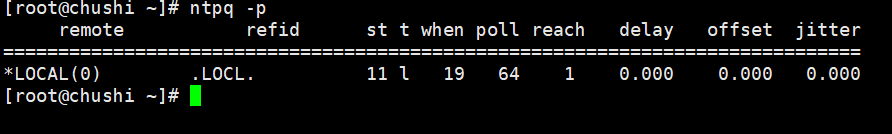

# ntpd服务搭建


## 一、配置server端


+ 安装ntp服务

```java
yum install -y ntp
```

+ 备份NTP文件

```java
mv /etc/ntp.conf /etc/ntp.conf.bak
```

+ 修改配置文件: 

```java
vim /etc/ntp.conf 添加以下两行（意将本机作为NTP服务端）
```

```java
server 127.127.1.0
fudge 127.127.1.0 stratum 11
```

+ 启动NTP服务器

```java
systemctl start ntpd
```

+ 设置开机自启动

```java
systemctl enable ntpd
```

+ 执行ntpq -p 查看是否配置成功。（显示LOCL即成功）




## 二、配置client端


+ 安装ntp服

```java
yum install -y ntp
```

+ 备份NTP文件

```java
mv /etc/ntp.conf /etc/ntp.conf.bak
```

+ 修改配置文件

```java
vim /etc/ntp.conf
server 10.1.1.2      ## IP为NTP server端的IP
```

+ 启动前先ntpdate⼿动同步下时间，避免客户端与server端时间差过⼤，导致ntp不能同步。 

```java
ntpdate -u 10.1.1.2   
```

+ 启动NTP服务器

```java
systemctl start ntpd
```

+ 设置开机自启动

```java
systemctl enable ntpd
```

+ 查看是否时间同步(#如显示unsynchronised，**同步时间大概需要几分钟，几分钟后再次查看即可**)

```java
ntpstat 
```

下图即为成功


## 三、案例


+ 互联网区（`10.10.45.*`）时间服务器：202.127.45.1
+ 政务外网区（`10.2.5.*`）时间服务器：10.1.1.2 


